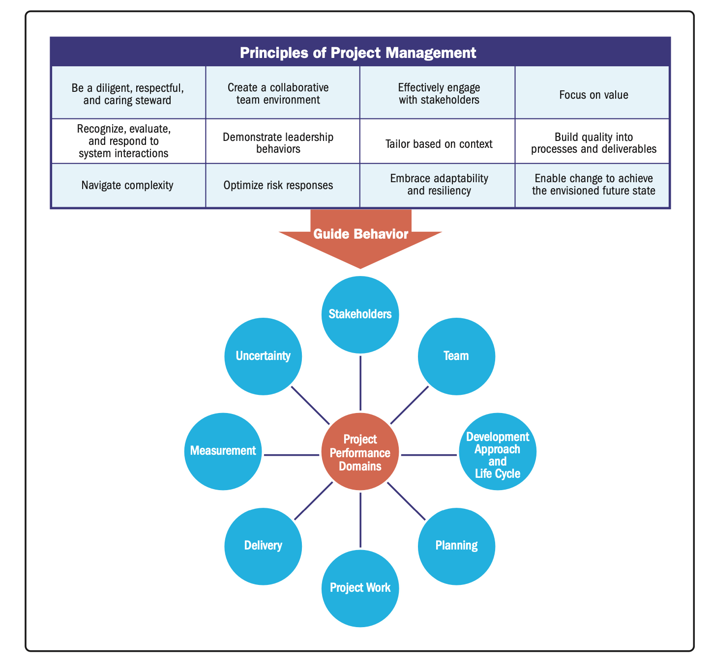
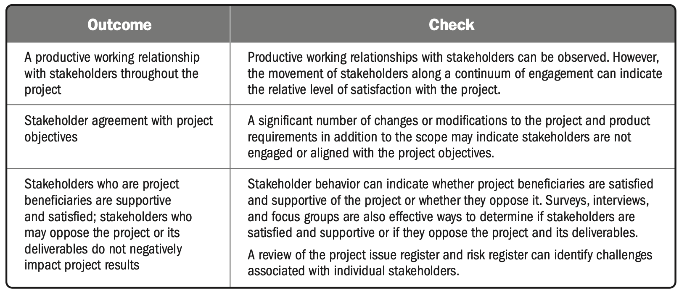

| English | Vietnamese |
|---------|------------|
| This section describes important information about A Guide to the Project Management Body of Knowledge (PMBOK® Guide) – Seventh Edition. It describes the relationship of the PMBOK® Guide to The Standard for Project Management [1], changes to the PMBOK® Guide, the relationship to PMIstandards+™ (PMI’s digital platform for standards), and provides a brief overview of the content. | Phần này mô tả những thông tin quan trọng về “Hướng dẫn Bộ Kiến thức Quản lý Dự án” (PMBOK® Guide) – Ấn bản lần thứ Bảy. Nội dung trình bày mối quan hệ giữa PMBOK® Guide và “Tiêu chuẩn Quản lý Dự án” [1], những thay đổi của PMBOK® Guide, mối liên hệ với PMIstandards+™ (nền tảng kỹ thuật số của PMI về các tiêu chuẩn), và cung cấp phần tổng quan ngắn gọn về nội dung. |
| English | Vietnamese |
|---------|------------|
| **1.1 STRUCTURE OF THE PMBOK® GUIDE** | **1.1 CẤU TRÚC CỦA PMBOK® GUIDE** |
| In addition to this Introduction, this edition of the PMBOK® Guide contains three sections: | Ngoài phần Giới thiệu này, ấn bản của PMBOK® Guide bao gồm ba phần: |
| ▶ Section 2 Project Performance Domains. This section identifies and describes eight project performance domains that form an integrated system to enable successful delivery of the project and intended outcomes. | ▶ **Phần 2: Các lĩnh vực hiệu suất dự án**. Phần này xác định và mô tả tám lĩnh vực hiệu suất dự án, tạo thành một hệ thống tích hợp nhằm đảm bảo thực hiện thành công dự án và đạt được kết quả mong muốn. |
| ▶ Section 3 Tailoring. This section describes what tailoring is and presents an overview of what to tailor and how to go about tailoring individual projects. | ▶ **Phần 3: Điều chỉnh theo hoàn cảnh**. Phần này mô tả khái niệm điều chỉnh và cung cấp tổng quan về những yếu tố cần điều chỉnh cũng như cách thực hiện điều chỉnh cho từng dự án cụ thể. |
| ▶ Section 4 Models, Methods, and Artifacts. This section presents a brief description of commonly used models, methods, and artifacts. These models, methods, and artifacts illustrate the range of options project teams can use to produce deliverables, organize work, and enable communication and collaboration. | ▶ **Phần 4: Mô hình, Phương pháp và Hiện vật**. Phần này giới thiệu ngắn gọn về các mô hình, phương pháp và hiện vật thường được sử dụng. Những yếu tố này minh họa phạm vi các lựa chọn mà nhóm dự án có thể áp dụng để tạo ra sản phẩm bàn giao, tổ chức công việc và thúc đẩy giao tiếp, hợp tác. |
| English | Vietnamese |
|---------|------------|
| **1.2 RELATIONSHIP OF THE PMBOK® GUIDE AND THE STANDARD FOR PROJECT MANAGEMENT** | **1.2 MỐI QUAN HỆ GIỮA PMBOK® GUIDE VÀ TIÊU CHUẨN QUẢN LÝ DỰ ÁN** |
| Work in the project performance domains is guided by the principles of project management. | Công việc trong các lĩnh vực hiệu suất dự án được định hướng bởi các nguyên tắc quản lý dự án. |
| As described in The Standard for Project Management [1], a principle is a fundamental norm, truth, or value. | Như được mô tả trong *Tiêu chuẩn Quản lý Dự án* [1], nguyên tắc là một chuẩn mực, sự thật hoặc giá trị cơ bản. |
| The principles for project management provide guidance for the behavior of people involved in projects as they influence and shape the performance domains to produce the intended outcomes. | Các nguyên tắc quản lý dự án đưa ra định hướng cho hành vi của những người tham gia dự án, khi họ tác động và định hình các lĩnh vực hiệu suất để tạo ra kết quả mong muốn. |
| While there is conceptual overlap between the principles and the performance domains, the principles guide behavior, while the performance domains present broad areas of focus in which to demonstrate that behavior. | Mặc dù có sự trùng lặp về mặt khái niệm giữa các nguyên tắc và các lĩnh vực hiệu suất, nhưng nguyên tắc định hướng hành vi, trong khi các lĩnh vực hiệu suất đưa ra những phạm vi trọng tâm rộng để thể hiện hành vi đó. |
| Figure 1-1 shows how the project management principles sit above the performance domains, providing guidance to activities in each performance domain. | Hình 1-1 minh họa cách các nguyên tắc quản lý dự án nằm trên các lĩnh vực hiệu suất, cung cấp định hướng cho các hoạt động trong từng lĩnh vực hiệu suất. |

| English | Vietnamese |
|---------|------------|
| **1.3 CHANGES TO THE PMBOK® GUIDE** | **1.3 NHỮNG THAY ĐỔI TRONG PMBOK® GUIDE** |
| This edition of the PMBOK® Guide focuses on delivering outcomes regardless of the approach used by the project team. | Ấn bản này của PMBOK® Guide tập trung vào việc đạt được kết quả, bất kể phương pháp mà nhóm dự án sử dụng. |
| However, project practitioners using the PMBOK® Guide also benefit from some level of understanding of how to deliver projects. | Tuy nhiên, những người làm nghề quản lý dự án sử dụng PMBOK® Guide cũng được lợi khi có một mức độ hiểu biết nhất định về cách triển khai dự án. |
| This edition is very different from the inputs, tools/techniques, and outputs (ITTOs) from previous editions of the PMBOK® Guide. | Ấn bản này rất khác so với các yếu tố đầu vào, công cụ/kỹ thuật, và đầu ra (ITTOs) của các ấn bản PMBOK® Guide trước đây. |
| In the previous editions, the ITTOs supported implementation of various processes used in project management. | Trong các ấn bản trước, ITTOs hỗ trợ việc triển khai các quy trình khác nhau được sử dụng trong quản lý dự án. |
| The shift from a process-based standard to one based on principles necessitates a different approach for thinking about the various aspects of project management. | Sự chuyển đổi từ tiêu chuẩn dựa trên quy trình sang tiêu chuẩn dựa trên nguyên tắc đòi hỏi một cách tiếp cận khác để suy nghĩ về các khía cạnh khác nhau của quản lý dự án. |
| Thus, the project performance domains represent a group of related activities that are critical for the effective delivery of project outcomes. | Do đó, các lĩnh vực hiệu suất dự án đại diện cho một nhóm các hoạt động có liên quan, đóng vai trò then chốt cho việc đạt được kết quả dự án hiệu quả. |
| There are eight project performance domains in this guide. | Có tám lĩnh vực hiệu suất dự án trong hướng dẫn này. |
| Tailoring is the deliberate adaptation of the project management approach, governance, and processes to make them more suitable for the given environment and the work at hand. | Tùy chỉnh là sự điều chỉnh có chủ đích phương pháp quản lý dự án, cơ chế quản trị và quy trình để phù hợp hơn với môi trường cụ thể và công việc cần thực hiện. |
| The tailoring process is driven by the guiding project management principles, organizational values, and organizational culture. | Quá trình tùy chỉnh được dẫn dắt bởi các nguyên tắc quản lý dự án, giá trị tổ chức và văn hóa tổ chức. |
| In embracing the full spectrum of project approaches, this edition of the PMBOK® Guide recognizes that no publication can capture every tool, technique, or practice that project teams might use. | Khi bao quát toàn bộ phổ phương pháp quản lý dự án, ấn bản này của PMBOK® Guide thừa nhận rằng không một ấn phẩm nào có thể bao quát toàn bộ công cụ, kỹ thuật hoặc thực tiễn mà nhóm dự án có thể sử dụng. |
| Therefore, this edition presents an array of commonly used models, methods, and artifacts that project practitioners can use to accomplish their work. | Do đó, ấn bản này giới thiệu một loạt các mô hình, phương pháp và tài liệu thường được sử dụng để các nhà quản lý dự án có thể áp dụng vào công việc của mình. |
| **1.4 RELATIONSHIP TO PMIstandards+** | **1.4 MỐI QUAN HỆ VỚI PMIstandards+** |
| Information in this guide is further elaborated on PMIstandards+, PMI’s digital content platform. | Thông tin trong hướng dẫn này được trình bày chi tiết hơn trên PMIstandards+, nền tảng nội dung số của PMI. |
| The digital platform encompasses current and emerging practices and other useful information related to PMI’s library of standards products. | Nền tảng kỹ thuật số này bao gồm các thực tiễn hiện tại và mới nổi, cùng các thông tin hữu ích khác liên quan đến thư viện tiêu chuẩn của PMI. |
| It also includes practical examples of application within various contexts and industry segments. | Nó cũng bao gồm các ví dụ thực tiễn về ứng dụng trong nhiều bối cảnh và lĩnh vực ngành nghề khác nhau. |
| PMIstandards+ evolved in response to advances and changes in how projects can be delivered. | PMIstandards+ đã phát triển để đáp ứng với sự tiến bộ và thay đổi trong cách thức triển khai dự án. |
| It offers a dynamic body of knowledge with real-time access and in-depth information that is aligned to PMI standards and carefully vetted by a panel of subject matter experts representing a wide range of expertise. | Nền tảng này cung cấp một hệ thống tri thức năng động với khả năng truy cập theo thời gian thực và thông tin chuyên sâu, phù hợp với các tiêu chuẩn PMI và được thẩm định kỹ lưỡng bởi hội đồng chuyên gia thuộc nhiều lĩnh vực khác nhau. |

