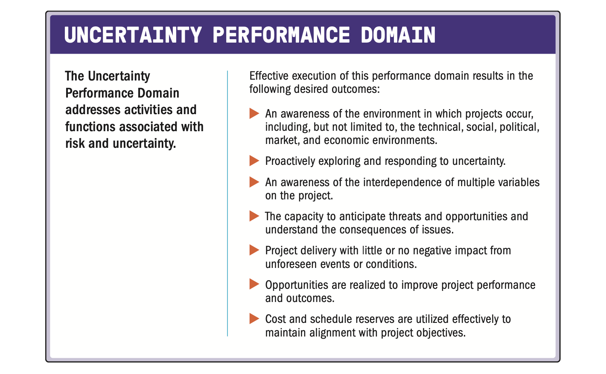

| English | Vietnamese |
|---------|------------|
| A project performance domain is a group of related activities that are critical for the effective delivery of project outcomes. | Một lĩnh vực hiệu suất dự án là một nhóm các hoạt động có liên quan, đóng vai trò then chốt cho việc đạt được kết quả dự án hiệu quả. |
| Project performance domains are interactive, interrelated, and interdependent areas of focus that work in unison to achieve desired project outcomes. | Các lĩnh vực hiệu suất dự án là những khu vực tập trung có tính tương tác, liên kết và phụ thuộc lẫn nhau, cùng hoạt động thống nhất để đạt được kết quả mong muốn của dự án. |
| There are eight project performance domains: | Có tám lĩnh vực hiệu suất dự án: |
| ▶ Stakeholders, | ▶ Các bên liên quan, |
| ▶ Team, | ▶ Nhóm dự án, |
| ▶ Development Approach and Life Cycle, | ▶ Phương pháp phát triển và vòng đời, |
| ▶ Planning, | ▶ Lập kế hoạch, |
| ▶ Project Work, | ▶ Công việc dự án, |
| ▶ Delivery, | ▶ Bàn giao, |
| ▶ Measurement, and | ▶ Đo lường, và |
| ▶ Uncertainty. | ▶ Sự không chắc chắn. |
| Together the performance domains form a unified whole. | Các lĩnh vực hiệu suất kết hợp với nhau tạo thành một tổng thể thống nhất. |
| In this way, the performance domains operate as an integrated system, with each performance domain being interdependent of the other performance domains to enable successful delivery of the project and its intended outcomes. | Theo cách này, các lĩnh vực hiệu suất hoạt động như một hệ thống tích hợp, trong đó mỗi lĩnh vực phụ thuộc lẫn nhau để đảm bảo dự án được triển khai thành công và đạt được kết quả mong muốn. |
| Performance domains run concurrently throughout the project, regardless of how value is delivered (frequently, periodically, or at the end of the project). | Các lĩnh vực hiệu suất diễn ra song song trong suốt dự án, bất kể giá trị được bàn giao theo cách nào (thường xuyên, định kỳ hoặc vào cuối dự án). |
| For example, project leads spend time focused on stakeholders, the project team, the project life cycle, the project work, and so forth, from the outset of the project to its closure. | Ví dụ, các trưởng dự án dành thời gian tập trung vào các bên liên quan, nhóm dự án, vòng đời dự án, công việc dự án, v.v., từ khi bắt đầu cho đến khi kết thúc dự án. |
| These areas of focus are not addressed as siloed efforts because they overlap and interconnect. | Những lĩnh vực tập trung này không được xử lý như các hoạt động riêng lẻ vì chúng chồng lấn và liên kết với nhau. |
| The ways in which the performance domains relate are different for each project, but they are present in every project. | Cách mà các lĩnh vực hiệu suất liên kết với nhau sẽ khác nhau ở mỗi dự án, nhưng chúng luôn tồn tại trong mọi dự án. |
| The specific activities undertaken within each of the performance domains are determined by the context of the organization, the project, deliverables, the project team, stakeholders, and other factors. | Các hoạt động cụ thể trong từng lĩnh vực hiệu suất được quyết định bởi bối cảnh của tổ chức, dự án, sản phẩm bàn giao, nhóm dự án, các bên liên quan và các yếu tố khác. |
| The performance domains are presented in the following sections without specific weighting or order. | Các lĩnh vực hiệu suất được trình bày trong các phần tiếp theo mà không có thứ tự hoặc trọng số cụ thể. |

| English | Vietnamese |
|---------|------------|
| The following definitions are relevant to the Stakeholder Performance Domain: | Các định nghĩa sau đây có liên quan đến Lĩnh vực hiệu suất về các bên liên quan: |
| Stakeholder. An individual, group, or organization that may affect, be affected by, or perceive itself to be affected by a decision, activity, or outcome of a project, program, or portfolio. | Bên liên quan. Một cá nhân, nhóm hoặc tổ chức có thể ảnh hưởng, bị ảnh hưởng, hoặc cho rằng mình bị ảnh hưởng bởi một quyết định, hoạt động hoặc kết quả của dự án, chương trình hoặc danh mục đầu tư. |
| Stakeholder Analysis. A method of systematically gathering and analyzing quantitative and qualitative information to determine whose interests should be taken into account throughout the project. | Phân tích bên liên quan. Một phương pháp thu thập và phân tích có hệ thống thông tin định lượng và định tính để xác định những lợi ích của ai cần được xem xét trong suốt quá trình dự án. |
| English | Vietnamese |
|---------|------------|
| Projects are performed by people and for people. This performance domain entails working with stakeholders to maintain alignment and engaging with them to foster positive relationships and satisfaction. | Các dự án được thực hiện bởi con người và vì con người. Lĩnh vực hiệu suất này liên quan đến việc làm việc với các bên liên quan để duy trì sự phù hợp và tương tác với họ nhằm thúc đẩy các mối quan hệ tích cực và sự hài lòng. |
| Stakeholders include individuals, groups, and organizations (see Figure 2-2). A project can have a small group of stakeholders or potentially millions of stakeholders. | Các bên liên quan bao gồm cá nhân, nhóm và tổ chức (xem Hình 2-2). Một dự án có thể chỉ có một nhóm nhỏ các bên liên quan hoặc có thể lên tới hàng triệu bên liên quan. |
| There may be different stakeholders in different phases of the project, and the influence, power, or interests of stakeholders may change as the project unfolds. | Có thể có các bên liên quan khác nhau ở các giai đoạn khác nhau của dự án, và mức độ ảnh hưởng, quyền lực hoặc lợi ích của các bên liên quan có thể thay đổi khi dự án tiến triển. |

| English | Vietnamese |
|---------|------------|
| Effective stakeholder identification, analysis, and engagement includes stakeholders who are internal and external to the organization, those who are supportive of the project, and those who may not be supportive or are neutral. | Việc xác định, phân tích và tương tác hiệu quả với các bên liên quan bao gồm cả những người ở bên trong và bên ngoài tổ chức, những người ủng hộ dự án, cũng như những người có thể không ủng hộ hoặc giữ thái độ trung lập. |
| While having relevant technical project management skills is an important aspect of successful projects, having the interpersonal and leadership skills to work effectively with stakeholders is just as important, if not more so. | Mặc dù có các kỹ năng quản lý dự án kỹ thuật phù hợp là một yếu tố quan trọng của các dự án thành công, nhưng có kỹ năng giao tiếp và lãnh đạo để làm việc hiệu quả với các bên liên quan cũng quan trọng không kém, thậm chí còn quan trọng hơn. |
| **2.1.1 STAKEHOLDER ENGAGEMENT** | **2.1.1 TƯƠNG TÁC VỚI CÁC BÊN LIÊN QUAN** |
| Stakeholder engagement includes implementing strategies and actions to promote productive involvement of stakeholders. | Tương tác với các bên liên quan bao gồm việc triển khai các chiến lược và hành động nhằm thúc đẩy sự tham gia hiệu quả của các bên liên quan. |
| Stakeholder engagement activities start before or when the project starts and continue throughout the project. | Các hoạt động tương tác với các bên liên quan bắt đầu trước hoặc khi dự án bắt đầu và tiếp tục trong suốt quá trình thực hiện dự án. |

| English | Vietnamese |
|---------|------------|
| Defining and sharing a clear vision at the start of the project can enable good relationships and alignment throughout the project. | Việc xác định và chia sẻ một tầm nhìn rõ ràng ngay từ đầu dự án có thể giúp xây dựng mối quan hệ tốt và duy trì sự thống nhất trong suốt quá trình thực hiện dự án. |
| Establishing a clear vision that key stakeholders agree on can entail some challenging negotiations, especially with stakeholders who are not necessarily in favor of the project or its intended outcomes. | Việc xây dựng một tầm nhìn rõ ràng được các bên liên quan chủ chốt đồng thuận có thể đòi hỏi những cuộc đàm phán khó khăn, đặc biệt là với những bên không nhất thiết ủng hộ dự án hoặc các kết quả mong muốn của nó. |
| As shown in Figure 2-3, there are several steps to engage stakeholders effectively. | Như minh họa trong Hình 2-3, có một số bước để tương tác hiệu quả với các bên liên quan. |
| **2.1.1.1 Identify** | **2.1.1.1 Xác định** |
| High-level stakeholder identification may be carried out prior to forming the project team. | Việc xác định các bên liên quan ở mức cao có thể được thực hiện trước khi thành lập nhóm dự án. |
| Detailed stakeholder identification progressively elaborates the initial work and is a continuous activity throughout the project. | Việc xác định chi tiết các bên liên quan sẽ dần mở rộng từ công việc ban đầu và là một hoạt động liên tục trong suốt dự án. |
| Some stakeholders are easy to identify, such as the customer, sponsor, project team, end users, and so forth, but others can be difficult to identify when they are not directly connected to the project. | Một số bên liên quan dễ xác định, chẳng hạn như khách hàng, nhà tài trợ, nhóm dự án, người dùng cuối, v.v., nhưng một số khác có thể khó xác định khi họ không trực tiếp liên kết với dự án. |
| **2.1.1.2 Understand and Analyze** | **2.1.1.2 Hiểu và Phân tích** |
| Once stakeholders are identified, the project manager and the project team should seek to understand stakeholders’ feelings, emotions, beliefs, and values. | Sau khi xác định được các bên liên quan, người quản lý dự án và nhóm dự án nên tìm hiểu cảm xúc, tình cảm, niềm tin và giá trị của họ. |
| These elements can lead to additional threats or opportunities for the project outcomes. | Những yếu tố này có thể dẫn đến các mối đe dọa hoặc cơ hội bổ sung cho kết quả của dự án. |
| They can also change quickly, and as such, understanding and analyzing stakeholders is an ongoing action. | Chúng cũng có thể thay đổi nhanh chóng, vì vậy việc hiểu và phân tích các bên liên quan là một hoạt động diễn ra liên tục. |
| Related to understanding the project stakeholders is the need to analyze aspects of each stakeholder’s position on and perspective of the project. | Liên quan đến việc hiểu các bên liên quan của dự án là nhu cầu phân tích các khía cạnh về lập trường và quan điểm của từng bên đối với dự án. |
| Analyzing stakeholders considers several stakeholder aspects, such as: | Phân tích các bên liên quan cần xem xét một số khía cạnh, chẳng hạn như: |
| ▶ Power, | ▶ Quyền lực, |
| ▶ Impact, | ▶ Tác động, |
| ▶ Attitude, | ▶ Thái độ, |
| ▶ Beliefs, | ▶ Niềm tin, |
| ▶ Expectations, | ▶ Kỳ vọng, |
| ▶ Degree of influence, | ▶ Mức độ ảnh hưởng, |
| ▶ Proximity to the project, | ▶ Mức độ gần gũi với dự án, |
| ▶ Interest in the project, and | ▶ Sự quan tâm đến dự án, và |
| ▶ Other aspects surrounding stakeholder interaction with the project. | ▶ Các khía cạnh khác liên quan đến sự tương tác của bên liên quan với dự án. |
| English | Vietnamese |
|---------|------------|
| This information helps the project team consider interactions that may influence the motivations, actions, and behaviors of stakeholders. | Thông tin này giúp nhóm dự án xem xét các tương tác có thể ảnh hưởng đến động lực, hành động và hành vi của các bên liên quan. |
| In addition to individual analysis, the project team should consider how stakeholders interact with each other, as they often form alliances that help or hinder the project’s objectives. | Ngoài việc phân tích từng cá nhân, nhóm dự án nên xem xét cách các bên liên quan tương tác với nhau, vì họ thường hình thành các liên minh hỗ trợ hoặc cản trở mục tiêu của dự án. |
| For example, if the project team believes a key business manager is highly influential but has negative perceptions related to the project, they can explore how to detect the business manager’s perceptions and respond appropriately as the project unfolds. | Ví dụ, nếu nhóm dự án tin rằng một quản lý kinh doanh chủ chốt có ảnh hưởng lớn nhưng lại có quan điểm tiêu cực về dự án, họ có thể tìm cách phát hiện quan điểm của người này và phản ứng phù hợp khi dự án tiến triển. |
| In all cases, the analysis work should be held in confidence by the project team since the information could be misinterpreted outside the context for the analysis. | Trong mọi trường hợp, công việc phân tích cần được nhóm dự án bảo mật vì thông tin có thể bị hiểu sai khi đặt ngoài bối cảnh phân tích. |
| **2.1.1.3 Prioritize** | **2.1.1.3 Ưu tiên** |
| On many projects, there are too many stakeholders involved for the project team to engage directly or effectively with all of them. | Trong nhiều dự án, có quá nhiều bên liên quan tham gia khiến nhóm dự án không thể tương tác trực tiếp hoặc hiệu quả với tất cả. |
| Based on its analysis, the project team can complete an initial prioritization of stakeholders. | Dựa trên phân tích, nhóm dự án có thể thực hiện việc ưu tiên ban đầu đối với các bên liên quan. |
| It is common to focus on stakeholders with the most power and interest as one way to prioritize engagement. | Thông thường, việc tập trung vào các bên liên quan có quyền lực và mức độ quan tâm cao nhất là một cách để ưu tiên tương tác. |
| As events unfold throughout the project, the project team may need to reprioritize based on new stakeholders or evolving changes in the stakeholder landscape. | Khi các sự kiện diễn ra trong suốt dự án, nhóm dự án có thể cần ưu tiên lại dựa trên các bên liên quan mới hoặc những thay đổi đang diễn ra trong bối cảnh các bên liên quan. |
| **2.1.1.4 Engage** | **2.1.1.4 Tương tác** |
| Stakeholder engagement entails working collaboratively with stakeholders to introduce the project, elicit their requirements, manage expectations, resolve issues, negotiate, prioritize, problem solve, and make decisions. | Tương tác với các bên liên quan bao gồm làm việc hợp tác để giới thiệu dự án, thu thập yêu cầu của họ, quản lý kỳ vọng, giải quyết vấn đề, đàm phán, ưu tiên, xử lý vấn đề và đưa ra quyết định. |
| Engaging stakeholders requires the application of soft skills, such as active listening, interpersonal skills, and conflict management, as well as leadership skills such as establishing the vision and critical thinking. | Việc tương tác với các bên liên quan đòi hỏi kỹ năng mềm như lắng nghe tích cực, kỹ năng giao tiếp, quản lý xung đột, cũng như kỹ năng lãnh đạo như xây dựng tầm nhìn và tư duy phản biện. |
| Communication with stakeholders can take place via written or verbal means, and it can be formal or informal. | Việc giao tiếp với các bên liên quan có thể diễn ra thông qua hình thức viết hoặc nói, và có thể chính thức hoặc không chính thức. |
| Examples of each type of communication are shown in Table 2-1. | Ví dụ của từng loại hình giao tiếp được trình bày trong Bảng 2-1. |

| English | Vietnamese |
|---------|------------|
| Communication methods include push, pull, and interactive communication: | Các phương thức giao tiếp bao gồm giao tiếp đẩy, kéo và tương tác: |
| ▶ Push. Communication sent to stakeholders such as memos, emails, status reports, voice mail, and so forth. | ▶ Đẩy (Push): Giao tiếp được gửi đến các bên liên quan như bản ghi nhớ, email, báo cáo trạng thái, thư thoại, v.v. |
| Push communication is used for one-way communications with individual stakeholders or groups of stakeholders. | Giao tiếp đẩy được sử dụng cho hình thức giao tiếp một chiều với từng cá nhân hoặc nhóm các bên liên quan. |
| Push communication inhibits the ability to immediately gauge reaction and assess understanding; therefore, it should be used deliberately. | Giao tiếp đẩy hạn chế khả năng đánh giá ngay lập tức phản ứng và mức độ hiểu của người nhận; do đó, cần sử dụng một cách có chủ đích. |
| ▶ Pull. Information sought by the stakeholder, such as a project team member going to an intranet to find communication policies or templates, running internet searches, and using online repositories. | ▶ Kéo (Pull): Thông tin được tìm kiếm bởi các bên liên quan, chẳng hạn như thành viên nhóm dự án truy cập vào mạng nội bộ để tìm chính sách hoặc mẫu giao tiếp, tìm kiếm trên internet, hoặc sử dụng kho lưu trữ trực tuyến. |
| Pulling information is used for indirect sensing of stakeholder concerns. | Việc kéo thông tin được dùng để gián tiếp nắm bắt mối quan tâm của các bên liên quan. |
| Engagement goes deeper than pushing or pulling communication. Engagement is interactive. | Sự tương tác sâu hơn so với giao tiếp đẩy hoặc kéo. Tương tác là hình thức giao tiếp hai chiều. |
| It includes an exchange of information with one or more stakeholders such as conversations, phone calls, meetings, brainstorming, product demos, and the like. | Nó bao gồm việc trao đổi thông tin với một hoặc nhiều bên liên quan như trò chuyện, gọi điện, họp, động não, trình diễn sản phẩm, v.v. |
| With all forms of communication, quick feedback loops provide useful information to: | Với mọi hình thức giao tiếp, các vòng phản hồi nhanh cung cấp thông tin hữu ích để: |
| ▶ Confirm the degree to which the stakeholder(s) heard the message. | ▶ Xác nhận mức độ mà các bên liên quan đã nghe và hiểu thông điệp. |
| ▶ Determine if stakeholders agree with the message. | ▶ Xác định liệu các bên liên quan có đồng ý với thông điệp hay không. |
| ▶ Identify nuanced or other unintended messages the recipient detected. | ▶ Xác định các thông điệp tinh tế hoặc ngoài ý muốn mà người nhận cảm nhận được. |
| ▶ Gain other helpful insights. | ▶ Thu thập thêm những hiểu biết hữu ích khác. |
| English | Vietnamese |
|---------|------------|
| **2.1.1.5 Monitor** | **2.1.1.5 Giám sát** |
| Throughout the project, stakeholders will change as new stakeholders are identified and others cease to be stakeholders. | Trong suốt dự án, các bên liên quan sẽ thay đổi khi có các bên liên quan mới được xác định và những bên khác không còn là bên liên quan nữa. |
| As the project progresses, the attitude or power of some stakeholders may change. | Khi dự án tiến triển, thái độ hoặc quyền lực của một số bên liên quan có thể thay đổi. |
| In addition to identifying and analyzing new stakeholders, there is an opportunity to assess whether the current engagement strategy is effective or if it needs to be adjusted. | Bên cạnh việc xác định và phân tích các bên liên quan mới, đây cũng là cơ hội để đánh giá xem chiến lược tương tác hiện tại có hiệu quả hay không hoặc cần điều chỉnh. |
| Therefore, the amount and effectiveness of stakeholder engagement is monitored throughout the project. | Do đó, mức độ và hiệu quả của sự tham gia của các bên liên quan được giám sát trong suốt dự án. |
| The degree of stakeholder satisfaction can often be determined by having a conversation with stakeholders to gauge their satisfaction with the project deliverables and the overall management of the project. | Mức độ hài lòng của các bên liên quan thường có thể được xác định bằng cách trò chuyện với họ để đánh giá sự hài lòng đối với các sản phẩm bàn giao và việc quản lý tổng thể của dự án. |
| Project and iteration reviews, product reviews, stage gates, and other methods are ways to obtain periodic feedback. | Việc rà soát dự án và các vòng lặp, rà soát sản phẩm, các cổng giai đoạn, và các phương pháp khác là những cách để thu thập phản hồi định kỳ. |
| For large groups of stakeholders, a survey can be used to assess the degree of satisfaction. | Đối với các nhóm bên liên quan lớn, khảo sát có thể được sử dụng để đánh giá mức độ hài lòng. |
| Where necessary, the stakeholder engagement approach can be updated to achieve higher stakeholder satisfaction. | Khi cần thiết, phương pháp tương tác với các bên liên quan có thể được cập nhật để đạt được mức độ hài lòng cao hơn. |
| **2.1.2 Interactions with Other Performance Domains** | **2.1.2 Tương tác với các miền hiệu suất khác** |
| Stakeholders permeate all aspects of the project. | Các bên liên quan thâm nhập vào mọi khía cạnh của dự án. |
| They define and prioritize the requirements and scope for the project team. | Họ xác định và ưu tiên các yêu cầu và phạm vi cho nhóm dự án. |
| They participate in and shape the planning. | Họ tham gia và định hình việc lập kế hoạch. |
| They determine acceptance and quality criteria for the project deliverables and outcomes. | Họ xác định tiêu chí chấp nhận và chất lượng cho các sản phẩm bàn giao và kết quả của dự án. |
| Much of the project work is around engaging and communicating with stakeholders. | Phần lớn công việc của dự án xoay quanh việc tương tác và giao tiếp với các bên liên quan. |
| Throughout the project or at its closure, they use the project deliverables and influence the realization of project outcomes. | Trong suốt dự án hoặc khi kết thúc, họ sử dụng các sản phẩm bàn giao và ảnh hưởng đến việc hiện thực hóa kết quả dự án. |
| Some stakeholders can assist in lowering the amount of uncertainty present on a project while others may cause an increase in uncertainty. | Một số bên liên quan có thể giúp giảm mức độ không chắc chắn trong dự án, trong khi những bên khác có thể làm tăng sự không chắc chắn đó. |
| Stakeholders such as customers, senior management, project management office leads, or program managers will focus on measures of performance for the project and its deliverables. | Các bên liên quan như khách hàng, ban lãnh đạo cấp cao, trưởng văn phòng quản lý dự án hoặc các nhà quản lý chương trình sẽ tập trung vào các thước đo hiệu suất của dự án và các sản phẩm bàn giao. |
| These interactions are samples of how the Stakeholder Performance Domain integrates and interweaves with other performance domains, though they are not inclusive of all the ways stakeholder concerns interact throughout the performance domains. | Những tương tác này là ví dụ về cách Miền Hiệu Suất Bên Liên Quan tích hợp và đan xen với các miền hiệu suất khác, mặc dù chúng không bao gồm tất cả các cách mà mối quan tâm của bên liên quan tương tác trong suốt các miền hiệu suất. |
| English | Vietnamese |
|---------|------------|
| 2.1.3 CHECKING RESULTS | 2.1.3 KIỂM TRA KẾT QUẢ |
| Table 2-2 identifies the outcomes on the left and ways of checking them on the right. | Bảng 2-2 xác định các kết quả ở bên trái và các cách kiểm tra chúng ở bên phải. |

| English | Vietnamese |
|---------|------------|
| This performance domain entails establishing the culture and environment that enables a collection of diverse individuals to evolve into a high-performing project team. | Miền hiệu suất này bao gồm việc thiết lập văn hóa và môi trường cho phép một tập hợp các cá nhân đa dạng phát triển thành một nhóm dự án có hiệu suất cao. |
| This includes recognizing the activities needed to foster project team development and encouraging leadership behaviors from all project team members. | Điều này bao gồm việc nhận biết các hoạt động cần thiết để thúc đẩy sự phát triển của nhóm dự án và khuyến khích hành vi lãnh đạo từ tất cả các thành viên trong nhóm dự án. |
| English | Vietnamese |
|---------|------------|
| The following definitions are relevant to the Team Performance Domain: | Các định nghĩa sau đây liên quan đến Miền hiệu suất của nhóm: |
| Project Manager. The person assigned by the performing organization to lead the project team that is responsible for achieving the project objectives. | Quản lý dự án. Người được tổ chức thực hiện chỉ định để dẫn dắt nhóm dự án chịu trách nhiệm đạt được các mục tiêu của dự án. |
| Project Management Team. The members of the project team who are directly involved in project management activities. | Nhóm quản lý dự án. Các thành viên của nhóm dự án tham gia trực tiếp vào các hoạt động quản lý dự án. |
| Project Team. A set of individuals performing the work of the project to achieve its objectives. | Nhóm dự án. Một tập hợp các cá nhân thực hiện công việc của dự án để đạt được các mục tiêu của nó. |
| English | Vietnamese |
|---------|------------|
| **2.2.1 PROJECT TEAM MANAGEMENT AND LEADERSHIP** | **2.2.1 QUẢN LÝ VÀ LÃNH ĐẠO NHÓM DỰ ÁN** |
| Project management entails applying knowledge, skills, tools, and techniques for management activities as well as leadership activities. | Quản lý dự án bao gồm việc áp dụng kiến thức, kỹ năng, công cụ và kỹ thuật cho các hoạt động quản lý cũng như các hoạt động lãnh đạo. |
| Management activities focus on the means of meeting project objectives, such as having effective processes, planning, coordinating, measuring, and monitoring work, among others. | Các hoạt động quản lý tập trung vào cách thức đạt được mục tiêu của dự án, chẳng hạn như có các quy trình hiệu quả, lập kế hoạch, điều phối, đo lường và giám sát công việc, cùng những hoạt động khác. |
| Leadership activities focus on people. Leadership includes influencing, motivating, listening, enabling, and other activities having to do with the project team. | Các hoạt động lãnh đạo tập trung vào con người. Lãnh đạo bao gồm việc gây ảnh hưởng, tạo động lực, lắng nghe, hỗ trợ và các hoạt động khác liên quan đến nhóm dự án. |
| Both are important in delivering the intended outcomes. | Cả hai đều quan trọng trong việc mang lại các kết quả dự kiến. |
| **2.2.1.1 Centralized Management and Leadership** | **2.2.1.1 Quản lý và Lãnh đạo Tập trung** |
| While leadership activities should be practiced by all project team members, management activities may be centralized or distributed. | Mặc dù các hoạt động lãnh đạo nên được tất cả các thành viên nhóm dự án thực hiện, nhưng các hoạt động quản lý có thể được tập trung hoặc phân tán. |
| In an environment where management activities are centralized, accountability (being answerable for an outcome) is usually assigned to one individual, such as the project manager or similar role. | Trong môi trường mà các hoạt động quản lý được tập trung, trách nhiệm (chịu trách nhiệm cho một kết quả) thường được giao cho một cá nhân, chẳng hạn như quản lý dự án hoặc vai trò tương tự. |
| In these situations, a project charter or other authorizing document can provide approval for the project manager to form a project team to achieve the project outcomes. | Trong những tình huống này, điều lệ dự án hoặc tài liệu ủy quyền khác có thể cung cấp sự phê duyệt cho quản lý dự án để thành lập nhóm dự án nhằm đạt được kết quả dự án. |
| **2.2.1.2 Distributed Management and Leadership** | **2.2.1.2 Quản lý và Lãnh đạo Phân tán** |
| Sometimes project management activities are shared among a project management team, and project team members are responsible for completing the work. | Đôi khi các hoạt động quản lý dự án được chia sẻ trong một nhóm quản lý dự án, và các thành viên nhóm dự án chịu trách nhiệm hoàn thành công việc. |
| There are also situations where a project team may self-organize to complete a project. | Cũng có những tình huống mà nhóm dự án có thể tự tổ chức để hoàn thành một dự án. |
| Rather than having a designated project manager, someone within the project team may serve as facilitator to enable communication, collaboration, and engagement. | Thay vì có một quản lý dự án được chỉ định, một người trong nhóm dự án có thể đóng vai trò điều phối viên để thúc đẩy giao tiếp, hợp tác và gắn kết. |
| This role may shift among project team members. | Vai trò này có thể được luân chuyển giữa các thành viên nhóm dự án. |
| Servant leadership is a style of leadership that focuses on understanding and addressing the needs and development of project team members in order to enable the highest possible project team performance. | Lãnh đạo phục vụ là một phong cách lãnh đạo tập trung vào việc thấu hiểu và đáp ứng nhu cầu cũng như sự phát triển của các thành viên nhóm dự án nhằm đạt được hiệu suất nhóm dự án cao nhất có thể. |
| Servant leaders place emphasis on developing project team members to their highest potential by focusing on addressing questions, such as: | Các nhà lãnh đạo phục vụ đặt trọng tâm vào việc phát triển các thành viên nhóm dự án đến tiềm năng cao nhất của họ bằng cách tập trung vào việc trả lời các câu hỏi như: |
| ▶ Are project team members growing as individuals? | ▶ Các thành viên nhóm dự án có đang phát triển với tư cách cá nhân không? |
| ▶ Are project team members becoming healthier, wiser, freer, and more autonomous? | ▶ Các thành viên nhóm dự án có trở nên khỏe mạnh hơn, khôn ngoan hơn, tự do hơn và tự chủ hơn không? |
| ▶ Are project team members more likely to become servant leaders? | ▶ Các thành viên nhóm dự án có khả năng trở thành các nhà lãnh đạo phục vụ hơn không? |
| English | Vietnamese |
|---------|------------|
| Servant leaders allow project teams to self-organize when possible and increase levels of autonomy by passing appropriate decision-making opportunities to project team members. | Các nhà lãnh đạo phục vụ cho phép các nhóm dự án tự tổ chức khi có thể và tăng mức độ tự chủ bằng cách trao cơ hội ra quyết định phù hợp cho các thành viên nhóm dự án. |
| Servant leadership behaviors include: | Các hành vi lãnh đạo phục vụ bao gồm: |
| ▶ Obstacle removal. Since it is the project team who generates the majority of business value, a critical role for the servant leader is to maximize delivery by removing impediments to their progress. This includes solving problems and removing obstacles that may be hampering the project team’s work. By solving or easing these impediments, the project team can deliver value to the business faster. | ▶ Loại bỏ chướng ngại. Vì nhóm dự án tạo ra phần lớn giá trị kinh doanh, một vai trò quan trọng của nhà lãnh đạo phục vụ là tối đa hóa khả năng giao hàng bằng cách loại bỏ những trở ngại đối với tiến độ của họ. Điều này bao gồm việc giải quyết vấn đề và loại bỏ các chướng ngại có thể cản trở công việc của nhóm dự án. Bằng cách giải quyết hoặc giảm bớt những trở ngại này, nhóm dự án có thể mang lại giá trị cho doanh nghiệp nhanh hơn. |
| ▶ Diversion shield. Servant leaders protect the project team from internal and external diversions that redirect the project team from the current objectives. Time fragmentation reduces productivity, so shielding the project team from noncritical, external demands helps the project team stay focused. | ▶ Lá chắn phân tán. Các nhà lãnh đạo phục vụ bảo vệ nhóm dự án khỏi những sự phân tán nội bộ và bên ngoài có thể khiến nhóm dự án lệch khỏi các mục tiêu hiện tại. Việc phân mảnh thời gian làm giảm năng suất, vì vậy việc bảo vệ nhóm dự án khỏi những yêu cầu không quan trọng từ bên ngoài giúp nhóm tập trung hơn. |
| ▶ Encouragement and development opportunities. The servant leader also provides tools and encouragement to keep the project team satisfied and productive. Learning what motivates project team members as individuals and finding ways to reward them for good work helps keep project team members satisfied. | ▶ Khuyến khích và cơ hội phát triển. Nhà lãnh đạo phục vụ cũng cung cấp công cụ và sự khích lệ để giữ cho nhóm dự án hài lòng và năng suất. Việc tìm hiểu điều gì thúc đẩy các thành viên nhóm dự án với tư cách cá nhân và tìm cách khen thưởng họ khi làm việc tốt giúp duy trì sự hài lòng của các thành viên. |
| **2.2.1.3 Common Aspects of Team Development** | **2.2.1.3 Các khía cạnh chung của phát triển nhóm** |
| Regardless of how the management activities are structured, there are common aspects of project team development that are relevant for most project teams. These include: | Bất kể các hoạt động quản lý được tổ chức như thế nào, vẫn có những khía cạnh chung của việc phát triển nhóm dự án phù hợp với hầu hết các nhóm. Bao gồm: |
| ▶ Vision and objectives. It is essential that everyone is aware of the project vision and objectives. The vision and objectives are communicated throughout the project. This includes referencing the intended outcomes when the project team is engaged in making decisions and solving problems. | ▶ Tầm nhìn và mục tiêu. Điều cần thiết là mọi người đều phải nhận thức được tầm nhìn và mục tiêu của dự án. Tầm nhìn và mục tiêu được truyền đạt xuyên suốt dự án, bao gồm việc tham chiếu các kết quả mong muốn khi nhóm dự án tham gia vào việc ra quyết định và giải quyết vấn đề. |
| ▶ Roles and responsibilities. It is important to make sure project team members understand and fulfill their roles and responsibilities. This can include identifying gaps in knowledge and skills as well as strategies to address those gaps through training, mentoring, or coaching. | ▶ Vai trò và trách nhiệm. Điều quan trọng là phải đảm bảo các thành viên nhóm dự án hiểu và thực hiện đúng vai trò và trách nhiệm của mình. Điều này có thể bao gồm việc xác định khoảng trống về kiến thức và kỹ năng, cũng như các chiến lược để giải quyết khoảng trống đó thông qua đào tạo, cố vấn hoặc huấn luyện. |
| English | Vietnamese |
|---------|------------|
| ▶ Project team operations. Facilitating project team communication, problem solving, and the process of coming to consensus may include working with the project team to develop a project team charter and a set of operating guidelines or project team norms. | ▶ Hoạt động của nhóm dự án. Việc hỗ trợ giao tiếp, giải quyết vấn đề và quá trình đi đến đồng thuận của nhóm dự án có thể bao gồm làm việc với nhóm để xây dựng điều lệ nhóm dự án và một bộ hướng dẫn vận hành hoặc các chuẩn mực nhóm dự án. |
| ▶ Guidance. Guidance can be directed to the overall project team to keep everyone headed in the right direction. Individual project team members may also provide guidance on a particular task or deliverable. | ▶ Hướng dẫn. Hướng dẫn có thể được đưa ra cho toàn bộ nhóm dự án để giữ mọi người đi đúng hướng. Các thành viên riêng lẻ của nhóm cũng có thể đưa ra hướng dẫn cho một nhiệm vụ hoặc sản phẩm bàn giao cụ thể. |
| ▶ Growth. Identifying areas where the project team is performing well and pointing out areas where the project team can improve helps the project team to grow. Working collaboratively, the project team can identify goals for its improvement and take steps to meet those goals. This also applies to each individual on the project team. Individuals may want to grow their skills and experience in certain areas, and the project manager can assist with that. | ▶ Phát triển. Việc xác định các lĩnh vực mà nhóm dự án đang hoạt động tốt và chỉ ra các lĩnh vực cần cải thiện giúp nhóm phát triển. Khi làm việc hợp tác, nhóm có thể xác định các mục tiêu cải thiện và thực hiện các bước để đạt được mục tiêu đó. Điều này cũng áp dụng cho từng cá nhân trong nhóm. Mỗi người có thể muốn nâng cao kỹ năng và kinh nghiệm của mình trong một số lĩnh vực nhất định, và quản lý dự án có thể hỗ trợ việc đó. |
| There are several models that describe the stages of project team growth included in Section 4. | Có một số mô hình mô tả các giai đoạn phát triển của nhóm dự án được trình bày trong Mục 4. |
| English | Vietnamese |
|---------|------------|
| When project teams form across different organizations based on a contract, strategic partnership, or other business relationship, specific roles that perform various functions may be more formalized and less flexible depending on the contract or other terms. | Khi các nhóm dự án được hình thành giữa các tổ chức khác nhau dựa trên hợp đồng, quan hệ đối tác chiến lược hoặc mối quan hệ kinh doanh khác, các vai trò cụ thể thực hiện các chức năng khác nhau có thể được chính thức hóa hơn và kém linh hoạt hơn tùy thuộc vào hợp đồng hoặc các điều khoản khác. |
| Such arrangements often require more up-front work to establish a “one team” mindset, ensure project team members understand how everyone contributes to the project, and establish other enablers that integrate skills, capabilities, and processes. | Những sắp xếp như vậy thường đòi hỏi nhiều công việc chuẩn bị hơn để xây dựng tư duy “một nhóm”, đảm bảo các thành viên nhóm dự án hiểu rõ cách mọi người đóng góp cho dự án, và thiết lập các yếu tố hỗ trợ khác nhằm tích hợp kỹ năng, năng lực và quy trình. |
| English | Vietnamese |
|---------|------------|
| **2.2.2 PROJECT TEAM CULTURE** | **2.2.2 VĂN HÓA NHÓM DỰ ÁN** |
| Each project team develops its own team culture. | Mỗi nhóm dự án phát triển văn hóa nhóm riêng của mình. |
| The project team’s culture may be established deliberately by developing project team norms, or informally through the behaviors and actions of its project team members. | Văn hóa của nhóm dự án có thể được xây dựng một cách có chủ đích bằng cách phát triển các chuẩn mực của nhóm, hoặc hình thành một cách tự nhiên thông qua hành vi và hành động của các thành viên nhóm. |
| The project team culture operates within the organization’s culture but reflects the project team’s individual ways of working and interacting. | Văn hóa nhóm dự án hoạt động trong khuôn khổ văn hóa của tổ chức nhưng phản ánh cách làm việc và tương tác riêng của nhóm dự án. |
| English | Vietnamese |
|---------|------------|
| Human beings have a set of biases, some of them unconscious and some of them conscious. | Con người có một tập hợp các định kiến, một số là vô thức và một số là có ý thức. |
| For example, one person may feel that unless a schedule is displayed using a software-generated Gantt chart, that it is not a true or valid schedule. | Ví dụ, một người có thể cho rằng trừ khi lịch trình được hiển thị bằng biểu đồ Gantt tạo ra từ phần mềm thì đó mới là một lịch trình đúng hoặc hợp lệ. |
| Another person may have a contrasting bias that detailed planning any further out than 30 days is a waste of time. | Một người khác có thể có định kiến trái ngược rằng việc lập kế hoạch chi tiết vượt quá 30 ngày là lãng phí thời gian. |
| Being open and transparent about biases up front establishes a culture of openness and trust that can enable consensus and collaboration. | Việc cởi mở và minh bạch về các định kiến ngay từ đầu giúp thiết lập một văn hóa cởi mở và tin tưởng, tạo điều kiện cho sự đồng thuận và hợp tác. |
| English | Vietnamese |
|---------|------------|
| The project manager is key in establishing and maintaining a safe, respectful, nonjudgmental environment that allows the project team to communicate openly. | Quản lý dự án đóng vai trò then chốt trong việc thiết lập và duy trì một môi trường an toàn, tôn trọng, không phán xét, cho phép nhóm dự án giao tiếp một cách cởi mở. |
| One way to accomplish this is by modeling desired behaviors, such as: | Một cách để đạt được điều này là làm gương cho các hành vi mong muốn, chẳng hạn như: |
| ▶ Transparency. Being transparent in how one thinks, makes choices, and processes information helps others identify and share their own processes. This can extend to being transparent about biases as well. | ▶ Minh bạch. Việc minh bạch trong cách suy nghĩ, đưa ra lựa chọn và xử lý thông tin giúp người khác nhận ra và chia sẻ quy trình của riêng họ. Điều này cũng có thể mở rộng đến việc minh bạch về các định kiến. |
| ▶ Integrity. Integrity is comprised of ethical behavior and honesty. Individuals demonstrate honesty by surfacing risks, communicating their assumptions and basis of estimates, delivering bad news early, ensuring status reports provide an accurate depiction of the project’s status, and in many other ways. Ethical behavior can include surfacing potential defects or negative effects in product design, disclosing potential conflicts of interest, ensuring fairness, and making decisions based on environmental, stakeholder, and financial impacts. | ▶ Chính trực. Chính trực bao gồm hành vi đạo đức và sự trung thực. Cá nhân thể hiện sự trung thực bằng cách nêu rõ các rủi ro, truyền đạt các giả định và cơ sở ước tính của mình, thông báo tin xấu sớm, đảm bảo báo cáo tình trạng phản ánh chính xác tình trạng dự án, và nhiều cách khác. Hành vi đạo đức có thể bao gồm việc nêu ra các khiếm khuyết hoặc tác động tiêu cực tiềm ẩn trong thiết kế sản phẩm, tiết lộ xung đột lợi ích tiềm tàng, đảm bảo tính công bằng, và đưa ra quyết định dựa trên các tác động về môi trường, các bên liên quan và tài chính. |
| English | Vietnamese |
|---------|------------|
| ▶ Respect. Demonstrating respect for each person, how the person thinks, the person’s skills, and the perspective and expertise the person brings to the project team sets the stage for all project team members to adopt this behavior. | ▶ Tôn trọng. Thể hiện sự tôn trọng đối với mỗi cá nhân, cách họ suy nghĩ, kỹ năng của họ, cũng như góc nhìn và chuyên môn mà họ mang đến cho nhóm dự án sẽ tạo tiền đề để tất cả các thành viên khác trong nhóm áp dụng hành vi này. |
| ▶ Positive discourse. Throughout the project, diverse opinions, different ways of approaching situations, and misunderstandings will occur. These are a normal part of conducting projects. They present an opportunity to have a dialogue rather than a debate. A dialogue entails working with others to resolve divergent opinions. The goal is to arrive at a resolution that all parties can embrace. A debate, on the other hand, is a win-lose scenario where people are more interested in winning personally than they are in being open to alternative solutions to a problem. | ▶ Trao đổi tích cực. Trong suốt dự án, sẽ có những ý kiến đa dạng, những cách tiếp cận khác nhau và những hiểu lầm. Đây là một phần bình thường của việc thực hiện dự án. Chúng tạo cơ hội để đối thoại thay vì tranh luận. Đối thoại là làm việc cùng nhau để giải quyết những ý kiến khác biệt, với mục tiêu đạt được giải pháp mà tất cả các bên đều có thể chấp nhận. Ngược lại, tranh luận là tình huống thắng-thua, nơi mọi người quan tâm nhiều hơn đến việc thắng cá nhân hơn là cởi mở với các giải pháp thay thế. |
| ▶ Support. Projects can be challenging from the perspectives of technical challenges, environmental influences, and interpersonal interactions. Supporting project team members through problem solving and removing impediments builds a supportive culture and leads to a trusting and collaborative environment. Support can also be demonstrated by providing encouragement, showing empathy, and engaging in active listening. | ▶ Hỗ trợ. Các dự án có thể gặp khó khăn về mặt kỹ thuật, ảnh hưởng môi trường, và tương tác giữa con người. Hỗ trợ các thành viên nhóm dự án thông qua giải quyết vấn đề và loại bỏ trở ngại sẽ xây dựng một văn hóa hỗ trợ và dẫn đến môi trường tin cậy, hợp tác. Sự hỗ trợ cũng có thể được thể hiện bằng cách khích lệ, thể hiện sự đồng cảm và lắng nghe tích cực. |
| ▶ Courage. Recommending a new approach to a problem or a way of working can be intimidating. Likewise, it can be challenging to disagree with a subject matter expert or someone with greater authority. However, demonstrating the courage that it takes to make a suggestion, disagree, or try something new enables a culture of experimentation and communicates to others that it is safe to be courageous and try new approaches. | ▶ Dũng cảm. Đề xuất một cách tiếp cận mới cho một vấn đề hoặc một phương pháp làm việc có thể gây e ngại. Tương tự, việc không đồng ý với chuyên gia hoặc người có thẩm quyền cao hơn có thể là một thách thức. Tuy nhiên, thể hiện sự dũng cảm để đưa ra đề xuất, bày tỏ ý kiến trái chiều hoặc thử điều gì đó mới sẽ thúc đẩy văn hóa thử nghiệm và cho người khác thấy rằng việc dũng cảm thử cách tiếp cận mới là an toàn. |
| ▶ Celebrating success. Focusing on project goals, challenges, and issues often sidelines the fact that individual project team members and the project team as a whole are steadily progressing toward those goals. Because work takes priority, project team members may defer recognizing demonstrations of innovation, adaptation, service to others, and learning. However, recognizing such contributions in real time can keep the project team and individuals motivated. | ▶ Ăn mừng thành công. Việc tập trung vào mục tiêu, thách thức và vấn đề của dự án thường làm lu mờ thực tế rằng các thành viên cá nhân và cả nhóm đang tiến bộ đều đặn hướng tới những mục tiêu đó. Do công việc được ưu tiên, các thành viên nhóm có thể trì hoãn việc ghi nhận các biểu hiện sáng tạo, thích ứng, phục vụ người khác và học hỏi. Tuy nhiên, việc ghi nhận những đóng góp này ngay lập tức có thể giúp duy trì động lực cho cả nhóm và từng cá nhân. |
| English | Vietnamese |
|---------|------------|
| 2.2.3 HIGH-PERFORMING PROJECT TEAMS | 2.2.3 NHÓM DỰ ÁN HOẠT ĐỘNG HIỆU QUẢ CAO |
| One goal of effective leadership is to create a high-performing project team. There are a number of factors that contribute to high-performing project teams. The list below is not comprehensive, but it identifies some of the factors associated with high-performing project teams. | Một mục tiêu của lãnh đạo hiệu quả là tạo ra một nhóm dự án hoạt động hiệu quả cao. Có nhiều yếu tố góp phần vào việc hình thành các nhóm như vậy. Danh sách dưới đây không bao gồm tất cả, nhưng nêu bật một số yếu tố liên quan đến nhóm dự án hiệu quả cao. |
| ▶ Open communication. An environment that fosters open and safe communication allows for productive meetings, problem solving, brainstorming, and so forth. It is also the cornerstone for other factors, such as shared understanding, trust, and collaboration. | ▶ Giao tiếp cởi mở. Môi trường thúc đẩy giao tiếp cởi mở và an toàn cho phép tổ chức các cuộc họp hiệu quả, giải quyết vấn đề, động não, v.v. Đây cũng là nền tảng cho các yếu tố khác như hiểu biết chung, sự tin tưởng và hợp tác. |
| ▶ Shared understanding. The purpose for the project and the benefits it will provide are held in common. | ▶ Hiểu biết chung. Mục tiêu của dự án và những lợi ích mà nó mang lại được mọi người cùng nắm rõ. |
| ▶ Shared ownership. The more ownership of the outcomes that project team members feel, the better they are likely to perform. | ▶ Cùng chia sẻ trách nhiệm. Các thành viên nhóm dự án càng cảm thấy mình có trách nhiệm với kết quả, họ càng có xu hướng làm việc hiệu quả hơn. |
| ▶ Trust. A project team in which its members trust each other is willing to go the extra distance to deliver success. People are less likely to do the extra work it may take to succeed if they do not trust their project team members, project manager, or the organization. | ▶ Tin tưởng. Một nhóm dự án mà các thành viên tin tưởng lẫn nhau sẽ sẵn sàng nỗ lực hơn để đạt được thành công. Ngược lại, nếu không có sự tin tưởng vào đồng đội, quản lý dự án hoặc tổ chức, mọi người sẽ ít sẵn lòng làm thêm để đạt kết quả. |
| ▶ Collaboration. Project teams that collaborate and work with each other rather than work in silos or compete tend to generate more diverse ideas and end up with better outcomes. | ▶ Hợp tác. Các nhóm dự án hợp tác và làm việc cùng nhau thay vì làm việc riêng lẻ hoặc cạnh tranh thường tạo ra nhiều ý tưởng đa dạng hơn và đạt được kết quả tốt hơn. |
| ▶ Adaptability. Project teams that are able to adapt the way they work to the environment and the situation are more effective. | ▶ Khả năng thích ứng. Các nhóm dự án có thể điều chỉnh cách làm việc để phù hợp với môi trường và tình huống sẽ hiệu quả hơn. |
| ▶ Resilience. When issues or failures occur, high-performing project teams recover quickly. | ▶ Khả năng phục hồi. Khi gặp sự cố hoặc thất bại, các nhóm dự án hiệu quả cao sẽ nhanh chóng phục hồi. |
| ▶ Empowerment. Project team members who feel empowered to make decisions about the way they work perform better than those who are micromanaged. | ▶ Trao quyền. Các thành viên nhóm dự án được trao quyền quyết định cách thức làm việc thường có hiệu suất tốt hơn so với những người bị quản lý quá sát sao. |
| ▶ Recognition. Project teams who are recognized for the work they put in and the performance they achieve are more likely to continue to perform well. Even the simple act of showing appreciation reinforces positive team behavior. | ▶ Ghi nhận. Các nhóm dự án được ghi nhận vì công sức và thành tích đạt được sẽ có xu hướng tiếp tục duy trì hiệu suất tốt. Ngay cả hành động đơn giản như bày tỏ sự cảm kích cũng củng cố hành vi tích cực của nhóm. |
| English | Vietnamese |
|---------|------------|
| 2.2.4 LEADERSHIP SKILLS | 2.2.4 KỸ NĂNG LÃNH ĐẠO |
| Leadership skills are useful for all project team members whether the project team is operating in an environment with a centralized authority or a shared leadership environment. The following sections describe some of the traits and activities associated with leadership. | Kỹ năng lãnh đạo hữu ích cho tất cả các thành viên nhóm dự án, cho dù nhóm dự án hoạt động trong môi trường có quyền hạn tập trung hay môi trường lãnh đạo chia sẻ. Các mục dưới đây mô tả một số đặc điểm và hoạt động liên quan đến lãnh đạo. |
| 2.2.4.1 Establishing and Maintaining Vision | 2.2.4.1 Thiết lập và duy trì tầm nhìn |
| Every project has a purpose. Understanding that purpose is critical for people to commit their time and energy in the right direction toward achieving the project purpose. The project vision summarizes the project’s purpose clearly and succinctly. It describes a realistic, attractive view of the future project outcomes. | Mỗi dự án đều có mục đích. Hiểu rõ mục đích đó là điều quan trọng để mọi người cam kết thời gian và năng lượng của họ đi theo hướng đúng để đạt được mục tiêu dự án. Tầm nhìn dự án tóm tắt mục đích của dự án một cách rõ ràng và ngắn gọn. Nó mô tả một cái nhìn thực tế và hấp dẫn về kết quả dự án trong tương lai. |
| In addition to briefly describing the desired future state, the vision is a powerful motivational tool. It is a way to create passion and meaning for a project’s envisioned goal. A common vision helps keep people pulling in the same direction. When immersed in the details of everyday work, a clear understanding of the end goal can help guide local decisions toward the desired project outcome. | Bên cạnh việc mô tả ngắn gọn trạng thái mong muốn trong tương lai, tầm nhìn là một công cụ tạo động lực mạnh mẽ. Nó là cách tạo đam mê và ý nghĩa cho mục tiêu dự kiến của dự án. Một tầm nhìn chung giúp mọi người kéo về cùng một hướng. Khi dấn sâu vào các chi tiết công việc hàng ngày, hiểu rõ mục tiêu cuối cùng có thể giúp hướng các quyết định địa phương về kết quả dự án mong muốn. |
| A vision developed collaboratively between project team members and key stakeholders should answer these questions: | Một tầm nhìn được phát triển một cách hợp tác giữa các thành viên nhóm dự án và các bên liên quan chính nên trả lời các câu hỏi sau: |
| ▶ What is the project purpose? | ▶ Mục đích của dự án là gì? |
| ▶ What defines successful project work? | ▶ Điều gì định nghĩa công việc dự án thành công? |
| ▶ How will the future be better when the project outcomes are delivered? | ▶ Tương lai sẽ tốt hơn như thế nào khi các kết quả dự án được hoàn thành? |
| ▶ How will the project team know that it is drifting from the vision? | ▶ Nhóm dự án sẽ biết như thế nào rằng họ đang lệch khỏi tầm nhìn? |
| A good vision is clear, concise, and actionable. It does the following: | Một tầm nhìn tốt phải rõ ràng, ngắn gọn và khả thi. Nó thực hiện các điều sau: |
| ▶ Summarizes the project with a powerful phrase or short description | ▶ Tóm tắt dự án bằng một cụm từ mạnh mẽ hoặc mô tả ngắn gọn |
| ▶ Describes the best achievable outcome | ▶ Mô tả kết quả khả thi tốt nhất |
| ▶ Creates a common, cohesive picture in project team members’ minds | ▶ Tạo ra một hình ảnh chung, gắn kết trong tâm trí các thành viên nhóm dự án |
| ▶ Inspires passion for the outcome | ▶ Khơi dậy đam mê đối với kết quả |
| English | Vietnamese |
|---------|------------|
| 2.2.4.2 Critical Thinking | 2.2.4.2 Tư duy phản biện |
| Throughout the various project performance domains, there is a need to recognize bias, identify the root cause of problems, and consider challenging issues, such as ambiguity, complexity, and so forth. Critical thinking helps to accomplish these activities. | Trong các lĩnh vực hiệu suất dự án khác nhau, cần nhận biết định kiến, xác định nguyên nhân gốc rễ của vấn đề, và xem xét các vấn đề thách thức, chẳng hạn như tính mơ hồ, phức tạp, v.v. Tư duy phản biện giúp thực hiện những hoạt động này. |
| Critical thinking includes disciplined, rational, logical, evidence-based thinking. It requires an open mind and the ability to analyze objectively. Critical thinking, especially when applied to discovery, can include conceptual imagination, insight, and intuition. It can also include reflective thinking and metacognition (thinking about thinking and being aware of one’s awareness). | Tư duy phản biện bao gồm tư duy có kỷ luật, hợp lý, logic và dựa trên bằng chứng. Nó đòi hỏi một tâm trí cởi mở và khả năng phân tích khách quan. Tư duy phản biện, đặc biệt khi áp dụng vào khám phá, có thể bao gồm tưởng tượng khái niệm, sự thấu hiểu và trực giác. Nó cũng có thể bao gồm tư duy phản chiếu và siêu nhận thức (tư duy về tư duy và nhận thức về sự nhận thức của bản thân). |
| Project team members apply critical thinking to: | Các thành viên nhóm dự án áp dụng tư duy phản biện để: |
| ▶ Research and gather unbiased, well-balanced information | ▶ Nghiên cứu và thu thập thông tin công bằng, cân bằng |
| ▶ Recognize, analyze, and resolve problems | ▶ Nhận biết, phân tích và giải quyết vấn đề |
| ▶ Identify bias, unstated assumptions, and values | ▶ Xác định định kiến, các giả định chưa nêu và các giá trị |
| ▶ Discern the use of language and the influence on oneself and others | ▶ Phân tích cách sử dụng ngôn ngữ và ảnh hưởng của nó đối với bản thân và người khác |
| ▶ Analyze data and evidence to evaluate arguments and perspectives | ▶ Phân tích dữ liệu và bằng chứng để đánh giá các lập luận và quan điểm |
| ▶ Observe events to identify patterns and relationships | ▶ Quan sát sự kiện để nhận diện các mẫu và mối quan hệ |
| ▶ Apply inductive, deductive, and abductive reasoning appropriately | ▶ Áp dụng hợp lý suy luận quy nạp, suy luận diễn dịch và suy luận gián tiếp |
| ▶ Identify and articulate false premises, false analogy, emotional appeals, and other faulty logic | ▶ Xác định và diễn đạt các giả thuyết sai, phép loại suy sai, sự thuyết phục cảm xúc và các logic sai khác |
| 2.2.4.3 Motivation | 2.2.4.3 Động lực |
| Motivating project team members has two aspects: the first is understanding what motivates project team members to perform, and the second is working with project team members in such a way that they remain committed to the project and its outcomes. | Tạo động lực cho các thành viên nhóm dự án có hai khía cạnh: thứ nhất là hiểu điều gì thúc đẩy các thành viên nhóm thực hiện công việc, và thứ hai là làm việc với các thành viên nhóm sao cho họ vẫn cam kết với dự án và kết quả của nó. |
| Motivation to perform can be intrinsic or extrinsic. Intrinsic motivation comes from inside the individual or is associated with the work. It is associated with finding pleasure in the work itself rather than focusing on rewards. Extrinsic motivation is performing work because of an external reward such as a bonus. Much of the work done on projects is aligned with intrinsic motivation. | Động lực thực hiện có thể là nội tại hoặc ngoại tại. Động lực nội tại đến từ bên trong cá nhân hoặc liên quan đến công việc. Nó liên quan đến việc tìm thấy niềm vui trong công việc thay vì tập trung vào phần thưởng. Động lực ngoại tại là thực hiện công việc vì phần thưởng bên ngoài như tiền thưởng. Phần lớn công việc trong dự án phù hợp với động lực nội tại. |
| English | Vietnamese |
|---------|------------|
| Examples of intrinsic motivation factors include: | Ví dụ về các yếu tố động lực nội tại bao gồm: |
| ▶ Achievement | ▶ Thành tựu |
| ▶ Challenge | ▶ Thách thức |
| ▶ Belief in the work | ▶ Niềm tin vào công việc |
| ▶ Making a difference | ▶ Tạo sự khác biệt |
| ▶ Self-direction and autonomy | ▶ Tự định hướng và tự chủ |
| ▶ Responsibility | ▶ Trách nhiệm |
| ▶ Personal growth | ▶ Phát triển cá nhân |
| ▶ Relatedness | ▶ Mối quan hệ |
| ▶ Being part of a project team | ▶ Là một phần của nhóm dự án |
| People are not motivated by just one thing; however, most people have a dominant motivator. | Con người không chỉ được thúc đẩy bởi một yếu tố duy nhất; tuy nhiên, hầu hết mọi người có một động lực chủ đạo. |
| To effectively motivate project team members, it is helpful to know each member’s dominant motivator. | Để tạo động lực hiệu quả cho các thành viên nhóm dự án, việc hiểu động lực chủ đạo của từng thành viên là hữu ích. |
| For example, a project team member who is motivated by challenge will respond well to stretch goals and problems to solve. | Ví dụ, một thành viên nhóm dự án được thúc đẩy bởi thách thức sẽ phản ứng tốt với các mục tiêu cao và các vấn đề cần giải quyết. |
| A project team member who is motivated by relatedness will respond to being part of a dynamic working group. | Một thành viên nhóm dự án được thúc đẩy bởi mối quan hệ sẽ phản ứng tốt khi là một phần của nhóm làm việc năng động. |
| Project team members who thrive on autonomy will perform better if they can establish their own ways of working and even their own work hours and cadence. | Các thành viên nhóm dự án phát triển nhờ tự chủ sẽ làm việc hiệu quả hơn nếu họ có thể thiết lập cách làm việc riêng và thậm chí cả giờ giấc và nhịp độ làm việc của mình. |
| Therefore, tailoring motivation methods based on individual preferences helps to elicit the best individual and project team performance. | Do đó, điều chỉnh phương pháp tạo động lực dựa trên sở thích cá nhân giúp đạt được hiệu suất tốt nhất cho từng cá nhân và nhóm dự án. |
| 2.2.4.4 Interpersonal Skills | 2.2.4.4 Kỹ năng giao tiếp cá nhân |
| Interpersonal skills that are used frequently in projects include emotional intelligence, decision making, and conflict resolution among others. | Các kỹ năng giao tiếp cá nhân thường được sử dụng trong dự án bao gồm trí tuệ cảm xúc, ra quyết định và giải quyết xung đột, cùng các kỹ năng khác. |
| ▶ Emotional intelligence. Emotional intelligence is the ability to recognize our own emotions and those of others. This information is used to guide thinking and behavior. Recognition of personal feelings, empathy for the feelings of others, and the ability to act appropriately are the cornerstones for effective communication, collaboration, and leadership. | ▶ Trí tuệ cảm xúc. Trí tuệ cảm xúc là khả năng nhận biết cảm xúc của chính mình và của người khác. Thông tin này được sử dụng để hướng dẫn tư duy và hành vi. Nhận thức về cảm xúc cá nhân, đồng cảm với cảm xúc của người khác và khả năng hành động phù hợp là nền tảng cho giao tiếp hiệu quả, hợp tác và lãnh đạo. |
| English | Vietnamese |
|---------|------------|
| Since projects are undertaken by people and for people, emotional intelligence—the ability to understand one’s self and effectively sustain working relationships with others—is critical in project team environments. | Vì dự án được thực hiện bởi con người và vì con người, trí tuệ cảm xúc—khả năng hiểu bản thân và duy trì hiệu quả các mối quan hệ làm việc với người khác—là rất quan trọng trong môi trường nhóm dự án. |
| There are multiple models for defining and explaining emotional intelligence. They converge on four key areas: | Có nhiều mô hình để định nghĩa và giải thích trí tuệ cảm xúc. Chúng hội tụ vào bốn lĩnh vực chính: |
| ▹ Self-awareness. Self-awareness is the ability to conduct a realistic self-assessment. It includes understanding our own emotions, goals, motivations, strengths, and weaknesses. | ▹ Nhận thức về bản thân. Nhận thức về bản thân là khả năng thực hiện đánh giá thực tế về chính mình. Nó bao gồm việc hiểu cảm xúc, mục tiêu, động lực, điểm mạnh và điểm yếu của bản thân. |
| ▹ Self-management. Self-management, also known as self-regulation, is the ability to control and redirect disruptive feelings and impulses. It is the ability to think before acting, suspending snap judgments and impulsive decisions. | ▹ Quản lý bản thân. Quản lý bản thân, còn được gọi là tự điều chỉnh, là khả năng kiểm soát và định hướng lại những cảm xúc và xung lực gây rối. Nó là khả năng suy nghĩ trước khi hành động, tạm hoãn những đánh giá vội vàng và quyết định bốc đồng. |
| ▹ Social awareness. Social awareness is about empathy and understanding and considering other people’s feelings. This includes the ability to read nonverbal cues and body language. | ▹ Nhận thức xã hội. Nhận thức xã hội liên quan đến sự đồng cảm, hiểu và cân nhắc cảm xúc của người khác. Điều này bao gồm khả năng đọc các tín hiệu phi ngôn ngữ và ngôn ngữ cơ thể. |
| ▹ Social skill. Social skill is the culmination of the other dimensions of emotional intelligence. It is concerned with managing groups of people, such as project teams, building social networks, finding common ground with various stakeholders, and building rapport. | ▹ Kỹ năng xã hội. Kỹ năng xã hội là sự kết hợp của các khía cạnh khác của trí tuệ cảm xúc. Nó liên quan đến việc quản lý nhóm người, chẳng hạn như các nhóm dự án, xây dựng mạng lưới xã hội, tìm điểm chung với các bên liên quan khác nhau, và xây dựng mối quan hệ thân thiết. |
| Self-awareness and self-management are required to remain calm and productive during difficult project circumstances. | Nhận thức về bản thân và quản lý bản thân là cần thiết để giữ bình tĩnh và làm việc hiệu quả trong các tình huống dự án khó khăn. |
| Social awareness and social skills allow for better bonds with project team members and project stakeholders. Emotional intelligence is a basis of all forms of leadership. | Nhận thức xã hội và kỹ năng xã hội giúp tạo mối quan hệ tốt hơn với các thành viên nhóm dự án và các bên liên quan. Trí tuệ cảm xúc là nền tảng của tất cả các hình thức lãnh đạo. |
| Figure 2-5 shows the key points for each of the four aspects of emotional intelligence and how they relate. The aspects having to do with oneself are on the top, and the social aspects are on the bottom. Awareness is on the left side, and management and skill are on the right side. | Hình 2-5 minh họa các điểm chính cho mỗi bốn khía cạnh của trí tuệ cảm xúc và cách chúng liên quan. Các khía cạnh liên quan đến bản thân nằm ở phía trên, còn các khía cạnh xã hội nằm ở phía dưới. Nhận thức nằm ở bên trái, quản lý và kỹ năng nằm ở bên phải. |

| English | Vietnamese |
|---------|------------|
| Some models for emotional intelligence include a fifth area for motivation. Motivation in this context is about understanding what drives and inspires people. | Một số mô hình về trí tuệ cảm xúc bao gồm một lĩnh vực thứ năm về động lực. Trong bối cảnh này, động lực là việc hiểu điều gì thúc đẩy và truyền cảm hứng cho con người. |
| ▶ Decision making. Project managers and project teams make many decisions daily. Some decisions may be fairly inconsequential to the project outcome, such as where to go for a team lunch, and others will be very impactful, such as what development approach to use, which tool to use, or what vendor to select. | ▶ Ra quyết định. Quản lý dự án và các nhóm dự án đưa ra nhiều quyết định hàng ngày. Một số quyết định có thể không quá quan trọng đối với kết quả dự án, chẳng hạn như đi đâu cho bữa trưa nhóm, và những quyết định khác sẽ có tác động lớn, chẳng hạn như sử dụng phương pháp phát triển nào, công cụ nào, hoặc chọn nhà cung cấp nào. |
| English | Vietnamese |
|---------|------------|
| Decisions can be made unilaterally. This has the advantage of being fast but is prone to error when compared to engaging the wisdom of a diverse set of people. Unilateral decision making can also demotivate people who are impacted by the decision since they may feel their views and concerns were not considered. | Quyết định có thể được đưa ra đơn phương. Điều này có lợi là nhanh chóng nhưng dễ mắc lỗi so với việc khai thác trí tuệ của một nhóm người đa dạng. Việc ra quyết định đơn phương cũng có thể làm mất động lực của những người bị ảnh hưởng bởi quyết định vì họ có thể cảm thấy ý kiến và quan ngại của mình không được xem xét. |
| Group-based decision making has the benefit of tapping into the broad knowledge base of a group. Engaging people in the decision-making process also increases buy-in to the outcome, even if the option selected may not have been everyone’s first choice. Generally, inclusion increases commitment to the decision. The downside of group decision making is the time required and interruption to teamwork that can occur when taking people away from their work to be consulted in a decision. | Ra quyết định dựa trên nhóm có lợi ích là khai thác kiến thức rộng của cả nhóm. Việc tham gia mọi người vào quá trình ra quyết định cũng tăng sự ủng hộ đối với kết quả, ngay cả khi phương án được chọn không phải là lựa chọn đầu tiên của tất cả mọi người. Nói chung, sự tham gia tăng cam kết đối với quyết định. Mặt hạn chế của ra quyết định nhóm là tốn thời gian và gây gián đoạn công việc nhóm khi phải đưa mọi người ra khỏi công việc của họ để tham khảo ý kiến. |
| Project team decision making often follows a diverge/converge pattern. This means stakeholders are first engaged to generate a broad set of solution alternatives or approaches. This is often done individually to avoid the effect of senior or charismatic stakeholders unduly influencing other stakeholders. Then, after a broad spectrum of decision alternatives have been generated, the project team converges on a preferred solution. | Việc ra quyết định của nhóm dự án thường theo mô hình phân tán/tập trung (diverge/converge). Điều này có nghĩa là các bên liên quan được tham gia trước để tạo ra một tập hợp rộng các phương án hoặc cách tiếp cận. Việc này thường được thực hiện cá nhân để tránh tác động của các bên liên quan cấp cao hoặc có sức ảnh hưởng quá mức đối với các bên khác. Sau đó, sau khi đã tạo ra một phổ rộng các phương án, nhóm dự án tập trung vào một giải pháp ưu tiên. |
| The goal is to make decisions quickly while engaging the diverse knowledge of a group in an inclusive and respectful manner. Some decisions may be made in a different direction than some people prefer, but everyone has an opportunity to explain their position. In the end, the deciding authority, whether an individual or a group, makes a decision based on the presented analysis and with consideration for stakeholder expectations. | Mục tiêu là đưa ra quyết định nhanh chóng trong khi khai thác kiến thức đa dạng của nhóm một cách bao quát và tôn trọng. Một số quyết định có thể đi theo hướng khác với mong muốn của một số người, nhưng tất cả đều có cơ hội trình bày quan điểm của mình. Cuối cùng, cơ quan ra quyết định, dù là cá nhân hay nhóm, sẽ đưa ra quyết định dựa trên phân tích được trình bày và cân nhắc kỳ vọng của các bên liên quan. |
| Careful selection of which decisions should go for group discussion and voting limits the interruptions and task switching experienced by the project team. Many approaches such as Roman voting, wideband Delphi estimating, and fist of five voting use the diverge/converge pattern. They aim to engage individual input while voting at the same moment, which minimizes groupthink. | Việc lựa chọn cẩn thận quyết định nào nên đưa ra thảo luận và bỏ phiếu nhóm giúp hạn chế gián đoạn và thay đổi nhiệm vụ mà nhóm dự án phải trải qua. Nhiều phương pháp như bỏ phiếu kiểu Roman, ước lượng Wideband Delphi, và bỏ phiếu Fist of Five sử dụng mô hình phân tán/tập trung. Chúng nhằm khai thác ý kiến cá nhân trong khi bỏ phiếu cùng lúc, giảm thiểu hiện tượng tư duy nhóm (groupthink). |
| For those decisions that are beyond the authority of the project team to decide, the project team can investigate alternatives, consider impacts of each alternative, and escalate the decision to someone with the proper authority. This process aligns with the philosophy of “don’t bring me problems, bring me solutions,” while remaining aligned with organizational governance regarding decision-making authority. | Đối với những quyết định vượt quá thẩm quyền của nhóm dự án, nhóm có thể khảo sát các phương án, xem xét tác động của từng phương án và chuyển quyết định lên người có thẩm quyền phù hợp. Quy trình này phù hợp với triết lý “đừng mang đến cho tôi vấn đề, hãy mang đến giải pháp,” đồng thời vẫn tuân thủ quản trị tổ chức về thẩm quyền ra quyết định. |
| English | Vietnamese |
|---------|------------|
| ▶ Conflict management. Conflict happens on all projects. Projects operate in dynamic environments and face many mutually exclusive constraints including budget, scope, schedule, and quality, which can lead to conflicts. It is not uncommon to want to avoid conflict, but not all conflict is negative. How conflict is handled can either lead to more conflict or to better decision making and stronger solutions. | ▶ Quản lý xung đột. Xung đột xảy ra trong tất cả các dự án. Các dự án hoạt động trong môi trường động và phải đối mặt với nhiều ràng buộc loại trừ lẫn nhau, bao gồm ngân sách, phạm vi, lịch trình và chất lượng, điều này có thể dẫn đến xung đột. Việc muốn tránh xung đột là điều không hiếm, nhưng không phải tất cả xung đột đều tiêu cực. Cách xử lý xung đột có thể dẫn đến nhiều xung đột hơn hoặc đưa ra quyết định tốt hơn và giải pháp mạnh hơn. |
| Addressing conflict before it escalates beyond useful debate leads to better outcomes. | Xử lý xung đột trước khi nó leo thang vượt quá phạm vi tranh luận hữu ích sẽ dẫn đến kết quả tốt hơn. |
| The following approaches can help: | Các phương pháp sau có thể giúp: |
| ▹ Keep communications open and respectful. Because conflict can cause anxiety, it is important to keep a safe environment to explore the source of the conflict. Without a safe environment, people will stop communicating. Make sure words, tone of voice, and body language remain nonthreatening. | ▹ Giữ giao tiếp cởi mở và tôn trọng. Vì xung đột có thể gây lo lắng, nên giữ một môi trường an toàn để khám phá nguồn gốc của xung đột. Nếu không có môi trường an toàn, mọi người sẽ ngừng giao tiếp. Hãy đảm bảo lời nói, giọng điệu và ngôn ngữ cơ thể không mang tính đe dọa. |
| ▹ Focus on the issues, not the people. Conflict is based on people perceiving situations differently. It should not be personal. The focus is on resolving the situation, not casting blame. | ▹ Tập trung vào vấn đề, không phải con người. Xung đột xuất phát từ việc mọi người nhận thức tình huống khác nhau. Nó không nên mang tính cá nhân. Mục tiêu là giải quyết tình huống, không phải đổ lỗi. |
| ▹ Focus on the present and future, not the past. Stay focused on the current situation, not past situations. If something similar happened previously, bringing up the past will not resolve the current situation. In fact, it can serve to intensify the current situation even more. | ▹ Tập trung vào hiện tại và tương lai, không phải quá khứ. Hãy tập trung vào tình huống hiện tại, không phải tình huống đã qua. Nếu điều gì đó tương tự đã xảy ra trước đây, nhắc lại quá khứ sẽ không giải quyết được tình huống hiện tại. Thực tế, nó có thể làm tình huống hiện tại trở nên căng thẳng hơn. |
| ▹ Search for alternatives together. Damage incurred from conflict can be repaired by looking for resolutions and alternatives together. It can also create more constructive relationships. This moves the conflict into more of a problem-solving space where people can work together to generate creative alternatives. | ▹ Tìm kiếm các phương án thay thế cùng nhau. Thiệt hại từ xung đột có thể được khắc phục bằng cách tìm kiếm giải pháp và các phương án thay thế cùng nhau. Nó cũng có thể tạo ra các mối quan hệ xây dựng hơn. Điều này chuyển xung đột vào không gian giải quyết vấn đề, nơi mọi người có thể hợp tác để tạo ra các phương án sáng tạo. |
| There are several models for addressing and resolving conflict. Some of them are discussed in Section 4. | Có nhiều mô hình để xử lý và giải quyết xung đột. Một số trong đó được thảo luận trong Mục 4. |
| English | Vietnamese |
|---------|------------|
| 2.2.5 TAILORING LEADERSHIP STYLES | 2.2.5 TÙY CHỈNH PHONG CÁCH LÃNH ĐẠO |
| As with all aspects of projects, leadership styles are also tailored to meet the needs of the project, the environment, and the stakeholders. Some of the variables that influence tailoring of leadership styles include: | Giống như tất cả các khía cạnh của dự án, phong cách lãnh đạo cũng được tùy chỉnh để đáp ứng nhu cầu của dự án, môi trường và các bên liên quan. Một số biến số ảnh hưởng đến việc tùy chỉnh phong cách lãnh đạo bao gồm: |
| ▶ Experience with the type of project. Organizations and project teams with experience on a specific type of project may be more self-managing and require less leadership. When a project is new to an organization, the tendency is to provide more oversight and to use a more directive leadership style. | ▶ Kinh nghiệm với loại dự án. Các tổ chức và nhóm dự án có kinh nghiệm với một loại dự án cụ thể có thể tự quản lý tốt hơn và ít cần sự lãnh đạo hơn. Khi một dự án mới đối với tổ chức, xu hướng là cung cấp nhiều giám sát hơn và sử dụng phong cách lãnh đạo mang tính chỉ đạo nhiều hơn. |
| ▶ Maturity of the project team members. Project team members who are mature in the technical field may need less oversight and direction than project team members who are new to the organization, the team, or the technical specialty. | ▶ Mức độ trưởng thành của các thành viên nhóm dự án. Các thành viên nhóm dự án có kinh nghiệm và trưởng thành trong lĩnh vực kỹ thuật có thể cần ít giám sát và hướng dẫn hơn so với các thành viên mới của tổ chức, nhóm hoặc chuyên môn kỹ thuật. |
| ▶ Organizational governance structures. Projects operate within a larger organizational system. There may be the expectation that the organizational leadership style of top management is recognized and reflected in the team’s leadership. The organizational structure influences the degree to which authority and accountability are centralized or distributed. | ▶ Cấu trúc quản trị tổ chức. Các dự án hoạt động trong một hệ thống tổ chức lớn hơn. Có thể có kỳ vọng rằng phong cách lãnh đạo của cấp quản lý cao được công nhận và phản ánh trong lãnh đạo của nhóm. Cấu trúc tổ chức ảnh hưởng đến mức độ tập trung hay phân tán quyền hạn và trách nhiệm. |
| ▶ Distributed project teams. A global project workforce is more common today than in the past. In spite of the best efforts to connect people virtually, it can be challenging to create the same level of collaboration and relatedness that is achieved when working face to face. To minimize the pitfalls of distributed project teams, technology can be used to increase and improve communication. Examples include: | ▶ Nhóm dự án phân tán. Lực lượng dự án toàn cầu ngày nay phổ biến hơn trước đây. Mặc dù đã cố gắng kết nối mọi người qua môi trường ảo, nhưng việc tạo ra mức độ hợp tác và sự gắn kết tương tự như khi làm việc trực tiếp vẫn là thách thức. Để giảm thiểu các khó khăn của nhóm dự án phân tán, công nghệ có thể được sử dụng để tăng cường và cải thiện giao tiếp. Ví dụ bao gồm: |
| ▹ Ensure there are collaboration sites for working together. | ▹ Đảm bảo có các trang cộng tác để làm việc cùng nhau. |
| ▹ Have a project team site to keep all relevant project and project team information available. | ▹ Có một trang nhóm dự án để giữ tất cả thông tin dự án và nhóm dự án liên quan sẵn có. |
| ▹ Use audio and video capabilities for meetings. | ▹ Sử dụng khả năng âm thanh và video cho các cuộc họp. |
| ▹ Use technology to maintain ongoing contact, such as messaging and texting. | ▹ Sử dụng công nghệ để duy trì liên lạc liên tục, chẳng hạn như nhắn tin và tin nhắn văn bản. |
| ▹ Build in time to get to know remote project team members. | ▹ Dành thời gian để làm quen với các thành viên nhóm dự án từ xa. |
| ▹ Have at least one face-to-face meeting to establish relationships. | ▹ Tổ chức ít nhất một cuộc họp trực tiếp để xây dựng quan hệ. |
| English | Vietnamese |
|---------|------------|
| 2.2.6 INTERACTIONS WITH OTHER PERFORMANCE DOMAINS | 2.2.6 TƯƠNG TÁC VỚI CÁC LĨNH VỰC HIỆU SUẤT KHÁC |
| The Team Performance Domain emphasizes the skills used by project managers and project team members throughout the project. These skills are woven into all other aspects of the project. | Lĩnh vực Hiệu suất Nhóm nhấn mạnh các kỹ năng được sử dụng bởi các quản lý dự án và các thành viên nhóm dự án trong suốt quá trình dự án. Những kỹ năng này được lồng ghép vào tất cả các khía cạnh khác của dự án. |
| Project team members are called on to demonstrate leadership qualities and skills throughout the project. Communicating the project vision and benefits to stakeholders while planning and throughout the life cycle is one example. Another example is employing critical thinking, problem solving, and decision making while engaging in project work. Accountability for outcomes is demonstrated throughout the Planning and Measurement Performance Domains. | Các thành viên nhóm dự án được yêu cầu thể hiện các phẩm chất và kỹ năng lãnh đạo trong suốt dự án. Ví dụ, truyền đạt tầm nhìn và lợi ích của dự án đến các bên liên quan trong khi lập kế hoạch và suốt vòng đời dự án. Một ví dụ khác là sử dụng tư duy phản biện, giải quyết vấn đề và ra quyết định trong khi tham gia công việc dự án. Trách nhiệm đối với kết quả được thể hiện trong suốt các lĩnh vực Hiệu suất Lập kế hoạch và Đo lường. |
| 2.2.7 CHECKING RESULTS | 2.2.7 KIỂM TRA KẾT QUẢ |
| Table 2-3 identifies the outcomes from effective application of the Team Performance Domain on the left and ways of checking them on the right. | Bảng 2-3 xác định các kết quả từ việc áp dụng hiệu quả Lĩnh vực Hiệu suất Nhóm ở bên trái và cách kiểm tra chúng ở bên phải. |

| English | Vietnamese |
|---------|------------|
| 2.3 DEVELOPMENT APPROACH AND LIFE CYCLE PERFORMANCE DOMAIN | 2.3 LĨNH VỰC HIỆU SUẤT PHƯƠNG PHÁP PHÁT TRIỂN VÀ VÒNG ĐỜI DỰ ÁN |

| English | Vietnamese |
|---------|------------|
| This performance domain entails establishing the development approach, delivery cadence, and project life cycle needed to optimize project outcomes. | Lĩnh vực hiệu suất này bao gồm việc xác định phương pháp phát triển, nhịp độ giao hàng và vòng đời dự án cần thiết để tối ưu hóa kết quả dự án. |

| English | Vietnamese |
|---------|------------|
| The following definitions are relevant to the Development Approach and Life Cycle Performance Domain: | Các định nghĩa sau đây liên quan đến Lĩnh vực Hiệu suất Phương pháp Phát triển và Vòng đời Dự án: |
| Deliverable. Any unique and verifiable product, result, or capability to perform a service that is required to be produced to complete a process, phase, or project. | Sản phẩm giao nhận. Bất kỳ sản phẩm, kết quả hoặc khả năng thực hiện dịch vụ nào độc đáo và có thể xác minh được, cần được tạo ra để hoàn thành một quy trình, giai đoạn hoặc dự án. |
| Development Approach. A method used to create and evolve the product, service, or result during the project life cycle, such as a predictive, iterative, incremental, adaptive, or hybrid method. | Phương pháp phát triển. Một phương pháp được sử dụng để tạo ra và phát triển sản phẩm, dịch vụ hoặc kết quả trong vòng đời dự án, chẳng hạn như phương pháp dự đoán, lặp, gia tăng, thích ứng hoặc kết hợp. |
| Cadence. A rhythm of activities conducted throughout the project. | Nhịp độ. Một nhịp điệu các hoạt động được thực hiện trong suốt dự án. |
| Project Phase. A collection of logically related project activities that culminates in the completion of one or more deliverables. | Giai đoạn dự án. Một tập hợp các hoạt động dự án liên quan về mặt logic, kết thúc bằng việc hoàn thành một hoặc nhiều sản phẩm giao nhận. |
| Project Life Cycle. The series of phases that a project passes through from its start to its completion. | Vòng đời dự án. Chuỗi các giai đoạn mà một dự án trải qua từ khi bắt đầu đến khi hoàn thành. |
| English | Vietnamese |
|---------|------------|
| 2.3.1 DEVELOPMENT, CADENCE, AND LIFE CYCLE RELATIONSHIP | 2.3.1 MỐI QUAN HỆ GIỮA PHÁT TRIỂN, NHỊP ĐỘ VÀ VÒNG ĐỜI DỰ ÁN |
| The type of project deliverable(s) determines how it can be developed. The type of deliverable(s) and the development approach influence the number and cadence for project deliveries. The deliverable approach and the desired delivery cadence determine the project life cycle and its phases. | Loại sản phẩm giao nhận của dự án quyết định cách nó có thể được phát triển. Loại sản phẩm giao nhận và phương pháp phát triển ảnh hưởng đến số lượng và nhịp độ các lần giao hàng của dự án. Phương pháp sản phẩm giao nhận và nhịp độ giao hàng mong muốn quyết định vòng đời dự án và các giai đoạn của nó. |
| 2.3.2 DELIVERY CADENCE | 2.3.2 NHỊP ĐỘ GIAO HÀNG |
| Delivery cadence refers to the timing and frequency of project deliverables. Projects can have a single delivery, multiple deliveries, or periodic deliveries. | Nhịp độ giao hàng đề cập đến thời gian và tần suất của các sản phẩm giao nhận dự án. Dự án có thể có một lần giao hàng, nhiều lần giao hàng hoặc giao hàng định kỳ. |
| English | Vietnamese |
|---------|------------|
| ▶ Single delivery. Projects that have a single delivery deliver at the end of the project. For example, a process reengineering project may not have any deliveries until near the end of the project when the new process is rolled out. | ▶ Giao hàng một lần. Các dự án có một lần giao hàng sẽ giao vào cuối dự án. Ví dụ, một dự án tái cơ cấu quy trình có thể không có bất kỳ giao hàng nào cho đến gần cuối dự án khi quy trình mới được triển khai. |
| ▶ Multiple deliveries. Some projects have multiple deliveries. A project may have multiple components that are delivered at different times throughout the project. A project to develop a new drug may have multiple deliveries, such as preclinical submissions, Phase 1 trial results, Phase 2 trial results, Phase 3 trial results, registration, and then launch. In this example, the deliveries are sequential. Some projects have deliveries that are developed separately rather than sequentially, such as a project to update building security. Deliveries may include physical barriers to entry, new badges, new key code pads, and so forth. Each of these is a separate delivery, but they do not need to come in a specific order. All of the deliveries are concluded before the project is considered to be completed. | ▶ Giao hàng nhiều lần. Một số dự án có nhiều lần giao hàng. Một dự án có thể có nhiều thành phần được giao vào các thời điểm khác nhau trong suốt dự án. Một dự án phát triển thuốc mới có thể có nhiều lần giao hàng, chẳng hạn như nộp hồ sơ tiền lâm sàng, kết quả thử nghiệm Giai đoạn 1, kết quả thử nghiệm Giai đoạn 2, kết quả thử nghiệm Giai đoạn 3, đăng ký và sau đó là ra mắt. Trong ví dụ này, các lần giao hàng là theo thứ tự. Một số dự án có các lần giao hàng được phát triển riêng biệt thay vì theo thứ tự, chẳng hạn như dự án nâng cấp an ninh tòa nhà. Các lần giao hàng có thể bao gồm rào cản vật lý, thẻ mới, bàn phím mã khóa mới, v.v. Mỗi lần giao hàng này là riêng biệt, nhưng không cần theo thứ tự cụ thể. Tất cả các lần giao hàng kết thúc trước khi dự án được coi là hoàn thành. |
| ▶ Periodic deliveries. Periodic deliveries are like multiple deliveries, but they are on a fixed delivery schedule, such as monthly or bimonthly. A new software application may have internal deliveries every two weeks, and then periodically release the deliveries into the market. | ▶ Giao hàng định kỳ. Giao hàng định kỳ giống như giao hàng nhiều lần, nhưng theo lịch giao hàng cố định, chẳng hạn hàng tháng hoặc hai tháng một lần. Một ứng dụng phần mềm mới có thể có các lần giao hàng nội bộ mỗi hai tuần, sau đó định kỳ phát hành các lần giao hàng ra thị trường. |
| English | Vietnamese |
|---------|------------|
| Another delivery option is called continuous delivery. Continuous delivery is the practice of delivering feature increments immediately to customers, often through the use of small batches of work and automation technology. Continuous delivery can be used for digital products. | Một tùy chọn giao hàng khác được gọi là giao hàng liên tục. Giao hàng liên tục là thực hành giao các tính năng mới ngay lập tức cho khách hàng, thường thông qua việc sử dụng các lô công việc nhỏ và công nghệ tự động hóa. Giao hàng liên tục có thể được áp dụng cho các sản phẩm kỹ thuật số. |
| From the product management perspective, the emphasis is on delivering benefits and value throughout the product life cycle. Similar to a project, there are aspects that are development oriented. However, similar to a program, there can be many development cycles as well as maintenance activities. | Từ quan điểm quản lý sản phẩm, trọng tâm là cung cấp lợi ích và giá trị trong suốt vòng đời sản phẩm. Tương tự như một dự án, có những khía cạnh tập trung vào phát triển. Tuy nhiên, giống như một chương trình, có thể có nhiều chu kỳ phát triển cũng như các hoạt động bảo trì. |
| This type of undertaking works better with project teams that are stable and remain intact. Because the project teams are focused on one product, they can apply learning about the product, the stakeholders, and the market. This allows the team to respond to market trends and stay focused on value delivery. | Loại công việc này hoạt động hiệu quả hơn với các nhóm dự án ổn định và giữ nguyên vẹn. Bởi vì các nhóm dự án tập trung vào một sản phẩm, họ có thể áp dụng kiến thức về sản phẩm, các bên liên quan và thị trường. Điều này cho phép nhóm phản ứng với xu hướng thị trường và giữ sự tập trung vào việc cung cấp giá trị. |
| This practice is included in several approaches such as DevOps, #noprojects and Continuous Digital, for example. | Thực hành này được bao gồm trong một số phương pháp như DevOps, #noprojects và Continuous Digital, ví dụ. |
| English | Vietnamese |
|---------|------------|
| 2.3.3 DEVELOPMENT APPROACHES | 2.3.3 CÁC PHƯƠNG PHÁP PHÁT TRIỂN |
| A development approach is the means used to create and evolve the product, service, or result during the project life cycle. There are different development approaches, and different industries may use different terms to refer to development approaches. | Phương pháp phát triển là phương tiện được sử dụng để tạo ra và phát triển sản phẩm, dịch vụ hoặc kết quả trong suốt vòng đời dự án. Có nhiều phương pháp phát triển khác nhau, và các ngành công nghiệp khác nhau có thể sử dụng các thuật ngữ khác nhau để chỉ phương pháp phát triển. |
| Three commonly used approaches are predictive, hybrid, and adaptive. As shown in Figure 2-7, these approaches are often viewed as a spectrum, from the predictive approach on one end of the spectrum, to the adaptive on the other end. | Ba phương pháp phổ biến là dự đoán (predictive), lai (hybrid), và thích nghi (adaptive). Như minh họa trong Hình 2-7, các phương pháp này thường được xem như một phổ, từ phương pháp dự đoán ở một đầu phổ đến phương pháp thích nghi ở đầu kia. |

| English | Vietnamese |
|---------|------------|
| ▶ Predictive approach. A predictive approach is useful when the project and product requirements can be defined, collected, and analyzed at the start of the project. This may also be referred to as a waterfall approach. | ▶ Phương pháp dự đoán. Phương pháp dự đoán hữu ích khi các yêu cầu của dự án và sản phẩm có thể được xác định, thu thập và phân tích ngay từ đầu dự án. Phương pháp này cũng có thể được gọi là phương pháp thác nước (waterfall). |
| This approach may also be used when there is a significant investment involved and a high level of risk that may require frequent reviews, change control mechanisms, and replanning between development phases. | Phương pháp này cũng có thể được sử dụng khi có một khoản đầu tư đáng kể và mức độ rủi ro cao, điều này có thể yêu cầu xem xét thường xuyên, cơ chế kiểm soát thay đổi và lập kế hoạch lại giữa các giai đoạn phát triển. |
| The scope, schedule, cost, resource needs, and risks can be well defined in the early phases of the project life cycle, and they are relatively stable. | Phạm vi, tiến độ, chi phí, nhu cầu về nguồn lực và rủi ro có thể được xác định rõ ràng trong các giai đoạn đầu của vòng đời dự án và chúng tương đối ổn định. |
| This development approach allows the project team to reduce the level of uncertainty early in the project and do much of the planning up front. | Phương pháp phát triển này cho phép nhóm dự án giảm mức độ không chắc chắn ngay từ đầu dự án và thực hiện phần lớn kế hoạch từ trước. |
| Predictive approaches may use proof-of-concept developments to explore options, but the majority of the project work follows the plans that were developed near the start of the project. | Các phương pháp dự đoán có thể sử dụng các phát triển minh chứng khái niệm (proof-of-concept) để khám phá các tùy chọn, nhưng phần lớn công việc dự án theo kế hoạch đã được phát triển gần đầu dự án. |
| Many times, projects that use this approach have templates from previous, similar projects. | Nhiều khi, các dự án sử dụng phương pháp này có các mẫu (templates) từ các dự án trước đó tương tự. |
| English | Vietnamese |
|---------|------------|
| A project to develop a new community center might use a predictive approach for the construction of the grounds and facilities. | Một dự án phát triển trung tâm cộng đồng mới có thể sử dụng phương pháp dự đoán cho việc xây dựng khuôn viên và cơ sở vật chất. |
| The scope, schedule, cost, and resources would be determined up front, and changes would likely be minimal. | Phạm vi, tiến độ, chi phí và nguồn lực sẽ được xác định từ trước, và các thay đổi có khả năng sẽ rất ít. |
| The construction process would follow the plans and blueprints. | Quá trình xây dựng sẽ theo các kế hoạch và bản vẽ thiết kế. |
| English | Vietnamese |
|---------|------------|
| ▶ Hybrid approach. A hybrid development approach is a combination of adaptive and predictive approaches. This means that some elements from a predictive approach are used and some from an adaptive approach are used. | ▶ Phương pháp lai. Phương pháp phát triển lai là sự kết hợp giữa phương pháp thích nghi (adaptive) và phương pháp dự đoán (predictive). Điều này có nghĩa là một số yếu tố từ phương pháp dự đoán được sử dụng và một số từ phương pháp thích nghi cũng được áp dụng. |
| This development approach is useful when there is uncertainty or risk around the requirements. Hybrid is also useful when deliverables can be modularized, or when there are deliverables that can be developed by different project teams. | Phương pháp phát triển này hữu ích khi có sự không chắc chắn hoặc rủi ro liên quan đến các yêu cầu. Phương pháp lai cũng hữu ích khi các kết quả bàn giao có thể được mô-đun hóa hoặc khi có các kết quả bàn giao có thể được phát triển bởi các nhóm dự án khác nhau. |
| A hybrid approach is more adaptive than a predictive approach, but less so than a purely adaptive approach. | Phương pháp lai thích nghi hơn phương pháp dự đoán, nhưng ít thích nghi hơn so với phương pháp hoàn toàn thích nghi. |
| Hybrid approaches often use an iterative or incremental development approach. An iterative approach is useful for clarifying requirements and investigating various options. | Các phương pháp lai thường sử dụng phương pháp phát triển lặp lại (iterative) hoặc gia tăng (incremental). Phương pháp lặp lại hữu ích để làm rõ các yêu cầu và nghiên cứu các tùy chọn khác nhau. |
| An iterative approach may produce sufficient capability to be considered acceptable prior to the final iteration. | Phương pháp lặp lại có thể tạo ra khả năng đủ để được coi là chấp nhận được trước lần lặp cuối cùng. |
| An incremental approach is used to produce a deliverable throughout a series of iterations. Each iteration adds functionality within a predetermined time frame (a timebox). The deliverable contains the capability to be considered as completed only after the final iteration. | Phương pháp gia tăng được sử dụng để tạo ra kết quả bàn giao qua một loạt các lần lặp. Mỗi lần lặp bổ sung các chức năng trong một khoảng thời gian xác định trước (timebox). Kết quả bàn giao chỉ được coi là hoàn thành sau lần lặp cuối cùng. |
| The differences and interactions between iterative and incremental development are shown in Figure 2-8. | Sự khác biệt và tương tác giữa phát triển lặp lại và gia tăng được minh họa trong Hình 2-8. |
| An example of a hybrid approach could be using an adaptive approach to develop a product that has significant uncertainty associated with the requirements. However, the deployment of the product can be done using a predictive approach. | Một ví dụ về phương pháp lai có thể là sử dụng phương pháp thích nghi để phát triển một sản phẩm có sự không chắc chắn lớn liên quan đến các yêu cầu. Tuy nhiên, việc triển khai sản phẩm có thể được thực hiện bằng phương pháp dự đoán. |
| Another example is a project with two main deliverables where one deliverable is developed using an adaptive approach and the other using a predictive approach. | Một ví dụ khác là một dự án có hai kết quả bàn giao chính, trong đó một kết quả được phát triển theo phương pháp thích nghi và kết quả còn lại theo phương pháp dự đoán. |

| English | Vietnamese |
|---------|------------|
| As part of the community center, a project to establish senior services could be developed and deployed iteratively. | Là một phần của trung tâm cộng đồng, một dự án để thiết lập các dịch vụ cho người cao tuổi có thể được phát triển và triển khai theo phương pháp lặp lại (iterative). |
| For example, the first iteration could be a Meals on Wheels program. | Ví dụ, lần lặp đầu tiên có thể là một chương trình “Meals on Wheels” (Cơm đến tận nhà). |
| This could be followed by a transportation service, then group outings and events, caregiver relief, adult day care, and so forth. | Sau đó có thể là dịch vụ vận chuyển, tiếp theo là các chuyến đi và sự kiện nhóm, hỗ trợ người chăm sóc, chăm sóc ban ngày cho người lớn, v.v. |
| Each service would be complete on its own and could be deployed when it was available. | Mỗi dịch vụ sẽ hoàn thiện riêng và có thể triển khai khi sẵn sàng. |
| Each additional service would improve and increase the senior services for the community. | Mỗi dịch vụ bổ sung sẽ cải thiện và mở rộng các dịch vụ cho người cao tuổi trong cộng đồng. |
| A project to establish training for community action patrol volunteers could use an incremental approach. | Một dự án để thiết lập chương trình đào tạo cho tình nguyện viên tuần tra hành động cộng đồng có thể sử dụng phương pháp gia tăng (incremental). |
| The training, comprised of basic training, logistics training, and patrol training, can be developed by different people. | Chương trình đào tạo, bao gồm đào tạo cơ bản, đào tạo hậu cần và đào tạo tuần tra, có thể được phát triển bởi nhiều người khác nhau. |
| It can be developed at the same time in modules, or one module can be developed, feedback gathered, and then subsequent modules can be developed. | Nó có thể được phát triển đồng thời theo các mô-đun, hoặc phát triển một mô-đun, thu thập phản hồi, và sau đó phát triển các mô-đun tiếp theo. |
| However, the community action patrol training program will only be complete after all the modules are developed, integrated, and deployed. | Tuy nhiên, chương trình đào tạo tuần tra hành động cộng đồng chỉ được coi là hoàn tất sau khi tất cả các mô-đun được phát triển, tích hợp và triển khai. |
| English | Vietnamese |
|---------|------------|
| Adaptive approach. Adaptive approaches are useful when requirements are subject to a high level of uncertainty and volatility and are likely to change throughout the project. | Phương pháp thích nghi (Adaptive). Phương pháp thích nghi hữu ích khi các yêu cầu chịu nhiều mức độ không chắc chắn và biến động, và có khả năng thay đổi trong suốt dự án. |
| A clear vision is established at the start of the project, and the initial known requirements are refined, detailed, changed, or replaced in accordance with user feedback, the environment, or unexpected events. | Một tầm nhìn rõ ràng được thiết lập ngay từ đầu dự án, và các yêu cầu ban đầu đã biết sẽ được tinh chỉnh, chi tiết hóa, thay đổi hoặc thay thế theo phản hồi của người dùng, môi trường, hoặc các sự kiện bất ngờ. |
| Adaptive approaches use iterative and incremental approaches. However, on the far side of the adaptive methods, the iterations tend to get shorter and the product is more likely to evolve based on stakeholder feedback. | Phương pháp thích nghi sử dụng các phương pháp lặp lại (iterative) và gia tăng (incremental). Tuy nhiên, ở mức cao hơn của các phương pháp thích nghi, các lần lặp thường ngắn hơn và sản phẩm có khả năng tiến triển dựa trên phản hồi của các bên liên quan. |
| While agility is a wide mindset that is broader than a development framework, agile approaches can be considered adaptive. | Mặc dù tính linh hoạt (agility) là một tư duy rộng hơn khung phát triển, các phương pháp agile có thể được coi là phương pháp thích nghi. |
| Some agile approaches entail iterations that are 1 to 2 weeks in duration with a demonstration of the accomplishments at the end of each iteration. | Một số phương pháp agile có các lần lặp kéo dài từ 1 đến 2 tuần với việc trình bày kết quả hoàn thành vào cuối mỗi lần lặp. |
| The project team is very engaged with the planning for each iteration. | Nhóm dự án tham gia tích cực vào việc lập kế hoạch cho mỗi lần lặp. |
| The project team will determine the scope they can achieve based on a prioritized backlog, estimate the work involved, and work collaboratively throughout the iteration to develop the scope. | Nhóm dự án sẽ xác định phạm vi họ có thể đạt được dựa trên danh sách ưu tiên, ước lượng công việc liên quan và làm việc hợp tác trong suốt lần lặp để phát triển phạm vi. |
| English | Vietnamese |
|---------|------------|
| The community center will need a website so community members can access information from their home computer, phone, or tablet. | Trung tâm cộng đồng sẽ cần một trang web để các thành viên cộng đồng có thể truy cập thông tin từ máy tính, điện thoại hoặc máy tính bảng tại nhà. |
| The high-level requirements, design, and page layouts can be defined up front. | Các yêu cầu cấp cao, thiết kế và bố cục trang có thể được xác định từ đầu. |
| An initial set of information can be deployed on the website. | Một bộ thông tin ban đầu có thể được triển khai trên trang web. |
| User feedback, new services, and internal stakeholder needs would provide content for a backlog. | Phản hồi của người dùng, dịch vụ mới và nhu cầu của các bên liên quan nội bộ sẽ cung cấp nội dung cho danh sách công việc tồn đọng (backlog). |
| The backlog information would be prioritized, and the web team would develop and deploy new content. | Thông tin trong backlog sẽ được ưu tiên, và nhóm phát triển web sẽ phát triển và triển khai nội dung mới. |
| As new requirements and new scope emerge, the estimates for the work would be developed, the work would be done, and once tested, it would be demonstrated for stakeholders. | Khi các yêu cầu mới và phạm vi mới xuất hiện, ước lượng công việc sẽ được phát triển, công việc sẽ được thực hiện, và sau khi kiểm tra, nó sẽ được trình bày cho các bên liên quan. |
| If approved, the work would be deployed to the website. | Nếu được phê duyệt, công việc sẽ được triển khai lên trang web. |
| English | Vietnamese |
|---------|------------|
| There are several factors that influence the selection of a development approach. They can be divided into categories of the product, service, or result; the project; and the organization. | Có một số yếu tố ảnh hưởng đến việc lựa chọn phương pháp phát triển. Chúng có thể được chia thành các loại: sản phẩm, dịch vụ hoặc kết quả; dự án; và tổ chức. |
| The following subsections describe the variables associated with each category. | Các phần dưới đây mô tả các biến liên quan đến từng loại. |
| Product, Service, or Result | Sản phẩm, Dịch vụ hoặc Kết quả |
| There are many variables associated with the nature of the product, service, or result that influence the development approach. | Có nhiều biến liên quan đến bản chất của sản phẩm, dịch vụ hoặc kết quả ảnh hưởng đến phương pháp phát triển. |
| The following list outlines some of the variables to consider when selecting the development approach. | Danh sách dưới đây nêu một số biến cần cân nhắc khi lựa chọn phương pháp phát triển. |
| Degree of innovation. Deliverables where the scope and requirements are well understood, that the project team has worked with before, and that allow for planning up front are well suited to a predictive approach. Deliverables that have a high degree of innovation or where the project team does not have experience are better suited to a more adaptive approach. | Mức độ đổi mới. Các sản phẩm mà phạm vi và yêu cầu được hiểu rõ, nhóm dự án đã từng thực hiện trước đó, và cho phép lập kế hoạch trước, phù hợp với phương pháp dự đoán (predictive). Các sản phẩm có mức độ đổi mới cao hoặc nhóm dự án chưa có kinh nghiệm sẽ phù hợp hơn với phương pháp thích ứng (adaptive). |
| Requirements certainty. When the requirements are well known and easy to define, a predictive approach fits well. When requirements are uncertain, volatile, or complex and are expected to evolve throughout the project, a more adaptive approach may be a better fit. | Độ chắc chắn của yêu cầu. Khi các yêu cầu được biết rõ và dễ định nghĩa, phương pháp dự đoán (predictive) phù hợp. Khi các yêu cầu không chắc chắn, biến động hoặc phức tạp và dự kiến sẽ thay đổi trong suốt dự án, phương pháp thích ứng (adaptive) có thể phù hợp hơn. |
| English | Vietnamese |
|---------|------------|
| Scope stability. If the scope of the deliverable is stable and not likely to change, a predictive approach is useful. If the scope is expected to have many changes, an approach that is closer to the adaptive side of the spectrum can be useful. | Ổn định phạm vi. Nếu phạm vi của sản phẩm giao nhận ổn định và không có khả năng thay đổi, phương pháp dự đoán (predictive) sẽ hữu ích. Nếu phạm vi dự kiến sẽ thay đổi nhiều, phương pháp gần với phía thích ứng (adaptive) sẽ phù hợp hơn. |
| Ease of change. Related to the requirements certainty and the scope stability, if the nature of the deliverable makes it difficult to manage and incorporate changes, then a predictive approach is best. Deliverables that can adapt easily to change can use an approach that is more adaptive. | Dễ thay đổi. Liên quan đến độ chắc chắn của yêu cầu và sự ổn định phạm vi, nếu bản chất của sản phẩm làm cho việc quản lý và tích hợp thay đổi trở nên khó khăn, phương pháp dự đoán (predictive) là tốt nhất. Các sản phẩm dễ thích ứng với thay đổi có thể sử dụng phương pháp thích ứng (adaptive). |
| Delivery options. As described in Section 2.3.2 on Delivery Cadence, the nature of the deliverable and whether it can be delivered in components influences the development approach. Products, services, or results that can be developed and/or delivered in pieces are aligned with incremental, iterative, or adaptive approaches. Some large projects may be planned using a predictive approach, but there may be some pieces that can be developed and delivered incrementally. | Các lựa chọn giao hàng. Như đã mô tả ở Mục 2.3.2 về Nhịp độ giao hàng (Delivery Cadence), bản chất của sản phẩm và khả năng giao thành các thành phần ảnh hưởng đến phương pháp phát triển. Các sản phẩm, dịch vụ hoặc kết quả có thể được phát triển và/hoặc giao từng phần phù hợp với các phương pháp tăng dần (incremental), lặp đi lặp lại (iterative), hoặc thích ứng (adaptive). Một số dự án lớn có thể được lập kế hoạch theo phương pháp dự đoán (predictive), nhưng vẫn có những phần có thể được phát triển và giao theo từng bước. |
| Risk. Products that are inherently high risk require analysis before choosing the development approach. Some high-risk products may require significant up-front planning and rigorous processes to reduce threats. Other products can reduce risk by building them modularly and adapting the design and development based on learning to take advantage of emerging opportunities or reduce the exposure to threats. | Rủi ro. Các sản phẩm vốn có rủi ro cao cần phân tích trước khi lựa chọn phương pháp phát triển. Một số sản phẩm có rủi ro cao có thể yêu cầu lập kế hoạch trước đáng kể và các quy trình nghiêm ngặt để giảm thiểu rủi ro. Các sản phẩm khác có thể giảm rủi ro bằng cách xây dựng theo mô-đun và điều chỉnh thiết kế, phát triển dựa trên việc học hỏi để tận dụng cơ hội mới hoặc giảm thiểu nguy cơ. |
| Safety requirements. Products that have rigorous safety requirements often use a predictive approach as there is a need for significant up-front planning to ensure that all the safety requirements are identified, planned for, created, integrated, and tested. | Yêu cầu về an toàn. Các sản phẩm có yêu cầu an toàn nghiêm ngặt thường sử dụng phương pháp dự đoán (predictive) vì cần lập kế hoạch trước đáng kể để đảm bảo tất cả các yêu cầu về an toàn được xác định, lập kế hoạch, tạo ra, tích hợp và kiểm tra. |
| Regulations. Environments that have significant regulatory oversight may need to use a predictive approach due to the required process, documentation, and demonstration needs. | Quy định. Các môi trường có giám sát quy định nghiêm ngặt có thể cần sử dụng phương pháp dự đoán (predictive) do yêu cầu về quy trình, tài liệu và chứng minh. |
| Project variables that influence the development approach are centered around stakeholders, schedule constraints, and funding availability. | Các biến của dự án ảnh hưởng đến phương pháp phát triển tập trung vào các bên liên quan, hạn chế về lịch trình và khả năng tài trợ. |
| Stakeholders. Projects that use adaptive methods require significant stakeholder involvement throughout the process. Certain stakeholders, such as the product owner, play a substantial role in establishing and prioritizing work. | Các bên liên quan. Các dự án sử dụng phương pháp thích ứng (adaptive) yêu cầu sự tham gia đáng kể của các bên liên quan trong suốt quá trình. Một số bên liên quan nhất định, chẳng hạn như chủ sở hữu sản phẩm (product owner), đóng vai trò quan trọng trong việc xác định và ưu tiên công việc. |
| English | Vietnamese |
|---------|------------|
| Schedule constraints. If there is a need to deliver something early, even if it is not a finished product, an iterative or adaptive approach is beneficial. | Hạn chế về lịch trình. Nếu cần giao một sản phẩm sớm, ngay cả khi nó chưa hoàn thiện, phương pháp lặp đi lặp lại (iterative) hoặc thích ứng (adaptive) sẽ có lợi. |
| Funding availability. Projects that work in an environment of funding uncertainty can benefit from an adaptive or iterative approach. A minimum viable product can be released with less investment than an elaborate product. This allows for market testing or market capture with minimum investment. Further investments can be made based on the market response to the product or service. | Khả năng tài trợ. Các dự án hoạt động trong môi trường tài trợ không chắc chắn có thể hưởng lợi từ phương pháp thích ứng (adaptive) hoặc lặp đi lặp lại (iterative). Một sản phẩm khả thi tối thiểu (minimum viable product) có thể được phát hành với chi phí thấp hơn so với sản phẩm phức tạp. Điều này cho phép thử nghiệm thị trường hoặc chiếm lĩnh thị trường với mức đầu tư tối thiểu. Các khoản đầu tư tiếp theo có thể được thực hiện dựa trên phản hồi của thị trường đối với sản phẩm hoặc dịch vụ. |
| English | Vietnamese |
|---------|------------|
| Organizational structure. An organizational structure that has many levels, a rigid reporting structure, and substantial bureaucracy frequently uses a predictive approach. Projects that use adaptive methods tend to have a flat structure and may operate with self-organizing project teams. | Cấu trúc tổ chức. Một cấu trúc tổ chức có nhiều cấp, cấu trúc báo cáo cứng nhắc và nhiều thủ tục thường sử dụng phương pháp dự đoán (predictive). Các dự án sử dụng phương pháp thích ứng (adaptive) có xu hướng có cấu trúc phẳng và có thể vận hành với các nhóm dự án tự tổ chức. |
| Culture. A predictive approach fits better in an organization with a culture of managing and directing, where the work is planned out and progress is measured against baselines. Adaptive approaches fit better within an organization that emphasizes project team self-management. | Văn hóa. Phương pháp dự đoán (predictive) phù hợp hơn với tổ chức có văn hóa quản lý và chỉ đạo, nơi công việc được lập kế hoạch trước và tiến độ được đo lường theo các chuẩn cơ sở. Phương pháp thích ứng (adaptive) phù hợp hơn với tổ chức nhấn mạnh tự quản lý của nhóm dự án. |
| Organizational capability. Transitioning from predictive development approaches to adaptive approaches and then to using agile methods is more than just stating that the organization will now be agile. It entails shifting the mindset starting at the executive level throughout the organization. Organizational policies, ways of working, reporting structure, and attitude should all be aligned in order to employ adaptive methods successfully. | Năng lực tổ chức. Việc chuyển từ phương pháp phát triển dự đoán (predictive) sang phương pháp thích ứng (adaptive) và sau đó sử dụng các phương pháp agile không chỉ đơn giản là tuyên bố tổ chức sẽ áp dụng agile. Nó đòi hỏi thay đổi tư duy bắt đầu từ cấp điều hành và lan tỏa trong toàn tổ chức. Các chính sách tổ chức, cách thức làm việc, cấu trúc báo cáo và thái độ đều phải được đồng bộ để triển khai thành công các phương pháp thích ứng. |
| Project team size and location. Adaptive approaches, especially agile methods, often work better with project teams of 7 ± 2. Adaptive approaches also favor project teams that are located in the same physical space. Large project teams and project teams that are mostly virtual may do better by using an approach that is closer to the predictive side of the spectrum. However, there are approaches that seek to scale up the adaptive approaches to work with large and dispersed project teams. | Quy mô và vị trí nhóm dự án. Các phương pháp thích ứng, đặc biệt là phương pháp agile, thường hoạt động tốt hơn với các nhóm dự án từ 5 đến 9 người (7 ± 2). Các phương pháp thích ứng cũng ưu tiên nhóm dự án cùng ở một không gian vật lý. Các nhóm dự án lớn và chủ yếu làm việc từ xa có thể phù hợp hơn với phương pháp gần với dự đoán (predictive). Tuy nhiên, cũng có các phương pháp nhằm mở rộng các phương pháp thích ứng để làm việc với các nhóm dự án lớn và phân tán. |
| English | Vietnamese |
|---------|------------|
| The type and number of project phases in a project life cycle depend upon many variables, chief among them the delivery cadence and the development approach, as described previously. | Loại và số lượng các pha dự án trong vòng đời dự án phụ thuộc vào nhiều biến số, trong đó quan trọng nhất là nhịp độ giao hàng (delivery cadence) và phương pháp phát triển (development approach), như đã mô tả trước đó. |
| Examples of phases in a life cycle include: | Ví dụ về các pha trong vòng đời dự án bao gồm: |
| Feasibility. This phase determines if the business case is valid and if the organization has the capability to deliver the intended outcome. | Khả thi (Feasibility). Pha này xác định liệu business case có hợp lệ hay không và tổ chức có khả năng cung cấp kết quả dự kiến hay không. |
| Design. Planning and analysis lead to the design of the project deliverable that will be developed. | Thiết kế (Design). Lập kế hoạch và phân tích dẫn đến thiết kế sản phẩm/dịch vụ/deliverable của dự án sẽ được phát triển. |
| Build. Construction of the deliverable with integrated quality assurance activities is conducted. | Xây dựng (Build). Thực hiện xây dựng deliverable kèm theo các hoạt động đảm bảo chất lượng tích hợp. |
| Test. Final quality review and inspection of deliverables are carried out before transition, go-live, or acceptance by the customer. | Kiểm thử (Test). Thực hiện đánh giá chất lượng cuối cùng và kiểm tra deliverable trước khi chuyển giao, triển khai, hoặc được khách hàng chấp nhận. |
| Deploy. Project deliverables are put into use and transitional activities required for sustainment, benefits realization, and organizational change management are completed. | Triển khai (Deploy). Các deliverable của dự án được đưa vào sử dụng và các hoạt động chuyển tiếp cần thiết cho việc duy trì, hiện thực hóa lợi ích và quản lý thay đổi tổ chức được hoàn tất. |
| Close. The project is closed, project knowledge and artifacts are archived, project team members are released, and contracts are closed. | Kết thúc (Close). Dự án được đóng, kiến thức và tài liệu dự án được lưu trữ, các thành viên nhóm dự án được giải phóng, và hợp đồng được kết thúc. |
| Project phases often have a phase gate review (also known as stage gate) to check that the desired outcomes or exit criteria for the phase have been achieved before proceeding to the next phase. Exit criteria may tie to acceptance criteria for deliverables, contractual obligations, meeting specific performance targets, or other tangible measures. | Các pha dự án thường có một đánh giá cổng pha (phase gate review, còn gọi là stage gate) để kiểm tra xem các kết quả mong muốn hoặc tiêu chí thoát của pha đã đạt được chưa trước khi tiến sang pha tiếp theo. Tiêu chí thoát có thể liên quan đến tiêu chí chấp nhận deliverable, nghĩa vụ hợp đồng, đạt các mục tiêu hiệu suất cụ thể hoặc các biện pháp đo lường hữu hình khác. |
| English | Vietnamese |
|---------|------------|
| Figure 2-9 shows a life cycle where one phase finishes before the next one begins. | Hình 2-9 minh họa một vòng đời dự án, trong đó một pha kết thúc trước khi pha tiếp theo bắt đầu. |
| This type of life cycle would fit well with a predictive development approach since each phase is only performed once, and each phase focuses on a particular type of work. | Loại vòng đời này phù hợp với phương pháp phát triển dự đoán (predictive development approach) vì mỗi pha chỉ được thực hiện một lần và mỗi pha tập trung vào một loại công việc cụ thể. |
| However, there are situations, such as adding scope, a change in requirements, or a change in the market that cause phases to be repeated. | Tuy nhiên, có những tình huống như mở rộng phạm vi, thay đổi yêu cầu, hoặc thay đổi thị trường khiến các pha phải được lặp lại. |

| English | Vietnamese |
|---------|------------|
| Figure 2-10 shows a life cycle with an incremental development approach. | Hình 2-10 minh họa một vòng đời dự án với phương pháp phát triển theo từng bước (incremental development approach). |
| There are three iterations of plan, design, and build shown in this example. | Trong ví dụ này có ba lần lặp của các pha lập kế hoạch (plan), thiết kế (design) và xây dựng (build). |
| Each subsequent build would add functionality to the initial build. | Mỗi lần xây dựng tiếp theo sẽ bổ sung các chức năng vào bản xây dựng ban đầu. |

| English | Vietnamese |
|---------|------------|
| Figure 2-11 shows a life cycle using an adaptive development approach. | Hình 2-11 minh họa một vòng đời dự án sử dụng phương pháp phát triển thích ứng (adaptive development approach). |
| At the end of each iteration (sometimes known as a sprint), the customer reviews a functional deliverable. | Vào cuối mỗi lần lặp (đôi khi gọi là sprint), khách hàng sẽ xem xét một sản phẩm có chức năng. |
| At the review, the key stakeholders provide feedback, and the project team updates the project backlog of features and functions to prioritize for the next iteration. | Trong buổi đánh giá, các bên liên quan chính sẽ cung cấp phản hồi, và nhóm dự án cập nhật backlog các tính năng và chức năng để ưu tiên cho lần lặp tiếp theo. |

| English | Vietnamese |
|---------|------------|
| This approach can be modified for use in continuous delivery situations, as described in Section 2.3.2 on Delivery Cadence. | Phương pháp này có thể được điều chỉnh để sử dụng trong các tình huống giao hàng liên tục (continuous delivery), như đã mô tả trong Mục 2.3.2 về Nhịp độ Giao hàng (Delivery Cadence). |

| English | Vietnamese |
|---------|------------|
| Several adaptive methodologies, including agile, use flow-based scheduling, which does not use a life cycle or phases. | Một số phương pháp thích ứng, bao gồm agile, sử dụng lập lịch dựa trên luồng (flow-based scheduling), không sử dụng vòng đời (life cycle) hay các pha (phases). |
| One goal is to optimize the flow of deliveries based on resource capacity, materials, and other inputs. | Một mục tiêu là tối ưu hóa luồng giao hàng dựa trên năng lực của nguồn lực, vật liệu và các đầu vào khác. |
| Another goal is to minimize time and resource waste and optimize the efficiency of processes and the throughput of deliverables. | Một mục tiêu khác là giảm thiểu lãng phí thời gian và nguồn lực, đồng thời tối ưu hóa hiệu quả của các quy trình và năng suất giao hàng. |
| Projects that use these practices and methods usually adopt them from the Kanban scheduling system used in lean and just-in-time scheduling approaches. | Các dự án sử dụng các thực hành và phương pháp này thường áp dụng chúng từ hệ thống lập lịch Kanban, được sử dụng trong các phương pháp lập lịch tinh gọn (lean) và đúng lúc (just-in-time). |
| English | Vietnamese |
|---------|------------|
| 2.3.6 ALIGNING OF DELIVERY CADENCE, DEVELOPMENT APPROACH, AND LIFE CYCLE | 2.3.6 CĂN CHỈNH NHỊP ĐỘ GIAO HÀNG, PHƯƠNG PHÁP PHÁT TRIỂN VÀ VÒNG ĐỜI DỰ ÁN |
| The community center examples described in Section 2.3.3 will be revisited to demonstrate how the delivery cadence, development approach, and life cycle fit together. | Các ví dụ về trung tâm cộng đồng được mô tả trong Mục 2.3.3 sẽ được xem xét lại để minh họa cách nhịp độ giao hàng, phương pháp phát triển và vòng đời dự án liên kết với nhau. |
| In this example, there are four products and services: the building, the community action patrol (CAP) training, the senior services, and the website. | Trong ví dụ này, có bốn sản phẩm và dịch vụ: tòa nhà, đào tạo tuần tra hành động cộng đồng (CAP), dịch vụ cho người cao tuổi và trang web. |
| Table 2-4 describes the delivery cadence and the development approach. | Bảng 2-4 mô tả nhịp độ giao hàng và phương pháp phát triển. |

| English | Vietnamese |
|---------|------------|
| Based on this information, a potential life cycle might be: | Dựa trên thông tin này, một vòng đời tiềm năng có thể là: |
| ▶ Start Up. Entry criteria for this phase are that the business case has been approved and the project charter has been authorized. | ▶ Khởi động. Tiêu chí đầu vào cho giai đoạn này là hồ sơ kinh doanh đã được phê duyệt và điều lệ dự án đã được ủy quyền. |
| In this phase, the high-level roadmap is developed, initial funding requirements are established, project team and resource requirements are defined, a milestone schedule is created, and planning for a procurement strategy is defined. | Trong giai đoạn này, lộ trình tổng thể được phát triển, các yêu cầu về ngân sách ban đầu được thiết lập, các yêu cầu về đội dự án và nguồn lực được xác định, lịch trình các mốc quan trọng được tạo ra, và kế hoạch cho chiến lược mua sắm được định nghĩa. |
| These deliverables should be complete prior to exiting the start-up phase. Exit criteria will be reviewed at an origination phase gate review. | Các sản phẩm giao nộp này cần được hoàn thành trước khi kết thúc giai đoạn khởi động. Tiêu chí kết thúc sẽ được xem xét tại cuộc đánh giá cổng giai đoạn khởi tạo. |
| ▶ Plan. In this phase, the high-level information for the building is decomposed into detailed plans. | ▶ Lập kế hoạch. Trong giai đoạn này, thông tin tổng thể về tòa nhà được phân tích thành các kế hoạch chi tiết. |
| A detailed design document for the CAP training is completed. An analysis of the senior services offering is completed along with a gap analysis. The initial wireframe for the website is created. | Tài liệu thiết kế chi tiết cho đào tạo CAP được hoàn tất. Phân tích về dịch vụ dành cho người cao tuổi được hoàn thành cùng với phân tích khoảng cách. Bản phác thảo ban đầu cho trang web được tạo ra. |
| These deliverables should be complete prior to exiting the planning phase. Exit criteria will be reviewed at a planning phase gate review. | Các sản phẩm giao nộp này cần được hoàn thành trước khi kết thúc giai đoạn lập kế hoạch. Tiêu chí kết thúc sẽ được xem xét tại cuộc đánh giá cổng giai đoạn lập kế hoạch. |

| English | Vietnamese |
|---------|------------|
| ▶ Development. This phase will overlap with the test and deploy phases since the deliverables have different delivery cadences and different approaches. | ▶ Phát triển. Giai đoạn này sẽ chồng lấn với các giai đoạn kiểm thử và triển khai vì các sản phẩm giao nộp có nhịp độ và phương pháp khác nhau. |
| The website will have early deliveries to inform the public of the progress for the community center. Some senior services and the CAP training may begin prior to the opening of the community center. Each deliverable may have a separate review prior to entering the testing phase. | Trang web sẽ có các giao nộp sớm để thông báo cho công chúng về tiến độ của trung tâm cộng đồng. Một số dịch vụ dành cho người cao tuổi và đào tạo CAP có thể bắt đầu trước khi trung tâm cộng đồng mở cửa. Mỗi sản phẩm giao nộp có thể được đánh giá riêng trước khi bước vào giai đoạn kiểm thử. |
| ▶ Test. This phase will overlap with the development and deploy phases. The type of test will depend on the deliverable. | ▶ Kiểm thử. Giai đoạn này sẽ chồng lấn với các giai đoạn phát triển và triển khai. Loại kiểm thử sẽ phụ thuộc vào sản phẩm giao nộp. |
| This phase includes inspections for the building, a beta delivery of the CAP courses, small-scale trials for the senior services, and operating in a test environment for each release for the website. Each deliverable will go through the applicable testing prior to moving to the deploy phase. | Giai đoạn này bao gồm kiểm tra công trình, giao nộp phiên bản beta của các khóa đào tạo CAP, thử nghiệm quy mô nhỏ cho dịch vụ người cao tuổi, và vận hành trong môi trường thử nghiệm cho mỗi lần phát hành của trang web. Mỗi sản phẩm giao nộp sẽ trải qua các kiểm thử áp dụng trước khi chuyển sang giai đoạn triển khai. |
| ▶ Deploy. This phase will overlap with the development and test phases. The first deployment of the website may be somewhat early in the project. | ▶ Triển khai. Giai đoạn này sẽ chồng lấn với các giai đoạn phát triển và kiểm thử. Lần triển khai đầu tiên của trang web có thể diễn ra khá sớm trong dự án. |
| Activities in this phase will iterate as more deliverables become available. The final deployment for the project will be the opening of the community center. Ongoing updates to the website and the senior services will be part of operations once the community center is open. | Các hoạt động trong giai đoạn này sẽ lặp lại khi có thêm các sản phẩm giao nộp. Lần triển khai cuối cùng của dự án sẽ là việc khai trương trung tâm cộng đồng. Việc cập nhật liên tục cho trang web và các dịch vụ người cao tuổi sẽ là một phần của hoạt động khi trung tâm cộng đồng mở cửa. |
| ▶ Close. This phase takes place periodically as deliverables are completed. | ▶ Kết thúc. Giai đoạn này diễn ra theo chu kỳ khi các sản phẩm giao nộp được hoàn thành. |
| When the initial website has been deployed, project personnel (including contractors) will be released and retrospectives or lessons learned for each deliverable will be completed. | Khi trang web ban đầu đã được triển khai, nhân sự dự án (bao gồm nhà thầu) sẽ được giải phóng và các buổi tổng kết hoặc bài học rút ra cho từng sản phẩm giao nộp sẽ được hoàn thành. |
| When the entire project is done, information from the various phase gate reviews and an overall evaluation of project performance compared to baselines will be conducted. | Khi toàn bộ dự án hoàn tất, thông tin từ các đánh giá cổng giai đoạn khác nhau và đánh giá tổng thể về hiệu suất dự án so với các chuẩn cơ sở sẽ được thực hiện. |
| Prior to final closeout, the project charter and the business case will be reviewed to determine if the deliverables achieved the intended benefits and value. | Trước khi kết thúc chính thức, điều lệ dự án và hồ sơ kinh doanh sẽ được xem xét để xác định liệu các sản phẩm giao nộp có đạt được các lợi ích và giá trị dự kiến hay không. |

| English | Vietnamese |
|---------|------------|
| Figure 2-12 shows a possible life cycle for the community center project. | Hình 2-12 minh họa một vòng đời khả thi cho dự án trung tâm cộng đồng. |
| The start-up and planning phases are sequential. | Các giai đoạn khởi động và lập kế hoạch diễn ra tuần tự. |
| The development, test, and deploy phases overlap because the different deliverables will be developed, tested, and deployed at different times, and some deliverables will have multiple deliveries. | Các giai đoạn phát triển, kiểm thử và triển khai chồng lấn nhau vì các sản phẩm giao nộp khác nhau sẽ được phát triển, kiểm thử và triển khai vào các thời điểm khác nhau, và một số sản phẩm giao nộp sẽ có nhiều lần giao nộp. |
| The development phase is shown in more detail to demonstrate different timing and delivery cadence. | Giai đoạn phát triển được minh họa chi tiết hơn để trình bày thời gian và nhịp độ giao nộp khác nhau. |
| The test phase cadence would follow the development phase cadence. | Nhịp độ của giai đoạn kiểm thử sẽ theo nhịp độ của giai đoạn phát triển. |
| The deliveries are shown in the deploy phase. | Các lần giao nộp được minh họa trong giai đoạn triển khai. |

| English | Vietnamese |
|---------|------------|
| What’s in a Name? Not all project practitioners differentiate between the development approach and the life cycle. | Tên gọi có ý nghĩa gì? Không phải tất cả các chuyên gia quản lý dự án đều phân biệt giữa phương pháp phát triển và vòng đời dự án. |
| Some practitioners will say a project follows an agile life cycle when they are actually talking about the development approach. | Một số chuyên gia sẽ nói rằng một dự án theo vòng đời agile trong khi thực ra họ đang nói về phương pháp phát triển. |
| Some practitioners refer to predictive approaches as waterfall. | Một số chuyên gia gọi phương pháp dự đoán là phương pháp thác nước (waterfall). |
| Adaptive development approaches may also be known as evolutionary approaches. | Phương pháp phát triển thích ứng cũng có thể được gọi là phương pháp tiến hóa. |
| Because project management is evolving, the language used continues to evolve. | Vì quản lý dự án đang phát triển, ngôn ngữ sử dụng cũng tiếp tục thay đổi. |
| The best way to understand what a person is referring to is to determine how they are developing deliverables and ask them the names of the phases in the life cycle. | Cách tốt nhất để hiểu ý của một người là xác định cách họ phát triển các sản phẩm giao nộp và hỏi tên các giai đoạn trong vòng đời dự án. |
| This can help frame the project and understand how people are using terms. | Điều này giúp định hình dự án và hiểu cách mọi người sử dụng các thuật ngữ. |
| English | Vietnamese |
|---------|------------|
| 2.3.7 INTERACTIONS WITH OTHER PERFORMANCE DOMAINS | 2.3.7 TƯƠNG TÁC VỚI CÁC LĨNH VỰC HIỆU SUẤT KHÁC |
| The Development Approach and Life Cycle Performance Domain interacts with the Stakeholder, Planning, Uncertainty, Delivery, Project Work, and Team Performance Domains. | Lĩnh vực Hiệu suất Phương pháp Phát triển và Vòng đời dự án tương tác với các lĩnh vực Quản lý bên liên quan, Lập kế hoạch, Sự không chắc chắn, Giao hàng, Công việc dự án và Hiệu suất đội nhóm. |
| The life cycle selected impacts the way in which planning is undertaken. | Vòng đời được chọn ảnh hưởng đến cách thức lập kế hoạch được thực hiện. |
| Predictive life cycles undertake the bulk of the planning up front and then continue to replan by using rolling wave planning and progressive elaboration. | Vòng đời dự đoán thực hiện phần lớn kế hoạch ngay từ đầu và sau đó tiếp tục lập lại kế hoạch bằng cách sử dụng lập kế hoạch theo sóng lăn và phát triển chi tiết dần dần. |
| Plans are also updated as threats and opportunities materialize. | Kế hoạch cũng được cập nhật khi các mối đe dọa và cơ hội xuất hiện. |
| The development approach and delivery cadence is one way to reduce uncertainty on projects. | Phương pháp phát triển và nhịp độ giao hàng là một cách để giảm sự không chắc chắn trong các dự án. |
| A deliverable that has a lot of risk associated with meeting regulatory requirements may choose a predictive approach to build in extra testing, documentation, and robust processes and procedures. | Một sản phẩm giao nộp có nhiều rủi ro liên quan đến việc đáp ứng các yêu cầu quy định có thể chọn phương pháp dự đoán để xây dựng thêm kiểm thử, tài liệu và quy trình cũng như thủ tục chặt chẽ. |
| A deliverable that has a lot of risk associated with stakeholder acceptance may choose an iterative approach and release a minimum viable product to the market to get feedback before developing additional features and functions. | Một sản phẩm giao nộp có nhiều rủi ro liên quan đến việc được chấp nhận bởi các bên liên quan có thể chọn phương pháp lặp và phát hành sản phẩm khả dụng tối thiểu (MVP) ra thị trường để nhận phản hồi trước khi phát triển các tính năng và chức năng bổ sung. |
| English | Vietnamese |
|---------|------------|
| The Development Approach and Life Cycle Performance Domain has significant overlap with the Delivery Performance Domain when considering delivery cadence and development approach. | Lĩnh vực Hiệu suất Phương pháp Phát triển và Vòng đời dự án có sự chồng lấn đáng kể với Lĩnh vực Hiệu suất Giao hàng khi xem xét nhịp độ giao hàng và phương pháp phát triển. |
| The delivery cadence is one of the main drivers of delivering value in alignment with the business case and the benefits realization plans. | Nhịp độ giao hàng là một trong những yếu tố chính thúc đẩy việc cung cấp giá trị phù hợp với đề án kinh doanh và các kế hoạch thực hiện lợi ích. |
| Eliciting the product requirements and meeting the quality requirements as described in the Delivery Performance Domain have a significant influence on the development approach. | Việc thu thập yêu cầu sản phẩm và đáp ứng các yêu cầu chất lượng như được mô tả trong Lĩnh vực Hiệu suất Giao hàng có ảnh hưởng đáng kể đến phương pháp phát triển. |
| The Team Performance Domain and the Development Approach and Life Cycle Performance Domain interact when it comes to project team capabilities and project team leadership skills. | Lĩnh vực Hiệu suất Đội nhóm và Lĩnh vực Hiệu suất Phương pháp Phát triển và Vòng đời dự án tương tác với nhau khi đề cập đến năng lực của đội dự án và kỹ năng lãnh đạo đội dự án. |
| The project team’s way of working and the project manager’s style vary significantly depending on the development approach. | Cách làm việc của đội dự án và phong cách của quản lý dự án thay đổi đáng kể tùy thuộc vào phương pháp phát triển. |
| A predictive approach usually entails more emphasis on up-front planning, measurement, and control. | Phương pháp dự đoán thường nhấn mạnh nhiều hơn vào lập kế hoạch trước, đo lường và kiểm soát. |
| On the other end of the spectrum, an adaptive approach, especially when using agile methods, requires more of a servant leadership style and may have self-managing project teams. | Ở đầu kia của phổ, phương pháp thích ứng, đặc biệt khi sử dụng các phương pháp agile, đòi hỏi phong cách lãnh đạo phục vụ nhiều hơn và có thể có các đội dự án tự quản lý. |
| English | Vietnamese |
|---------|------------|
| 2.3.8 MEASURING OUTCOMES | 2.3.8 ĐO LƯỜNG KẾT QUẢ |
| Table 2-5 identifies the outcomes on the left and ways of checking them on the right. | Bảng 2-5 xác định các kết quả ở cột bên trái và các cách kiểm tra chúng ở cột bên phải. |

| English | Vietnamese |
|---------|------------|
| 2.4 PLANNING PERFORMANCE DOMAIN | 2.4 LĨNH VỰC HIỆU SUẤT LẬP KẾ HOẠCH |
| Planning organizes, elaborates, and coordinates project work throughout the project. | Lập kế hoạch tổ chức, phát triển chi tiết và điều phối công việc dự án trong suốt quá trình dự án. |

| English | Vietnamese |
|---------|------------|
| The following definitions are relevant to the Planning Performance Domain: | Các định nghĩa sau liên quan đến Lĩnh vực Hiệu suất Lập kế hoạch: |
| Estimate. A quantitative assessment of the likely amount or outcome of a variable, such as project costs, resources, effort, or durations. | Ước lượng. Một đánh giá định lượng về số lượng hoặc kết quả có khả năng của một biến, chẳng hạn như chi phí dự án, nguồn lực, nỗ lực, hoặc thời gian thực hiện. |
| Accuracy. Within the quality management system, accuracy is an assessment of correctness. | Độ chính xác. Trong hệ thống quản lý chất lượng, độ chính xác là đánh giá mức độ đúng đắn. |
| Precision. Within the quality management system, precision is an assessment of exactness. | Độ tinh xảo. Trong hệ thống quản lý chất lượng, độ tinh xảo là đánh giá mức độ chính xác chi tiết. |
| Crashing. A method used to shorten the schedule duration for the least incremental cost by adding resources. | Rút ngắn tiến độ (Crashing). Một phương pháp được sử dụng để rút ngắn thời gian biểu với chi phí tăng thêm tối thiểu bằng cách bổ sung nguồn lực. |
| Fast Tracking. A schedule compression method in which activities or phases normally done in sequence are performed in parallel for at least a portion of their duration. | Thực hiện song song (Fast Tracking). Một phương pháp nén tiến độ, trong đó các hoạt động hoặc giai đoạn vốn được thực hiện theo trình tự sẽ được thực hiện đồng thời trong ít nhất một phần thời gian của chúng. |
| Budget. The approved estimate for the project or any work breakdown structure (WBS) component or any schedule activity. | Ngân sách. Ước lượng được phê duyệt cho dự án hoặc bất kỳ thành phần nào của cấu trúc phân rã công việc (WBS) hoặc bất kỳ hoạt động nào trong kế hoạch thời gian. |

| English | Vietnamese |
|---------|------------|
| 2.4.1 PLANNING OVERVIEW | 2.4.1 TỔNG QUAN VỀ LẬP KẾ HOẠCH |
| The purpose of planning is to proactively develop an approach to create the project deliverables. | Mục đích của lập kế hoạch là phát triển một phương pháp chủ động để tạo ra các sản phẩm giao dự án. |
| The project deliverables drive the outcomes the project was undertaken to achieve. | Các sản phẩm giao dự án quyết định kết quả mà dự án được thực hiện để đạt được. |
| High-level planning may begin prior to project authorization. | Lập kế hoạch ở mức cao có thể bắt đầu trước khi dự án được phê duyệt. |
| The project team progressively elaborates initial project documents, such as a vision statement, project charter, business case, or similar documents to identify or define a coordinated path to achieve the desired outcomes. | Nhóm dự án sẽ dần dần phát triển các tài liệu dự án ban đầu, chẳng hạn như tuyên bố tầm nhìn, điều lệ dự án, hồ sơ kinh doanh hoặc các tài liệu tương tự, để xác định hoặc định nghĩa một con đường phối hợp nhằm đạt được kết quả mong muốn. |
| English | Vietnamese |
|---------|------------|
| It is becoming more common for initial planning to consider social and environmental impacts in addition to the financial impacts (sometimes referred to as the triple bottom line). | Ngày càng phổ biến khi lập kế hoạch ban đầu xem xét tác động xã hội và môi trường bên cạnh tác động tài chính (đôi khi được gọi là “ba lợi ích”). |
| This may take the form of a product life cycle assessment which evaluates the potential environmental impacts of a product, process, or system. | Điều này có thể được thực hiện dưới hình thức đánh giá vòng đời sản phẩm, nhằm đánh giá các tác động môi trường tiềm năng của một sản phẩm, quy trình hoặc hệ thống. |
| The product life cycle assessment informs the design of products and processes. | Đánh giá vòng đời sản phẩm giúp định hướng thiết kế sản phẩm và quy trình. |
| It considers the impacts of materials and processes with regards to sustainability, toxicity, and the environment. | Nó xem xét các tác động của vật liệu và quy trình liên quan đến tính bền vững, độ độc hại và môi trường. |
| English | Vietnamese |
|---------|------------|
| The amount of time spent planning, both up front and throughout the project, should be determined by the circumstances. | Lượng thời gian dành cho việc lập kế hoạch, cả ban đầu và trong suốt dự án, nên được xác định dựa trên hoàn cảnh cụ thể. |
| It is inefficient to spend more time planning than is needed. | Việc dành nhiều thời gian hơn mức cần thiết cho việc lập kế hoạch là không hiệu quả. |
| Therefore, the information gained from planning should be sufficient to move forward in an appropriate manner but not more detailed than necessary. | Do đó, thông tin thu được từ việc lập kế hoạch nên đủ để tiến hành phù hợp nhưng không cần quá chi tiết. |
| Project teams use planning artifacts to confirm stakeholder expectations and provide stakeholders with the information they need to make decisions, take action, and maintain alignment between the project and stakeholders. | Nhóm dự án sử dụng các tài liệu lập kế hoạch để xác nhận kỳ vọng của các bên liên quan và cung cấp cho họ thông tin cần thiết để đưa ra quyết định, hành động và duy trì sự phù hợp giữa dự án và các bên liên quan. |
| 2.4.2 PLANNING VARIABLES | 2.4.2 BIẾN SỐ TRONG LẬP KẾ HOẠCH |
| Because each project is unique, the amount, timing, and frequency of planning varies. | Vì mỗi dự án là duy nhất, lượng, thời điểm và tần suất lập kế hoạch sẽ khác nhau. |
| Variables that influence how project planning is conducted include, but are not limited to: | Các biến số ảnh hưởng đến cách thực hiện lập kế hoạch dự án bao gồm, nhưng không giới hạn ở: |
| ▶ Development approach. The development approach can influence how, how much, and when planning is conducted. | ▶ Phương pháp phát triển. Phương pháp phát triển có thể ảnh hưởng đến cách thức, mức độ và thời điểm lập kế hoạch được thực hiện. |
| Examples include: | Ví dụ bao gồm: |
| ▹ A specific phase for planning or organizing early in the life cycle. In these situations, much of the planning is performed up front. The initial plans are progressively elaborated with more detail throughout the project, but there is little change to the original scope. | ▹ Một giai đoạn cụ thể để lập kế hoạch hoặc tổ chức sớm trong vòng đời dự án. Trong những tình huống này, phần lớn kế hoạch được thực hiện ngay từ đầu. Các kế hoạch ban đầu được phát triển chi tiết dần theo tiến trình dự án, nhưng hầu như không thay đổi phạm vi ban đầu. |
| ▹ An approach with high-level planning up front, followed by a design phase where prototyping is used. After the project team and stakeholders agree to the design, the project team completes more detailed planning. | ▹ Một phương pháp với lập kế hoạch tổng thể ban đầu, sau đó là giai đoạn thiết kế sử dụng nguyên mẫu. Khi nhóm dự án và các bên liên quan đồng ý với thiết kế, nhóm dự án hoàn thành việc lập kế hoạch chi tiết hơn. |
| ▹ Adaptive approaches where the project team conducts iterations. Some planning occurs up front to establish release plans and further planning occurs at the beginning of each iteration. | ▹ Các phương pháp thích ứng, trong đó nhóm dự án thực hiện các vòng lặp. Một số kế hoạch được thực hiện từ đầu để thiết lập kế hoạch phát hành, và lập kế hoạch bổ sung diễn ra vào đầu mỗi vòng lặp. |
| English | Vietnamese |
|---------|------------|
| ▶ Project deliverables. Often the project deliverables necessitate planning in a specific way. | ▶ Các sản phẩm giao dự án. Thường thì các sản phẩm giao dự án yêu cầu lập kế hoạch theo một cách cụ thể. |
| Construction projects require significant up-front planning to account for design, approvals, materials purchasing, logistics, and delivery. | Các dự án xây dựng yêu cầu lập kế hoạch kỹ lưỡng từ đầu để tính đến thiết kế, phê duyệt, mua vật liệu, hậu cần và giao hàng. |
| Product development or high-technology projects may use continuous and adaptive planning to allow for evolution and changes based on stakeholder feedback and technological advances. | Các dự án phát triển sản phẩm hoặc công nghệ cao có thể sử dụng lập kế hoạch liên tục và thích ứng để cho phép phát triển và thay đổi dựa trên phản hồi của các bên liên quan và tiến bộ công nghệ. |
| ▶ Organizational requirements. Organizational governance, policies, procedures, processes, and culture may require project managers to produce specific planning artifacts. | ▶ Yêu cầu của tổ chức. Quản trị tổ chức, chính sách, thủ tục, quy trình và văn hóa có thể yêu cầu người quản lý dự án tạo ra các tài liệu lập kế hoạch cụ thể. |
| ▶ Market conditions. Product development projects can take place in a highly competitive environment. In these situations, project teams can undertake a minimum amount of up-front planning as the emphasis is on speed to market. The cost of delay that extensive planning entails exceeds the risk of potential rework. | ▶ Điều kiện thị trường. Các dự án phát triển sản phẩm có thể diễn ra trong môi trường cạnh tranh cao. Trong những tình huống này, nhóm dự án có thể thực hiện tối thiểu lập kế hoạch từ đầu vì trọng tâm là tốc độ ra thị trường. Chi phí của sự trì hoãn do lập kế hoạch quá mức cao hơn rủi ro phải làm lại. |
| ▶ Legal or regulatory restrictions. Regulatory agencies or statutes may require specific planning documents before granting an authorization to proceed or to secure approval to release the project deliverable into the market. | ▶ Hạn chế pháp lý hoặc quy định. Các cơ quan quản lý hoặc luật định có thể yêu cầu các tài liệu lập kế hoạch cụ thể trước khi cấp phép tiến hành hoặc phê duyệt để phát hành sản phẩm giao dự án ra thị trường. |
| 2.4.2.1 Delivery | 2.4.2.1 Giao hàng |
| Planning begins with understanding the business case, stakeholder requirements, and the project and product scope. | Lập kế hoạch bắt đầu bằng việc hiểu rõ lý do kinh doanh, yêu cầu của các bên liên quan và phạm vi dự án cũng như sản phẩm. |
| Product scope is the features and functions that characterize a product, service, or result. | Phạm vi sản phẩm là các tính năng và chức năng đặc trưng cho một sản phẩm, dịch vụ hoặc kết quả. |
| Project scope is the work performed to deliver a product, service, or result with the specified features and functions. | Phạm vi dự án là các công việc thực hiện để cung cấp một sản phẩm, dịch vụ hoặc kết quả với các tính năng và chức năng đã xác định. |
| Predictive planning approaches start with the high-level project deliverables up front and decompose them into more detail. | Các phương pháp lập kế hoạch dự đoán bắt đầu với các sản phẩm giao dự án ở mức tổng thể và phân rã chúng thành chi tiết hơn. |
| This approach can employ a scope statement and/or a work breakdown structure (WBS) to decompose the scope into lower levels of detail. | Phương pháp này có thể sử dụng tuyên bố phạm vi và/hoặc cấu trúc phân rã công việc (WBS) để phân rã phạm vi thành các mức chi tiết hơn. |
| Projects that use iterative or incremental approaches can have high-level themes or epics that are decomposed into features, which are then further decomposed into user stories and other backlog items. | Các dự án sử dụng phương pháp lặp hoặc tăng dần có thể có các chủ đề tổng thể hoặc epic được phân rã thành các tính năng, sau đó tiếp tục phân rã thành các user story và các mục backlog khác. |
| Work that is unique, significant, risky, or novel can be prioritized to reduce the uncertainty associated with project scope at the start of the project before significant investment has taken place. | Các công việc độc đáo, quan trọng, rủi ro hoặc mới lạ có thể được ưu tiên để giảm sự không chắc chắn liên quan đến phạm vi dự án ngay từ đầu trước khi có các khoản đầu tư đáng kể. |
| Project teams plan routine work based on the concept of last responsible moment. | Nhóm dự án lập kế hoạch công việc thường nhật dựa trên khái niệm “thời điểm chịu trách nhiệm cuối cùng”. |
| This approach defers a decision to allow the project team to consider multiple options until the cost of further delay would exceed the benefit. | Phương pháp này hoãn quyết định để nhóm dự án có thể xem xét nhiều phương án cho đến khi chi phí của việc trì hoãn thêm vượt quá lợi ích. |
| It reduces waste by not expending time in developing plans for work that may change or may not be needed. | Nó giảm lãng phí bằng cách không tiêu tốn thời gian lập kế hoạch cho công việc có thể thay đổi hoặc không cần thiết. |
| English | Vietnamese |
|---------|------------|
| 2.4.2.2 Estimating | 2.4.2.2 Ước lượng |
| Planning entails developing estimates for work effort, duration, costs, people, and physical resources. | Lập kế hoạch bao gồm việc phát triển các ước lượng cho công sức, thời gian, chi phí, nhân sự và tài nguyên vật chất. |
| Estimates are a quantitative assessment of the likely amount or outcome of a variable, such as project costs, resources, effort, or duration. | Ước lượng là một đánh giá định lượng về lượng hoặc kết quả có khả năng xảy ra của một biến số, chẳng hạn như chi phí dự án, nguồn lực, công sức hoặc thời gian. |
| As the project evolves, the estimates can change based on current information and circumstances. | Khi dự án phát triển, các ước lượng có thể thay đổi dựa trên thông tin và hoàn cảnh hiện tại. |
| The project’s phase in the life cycle impacts four aspects associated with estimating: | Giai đoạn của dự án trong vòng đời ảnh hưởng đến bốn khía cạnh liên quan đến việc ước lượng: |
| ▶ Range. Estimates tend to have a broad range at the start of the project when there is not much information about the project and product scope, stakeholders, requirements, risks, and other information. | ▶ Phạm vi. Các ước lượng có xu hướng có phạm vi rộng vào đầu dự án khi chưa có nhiều thông tin về phạm vi dự án và sản phẩm, các bên liên quan, yêu cầu, rủi ro và các thông tin khác. |
| Figure 2-14 shows a range of -25 to +75% at the start of exploring a project opportunity. | Hình 2-14 cho thấy phạm vi từ -25% đến +75% vào đầu quá trình khám phá cơ hội dự án. |
| Projects that are well along in their life cycle may have an estimating range of -5 to +10%. | Các dự án đã đi sâu vào vòng đời có thể có phạm vi ước lượng từ -5% đến +10%. |
| ▶ Accuracy. Accuracy refers to the correctness of an estimate. | ▶ Độ chính xác. Độ chính xác đề cập đến mức độ đúng đắn của một ước lượng. |
| Accuracy is linked to range in that the lower the accuracy, the larger the potential range of values. | Độ chính xác liên quan đến phạm vi, nghĩa là độ chính xác thấp hơn sẽ đi kèm với phạm vi giá trị tiềm năng lớn hơn. |
| An estimate at the start of the project will have less accuracy than one that is developed halfway through the project. | Một ước lượng vào đầu dự án sẽ kém chính xác hơn một ước lượng được phát triển ở giữa dự án. |
| ▶ Precision. Precision is different from accuracy (see Figure 2-15). | ▶ Độ tinh xác. Độ tinh xác khác với độ chính xác (xem Hình 2-15). |
| Precision refers to the degree of exactness associated with the estimate. | Độ tinh xác đề cập đến mức độ chính xác liên quan đến ước lượng. |
| For example, an estimate of 2 days is more precise than “sometime this week.” | Ví dụ, ước lượng 2 ngày chính xác hơn so với “một thời điểm trong tuần này.” |
| The precision of estimates should be compatible with the desired accuracy. | Độ tinh xác của các ước lượng nên tương thích với độ chính xác mong muốn. |
| ▶ Confidence. Confidence increases with experience. | ▶ Mức độ tin cậy. Mức độ tin cậy tăng theo kinh nghiệm. |
| Experience working on a previous, similar project can help with the level of confidence required. | Kinh nghiệm làm việc trên một dự án tương tự trước đây có thể giúp đạt được mức độ tin cậy cần thiết. |
| For new and evolving technology components, the confidence in estimates is expected to be low. | Đối với các thành phần công nghệ mới và đang phát triển, mức độ tin cậy vào các ước lượng dự kiến sẽ thấp. |

| English | Vietnamese |
|---------|------------|
| There are different ways of presenting and/or adjusting estimates: | Có nhiều cách khác nhau để trình bày và/hoặc điều chỉnh các ước lượng: |
| ▶ Deterministic and probabilistic estimating. | ▶ Ước lượng xác định và xác suất. |
| Deterministic estimates, also known as point estimates, present a single number or amount, such as 36 months. | Các ước lượng xác định, còn được gọi là ước lượng điểm, đưa ra một con số hoặc lượng duy nhất, ví dụ như 36 tháng. |
| Probabilistic estimates include a range of estimates along with the associated probabilities within the range. | Các ước lượng xác suất bao gồm một phạm vi các ước lượng cùng với xác suất liên quan trong phạm vi đó. |
| They can be developed manually by (a) developing a weighted average based on multiple likely outcomes, or (b) running a simulation to develop a probability analysis of a particular outcome, usually in terms of cost or schedule. | Chúng có thể được phát triển thủ công bằng cách (a) tính trung bình có trọng số dựa trên nhiều kết quả có khả năng xảy ra, hoặc (b) chạy mô phỏng để phát triển phân tích xác suất của một kết quả cụ thể, thường liên quan đến chi phí hoặc tiến độ. |
| English | Vietnamese |
|---------|------------|
| A probabilistic estimate derived from a computer simulation has three associated factors: | Một ước lượng xác suất được suy ra từ mô phỏng máy tính có ba yếu tố liên quan: |
| 1. A point estimate with a range such as 36 months +3 months/-1 month. | 1. Một ước lượng điểm kèm phạm vi, ví dụ 36 tháng +3 tháng/-1 tháng. |
| 2. A statement of confidence such as a 95% confidence level. | 2. Một tuyên bố về độ tin cậy, ví dụ mức độ tin cậy 95%. |
| 3. A probability distribution describing the dispersion of the data within and around the given range. | 3. Một phân phối xác suất mô tả sự phân tán của dữ liệu trong và xung quanh phạm vi đã cho. |
| Together these three items form a complete metric describing a probabilistic estimate. | Ba yếu tố này cùng nhau tạo thành một chỉ số đầy đủ mô tả một ước lượng xác suất. |
| English | Vietnamese |
|---------|------------|
| Absolute and relative estimating. Absolute estimates are specific information and use actual numbers. | Ước lượng tuyệt đối và tương đối. Ước lượng tuyệt đối là thông tin cụ thể và sử dụng các con số thực tế. |
| An absolute estimate for effort might be shown as 120 hours of work. One person working full time could accomplish the work in 15 workdays, assuming 8 hours of productivity per workday. | Một ước lượng tuyệt đối cho công sức có thể được biểu thị là 120 giờ làm việc. Một người làm việc toàn thời gian có thể hoàn thành công việc trong 15 ngày làm việc, giả sử năng suất là 8 giờ mỗi ngày làm việc. |
| While absolute estimates are specific, relative estimates are shown in comparison to other estimates. | Trong khi ước lượng tuyệt đối là cụ thể, ước lượng tương đối được biểu thị dưới dạng so sánh với các ước lượng khác. |
| Relative estimates only have meaning within a given context. | Ước lượng tương đối chỉ có ý nghĩa trong một bối cảnh nhất định. |
| English | Vietnamese |
|---------|------------|
| One form of relative estimating is planning poker. | Một hình thức ước lượng tương đối là Planning Poker. |
| In planning poker, the project team performing the work comes to a consensus on the effort that is necessary to deliver value. | Trong Planning Poker, nhóm dự án thực hiện công việc sẽ đi đến sự đồng thuận về mức công sức cần thiết để tạo ra giá trị. |
| Using story points to estimate work could result in 64 story points being assigned for that work. | Sử dụng story points để ước lượng công việc có thể dẫn đến việc gán 64 story points cho công việc đó. |
| New work is estimated using the amount of estimated work compared to points assigned to previous work. | Công việc mới được ước lượng dựa trên lượng công việc ước tính so với số điểm đã được gán cho các công việc trước đó. |
| Therefore, new work effort is compared to previously known work effort. | Do đó, công sức cho công việc mới được so sánh với công sức đã biết trước đó. |
| English | Vietnamese |
|---------|------------|
| Flow-based estimating. Flow-based estimates are developed by determining the cycle time and throughput. | Ước lượng dựa trên luồng. Ước lượng dựa trên luồng được phát triển bằng cách xác định thời gian chu kỳ và thông lượng. |
| Cycle time is the total elapsed time it takes one unit to get through a process. | Thời gian chu kỳ là tổng thời gian trôi qua mà một đơn vị cần để hoàn thành một quy trình. |
| Throughput is the number of items that can complete a process in a given amount of time. | Thông lượng là số lượng mục có thể hoàn thành quy trình trong một khoảng thời gian nhất định. |
| These two numbers can provide an estimate to complete a specified quantity of work. | Hai số này có thể cung cấp ước lượng để hoàn thành một khối lượng công việc xác định. |
| Adjusting estimates for uncertainty. Estimates are inherently uncertain. | Điều chỉnh ước lượng cho sự không chắc chắn. Các ước lượng vốn dĩ là không chắc chắn. |
| Uncertainty by definition is associated with risk. | Theo định nghĩa, sự không chắc chắn liên quan đến rủi ro. |
| Key deliverable dates or budget estimates may be adjusted, or contingency time or funds may be added, based on the outcomes of a simulation conducted to establish the range of uncertainty for these parameters. | Ngày hoàn thành các sản phẩm chính hoặc ước lượng ngân sách có thể được điều chỉnh, hoặc thời gian/dự phòng tài chính có thể được thêm vào, dựa trên kết quả của một mô phỏng được thực hiện để xác định phạm vi không chắc chắn cho các tham số này. |
| English | Vietnamese |
|---------|------------|
| A schedule is a model for executing the project’s activities, including durations, dependencies, and other planning information. | Lịch trình là một mô hình để thực hiện các hoạt động của dự án, bao gồm thời lượng, mối quan hệ phụ thuộc và các thông tin lập kế hoạch khác. |
| Schedule planning can use predictive or adaptive approaches. | Lập kế hoạch lịch trình có thể sử dụng các phương pháp dự đoán hoặc thích ứng. |
| Predictive approaches follow a stepwise process as follows: | Các phương pháp dự đoán tuân theo quy trình theo từng bước như sau: |
| Step 1. Decompose the project scope into specific activities. | Bước 1. Phân tách phạm vi dự án thành các hoạt động cụ thể. |
| Step 2. Sequence related activities. | Bước 2. Xác định thứ tự các hoạt động liên quan. |
| Step 3. Estimate the effort, duration, people, and physical resources required to complete the activities. | Bước 3. Ước lượng công sức, thời lượng, nhân sự và nguồn lực vật chất cần thiết để hoàn thành các hoạt động. |
| Step 4. Allocate people and resources to the activities based on availability. | Bước 4. Phân bổ nhân sự và nguồn lực cho các hoạt động dựa trên khả năng sẵn có. |
| Step 5. Adjust the sequence, estimates, and resources until an agreed-upon schedule is achieved. | Bước 5. Điều chỉnh thứ tự, ước lượng và nguồn lực cho đến khi đạt được lịch trình đã thống nhất. |
| English | Vietnamese |
|---------|------------|
| If the schedule model does not meet the initial desired end date, schedule compression methods are applied. | Nếu mô hình lịch trình không đạt được ngày kết thúc mong muốn ban đầu, các phương pháp nén lịch trình sẽ được áp dụng. |
| Crashing is a schedule compression method that seeks to shorten the duration for the least incremental cost. | Crashing là một phương pháp nén lịch trình nhằm rút ngắn thời gian thực hiện với chi phí tăng thêm tối thiểu. |
| Crashing can include adding people to activities, working overtime, or paying to expedite deliveries. | Crashing có thể bao gồm việc bổ sung nhân sự cho các hoạt động, làm việc tăng ca hoặc trả phí để đẩy nhanh tiến độ giao hàng. |
| Fast tracking is a schedule compression method in which activities or tasks that are normally done in sequence are performed in parallel, at least for a portion of their duration. | Fast tracking là một phương pháp nén lịch trình trong đó các hoạt động hoặc nhiệm vụ thường thực hiện theo trình tự được thực hiện song song, ít nhất là trong một phần thời gian của chúng. |
| Fast tracking often entails applying leads and lags along a network path. | Fast tracking thường bao gồm việc áp dụng lead và lag trên một đường mạng (network path). |
| A lead is where the work of a successor activity is accelerated, such as starting a successor activity before the predecessor has finished. | Lead là khi công việc của một hoạt động kế tiếp được đẩy nhanh, chẳng hạn như bắt đầu hoạt động kế tiếp trước khi hoạt động trước đó hoàn thành. |
| A lag is a delay of a successor activity. | Lag là sự trì hoãn của một hoạt động kế tiếp. |
| An example of using a lag would be changing the type of relationship between activities, and then applying a lag. | Một ví dụ về việc sử dụng lag là thay đổi loại mối quan hệ giữa các hoạt động, sau đó áp dụng lag. |
| For example, rather than waiting for an activity to finish before the next one starts (a finish-to-start relationship), change the relationship to have the end of the successor activity finish a determined amount of time after the end of the predecessor (a finish-to-finish relationship). | Ví dụ, thay vì chờ một hoạt động kết thúc trước khi hoạt động tiếp theo bắt đầu (mối quan hệ finish-to-start), thay đổi mối quan hệ để hoạt động kế tiếp kết thúc sau một khoảng thời gian nhất định kể từ khi hoạt động trước đó kết thúc (mối quan hệ finish-to-finish). |
| The network logic would show a lag between the finish of the predecessor and the finish of the successor activities. | Logic mạng sẽ hiển thị một khoảng trì hoãn (lag) giữa kết thúc của hoạt động trước và kết thúc của hoạt động kế tiếp. |
| A lag can also be applied between the start of one activity and the start of another activity (a start-to-start relationship). | Lag cũng có thể được áp dụng giữa việc bắt đầu của một hoạt động và bắt đầu của một hoạt động khác (mối quan hệ start-to-start). |

| English | Vietnamese |
|---------|------------|
| When compressing the schedule, it is important to determine the nature of the dependencies between activities. | Khi nén lịch trình, điều quan trọng là xác định bản chất của các mối phụ thuộc giữa các hoạt động. |
| Some activities cannot be fast tracked due to the nature of the work—others can. | Một số hoạt động không thể thực hiện song song do bản chất công việc — những hoạt động khác có thể. |
| The four types of dependencies are: | Có bốn loại phụ thuộc: |
| Mandatory dependency. A relationship that is contractually required or inherent in the nature of the work. This type of dependency usually cannot be modified. | Phụ thuộc bắt buộc (Mandatory dependency). Là mối quan hệ được yêu cầu theo hợp đồng hoặc vốn có trong bản chất công việc. Loại phụ thuộc này thường không thể thay đổi. |
| Discretionary dependency. A relationship that is based on best practices or project preferences. This type of dependency may be modifiable. | Phụ thuộc tùy ý (Discretionary dependency). Là mối quan hệ dựa trên các thực tiễn tốt nhất hoặc sở thích của dự án. Loại phụ thuộc này có thể được điều chỉnh. |
| External dependency. A relationship between project activities and non-project activities. This type of dependency usually cannot be modified. | Phụ thuộc bên ngoài (External dependency). Là mối quan hệ giữa các hoạt động dự án và các hoạt động không thuộc dự án. Loại phụ thuộc này thường không thể thay đổi. |
| Internal dependency. A relationship between one or more project activities. This type of dependency may be modifiable. | Phụ thuộc nội bộ (Internal dependency). Là mối quan hệ giữa một hoặc nhiều hoạt động dự án. Loại phụ thuộc này có thể được điều chỉnh. |

| English | Vietnamese |
|---------|------------|
| Adaptive schedule planning uses incremental planning. | Lập kế hoạch lịch trình thích ứng sử dụng phương pháp lập kế hoạch gia tăng. |
| One such scheduling approach is based on iterations and releases (see Figure 2-17). | Một phương pháp lập lịch như vậy dựa trên các vòng lặp (iteration) và các lần phát hành (release) (xem Hình 2-17). |
| A high-level release plan is developed that indicates the basic features and functionality to be included in each release. | Một kế hoạch phát hành tổng thể được xây dựng, chỉ ra các tính năng và chức năng cơ bản sẽ được bao gồm trong mỗi lần phát hành. |
| Within each release, there will be two or more iterations. | Trong mỗi lần phát hành, sẽ có hai vòng lặp hoặc nhiều hơn. |
| Each iteration adds business and/or stakeholder value. | Mỗi vòng lặp sẽ tăng giá trị kinh doanh và/hoặc giá trị cho các bên liên quan. |
| Value may include features, risk reduction, experimentation, or other ways of delivering or protecting value. | Giá trị có thể bao gồm các tính năng, giảm rủi ro, thử nghiệm, hoặc các cách khác để cung cấp hoặc bảo vệ giá trị. |
| The planning for the work in future releases is kept at a high level so the project team does not engage in planning that could change based on feedback from earlier releases. | Việc lập kế hoạch cho công việc trong các lần phát hành tương lai được giữ ở mức tổng thể để nhóm dự án không thực hiện lập kế hoạch có thể thay đổi dựa trên phản hồi từ các lần phát hành trước đó. |

| English | Vietnamese |
|---------|------------|
| Adaptive approaches often use timeboxes. | Các phương pháp thích ứng thường sử dụng timebox. |
| The work in each timebox is based on a prioritized backlog. | Công việc trong mỗi timebox dựa trên backlog được ưu tiên. |
| The project team determines the amount of work they can do in each timebox, estimates the work, and self-manages to accomplish the work. | Nhóm dự án xác định khối lượng công việc họ có thể thực hiện trong mỗi timebox, ước lượng công việc và tự quản lý để hoàn thành công việc. |
| At the end of the timebox, the project team demonstrates the work completed. | Vào cuối timebox, nhóm dự án trình bày công việc đã hoàn thành. |
| At that point, the backlog and estimates of work available to be done may be updated or reprioritized for the next timebox. | Tại thời điểm đó, backlog và các ước lượng công việc còn lại có thể được cập nhật hoặc ưu tiên lại cho timebox tiếp theo. |
| Determining the schedule involves using the information in the estimating section to determine overall duration and effort estimates. | Xác định lịch trình bao gồm việc sử dụng thông tin trong phần ước lượng để xác định tổng thời gian và khối lượng công việc dự kiến. |
| Regardless of the scheduling approach used, the relationship between effort and duration needs to be addressed. | Bất kể phương pháp lập lịch được sử dụng, mối quan hệ giữa khối lượng công việc và thời gian cần được xem xét. |
| Some activities are effort driven, which means that the duration can be reduced by adding people. | Một số hoạt động phụ thuộc vào khối lượng công việc, nghĩa là thời gian có thể giảm bằng cách tăng thêm người. |
| This approach can work up to a point, after which adding people might actually extend duration. | Cách tiếp cận này chỉ hiệu quả đến một mức độ, sau đó việc thêm người có thể kéo dài thời gian. |
| Framing a building is effort driven. If more people are added, the duration can be reduced. | Việc dựng khung một tòa nhà phụ thuộc vào khối lượng công việc. Nếu thêm người, thời gian có thể giảm. |
| Some activities are fixed duration, such as running a test or conducting employee training. | Một số hoạt động có thời gian cố định, như thực hiện kiểm tra hoặc đào tạo nhân viên. |
| The nature of the work determines if and how much the duration can be reduced by adding people before increasing the time due to coordination, communication, conflict, and potential rework. | Bản chất công việc xác định xem và mức độ nào thời gian có thể giảm khi thêm người trước khi thời gian tăng lên do phối hợp, giao tiếp, xung đột và khả năng làm lại. |
| There is no fixed formula to determine the reduction in duration due to the addition of people. | Không có công thức cố định để xác định sự giảm thời gian do việc thêm người. |
| 2.4.2.4 Budget | 2.4.2.4 Ngân sách |
| The project budget evolves from the agreed estimates for the project. | Ngân sách dự án phát triển dựa trên các ước lượng đã thỏa thuận cho dự án. |
| The information in Section 2.4.2.2 on Estimating is applied to project costs to develop cost estimates. | Thông tin trong Mục 2.4.2.2 về Ước lượng được áp dụng cho chi phí dự án để phát triển ước lượng chi phí. |
| Cost estimates are then aggregated to develop the cost baseline. | Các ước lượng chi phí sau đó được tổng hợp để phát triển cơ sở chi phí. |
| The cost baseline is often allocated across the project schedule to reflect when the costs will be incurred. | Cơ sở chi phí thường được phân bổ theo lịch trình dự án để phản ánh thời điểm chi phí sẽ phát sinh. |
| This practice allows project managers to balance the funds approved in a specific budget period with the scheduled work. | Thực tiễn này cho phép quản lý dự án cân đối quỹ được phê duyệt trong một giai đoạn ngân sách cụ thể với công việc theo lịch. |
| If there are funding limitations for a budget period, the work may need to be rescheduled to meet those limitations. | Nếu có giới hạn về nguồn vốn trong một giai đoạn ngân sách, công việc có thể cần được lập lại lịch để phù hợp với giới hạn đó. |
| The project budget should include contingency reserve funds to allow for uncertainty. | Ngân sách dự án nên bao gồm quỹ dự phòng để ứng phó với sự không chắc chắn. |
| Contingency reserves are set aside to implement a risk response or to respond to risk events should they occur. | Quỹ dự phòng được giữ lại để thực hiện phản ứng rủi ro hoặc ứng phó với các sự kiện rủi ro nếu chúng xảy ra. |
| Management reserves are set aside for unexpected activities related to in-scope work. | Quỹ quản lý được giữ lại cho các hoạt động bất ngờ liên quan đến công việc trong phạm vi dự án. |
| Depending on the organization’s policies and organizational structure, management reserves may be managed by the project, the sponsor, product owner, or the PMO at the program and portfolio level. | Tùy thuộc vào chính sách và cơ cấu tổ chức của tổ chức, quỹ quản lý có thể do dự án, nhà tài trợ, chủ sản phẩm hoặc PMO ở cấp chương trình và danh mục quản lý. |
| Figure 2-18 shows the budget build up. | Hình 2-18 minh họa cách xây dựng ngân sách. |

| English | Vietnamese |
|---------|------------|
| 2.4.3 Project Team Composition and Structure | 2.4.3 Cấu trúc và thành phần nhóm dự án |
| Planning for project team composition begins with identifying the skill sets required to accomplish the project work. | Lập kế hoạch cho thành phần nhóm dự án bắt đầu bằng việc xác định các bộ kỹ năng cần thiết để thực hiện công việc dự án. |
| This entails evaluating not only the skills, but also the level of proficiency and years of experience in similar projects. | Điều này bao gồm việc đánh giá không chỉ các kỹ năng mà còn cả mức độ thành thạo và số năm kinh nghiệm trong các dự án tương tự. |
| There are different cost structures associated with using internal project team members versus securing them from outside the organization. | Có các cấu trúc chi phí khác nhau liên quan đến việc sử dụng thành viên nhóm dự án nội bộ so với việc thuê họ từ bên ngoài tổ chức. |
| The benefit that outside skills bring to the project are weighed against the costs that will be incurred. | Lợi ích mà kỹ năng bên ngoài mang lại cho dự án được cân nhắc so với các chi phí sẽ phát sinh. |
| English | Vietnamese |
|---------|------------|
| When planning for the project team, the project manager considers the ability and necessity for the project team to work in the same location. | Khi lập kế hoạch cho nhóm dự án, quản lý dự án xem xét khả năng và nhu cầu để nhóm dự án làm việc tại cùng một địa điểm. |
| Small project teams that can work in the same room are able to take advantage of osmotic communication and can solve problems as they arise. | Các nhóm dự án nhỏ có thể làm việc cùng một phòng sẽ tận dụng được giao tiếp thẩm thấu (osmotic communication) và có thể giải quyết vấn đề khi chúng phát sinh. |
| Some project teams are physically dispersed. Project team members may be in different cities, time zones, or countries. | Một số nhóm dự án phân tán về mặt địa lý. Thành viên nhóm dự án có thể ở các thành phố, múi giờ hoặc quốc gia khác nhau. |
| On projects where project team members work virtually, more time is spent connecting people through technology. | Trên các dự án mà các thành viên làm việc từ xa, nhiều thời gian được dành để kết nối mọi người thông qua công nghệ. |
| 2.4.4 Communication | 2.4.4 Giao tiếp |
| Communication planning overlaps with stakeholder identification, analysis, prioritization, and engagement as described in the Stakeholder Performance Domain (Section 2.1). | Lập kế hoạch giao tiếp có sự chồng lấn với việc xác định, phân tích, ưu tiên và tương tác với các bên liên quan như được mô tả trong Lĩnh vực Hiệu suất Stakeholder (Phần 2.1). |
| Communication is the most important factor in engaging with stakeholders effectively. | Giao tiếp là yếu tố quan trọng nhất để tương tác hiệu quả với các bên liên quan. |
| Planning communication for the project entails considering the following: | Lập kế hoạch giao tiếp cho dự án bao gồm việc xem xét các yếu tố sau: |
| ▶ Who needs information? | ▶ Ai cần thông tin? |
| ▶ What information does each stakeholder need? | ▶ Mỗi bên liên quan cần thông tin gì? |
| ▶ Why should information be shared with stakeholders? | ▶ Tại sao thông tin cần được chia sẻ với các bên liên quan? |
| ▶ What is the best way to provide information? | ▶ Cách tốt nhất để cung cấp thông tin là gì? |
| ▶ When and how often is information needed? | ▶ Khi nào và tần suất thông tin cần được cung cấp? |
| ▶ Who has the information needed? | ▶ Ai có thông tin cần thiết? |
| There may be different categories of information, such as internal and external, sensitive and public, or general and detailed. | Có thể có các loại thông tin khác nhau, chẳng hạn như nội bộ và bên ngoài, nhạy cảm và công khai, hoặc tổng quát và chi tiết. |
| Analyzing the stakeholders, information needs, and categories of information provides the foundation for establishing the communications processes and plans for the project. | Phân tích các bên liên quan, nhu cầu thông tin và các loại thông tin cung cấp nền tảng để thiết lập các quy trình và kế hoạch giao tiếp cho dự án. |
| English | Vietnamese |
|---------|------------|
| 2.4.5 Physical Resources | 2.4.5 Tài nguyên vật lý |
| Physical resources apply to any resource that is not a person. | Tài nguyên vật lý áp dụng cho bất kỳ nguồn lực nào không phải là con người. |
| It can include materials, equipment, software, testing environments, licenses, and so forth. | Chúng có thể bao gồm vật liệu, thiết bị, phần mềm, môi trường thử nghiệm, giấy phép, v.v. |
| Planning for physical resources entails estimating, as described in Section 2.4.2.2, as well as supply chain, logistics, and management. | Lập kế hoạch cho tài nguyên vật lý bao gồm việc ước tính, như được mô tả trong Phần 2.4.2.2, cũng như quản lý chuỗi cung ứng, logistics và quản lý. |
| Projects with significant physical resources, such as engineering and construction projects, will need to plan for procurement activities to acquire the resources. | Các dự án có tài nguyên vật lý đáng kể, chẳng hạn như dự án kỹ thuật và xây dựng, sẽ cần lập kế hoạch cho các hoạt động mua sắm để có được các tài nguyên này. |
| This may be as simple as utilizing a basic ordering agreement or as complicated as managing, coordinating, and integrating several large procurement activities. | Điều này có thể đơn giản như sử dụng một thỏa thuận đặt hàng cơ bản hoặc phức tạp như quản lý, phối hợp và tích hợp nhiều hoạt động mua sắm lớn. |
| Planning for physical resources includes taking into account lead time for delivery, movement, storage, and disposition of materials, as well as a means to track material inventory from arrival on site to delivery of an integrated product. | Lập kế hoạch cho tài nguyên vật lý bao gồm việc tính đến thời gian chờ giao hàng, vận chuyển, lưu trữ và xử lý vật liệu, cũng như phương pháp theo dõi tồn kho vật liệu từ khi đến site đến khi giao sản phẩm tích hợp. |
| Project teams whose projects require significant physical materials think and plan strategically about the timing from order, to delivery, to usage. | Các nhóm dự án mà dự án yêu cầu nhiều vật liệu vật lý sẽ suy nghĩ và lập kế hoạch chiến lược về thời gian từ đặt hàng, giao hàng đến sử dụng. |
| This can include evaluation of bulk ordering versus cost of storage, global logistics, sustainability, and integrating management of physical assets with the rest of the project. | Điều này có thể bao gồm việc đánh giá đặt hàng số lượng lớn so với chi phí lưu trữ, logistics toàn cầu, tính bền vững, và tích hợp quản lý tài sản vật lý với phần còn lại của dự án. |
| 2.4.6 Procurement | 2.4.6 Mua sắm |
| Procurements can happen at any time during a project. | Hoạt động mua sắm có thể xảy ra bất cứ lúc nào trong dự án. |
| However, up-front planning helps to set expectations that ensure the procurement process is performed smoothly. | Tuy nhiên, lập kế hoạch trước giúp thiết lập kỳ vọng để đảm bảo quá trình mua sắm được thực hiện suôn sẻ. |
| Once the high-level scope is known, project teams conduct a make-or-buy analysis. | Khi phạm vi ở mức cao đã được biết, nhóm dự án tiến hành phân tích tự làm hay mua ngoài. |
| This includes identifying those deliverables and services that will be developed in-house, and those that will be purchased from external sources. | Điều này bao gồm xác định những sản phẩm và dịch vụ sẽ được phát triển nội bộ và những sản phẩm, dịch vụ sẽ được mua từ bên ngoài. |
| This information impacts the project team and the schedule. | Thông tin này ảnh hưởng đến nhóm dự án và tiến độ dự án. |
| Contracting professionals need advance information on the type of goods needed, when they will be needed, and any technical specifications required for the procured goods or services. | Các chuyên gia hợp đồng cần thông tin trước về loại hàng hóa cần thiết, khi nào cần, và bất kỳ thông số kỹ thuật nào yêu cầu cho hàng hóa hoặc dịch vụ được mua sắm. |
| English | Vietnamese |
|---------|------------|
| 2.4.7 Changes | 2.4.7 Thay đổi |
| There will be changes throughout the project. | Sẽ có những thay đổi diễn ra trong suốt dự án. |
| Some changes are a result of a risk event occurring or a project environment change, some are based on developing a deeper understanding of requirements, and others are due to customer requests or other reasons. | Một số thay đổi là kết quả của một sự kiện rủi ro xảy ra hoặc sự thay đổi môi trường dự án, một số dựa trên việc hiểu sâu hơn về các yêu cầu, và những thay đổi khác xuất phát từ yêu cầu của khách hàng hoặc các lý do khác. |
| Therefore, project teams should prepare a process for adapting plans throughout the project. | Do đó, nhóm dự án nên chuẩn bị một quy trình để điều chỉnh kế hoạch trong suốt dự án. |
| This may take the form of a change control process, reprioritizing the backlog, or rebaselining the project. | Điều này có thể ở dạng quy trình kiểm soát thay đổi, sắp xếp lại thứ tự ưu tiên của backlog, hoặc thiết lập lại cơ sở dự án. |
| Projects that have a contractual element may need to follow a defined process for contract changes. | Các dự án có yếu tố hợp đồng có thể cần tuân theo một quy trình được xác định cho các thay đổi hợp đồng. |
| 2.4.8 Metrics | 2.4.8 Chỉ số |
| There is a natural linkage between planning, delivering, and measuring work. | Có một mối liên kết tự nhiên giữa lập kế hoạch, thực hiện và đo lường công việc. |
| That linkage is metrics. | Mối liên kết đó chính là các chỉ số. |
| Establishing metrics includes setting the thresholds that indicate whether work performance is as expected, trending positively or negatively away from expected performance, or unacceptable. | Việc thiết lập các chỉ số bao gồm xác định các ngưỡng để chỉ ra liệu hiệu suất công việc có như kỳ vọng, có xu hướng tốt hoặc xấu so với hiệu suất dự kiến, hay không chấp nhận được. |
| Deciding what to measure and how often is best informed by the phrase “only measure what matters.” | Việc quyết định đo lường gì và bao lâu nên được hướng dẫn bởi câu nói “chỉ đo lường những gì quan trọng.” |
| Metrics associated with the product are specific to the deliverables being developed. | Các chỉ số liên quan đến sản phẩm cụ thể với các sản phẩm/dịch vụ đang được phát triển. |
| Metrics associated with schedule and budget performance are often driven by organizational standards and are related to a baseline or an approved version of the schedule or budget against which actual results are compared. | Các chỉ số liên quan đến tiến độ và ngân sách thường được xác định bởi tiêu chuẩn tổ chức và liên quan đến cơ sở hoặc phiên bản đã được phê duyệt của tiến độ hoặc ngân sách để so sánh với kết quả thực tế. |
| As part of planning, the metrics, baselines, and thresholds for performance are established, as well as any test and evaluation processes and procedures that will be used to measure performance to the specification of the project deliverable. | Trong quá trình lập kế hoạch, các chỉ số, cơ sở và ngưỡng hiệu suất được thiết lập, cũng như bất kỳ quy trình và thủ tục kiểm tra, đánh giá nào sẽ được sử dụng để đo lường hiệu suất theo yêu cầu kỹ thuật của sản phẩm dự án. |
| The metrics, baselines, and tests are used as the basis to evaluate variance of actual performance as part of the Measurement Performance Domain. | Các chỉ số, cơ sở và bài kiểm tra được sử dụng làm cơ sở để đánh giá sự sai lệch của hiệu suất thực tế như một phần của Miền Hiệu suất Đo lường. |
| English | Vietnamese |
|---------|------------|
| 2.4.9 Alignment | 2.4.9 Sự căn chỉnh |
| Planning activities and artifacts need to remain integrated throughout the project. | Các hoạt động và sản phẩm lập kế hoạch cần được tích hợp liên tục trong suốt dự án. |
| This means that planning for the performance in terms of scope and quality requirements aligns with delivery commitments, allocated funds, type and availability of resources, the uncertainty inherent in the project, and stakeholder needs. | Điều này có nghĩa là việc lập kế hoạch hiệu suất về phạm vi và yêu cầu chất lượng cần phù hợp với cam kết giao hàng, nguồn vốn phân bổ, loại và khả năng sẵn có của các nguồn lực, sự không chắc chắn vốn có trong dự án, và nhu cầu của các bên liên quan. |
| Project teams can require additional planning artifacts depending on the type of project. | Nhóm dự án có thể cần thêm các sản phẩm lập kế hoạch tùy thuộc vào loại dự án. |
| For example, logistics plans will need to integrate with material and delivery needs, testing plans will need to align with quality and delivery needs, and so forth. | Ví dụ, kế hoạch hậu cần cần tích hợp với nhu cầu vật liệu và giao hàng, kế hoạch kiểm tra cần phù hợp với yêu cầu chất lượng và giao hàng, v.v. |
| Work on one project often occurs in parallel with other projects in a program or a release. | Công việc của một dự án thường diễn ra song song với các dự án khác trong một chương trình hoặc một đợt phát hành. |
| The timing of the work of a single project should align with the needs of the work on related projects and the operations work of the organization. | Thời điểm thực hiện công việc của một dự án đơn lẻ cần phù hợp với nhu cầu công việc của các dự án liên quan và công việc vận hành của tổ chức. |
| Large projects may combine the planning artifacts into an integrated project management plan. | Các dự án lớn có thể kết hợp các sản phẩm lập kế hoạch thành một kế hoạch quản lý dự án tích hợp. |
| For smaller projects, a detailed project management plan will be inefficient. | Đối với các dự án nhỏ, một kế hoạch quản lý dự án chi tiết sẽ không hiệu quả. |
| Regardless of the timing, frequency, and degree of planning, the various aspects of the project need to remain aligned and integrated. | Bất kể thời điểm, tần suất và mức độ lập kế hoạch, các khía cạnh khác nhau của dự án cần được duy trì sự căn chỉnh và tích hợp. |
| 2.4.10 Interactions with Other Performance Domains | 2.4.10 Tương tác với các Miền Hiệu suất khác |
| Planning occurs throughout the project and integrates with each performance domain. | Lập kế hoạch diễn ra trong suốt dự án và tích hợp với từng miền hiệu suất. |
| At the start of the project, the expected outcomes are identified and high-level plans to achieve them are developed. | Vào đầu dự án, các kết quả dự kiến được xác định và các kế hoạch tổng thể để đạt được chúng được phát triển. |
| Depending on the selected development approach and life cycle, intensive planning may be conducted up front, and then plans may be adjusted to reflect the actual environment. | Tùy thuộc vào phương pháp phát triển và vòng đời được chọn, lập kế hoạch chi tiết có thể được thực hiện từ đầu, sau đó các kế hoạch được điều chỉnh để phản ánh môi trường thực tế. |
| Other life cycles encourage just enough planning at various points throughout the project with the expectation that plans will evolve. | Các vòng đời khác khuyến khích lập kế hoạch vừa đủ tại nhiều thời điểm trong dự án với kỳ vọng rằng các kế hoạch sẽ phát triển theo thời gian. |
| Throughout the project, planning guides the project work, delivery of outcomes, and business value. | Trong suốt dự án, lập kế hoạch hướng dẫn công việc dự án, việc giao kết quả, và giá trị kinh doanh. |
| Project teams and stakeholders establish measures of progress and success, and performance is compared to plans. | Nhóm dự án và các bên liên quan thiết lập các chỉ số tiến độ và thành công, và hiệu suất được so sánh với các kế hoạch. |
| Uncertainty and planning interact as project teams plan for how to address uncertainty and risks. | Sự không chắc chắn và lập kế hoạch tương tác khi các nhóm dự án lên kế hoạch cách giải quyết sự không chắc chắn và rủi ro. |
| Plans may need to be revised or new plans developed to account for events or conditions that emerge. | Các kế hoạch có thể cần được sửa đổi hoặc phát triển kế hoạch mới để đối phó với các sự kiện hoặc điều kiện phát sinh. |
| The project team members, environment, and project details influence plans for working effectively with the project team and engaging proactively with stakeholders. | Các thành viên nhóm dự án, môi trường và chi tiết dự án ảnh hưởng đến kế hoạch làm việc hiệu quả với nhóm dự án và tham gia chủ động với các bên liên quan. |
| English | Vietnamese |
|---------|------------|
| 2.4.11 Checking Results | 2.4.11 Kiểm tra kết quả |
| Table 2-6 identifies the outcomes on the left and ways of checking them on the right. | Bảng 2-6 xác định các kết quả ở cột bên trái và cách kiểm tra chúng ở cột bên phải. |

| English | Vietnamese |
|---------|------------|
| 2.5 Project Work Performance Domain | 2.5 Lĩnh vực Hiệu suất Công việc Dự án |

| English | Vietnamese |
|---------|------------|
| Project work is associated with establishing the processes and performing the work to enable the project team to deliver the expected deliverables and outcomes. | Công việc dự án liên quan đến việc thiết lập các quy trình và thực hiện công việc để cho phép nhóm dự án cung cấp các kết quả và sản phẩm dự kiến. |
| English | Vietnamese |
|---------|------------|
| Bid Documents | Tài liệu đấu thầu |
| All documents used to solicit information, quotations, or proposals from prospective sellers. | Tất cả các tài liệu được sử dụng để thu thập thông tin, báo giá hoặc đề xuất từ các nhà cung cấp tiềm năng. |
| Bidder Conference | Hội nghị nhà thầu |
| The meetings with prospective sellers prior to the preparation of a bid or proposal to ensure all prospective vendors have a clear and common understanding of the procurement. Also known as contractor conferences, vendor conferences, or pre-bid conferences. | Các cuộc họp với các nhà cung cấp tiềm năng trước khi chuẩn bị hồ sơ dự thầu hoặc đề xuất nhằm đảm bảo tất cả các nhà cung cấp đều có hiểu biết rõ ràng và thống nhất về việc mua sắm. Còn được gọi là hội nghị nhà thầu, hội nghị nhà cung cấp, hoặc hội nghị trước đấu thầu. |
| Explicit Knowledge | Kiến thức rõ ràng |
| Knowledge that can be codified using symbols such as words, numbers, and pictures. | Kiến thức có thể được mã hóa bằng các ký hiệu như từ ngữ, số liệu, và hình ảnh. |
| Tacit Knowledge | Kiến thức ngầm hiểu |
| Personal knowledge that can be difficult to articulate and share such as beliefs, experience, and insights. | Kiến thức cá nhân khó diễn đạt và chia sẻ, chẳng hạn như niềm tin, kinh nghiệm, và những hiểu biết sâu sắc. |
| English | Vietnamese |
|---------|------------|
| Project work keeps the project team focused and project activities running smoothly. | Công việc dự án giữ cho đội dự án tập trung và các hoạt động dự án diễn ra suôn sẻ. |
| Managing the flow of existing work, new work, and changes to work | Quản lý luồng công việc hiện tại, công việc mới và các thay đổi đối với công việc |
| Keeping the project team focused | Giữ cho đội dự án tập trung |
| Establishing efficient project systems and processes | Thiết lập các hệ thống và quy trình dự án hiệu quả |
| Communicating with stakeholders | Giao tiếp với các bên liên quan |
| Managing material, equipment, supplies, and logistics | Quản lý vật liệu, thiết bị, nguồn cung, và logistics |
| Working with contracting professionals and vendors to plan and manage procurements and contracts | Làm việc với các chuyên gia hợp đồng và nhà cung cấp để lập kế hoạch và quản lý việc mua sắm và hợp đồng |
| Monitoring changes that can affect the project | Giám sát các thay đổi có thể ảnh hưởng đến dự án |
| Enabling project learning and knowledge transfer | Thúc đẩy học hỏi dự án và chuyển giao kiến thức |
| English | Vietnamese |
|---------|------------|
| The project manager and the project team establish and periodically review the processes the project team is using to conduct the work. | Quản lý dự án và đội dự án thiết lập và định kỳ xem xét các quy trình mà đội dự án đang sử dụng để thực hiện công việc. |
| This can take the form of reviewing task boards to determine if there are bottlenecks in the process, if work is flowing at the expected rate, and if there are any impediments that are blocking progress. | Việc này có thể thực hiện bằng cách xem xét bảng công việc để xác định xem có tắc nghẽn nào trong quy trình, công việc có diễn ra theo tốc độ dự kiến không, và có bất kỳ trở ngại nào đang cản trở tiến độ không. |
| Process tailoring can be used to optimize the process for the needs of the project. | Tùy chỉnh quy trình có thể được sử dụng để tối ưu hóa quy trình theo nhu cầu của dự án. |
| In general, large projects have more process compared to small projects, and critical projects have more process than less significant projects. | Nói chung, các dự án lớn có nhiều quy trình hơn so với các dự án nhỏ, và các dự án quan trọng có nhiều quy trình hơn so với các dự án ít quan trọng. |
| Tailoring takes into consideration the demands of the environment. | Việc tùy chỉnh xem xét đến yêu cầu của môi trường. |
| Ways of optimizing the processes for the environment include: | Các cách tối ưu hóa quy trình phù hợp với môi trường bao gồm: |
| Lean production methods. Lean production uses techniques such as value stream mapping to measure the ratio of value-adding activities and non-value-adding activities. | Phương pháp sản xuất tinh gọn. Sản xuất tinh gọn sử dụng các kỹ thuật như lập bản đồ dòng giá trị để đo tỷ lệ giữa các hoạt động tạo giá trị và không tạo giá trị. |
| The metrics calculated form a basis and measurement system for identifying and removing waste from production systems. | Các chỉ số được tính toán tạo thành cơ sở và hệ thống đo lường để xác định và loại bỏ lãng phí khỏi hệ thống sản xuất. |
| Retrospectives or lessons learned. These meetings provide an opportunity for the project team to review the way in which it works and to suggest changes to improve process and efficiency. | Họp tổng kết hoặc rút kinh nghiệm. Các cuộc họp này tạo cơ hội cho đội dự án xem xét cách thức làm việc và đề xuất các thay đổi nhằm cải thiện quy trình và hiệu quả. |
| Where is the next best funding spent? Asking this question can help project teams determine if they should continue with the current task or move onto the next activity to optimize value delivery. | Tiền đầu tư tiếp theo nên chi vào đâu? Đặt câu hỏi này giúp đội dự án xác định liệu họ nên tiếp tục với nhiệm vụ hiện tại hay chuyển sang hoạt động tiếp theo để tối ưu hóa việc cung cấp giá trị. |
| Reviewing processes can entail determining if processes are efficient, or if there is waste in the process that can be eliminated. | Việc xem xét quy trình có thể bao gồm việc xác định liệu quy trình có hiệu quả hay không, hoặc có lãng phí nào trong quy trình có thể loại bỏ không. |
| Time spent tracking conformance to process is time the project team cannot spend on delivering the outcomes for which the project was commissioned. | Thời gian dành để theo dõi sự tuân thủ quy trình là thời gian mà đội dự án không thể sử dụng để cung cấp các kết quả mà dự án được giao. |
| Therefore, project teams utilize just enough time reviewing process conformance to maximize the benefits delivered from the review while still satisfying the governance needs of process. | Do đó, đội dự án chỉ sử dụng đủ thời gian để xem xét sự tuân thủ quy trình nhằm tối đa hóa lợi ích từ việc xem xét trong khi vẫn đáp ứng yêu cầu quản trị của quy trình. |
| English | Vietnamese |
|---------|------------|
| Example of non-value-added work. A PMO wants to track the type of work project team members are doing. | Ví dụ về công việc không tạo giá trị. Một PMO muốn theo dõi loại công việc mà các thành viên đội dự án đang thực hiện. |
| They ask the project team to record the type of work they are doing in specific categories on their time sheets. | Họ yêu cầu đội dự án ghi lại loại công việc họ đang thực hiện vào các danh mục cụ thể trên bảng chấm công. |
| The time taken to categorize and record their time can be viewed as non-value-added work. | Thời gian dành để phân loại và ghi lại công việc có thể được coi là công việc không tạo giá trị. |
| English | Vietnamese |
|---------|------------|
| In addition to being efficient, processes should be effective. | Bên cạnh việc hiệu quả, các quy trình cũng cần phải hiệu suất. |
| This means they need to comply with quality requirements, regulations, standards, and organizational policies in addition to producing the desired outcome. | Điều này có nghĩa là chúng cần tuân thủ các yêu cầu chất lượng, quy định, tiêu chuẩn, và chính sách của tổ chức ngoài việc tạo ra kết quả mong muốn. |
| Process evaluation can include process audits and quality assurance activities to ensure processes are being followed and are accomplishing the intended outcomes. | Việc đánh giá quy trình có thể bao gồm kiểm toán quy trình và các hoạt động đảm bảo chất lượng để đảm bảo các quy trình được tuân thủ và đạt được kết quả như dự định. |
| 2.5.2 BALANCING COMPETING CONSTRAINTS | 2.5.2 CÂN BẰNG CÁC HẠN CHẾ CẠNH TRANH |
| Successfully leading a project includes understanding the constraints associated with the work. | Lãnh đạo dự án thành công bao gồm việc hiểu các hạn chế liên quan đến công việc. |
| Constraints can take the form of fixed delivery dates, compliance to regulatory codes, a predetermined budget, quality policies, considerations of the triple bottom line, and so forth. | Các hạn chế có thể ở dạng thời hạn giao hàng cố định, tuân thủ các quy định, ngân sách được xác định trước, chính sách chất lượng, cân nhắc đến “triple bottom line” và các yếu tố khác. |
| The constraints may shift and change throughout the project. | Các hạn chế có thể thay đổi trong suốt quá trình dự án. |
| A new stakeholder requirement may entail expanding the schedule and budget. | Một yêu cầu mới từ bên liên quan có thể đòi hỏi mở rộng lịch trình và ngân sách. |
| A reduction in budget may entail relaxing a quality requirement or reducing scope. | Việc giảm ngân sách có thể đồng nghĩa với việc nới lỏng yêu cầu chất lượng hoặc giảm phạm vi. |
| Balancing these shifting constraints, while maintaining stakeholder satisfaction, is an ongoing project activity. | Cân bằng các hạn chế thay đổi này trong khi duy trì sự hài lòng của các bên liên quan là một hoạt động liên tục trong dự án. |
| At times, it may include meeting with the customer, sponsor, or product owner to present alternatives and implications. | Đôi khi, điều này có thể bao gồm họp với khách hàng, nhà tài trợ, hoặc chủ sở hữu sản phẩm để trình bày các lựa chọn thay thế và các tác động. |
| Other times, the decisions and potential variances may be within the project team’s authority to make trade-offs to deliver the end result. | Những lúc khác, các quyết định và biến động tiềm ẩn có thể thuộc quyền của đội dự án để thực hiện các đánh đổi nhằm đạt kết quả cuối cùng. |
| Either way, this balancing activity is ongoing throughout the project. | Dù bằng cách nào, hoạt động cân bằng này diễn ra liên tục trong suốt dự án. |
| English | Vietnamese |
|---------|------------|
| 2.5.3 MAINTAINING PROJECT TEAM FOCUS | 2.5.3 Duy trì sự tập trung của đội dự án |
| Project managers have a responsibility for assessing and balancing the project team focus and attention. | Các nhà quản lý dự án có trách nhiệm đánh giá và cân bằng sự tập trung và chú ý của đội dự án. |
| This involves evaluating short- and long-term projections of progress toward delivery goals. | Điều này bao gồm đánh giá dự báo ngắn hạn và dài hạn về tiến độ đạt được các mục tiêu giao hàng. |
| Leading the project team includes balancing the workload and assessing if project team members are satisfied with their work so they remain motivated. | Lãnh đạo đội dự án bao gồm cân bằng khối lượng công việc và đánh giá xem các thành viên có hài lòng với công việc của họ để duy trì động lực không. |
| To maximize business and stakeholder value delivered throughout the project, project team attention needs to be kept in a healthy balance. | Để tối đa hóa giá trị kinh doanh và lợi ích cho các bên liên quan trong suốt dự án, sự tập trung của đội dự án cần được duy trì ở mức cân bằng hợp lý. |
| Leading with a goal of maximizing overall delivered value involves focusing on production (delivering value) and protecting the project team’s production capability (project team health and satisfaction). | Lãnh đạo với mục tiêu tối đa hóa giá trị tổng thể được giao bao gồm tập trung vào sản xuất (giao giá trị) và bảo vệ khả năng sản xuất của đội dự án (sức khỏe và sự hài lòng của đội dự án). |
| The goal is to keep the project team focused on delivering value and maintain awareness of when potential issues, delays, and cost overruns enter the project. | Mục tiêu là giữ cho đội dự án tập trung vào việc giao giá trị và nhận biết khi các vấn đề tiềm ẩn, trì hoãn, hoặc vượt chi phí xuất hiện trong dự án. |
| 2.5.4 PROJECT COMMUNICATIONS AND ENGAGEMENT | 2.5.4 Truyền thông và tương tác dự án |
| Much of the project work is associated with communication and engagement, especially work associated with maintaining project team member and other stakeholder engagement. | Phần lớn công việc dự án liên quan đến truyền thông và tương tác, đặc biệt là công việc liên quan đến duy trì sự tham gia của các thành viên đội dự án và các bên liên quan khác. |
| As described in the Stakeholder Performance Domain, communication entails formal and informal communication, in addition to verbal and written communication. | Như đã mô tả trong Lĩnh vực Hiệu suất Bên liên quan, truyền thông bao gồm cả truyền thông chính thức và không chính thức, cũng như truyền thông bằng lời nói và văn bản. |
| Information can be collected in meetings, conversations, and by pulling information from electronic repositories. | Thông tin có thể được thu thập qua các cuộc họp, trò chuyện, và từ các kho lưu trữ điện tử. |
| Once collected, it is distributed as indicated in the project management communications plan. | Khi đã thu thập, thông tin được phân phối theo kế hoạch truyền thông quản lý dự án. |
| On a day-to-day basis, there are ad hoc requests for information, presentations, reports, and other forms of communication. | Trong công việc hàng ngày, có những yêu cầu thông tin, bài thuyết trình, báo cáo, và các hình thức truyền thông khác theo nhu cầu. |
| An abundance of ad hoc communication requests may indicate that the communication planning was not sufficient to meet stakeholder needs. | Sự nhiều yêu cầu truyền thông theo nhu cầu có thể cho thấy việc lập kế hoạch truyền thông chưa đủ để đáp ứng nhu cầu của các bên liên quan. |
| In this situation, further stakeholder engagement may be necessary to ensure stakeholder information requirements are met. | Trong tình huống này, cần có thêm sự tương tác với các bên liên quan để đảm bảo các yêu cầu thông tin của họ được đáp ứng. |
| 2.5.5 MANAGING PHYSICAL RESOURCES | 2.5.5 Quản lý nguồn lực vật chất |
| Some projects require materials and supplies from third parties. | Một số dự án yêu cầu nguyên vật liệu và nguồn cung từ bên thứ ba. |
| Planning, ordering, transporting, storing, tracking, and controlling these physical resources can take a large amount of time and effort. | Lập kế hoạch, đặt hàng, vận chuyển, lưu trữ, theo dõi và kiểm soát các nguồn lực vật chất này có thể tốn nhiều thời gian và công sức. |
| English | Vietnamese |
|---------|------------|
| Large amounts of physical resources require an integrated logistics system. | Số lượng lớn nguồn lực vật chất yêu cầu một hệ thống logistics tích hợp. |
| This is usually documented in company policies that are then implemented in projects. | Điều này thường được ghi trong các chính sách của công ty và sau đó được thực hiện trong các dự án. |
| A logistics plan describes how the company policy will be implemented on the project. | Kế hoạch logistics mô tả cách chính sách công ty sẽ được thực hiện trong dự án. |
| Supporting documentation includes estimates for the type of material, basis of estimates, expected usage over time, specifications for grade, and the time and location for deliveries. | Tài liệu hỗ trợ bao gồm ước lượng loại vật liệu, cơ sở của ước lượng, mức sử dụng dự kiến theo thời gian, thông số kỹ thuật về cấp chất lượng, và thời gian và địa điểm giao hàng. |
| The objectives from a physical resource perspective are to: | Mục tiêu từ góc độ nguồn lực vật chất bao gồm: |
| ▶ Reduce or eliminate the material handling and storage on site, | ▶ Giảm hoặc loại bỏ việc xử lý và lưu trữ vật liệu tại hiện trường, |
| ▶ Eliminate wait times for materials, | ▶ Loại bỏ thời gian chờ vật liệu, |
| ▶ Minimize scrap and waste, and | ▶ Giảm thiểu phế liệu và lãng phí, và |
| ▶ Facilitate a safe work environment. | ▶ Tạo điều kiện cho môi trường làm việc an toàn. |
| All of this work is integrated with the master project schedule to provide clear expectations and communications for all parties involved. | Tất cả công việc này được tích hợp với lịch trình tổng thể của dự án để cung cấp kỳ vọng và truyền thông rõ ràng cho tất cả các bên liên quan. |
| 2.5.6 WORKING WITH PROCUREMENTS | 2.5.6 Làm việc với các hoạt động mua sắm |
| Many projects involve some form of contracting or procurement. | Nhiều dự án liên quan đến một hình thức hợp đồng hoặc mua sắm nào đó. |
| Procurement can cover everything from material, capital equipment, and supplies to solutions, labor, and services. | Mua sắm có thể bao gồm mọi thứ từ vật liệu, thiết bị vốn, nguồn cung cho đến giải pháp, nhân lực và dịch vụ. |
| In most organizations, project managers do not have contracting authority. | Trong hầu hết các tổ chức, các nhà quản lý dự án không có quyền ký hợp đồng. |
| Rather, they work with contracting officers or other people with expertise in contracts, laws, and regulations. | Thay vào đó, họ làm việc với các nhân viên hợp đồng hoặc những người có chuyên môn về hợp đồng, luật pháp và quy định. |
| Organizations usually have rigorous policies and procedures associated with procurements. | Các tổ chức thường có các chính sách và quy trình nghiêm ngặt liên quan đến mua sắm. |
| The policies identify who has authority to enter into a contract, the limits of authority, and the processes and procedures that should be followed. | Các chính sách xác định ai có quyền ký hợp đồng, giới hạn quyền hạn, và các quy trình cần tuân theo. |
| Prior to conducting a procurement, the project manager and technically qualified project team members work with contracting professionals to develop the request for proposals (RFP), statement of work (SOW), terms and conditions, and other necessary documents to go out to bid. | Trước khi thực hiện mua sắm, nhà quản lý dự án và các thành viên đội dự án có trình độ kỹ thuật làm việc với các chuyên gia hợp đồng để phát triển yêu cầu đề xuất (RFP), bản mô tả công việc (SOW), các điều khoản và điều kiện, và các tài liệu cần thiết khác để gửi thầu. |
| English | Vietnamese |
|---------|------------|
| 2.5.6.1 The Bid Process | 2.5.6.1 Quy trình đấu thầu |
| The bid process includes developing and publicizing bid documents, bidder conferences, and selecting a bidder. | Quy trình đấu thầu bao gồm phát triển và công bố tài liệu đấu thầu, tổ chức hội nghị nhà thầu, và lựa chọn nhà thầu. |
| Bid documents can include: | Tài liệu đấu thầu có thể bao gồm: |
| ▶ Request for information. A request for information is used to gather more information from the market prior to sending out bid documents to a set of selected vendors. | ▶ Yêu cầu thông tin. Yêu cầu thông tin được sử dụng để thu thập thêm thông tin từ thị trường trước khi gửi tài liệu đấu thầu đến một tập hợp nhà cung cấp đã chọn. |
| ▶ Request for proposal. This bid document is used for complex or complicated scope where the buyer is looking for the vendor to provide a solution. | ▶ Yêu cầu đề xuất. Tài liệu đấu thầu này được sử dụng cho phạm vi phức tạp, nơi người mua mong muốn nhà cung cấp đưa ra giải pháp. |
| ▶ Request for quote. This bid document is used when price is the main deciding factor, and the proposed solution is readily available. | ▶ Yêu cầu báo giá. Tài liệu đấu thầu này được sử dụng khi giá là yếu tố quyết định chính và giải pháp được đề xuất sẵn sàng có sẵn. |
| These three types cover the majority of bidding needs. There are other bid documents; however, they tend to be industry specific. | Ba loại tài liệu này đáp ứng phần lớn các nhu cầu đấu thầu. Ngoài ra còn có các tài liệu đấu thầu khác; tuy nhiên, chúng thường đặc thù theo ngành. |
| Once the bid documents are distributed, the buyer generally has a bidder conference to respond to bidder questions and provide clarifying information. | Khi tài liệu đấu thầu được phân phối, người mua thường tổ chức hội nghị nhà thầu để trả lời câu hỏi và cung cấp thông tin làm rõ. |
| Then the bidders develop their responses and deliver them to the buyer by the date specified in the bid documents. | Sau đó, các nhà thầu phát triển câu trả lời của họ và gửi cho người mua trước ngày được chỉ định trong tài liệu đấu thầu. |
| Choosing the best vendor, sometimes known as source selection, is often based on a number of criteria, such as experience, references, price, and timely delivery. | Lựa chọn nhà cung cấp tốt nhất, đôi khi được gọi là lựa chọn nguồn, thường dựa trên nhiều tiêu chí, như kinh nghiệm, tham chiếu, giá cả và thời gian giao hàng đúng hạn. |
| These variables may be weighted to reflect the relative importance of each. | Các biến này có thể được gán trọng số để phản ánh tầm quan trọng tương đối của từng yếu tố. |
| The buyer evaluates vendor bids against the criteria to select an appropriate vendor(s). | Người mua đánh giá các đề xuất của nhà cung cấp dựa trên các tiêu chí để chọn nhà cung cấp phù hợp. |
| The buyer and vendor negotiate terms and conditions. Most everything can be negotiated, from cost to delivery and payment dates, to location of work, ownership of intellectual property, and so forth. | Người mua và nhà cung cấp thương lượng các điều khoản và điều kiện. Hầu hết mọi thứ có thể được thương lượng, từ chi phí, thời gian giao hàng và thanh toán, đến địa điểm làm việc, quyền sở hữu tài sản trí tuệ, v.v. |
| 2.5.6.2 Contracting | 2.5.6.2 Ký kết hợp đồng |
| Eventually, the parties reach agreement and enter into a contract. | Cuối cùng, các bên đạt được thỏa thuận và ký kết hợp đồng. |
| The type of contracting vehicle depends on the size of the purchase, the stability of the scope of work, and the risk tolerances of the organizations. | Loại hợp đồng phụ thuộc vào quy mô mua sắm, mức độ ổn định của phạm vi công việc và mức độ chấp nhận rủi ro của các tổ chức. |
| English | Vietnamese |
|---------|------------|
| For projects that use an adaptive approach for some deliverables and a predictive approach for others, a master agreement may be used for the overall contract. | Đối với các dự án sử dụng phương pháp thích ứng cho một số sản phẩm giao và phương pháp dự đoán cho các sản phẩm khác, một thỏa thuận chính có thể được sử dụng cho hợp đồng tổng thể. |
| The adaptive work may be placed in an appendix or supplement. This allows the changes to occur on the adaptive scope without impacting the overall contract. | Công việc thích ứng có thể được đặt trong phụ lục hoặc tài liệu bổ sung. Điều này cho phép các thay đổi diễn ra trên phạm vi thích ứng mà không ảnh hưởng đến hợp đồng tổng thể. |
| Once the vendor is selected, the project plans and documents are updated to incorporate vendor dates, resources, costs, quality requirements, risks, etc. | Khi nhà cung cấp được chọn, kế hoạch và tài liệu dự án được cập nhật để tích hợp các ngày, nguồn lực, chi phí, yêu cầu chất lượng, rủi ro của nhà cung cấp, v.v. |
| From that point, the vendor becomes a project stakeholder. | Từ thời điểm đó, nhà cung cấp trở thành một bên liên quan của dự án. |
| Information in the Stakeholders Performance Domain and Measurement Performance Domain will apply to the vendor(s) throughout the project. | Thông tin trong Lĩnh vực Hiệu suất của Các Bên Liên Quan và Lĩnh vực Hiệu suất Đo lường sẽ áp dụng cho nhà cung cấp trong suốt dự án. |
| Procurements can take place at any point during the project. | Các hoạt động mua sắm có thể diễn ra vào bất kỳ thời điểm nào trong dự án. |
| All procurement activities are integrated into the project operations. | Tất cả các hoạt động mua sắm được tích hợp vào hoạt động dự án. |
| 2.5.7 MONITORING NEW WORK AND CHANGES | 2.5.7 GIÁM SÁT CÔNG VIỆC MỚI VÀ CÁC THAY ĐỔI |
| In adaptive projects, there is an expectation that work will evolve and adapt. | Trong các dự án thích ứng, có kỳ vọng rằng công việc sẽ tiến triển và thích nghi. |
| As a result, new work can be added to the product backlog, as needed. | Do đó, công việc mới có thể được thêm vào danh sách công việc tồn đọng của sản phẩm khi cần thiết. |
| However, if more work is added than is being completed, or if the same amount of work is added that is being completed, the project will continue without end. | Tuy nhiên, nếu có nhiều công việc được thêm vào hơn số công việc đang được hoàn thành, hoặc nếu cùng số lượng công việc được thêm vào với số công việc đang được hoàn thành, dự án sẽ tiếp tục mà không kết thúc. |
| The project manager works with the product owner to manage expectations around adding scope, the implications to the budget, and the availability of project team members. | Quản lý dự án làm việc với chủ sản phẩm để quản lý kỳ vọng liên quan đến việc mở rộng phạm vi, tác động đến ngân sách, và khả năng sẵn sàng của các thành viên trong đội dự án. |
| The product owner prioritizes the project backlog on an ongoing basis so that high-priority items are completed. | Chủ sản phẩm liên tục ưu tiên danh sách công việc tồn đọng của dự án để các mục ưu tiên cao được hoàn thành. |
| If the schedule or budget is constrained, the product owner may consider the project done when the highest priority items are delivered. | Nếu lịch trình hoặc ngân sách bị hạn chế, chủ sản phẩm có thể xem dự án hoàn thành khi các mục ưu tiên cao nhất được giao. |
| English | Vietnamese |
|---------|------------|
| In predictive projects, the project team actively manages changes to the work to ensure only approved changes are included in the scope baseline. | Trong các dự án dự đoán, nhóm dự án quản lý chủ động các thay đổi công việc để đảm bảo chỉ những thay đổi được phê duyệt mới được đưa vào phạm vi cơ sở. |
| Any changes to the scope are then accompanied by appropriate changes to the people, resources, schedule, and budget. | Bất kỳ thay đổi nào về phạm vi sẽ đi kèm với các thay đổi phù hợp về con người, nguồn lực, lịch trình và ngân sách. |
| Scope changes can add to uncertainty; therefore, any change requests should be accompanied by an evaluation of any new risks that are introduced due to the addition to or change in scope. | Thay đổi phạm vi có thể làm tăng tính không chắc chắn; do đó, bất kỳ yêu cầu thay đổi nào cũng nên đi kèm với việc đánh giá các rủi ro mới được tạo ra do việc bổ sung hoặc thay đổi phạm vi. |
| The project manager works with the change control board and the change requestor to guide change requests through the change control process. | Quản lý dự án làm việc với ban kiểm soát thay đổi và người yêu cầu thay đổi để hướng dẫn các yêu cầu thay đổi qua quy trình kiểm soát thay đổi. |
| Approved changes are integrated into the applicable project planning documents, product backlog, and project scope. | Các thay đổi được phê duyệt được tích hợp vào các tài liệu kế hoạch dự án, danh sách tồn đọng sản phẩm và phạm vi dự án. |
| The changes are also communicated to the appropriate stakeholders. | Các thay đổi cũng được truyền đạt tới các bên liên quan phù hợp. |
| 2.5.8 LEARNING THROUGHOUT THE PROJECT | 2.5.8 HỌC HỎI TRONG SUỐT DỰ ÁN |
| Periodically, the project team may meet to determine what they can do better in the future (lessons learned) and how they can improve and challenge the process in upcoming iterations (retrospectives). | Định kỳ, nhóm dự án có thể họp để xác định những gì họ có thể làm tốt hơn trong tương lai (bài học rút ra) và cách họ có thể cải thiện và thử thách quy trình trong các lần lặp tiếp theo (hồi cứu). |
| Ways of working can evolve to produce better outcomes. | Các phương pháp làm việc có thể tiến hóa để tạo ra kết quả tốt hơn. |
| 2.5.8.1 Knowledge Management | 2.5.8.1 Quản lý Kiến thức |
| A lot of learning takes place during projects. | Rất nhiều kiến thức được học hỏi trong quá trình dự án. |
| Some of the learning is project specific, such as a faster way to accomplish specific work. | Một số kiến thức học được mang tính dự án cụ thể, chẳng hạn như cách hoàn thành công việc cụ thể nhanh hơn. |
| Some learning can be shared with other project teams to improve outcomes, such as a quality assurance approach that results in fewer defects. | Một số kiến thức có thể được chia sẻ với các nhóm dự án khác để cải thiện kết quả, chẳng hạn như phương pháp đảm bảo chất lượng dẫn đến ít lỗi hơn. |
| Still other learning can be shared throughout the organization, such as training users how to work with a new software application. | Một số kiến thức khác có thể được chia sẻ trong toàn bộ tổ chức, chẳng hạn như đào tạo người dùng cách sử dụng một ứng dụng phần mềm mới. |
| 2.5.8.2 Explicit and Tacit Knowledge | 2.5.8.2 Kiến thức Rõ ràng và Ngầm hiểu |
| Throughout the project, project teams develop and share explicit knowledge. | Trong suốt dự án, các nhóm dự án phát triển và chia sẻ kiến thức rõ ràng. |
| Explicit knowledge can be readily codified using words, pictures, or numbers. | Kiến thức rõ ràng có thể được mã hóa dễ dàng bằng từ ngữ, hình ảnh hoặc số liệu. |
| For example, the steps to a new process are explicit knowledge that can be documented. | Ví dụ, các bước của một quy trình mới là kiến thức rõ ràng có thể được ghi chép lại. |
| Explicit knowledge can be distributed using information management tools to connect people to information, such as manuals, registers, web searches, and databases. | Kiến thức rõ ràng có thể được phân phối thông qua các công cụ quản lý thông tin để kết nối con người với thông tin, chẳng hạn như sổ tay, đăng ký, tìm kiếm trên web và cơ sở dữ liệu. |
| English | Vietnamese |
|---------|------------|
| Another type of knowledge is tacit knowledge. Tacit knowledge is challenging to express as it cannot be codified. | Một loại kiến thức khác là kiến thức ngầm hiểu. Kiến thức ngầm hiểu khó biểu đạt vì nó không thể được mã hóa. |
| Tacit knowledge is comprised of experience, insights, and practical knowledge or skill. | Kiến thức ngầm hiểu bao gồm kinh nghiệm, nhận thức và kiến thức hoặc kỹ năng thực tiễn. |
| Tacit knowledge is shared by connecting the people who need the knowledge with people who have the knowledge. | Kiến thức ngầm hiểu được chia sẻ bằng cách kết nối những người cần kiến thức với những người sở hữu kiến thức. |
| This can be accomplished via networking, interviews, job shadowing, discussion forums, workshops, or other similar methods. | Điều này có thể được thực hiện thông qua mạng lưới quan hệ, phỏng vấn, quan sát công việc, diễn đàn thảo luận, hội thảo, hoặc các phương pháp tương tự khác. |
| Because projects are temporary endeavors, much of the knowledge is lost once the project is completed. | Vì các dự án là những nỗ lực tạm thời, phần lớn kiến thức sẽ bị mất khi dự án kết thúc. |
| Being attentive to knowledge transfer serves the organization by not only delivering the value that the project was undertaken to achieve, it also allows the organization to gain knowledge from the experience of running projects. | Chú ý đến việc chuyển giao kiến thức phục vụ tổ chức không chỉ bằng cách đem lại giá trị mà dự án hướng tới, mà còn giúp tổ chức thu được kiến thức từ kinh nghiệm thực hiện dự án. |
| 2.5.9 INTERACTIONS WITH OTHER PERFORMANCE DOMAINS | 2.5.9 TƯƠNG TÁC VỚI CÁC LĨNH VỰC HIỆU SUẤT KHÁC |
| The Project Work Performance Domain interacts and enables other performance domains on the project. | Lĩnh vực Hiệu suất Công việc Dự án tương tác và hỗ trợ các lĩnh vực hiệu suất khác trong dự án. |
| Project work enables and supports efficient and effective planning, delivery, and measurement. | Công việc dự án cho phép và hỗ trợ việc lập kế hoạch, thực hiện và đo lường hiệu quả và hiệu suất. |
| It provides the environment for project team meetings, interactions, and stakeholder engagement to be effective. | Nó cung cấp môi trường để các cuộc họp nhóm dự án, tương tác và sự tham gia của các bên liên quan trở nên hiệu quả. |
| Project work supports navigating uncertainty, ambiguity, and complexity; and it balances their impacts with the other project constraints. | Công việc dự án hỗ trợ việc điều hướng sự không chắc chắn, mơ hồ và phức tạp; đồng thời cân bằng các tác động của chúng với các ràng buộc khác của dự án. |
| English | Vietnamese |
|---------|------------|
| 2.5.10 CHECKING RESULTS | 2.5.10 KIỂM TRA KẾT QUẢ |
| Table 2-7 identifies the outcomes on the left and ways of checking them on the right. | Bảng 2-7 xác định các kết quả ở bên trái và cách kiểm tra chúng ở bên phải. |

| English | Vietnamese |
|---------|------------|
| 2.6 DELIVERY PERFORMANCE DOMAIN | 2.6 LĨNH VỰC HIỆU SUẤT GIAO HÀNG |

| English | Vietnamese |
|---------|------------|
| Projects support strategy execution and the advancement of business objectives. | Các dự án hỗ trợ thực thi chiến lược và thúc đẩy các mục tiêu kinh doanh. |
| Project delivery focuses on meeting requirements, scope, and quality expectations to produce the expected deliverables that will drive the intended outcomes. | Việc giao dự án tập trung vào việc đáp ứng các yêu cầu, phạm vi và tiêu chuẩn chất lượng để tạo ra các sản phẩm giao dự kiến, từ đó thúc đẩy các kết quả mong muốn. |
| English | Vietnamese |
|---------|------------|
| Requirement. A condition or capability that is necessary to be present in a product, service, or result to satisfy a business need. | Yêu cầu. Một điều kiện hoặc khả năng cần có trong sản phẩm, dịch vụ hoặc kết quả để đáp ứng nhu cầu kinh doanh. |
| Work Breakdown Structure (WBS). A hierarchical decomposition of the total scope of work to be carried out by the project team to accomplish the project objectives and create the required deliverables. | Cấu trúc phân rã công việc (WBS). Một phân rã theo cấp bậc của toàn bộ phạm vi công việc mà nhóm dự án thực hiện để đạt được mục tiêu dự án và tạo ra các sản phẩm giao cần thiết. |
| Definition of Done (DoD). A checklist of all the criteria required to be met so that a deliverable can be considered ready for customer use. | Định nghĩa hoàn thành (DoD). Một danh sách kiểm tra tất cả các tiêu chí cần được đáp ứng để một sản phẩm giao có thể được coi là sẵn sàng sử dụng cho khách hàng. |
| Quality. The degree to which a set of inherent characteristics fulfills requirements. | Chất lượng. Mức độ mà một tập hợp các đặc tính vốn có đáp ứng các yêu cầu. |
| Cost of Quality (COQ). All costs incurred over the life of the product by investment in preventing nonconformance to requirements, appraisal of the product or service for conformance to requirements, and failure to meet requirements. | Chi phí chất lượng (COQ). Tất cả các chi phí phát sinh trong suốt vòng đời của sản phẩm do đầu tư vào việc ngăn ngừa không phù hợp với yêu cầu, đánh giá sản phẩm hoặc dịch vụ về việc tuân thủ các yêu cầu, và thất bại trong việc đáp ứng các yêu cầu. |
| English | Vietnamese |
|---------|------------|
| Projects provide business value by developing new products or services, solving problems, or fixing features that were defective or suboptimal. | Dự án cung cấp giá trị kinh doanh bằng cách phát triển sản phẩm hoặc dịch vụ mới, giải quyết vấn đề, hoặc sửa các tính năng bị lỗi hoặc chưa tối ưu. |
| Projects often deliver multiple outcomes that stakeholders may value differently. | Các dự án thường mang lại nhiều kết quả mà các bên liên quan có thể đánh giá khác nhau. |
| For example, one group may value ease of use or the time-saving aspects of a deliverable while another group values its economic return or market differentiation. | Ví dụ, một nhóm có thể đánh giá cao tính dễ sử dụng hoặc các yếu tố tiết kiệm thời gian của sản phẩm giao trong khi nhóm khác quan tâm đến lợi nhuận kinh tế hoặc khả năng khác biệt hóa trên thị trường. |
| 2.6.1 DELIVERY OF VALUE | 2.6.1 CUNG CẤP GIÁ TRỊ |
| Projects that use a development approach that supports releasing deliverables throughout the project life cycle can start delivering value to the business, customer, or other stakeholders during the project. | Các dự án sử dụng phương pháp phát triển hỗ trợ việc phát hành sản phẩm giao trong suốt vòng đời dự án có thể bắt đầu cung cấp giá trị cho doanh nghiệp, khách hàng hoặc các bên liên quan khác trong quá trình dự án. |
| Projects that deliver the bulk of their deliverable at the end of the project life cycle generate value after the initial deployment. | Các dự án mà phần lớn sản phẩm giao được cung cấp vào cuối vòng đời dự án sẽ tạo ra giá trị sau khi triển khai ban đầu. |
| English | Vietnamese |
|---------|------------|
| Business value often continues to be captured long after the initial project has ended. | Giá trị kinh doanh thường tiếp tục được khai thác lâu sau khi dự án ban đầu đã kết thúc. |
| Frequently, longer product and program life cycles are used to measure the benefits and value contributed by earlier projects. | Thường thì các chu kỳ sống dài hơn của sản phẩm và chương trình được sử dụng để đo lường lợi ích và giá trị mà các dự án trước đó đóng góp. |
| A business case document often provides the business justification and a projection of anticipated business value from a project. | Tài liệu business case thường cung cấp cơ sở kinh doanh và dự báo giá trị kinh doanh dự kiến từ một dự án. |
| The format of this business case varies based on the development approach and life cycle selected. | Hình thức của business case này thay đổi dựa trên phương pháp phát triển và vòng đời được lựa chọn. |
| Examples include business case documents with detailed estimates of return on investment or a lean, start-up canvas that describes high-level elements such as the problem, solution, revenue streams, and cost structures. | Ví dụ bao gồm các tài liệu business case với ước tính chi tiết về lợi tức đầu tư hoặc một bảng khởi nghiệp gọn nhẹ mô tả các yếu tố tổng quát như vấn đề, giải pháp, dòng doanh thu và cấu trúc chi phí. |
| These business documents demonstrate how the project outcomes align with the organization’s business objectives. | Các tài liệu kinh doanh này minh chứng cách các kết quả dự án phù hợp với các mục tiêu kinh doanh của tổ chức. |
| Project-authorizing documents attempt to quantify the project’s desired outcomes to allow for periodic measurement. | Các tài liệu ủy quyền dự án cố gắng định lượng các kết quả mong muốn của dự án để có thể đo lường định kỳ. |
| These documents may range from detailed, baselined plans or high-level roadmaps that provide an overview of the project life cycle, major releases, key deliverables, reviews, and other top-level information. | Các tài liệu này có thể bao gồm từ các kế hoạch chi tiết đã được cơ sở hóa hoặc lộ trình tổng quát cung cấp cái nhìn tổng quan về vòng đời dự án, các phiên bản chính, các sản phẩm giao quan trọng, các đánh giá và các thông tin tổng quát khác. |
| 2.6.2 DELIVERABLES | 2.6.2 SẢN PHẨM GIAO |
| In this context, deliverable refers to the interim or final product, service, or results from a project. | Trong bối cảnh này, sản phẩm giao đề cập đến sản phẩm tạm thời hoặc cuối cùng, dịch vụ hoặc kết quả từ một dự án. |
| The deliverables enable the outcomes that the project was undertaken to create. | Các sản phẩm giao tạo điều kiện cho những kết quả mà dự án được thực hiện nhằm tạo ra. |
| Deliverables reflect the stakeholder requirements, scope, and quality, along with the long-term impacts to profit, people, and the planet. | Sản phẩm giao phản ánh các yêu cầu của các bên liên quan, phạm vi, chất lượng, cùng với tác động lâu dài đến lợi nhuận, con người và môi trường. |
| 2.6.2.1 Requirements | 2.6.2.1 YÊU CẦU |
| A requirement is a condition or capability that is necessary to be present in a product, service, or result to satisfy a business need. | Yêu cầu là một điều kiện hoặc khả năng cần phải có trong sản phẩm, dịch vụ hoặc kết quả để đáp ứng một nhu cầu kinh doanh. |
| Requirements can be very high level, such as those found in a business case, or they can be very detailed, such as those found in acceptance criteria for a component of a system. | Yêu cầu có thể ở mức rất tổng quát, chẳng hạn như trong business case, hoặc rất chi tiết, chẳng hạn như các tiêu chí chấp nhận cho một thành phần của hệ thống. |
| Projects that have a well-defined scope, which is relatively stable, generally work with project stakeholders to elicit and document the requirements during up-front planning. | Các dự án có phạm vi được xác định rõ ràng và tương đối ổn định thường làm việc với các bên liên quan để thu thập và ghi chép yêu cầu trong quá trình lập kế hoạch ban đầu. |
| Projects that have a high-level understanding of the requirements at the start of a project may evolve those requirements over time. | Các dự án chỉ có hiểu biết tổng quát về yêu cầu khi bắt đầu dự án có thể phát triển các yêu cầu đó theo thời gian. |
| Some projects discover requirements during project work. | Một số dự án phát hiện yêu cầu trong quá trình thực hiện dự án. |
| English | Vietnamese |
|---------|------------|
| ▶ Requirements elicitation. To elicit means to draw out, bring forth, or evoke. | ▶ Thu thập yêu cầu. "Thu thập" nghĩa là rút ra, đưa ra hoặc gợi ra. |
| There is more to collecting requirements than interviewing or conducting focus groups. | Việc thu thập yêu cầu không chỉ đơn thuần là phỏng vấn hay tổ chức các nhóm thảo luận tập trung. |
| Sometimes requirements are drawn out by analyzing data, observing processes, reviewing defect logs, or other methods. | Đôi khi yêu cầu được rút ra bằng cách phân tích dữ liệu, quan sát quy trình, xem xét nhật ký lỗi hoặc các phương pháp khác. |
| Part of eliciting requirements is documenting them and gaining stakeholder agreement. | Một phần của việc thu thập yêu cầu là ghi chép chúng và đạt được sự đồng thuận từ các bên liên quan. |
| Well-documented requirements meet the following criteria: | Yêu cầu được ghi chép tốt đáp ứng các tiêu chí sau: |
| ▹ Clear. There is only one way to interpret the requirement. | ▹ Rõ ràng. Chỉ có một cách diễn giải yêu cầu. |
| ▹ Concise. The requirement is stated in as few words as possible. | ▹ Ngắn gọn. Yêu cầu được trình bày bằng càng ít từ càng tốt. |
| ▹ Verifiable. There is a way to verify that the requirement has been met. | ▹ Có thể kiểm chứng. Có cách để xác minh yêu cầu đã được đáp ứng. |
| ▹ Consistent. There are no contradictory requirements. | ▹ Nhất quán. Không có yêu cầu nào mâu thuẫn. |
| ▹ Complete. The set of requirements represents the entirety of the current project or product needs. | ▹ Đầy đủ. Bộ yêu cầu phản ánh toàn bộ nhu cầu hiện tại của dự án hoặc sản phẩm. |
| ▹ Traceable. Each requirement can be recognized by a unique identifier. | ▹ Có thể truy vết. Mỗi yêu cầu có thể được nhận diện bằng một mã định danh duy nhất. |
| ▶ Evolving and discovering requirements. On projects that do not have clearly defined requirements up front, prototypes, demonstrations, storyboards, and mock-ups can be used to evolve the requirements. | ▶ Yêu cầu phát triển và khám phá. Trong các dự án không có yêu cầu được xác định rõ ngay từ đầu, nguyên mẫu, trình diễn, storyboard và mô phỏng có thể được sử dụng để phát triển yêu cầu. |
| In these situations, stakeholders are more likely to take an “I’ll know it when I see it” approach to developing requirements. | Trong những tình huống này, các bên liên quan có xu hướng áp dụng phương pháp “tôi sẽ biết khi thấy” để phát triển yêu cầu. |
| Evolving requirements are common in projects using iterative, incremental, or adaptive development approaches. | Yêu cầu phát triển thường xuất hiện trong các dự án sử dụng phương pháp phát triển lặp đi lặp lại, tăng dần hoặc thích ứng. |
| In some cases, new opportunities arise that change requirements. | Trong một số trường hợp, cơ hội mới xuất hiện làm thay đổi yêu cầu. |
| ▶ Managing requirements. Regardless of whether requirements are documented up front, evolved along the way, or discovered, there is a need to manage them. | ▶ Quản lý yêu cầu. Bất kể yêu cầu được ghi chép từ đầu, phát triển trong quá trình thực hiện hay khám phá, đều cần được quản lý. |
| Ineffective requirements management can lead to rework, scope creep, customer dissatisfaction, budget overruns, schedule delay, and overall project failure. | Quản lý yêu cầu không hiệu quả có thể dẫn đến làm lại công việc, mở rộng phạm vi ngoài dự kiến, không hài lòng của khách hàng, vượt ngân sách, trễ tiến độ và thất bại chung của dự án. |
| Therefore, many projects have one accountable person for requirements management. | Do đó, nhiều dự án có một người chịu trách nhiệm quản lý yêu cầu. |
| This person may serve as business analyst, product owner, value engineer, or other title. | Người này có thể đảm nhiệm vai trò nhà phân tích nghiệp vụ, chủ sở hữu sản phẩm, kỹ sư giá trị hoặc các chức danh khác. |
| Those individuals managing requirements may use specialized software, backlogs, index cards, traceability matrices, or some other method to ensure there is an appropriate level of requirement flexibility versus stability, and that new and changing requirements are agreed to by all relevant stakeholders. | Những người quản lý yêu cầu có thể sử dụng phần mềm chuyên dụng, backlog, thẻ chỉ mục, ma trận truy xuất hoặc phương pháp khác để đảm bảo mức độ linh hoạt và ổn định của yêu cầu phù hợp, và rằng các yêu cầu mới hoặc thay đổi được tất cả các bên liên quan chấp thuận. |
| English | Vietnamese |
|---------|------------|
| 2.6.2.2 Scope Definition | 2.6.2.2 Định nghĩa phạm vi |
| As requirements are identified, the scope that will meet them is defined. | Khi các yêu cầu được xác định, phạm vi để đáp ứng các yêu cầu đó cũng được xác định. |
| Scope is the sum of the products, services, and results to be provided as a project. | Phạm vi là tổng hợp các sản phẩm, dịch vụ và kết quả sẽ được cung cấp trong dự án. |
| As scope is defined, it creates the need for more requirements identification. | Khi phạm vi được xác định, điều đó tạo ra nhu cầu xác định thêm các yêu cầu. |
| Therefore, like requirements, scope can be well defined up front, it can evolve over time, or it can be discovered. | Do đó, giống như yêu cầu, phạm vi có thể được xác định rõ ràng ngay từ đầu, phát triển theo thời gian, hoặc được khám phá dần. |
| ▶ Scope decomposition. Scope can be elaborated using a scope statement to identify the major deliverables associated with the project and the acceptance criteria for each deliverable. | ▶ Phân rã phạm vi. Phạm vi có thể được chi tiết hóa bằng cách sử dụng tuyên bố phạm vi để xác định các kết quả chính của dự án và các tiêu chí chấp nhận cho từng kết quả. |
| Scope can also be elaborated by decomposing it into lower levels of detail using a work breakdown structure (WBS). | Phạm vi cũng có thể được chi tiết hóa bằng cách phân rã thành các mức chi tiết thấp hơn thông qua cấu trúc phân rã công việc (WBS). |
| A WBS is a hierarchical decomposition of the total scope of work to be carried out by the project team to accomplish the project objectives and create the required deliverables. | WBS là sự phân rã theo cấp bậc của tổng phạm vi công việc mà nhóm dự án phải thực hiện để đạt được mục tiêu dự án và tạo ra các kết quả yêu cầu. |
| Each level down in the hierarchy represents a greater level of detail of the deliverable and work required to produce it. | Mỗi cấp thấp hơn trong cấp bậc đại diện cho mức độ chi tiết cao hơn của kết quả và công việc cần thiết để tạo ra nó. |
| Another way to elaborate scope is by identifying the themes of the project in an agile charter, roadmap, or as part of the product hierarchy. | Một cách khác để chi tiết hóa phạm vi là xác định các chủ đề của dự án trong bản điều lệ agile, lộ trình, hoặc như một phần của hệ thống phân cấp sản phẩm. |
| Themes represent large groups of customer value reflected as user stories associated by a common factor, such as functionality, data source, or security level. | Các chủ đề đại diện cho các nhóm lớn giá trị khách hàng, được thể hiện dưới dạng các user story liên kết bởi một yếu tố chung, như chức năng, nguồn dữ liệu, hoặc mức độ bảo mật. |
| To accomplish themes, the project team develops epics, which are logical containers for a large user story that is too big to complete within an iteration. | Để hoàn thành các chủ đề, nhóm dự án phát triển các epic, là các container logic cho một user story lớn mà quá lớn để hoàn thành trong một lần lặp. |
| Epics may be decomposed into features, a set of related requirements typically described as a short phrase or function, which represent specific behaviors of a product. | Epic có thể được phân rã thành các feature, một tập hợp các yêu cầu liên quan thường được mô tả bằng một cụm từ ngắn hoặc chức năng, đại diện cho các hành vi cụ thể của sản phẩm. |
| Each feature will have multiple user stories. | Mỗi feature sẽ có nhiều user story. |
| A user story is a brief description of an outcome for a specific user, which is a promise for a conversation to clarify details. | User story là mô tả ngắn gọn về kết quả cho một người dùng cụ thể, là lời hứa cho một cuộc trao đổi để làm rõ chi tiết. |
| The project team defines story details at the last responsible moment to avoid wasteful planning should the scope change. | Nhóm dự án xác định chi tiết story vào thời điểm cuối cùng có trách nhiệm để tránh lập kế hoạch lãng phí nếu phạm vi thay đổi. |
| The story is a clear and concise representation of a requirement written from the end user’s perspective. | Story là sự thể hiện rõ ràng và ngắn gọn của một yêu cầu, được viết từ góc nhìn của người dùng cuối. |
| English | Vietnamese |
|---------|------------|
| ▶ Completion of deliverables | ▶ Hoàn thành các kết quả |
| Depending on the approach used, there are different ways to describe component or project completion: | Tùy thuộc vào phương pháp được sử dụng, có nhiều cách khác nhau để mô tả việc hoàn thành thành phần hoặc dự án: |
| ▹ Acceptance or completion criteria. The criteria required to be met before the customer accepts the deliverable or before the project is considered complete are often documented in a scope statement. | ▹ Tiêu chí chấp nhận hoặc hoàn thành. Các tiêu chí cần được đáp ứng trước khi khách hàng chấp nhận kết quả hoặc trước khi dự án được coi là hoàn thành thường được ghi trong tuyên bố phạm vi. |
| ▹ Technical performance measures. The technical specifications for a product may be documented in a separate specifications document, or they may be documented as an extension to the WBS. This extension, known as a WBS dictionary, elaborates the information for each deliverable (work package) in the WBS. | ▹ Các chỉ số hiệu suất kỹ thuật. Các thông số kỹ thuật của sản phẩm có thể được ghi trong một tài liệu thông số riêng biệt, hoặc được ghi như một phần mở rộng của WBS. Phần mở rộng này, được gọi là từ điển WBS, chi tiết hóa thông tin cho từng kết quả (gói công việc) trong WBS. |
| ▹ Definition of done. The definition of done is used with adaptive approaches, particularly in software development projects. It is a checklist of all the criteria required to be met so that a deliverable can be considered ready for customer use. | ▹ Định nghĩa hoàn thành (Definition of Done). Định nghĩa hoàn thành được sử dụng trong các phương pháp thích ứng, đặc biệt trong các dự án phát triển phần mềm. Đây là một danh sách kiểm tra tất cả các tiêu chí cần được đáp ứng để một kết quả được coi là sẵn sàng sử dụng cho khách hàng. |
| 2.6.2.3 Moving Targets of Completion | 2.6.2.3 Mục tiêu hoàn thành thay đổi |
| Projects that operate in uncertain and rapidly changing environments face the situation that a “good enough for release” or “done” goal may be subject to change. | Các dự án hoạt động trong môi trường không chắc chắn và thay đổi nhanh chóng sẽ đối mặt với tình huống mục tiêu “đủ tốt để phát hành” hoặc “hoàn thành” có thể thay đổi. |
| In markets where competitors are releasing new products frequently, the features planned for a new release may be updated. | Trong các thị trường nơi đối thủ thường xuyên ra sản phẩm mới, các tính năng dự kiến cho một lần phát hành mới có thể được cập nhật. |
| Likewise, new technology trends, such as mobile devices or wearable devices, might trigger a change in direction or introduce new requirements. | Tương tự, các xu hướng công nghệ mới, chẳng hạn như thiết bị di động hoặc thiết bị đeo thông minh, có thể dẫn đến thay đổi hướng đi hoặc giới thiệu các yêu cầu mới. |
| In these environments, the definition of the project goal being delivered or “done” is constantly moving. | Trong những môi trường này, định nghĩa về mục tiêu dự án đang được thực hiện hoặc “hoàn thành” liên tục thay đổi. |
| Project teams track the planned rate of project goal achievement relative to the rate of progress toward completion. | Nhóm dự án theo dõi tốc độ đạt được mục tiêu dự án theo kế hoạch so với tốc độ tiến độ hoàn thành. |
| The longer the project takes to complete, the further the project goal of “done” is likely to move. This is sometimes referred to as “done drift.” | Dự án càng kéo dài thời gian hoàn thành, mục tiêu “hoàn thành” của dự án càng có khả năng thay đổi xa hơn. Điều này đôi khi được gọi là “dịch chuyển hoàn thành” (done drift). |

| English | Vietnamese |
|---------|------------|
| Figure 2-21 shows a scenario for developing a new smart watch. | Hình 2-21 minh họa một kịch bản phát triển đồng hồ thông minh mới. |
| The initial schedule shows 12 months to develop the watch with the initial set of capabilities and features. | Lịch trình ban đầu cho thấy 12 tháng để phát triển đồng hồ với bộ năng lực và tính năng ban đầu. |
| As competitors launch similar products, the initial set of capabilities and features increases to stay relevant with the market. | Khi các đối thủ ra mắt các sản phẩm tương tự, bộ năng lực và tính năng ban đầu được bổ sung để duy trì sự phù hợp với thị trường. |
| This pushes the launch date to Month 14. | Điều này đẩy ngày ra mắt sang Tháng 14. |
| At 13 months, another competitor launches a product with even more capabilities. | Vào tháng thứ 13, một đối thủ khác ra mắt sản phẩm với nhiều năng lực hơn nữa. |
| Adding these capabilities would delay the launch to Month 16. | Việc bổ sung các năng lực này sẽ làm trì hoãn ngày ra mắt đến Tháng 16. |
| At some point, a decision will be made whether to release the product as is, even though it doesn’t have the latest features, or continue to update the features prior to launch. | Ở một thời điểm nào đó, quyết định sẽ được đưa ra là phát hành sản phẩm như hiện tại, mặc dù nó chưa có các tính năng mới nhất, hay tiếp tục cập nhật các tính năng trước khi ra mắt. |

| English | Vietnamese |
|---------|------------|
| Projects that operate in a more stable environment often face “scope creep.” | Các dự án hoạt động trong môi trường ổn định hơn thường đối mặt với “scope creep” (trôi phạm vi). |
| This is when additional scope or requirements are accepted without adjusting the corresponding schedule, budget, or resource needs. | Đây là khi phạm vi hoặc yêu cầu bổ sung được chấp nhận mà không điều chỉnh lịch trình, ngân sách hoặc nhu cầu về nguồn lực tương ứng. |
| To combat scope creep, project teams use a change control system where all changes are evaluated for the potential value they bring to the project and the potential resources, time, and budget needed to realize the potential value. | Để chống lại scope creep, các nhóm dự án sử dụng hệ thống kiểm soát thay đổi, trong đó tất cả các thay đổi được đánh giá về giá trị tiềm năng mà chúng mang lại cho dự án và các nguồn lực, thời gian, ngân sách cần thiết để thực hiện giá trị tiềm năng đó. |
| The project team then presents the changes to the project governance body, product owner, or executive sponsor for formal approval. | Nhóm dự án sau đó trình bày các thay đổi này cho cơ quan quản trị dự án, chủ sở hữu sản phẩm, hoặc nhà tài trợ điều hành để được phê duyệt chính thức. |
| Delivery is more than just scope and requirements. | Việc giao sản phẩm không chỉ liên quan đến phạm vi và yêu cầu. |
| Scope and requirements focus on what needs to be delivered. | Phạm vi và yêu cầu tập trung vào những gì cần được giao. |
| Quality focuses on the performance levels that are required to be met. | Chất lượng tập trung vào mức hiệu suất cần được đáp ứng. |
| Quality requirements may be reflected in the completion criteria, definition of done, statement of work, or requirements documentation. | Các yêu cầu về chất lượng có thể được thể hiện trong tiêu chí hoàn thành, định nghĩa “done”, tuyên bố công việc, hoặc tài liệu yêu cầu. |
| Much of the costs associated with quality are born by the sponsoring organization and are reflected in policies, procedures, and work processes. | Phần lớn chi phí liên quan đến chất lượng do tổ chức tài trợ chịu và được phản ánh trong các chính sách, thủ tục và quy trình công việc. |
| For example, organizational policies that govern how work is performed and procedures that prescribe work processes are often part of the organization’s quality policy. | Ví dụ, các chính sách của tổ chức quy định cách thức thực hiện công việc và các thủ tục quy định quy trình công việc thường là một phần của chính sách chất lượng của tổ chức. |
| The cost of overhead, training, and process audit are born by the organization, though they are employed by the project. | Chi phí quản lý chung, đào tạo và kiểm toán quy trình do tổ chức chịu, mặc dù chúng được áp dụng trong dự án. |
| Inherent in projects is balancing the quality needs of the processes and products with the costs associated with meeting those needs. | Bản chất của các dự án là cân bằng nhu cầu chất lượng của quy trình và sản phẩm với các chi phí liên quan để đáp ứng những nhu cầu đó. |
| English | Vietnamese |
|---------|------------|
| The cost of quality (COQ) methodology is used to find the appropriate balance for investing in quality prevention and appraisal to avoid defect or product failures. | Phương pháp chi phí chất lượng (COQ) được sử dụng để tìm sự cân bằng thích hợp trong việc đầu tư vào phòng ngừa và đánh giá chất lượng nhằm tránh lỗi hoặc thất bại sản phẩm. |
| This model identifies four categories of costs associated with quality: prevention, appraisal, internal failure, and external failure. | Mô hình này xác định bốn loại chi phí liên quan đến chất lượng: phòng ngừa, đánh giá, thất bại nội bộ và thất bại bên ngoài. |
| Prevention and appraisal costs are associated with the cost of compliance to quality requirements. | Chi phí phòng ngừa và đánh giá liên quan đến chi phí tuân thủ các yêu cầu chất lượng. |
| Internal and external failure costs are associated with the cost of noncompliance. | Chi phí thất bại nội bộ và bên ngoài liên quan đến chi phí không tuân thủ. |
| Prevention. Prevention costs are incurred to keep defects and failures out of a product. | Phòng ngừa. Chi phí phòng ngừa phát sinh để ngăn chặn lỗi và thất bại trong sản phẩm. |
| Prevention costs avoid quality problems. They are associated with the design, implementation, and maintenance of the quality management system. | Chi phí phòng ngừa giúp tránh các vấn đề chất lượng. Chúng liên quan đến thiết kế, triển khai và duy trì hệ thống quản lý chất lượng. |
| They are planned and incurred before actual operation. Examples include: | Chúng được lập kế hoạch và phát sinh trước khi vận hành thực tế. Ví dụ bao gồm: |
| ▹ Product or service requirements, such as the establishment of specifications for incoming materials, processes, finished products, and services; | ▹ Yêu cầu sản phẩm hoặc dịch vụ, chẳng hạn như thiết lập thông số kỹ thuật cho nguyên liệu đầu vào, quy trình, sản phẩm hoàn thiện và dịch vụ; |
| ▹ Quality planning, such as the creation of plans for quality, reliability, operations, production, and inspection; | ▹ Lập kế hoạch chất lượng, chẳng hạn như tạo kế hoạch về chất lượng, độ tin cậy, vận hành, sản xuất và kiểm tra; |
| ▹ Quality assurance, such as the creation and maintenance of the quality system; and | ▹ Đảm bảo chất lượng, chẳng hạn như tạo lập và duy trì hệ thống chất lượng; và |
| ▹ Training, such as the development, preparation, and maintenance of programs. | ▹ Đào tạo, chẳng hạn như phát triển, chuẩn bị và duy trì các chương trình. |
| Appraisal. Appraisal costs are incurred to determine the degree of conformance to quality requirements. | Đánh giá. Chi phí đánh giá phát sinh để xác định mức độ tuân thủ các yêu cầu chất lượng. |
| Appraisal costs are associated with measuring and monitoring activities related to quality. | Chi phí đánh giá liên quan đến các hoạt động đo lường và giám sát chất lượng. |
| These costs may be associated with evaluation of purchased materials, processes, products, and services to ensure that they conform to specifications. | Những chi phí này có thể liên quan đến việc đánh giá nguyên liệu, quy trình, sản phẩm và dịch vụ mua sắm để đảm bảo chúng tuân thủ thông số kỹ thuật. |
| They could include: | Chúng có thể bao gồm: |
| ▹ Verification, such as checking incoming material, process setup, and products against agreed specifications; | ▹ Xác minh, chẳng hạn như kiểm tra nguyên liệu nhập, thiết lập quy trình và sản phẩm theo thông số kỹ thuật đã thỏa thuận; |
| ▹ Quality audits, such as confirmation that the quality system is functioning correctly; and | ▹ Kiểm toán chất lượng, chẳng hạn như xác nhận hệ thống chất lượng đang hoạt động đúng; và |
| ▹ Supplier rating, such as assessment and approval of suppliers of products and services. | ▹ Đánh giá nhà cung cấp, chẳng hạn như đánh giá và phê duyệt các nhà cung cấp sản phẩm và dịch vụ. |
| English | Vietnamese |
|---------|------------|
| Internal Failure. Internal failure costs are associated with finding and correcting defects before the customer receives the product. | Thất bại nội bộ. Chi phí thất bại nội bộ liên quan đến việc phát hiện và sửa lỗi trước khi khách hàng nhận sản phẩm. |
| These costs are incurred when the results of work fail to reach design quality standards. Examples include: | Chi phí này phát sinh khi kết quả công việc không đạt tiêu chuẩn chất lượng thiết kế. Ví dụ bao gồm: |
| ▹ Waste, such as performance of unnecessary work or holding enough stock to account for errors, poor organization, or communication; | ▹ Lãng phí, chẳng hạn như thực hiện công việc không cần thiết hoặc giữ đủ hàng tồn kho để bù đắp lỗi, tổ chức kém, hoặc giao tiếp kém; |
| ▹ Scrap, such as defective product or material that cannot be repaired, used, or sold; | ▹ Phế phẩm, chẳng hạn như sản phẩm hoặc nguyên liệu bị lỗi không thể sửa chữa, sử dụng hoặc bán; |
| ▹ Rework or rectification, such as correction of defective material or errors; and | ▹ Làm lại hoặc sửa chữa, chẳng hạn như chỉnh sửa nguyên liệu bị lỗi hoặc lỗi phát sinh; và |
| ▹ Failure analysis, such as activities required to establish the causes of internal product or service failure. | ▹ Phân tích thất bại, chẳng hạn như các hoạt động cần thiết để xác định nguyên nhân của thất bại sản phẩm hoặc dịch vụ nội bộ. |
| External Failure. External failure costs are associated with defects found after the customer has the product and with remediation. | Thất bại bên ngoài. Chi phí thất bại bên ngoài liên quan đến các lỗi được phát hiện sau khi khách hàng đã nhận sản phẩm và các hoạt động khắc phục. |
| Note that to consider these failures holistically requires thinking about the project's product while it is in operation after months or years, not just at the handover date. | Lưu ý rằng để xem xét các thất bại này một cách toàn diện, cần phải nghĩ về sản phẩm của dự án khi nó đang vận hành sau nhiều tháng hoặc năm, không chỉ vào ngày bàn giao. |
| External failure costs occur when products or services that fail to reach design quality standards are not detected until after they have reached the customer. Examples include: | Chi phí thất bại bên ngoài phát sinh khi sản phẩm hoặc dịch vụ không đạt tiêu chuẩn chất lượng thiết kế nhưng không được phát hiện cho đến khi đã đến tay khách hàng. Ví dụ bao gồm: |
| ▹ Repairs and servicing, for both returned products and those that are deployed; | ▹ Sửa chữa và bảo trì, cho cả sản phẩm trả lại và sản phẩm đã triển khai; |
| ▹ Warranty claims, such as failed products that are replaced or services that are reperformed under a guarantee; | ▹ Yêu cầu bảo hành, chẳng hạn như sản phẩm lỗi được thay thế hoặc dịch vụ được thực hiện lại theo bảo đảm; |
| ▹ Complaints, for all work and costs associated with handling and servicing customers’ complaints; | ▹ Khiếu nại, cho tất cả công việc và chi phí liên quan đến xử lý và phục vụ các khiếu nại của khách hàng; |
| ▹ Returns, for handling and investigation of rejected or recalled products, including transport costs; and | ▹ Trả hàng, cho việc xử lý và điều tra sản phẩm bị từ chối hoặc thu hồi, bao gồm chi phí vận chuyển; và |
| ▹ Reputation, where reputation and public perception can be damaged depending on the type and severity of defects. | ▹ Uy tín, nơi mà danh tiếng và nhận thức của công chúng có thể bị ảnh hưởng tùy theo loại và mức độ nghiêm trọng của lỗi. |
| To optimize delivered value, early inspection and review work focused on finding quality issues as soon as possible are good investments. | Để tối ưu hóa giá trị được cung cấp, việc kiểm tra và đánh giá sớm nhằm phát hiện các vấn đề chất lượng càng sớm càng tốt là những khoản đầu tư tốt. |
| Attempts to “test-quality-in” late in the development life cycle are likely to fail because discovering quality issues late in development is time- and cost-prohibitive due to high rates of scrap and rework, along with the ripple effect to downstream outputs and stakeholders. | Việc cố gắng “kiểm tra chất lượng muộn” trong vòng đời phát triển có khả năng thất bại vì phát hiện vấn đề chất lượng muộn sẽ tốn nhiều thời gian và chi phí do tỷ lệ phế phẩm và làm lại cao, cùng với hiệu ứng lan tỏa đến các kết quả và bên liên quan tiếp theo. |

| English | Vietnamese |
|---------|------------|
| 2.6.3.2 Cost of Change | 2.6.3.2 Chi phí Thay đổi |
| The later a defect is found, the more expensive it is to correct. | Lỗi được phát hiện càng muộn, chi phí để sửa chữa càng cao. |
| This is because design and development work have typically already occurred based on the flawed component. | Điều này là do công việc thiết kế và phát triển thường đã được thực hiện dựa trên thành phần bị lỗi. |
| Also, activities are more costly to modify as the life cycle progresses since more stakeholders are impacted. | Ngoài ra, việc sửa đổi các hoạt động trở nên tốn kém hơn khi vòng đời tiến triển vì có nhiều bên liên quan bị ảnh hưởng. |
| This phenomenon is characterized by the cost of change curve (see Figure 2-22). | Hiện tượng này được minh họa bởi đường cong chi phí thay đổi (xem Hình 2-22). |

| English | Vietnamese |
|---------|------------|
| To counter the impacts of the cost of change curve, project teams design project processes to build in quality. | Để giảm tác động của đường cong chi phí thay đổi, các nhóm dự án thiết kế quy trình dự án để tích hợp chất lượng. |
| This approach can include quality analysts working with designers and engineers to understand and determine how best to achieve quality during each step in the project life cycle. | Cách tiếp cận này có thể bao gồm các chuyên gia phân tích chất lượng làm việc với nhà thiết kế và kỹ sư để hiểu và xác định cách tốt nhất đạt được chất lượng trong từng bước của vòng đời dự án. |
| Being proactive about quality work helps avoid the high cost of change associated with fixing quality issues discovered later in the life cycle. | Chủ động trong công việc chất lượng giúp tránh chi phí cao khi thay đổi liên quan đến việc sửa các vấn đề chất lượng được phát hiện muộn trong vòng đời. |
| It is quicker and more cost efficient to fix a design problem between two engineers than a component problem affecting hundreds of units or to recall a product impacting thousands of customers. | Sửa một vấn đề thiết kế giữa hai kỹ sư nhanh hơn và tiết kiệm chi phí hơn so với một vấn đề linh kiện ảnh hưởng đến hàng trăm sản phẩm hoặc thu hồi sản phẩm ảnh hưởng đến hàng nghìn khách hàng. |
| 2.6.4 Suboptimal Outcomes | 2.6.4 Kết quả Không tối ưu |
| All projects attempt to deliver outcomes, though some may fail to do so or may produce suboptimal outcomes. | Tất cả các dự án đều cố gắng mang lại kết quả, mặc dù một số có thể không thành công hoặc tạo ra kết quả không tối ưu. |
| The potential for suboptimal outcomes exists in every project. | Khả năng tạo ra kết quả không tối ưu tồn tại trong mọi dự án. |
| In the case of a fully experimental project, the organization is attempting to achieve a breakthrough, such as the creation of a completely new technology, for example. | Trong trường hợp dự án hoàn toàn thử nghiệm, tổ chức đang cố gắng đạt được một bước đột phá, chẳng hạn như tạo ra một công nghệ hoàn toàn mới. |
| This requires deliberate investment in an uncertain outcome. | Điều này đòi hỏi đầu tư có chủ ý vào một kết quả chưa chắc chắn. |
| Companies that produce new medicines or compounds may experience several failures before finding a successful formula. | Các công ty sản xuất thuốc mới hoặc hợp chất có thể trải qua nhiều thất bại trước khi tìm ra công thức thành công. |
| Some projects may fail to deliver outcomes because the market opportunity has passed or competitors were first to market with their offering. | Một số dự án có thể không mang lại kết quả vì cơ hội thị trường đã qua hoặc đối thủ đã đi trước trong việc cung cấp sản phẩm. |
| Effective project management can minimize negative outcomes, but such possibilities are part of the uncertainty of attempting to produce a unique deliverable. | Quản lý dự án hiệu quả có thể giảm thiểu kết quả tiêu cực, nhưng những khả năng này là một phần của sự không chắc chắn khi cố gắng tạo ra sản phẩm độc đáo. |
| 2.6.5 Interactions with Other Performance Domains | 2.6.5 Tương tác với Các Miền Hiệu Suất Khác |
| The Delivery Performance Domain is the culmination of the work done in the Planning Performance Domain. | Miền Hiệu Suất Giao Hàng là đỉnh cao của công việc đã thực hiện trong Miền Hiệu Suất Lập Kế Hoạch. |
| The delivery cadence is based on the way work is structured in the Development Approach and Life Cycle Performance Domain. | Nhịp độ giao hàng dựa trên cách công việc được cấu trúc trong Miền Hiệu Suất Phương Pháp Phát Triển và Vòng Đời. |
| The Project Work Performance Domain enables the deliveries by establishing processes, managing physical resources, managing procurements, and so forth. | Miền Hiệu Suất Công Việc Dự Án hỗ trợ việc giao hàng bằng cách thiết lập quy trình, quản lý nguồn lực vật chất, quản lý mua sắm, v.v. |
| Project team members perform the work in this performance domain for the relevant stakeholders. | Các thành viên nhóm dự án thực hiện công việc trong miền hiệu suất này cho các bên liên quan phù hợp. |
| The nature of the work to create the deliveries will influence how the project team navigates uncertainty that impacts the project. | Bản chất công việc tạo ra các sản phẩm sẽ ảnh hưởng đến cách nhóm dự án điều hướng sự không chắc chắn tác động đến dự án. |
| English | Vietnamese |
|---------|------------|
| 2.6.6 CHECKING RESULTS | 2.6.6 KIỂM TRA KẾT QUẢ |
| Table 2-8 identifies the outcomes on the left and ways of checking them on the right. | Bảng 2-8 liệt kê các kết quả ở cột bên trái và cách kiểm tra chúng ở cột bên phải. |

| English | Vietnamese |
|---------|------------|
| 2.7 MEASUREMENT PERFORMANCE DOMAIN | 2.7 LĨNH VỰC HIỆU SUẤT ĐO LƯỜNG |

| English | Vietnamese |
|---------|------------|
| Measurement involves assessing project performance and implementing appropriate responses to maintain optimal performance. | Việc đo lường liên quan đến đánh giá hiệu suất dự án và thực hiện các phản hồi phù hợp để duy trì hiệu suất tối ưu. |
| Metric. A description of a project or product attribute and how to measure it. | Chỉ số (Metric). Một mô tả về thuộc tính của dự án hoặc sản phẩm và cách đo lường nó. |
| Baseline. The approved version of a work product used as a basis for comparison to actual results. | Mốc chuẩn (Baseline). Phiên bản được phê duyệt của một sản phẩm công việc được sử dụng làm cơ sở so sánh với kết quả thực tế. |
| Dashboard. A set of charts and graphs showing progress or performance against important measures of the project. | Bảng điều khiển (Dashboard). Một tập hợp các biểu đồ và đồ thị hiển thị tiến độ hoặc hiệu suất so với các chỉ số quan trọng của dự án. |
| English | Vietnamese |
|---------|------------|
| The Measurement Performance Domain evaluates the degree to which the work done in the Delivery Performance Domain is meeting the metrics identified in the Planning Performance Domain. | Miền Hiệu suất Đo lường đánh giá mức độ mà công việc thực hiện trong Miền Hiệu suất Giao hàng đáp ứng các chỉ số đã được xác định trong Miền Hiệu suất Lập kế hoạch. |
| For example, performance can be measured and evaluated using baselines identified in the Planning Performance Domain. | Ví dụ, hiệu suất có thể được đo lường và đánh giá bằng cách sử dụng các mốc chuẩn được xác định trong Miền Hiệu suất Lập kế hoạch. |
| Having timely and accurate information about project work and performance allows the project team to learn and determine the appropriate action to take to address current or expected variances from the desired performance. | Việc có thông tin kịp thời và chính xác về công việc và hiệu suất dự án cho phép nhóm dự án học hỏi và xác định các hành động thích hợp để giải quyết các sai lệch hiện tại hoặc dự kiến so với hiệu suất mong muốn. |
| Measures are used for multiple reasons, including: | Các chỉ số được sử dụng vì nhiều lý do, bao gồm: |
| ▶ Evaluating performance compared to plan; | ▶ Đánh giá hiệu suất so với kế hoạch; |
| ▶ Tracking the utilization of resources, work completed, budget expended, etc.; | ▶ Theo dõi việc sử dụng tài nguyên, công việc đã hoàn thành, ngân sách đã chi tiêu, v.v.; |
| ▶ Demonstrating accountability; | ▶ Thể hiện trách nhiệm giải trình; |
| ▶ Providing information to stakeholders; | ▶ Cung cấp thông tin cho các bên liên quan; |
| ▶ Assessing whether project deliverables are on track to deliver planned benefits; | ▶ Đánh giá xem các sản phẩm giao dự án có đang đi đúng hướng để mang lại lợi ích đã dự kiến hay không; |
| ▶ Focusing conversations about trade-offs, threats, opportunities, and options; and | ▶ Tập trung vào các cuộc thảo luận về cân nhắc, rủi ro, cơ hội và các phương án; và |
| ▶ Ensuring the project deliverables will meet customer acceptance criteria. | ▶ Đảm bảo các sản phẩm giao dự án sẽ đáp ứng các tiêu chí chấp nhận của khách hàng. |
| The value of measurements is not in the collection and dissemination of the data, but rather in the conversations about how to use the data to take appropriate action. | Giá trị của việc đo lường không nằm ở việc thu thập và phổ biến dữ liệu, mà nằm ở các cuộc thảo luận về cách sử dụng dữ liệu để thực hiện hành động thích hợp. |
| Therefore, while much of this performance domain addresses various types of measurements that can be captured, use of the measures occurs within the context of activities in other performance domains, such as project team and stakeholder discussions, coordinating project work, and so forth. | Do đó, mặc dù phần lớn Miền Hiệu suất này đề cập đến nhiều loại chỉ số có thể được thu thập, việc sử dụng các chỉ số diễn ra trong bối cảnh các hoạt động của các miền hiệu suất khác, chẳng hạn như thảo luận với nhóm dự án và các bên liên quan, điều phối công việc dự án, v.v. |
| English | Vietnamese |
|---------|------------|
| This performance domain focuses on measures for active projects. | Miền hiệu suất này tập trung vào các chỉ số cho các dự án đang hoạt động. |
| A portfolio leader may want to include measures that address the success of the project after it is completed, such as whether the project delivered the intended outcomes and benefits. | Một lãnh đạo danh mục dự án có thể muốn bao gồm các chỉ số đánh giá thành công của dự án sau khi dự án hoàn thành, chẳng hạn như dự án có mang lại kết quả và lợi ích dự kiến hay không. |
| Portfolio leaders may assess if the project outcome increased customer satisfaction, decreased cost per unit, or other measures that are not available until after the project has closed. | Lãnh đạo danh mục dự án có thể đánh giá xem kết quả dự án có tăng sự hài lòng của khách hàng, giảm chi phí trên mỗi đơn vị, hoặc các chỉ số khác mà chỉ có thể đo lường sau khi dự án kết thúc hay không. |
| Similarly, business managers may assess the project from the perspective of the value the outcome brings to the organization. | Tương tự, các nhà quản lý doanh nghiệp có thể đánh giá dự án từ góc độ giá trị mà kết quả dự án mang lại cho tổ chức. |
| Business measures might include the increase in market share, increase in profit, or decrease in cost per unit. | Các chỉ số kinh doanh có thể bao gồm tăng thị phần, tăng lợi nhuận, hoặc giảm chi phí trên mỗi đơn vị. |
| The Measurement Performance Domain addresses measures and metrics that are used during the project. | Miền Hiệu suất Đo lường đề cập đến các chỉ số và phép đo được sử dụng trong suốt quá trình dự án. |
| English | Vietnamese |
|---------|------------|
| Establishing effective measures helps to ensure the right things are measured and reported to stakeholders. | Thiết lập các chỉ số hiệu quả giúp đảm bảo những yếu tố đúng được đo lường và báo cáo tới các bên liên quan. |
| Effective measures allow for tracking, evaluating, and reporting information that can communicate project status, help improve project performance, and reduce the likelihood of performance deterioration. | Các chỉ số hiệu quả cho phép theo dõi, đánh giá và báo cáo thông tin để truyền đạt tình trạng dự án, hỗ trợ cải thiện hiệu suất dự án và giảm khả năng suy giảm hiệu suất. |
| These measures allow the project team to use information to make timely decisions and take effective actions. | Những chỉ số này cho phép nhóm dự án sử dụng thông tin để đưa ra quyết định kịp thời và thực hiện các hành động hiệu quả. |
| Key performance indicators (KPIs) for projects are quantifiable measures used to evaluate the success of a project. | Chỉ số hiệu suất chính (KPI) cho các dự án là các phép đo có thể định lượng được dùng để đánh giá mức độ thành công của dự án. |
| There are two types of KPIs: leading indicators and lagging indicators. | Có hai loại KPI: chỉ số dẫn dắt (leading indicators) và chỉ số theo sau (lagging indicators). |
| English | Vietnamese |
|---------|------------|
| Leading indicators. Leading indicators predict changes or trends in the project. | Chỉ số dẫn dắt. Chỉ số dẫn dắt dự đoán các thay đổi hoặc xu hướng trong dự án. |
| If the change or trend is unfavorable, the project team evaluates the root cause of the leading indicator measurement and takes actions to reverse the trend. | Nếu thay đổi hoặc xu hướng không thuận lợi, nhóm dự án sẽ đánh giá nguyên nhân gốc rễ của phép đo chỉ số dẫn dắt và thực hiện các hành động để đảo ngược xu hướng. |
| Used in this way, leading indicators can reduce performance risk on a project by identifying potential performance variances before they cross the tolerance threshold. | Khi được sử dụng theo cách này, chỉ số dẫn dắt có thể giảm rủi ro hiệu suất dự án bằng cách xác định các biến thể hiệu suất tiềm năng trước khi vượt quá ngưỡng cho phép. |
| Leading indicators may be quantifiable, such as the size of the project or the number of items that are in progress in the backlog. | Chỉ số dẫn dắt có thể được định lượng, chẳng hạn như quy mô dự án hoặc số lượng hạng mục đang tiến hành trong backlog. |
| Other leading indicators are more difficult to quantify, but they provide early warning signs of potential problems. | Các chỉ số dẫn dắt khác khó định lượng hơn, nhưng chúng cung cấp dấu hiệu cảnh báo sớm về các vấn đề tiềm ẩn. |
| The lack of a risk management process, stakeholders who are not available or engaged, or poorly defined project success criteria are all examples of leading indicators that project performance may be at risk. | Thiếu quy trình quản lý rủi ro, các bên liên quan không có mặt hoặc không tham gia, hoặc tiêu chí thành công dự án được xác định kém đều là ví dụ về chỉ số dẫn dắt cho thấy hiệu suất dự án có thể gặp rủi ro. |
| Lagging indicators. Lagging indicators measure project deliverables or events. | Chỉ số theo sau. Chỉ số theo sau đo lường các kết quả giao hàng hoặc sự kiện của dự án. |
| They provide information after the fact. Lagging indicators reflect past performance or conditions. | Chúng cung cấp thông tin sau khi sự việc đã xảy ra. Chỉ số theo sau phản ánh hiệu suất hoặc điều kiện trong quá khứ. |
| Lagging indicators are easier to measure than leading indicators. Examples include the number of deliverables completed, the schedule or cost variance, and the amount of resources consumed. | Chỉ số theo sau dễ đo lường hơn chỉ số dẫn dắt. Ví dụ bao gồm số lượng sản phẩm đã hoàn thành, độ lệch tiến độ hoặc chi phí, và lượng tài nguyên đã sử dụng. |
| Lagging indicators can also be used to find correlations between outcomes and environmental variables. | Chỉ số theo sau cũng có thể được sử dụng để tìm mối tương quan giữa kết quả và các biến môi trường. |
| For example, a lagging indicator that shows a schedule variance may show a correlation with project team member dissatisfaction. | Ví dụ, một chỉ số theo sau cho thấy độ lệch tiến độ có thể cho thấy mối tương quan với sự không hài lòng của các thành viên nhóm dự án. |
| This correlation can assist the project team in addressing a root cause that may not have been obvious if the only measure was schedule status. | Mối tương quan này có thể giúp nhóm dự án giải quyết nguyên nhân gốc rễ mà có thể không rõ ràng nếu chỉ số duy nhất được xem xét là trạng thái tiến độ. |
| In and of themselves, KPIs are simply measures that have no real use unless and until they are used. | Tự bản thân, KPI chỉ là các phép đo mà không có giá trị thực sự trừ khi và cho đến khi chúng được sử dụng. |
| Discussing leading and lagging indicators and identifying areas for improvement, as appropriate, can have a positive impact on performance. | Thảo luận về các chỉ số dẫn dắt và chỉ số theo sau, đồng thời xác định các lĩnh vực cần cải thiện khi thích hợp, có thể tạo ảnh hưởng tích cực đến hiệu suất. |
| English | Vietnamese |
|---------|------------|
| 2.7.1.2 Effective Metrics | 2.7.1.2 Chỉ số hiệu quả |
| Measuring takes time and effort, which could otherwise be spent on other productive work; therefore, project teams should only measure what is relevant and should ensure that the metrics are useful. | Việc đo lường tốn thời gian và công sức, vốn có thể được sử dụng cho công việc sản xuất khác; do đó, nhóm dự án chỉ nên đo lường những gì có liên quan và đảm bảo rằng các chỉ số này hữu ích. |
| Characteristics of effective metrics (or SMART criteria) include: | Các đặc điểm của chỉ số hiệu quả (hoặc tiêu chí SMART) bao gồm: |
| Specific. Measurements are specific as to what to measure. Examples include the number of defects, the defects that have been fixed, or the average time it takes to fix defects. | Cụ thể. Các phép đo phải xác định rõ những gì cần đo. Ví dụ bao gồm số lượng lỗi, các lỗi đã được sửa, hoặc thời gian trung bình để sửa lỗi. |
| Meaningful. Measures should be tied to the business case, baselines, or requirements. It is not efficient to measure product attributes or project performance that do not lead to meeting objectives or improving performance. | Có ý nghĩa. Các phép đo nên liên quan đến business case, baseline hoặc yêu cầu. Việc đo các thuộc tính sản phẩm hoặc hiệu suất dự án mà không giúp đạt mục tiêu hoặc cải thiện hiệu suất là không hiệu quả. |
| Achievable. The target is achievable given the people, technology, and environment. | Khả thi. Mục tiêu có thể đạt được dựa trên con người, công nghệ và môi trường hiện có. |
| Relevant. Measures should be relevant. The information provided by the measure should provide value and allow for actionable information. | Liên quan. Các phép đo nên có liên quan. Thông tin từ phép đo nên mang lại giá trị và cho phép đưa ra các hành động cụ thể. |
| Timely. Useful measurements are timely. Information that is old is not as useful as fresh information. Forward-looking information, such as emerging trends, can help project teams change direction and make better decisions. | Kịp thời. Các phép đo hữu ích phải kịp thời. Thông tin cũ không hữu ích bằng thông tin mới. Thông tin hướng về tương lai, chẳng hạn như các xu hướng mới nổi, có thể giúp nhóm dự án thay đổi hướng đi và đưa ra quyết định tốt hơn. |
| English | Vietnamese |
|---------|------------|
| The SMART acronym described previously can use alternative terms. | Viết tắt SMART đã được mô tả trước đó có thể sử dụng các thuật ngữ thay thế. |
| For example, some people prefer “measurable” instead of meaningful, “agreed to” instead of achievable, “realistic” or “reasonable” instead of relevant, and “time bound” instead of timely. | Ví dụ, một số người thích dùng “measurable” thay vì meaningful, “agreed to” thay vì achievable, “realistic” hoặc “reasonable” thay vì relevant, và “time bound” thay vì timely. |
| English | Vietnamese |
|---------|------------|
| 2.7.2 WHAT TO MEASURE | 2.7.2 NHỮNG GÌ CẦN ĐO LƯỜNG |
| What is measured, the parameters, and the measurement method depend on the project objectives, the intended outcomes, and the environment in which the project takes place. | Những gì được đo, các tham số và phương pháp đo phụ thuộc vào mục tiêu dự án, kết quả mong muốn và môi trường thực hiện dự án. |
| Common categories of metrics include: | Các loại chỉ số phổ biến bao gồm: |
| ▶ Deliverable metrics, | ▶ Chỉ số sản phẩm/dịch vụ bàn giao, |
| ▶ Delivery, | ▶ Tiến độ bàn giao, |
| ▶ Baseline performance, | ▶ Hiệu suất chuẩn, |
| ▶ Resources, | ▶ Nguồn lực, |
| ▶ Business value, | ▶ Giá trị kinh doanh, |
| ▶ Stakeholders, and | ▶ Các bên liên quan, và |
| ▶ Forecasts. | ▶ Dự báo. |
| A balanced set of metrics helps to provide a holistic picture of the project, its performance, and its outcomes. | Một tập hợp các chỉ số cân bằng giúp cung cấp một bức tranh tổng thể về dự án, hiệu suất của nó và các kết quả đạt được. |
| Sections 2.7.2.1 through 2.7.2.7 provide a brief description of these categories. | Các mục 2.7.2.1 đến 2.7.2.7 cung cấp mô tả ngắn gọn về các loại này. |
| 2.7.2.1 Deliverable Metrics | 2.7.2.1 Chỉ số sản phẩm/dịch vụ bàn giao |
| By necessity, the products, services, or results being delivered determine the useful measures. | Theo yêu cầu, các sản phẩm, dịch vụ hoặc kết quả được bàn giao quyết định các chỉ số hữu ích. |
| Customary measures include: | Các chỉ số thông thường bao gồm: |
| ▶ Information on errors or defects. This measure includes the source of defects, number of defects identified, and number of defects resolved. | ▶ Thông tin về lỗi hoặc khuyết điểm. Chỉ số này bao gồm nguồn gốc lỗi, số lượng lỗi được phát hiện và số lượng lỗi đã được khắc phục. |
| ▶ Measures of performance. Measures of performance characterize physical or functional attributes relating to the system operation. Examples include size, weight, capacity, accuracy, reliability, efficiency, and similar performance measures. | ▶ Chỉ số hiệu suất. Chỉ số hiệu suất mô tả các thuộc tính vật lý hoặc chức năng liên quan đến hoạt động của hệ thống. Ví dụ bao gồm kích thước, trọng lượng, công suất, độ chính xác, độ tin cậy, hiệu quả, và các chỉ số hiệu suất tương tự. |
| ▶ Technical performance measures. Quantifiable measures of technical performance are used to ensure system components meet technical requirements. They provide insights into progress in achieving the technical solution. | ▶ Chỉ số hiệu suất kỹ thuật. Các chỉ số kỹ thuật có thể định lượng được sử dụng để đảm bảo các thành phần của hệ thống đáp ứng các yêu cầu kỹ thuật. Chúng cung cấp thông tin về tiến độ đạt được giải pháp kỹ thuật. |
| English | Vietnamese |
|---------|------------|
| 2.7.2.2 Delivery | 2.7.2.2 Tiến độ bàn giao |
| Delivery measurements are associated with work in progress. These measures are frequently used in projects using adaptive approaches. | Các chỉ số về tiến độ bàn giao liên quan đến công việc đang thực hiện. Những chỉ số này thường được sử dụng trong các dự án áp dụng phương pháp thích ứng. |
| ▶ Work in progress. This measure indicates the number of work items that are being worked on at any given time. It is used to help the project team limit the number of items in progress to a manageable size. | ▶ Công việc đang thực hiện. Chỉ số này cho biết số lượng mục công việc đang được thực hiện tại bất kỳ thời điểm nào. Nó giúp đội dự án giới hạn số lượng công việc đang thực hiện trong phạm vi có thể quản lý được. |
| ▶ Lead time. This measure indicates the amount of elapsed time from a story or chunk of work entering the backlog to the end of the iteration or the release. Lower lead time indicates a more effective process and a more productive project team. | ▶ Thời gian dẫn. Chỉ số này cho biết khoảng thời gian trôi qua từ khi một câu chuyện hoặc phần công việc được đưa vào backlog đến khi kết thúc vòng lặp hoặc phát hành. Thời gian dẫn thấp hơn chỉ ra quá trình hiệu quả hơn và đội dự án năng suất hơn. |
| ▶ Cycle time. Related to lead time, cycle time indicates the amount of time it takes the project team to complete a task. Shorter times indicate a more productive project team. A consistent time helps predict the possible rate of work in the future. | ▶ Thời gian chu kỳ. Liên quan đến thời gian dẫn, thời gian chu kỳ chỉ khoảng thời gian đội dự án hoàn thành một nhiệm vụ. Thời gian ngắn hơn cho thấy đội dự án năng suất hơn. Thời gian ổn định giúp dự đoán tốc độ hoàn thành công việc trong tương lai. |
| ▶ Queue size. This measure tracks the number of items in a queue. This metric can be compared to the work in progress limit. Little’s Law states that queue size is proportional to both the rate of arrival in the queue and the rate of completion of items from the queue. One can gain insights into completion times by measuring work in progress and developing a forecast for future work completion. | ▶ Kích thước hàng đợi. Chỉ số này theo dõi số lượng mục trong hàng đợi. Chỉ số này có thể được so sánh với giới hạn công việc đang thực hiện. Định luật Little cho rằng kích thước hàng đợi tỷ lệ thuận với cả tốc độ đến hàng đợi và tốc độ hoàn thành các mục từ hàng đợi. Người ta có thể có cái nhìn về thời gian hoàn thành bằng cách đo công việc đang thực hiện và phát triển dự báo cho việc hoàn thành công việc trong tương lai. |
| ▶ Batch size. Batch size measures the estimated amount of work (level of effort, story points, etc.) that is expected to be completed in an iteration. | ▶ Kích thước lô. Kích thước lô đo lường lượng công việc ước tính (mức độ nỗ lực, điểm câu chuyện, v.v.) dự kiến sẽ hoàn thành trong một vòng lặp. |
| ▶ Process efficiency. Process efficiency is a ratio used in lean systems to optimize the flow of work. This measure calculates the ratio between value-adding time and non-value-adding activities. Tasks that are waiting increase the non-value-adding time. Tasks that are in development or in verification represent value-adding time. Higher ratios indicate a more efficient process. | ▶ Hiệu quả quy trình. Hiệu quả quy trình là tỷ số được sử dụng trong hệ thống tinh gọn để tối ưu hóa luồng công việc. Chỉ số này tính tỷ số giữa thời gian tạo giá trị và các hoạt động không tạo giá trị. Các nhiệm vụ đang chờ làm tăng thời gian không tạo giá trị. Các nhiệm vụ đang phát triển hoặc kiểm tra đại diện cho thời gian tạo giá trị. Tỷ số cao hơn chỉ ra quy trình hiệu quả hơn. |
| English | Vietnamese |
|---------|------------|
| 2.7.2.3 Baseline Performance | 2.7.2.3 Hiệu suất cơ sở |
| The most common baselines are cost and schedule. Projects that track a scope or technical baseline can use information in the deliverable measures. | Các cơ sở phổ biến nhất là chi phí và tiến độ. Các dự án theo dõi cơ sở phạm vi hoặc cơ sở kỹ thuật có thể sử dụng thông tin từ các chỉ số về sản phẩm bàn giao. |
| Most schedule measures track actual performance to planned performance related to: | Hầu hết các chỉ số tiến độ theo dõi hiệu suất thực tế so với hiệu suất theo kế hoạch liên quan đến: |
| ▶ Start and finish dates. Comparing the actual start dates to the planned start dates and the actual finish dates to the planned finish dates can measure the extent to which work is accomplished as planned. Even if work is not on the longest path through the project (the critical path), late start and finish dates indicate that the project is not performing to plan. | ▶ Ngày bắt đầu và kết thúc. So sánh ngày bắt đầu thực tế với ngày bắt đầu theo kế hoạch và ngày kết thúc thực tế với ngày kết thúc theo kế hoạch có thể đo mức độ công việc hoàn thành theo kế hoạch. Ngay cả khi công việc không nằm trên đường dài nhất của dự án (đường găng), việc bắt đầu và kết thúc trễ cho thấy dự án không thực hiện theo kế hoạch. |
| ▶ Effort and duration. Actual effort and duration compared to planned effort and duration indicates whether estimates for the amount of work and the time the work takes are valid. | ▶ Nỗ lực và thời lượng. Nỗ lực và thời lượng thực tế so với nỗ lực và thời lượng theo kế hoạch cho thấy liệu ước tính về khối lượng công việc và thời gian thực hiện có hợp lý hay không. |
| ▶ Schedule variance (SV). A simple schedule variance is determined by looking at performance on the critical path. When used with earned value management, it is the difference between the earned value and the planned value. Figure 2-24 shows an earned value graph illustrating the schedule variance. | ▶ Sai lệch tiến độ (SV). Sai lệch tiến độ đơn giản được xác định bằng cách xem xét hiệu suất trên đường găng. Khi sử dụng với quản lý giá trị thu được, nó là sự khác biệt giữa giá trị thu được và giá trị theo kế hoạch. Hình 2-24 minh họa đồ thị giá trị thu được với sai lệch tiến độ. |
| ▶ Schedule performance index (SPI). Schedule performance index is an earned value management measure that indicates how efficiently the scheduled work is being performed. | ▶ Chỉ số hiệu suất tiến độ (SPI). Chỉ số hiệu suất tiến độ là một chỉ số quản lý giá trị thu được cho thấy công việc theo kế hoạch đang được thực hiện hiệu quả như thế nào. |
| ▶ Feature completion rates. Examining the rate of feature acceptance during frequent reviews can help assess progress and estimate completion dates and costs. | ▶ Tỷ lệ hoàn thành tính năng. Kiểm tra tỷ lệ chấp nhận tính năng trong các lần đánh giá thường xuyên có thể giúp đánh giá tiến độ và ước tính ngày hoàn thành và chi phí. |
| Common cost measures include: | Các chỉ số chi phí phổ biến bao gồm: |
| ▶ Actual cost compared to planned cost. This cost measure compares the actual cost for labor or resources to the estimated cost. This term may be referred to as the burn rate. | ▶ Chi phí thực tế so với chi phí theo kế hoạch. Chỉ số này so sánh chi phí thực tế cho lao động hoặc tài nguyên với chi phí ước tính. Thuật ngữ này đôi khi được gọi là tỷ lệ tiêu hao. |
| ▶ Cost variance (CV). A simple cost variance is determined by comparing the actual cost of a deliverable to the estimated cost. When used with earned value management, it is the difference between the earned value and the actual cost. Figure 2-24 shows an earned value graph illustrating the cost variance. | ▶ Sai lệch chi phí (CV). Sai lệch chi phí đơn giản được xác định bằng cách so sánh chi phí thực tế của một sản phẩm bàn giao với chi phí ước tính. Khi sử dụng với quản lý giá trị thu được, nó là sự khác biệt giữa giá trị thu được và chi phí thực tế. Hình 2-24 minh họa đồ thị giá trị thu được với sai lệch chi phí. |
| ▶ Cost performance index (CPI). An earned value management measure that indicates how efficiently the work is being performed with regard to the budgeted cost of the work. | ▶ Chỉ số hiệu suất chi phí (CPI). Một chỉ số quản lý giá trị thu được cho thấy công việc đang được thực hiện hiệu quả như thế nào so với chi phí ngân sách dự kiến cho công việc. |

| English | Vietnamese |
|---------|------------|
| 2.7.2.4 Resources | 2.7.2.4 Nguồn lực |
| Resource measurements may be a subset of cost measurements since resource variances frequently lead to cost variances. The two measures evaluate price variance and usage variance. | Các chỉ số về nguồn lực có thể là một phần của các chỉ số chi phí vì sự biến động nguồn lực thường dẫn đến biến động chi phí. Hai chỉ số này đánh giá sự biến động về giá và sử dụng. |
| Measures include: | Các chỉ số bao gồm: |
| ▶ Planned resource utilization compared to actual resource utilization. This measurement compares the actual usage of resources to the estimated usage. A usage variance is calculated by subtracting the planned usage from the actual usage. | ▶ Sử dụng nguồn lực theo kế hoạch so với sử dụng nguồn lực thực tế. Chỉ số này so sánh mức sử dụng thực tế của nguồn lực với mức sử dụng ước tính. Biến động sử dụng được tính bằng cách lấy mức sử dụng thực tế trừ đi mức sử dụng theo kế hoạch. |
| ▶ Planned resource cost compared to actual resource cost. This measurement compares the actual cost of resources to the estimated cost. Price variance is calculated by subtracting the estimated cost from the actual cost. | ▶ Chi phí nguồn lực theo kế hoạch so với chi phí nguồn lực thực tế. Chỉ số này so sánh chi phí thực tế của nguồn lực với chi phí ước tính. Biến động giá được tính bằng cách lấy chi phí thực tế trừ đi chi phí ước tính. |
| English | Vietnamese |
|---------|------------|
| 2.7.2.5 Business Value | 2.7.2.5 Giá trị kinh doanh |
| Business value measurements are used to ensure the project deliverable stays aligned to the business case and the benefits realization plans. Business value has many aspects—both financial and nonfinancial. | Các chỉ số giá trị kinh doanh được sử dụng để đảm bảo sản phẩm đầu ra của dự án vẫn phù hợp với hồ sơ kinh doanh và kế hoạch hiện thực hóa lợi ích. Giá trị kinh doanh có nhiều khía cạnh — cả tài chính và phi tài chính. |
| Metrics that measure financial business value include: | Các chỉ số đo lường giá trị kinh doanh về tài chính bao gồm: |
| ▶ Cost-benefit ratio. This is a measure of the expected present value of an investment with the initial cost. The cost-benefit ratio is used to determine if the costs of a project outweigh its benefits. If the costs are greater than the benefits, the result will be greater than 1.0. In this case, the project should not be considered unless there are regulatory, social good, or other reasons to do the project. A similar measure is a benefit-cost ratio. The same measures are used, but the benefits are in the numerator and the costs are in the denominator. For this measure, if the ratio is greater than 1.0, the project should be considered. | ▶ Tỷ lệ chi phí-lợi ích. Đây là chỉ số đo lường giá trị hiện tại kỳ vọng của một khoản đầu tư so với chi phí ban đầu. Tỷ lệ chi phí-lợi ích được sử dụng để xác định liệu chi phí của dự án có lớn hơn lợi ích hay không. Nếu chi phí lớn hơn lợi ích, kết quả sẽ lớn hơn 1.0. Trong trường hợp này, dự án không nên được thực hiện trừ khi có lý do pháp lý, lợi ích xã hội hoặc các lý do khác. Một chỉ số tương tự là tỷ lệ lợi ích-chi phí. Chỉ số này dùng cùng phương pháp nhưng lợi ích ở tử số và chi phí ở mẫu số. Nếu tỷ lệ này lớn hơn 1.0, dự án nên được xem xét. |
| ▶ Planned benefits delivery compared to actual benefits delivery. As part of a business case, organizations may identify value as the benefit that will be delivered as a result of doing the project. For projects that expect to deliver benefits during the project life cycle, measuring the benefits delivered and the value of those benefits, then comparing that information to the business case, provides information that can justify the continuation of the project, or in some cases, the cancellation of the project. | ▶ So sánh lợi ích dự kiến với lợi ích thực tế. Là một phần của hồ sơ kinh doanh, tổ chức có thể xác định giá trị là lợi ích sẽ được tạo ra từ dự án. Đối với các dự án dự kiến mang lại lợi ích trong vòng đời dự án, việc đo lường lợi ích đã thực hiện và giá trị của chúng, sau đó so sánh với hồ sơ kinh doanh, cung cấp thông tin để quyết định tiếp tục dự án hoặc, trong một số trường hợp, hủy bỏ dự án. |
| ▶ Return on investment (ROI). A measure of the amount of financial return compared to the cost, ROI is generally developed as an input to the decision to undertake a project. There may be estimates of ROI at different points in time across the project life cycle. By measuring ROI throughout the project, the project team can determine if it makes sense to continue the investment of organizational resources. | ▶ Lợi tức đầu tư (ROI). Là chỉ số đo lường mức lợi nhuận tài chính so với chi phí, ROI thường được phát triển như một cơ sở để quyết định thực hiện dự án. Có thể có các ước tính ROI tại các thời điểm khác nhau trong vòng đời dự án. Việc đo lường ROI xuyên suốt dự án giúp đội dự án xác định liệu có nên tiếp tục đầu tư tài nguyên tổ chức hay không. |
| ▶ Net present value (NPV). The difference between the present value of inflows of capital and the present value of outflows of capital over a period of time, NPV is generally developed when deciding to undertake a project. By measuring the NPV throughout the project, the project team can determine if it makes sense to continue the investment of organizational resources. | ▶ Giá trị hiện tại ròng (NPV). Là sự khác biệt giữa giá trị hiện tại của dòng vốn vào và giá trị hiện tại của dòng vốn ra trong một khoảng thời gian, NPV thường được phát triển khi quyết định thực hiện dự án. Việc đo lường NPV xuyên suốt dự án giúp đội dự án xác định liệu có nên tiếp tục đầu tư tài nguyên tổ chức hay không. |

| English | Vietnamese |
|---------|------------|
| 2.7.2.6 Stakeholders | 2.7.2.6 Các bên liên quan |
| Stakeholder satisfaction can be measured with surveys or by inferring satisfaction, or lack thereof, and by looking at related metrics, such as: | Mức độ hài lòng của các bên liên quan có thể được đo lường bằng khảo sát hoặc suy luận mức độ hài lòng (hoặc không hài lòng) và thông qua các chỉ số liên quan, chẳng hạn như: |
| ▶ Net Promoter Score® (NPS®). A Net Promoter Score measures the degree to which a stakeholder (usually the customer) is willing to recommend a product or service to others. It measures a range from -100 to +100. A high Net Promoter Score not only measures satisfaction with a brand, product, or service, it is also an indicator of customer loyalty. | ▶ Điểm Khách hàng Thúc đẩy (Net Promoter Score® – NPS®). NPS đo lường mức độ mà một bên liên quan (thường là khách hàng) sẵn sàng giới thiệu sản phẩm hoặc dịch vụ cho người khác. NPS dao động từ -100 đến +100. Điểm NPS cao không chỉ đo lường mức độ hài lòng với thương hiệu, sản phẩm hoặc dịch vụ, mà còn là chỉ báo về lòng trung thành của khách hàng. |
| ▶ Mood chart. A mood chart can track the mood or reactions of a group of very important stakeholders—the project team. At the end of each day, project team members can use colors, numbers, or emojis to indicate their frame of mind. Figure 2-25 shows a mood chart using emojis. Tracking the project team’s mood or individual project team member’s moods can help to identify potential issues and areas for improvement. | ▶ Biểu đồ tâm trạng. Biểu đồ tâm trạng có thể theo dõi tâm trạng hoặc phản ứng của một nhóm các bên liên quan rất quan trọng — đội dự án. Vào cuối mỗi ngày, các thành viên dự án có thể sử dụng màu sắc, số hoặc biểu tượng cảm xúc để biểu thị trạng thái tâm lý của họ. Hình 2-25 minh họa một biểu đồ tâm trạng sử dụng biểu tượng cảm xúc. Việc theo dõi tâm trạng của đội dự án hoặc từng thành viên có thể giúp xác định các vấn đề tiềm ẩn và các lĩnh vực cần cải thiện. |
| English | Vietnamese |
|---------|------------|
| ▶ Morale. Since mood boards can be subjective, another option is to measure project team morale. This can be done by surveys, asking project team members to rate their agreement on a scale of 1 to 5 to statements such as: | ▶ Tinh thần. Vì biểu đồ tâm trạng có thể mang tính chủ quan, một lựa chọn khác là đo lường tinh thần của đội dự án. Việc này có thể thực hiện bằng khảo sát, yêu cầu các thành viên dự án đánh giá mức độ đồng ý trên thang điểm từ 1 đến 5 với các phát biểu như: |
| ▹ I feel my work contributes to the overall outcomes. | ▹ Tôi cảm thấy công việc của mình đóng góp vào các kết quả tổng thể. |
| ▹ I feel appreciated. | ▹ Tôi cảm thấy được đánh giá cao. |
| ▹ I am satisfied with the way my project team works together. | ▹ Tôi hài lòng với cách mà đội dự án của mình làm việc cùng nhau. |
| ▶ Turnover. Another way to track morale is by looking at unplanned project team turnover. High rates of unplanned turnover may indicate low morale. | ▶ Tỷ lệ nghỉ việc. Một cách khác để theo dõi tinh thần là xem xét tỷ lệ nghỉ việc không theo kế hoạch của đội dự án. Tỷ lệ nghỉ việc không theo kế hoạch cao có thể cho thấy tinh thần thấp. |

| English | Vietnamese |
|---------|------------|
| 2.7.2.7 Forecasts | 2.7.2.7 Dự báo |
| Project teams use forecasts to consider what might happen in the future so they can consider and discuss whether to adapt plans and project work accordingly. Forecasts can be qualitative, such as using expert judgment about what the future will hold. They can also be causal when seeking to understand the impact a specific event or condition will have on future events. Quantitative forecasts seek to use past information to estimate what will happen in the future. | Các đội dự án sử dụng dự báo để xem xét những gì có thể xảy ra trong tương lai, từ đó cân nhắc và thảo luận xem có cần điều chỉnh kế hoạch và công việc dự án hay không. Dự báo có thể mang tính định tính, ví dụ như sử dụng đánh giá chuyên gia về những gì tương lai sẽ diễn ra. Dự báo cũng có thể mang tính nhân quả khi muốn hiểu tác động của một sự kiện hoặc điều kiện cụ thể đối với các sự kiện trong tương lai. Dự báo định lượng nhằm sử dụng thông tin trong quá khứ để ước tính những gì sẽ xảy ra trong tương lai. |
| ▶ Estimate to complete (ETC). An earned value management measure that forecasts the expected cost to finish all the remaining project work. There are many different ways to calculate the estimate to complete. Assuming past performance is indicative of future performance, a common measurement is calculation of the budget at completion minus the earned value, then dividing by the cost performance index. For more calculations to determine the ETC, see The Standard for Earned Value Management. | ▶ Ước tính hoàn thành (ETC). Một chỉ số quản lý giá trị thu được dùng để dự báo chi phí dự kiến để hoàn tất tất cả công việc còn lại của dự án. Có nhiều cách khác nhau để tính toán ước tính hoàn thành. Giả sử hiệu suất trong quá khứ phản ánh hiệu suất tương lai, một phương pháp phổ biến là tính toán ngân sách khi hoàn thành trừ đi giá trị thu được, sau đó chia cho chỉ số hiệu suất chi phí. Để biết thêm các công thức tính ETC, xem Tiêu chuẩn Quản lý Giá trị Thu được. |
| ▶ Estimate at completion (EAC). This earned value management measure forecasts the expected total cost of completing all work. There are many different ways to calculate the estimate at completion. Assuming past performance is indicative of future performance, a common measurement is the budget at completion divided by the cost performance index. For more calculations to determine the EAC, see The Standard for Earned Value Management. | ▶ Ước tính khi hoàn thành (EAC). Chỉ số quản lý giá trị thu được này dự báo tổng chi phí dự kiến để hoàn tất tất cả công việc. Có nhiều cách khác nhau để tính toán ước tính khi hoàn thành. Giả sử hiệu suất trong quá khứ phản ánh hiệu suất tương lai, một phương pháp phổ biến là lấy ngân sách khi hoàn thành chia cho chỉ số hiệu suất chi phí. Để biết thêm các công thức tính EAC, xem Tiêu chuẩn Quản lý Giá trị Thu được. |

| English | Vietnamese |
|---------|------------|
| ▶ Variance at completion (VAC). An earned value management measure that forecasts the amount of budget deficit or surplus. It is expressed as the difference between the budget at completion (BAC) and the estimate at completion (EAC). | ▶ Sai số khi hoàn thành (VAC). Một chỉ số quản lý giá trị thu được dùng để dự báo mức thâm hụt hoặc dư thừa ngân sách. Nó được biểu thị là sự khác biệt giữa ngân sách khi hoàn thành (BAC) và ước tính khi hoàn thành (EAC). |
| ▶ To-complete performance index (TCPI). An earned value management measure that estimates the cost performance required to meet a specified management goal. TCPI is expressed as the ratio of the cost to finish the outstanding work to the remaining budget. | ▶ Chỉ số hiệu suất hoàn thành (TCPI). Một chỉ số quản lý giá trị thu được dùng để ước tính hiệu suất chi phí cần thiết để đạt được mục tiêu quản lý cụ thể. TCPI được biểu thị dưới dạng tỷ lệ chi phí để hoàn tất công việc còn lại trên ngân sách còn lại. |
| ▶ Regression analysis. An analytical method where a series of input variables are examined in relation to their corresponding output results in order to develop a mathematical or statistical relationship. The relationship can be used to infer future performance. | ▶ Phân tích hồi quy. Một phương pháp phân tích trong đó một loạt các biến đầu vào được xem xét liên quan đến các kết quả đầu ra tương ứng nhằm phát triển một mối quan hệ toán học hoặc thống kê. Mối quan hệ này có thể được sử dụng để suy đoán hiệu suất trong tương lai. |
| ▶ Throughput analysis. This analytical method assesses the number of items being completed in a fixed time frame. Project teams that use adaptive practices use throughput metrics such as features complete vs. features remaining, velocity, and story points to evaluate their progress and estimate likely completion dates. Using duration estimates and burn rates of stable project teams can help verify and update cost estimates. | ▶ Phân tích thông lượng. Phương pháp phân tích này đánh giá số lượng hạng mục hoàn thành trong một khung thời gian cố định. Các nhóm dự án sử dụng phương pháp linh hoạt sử dụng các chỉ số thông lượng như số tính năng hoàn thành so với số tính năng còn lại, tốc độ (velocity), và điểm câu chuyện (story points) để đánh giá tiến độ và ước tính ngày hoàn thành dự kiến. Sử dụng ước tính thời gian và tỷ lệ tiêu hao của các nhóm dự án ổn định có thể giúp xác minh và cập nhật các ước tính chi phí. |

| English | Vietnamese |
|---------|------------|
| 2.7.3 PRESENTING INFORMATION | 2.7.3 TRÌNH BÀY THÔNG TIN |
| The measures being collected are important, but what is done with the measures is just as important. For information to be useful, it has to be timely, accessible, easy to absorb and digest, and presented so that it correctly conveys the degree of uncertainty associated with the information. Visual displays with graphics can help stakeholders absorb and make sense of information. | Các chỉ số đang được thu thập là quan trọng, nhưng việc sử dụng các chỉ số đó cũng quan trọng không kém. Để thông tin có ích, nó phải kịp thời, dễ tiếp cận, dễ hiểu và được trình bày sao cho phản ánh đúng mức độ không chắc chắn liên quan đến thông tin. Các biểu diễn trực quan bằng đồ họa có thể giúp các bên liên quan tiếp nhận và hiểu thông tin. |
| 2.7.3.1 Dashboards | 2.7.3.1 Bảng điều khiển (Dashboard) |
| A common way of showing large quantities of information on metrics is a dashboard. Dashboards generally collect information electronically and generate charts that depict status. Often, dashboards offer high-level summaries of data and allow drill-down analysis into contributing data. Figure 2-27 provides an example of a dashboard. | Một cách phổ biến để hiển thị lượng lớn thông tin về các chỉ số là sử dụng bảng điều khiển (dashboard). Bảng điều khiển thường thu thập thông tin điện tử và tạo các biểu đồ thể hiện trạng thái. Thường thì các dashboard cung cấp tóm tắt dữ liệu ở mức cao và cho phép phân tích chi tiết các dữ liệu đóng góp. Hình 2-27 minh họa một ví dụ về bảng điều khiển. |
| Dashboards often include information displayed as stoplight charts (also known as RAG charts where RAG is an abbreviation for red-amber-green), bar charts, pie charts, and control charts. A text explanation can be used for any measures that are outside the established thresholds. | Các dashboard thường bao gồm thông tin được hiển thị dưới dạng biểu đồ đèn giao thông (còn gọi là biểu đồ RAG, viết tắt của đỏ- vàng- xanh), biểu đồ cột, biểu đồ tròn và biểu đồ kiểm soát. Giải thích bằng văn bản có thể được sử dụng cho bất kỳ chỉ số nào nằm ngoài ngưỡng đã thiết lập. |

| English | Vietnamese |
|---------|------------|
| 2.7.3.2 Information Radiators | 2.7.3.2 Biểu đồ thông tin (Information Radiators) |
| Information radiators, also known as big visible charts (BVCs), are visible, physical displays that provide information to the rest of the organization, enabling timely knowledge sharing. | Biểu đồ thông tin, còn được gọi là biểu đồ lớn dễ thấy (BVCs), là các màn hình vật lý hiển thị thông tin cho toàn bộ tổ chức, giúp chia sẻ kiến thức kịp thời. |
| They are posted in a place where people can see the information easily, rather than having information in a scheduling or reporting tool. | Chúng được đặt ở nơi mọi người có thể dễ dàng nhìn thấy thông tin, thay vì chỉ lưu trữ trong công cụ lập lịch hoặc báo cáo. |
| BVCs should be easy to update, and they should be updated frequently. | BVCs nên dễ cập nhật và cần được cập nhật thường xuyên. |
| They are often “low tech and high touch” in that they are manually maintained rather than electronically generated. | Chúng thường mang tính “công nghệ thấp nhưng tương tác cao”, tức là được duy trì thủ công thay vì tạo ra bằng điện tử. |
| Figure 2-28 shows an information radiator associated with work completed, work remaining, and risks | Hình 2-28 minh họa một biểu đồ thông tin liên quan đến công việc đã hoàn thành, công việc còn lại và các rủi ro |

| English | Vietnamese |
|---------|------------|
| 2.7.3.3 Visual Controls | 2.7.3.3 Kiểm soát trực quan (Visual Controls) |
| In lean environments, information radiators are known as visual controls. Visual controls illustrate processes to easily compare actual against expected performance. Visual controls show a process using visual cues. Visual controls can be present for all levels of information from business value delivered to tasks that have started. They should be highly visible for anyone to see. | Trong môi trường tinh gọn (lean), các biểu đồ thông tin được gọi là kiểm soát trực quan. Kiểm soát trực quan minh họa các quy trình để dễ dàng so sánh hiệu suất thực tế với hiệu suất mong đợi. Kiểm soát trực quan sử dụng các tín hiệu trực quan để hiển thị quy trình. Chúng có thể xuất hiện ở tất cả các cấp độ thông tin, từ giá trị kinh doanh đã đạt được đến các công việc đã bắt đầu. Chúng nên dễ thấy với tất cả mọi người. |
| ▶ Task boards. A task board is a visual representation of the planned work that allows everyone to see the status of the tasks. A task board can show work that is ready to be started (to do), work in progress, and work that is completed (see Figure 2-29). | ▶ Bảng công việc (Task boards). Bảng công việc là một biểu diễn trực quan của công việc đã lập kế hoạch, cho phép mọi người thấy trạng thái của các nhiệm vụ. Bảng công việc có thể hiển thị công việc sẵn sàng để bắt đầu (to do), công việc đang tiến hành, và công việc đã hoàn thành (xem Hình 2-29). |
| A task board allows anyone to see at a glance the status of a particular task or the number of tasks in each stage of work. Different color sticky notes can represent different types of work, and dots can be used to show how many days a task has been in its current position. | Bảng công việc cho phép bất kỳ ai nhìn nhanh thấy trạng thái của một nhiệm vụ cụ thể hoặc số lượng nhiệm vụ ở mỗi giai đoạn. Các ghi chú màu khác nhau có thể đại diện cho các loại công việc khác nhau, và các chấm có thể được dùng để thể hiện số ngày một nhiệm vụ ở vị trí hiện tại. |
| Flow-based projects, such as those that use kanban boards, can use these charts to limit the amount of work in progress. If a column is approaching the work in progress limit, project team members can “swarm” around the current work to help those working on tasks that are slowing the flow. | Các dự án dựa trên luồng công việc, như sử dụng bảng Kanban, có thể dùng các biểu đồ này để giới hạn lượng công việc đang tiến hành. Nếu một cột sắp đạt giới hạn công việc đang tiến hành, các thành viên trong nhóm dự án có thể “tập trung” vào công việc hiện tại để hỗ trợ những người đang làm các nhiệm vụ làm chậm luồng công việc. |
| ▶ Burn charts. Burn charts, such as a burnup or burndown charts, can show project team velocity. Velocity measures the productivity rate at which the deliverables are produced, validated, and accepted within a predefined interval. A burnup chart can track the amount of work done compared to the expected work that should be done (see Figure 2-30). | ▶ Biểu đồ Burn (Burn charts). Biểu đồ burn, chẳng hạn như burnup hoặc burndown, có thể hiển thị tốc độ làm việc của nhóm dự án. Tốc độ (velocity) đo lường tỷ lệ năng suất mà các sản phẩm được tạo ra, kiểm tra và chấp nhận trong một khoảng thời gian xác định. Biểu đồ burnup có thể theo dõi lượng công việc đã hoàn thành so với công việc dự kiến cần làm (xem Hình 2-30). |
| A burndown chart can show the number of story points remaining or the amount of risk exposure that has been reduced. | Biểu đồ burndown có thể hiển thị số điểm story còn lại hoặc mức độ rủi ro đã được giảm. |
| ▶ Other types of charts. Visual charts can also include information such as an impediment list that shows a description of the impediment to getting work done, the severity, and the actions being taken to resolve the impediment. | ▶ Các loại biểu đồ khác. Biểu đồ trực quan cũng có thể bao gồm thông tin như danh sách các trở ngại, thể hiện mô tả về trở ngại trong việc hoàn thành công việc, mức độ nghiêm trọng và các hành động được thực hiện để giải quyết trở ngại. |

| English | Vietnamese |
|---------|------------|
| 2.7.4 MEASUREMENT PITFALLS | 2.7.4 CÁC BẪY TRONG ĐO LƯỜNG |
| Project measures help the project team meet the project objectives. However, there are some pitfalls associated with measurement. Awareness of these pitfalls can help minimize their negative effect. | Các phép đo dự án giúp nhóm dự án đạt được các mục tiêu của dự án. Tuy nhiên, có một số bẫy liên quan đến việc đo lường. Nhận thức về các bẫy này có thể giúp giảm thiểu tác động tiêu cực của chúng. |

| English | Vietnamese |
|---------|------------|
| ▶ Hawthorne effect. The Hawthorne effect states that the very act of measuring something influences behavior. Therefore, take care in establishing metrics. For example, measuring only a project team's output of deliverables can encourage the project team to focus on creating a large volume of deliverables rather than focusing on deliverables that would provide higher customer satisfaction. | ▶ Hiệu ứng Hawthorne. Hiệu ứng Hawthorne cho rằng chính hành động đo lường một điều gì đó sẽ ảnh hưởng đến hành vi. Do đó, cần cẩn trọng khi thiết lập các chỉ số. Ví dụ, chỉ đo lường sản lượng sản phẩm của nhóm dự án có thể khuyến khích nhóm tập trung vào việc tạo ra nhiều sản phẩm hơn là tập trung vào những sản phẩm mang lại sự hài lòng cao hơn cho khách hàng. |
| ▶ Vanity metric. A vanity metric is a measure that shows data but does not provide useful information for making decisions. Measuring pageviews of a website is not as useful as measuring the number of new viewers. | ▶ Chỉ số phù phiếm. Chỉ số phù phiếm là phép đo hiển thị dữ liệu nhưng không cung cấp thông tin hữu ích để ra quyết định. Đo lường số lượt xem trang web không hữu ích bằng việc đo số lượng người xem mới. |
| ▶ Demoralization. If measures and goals are set that are not achievable, project team morale may fall as they continuously fail to meet targets. Setting stretch goals and aspirational measures is acceptable, but people also want to see their hard work recognized. Unrealistic or unachievable goals can be counterproductive. | ▶ Mất tinh thần. Nếu các chỉ số và mục tiêu được đặt ra không khả thi, tinh thần nhóm dự án có thể giảm khi họ liên tục không đạt được mục tiêu. Việc đặt mục tiêu cao và các chỉ số đầy tham vọng là chấp nhận được, nhưng mọi người cũng muốn thấy nỗ lực của họ được công nhận. Các mục tiêu không thực tế hoặc không thể đạt được có thể phản tác dụng. |
| ▶ Misusing the metrics. Regardless of the metrics used to measure performance, there is the opportunity for people to distort the measurements or focus on the wrong thing. Examples include:   ▹ Focusing on less important metrics rather than the metrics that matter most,   ▹ Focusing on performing well for the short-term measures at the expense of long-term metrics, and   ▹ Working on out-of-sequence activities that are easy to accomplish in order to improve performance indicators. | ▶ Sử dụng sai các chỉ số. Bất kể các chỉ số được dùng để đo hiệu suất như thế nào, con người vẫn có thể làm méo mó số liệu hoặc tập trung vào những thứ không quan trọng. Ví dụ:   ▹ Tập trung vào các chỉ số ít quan trọng thay vì các chỉ số quan trọng nhất,   ▹ Tập trung vào việc đạt thành tích tốt cho các chỉ số ngắn hạn gây ảnh hưởng đến các chỉ số dài hạn, và   ▹ Làm các công việc không theo thứ tự chỉ vì dễ hoàn thành để cải thiện các chỉ số hiệu suất. |
| ▶ Confirmation bias. As human beings, we tend to look for and see information that supports our preexisting point of view. This can lead us to false interpretations of data. | ▶ Thiên kiến xác nhận. Là con người, chúng ta có xu hướng tìm kiếm và nhìn thấy thông tin hỗ trợ quan điểm đã có trước đó. Điều này có thể dẫn đến việc diễn giải sai dữ liệu. |
| ▶ Correlation versus causation. A common mistake in interpreting measurement data is confusing the correlation of two variables with the idea that one causes the other. For example, seeing projects that are behind schedule and over budget might infer that projects that are over budget cause schedule issues. This is not true, nor is it true that projects that are behind schedule cause budget overruns. Instead, there are likely other correlating factors that are not being considered, such as skill in estimating, the ability to manage change, and actively managing risk. | ▶ Tương quan và nhân quả. Một lỗi phổ biến trong việc diễn giải dữ liệu đo lường là nhầm lẫn giữa mối tương quan của hai biến với việc một biến gây ra biến kia. Ví dụ, việc thấy các dự án trễ hạn và vượt ngân sách có thể suy ra rằng việc vượt ngân sách gây ra trễ hạn. Điều này không đúng, cũng không đúng khi cho rằng trễ hạn gây ra vượt ngân sách. Thay vào đó, có thể tồn tại các yếu tố tương quan khác chưa được xem xét, như kỹ năng ước lượng, khả năng quản lý thay đổi và quản lý rủi ro chủ động. |
| Being aware of the pitfalls associated with metrics can help with establishing effective metrics in addition to being vigilant regarding the dangers associated with inappropriate measures. | Nhận thức được các bẫy liên quan đến các chỉ số có thể giúp thiết lập các chỉ số hiệu quả, đồng thời cảnh giác với những nguy cơ liên quan đến các phép đo không phù hợp. |

| English | Vietnamese |
|---------|------------|
| 2.7.5 TROUBLESHOOTING PERFORMANCE | 2.7.5 KHẮC PHỤC HIỆU SUẤT |
| Part of measurement is having agreed to plans for measures that are outside the threshold ranges. Thresholds can be established for a variety of metrics such as schedule, budget, velocity, and other project-specific measures. The degree of variance will depend on stakeholder risk tolerances. | Một phần của việc đo lường là có các kế hoạch đã được đồng ý cho các chỉ số vượt ngoài phạm vi ngưỡng. Ngưỡng có thể được thiết lập cho nhiều chỉ số khác nhau như tiến độ, ngân sách, tốc độ thực hiện, và các chỉ số đặc thù khác của dự án. Mức độ biến động sẽ phụ thuộc vào khả năng chấp nhận rủi ro của các bên liên quan. |
| Figure 2-31 shows an example of a budget threshold set at +10% (orange) and -20% (green) of the predicted spend rate. The blue line is tracking the actual spend, and in January, it exceeded the +10% upper tolerance that would trigger the exception plan. | Hình 2-31 minh họa ví dụ về ngưỡng ngân sách được đặt ở +10% (màu cam) và -20% (màu xanh lá) so với tỷ lệ chi tiêu dự kiến. Đường màu xanh dương theo dõi chi tiêu thực tế, và vào tháng Một, chi tiêu vượt quá ngưỡng +10% trên, điều này sẽ kích hoạt kế hoạch ngoại lệ. |

| English | Vietnamese |
|---------|------------|
| Ideally, project teams should not wait until a threshold has been breached before taking action. | Lý tưởng nhất, các nhóm dự án không nên chờ đến khi vượt ngưỡng mới hành động. |
| If a breach can be forecasted via a trend or new information, the project team can be proactive in addressing the expected variance. | Nếu một sự vượt ngưỡng có thể được dự báo qua xu hướng hoặc thông tin mới, nhóm dự án có thể chủ động giải quyết sự biến động dự kiến. |

| English | Vietnamese |
|---------|------------|
| An exception plan is an agreed-upon set of actions to be taken if a threshold is crossed or forecast. | Kế hoạch ngoại lệ là một tập hợp các hành động đã được thống nhất để thực hiện nếu một ngưỡng bị vượt hoặc dự báo. |
| Exception plans do not have to be formal; they can be as simple as calling a stakeholder meeting to discuss the matter. | Kế hoạch ngoại lệ không cần phải chính thức; nó có thể đơn giản như triệu tập một cuộc họp với các bên liên quan để thảo luận vấn đề. |
| The importance of the exception plan is to discuss the issue and develop a plan for what needs to be done. | Tầm quan trọng của kế hoạch ngoại lệ là thảo luận vấn đề và phát triển một kế hoạch cho những gì cần được thực hiện. |
| Then follow through to make sure the plan is implemented and determine if the plan is working. | Sau đó, theo dõi để đảm bảo kế hoạch được thực hiện và xác định xem kế hoạch có hiệu quả hay không. |
| The intent in measuring and displaying data is to learn and improve. | Mục đích của việc đo lường và hiển thị dữ liệu là để học hỏi và cải thiện. |
| To optimize project performance and efficiency, only measure and report information that will: | Để tối ưu hiệu suất và hiệu quả dự án, chỉ đo lường và báo cáo thông tin sẽ: |
| ▶ Allow the project team to learn, | ▶ Cho phép nhóm dự án học hỏi, |
| ▶ Facilitate a decision, | ▶ Hỗ trợ việc ra quyết định, |
| ▶ Improve some aspect of the product or project performance, | ▶ Cải thiện một khía cạnh nào đó của sản phẩm hoặc hiệu suất dự án, |
| ▶ Help avoid an issue, and | ▶ Giúp tránh các vấn đề, và |
| ▶ Prevent performance deterioration. | ▶ Ngăn ngừa sự suy giảm hiệu suất. |
| Applied appropriately, measurements facilitate the project team’s ability to generate business value and achieve the project objectives and performance targets. | Khi được áp dụng đúng cách, các phép đo giúp nhóm dự án tạo ra giá trị kinh doanh và đạt được mục tiêu dự án cũng như các chỉ tiêu hiệu suất. |
| The Measurement Performance Domain interacts with the Planning, Project Work, and Delivery Performance Domains as plans form the basis for comparing the deliveries to plan. | Lĩnh vực Hiệu suất Đo lường tương tác với các Lĩnh vực Hiệu suất Lập kế hoạch, Công việc Dự án và Giao hàng khi các kế hoạch tạo cơ sở để so sánh các kết quả giao hàng với kế hoạch. |
| The Measurement Performance Domain can support the activities that are part of the Planning Performance Domain by presenting up-to-date information so that lessons learned can reflect favorable or unfavorable information for updating plans. | Lĩnh vực Hiệu suất Đo lường có thể hỗ trợ các hoạt động là một phần của Lĩnh vực Hiệu suất Lập kế hoạch bằng cách trình bày thông tin cập nhật để các bài học kinh nghiệm có thể phản ánh thông tin thuận lợi hoặc không thuận lợi cho việc cập nhật kế hoạch. |
| The Team and Stakeholder Performance Domains interact as project team members develop the plans and create the deliverables and deliveries that are measured. | Các Lĩnh vực Hiệu suất Nhóm và Bên liên quan tương tác khi các thành viên nhóm dự án phát triển kế hoạch và tạo ra các sản phẩm cũng như kết quả giao hàng được đo lường. |

| English | Vietnamese |
|---------|------------|
| As unpredictable events occur, both positive and negative, they have an impact on the project performance and therefore on the project measurements and metrics. | Khi các sự kiện không thể dự đoán xảy ra, cả tích cực lẫn tiêu cực, chúng ảnh hưởng đến hiệu suất dự án và do đó ảnh hưởng đến các phép đo và chỉ số của dự án. |
| Responding to changes caused by uncertain events that have occurred includes updating measurements that have been impacted due to the change. | Phản ứng với các thay đổi do các sự kiện không chắc chắn đã xảy ra bao gồm việc cập nhật các phép đo bị ảnh hưởng bởi thay đổi đó. |
| Activities in the Uncertainty Performance Domain, such as identifying risks and opportunities, can be initiated based on performance measurements. | Các hoạt động trong Lĩnh vực Hiệu suất Không chắc chắn, chẳng hạn như xác định rủi ro và cơ hội, có thể được bắt đầu dựa trên các phép đo hiệu suất. |
| Part of the project work is working with the project team and other stakeholders to establish the metrics, gather the data, analyze the data, make decisions, and report on project status. | Một phần công việc dự án là làm việc với nhóm dự án và các bên liên quan khác để thiết lập các chỉ số, thu thập dữ liệu, phân tích dữ liệu, ra quyết định và báo cáo về trạng thái dự án. |
| 2.7.8 CHECKING RESULTS | 2.7.8 KIỂM TRA KẾT QUẢ |
| Table 2-9 identifies the outcomes from effective application of the Measurement Performance Domain on the left and ways of checking them on the right. | Bảng 2-9 xác định các kết quả từ việc áp dụng hiệu quả Lĩnh vực Hiệu suất Đo lường ở cột bên trái và các cách kiểm tra chúng ở cột bên phải. |

| English | Vietnamese |
|---------|------------|
| 2.8 UNCERTAINTY PERFORMANCE DOMAIN | 2.8 LĨNH VỰC HIỆU SUẤT KHÔNG CHẮC CHẮN |

| English | Vietnamese |
|---------|------------|
| Projects exist in environments with varying degrees of uncertainty. Uncertainty presents threats and opportunities that project teams explore, assess, and decide how to handle. | Dự án tồn tại trong các môi trường có mức độ không chắc chắn khác nhau. Sự không chắc chắn tạo ra các mối đe dọa và cơ hội mà nhóm dự án sẽ khám phá, đánh giá và quyết định cách xử lý. |
| English | Vietnamese |
|---------|------------|
| The following definitions are relevant to the Uncertainty Performance Domain: | Các định nghĩa sau liên quan đến Miền Hiệu Suất Không Chắc Chắn: |
| Uncertainty. A lack of understanding and awareness of issues, events, paths to follow, or solutions to pursue. | Không chắc chắn. Thiếu hiểu biết và nhận thức về các vấn đề, sự kiện, hướng đi hoặc giải pháp cần theo đuổi. |
| Ambiguity. A state of being unclear, having difficulty in identifying the cause of events, or having multiple options from which to choose. | Mơ hồ. Trạng thái không rõ ràng, khó xác định nguyên nhân của sự kiện hoặc có nhiều lựa chọn để chọn. |
| Complexity. A characteristic of a program or project or its environment that is difficult to manage due to human behavior, system behavior, and ambiguity. | Phức tạp. Một đặc điểm của chương trình, dự án hoặc môi trường của nó khó quản lý do hành vi con người, hành vi hệ thống và sự mơ hồ. |
| Volatility. The possibility for rapid and unpredictable change. | Biến động. Khả năng xảy ra thay đổi nhanh chóng và không thể đoán trước. |
| Risk. An uncertain event or condition that, if it occurs, has a positive or negative effect on one or more project objectives. | Rủi ro. Một sự kiện hoặc điều kiện không chắc chắn mà nếu xảy ra sẽ có ảnh hưởng tích cực hoặc tiêu cực đến một hoặc nhiều mục tiêu của dự án. |
| English | Vietnamese |
|---------|------------|
| Uncertainty in the broadest sense is a state of not knowing or unpredictability. | Không chắc chắn theo nghĩa rộng nhất là trạng thái không biết hoặc không thể dự đoán được. |
| There are many nuances to uncertainty, such as: | Có nhiều sắc thái của sự không chắc chắn, chẳng hạn như: |
| ▶ Risk associated with not knowing future events, | ▶ Rủi ro liên quan đến việc không biết các sự kiện trong tương lai, |
| ▶ Ambiguity associated with not being aware of current or future conditions, | ▶ Sự mơ hồ liên quan đến việc không nhận thức được các điều kiện hiện tại hoặc trong tương lai, |
| ▶ Complexity associated with dynamic systems having unpredictable outcomes. | ▶ Sự phức tạp liên quan đến các hệ thống động có kết quả không thể dự đoán được. |
| English | Vietnamese |
|---------|------------|
| Successfully navigating uncertainty begins with understanding the larger environment within which the project is operating. | Điều hướng thành công trước sự không chắc chắn bắt đầu bằng việc hiểu môi trường rộng lớn mà dự án đang hoạt động. |
| Aspects of the environment that contribute to project uncertainty include, but are not limited to: | Các khía cạnh của môi trường góp phần tạo ra sự không chắc chắn cho dự án bao gồm, nhưng không giới hạn ở: |
| ▶ Economic factors such as volatility in prices, availability of resources, ability to borrow funds, and inflation/deflation; | ▶ Các yếu tố kinh tế như biến động giá cả, khả năng cung ứng nguồn lực, khả năng vay vốn và lạm phát/giảm phát; |
| ▶ Technical considerations such as new or emerging technology, complexity associated with systems, and interfaces; | ▶ Các cân nhắc kỹ thuật như công nghệ mới hoặc đang nổi, sự phức tạp liên quan đến hệ thống và các giao diện; |
| ▶ Legal or legislative constraints or requirements; | ▶ Các ràng buộc hoặc yêu cầu pháp lý; |
| ▶ Physical environment as it pertains to safety, weather, and working conditions; | ▶ Môi trường vật lý liên quan đến an toàn, thời tiết và điều kiện làm việc; |
| ▶ Ambiguity associated with current or future conditions; | ▶ Sự mơ hồ liên quan đến các điều kiện hiện tại hoặc tương lai; |
| ▶ Social and market influences shaped by opinion and media; and, | ▶ Các tác động xã hội và thị trường được hình thành bởi dư luận và truyền thông; và, |
| ▶ Political influences, either external or internal to the organization. | ▶ Các tác động chính trị, bên ngoài hoặc bên trong tổ chức. |
| This performance domain addresses the various aspects of uncertainty, implications of uncertainty, such as project risk, as well as options for navigating the various forms of uncertainty. | Lĩnh vực hiệu suất này đề cập đến các khía cạnh khác nhau của sự không chắc chắn, các tác động của sự không chắc chắn như rủi ro dự án, cũng như các lựa chọn để điều hướng các hình thức không chắc chắn khác nhau. |
| English | Vietnamese |
|---------|------------|
| 2.8.1 GENERAL UNCERTAINTY | 2.8.1 SỰ KHÔNG CHẮC CHẮN CHUNG |
| Uncertainty is inherent in all projects. For this reason, the effects of any activity cannot be predicted precisely, and a range of outcomes can occur. | Sự không chắc chắn vốn tồn tại trong tất cả các dự án. Vì lý do này, kết quả của bất kỳ hoạt động nào cũng không thể dự đoán chính xác, và có thể xảy ra nhiều kết quả khác nhau. |
| Potential outcomes that benefit the project objectives are known as opportunities; potential outcomes that have a negative effect on objectives are called threats. | Các kết quả tiềm năng có lợi cho mục tiêu dự án được gọi là cơ hội; các kết quả tiềm năng có tác động tiêu cực đến mục tiêu được gọi là mối đe dọa. |
| Together, the set of opportunities and threats comprise the set of project risks. | Tổng hợp các cơ hội và mối đe dọa tạo thành tập hợp các rủi ro dự án. |
| There are several options for responding to uncertainty: | Có một số lựa chọn để ứng phó với sự không chắc chắn: |
| ▶ Gather information. Sometimes uncertainty can be reduced by finding out more information, such as conducting research, engaging experts, or performing a market analysis. It is also important to recognize when further information collection and analysis exceed the benefit of having the additional information. | ▶ Thu thập thông tin. Đôi khi sự không chắc chắn có thể được giảm bớt bằng cách tìm hiểu thêm thông tin, chẳng hạn như thực hiện nghiên cứu, tham khảo chuyên gia hoặc tiến hành phân tích thị trường. Cũng quan trọng để nhận biết khi việc thu thập và phân tích thông tin thêm vượt quá lợi ích của thông tin bổ sung đó. |
| ▶ Prepare for multiple outcomes. In situations where there are only a few possible outcomes from an area of uncertainty, the project team can prepare for each of those outcomes. This entails having a primary solution available, as well as having backup or contingency plans in case the initial solution is not viable or effective. Where there is a large set of potential outcomes, the project team can categorize and assess the potential causes to estimate their likelihood of occurrence. This allows the project team to identify the most likely potential outcomes on which to focus. | ▶ Chuẩn bị cho nhiều kết quả. Trong những tình huống có chỉ một vài kết quả có thể xảy ra từ một lĩnh vực không chắc chắn, đội dự án có thể chuẩn bị cho từng kết quả đó. Điều này bao gồm có sẵn giải pháp chính, cũng như các kế hoạch dự phòng hoặc kế hoạch ứng phó trong trường hợp giải pháp ban đầu không khả thi hoặc không hiệu quả. Khi có nhiều kết quả tiềm năng, đội dự án có thể phân loại và đánh giá các nguyên nhân tiềm năng để ước tính khả năng xảy ra của chúng. Điều này cho phép đội dự án xác định các kết quả tiềm năng có khả năng xảy ra cao nhất để tập trung. |
| ▶ Set-based design. Multiple designs or alternatives can be investigated early in the project to reduce uncertainty. This allows the project team to look at trade-offs, such as time versus cost, quality versus cost, risk versus schedule, or schedule versus quality. The intention is to explore options so the project team can learn from working with the various alternatives. Ineffective or suboptimal alternatives are discarded throughout the process. | ▶ Thiết kế dựa trên tập hợp. Nhiều thiết kế hoặc phương án thay thế có thể được nghiên cứu sớm trong dự án để giảm sự không chắc chắn. Điều này cho phép đội dự án xem xét các sự đánh đổi, chẳng hạn như thời gian so với chi phí, chất lượng so với chi phí, rủi ro so với tiến độ, hoặc tiến độ so với chất lượng. Mục tiêu là khám phá các tùy chọn để đội dự án có thể học hỏi từ việc làm việc với các phương án khác nhau. Các phương án không hiệu quả hoặc không tối ưu sẽ bị loại bỏ trong suốt quá trình. |
| ▶ Build in resilience. Resilience is the ability to adapt and respond quickly to unexpected changes. Resilience applies to both project team members and organizational processes. If the initial approach to product design or a prototype is not effective, the project team and the organization need to be able to learn, adapt, and respond quickly. | ▶ Xây dựng khả năng phục hồi. Khả năng phục hồi là khả năng thích ứng và phản ứng nhanh với những thay đổi bất ngờ. Khả năng phục hồi áp dụng cho cả các thành viên đội dự án và các quy trình tổ chức. Nếu cách tiếp cận ban đầu đối với thiết kế sản phẩm hoặc nguyên mẫu không hiệu quả, đội dự án và tổ chức cần có khả năng học hỏi, thích ứng và phản ứng nhanh chóng. |
| English | Vietnamese |
|---------|------------|
| 2.8.2 AMBIGUITY | 2.8.2 SỰ MƠ HỒ |
| There are two categories of ambiguity: conceptual ambiguity and situational ambiguity. | Có hai loại mơ hồ: mơ hồ khái niệm và mơ hồ tình huống. |
| Conceptual ambiguity—the lack of effective understanding—occurs when people use similar terms or arguments in different ways. | Mơ hồ khái niệm — thiếu sự hiểu biết hiệu quả — xảy ra khi mọi người sử dụng các thuật ngữ hoặc lập luận tương tự theo những cách khác nhau. |
| For example, the statement, “The schedule was reported on track last week,” is not clear. It isn’t clear whether the schedule was on track last week or whether it was reported on last week. In addition, there could be some question as to what “on track” means. | Ví dụ, câu nói “Lịch trình được báo cáo đúng tiến độ vào tuần trước” không rõ ràng. Không rõ là lịch trình đúng tiến độ vào tuần trước hay báo cáo về tuần trước. Thêm vào đó, có thể có câu hỏi về ý nghĩa của “đúng tiến độ”. |
| Ambiguity of this type can be reduced by formally establishing common rules and definitions of terms, such as what does “on track” mean. | Mơ hồ loại này có thể giảm bớt bằng cách thiết lập chính thức các quy tắc và định nghĩa chung về các thuật ngữ, chẳng hạn như “đúng tiến độ” có nghĩa là gì. |
| Situational ambiguity surfaces when more than one outcome is possible. Having multiple options to solve a problem is a form of situational ambiguity. | Mơ hồ tình huống xuất hiện khi có nhiều hơn một kết quả có thể xảy ra. Việc có nhiều lựa chọn để giải quyết một vấn đề là một dạng mơ hồ tình huống. |
| Solutions for exploration of ambiguity include progressive elaboration, experimentation, and the use of prototypes. | Các giải pháp để khám phá mơ hồ bao gồm phát triển dần dần, thử nghiệm và sử dụng nguyên mẫu. |
| ▶ Progressive elaboration. This is the iterative process of increasing the level of detail in a project management plan as greater amounts of information and more accurate estimates become available. | ▶ Phát triển dần dần. Đây là quá trình lặp đi lặp lại để tăng mức độ chi tiết trong kế hoạch quản lý dự án khi có nhiều thông tin hơn và các ước lượng chính xác hơn. |
| ▶ Experiments. A well-designed series of experiments can help identify cause-and-effect relationships or, at least, can reduce the amount of ambiguity. | ▶ Thử nghiệm. Một loạt các thử nghiệm được thiết kế tốt có thể giúp xác định mối quan hệ nhân quả hoặc ít nhất có thể giảm bớt mức độ mơ hồ. |
| ▶ Prototypes. Prototypes can help distinguish the relationships between different variables. | ▶ Nguyên mẫu. Nguyên mẫu có thể giúp phân biệt mối quan hệ giữa các biến khác nhau. |
| 2.8.3 COMPLEXITY | 2.8.3 SỰ PHỨC TẠP |
| Complexity is a characteristic of a program, project, or its environment, which is difficult to manage due to human behavior, system behavior, or ambiguity. | Sự phức tạp là một đặc điểm của một chương trình, dự án hoặc môi trường của nó, khó quản lý do hành vi con người, hành vi hệ thống hoặc mơ hồ. |
| Complexity exists when there are many interconnected influences that behave and interact in diverse ways. | Sự phức tạp tồn tại khi có nhiều yếu tố liên kết với nhau hành xử và tương tác theo nhiều cách khác nhau. |
| In complex environments, it is not uncommon to see an aggregation of individual elements leading to unforeseen or unintended outcomes. | Trong môi trường phức tạp, không hiếm khi thấy sự kết hợp của các yếu tố riêng lẻ dẫn đến các kết quả không lường trước hoặc không mong muốn. |
| The effect of complexity is that there is no way of making accurate predictions about the likelihood of any potential outcome or even of knowing what outcomes might emerge. | Tác động của sự phức tạp là không có cách nào dự đoán chính xác khả năng xảy ra của bất kỳ kết quả tiềm năng nào hoặc thậm chí biết được những kết quả nào có thể xuất hiện. |
| There are numerous ways to work with complexity; some of them are systems-based, some entail reframing, and others are based on process. | Có nhiều cách để làm việc với sự phức tạp; một số dựa trên hệ thống, một số yêu cầu tái cấu trúc, và những cách khác dựa trên quy trình. |

| English | Vietnamese |
|---------|------------|
| 2.8.3.1 Systems-Based | 2.8.3.1 DỰA TRÊN HỆ THỐNG |
| Examples of working with complexity that is systems based include: | Ví dụ về cách xử lý sự phức tạp dựa trên hệ thống bao gồm: |
| ▶ Decoupling. Decoupling entails disconnecting parts of the system to both simplify the system and reduce the number of connected variables. Determining how a piece of a system works on its own reduces the overall size of the problem. | ▶ Tách rời. Tách rời bao gồm việc ngắt kết nối các phần của hệ thống để đơn giản hóa hệ thống và giảm số lượng biến liên kết. Xác định cách một phần của hệ thống hoạt động độc lập sẽ giảm quy mô tổng thể của vấn đề. |
| ▶ Simulation. There may be similar though unrelated scenarios that can be used to simulate components of a system. A project to build a new airport that includes an area with shopping and restaurants can learn about consumer buying habits by seeking out analogous information on shopping malls and entertainment establishments. | ▶ Mô phỏng. Có thể có các tình huống tương tự nhưng không liên quan có thể được sử dụng để mô phỏng các thành phần của hệ thống. Một dự án xây dựng sân bay mới bao gồm khu vực mua sắm và nhà hàng có thể tìm hiểu thói quen mua sắm của người tiêu dùng bằng cách tham khảo thông tin tương tự từ các trung tâm thương mại và cơ sở giải trí. |
| 2.8.3.2 Reframing | 2.8.3.2 ĐIỀU CHỈNH LẠI GÓC NHÌN |
| Examples of working with complexity that entail reframing are: | Ví dụ về cách xử lý sự phức tạp thông qua điều chỉnh lại góc nhìn bao gồm: |
| ▶ Diversity. Complex systems require viewing the system from diverse perspectives. This can include brainstorming with the project team to open up divergent ways of seeing the system. It can also include Delphi-like processes to move from divergent to convergent thinking. | ▶ Đa dạng. Hệ thống phức tạp yêu cầu quan sát hệ thống từ nhiều góc nhìn khác nhau. Điều này có thể bao gồm các buổi động não với nhóm dự án để mở ra các cách nhìn khác nhau về hệ thống. Nó cũng có thể bao gồm các quá trình tương tự Delphi để chuyển từ tư duy phân kỳ sang hội tụ. |
| ▶ Balance. Balancing the type of data used rather than only using forecasting data or data that report on the past or lagging indicators provides a broader perspective. This can include using elements whose variations are likely to counteract each other's potential negative effects. | ▶ Cân bằng. Cân bằng loại dữ liệu được sử dụng thay vì chỉ sử dụng dữ liệu dự báo hoặc dữ liệu phản ánh quá khứ hoặc chỉ số trễ sẽ cung cấp cái nhìn toàn diện hơn. Điều này có thể bao gồm việc sử dụng các yếu tố có biến động có khả năng trung hòa tác động tiêu cực tiềm ẩn của nhau. |
| 2.8.3.3 Process-Based | 2.8.3.3 DỰA TRÊN QUY TRÌNH |
| Examples of working with complexity that is process based include: | Ví dụ về cách xử lý sự phức tạp dựa trên quy trình bao gồm: |
| ▶ Iterate. Build iteratively or incrementally. Add features one at a time. After each iteration, identify what worked, what did not work, customer reaction, and what the project team learned. | ▶ Lặp lại. Xây dựng theo từng bước hoặc từng phần. Thêm các tính năng từng cái một. Sau mỗi lần lặp, xác định những gì hiệu quả, những gì không hiệu quả, phản ứng của khách hàng và những gì nhóm dự án đã học được. |
| ▶ Engage. Build in opportunities to get stakeholder engagement. This reduces the number of assumptions and builds learning and engagement into the process. | ▶ Tham gia. Tạo cơ hội để có sự tham gia của các bên liên quan. Điều này giảm số lượng giả định và tích hợp việc học hỏi cùng sự tham gia vào quy trình. |
| ▶ Fail safe. For elements of a system that are critical, build in redundancy or elements that can provide a graceful degradation of functionality in the event of a critical component failure. | ▶ An toàn khi thất bại. Đối với các thành phần quan trọng của hệ thống, xây dựng dự phòng hoặc các yếu tố có thể cung cấp sự suy giảm chức năng một cách mềm mại trong trường hợp một thành phần quan trọng gặp sự cố. |
| English | Vietnamese |
|---------|------------|
| 2.8.4 VOLATILITY | 2.8.4 BIẾN ĐỘNG |
| Volatility exists in an environment that is subject to rapid and unpredictable change. Volatility can occur when there are ongoing fluctuations in available skill sets or materials. Volatility usually impacts cost and schedule. Alternatives analysis and use of cost or schedule reserve address volatility. | Biến động tồn tại trong môi trường có sự thay đổi nhanh chóng và không thể dự đoán. Biến động có thể xảy ra khi có sự dao động liên tục về kỹ năng sẵn có hoặc vật liệu. Biến động thường ảnh hưởng đến chi phí và tiến độ. Phân tích các phương án thay thế và sử dụng dự phòng chi phí hoặc tiến độ là cách xử lý biến động. |
| ▶ Alternatives analysis. Finding and evaluating alternatives, such as looking at different ways to meet an objective, such as using a different mix of skills, resequencing work, or outsourcing work. Alternatives analysis may include identifying the variables to be considered in evaluating options, and the relative importance or weight of each variable. | ▶ Phân tích các phương án thay thế. Tìm kiếm và đánh giá các phương án thay thế, chẳng hạn như xem xét các cách khác nhau để đạt mục tiêu, như sử dụng hỗn hợp kỹ năng khác, sắp xếp lại công việc, hoặc thuê ngoài công việc. Phân tích phương án thay thế có thể bao gồm xác định các biến số cần xem xét khi đánh giá các lựa chọn và tầm quan trọng tương đối hoặc trọng số của từng biến số. |
| ▶ Reserve. Cost reserve can be used to cover budget overruns due to price volatility. In some circumstances, schedule reserve can be used to address delays due to volatility associated with resource availability. | ▶ Dự phòng. Dự phòng chi phí có thể được sử dụng để bù đắp vượt ngân sách do biến động giá. Trong một số trường hợp, dự phòng tiến độ có thể được sử dụng để xử lý sự chậm trễ do biến động liên quan đến khả năng sẵn có của nguồn lực. |
| Effectively navigating uncertainty, ambiguity, complexity, and volatility improves the ability to anticipate situations, make good decisions, plan, and solve problems. | Điều hướng hiệu quả sự không chắc chắn, mơ hồ, phức tạp và biến động cải thiện khả năng dự đoán tình huống, ra quyết định đúng, lập kế hoạch và giải quyết vấn đề. |
| 2.8.5 RISK | 2.8.5 RỦI RO |
| Risks are an aspect of uncertainty. A risk is an uncertain event or condition that, if it occurs, has a positive or negative effect on one or more project objectives. Negative risks are called threats, and positive risks are called opportunities. All projects have risks since they are unique undertakings with varying degrees of uncertainty. | Rủi ro là một khía cạnh của sự không chắc chắn. Rủi ro là sự kiện hoặc điều kiện không chắc chắn, nếu xảy ra, sẽ có tác động tích cực hoặc tiêu cực đến một hoặc nhiều mục tiêu dự án. Rủi ro tiêu cực được gọi là mối đe dọa, và rủi ro tích cực được gọi là cơ hội. Tất cả các dự án đều có rủi ro vì chúng là những công việc đặc thù với mức độ không chắc chắn khác nhau. |
| Project team members should proactively identify risks throughout the project to avoid or minimize the impacts of threats and trigger or maximize the impacts of opportunities. Both threats and opportunities have a set of possible response strategies that can be planned for implementation should the risk occur. | Các thành viên nhóm dự án nên chủ động xác định rủi ro trong suốt dự án để tránh hoặc giảm thiểu tác động của các mối đe dọa và kích hoạt hoặc tối đa hóa tác động của các cơ hội. Cả mối đe dọa và cơ hội đều có một tập hợp các chiến lược phản ứng có thể được lập kế hoạch để thực hiện nếu rủi ro xảy ra. |
| In order to navigate risk effectively, the project team needs to know what level of risk exposure is acceptable in pursuit of the project objectives. This is defined by measurable risk thresholds that reflect the risk appetite and attitude of the organization and project stakeholders. Risk thresholds express the acceptable variation around an objective that reflects the risk appetite of the organization and stakeholders. Thresholds are typically stated and communicated to the project team and reflected in the definitions of risk impact levels for the project. | Để quản lý rủi ro hiệu quả, nhóm dự án cần biết mức độ rủi ro chấp nhận được khi theo đuổi các mục tiêu dự án. Điều này được xác định bởi các ngưỡng rủi ro có thể đo lường, phản ánh khẩu vị rủi ro và thái độ của tổ chức cũng như các bên liên quan dự án. Ngưỡng rủi ro thể hiện sự dao động chấp nhận được xung quanh một mục tiêu, phản ánh khẩu vị rủi ro của tổ chức và các bên liên quan. Ngưỡng thường được tuyên bố và truyền đạt đến nhóm dự án và được phản ánh trong các định nghĩa về mức độ tác động của rủi ro cho dự án. |
| English | Vietnamese |
|---------|------------|
| Overall Project Risk | RỦI RO TỔNG THỂ DỰ ÁN |
| Overall project risk is the effect of uncertainty on the project as a whole, arising from all sources of uncertainty. This includes individual risks and the exposure to the implications of variation in project outcome, both positive and negative. | Rủi ro tổng thể của dự án là tác động của sự không chắc chắn đối với toàn bộ dự án, phát sinh từ tất cả các nguồn không chắc chắn. Điều này bao gồm các rủi ro cá nhân và mức độ phơi bày với các biến động trong kết quả dự án, cả tích cực và tiêu cực. |
| Overall risk is often a function of complexity, ambiguity, and volatility. | Rủi ro tổng thể thường là hàm số của sự phức tạp, mơ hồ và biến động. |
| Responses to overall project risk are the same as for individual threats and opportunities, though responses are applied to the overall project rather than to a specific event. | Các phản ứng đối với rủi ro tổng thể dự án giống như đối với các mối đe dọa và cơ hội riêng lẻ, tuy nhiên các phản ứng này được áp dụng cho toàn bộ dự án thay vì một sự kiện cụ thể. |
| If the overall risk on the project is too high, the organization may choose to cancel the project. | Nếu rủi ro tổng thể của dự án quá cao, tổ chức có thể lựa chọn hủy bỏ dự án. |
| English | Vietnamese |
|---------|------------|
| 2.8.5.1 Threats | 2.8.5.1 NGUY CƠ |
| A threat is an event or condition that, if it occurs, has a negative impact on one or more objectives. | Nguy cơ là một sự kiện hoặc điều kiện mà nếu xảy ra sẽ gây tác động tiêu cực đến một hoặc nhiều mục tiêu. |
| Avoid | Tránh |
| Threat avoidance is when the project team acts to eliminate the threat or protect the project from its impact. | Tránh nguy cơ là khi nhóm dự án thực hiện hành động để loại bỏ nguy cơ hoặc bảo vệ dự án khỏi tác động của nó. |
| Escalate | Tăng cấp |
| Escalation is appropriate when the project team or the project sponsor agrees that a threat is outside the scope of the project or that the proposed response would exceed the project manager’s authority. | Tăng cấp là phù hợp khi nhóm dự án hoặc nhà tài trợ dự án đồng ý rằng nguy cơ nằm ngoài phạm vi dự án hoặc phản ứng đề xuất vượt quá quyền hạn của người quản lý dự án. |
| Transfer | Chuyển giao |
| Transfer involves shifting ownership of a threat to a third party to manage the risk and to bear the impact if the threat occurs. | Chuyển giao liên quan đến việc chuyển quyền sở hữu nguy cơ cho bên thứ ba để quản lý rủi ro và chịu tác động nếu nguy cơ xảy ra. |
| Mitigate | Giảm nhẹ |
| In threat mitigation, action is taken to reduce the probability of occurrence and/or impact of a threat. Early mitigation action is often more effective than trying to repair the damage after the threat has occurred. | Trong giảm nhẹ nguy cơ, hành động được thực hiện để giảm khả năng xảy ra và/hoặc tác động của nguy cơ. Hành động giảm nhẹ sớm thường hiệu quả hơn so với việc cố gắng khắc phục thiệt hại sau khi nguy cơ đã xảy ra. |
| Accept | Chấp nhận |
| Threat acceptance acknowledges the existence of a threat, but no proactive action is planned. Actively accepting a risk can include developing a contingency plan that would be triggered if the event occurred; or it can include passive acceptance, which means doing nothing. | Chấp nhận nguy cơ thừa nhận sự tồn tại của một nguy cơ, nhưng không có hành động chủ động nào được lập kế hoạch. Chấp nhận nguy cơ một cách chủ động có thể bao gồm việc phát triển kế hoạch dự phòng sẽ được kích hoạt nếu sự kiện xảy ra; hoặc có thể bao gồm chấp nhận thụ động, nghĩa là không làm gì cả. |
| English | Vietnamese |
|---------|------------|
| A response to a specific threat might include multiple strategies. | Phản ứng với một nguy cơ cụ thể có thể bao gồm nhiều chiến lược. |
| For example, if the threat cannot be avoided, it may be mitigated to a level at which it becomes viable to transfer or to accept it. | Ví dụ, nếu nguy cơ không thể tránh được, nó có thể được giảm nhẹ đến mức mà có thể chuyển giao hoặc chấp nhận. |
| The goal of implementing threat responses is to reduce the amount of negative risk. | Mục tiêu của việc thực hiện các phản ứng với nguy cơ là giảm mức rủi ro tiêu cực. |
| Risks that are accepted sometimes are reduced simply by the passage of time or because the risk event does not occur. | Những rủi ro được chấp nhận đôi khi giảm đơn giản do thời gian trôi qua hoặc vì sự kiện rủi ro không xảy ra. |
| Figure 2-33 shows how risks are tracked and reduced over time. | Hình 2-33 minh họa cách các rủi ro được theo dõi và giảm dần theo thời gian. |

| English | Vietnamese |
|---------|------------|
| 2.8.5.2 Opportunities | 2.8.5.2 Cơ hội |
| An opportunity is an event or condition that, if it occurs, has a positive impact on one or more project objectives. | Cơ hội là một sự kiện hoặc điều kiện mà nếu xảy ra, sẽ có tác động tích cực đến một hoặc nhiều mục tiêu dự án. |
| An example of an opportunity could be a time and materials-based subcontractor who finishes work early, resulting in lower costs and schedule savings. | Ví dụ về một cơ hội có thể là một nhà thầu phụ theo thỏa thuận theo thời gian và vật liệu hoàn thành công việc sớm, dẫn đến giảm chi phí và tiết kiệm thời gian. |
| Five alternative strategies may be considered for dealing with opportunities, as follows: | Có thể xem xét năm chiến lược thay thế để xử lý cơ hội, như sau: |
| ▶ Exploit. A response strategy whereby the project team acts to ensure that an opportunity occurs. | ▶ Khai thác. Chiến lược phản ứng trong đó nhóm dự án hành động để đảm bảo cơ hội xảy ra. |
| ▶ Escalate. As with threats, this opportunity response strategy is used when the project team or the project sponsor agrees that an opportunity is outside the scope of the project or that the proposed response would exceed the project manager’s authority. | ▶ Tăng cấp. Giống như với các nguy cơ, chiến lược phản ứng cơ hội này được sử dụng khi nhóm dự án hoặc nhà tài trợ dự án đồng ý rằng cơ hội nằm ngoài phạm vi dự án hoặc phản ứng đề xuất vượt quá quyền hạn của quản lý dự án. |
| ▶ Share. Opportunity sharing involves allocating ownership of an opportunity to a third party who is best able to capture the benefit of that opportunity. | ▶ Chia sẻ. Chia sẻ cơ hội liên quan đến việc phân bổ quyền sở hữu cơ hội cho bên thứ ba có khả năng nắm bắt lợi ích từ cơ hội đó tốt nhất. |
| ▶ Enhance. In opportunity enhancement, the project team acts to increase the probability of occurrence or impact of an opportunity. Early enhancement action is often more effective than trying to improve the opportunity after it has occurred. | ▶ Nâng cao. Trong việc nâng cao cơ hội, nhóm dự án hành động để tăng xác suất xảy ra hoặc tác động của cơ hội. Hành động nâng cao sớm thường hiệu quả hơn việc cố gắng cải thiện cơ hội sau khi nó đã xảy ra. |
| ▶ Accept. As with threats, accepting an opportunity acknowledges its existence but no proactive action is planned. | ▶ Chấp nhận. Giống như với các nguy cơ, chấp nhận một cơ hội là thừa nhận sự tồn tại của nó nhưng không có hành động chủ động nào được lập kế hoạch. |
| Once a set of risk responses has been developed, it should be reviewed to see whether the planned responses have added any secondary risks. | Khi một bộ phản ứng rủi ro đã được phát triển, nên xem xét để xác định liệu các phản ứng đã lập kế hoạch có tạo ra rủi ro thứ cấp nào không. |
| The review should also assess the residual risk that will remain once the response actions have been carried out. | Việc xem xét cũng nên đánh giá rủi ro còn lại sẽ tồn tại sau khi các hành động phản ứng đã được thực hiện. |
| Response planning should be repeated until residual risk is compatible with the organization's risk appetite. | Việc lập kế hoạch phản ứng nên được lặp lại cho đến khi rủi ro còn lại phù hợp với khẩu vị rủi ro của tổ chức. |

| English | Vietnamese |
|---------|------------|
| Taking an economic view of work prioritization allows the team to prioritize threat avoidance and reduction activities. | Nhìn nhận việc ưu tiên công việc từ góc độ kinh tế cho phép nhóm ưu tiên các hoạt động tránh và giảm thiểu nguy cơ. |
| Comparing the expected monetary value (EMV) of a risk to the anticipated return on investment (ROI) of a deliverable or feature allows the project manager to have conversations with sponsors or product owners about where and when to incorporate risk responses into the planned work (see Figure 2-34). | So sánh giá trị tiền tệ kỳ vọng (EMV) của một rủi ro với lợi tức đầu tư (ROI) dự kiến của một sản phẩm giao hàng hoặc tính năng cho phép quản lý dự án thảo luận với nhà tài trợ hoặc chủ sản phẩm về nơi và thời điểm đưa các phản ứng rủi ro vào công việc đã lập kế hoạch (xem Hình 2-34). |

| English | Vietnamese |
|---------|------------|
| **2.8.5.3 Management and Contingency Reserve** | **2.8.5.3 Dự phòng Quản lý và Dự phòng Nguy cơ** |
| Reserve is an amount of time or budget set aside to account for handling risks. | Dự phòng là một khoản thời gian hoặc ngân sách được dành riêng để xử lý rủi ro. |
| Contingency reserve is set aside to address identified risks should they occur. | Dự phòng nguy cơ được dành ra để giải quyết các rủi ro đã được xác định nếu chúng xảy ra. |
| Management reserve is a budget category used for unknown events such as unplanned, in-scope work. | Dự phòng quản lý là một loại ngân sách được sử dụng cho các sự kiện chưa biết trước, chẳng hạn như công việc chưa được lên kế hoạch nhưng vẫn nằm trong phạm vi. |
| **2.8.5.4 Risk Review** | **2.8.5.4 Xem xét Rủi ro** |
| Establishing a frequent rhythm or cadence of review and feedback sessions from a broad selection of stakeholders is helpful for navigating project risk and being proactive with risk responses. | Thiết lập nhịp độ hoặc tần suất thường xuyên của các buổi đánh giá và phản hồi từ một nhóm rộng các bên liên quan giúp quản lý rủi ro dự án hiệu quả và chủ động với các phản ứng rủi ro. |
| Daily standup meetings can be used in any project and are a source for identifying potential threats and opportunities. | Các cuộc họp đứng hằng ngày có thể được sử dụng trong bất kỳ dự án nào và là nguồn để xác định các mối đe dọa và cơ hội tiềm năng. |
| Reports of blockers or impediments could become threats if they continue to delay progress. | Các báo cáo về những trở ngại có thể trở thành mối đe dọa nếu chúng tiếp tục trì hoãn tiến độ. |
| Likewise, reports of progress and breakthroughs might point toward opportunities to be further leveraged and shared. | Tương tự, các báo cáo về tiến triển và những đột phá có thể chỉ ra cơ hội để tận dụng và chia sẻ thêm. |
| Frequent demonstrations of increments of the product or service, interim designs, or proof of concepts can surface threats and opportunities. | Việc thường xuyên trình bày các phiên bản tăng dần của sản phẩm hoặc dịch vụ, thiết kế tạm thời, hoặc bằng chứng khái niệm có thể làm nổi bật các mối đe dọa và cơ hội. |
| Negative feedback from demonstrations or design reviews can be an early indicator of threats related to dissatisfaction from stakeholders if not corrected. | Phản hồi tiêu cực từ các buổi trình diễn hoặc đánh giá thiết kế có thể là dấu hiệu sớm của các mối đe dọa liên quan đến sự không hài lòng của các bên liên quan nếu không được khắc phục. |
| Positive feedback helps inform the project team regarding the areas of development highly valued by the business representatives. | Phản hồi tích cực giúp thông tin cho nhóm dự án về những lĩnh vực phát triển được các đại diện kinh doanh đánh giá cao. |
| Addressing risk at weekly status meetings ensures that risk management remains relevant. | Giải quyết rủi ro tại các cuộc họp tình trạng hàng tuần đảm bảo quản lý rủi ro luôn phù hợp. |
| These meetings can be used to identify new risks as well as identify changes to existing risks. | Các cuộc họp này có thể được sử dụng để xác định các rủi ro mới cũng như xác định những thay đổi đối với các rủi ro hiện có. |
| Retrospectives and lessons learned meetings can be used to identify threats to performance, project team cohesion, etc., and to seek improvements. | Các cuộc họp hồi cứu và rút kinh nghiệm có thể được sử dụng để xác định các mối đe dọa đối với hiệu suất, sự gắn kết của nhóm dự án, v.v., và tìm cách cải thiện. |
| They can also help identify practices to try different ways to exploit and enhance opportunities. | Chúng cũng có thể giúp xác định các thực hành để thử các cách khác nhau nhằm khai thác và tăng cường cơ hội. |

| English | Vietnamese |
|---------|------------|
| **2.8.6 INTERACTIONS WITH OTHER PERFORMANCE DOMAINS** | **2.8.6 TƯƠNG TÁC VỚI CÁC LĨNH VỰC HIỆU SUẤT KHÁC** |
| The Uncertainty Performance Domain interacts with the Planning, Project Work, Delivery, and Measurement Performance Domains from the product or deliverable perspective. | Lĩnh vực Hiệu suất Không chắc chắn tương tác với các Lĩnh vực Hiệu suất Lập kế hoạch, Công việc Dự án, Giao hàng và Đo lường từ góc nhìn sản phẩm hoặc kết quả giao hàng. |
| As planning is conducted, activities to reduce uncertainty and risks can be built into the plans. | Khi lập kế hoạch, các hoạt động nhằm giảm sự không chắc chắn và rủi ro có thể được tích hợp vào kế hoạch. |
| These are carried out in the Delivery Performance Domain. | Những hoạt động này được thực hiện trong Lĩnh vực Hiệu suất Giao hàng. |
| Measurements can indicate if the risk level is changing over time. | Các phép đo có thể cho thấy mức độ rủi ro thay đổi theo thời gian. |
| Project team members and other stakeholders are the main sources of information regarding uncertainty. | Các thành viên nhóm dự án và các bên liên quan khác là nguồn thông tin chính về sự không chắc chắn. |
| They can provide information, suggestions, and assistance in working with all the various forms of uncertainty. | Họ có thể cung cấp thông tin, đề xuất và hỗ trợ trong việc xử lý tất cả các dạng không chắc chắn khác nhau. |
| The choice of life cycle and development approach impact how uncertainty will be addressed. | Việc lựa chọn chu trình phát triển và phương pháp phát triển ảnh hưởng đến cách thức xử lý sự không chắc chắn. |
| On a predictive project where the scope is relatively stable, reserve in the schedule and budget can be used to respond to risks. | Trong một dự án dự đoán, nơi phạm vi tương đối ổn định, dự phòng trong lịch trình và ngân sách có thể được sử dụng để ứng phó với rủi ro. |
| On a project using an adaptive approach where the requirements are likely to evolve and where there may be ambiguity around how systems will interact or how stakeholders will react, the project team can adjust plans to reflect evolving understanding or use reserves to offset the impacts of realized risks. | Trong một dự án sử dụng phương pháp thích ứng, nơi các yêu cầu có khả năng thay đổi và có thể tồn tại sự mơ hồ về cách các hệ thống sẽ tương tác hoặc cách các bên liên quan phản ứng, nhóm dự án có thể điều chỉnh kế hoạch để phản ánh hiểu biết đang phát triển hoặc sử dụng dự phòng để bù đắp tác động của các rủi ro đã xảy ra. |

| English | Vietnamese |
|---------|------------|
| **2.8.7 CHECKING RESULTS** | **2.8.7 KIỂM TRA KẾT QUẢ** |
| Table 2-10 identifies the outcomes on the left and ways of checking them on the right. | Bảng 2-10 xác định các kết quả ở cột bên trái và các cách kiểm tra chúng ở cột bên phải. |

| English | Vietnamese |
|---------|------------|
| Tailoring | Tùy chỉnh / Điều chỉnh phù hợp |
| English | Vietnamese |
|---------|------------|
| **3.1 OVERVIEW** | **3.1 TỔNG QUAN** |
| Tailoring is the deliberate adaptation of the project management approach, governance, and processes to make them more suitable for the given environment and the work at hand. | Tùy chỉnh là việc chủ ý điều chỉnh phương pháp quản lý dự án, quản trị và các quy trình để chúng phù hợp hơn với môi trường hiện tại và công việc đang thực hiện. |
| In a project environment, tailoring considers the development approach, processes, project life cycle, deliverables, and choice of people with whom to engage. | Trong môi trường dự án, tùy chỉnh xem xét phương pháp phát triển, quy trình, vòng đời dự án, kết quả giao hàng và lựa chọn những người tham gia. |
| The tailoring process is driven by the guiding project management principles in The Standard for Project Management, organizational values, and organizational culture. | Quá trình tùy chỉnh được điều khiển bởi các nguyên tắc quản lý dự án hướng dẫn trong Chuẩn Quản lý Dự án, các giá trị tổ chức và văn hóa tổ chức. |
| For instance, if a core organizational value is “customer centricity,” then the activities selected for requirements elicitation and scope validation favor customer-centered approaches. | Ví dụ, nếu một giá trị cốt lõi của tổ chức là “tập trung vào khách hàng,” thì các hoạt động được chọn để thu thập yêu cầu và xác nhận phạm vi sẽ ưu tiên các phương pháp tiếp cận tập trung vào khách hàng. |
| This aligns with the principle of “Effectively engage with stakeholders.” | Điều này phù hợp với nguyên tắc “Tương tác hiệu quả với các bên liên quan.” |
| Likewise, an organization with a low appetite for risk may have many processes and procedures to guide projects throughout their life cycles. | Tương tự, một tổ chức có khả năng chịu rủi ro thấp có thể có nhiều quy trình và thủ tục để hướng dẫn dự án trong suốt vòng đời của chúng. |
| A similar company operating in the same market—but with a high tolerance for risk—may have fewer processes and procedures. | Một công ty tương tự hoạt động cùng thị trường nhưng có khả năng chịu rủi ro cao có thể có ít quy trình và thủ tục hơn. |
| In both of these examples, the organizations are aligned with the principle of “Optimize risk responses” even though their appetite, processes, and procedures are different. | Trong cả hai ví dụ này, các tổ chức đều phù hợp với nguyên tắc “Tối ưu hóa phản ứng với rủi ro” mặc dù mức độ chịu rủi ro, quy trình và thủ tục của họ khác nhau. |
| Tailoring entails the mindful selection and adjustment of multiple project factors, regardless of whether the label of “tailoring” is used. | Tùy chỉnh bao gồm việc lựa chọn và điều chỉnh cẩn trọng nhiều yếu tố dự án, bất kể có sử dụng nhãn “tùy chỉnh” hay không. |
| English | Vietnamese |
|---------|------------|
| The alternative to tailoring is using an unmodified framework or methodology. | Phương án thay thế cho tùy chỉnh là sử dụng một khung hoặc phương pháp chưa được điều chỉnh. |
| There are many methodologies available that provide descriptions of processes, phases, methods, artifacts, and templates to be used in projects. | Có nhiều phương pháp sẵn có cung cấp mô tả về quy trình, giai đoạn, phương pháp, sản phẩm và mẫu được sử dụng trong các dự án. |
| These methodologies and their components are not customized to the organizational context. | Các phương pháp này và các thành phần của chúng không được tùy chỉnh theo bối cảnh tổ chức. |
| Most of these methodologies have clear instructions stating they should not be applied rigorously but should be subject to a process of tailoring to determine which elements are most useful given the particular type, size, and complexity of the project. | Hầu hết các phương pháp này có hướng dẫn rõ ràng cho rằng chúng không nên được áp dụng một cách cứng nhắc mà nên trải qua quá trình tùy chỉnh để xác định các yếu tố hữu ích nhất dựa trên loại, quy mô và độ phức tạp cụ thể của dự án. |
| Some inexperienced practitioners try to apply the methodology verbatim without regard to project size, complexity, duration, or organizational context. | Một số người thực hành thiếu kinh nghiệm cố gắng áp dụng phương pháp nguyên văn mà không quan tâm đến quy mô dự án, độ phức tạp, thời gian hoặc bối cảnh tổ chức. |
| English | Vietnamese |
|---------|------------|
| Tailoring involves understanding the project context, goals, and operating environment. | Tùy chỉnh bao gồm việc hiểu bối cảnh dự án, mục tiêu và môi trường hoạt động. |
| Projects operate in complex environments that need to balance potentially competing demands that include, but are not limited to: | Các dự án hoạt động trong môi trường phức tạp cần cân bằng các yêu cầu có thể mâu thuẫn, bao gồm nhưng không giới hạn ở: |
| ▶ Delivering as quickly as possible | ▶ Giao hàng càng nhanh càng tốt |
| ▶ Minimizing project costs | ▶ Giảm thiểu chi phí dự án |
| ▶ Optimizing the value delivered | ▶ Tối ưu hóa giá trị mang lại |
| ▶ Creating high-quality deliverables and outcomes | ▶ Tạo ra các sản phẩm và kết quả chất lượng cao |
| ▶ Providing compliance with regulatory standards | ▶ Đảm bảo tuân thủ các tiêu chuẩn quy định |
| ▶ Satisfying diverse stakeholder expectations | ▶ Thỏa mãn các kỳ vọng đa dạng của các bên liên quan |
| ▶ Adapting to change | ▶ Thích ứng với thay đổi |
| English | Vietnamese |
|---------|------------|
| These factors need to be understood, evaluated, and balanced to create a practical operating environment for the project. | Các yếu tố này cần được hiểu, đánh giá và cân bằng để tạo ra một môi trường hoạt động thực tiễn cho dự án. |
| There may be situations that limit the degree to which project teams can tailor their approach, for example, when organizational policies mandate the use of a specific approach or a contract specifies a mandated approach. | Có thể có những tình huống hạn chế mức độ mà các nhóm dự án có thể tùy chỉnh phương pháp của họ, ví dụ, khi các chính sách tổ chức yêu cầu sử dụng một phương pháp cụ thể hoặc hợp đồng quy định một phương pháp bắt buộc. |
| **3.2 WHY TAILOR?** | **3.2 TẠI SAO CẦN TÙY CHỈNH?** |
| Tailoring is performed to better suit the organization, operating environment, and project needs. | Tùy chỉnh được thực hiện để phù hợp hơn với tổ chức, môi trường hoạt động và nhu cầu dự án. |
| Many variables factor into the tailoring process, including the criticality of the project and the number of stakeholders involved. | Nhiều biến số ảnh hưởng đến quá trình tùy chỉnh, bao gồm mức độ quan trọng của dự án và số lượng các bên liên quan tham gia. |
| Using these variables as an example, it is evident that the rigor, checks and balances, and reporting required for a critical project (e.g., building a nuclear reactor) are much greater than those for building a new office building. | Lấy các biến số này làm ví dụ, có thể thấy rằng độ chặt chẽ, kiểm tra cân bằng và báo cáo cần thiết cho một dự án quan trọng (ví dụ, xây dựng lò phản ứng hạt nhân) lớn hơn nhiều so với việc xây dựng một tòa nhà văn phòng mới. |
| Likewise, the communication and coordination of work necessary for a project team of 10 people is insufficient for a project team of 200 people. | Tương tự, việc truyền thông và phối hợp công việc cần thiết cho một nhóm dự án 10 người là không đủ đối với một nhóm dự án 200 người. |
| Too few processes can omit key activities that support effective project management, while employing more processes than required is costly and wasteful. | Quá ít quy trình có thể bỏ sót các hoạt động chính hỗ trợ quản lý dự án hiệu quả, trong khi sử dụng nhiều quy trình hơn mức cần thiết sẽ tốn kém và lãng phí. |
| Thus, tailoring facilitates appropriate management for the operating environment and the project needs. | Do đó, tùy chỉnh giúp quản lý phù hợp với môi trường hoạt động và nhu cầu dự án. |
| The structure used to deliver projects can be extensive or minimal, rigorous or lightweight, robust or simple. | Cấu trúc được sử dụng để triển khai dự án có thể rộng rãi hoặc tối giản, chặt chẽ hoặc nhẹ nhàng, mạnh mẽ hoặc đơn giản. |
| There is no single approach that can be applied to all projects all of the time. | Không có một phương pháp duy nhất nào có thể áp dụng cho tất cả các dự án mọi lúc. |
| Instead, tailoring should reflect the size, duration, and complexity of each individual project and should be adapted to the industry, organizational culture, and level of project management maturity of the organization. | Thay vào đó, việc tùy chỉnh nên phản ánh quy mô, thời gian và độ phức tạp của từng dự án riêng lẻ và nên được điều chỉnh theo ngành, văn hóa tổ chức và mức độ trưởng thành quản lý dự án của tổ chức. |
| Tailoring produces direct and indirect benefits to organizations. These include, but are not limited to: | Tùy chỉnh mang lại lợi ích trực tiếp và gián tiếp cho các tổ chức. Chúng bao gồm nhưng không giới hạn ở: |
| ▶ More commitment from project team members who helped to tailor the approach | ▶ Sự cam kết nhiều hơn từ các thành viên nhóm dự án đã giúp tùy chỉnh phương pháp |
| ▶ Customer-oriented focus, as the needs of the customer are an important influencing factor in its development | ▶ Tập trung vào khách hàng, vì nhu cầu của khách hàng là một yếu tố ảnh hưởng quan trọng trong việc phát triển phương pháp |
| ▶ More efficient use of project resources | ▶ Sử dụng nguồn lực dự án hiệu quả hơn |
| English | Vietnamese |
|---------|------------|
| **3.3 WHAT TO TAILOR** | **3.3 NHỮNG GÌ CẦN TÙY CHỈNH** |
| Project aspects that can be tailored include: | Các khía cạnh của dự án có thể được tùy chỉnh bao gồm: |
| ▶ Life cycle and development approach selection | ▶ Lựa chọn chu trình sống và phương pháp phát triển |
| ▶ Processes | ▶ Quy trình |
| ▶ Engagement | ▶ Sự tương tác / Tham gia |
| ▶ Tools | ▶ Công cụ |
| ▶ Methods and artifacts | ▶ Phương pháp và sản phẩm / hiện vật |
| Sections 3.3.1 through 3.3.4 explore each of these in more detail. | Các mục 3.3.1 đến 3.3.4 sẽ khám phá từng khía cạnh này chi tiết hơn. |
| **3.3.1 LIFE CYCLE AND DEVELOPMENT APPROACH SELECTION** | **3.3.1 LỰA CHỌN CHU TRÌNH VÀ PHƯƠNG PHÁP PHÁT TRIỂN** |
| Deciding on a life cycle and the phases of the life cycle is an example of tailoring. | Quyết định về chu trình và các giai đoạn của chu trình là một ví dụ về tùy chỉnh. |
| Additional tailoring can be done when selecting the development and delivery approach for the project. | Tùy chỉnh bổ sung có thể được thực hiện khi lựa chọn phương pháp phát triển và giao hàng cho dự án. |
| Some large projects may use a combination of development and delivery approaches simultaneously. | Một số dự án lớn có thể sử dụng kết hợp các phương pháp phát triển và giao hàng đồng thời. |
| For instance, building a new data center could involve (a) the use of predictive approaches for the physical building construction and finishing and (b) an iterative approach for understanding and establishing the computing capabilities required. | Ví dụ, xây dựng một trung tâm dữ liệu mới có thể bao gồm (a) việc sử dụng các phương pháp dự đoán cho việc xây dựng và hoàn thiện tòa nhà vật lý và (b) phương pháp lặp để hiểu và thiết lập các khả năng tính toán cần thiết. |
| Viewed from a project level, this combination of approaches represents a hybrid approach, but the construction team and the computing team may only experience a predictive or iterative development approach. | Nhìn từ cấp độ dự án, sự kết hợp các phương pháp này đại diện cho một phương pháp lai, nhưng nhóm xây dựng và nhóm công nghệ có thể chỉ trải nghiệm phương pháp phát triển dự đoán hoặc lặp lại. |
| English | Vietnamese |
|---------|------------|
| **3.3.2 PROCESSES** | **3.3.2 QUY TRÌNH** |
| Process tailoring for the selected life cycle and development approach includes determining which portions or elements should be: | Tùy chỉnh quy trình cho chu trình và phương pháp phát triển đã chọn bao gồm xác định những phần hoặc yếu tố nào nên được: |
| ▶ Added, to bring required rigor, coverage, or address unique product or operating environment conditions, etc. (e.g., adding independent inspections for safety-critical projects) | ▶ Thêm vào, để mang lại sự chặt chẽ, phạm vi cần thiết hoặc đáp ứng các điều kiện đặc thù của sản phẩm hoặc môi trường hoạt động, v.v. (ví dụ: thêm các kiểm tra độc lập cho các dự án quan trọng về an toàn) |
| ▶ Modified, to better suit the project or project team requirements (e.g., modifying the format of project documents to accommodate project team members with vision limitations) | ▶ Sửa đổi, để phù hợp hơn với dự án hoặc yêu cầu của nhóm dự án (ví dụ: chỉnh sửa định dạng tài liệu dự án để phù hợp với thành viên nhóm có hạn chế về thị lực) |
| ▶ Removed, to reduce cost or effort since it is no longer required or is not economical for the value it adds (e.g., removing the creation of meeting minutes for a small, colocated project team with good communications) | ▶ Loại bỏ, để giảm chi phí hoặc công sức vì không còn cần thiết hoặc không kinh tế so với giá trị mà nó mang lại (ví dụ: bỏ việc lập biên bản họp cho một nhóm dự án nhỏ cùng địa điểm với khả năng giao tiếp tốt) |
| ▶ Blended, to bring additional benefits or value by mixing or combining elements (e.g., adding appreciative inquiry methods from organizational management to the lessons learned meetings of predictive project management to help foster better collaboration) | ▶ Pha trộn, để mang lại lợi ích hoặc giá trị bổ sung bằng cách kết hợp các yếu tố (ví dụ: thêm các phương pháp điều tra đánh giá từ quản lý tổ chức vào các cuộc họp rút kinh nghiệm của quản lý dự án dự đoán để thúc đẩy hợp tác tốt hơn) |
| ▶ Aligned, to harmonize elements so there is consistent definition, understanding, and application (e.g., many disciplines have standards and practices associated with risk management that are sufficiently different from each other that would need to be aligned) | ▶ Cân chỉnh, để hài hòa các yếu tố nhằm đảm bảo định nghĩa, hiểu biết và áp dụng nhất quán (ví dụ: nhiều ngành có các tiêu chuẩn và thực tiễn liên quan đến quản lý rủi ro khác nhau đủ để cần được cân chỉnh) |
| For example, on multidisciplinary project teams, different disciplines may have specific elements, such as their own language, tools, and practices related to the same area of focus. | Ví dụ, trên các nhóm dự án đa ngành, các ngành khác nhau có thể có các yếu tố riêng, chẳng hạn như ngôn ngữ, công cụ và thực tiễn riêng liên quan đến cùng một lĩnh vực trọng tâm. |
| English | Vietnamese |
|---------|------------|
| **3.3.3 ENGAGEMENT** | **3.3.3 SỰ THAM GIA** |
| Tailoring engagement for the people involved in the project includes: | Tùy chỉnh sự tham gia cho những người tham gia dự án bao gồm: |
| ▶ People. This entails evaluating the skills and capabilities of the project leadership and the project team; then selecting who should be involved and in what capacities based on the project type and operating conditions. For example, on a challenging or time-constrained project, assigning very experienced project team members is more logical than using inexperienced project team members. | ▶ Con người. Điều này bao gồm việc đánh giá kỹ năng và năng lực của lãnh đạo dự án và nhóm dự án; sau đó chọn ai nên tham gia và với vai trò nào dựa trên loại dự án và điều kiện hoạt động. Ví dụ, trong một dự án khó khăn hoặc hạn chế về thời gian, việc phân công các thành viên nhóm dự án rất có kinh nghiệm hợp lý hơn là sử dụng các thành viên thiếu kinh nghiệm. |
| ▶ Empowerment. Empowerment involves choosing which responsibilities and forms of local decision making should be deferred to the project team. Some environments and team member capabilities support high levels of empowerment. In other situations, less empowerment with more supervision and direction might be preferable. | ▶ Trao quyền. Trao quyền liên quan đến việc chọn những trách nhiệm và hình thức ra quyết định địa phương nào nên được giao cho nhóm dự án. Một số môi trường và năng lực thành viên nhóm hỗ trợ mức độ trao quyền cao. Trong những tình huống khác, ít trao quyền hơn với nhiều giám sát và chỉ dẫn hơn có thể được ưu tiên. |
| ▶ Integration. Project teams can include contributors from contracted entities, channel partners, and other external entities in addition to staff from inside the sponsoring organization. Tailoring considers how to create one project team from a diverse collection of contributors to facilitate optimal project team performance and realization of project outcomes. | ▶ Tích hợp. Nhóm dự án có thể bao gồm các cộng tác viên từ các thực thể được thuê, đối tác kênh và các thực thể bên ngoài khác ngoài nhân sự từ tổ chức bảo trợ. Tùy chỉnh xem xét cách tạo một nhóm dự án từ một tập hợp đa dạng các cộng tác viên để tối ưu hiệu suất nhóm và đạt được kết quả dự án. |
| **3.3.4 TOOLS** | **3.3.4 CÔNG CỤ** |
| Selecting the tools (e.g., software or equipment) the project team will use for the project is a form of tailoring. | Việc lựa chọn các công cụ (ví dụ: phần mềm hoặc thiết bị) mà nhóm dự án sẽ sử dụng cho dự án là một hình thức tùy chỉnh. |
| Often, the project team has the best insight into the most suitable tools for the situation, but those choices might need tempering based on the associated costs. | Thường thì nhóm dự án có cái nhìn tốt nhất về các công cụ phù hợp nhất cho tình huống, nhưng những lựa chọn đó có thể cần điều chỉnh dựa trên chi phí liên quan. |
| Additionally, organizational leaders can impose constraints that the project team cannot change. | Ngoài ra, các lãnh đạo tổ chức có thể áp đặt các hạn chế mà nhóm dự án không thể thay đổi. |
| **3.3.5 METHODS AND ARTIFACTS** | **3.3.5 PHƯƠNG PHÁP VÀ HIỆN VẬT** |
| Tailoring the means that will be used to achieve the project outcomes is performed so that the methods are suited for the environment and the culture. | Tùy chỉnh các phương tiện sẽ được sử dụng để đạt được kết quả dự án được thực hiện sao cho các phương pháp phù hợp với môi trường và văn hóa. |
| Tailoring the documents, templates, and other artifacts that will be used on the project helps to make sure the artifacts are appropriate for the project and the organization. | Tùy chỉnh tài liệu, mẫu và các hiện vật khác sẽ được sử dụng trong dự án giúp đảm bảo các hiện vật phù hợp với dự án và tổ chức. |
| Section 4 contains numerous examples of methods and artifacts that can be considered when tailoring methods and artifacts. | Mục 4 chứa nhiều ví dụ về phương pháp và hiện vật có thể xem xét khi tùy chỉnh các phương pháp và hiện vật. |
| English | Vietnamese |
|---------|------------|
| **3.4 THE TAILORING PROCESS** | **3.4 QUÁ TRÌNH TÙY CHỈNH** |
| As noted in Section 2.5 of The Standard for Project Management, projects exist in environments that may have an influence on them. | Như đã đề cập trong Mục 2.5 của Chuẩn Quản lý Dự án, các dự án tồn tại trong môi trường có thể ảnh hưởng đến chúng. |
| Prior to tailoring, the project environment needs to be analyzed and understood. | Trước khi tùy chỉnh, môi trường dự án cần được phân tích và hiểu rõ. |
| Tailoring typically begins by selecting a development and delivery approach, tailoring it for the organization, tailoring it for the project, and then implementing its ongoing improvement. | Tùy chỉnh thường bắt đầu bằng việc lựa chọn phương pháp phát triển và giao hàng, tùy chỉnh nó cho tổ chức, tùy chỉnh cho dự án, và sau đó triển khai cải tiến liên tục. |
| These steps in the process are shown in Figure 3-1 and described in more detail in Sections 3.4.1 through 3.4.4 of this guide. | Các bước trong quá trình này được hiển thị trong Hình 3-1 và được mô tả chi tiết hơn trong các Mục 3.4.1 đến 3.4.4 của hướng dẫn này. |

| English | Vietnamese |
|---------|------------|
| **3.4.1 SELECT INITIAL DEVELOPMENT APPROACH** | **3.4.1 LỰA CHỌN PHƯƠNG PHÁP PHÁT TRIỂN BAN ĐẦU** |
| This step determines the development approach that will be used for the project. | Bước này xác định phương pháp phát triển sẽ được sử dụng cho dự án. |
| Project teams apply their knowledge of the product, delivery cadence, and awareness of the available options to select the most appropriate development approach for the situation. | Nhóm dự án áp dụng kiến thức về sản phẩm, nhịp độ giao hàng và hiểu biết về các lựa chọn có sẵn để chọn phương pháp phát triển phù hợp nhất cho tình huống. |
| Selecting the initial approach is depicted in Figure 3-2. | Việc lựa chọn phương pháp ban đầu được minh họa trong Hình 3-2. |

| English | Vietnamese |
|---------|------------|
| A suitability filter tool helps project teams consider whether a project has characteristics that lend themselves toward a predictive, hybrid, or adaptive approach. | Công cụ lọc tính phù hợp giúp các nhóm dự án xem xét liệu một dự án có các đặc điểm phù hợp với phương pháp dự đoán, lai hay thích ứng hay không. |
| The suitability filter is an informational tool that combines its assessment with other data and decision-making activities so that the tailored approach is appropriate for each project. | Bộ lọc tính phù hợp là một công cụ thông tin kết hợp đánh giá của nó với các dữ liệu và hoạt động ra quyết định khác để phương pháp tùy chỉnh phù hợp với từng dự án. |
| By evaluating criteria based on culture, project team, and project factors, a suitability filter generates a diagnostic visual that can be helpful in discussing and deciding on the initial approach. | Bằng cách đánh giá các tiêu chí dựa trên văn hóa, nhóm dự án và các yếu tố dự án, bộ lọc tính phù hợp tạo ra một hình ảnh chẩn đoán có thể hữu ích trong việc thảo luận và quyết định phương pháp ban đầu. |
| English | Vietnamese |
|---------|------------|
| **3.4.2 TAILOR FOR THE ORGANIZATION** | **3.4.2 TÙY CHỈNH CHO TỔ CHỨC** |
| While project teams own and improve their processes, organizations often require some level of approval and oversight. | Trong khi các nhóm dự án sở hữu và cải tiến quy trình của họ, các tổ chức thường yêu cầu một mức độ phê duyệt và giám sát nào đó. |
| Many organizations have a project methodology, general management approach, or general development approach that is used as a starting point for their projects. | Nhiều tổ chức có phương pháp dự án, phương pháp quản lý chung hoặc phương pháp phát triển chung được sử dụng làm điểm khởi đầu cho các dự án của họ. |
| These guides are intended to support such things as repeatable processes, consistent measures of the organization’s project capabilities, and continuous improvement of those capabilities. | Những hướng dẫn này nhằm hỗ trợ các quy trình có thể lặp lại, các phép đo nhất quán về năng lực dự án của tổ chức và cải tiến liên tục các năng lực đó. |
| Organizations that have established process governance need to ensure tailoring is aligned to policy. | Các tổ chức đã thiết lập quản trị quy trình cần đảm bảo rằng việc tùy chỉnh phù hợp với chính sách. |
| To demonstrate that the project team’s tailoring decisions do not threaten the organization’s larger strategic or stewardship goals, project teams may need to justify using a tailored approach. | Để chứng minh rằng các quyết định tùy chỉnh của nhóm dự án không đe dọa các mục tiêu chiến lược hoặc quản lý lớn hơn của tổ chức, nhóm dự án có thể cần giải thích lý do sử dụng phương pháp tùy chỉnh. |
| Additional constraints for tailoring for the organization include large, safety-critical projects and projects performed under contract. | Các hạn chế bổ sung cho việc tùy chỉnh cho tổ chức bao gồm các dự án lớn, quan trọng về an toàn và các dự án thực hiện theo hợp đồng. |
| Large, safety-critical project tailoring suggestions may require additional oversight and approval to help prevent errors, loss, or subsequent issues. | Các gợi ý tùy chỉnh cho các dự án lớn, quan trọng về an toàn có thể yêu cầu giám sát và phê duyệt bổ sung để giúp ngăn ngừa sai sót, mất mát hoặc các vấn đề phát sinh. |
| Projects that are performed under contract may have contract terms that specify the use of a particular life cycle, delivery approach, or methodology. | Các dự án thực hiện theo hợp đồng có thể có các điều khoản hợp đồng quy định việc sử dụng một chu trình, phương pháp giao hàng hoặc phương pháp cụ thể. |
| The tailoring process shown in Figure 3-3 uses factors such as project size, criticality, organizational maturity, and other considerations. | Quá trình tùy chỉnh được hiển thị trong Hình 3-3 sử dụng các yếu tố như quy mô dự án, mức độ quan trọng, độ trưởng thành của tổ chức và các cân nhắc khác. |

| English | Vietnamese |
|---------|------------|
| Tailoring for the organization involves adding, removing, and reconfiguring elements of the approach to make it more suitable for the individual organization. | Tùy chỉnh cho tổ chức bao gồm thêm, loại bỏ và cấu hình lại các yếu tố của phương pháp để làm cho nó phù hợp hơn với từng tổ chức. |
| This process is shown in Figure 3-4. | Quá trình này được hiển thị trong Hình 3-4. |

| English | Vietnamese |
|---------|------------|
| Organizations with a project management office (PMO) or value delivery office (VDO) may play a role in reviewing and approving tailored delivery approaches. | Các tổ chức có văn phòng quản lý dự án (PMO) hoặc văn phòng cung cấp giá trị (VDO) có thể đóng vai trò trong việc xem xét và phê duyệt các phương pháp giao hàng đã được tùy chỉnh. |
| Tailoring that only impacts the project team (e.g., when they hold internal meetings, who works where, etc.) requires less oversight than tailoring that impacts external groups (e.g., how and when other departments are engaged, etc.). | Việc tùy chỉnh chỉ ảnh hưởng đến nhóm dự án (ví dụ: khi họ tổ chức các cuộc họp nội bộ, ai làm việc ở đâu, v.v.) yêu cầu ít giám sát hơn so với việc tùy chỉnh ảnh hưởng đến các nhóm bên ngoài (ví dụ: cách thức và thời điểm các phòng ban khác tham gia, v.v.). |
| Therefore, internal project tailoring might be approved by the project manager while tailoring changes that impact external groups may require approval by the PMO or VDO. | Do đó, việc tùy chỉnh nội bộ của dự án có thể được phê duyệt bởi quản lý dự án trong khi các thay đổi tùy chỉnh ảnh hưởng đến các nhóm bên ngoài có thể yêu cầu phê duyệt bởi PMO hoặc VDO. |
| The PMO or VDO can assist project teams as they tailor their approaches by providing ideas and solutions from other project teams. | PMO hoặc VDO có thể hỗ trợ các nhóm dự án khi họ tùy chỉnh phương pháp bằng cách cung cấp ý tưởng và giải pháp từ các nhóm dự án khác. |

| English | Vietnamese |
|---------|------------|
| A VDO may be found in organizations that use more adaptive delivery approaches. | VDO có thể được tìm thấy trong các tổ chức sử dụng các phương pháp giao hàng thích ứng hơn. |
| The VDO serves an enabling role, rather than a management or oversight function. | VDO đóng vai trò hỗ trợ, thay vì chức năng quản lý hoặc giám sát. |
| It focuses on coaching project teams; building adaptive skills and capabilities throughout the organization; and mentoring sponsors and product owners to be more effective in those roles. | Nó tập trung vào việc huấn luyện các nhóm dự án; phát triển kỹ năng và năng lực thích ứng trong toàn tổ chức; và hướng dẫn các nhà tài trợ và chủ sở hữu sản phẩm để trở nên hiệu quả hơn trong các vai trò đó. |
| English | Vietnamese |
|---------|------------|
| **3.4.3 TAILOR FOR THE PROJECT** | **3.4.3 TÙY CHỈNH CHO DỰ ÁN** |
| Many attributes influence tailoring for the project. These include, but are not limited to: | Nhiều đặc điểm ảnh hưởng đến việc tùy chỉnh cho dự án. Chúng bao gồm, nhưng không giới hạn ở: |
| ▶ Product/deliverable | ▶ Sản phẩm / kết quả giao hàng |
| ▶ Project team | ▶ Nhóm dự án |
| ▶ Culture | ▶ Văn hóa |
| The project team should ask questions about each attribute to help guide them in the tailoring process. | Nhóm dự án nên đặt câu hỏi về từng đặc điểm để giúp hướng dẫn họ trong quá trình tùy chỉnh. |
| Answers to these questions can help identify the need to tailor processes, delivery approach, life cycle, tools, methods, and artifacts. | Các câu trả lời cho những câu hỏi này có thể giúp xác định nhu cầu tùy chỉnh quy trình, phương pháp giao hàng, chu trình, công cụ, phương pháp và hiện vật. |
| English | Vietnamese |
|---------|------------|
| **3.4.3.1 Product/Deliverable** | **3.4.3.1 Sản phẩm / Kết quả giao hàng** |
| Attributes associated with the product or deliverable include, but are not limited to: | Các đặc điểm liên quan đến sản phẩm hoặc kết quả giao hàng bao gồm, nhưng không giới hạn ở: |
| ▶ Compliance/criticality. How much process rigor and quality assurance is appropriate? | ▶ Tuân thủ / mức độ quan trọng. Bao nhiêu chặt chẽ trong quy trình và đảm bảo chất lượng là phù hợp? |
| ▶ Type of product/deliverable. Is the product well known and physical, for example, something easy to recognize and describe like a building? Or something intangible like software or the design of a new drug? | ▶ Loại sản phẩm / kết quả giao hàng. Sản phẩm có được biết đến và có tính vật lý, ví dụ dễ nhận biết và mô tả như một tòa nhà không? Hay là vô hình như phần mềm hoặc thiết kế một loại thuốc mới? |
| ▶ Industry market. What market does the project, product, or deliverable serve? Is that market highly regulated, fast moving, or slow to evolve? What about competitors and incumbents? | ▶ Thị trường ngành. Dự án, sản phẩm hoặc kết quả giao hàng phục vụ thị trường nào? Thị trường đó có được quản lý chặt chẽ, phát triển nhanh hay chậm tiến hóa? Còn đối thủ và các đơn vị hiện có thì sao? |
| ▶ Technology. Is the technology stable and well established or rapidly evolving and at risk of obsolescence? | ▶ Công nghệ. Công nghệ có ổn định và được thiết lập tốt hay đang phát triển nhanh và có nguy cơ lỗi thời? |
| ▶ Time frame. Is the project time frame short as in weeks or months, or long as in several years? | ▶ Khung thời gian. Khung thời gian dự án có ngắn như vài tuần hoặc tháng, hay dài như vài năm? |
| ▶ Stability of requirements. How likely are there to be changes to core requirements? | ▶ Sự ổn định của yêu cầu. Khả năng thay đổi các yêu cầu cốt lõi là bao nhiêu? |
| ▶ Security. Are elements of the product business confidential or classified? | ▶ Bảo mật. Các yếu tố của sản phẩm có thuộc về bí mật kinh doanh hoặc được phân loại không? |
| ▶ Incremental delivery. Is this something the project team can develop and get stakeholder feedback on incrementally, or something that is hard to evaluate until near completion? | ▶ Giao hàng từng phần. Đây có phải là thứ nhóm dự án có thể phát triển và nhận phản hồi từ các bên liên quan từng phần, hay là thứ khó đánh giá cho đến gần khi hoàn thành? |
| **3.4.3.2 Project Team** | **3.4.3.2 Nhóm dự án** |
| Project team considerations include: | Các yếu tố cần xem xét của nhóm dự án bao gồm: |
| ▶ Project team size. How many full-time and part-time people will be working on the project? | ▶ Quy mô nhóm dự án. Có bao nhiêu người làm toàn thời gian và bán thời gian sẽ tham gia dự án? |
| ▶ Project team geography. Where are the team members predominantly located geographically? Will some or all of the team be remote or colocated? | ▶ Vị trí địa lý của nhóm dự án. Các thành viên chủ yếu ở đâu? Một số hay toàn bộ nhóm sẽ làm việc từ xa hay cùng địa điểm? |
| ▶ Organizational distribution. Where are the team’s supporting groups and other stakeholders located? | ▶ Phân bố tổ chức. Các nhóm hỗ trợ và các bên liên quan khác của nhóm ở đâu? |
| ▶ Project team experience. Do the project team members have any experience in the industry, in the organization, or working with each other? Do the
| English | Vietnamese |
|---------|------------|
| **3.4.3.3 Culture** | **3.4.3.3 Văn hóa** |
| Evaluating the culture includes considerations regarding: | Việc đánh giá văn hóa bao gồm các yếu tố cân nhắc sau: |
| ▶ Buy-in. Is there acceptance, support, and enthusiasm for the proposed delivery approach? | ▶ Chấp thuận. Có sự chấp nhận, ủng hộ và nhiệt tình với phương pháp giao hàng được đề xuất không? |
| ▶ Trust. Are there high levels of trust that the project team is capable of and committed to delivering the project outcomes? | ▶ Niềm tin. Có mức độ tin cậy cao rằng nhóm dự án có khả năng và cam kết hoàn thành các kết quả của dự án không? |
| ▶ Empowerment. Is the project team trusted, supported, and encouraged to own and develop its working environment, agreements, and decisions? | ▶ Trao quyền. Nhóm dự án có được tin tưởng, hỗ trợ và khuyến khích để quản lý và phát triển môi trường làm việc, các thỏa thuận và quyết định của mình không? |
| ▶ Organizational culture. Do the organizational values and culture align with the project approach? This includes empowering versus specifying and checking, trusting local decision making versus requesting external decision making, etc. | ▶ Văn hóa tổ chức. Các giá trị và văn hóa của tổ chức có phù hợp với phương pháp dự án không? Điều này bao gồm trao quyền so với chỉ định và kiểm tra, tin tưởng quyết định địa phương so với yêu cầu quyết định bên ngoài, v.v. |
| Through the evaluation of these attributes, tailoring decisions around engagement, process, and tools can be made for the project. | Thông qua việc đánh giá các đặc điểm này, các quyết định tùy chỉnh về sự tham gia, quy trình và công cụ có thể được đưa ra cho dự án. |
| These removals and additions are depicted in Figure 3-5 with an “X” for removals and dotted boxes for the addition of trial processes. | Việc loại bỏ và bổ sung này được minh họa trong Hình 3-5 với ký hiệu “X” cho việc loại bỏ và các hộp chấm cho việc bổ sung các quy trình thử nghiệm. |

| English | Vietnamese |
|---------|------------|
| **3.4.3.4 Implement Ongoing Improvement** | **3.4.3.4 Triển khai Cải tiến Liên tục** |
| The process of tailoring is not a single, one-time exercise. | Quá trình tùy chỉnh không phải là một hoạt động đơn lẻ, chỉ thực hiện một lần. |
| During progressive elaboration, issues with how the project team is working, how the product or deliverable is evolving, and other learnings will indicate where further tailoring could bring improvements. | Trong quá trình phát triển chi tiết dần, các vấn đề về cách nhóm dự án làm việc, cách sản phẩm hoặc kết quả giao hàng đang tiến triển, và các bài học khác sẽ chỉ ra nơi nào cần tùy chỉnh thêm để mang lại cải tiến. |
| Review points, phase gates, and retrospectives all provide opportunities to inspect and adapt the process, development approach, and delivery frequency as necessary. | Các điểm đánh giá, cổng pha, và các cuộc họp hồi tưởng đều cung cấp cơ hội để kiểm tra và điều chỉnh quy trình, phương pháp phát triển, và tần suất giao hàng khi cần thiết. |
| Keeping the project team engaged with improving its process can foster pride of ownership and demonstrate a commitment to implement ongoing improvements and quality. | Giữ nhóm dự án tham gia vào việc cải tiến quy trình của mình có thể thúc đẩy niềm tự hào về quyền sở hữu và thể hiện cam kết thực hiện cải tiến liên tục và chất lượng. |
| Engaging the project team to find and implement improvements also demonstrates trust in their skills and suggestions along with empowerment. | Tham gia nhóm dự án vào việc tìm kiếm và triển khai cải tiến cũng thể hiện sự tin tưởng vào kỹ năng và đề xuất của họ cùng với việc trao quyền. |
| Project team engagement with tailoring demonstrates a mindset of innovation and improvement rather than settling for the status quo. | Sự tham gia của nhóm dự án vào việc tùy chỉnh cho thấy tư duy đổi mới và cải tiến thay vì chấp nhận hiện trạng. |
| The concept of adding, removing, and changing processes is shown in Figure 3-6. | Khái niệm về việc thêm, loại bỏ và thay đổi quy trình được minh họa trong Hình 3-6. |

| English | Vietnamese |
|---------|------------|
| How organizations tailor can itself be tailored. | Cách các tổ chức thực hiện tùy chỉnh cũng có thể được tùy chỉnh. |
| However, most organizations undertake some or all of the four steps described. | Tuy nhiên, hầu hết các tổ chức thực hiện một số hoặc tất cả bốn bước được mô tả. |
| They use elements of selecting an initial approach, tailoring for the organization, tailoring for the project, and implementing ongoing improvement as shown in Figure 3-7. | Họ sử dụng các yếu tố của việc lựa chọn phương pháp ban đầu, tùy chỉnh cho tổ chức, tùy chỉnh cho dự án, và triển khai cải tiến liên tục như được minh họa trong Hình 3-7. |

| English | Vietnamese |
|---------|------------|
| **3.5 TAILORING THE PERFORMANCE DOMAINS** | **3.5 TÙY CHỈNH CÁC LĨNH VỰC HIỆU SUẤT** |
| The work associated with each performance domain can also be tailored, based on the uniqueness of the project. | Công việc liên quan đến từng lĩnh vực hiệu suất cũng có thể được tùy chỉnh, dựa trên tính đặc thù của dự án. |
| As shown in Figure 3-8, the principles for project management provide guidance for the behavior of project practitioners as they tailor the performance domains to meet the unique needs of the project context and the environment. | Như minh họa trong Hình 3-8, các nguyên tắc quản lý dự án cung cấp hướng dẫn cho hành vi của các nhà thực hành dự án khi họ tùy chỉnh các lĩnh vực hiệu suất để đáp ứng nhu cầu đặc thù của bối cảnh dự án và môi trường. |

| English | Vietnamese |
|---------|------------|
| Some tailoring considerations related to each of the performance domains include, but are not limited to: | Một số cân nhắc về tùy chỉnh liên quan đến từng lĩnh vực hiệu suất bao gồm, nhưng không giới hạn ở: |

| English | Vietnamese |
|---------|------------|
| **3.5.1 STAKEHOLDERS** | **3.5.1 CÁC BÊN LIÊN QUAN** |
| ▶ Is there a collaborative environment for stakeholders and suppliers? | ▶ Có môi trường hợp tác cho các bên liên quan và nhà cung cấp không? |
| ▶ Are the stakeholders internal or external to the organization, or both? | ▶ Các bên liên quan là nội bộ hay bên ngoài tổ chức, hay cả hai? |
| ▶ What technologies are most appropriate and cost effective for communicating to stakeholders? What communication technology is available? | ▶ Công nghệ nào là phù hợp và tiết kiệm chi phí nhất để giao tiếp với các bên liên quan? Công nghệ giao tiếp nào sẵn có? |
| ▶ Is one language used with stakeholders? Have allowances been made to adjust to stakeholders from diverse language groups? | ▶ Có sử dụng một ngôn ngữ với các bên liên quan không? Có tính đến việc điều chỉnh cho các bên liên quan từ các nhóm ngôn ngữ khác nhau không? |
| ▶ How many stakeholders are there? How diverse is the culture within the stakeholder community? | ▶ Có bao nhiêu bên liên quan? Văn hóa trong cộng đồng các bên liên quan đa dạng đến mức nào? |
| ▶ What are the relationships within the stakeholder community? The more networks in which a stakeholder or stakeholder group participates, the more complex the networks of information and misinformation the stakeholder may receive. | ▶ Các mối quan hệ trong cộng đồng các bên liên quan ra sao? Càng nhiều mạng lưới mà một bên liên quan hoặc nhóm bên liên quan tham gia, mạng lưới thông tin và thông tin sai lệch mà bên liên quan có thể nhận càng phức tạp. |
| **3.5.2 PROJECT TEAM** | **3.5.2 NHÓM DỰ ÁN** |
| ▶ What is the physical location of project team members? Is the project team colocated? Is the project team in the same geographical area? Is the project team distributed across multiple time zones? | ▶ Vị trí thực tế của các thành viên nhóm dự án là gì? Nhóm dự án có cùng địa điểm không? Nhóm dự án có cùng khu vực địa lý không? Nhóm dự án có phân bố qua nhiều múi giờ không? |
| ▶ Does the project team reflect diverse viewpoints and cultural perspectives? | ▶ Nhóm dự án có phản ánh các quan điểm và góc nhìn văn hóa đa dạng không? |
| ▶ How will project team members be identified for the project? Are project team members full time or part time on the project? Are there available contractors capable of performing the work? | ▶ Làm thế nào để xác định các thành viên nhóm dự án cho dự án? Các thành viên nhóm dự án làm việc toàn thời gian hay bán thời gian? Có nhà thầu nào sẵn sàng và có khả năng thực hiện công việc không? |
| ▶ Does the project team have an established culture? How will tailoring be influenced by the existing culture, and how will the existing culture be influenced by tailoring? | ▶ Nhóm dự án có văn hóa đã được thiết lập không? Việc tùy chỉnh sẽ bị ảnh hưởng như thế nào bởi văn hóa hiện có, và văn hóa hiện có sẽ bị ảnh hưởng như thế nào bởi việc tùy chỉnh? |
| ▶ How is project team development managed for the project? Are there organizational tools to manage project team development or will new ones need to be established? | ▶ Việc phát triển nhóm dự án được quản lý như thế nào cho dự án? Có công cụ tổ chức nào để quản lý phát triển nhóm dự án hay cần thiết lập công cụ mới? |
| ▶ Are there project team members who have special needs? Will the project team need special training to manage diversity? | ▶ Có thành viên nhóm dự án nào có nhu cầu đặc biệt không? Nhóm dự án có cần đào tạo đặc biệt để quản lý sự đa dạng không? |
| English | Vietnamese |
|---------|------------|
| **3.5.3 DEVELOPMENT APPROACH AND LIFE CYCLE** | **3.5.3 PHƯƠNG PHÁP PHÁT TRIỂN VÀ CHU KỲ DỰ ÁN** |
| ▶ Which development approach is appropriate for the product, service, or result? If adaptive, should the project be developed incrementally or iteratively? Is a hybrid approach best? | ▶ Phương pháp phát triển nào phù hợp cho sản phẩm, dịch vụ hoặc kết quả? Nếu là phương pháp thích ứng, dự án nên được phát triển từng phần hay theo vòng lặp? Phương pháp kết hợp có phải là tốt nhất? |
| ▶ What is an appropriate life cycle for this specific project? What phases should comprise the project life cycle? | ▶ Chu kỳ dự án nào phù hợp cho dự án cụ thể này? Các pha nào nên bao gồm trong chu kỳ dự án? |
| ▶ Does the organization have formal or informal audit and governance policies, procedures, and guidelines? | ▶ Tổ chức có chính sách, quy trình và hướng dẫn về kiểm toán và quản trị chính thức hoặc không chính thức không? |
| **3.5.4 PLANNING** | **3.5.4 LẬP KẾ HOẠCH** |
| ▶ How might internal and external environmental factors influence the project and its deliverable? | ▶ Các yếu tố môi trường bên trong và bên ngoài có thể ảnh hưởng như thế nào đến dự án và kết quả giao hàng của nó? |
| ▶ What are the factors influencing durations (such as the correlation between available resources and their productivity)? | ▶ Những yếu tố nào ảnh hưởng đến thời lượng (ví dụ mối quan hệ giữa nguồn lực sẵn có và năng suất của chúng)? |
| ▶ Does the organization have formal or informal policies, procedures, and guidelines related to cost estimating and budgeting? | ▶ Tổ chức có các chính sách, quy trình và hướng dẫn chính thức hoặc không chính thức liên quan đến ước tính chi phí và lập ngân sách không? |
| ▶ How does the organization estimate cost when using adaptive approaches? | ▶ Tổ chức ước tính chi phí như thế nào khi sử dụng các phương pháp thích ứng? |
| ▶ Is there one main procurement or are there multiple procurements at different times with different sellers that add to the complexity of the procurement processes? | ▶ Có một quy trình mua sắm chính hay có nhiều quy trình mua sắm vào các thời điểm khác nhau với các nhà cung cấp khác nhau, làm tăng độ phức tạp của quy trình mua sắm? |
| ▶ Are local laws and regulations regarding procurement activities integrated with the organization’s procurement policies? How does this affect contract auditing requirements? | ▶ Các luật và quy định địa phương về hoạt động mua sắm có được tích hợp với chính sách mua sắm của tổ chức không? Điều này ảnh hưởng như thế nào đến yêu cầu kiểm toán hợp đồng? |
| English | Vietnamese |
|---------|------------|
| **3.5.5 PROJECT WORK** | **3.5.5 CÔNG VIỆC DỰ ÁN** |
| ▶ What management processes are most effective based on the organizational culture, complexity, and other project factors? | ▶ Quy trình quản lý nào hiệu quả nhất dựa trên văn hóa tổ chức, độ phức tạp và các yếu tố dự án khác? |
| ▶ How will knowledge be managed in the project to foster a collaborative working environment? | ▶ Kiến thức sẽ được quản lý như thế nào trong dự án để thúc đẩy môi trường làm việc hợp tác? |
| ▶ What information should be collected throughout and at the end of the project? How will the information be collected and managed? What technology is available to develop, record, transmit, retrieve, track, and store information and artifacts? | ▶ Thông tin nào cần được thu thập trong suốt dự án và vào cuối dự án? Thông tin sẽ được thu thập và quản lý như thế nào? Công nghệ nào có sẵn để phát triển, ghi nhận, truyền tải, truy xuất, theo dõi và lưu trữ thông tin và sản phẩm? |
| ▶ Will historical information and lessons learned be made available to future projects? | ▶ Thông tin lịch sử và các bài học kinh nghiệm có được cung cấp cho các dự án tương lai không? |
| ▶ Does the organization have a formal knowledge management repository that a project team is required to use, and is it readily accessible? | ▶ Tổ chức có kho quản lý tri thức chính thức mà nhóm dự án phải sử dụng không, và nó có dễ truy cập không? |
| **3.5.6 DELIVERY** | **3.5.6 GIAO HÀNG** |
| ▶ Does the organization have formal or informal requirements management systems? | ▶ Tổ chức có hệ thống quản lý yêu cầu chính thức hay không chính thức không? |
| ▶ Does the organization have existing formal or informal validation and control-related policies, procedures, and guidelines? | ▶ Tổ chức có các chính sách, quy trình và hướng dẫn hiện có liên quan đến xác nhận và kiểm soát, chính thức hay không chính thức không? |
| ▶ What quality policies and procedures exist in the organization? What quality tools, techniques, and templates are used in the organization? | ▶ Các chính sách và quy trình chất lượng nào tồn tại trong tổ chức? Các công cụ, kỹ thuật và mẫu chất lượng nào được sử dụng trong tổ chức? |
| ▶ Are there any specific quality standards in the industry that need to be applied? Are there any specific governmental, legal, or regulatory constraints that need to be taken into consideration? | ▶ Có bất kỳ tiêu chuẩn chất lượng cụ thể nào trong ngành cần áp dụng không? Có bất kỳ hạn chế nào về chính phủ, pháp lý hoặc quy định cần được xem xét không? |
| ▶ Are there areas of the project with unstable requirements? If so, what is the best approach for addressing the unstable requirements? | ▶ Có khu vực nào của dự án có yêu cầu không ổn định không? Nếu có, phương pháp tốt nhất để xử lý các yêu cầu không ổn định là gì? |
| ▶ How does sustainability factor into the elements of project management or product development? | ▶ Yếu tố bền vững ảnh hưởng như thế nào đến các yếu tố quản lý dự án hoặc phát triển sản phẩm? |
| English | Vietnamese |
|---------|------------|
| **3.5.7 UNCERTAINTY** | **3.5.7 SỰ KHÔNG CHẮC CHẮN** |
| ▶ What is the risk appetite and risk tolerance for this endeavor? | ▶ Mức độ chấp nhận rủi ro và khả năng chịu rủi ro cho nỗ lực này là gì? |
| ▶ How are threats and opportunities best identified and addressed within the selected development approach? | ▶ Làm thế nào để xác định và xử lý tốt nhất các mối đe dọa và cơ hội trong phương pháp phát triển đã chọn? |
| ▶ How will the presence of project complexity, technological uncertainty, product novelty, cadence, or progress tracking impact the project? | ▶ Sự tồn tại của độ phức tạp dự án, sự không chắc chắn về công nghệ, tính mới của sản phẩm, nhịp độ hoặc theo dõi tiến độ sẽ ảnh hưởng như thế nào đến dự án? |
| ▶ Does the project’s size in terms of budget, duration, scope, or project team size require a more detailed approach to risk management? Or is the project small enough to justify a simplified risk management process? | ▶ Quy mô dự án về ngân sách, thời gian, phạm vi hoặc số lượng thành viên nhóm dự án có yêu cầu một phương pháp quản lý rủi ro chi tiết hơn không? Hay dự án đủ nhỏ để hợp lý hóa quy trình quản lý rủi ro? |
| ▶ Is a robust risk management approach demanded by high levels of innovation, new technology, commercial arrangements, interfaces, or other external dependencies? Or is the project simple enough that a reduced risk management process will suffice? | ▶ Một phương pháp quản lý rủi ro mạnh mẽ có cần thiết do mức độ đổi mới cao, công nghệ mới, các thỏa thuận thương mại, các giao diện hoặc các phụ thuộc bên ngoài khác không? Hay dự án đủ đơn giản để một quy trình quản lý rủi ro giảm bớt là đủ? |
| ▶ How strategically important is the project? Is the level of risk increased for this project because it aims to produce breakthrough opportunities, addresses significant blocks to organizational performance, or involves major product innovation? | ▶ Dự án có tầm quan trọng chiến lược như thế nào? Mức độ rủi ro có tăng đối với dự án này vì nó nhằm tạo ra cơ hội đột phá, giải quyết các rào cản quan trọng đối với hiệu suất tổ chức, hoặc liên quan đến đổi mới sản phẩm lớn không? |
| **3.5.8 MEASUREMENT** | **3.5.8 ĐO LƯỜNG** |
| ▶ How is value measured? | ▶ Giá trị được đo lường như thế nào? |
| ▶ Are there measures for financial value and nonfinancial value? | ▶ Có các thước đo cho giá trị tài chính và giá trị phi tài chính không? |
| ▶ How will the project enable data capture and reporting related to benefits realization, both during the project and after the project is complete? | ▶ Dự án sẽ cho phép thu thập dữ liệu và báo cáo liên quan đến việc hiện thực hóa lợi ích như thế nào, cả trong quá trình dự án và sau khi dự án hoàn thành? |
| ▶ What are the project status reporting requirements? | ▶ Yêu cầu báo cáo tình trạng dự án là gì? |
| English | Vietnamese |
|---------|------------|
| **3.6 DIAGNOSTICS** | **3.6 CHẨN ĐOÁN** |
| Periodic reviews such as retrospectives or lessons learned are effective ways to determine if approaches are working well and if improvements can be made by tailoring. | Việc xem xét định kỳ, chẳng hạn như các buổi nhìn lại (retrospectives) hoặc các bài học kinh nghiệm, là những cách hiệu quả để xác định xem các phương pháp có đang hoạt động tốt và liệu có thể cải thiện bằng cách điều chỉnh (tailoring) không. |
| Project teams that do not use retrospectives can look to issues, threats, quality assurance statistics, and stakeholder feedback for signs that further tailoring or adaptation might be required or useful. | Các nhóm dự án không sử dụng retrospectives có thể xem xét các vấn đề, mối đe dọa, thống kê đảm bảo chất lượng và phản hồi từ các bên liên quan để tìm dấu hiệu cho thấy việc điều chỉnh hoặc thích nghi thêm có thể cần thiết hoặc hữu ích. |
| This section is intended as general guidance and does not address every possible situation that could surface within a project. | Phần này được coi là hướng dẫn chung và không đề cập đến mọi tình huống có thể xuất hiện trong một dự án. |
| Table 3-1 lists some common situations and suggested tailoring solutions for commonly encountered situations. | Bảng 3-1 liệt kê một số tình huống phổ biến và các giải pháp điều chỉnh được đề xuất cho những tình huống thường gặp. |

| English | Vietnamese |
|---------|------------|
| **3.7 SUMMARY** | **3.7 TÓM TẮT** |
| Tailoring involves the considered adaptation of approach, governance, and processes to make them more suitable for the given environment and the project at hand. | Tailoring bao gồm việc điều chỉnh có cân nhắc phương pháp, quản trị và quy trình để làm cho chúng phù hợp hơn với môi trường hiện tại và dự án đang thực hiện. |
| It involves the analysis, design, and deliberate modification of the people elements, the processes employed, and the tools used. | Nó bao gồm phân tích, thiết kế và điều chỉnh có chủ đích các yếu tố con người, các quy trình được áp dụng và các công cụ sử dụng. |
| The tailoring process involves four steps: | Quá trình tailoring bao gồm bốn bước: |
| ▶ Select initial approach. | ▶ Chọn phương pháp ban đầu. |
| ▶ Tailor for the organization. | ▶ Điều chỉnh cho tổ chức. |
| ▶ Tailor for the project. | ▶ Điều chỉnh cho dự án. |
| ▶ Implement ongoing improvement. | ▶ Thực hiện cải tiến liên tục. |
| While the tailoring process is often undertaken by the project stakeholders, the bounds and approach to tailoring are usually governed by organizational guidelines. | Trong khi quá trình tailoring thường do các bên liên quan của dự án thực hiện, phạm vi và cách tiếp cận tailoring thường được điều chỉnh theo hướng dẫn của tổ chức. |
| Organizational governance helps ensure the external interfaces between project teams mesh correctly and provides guidance in the form of tailoring considerations. | Quản trị tổ chức giúp đảm bảo các giao diện bên ngoài giữa các nhóm dự án hoạt động chính xác và cung cấp hướng dẫn dưới dạng các cân nhắc về tailoring. |
| English | Vietnamese |
|---------|------------|
| **Models, Methods, and Artifacts** | **Mô hình, Phương pháp và Hiện vật** |
| English | Vietnamese |
|---------|------------|
| **4.1 OVERVIEW** | **4.1 TỔNG QUAN** |
| This section provides a high-level description of some commonly used models, methods, and artifacts that are useful in managing projects. | Phần này cung cấp mô tả tổng quan về một số mô hình, phương pháp và hiện vật thường được sử dụng, có ích trong việc quản lý dự án. |
| The items listed in this section are not intended to be exhaustive or prescriptive, but rather to help project teams think about the options available to them. | Các mục liệt kê trong phần này không nhằm mục đích đầy đủ hoặc bắt buộc, mà nhằm giúp các nhóm dự án suy nghĩ về các lựa chọn sẵn có. |
| In the context of this guide, terms are defined as follows: | Trong bối cảnh hướng dẫn này, các thuật ngữ được định nghĩa như sau: |
| ▶ Model. A model is a thinking strategy to explain a process, framework, or phenomenon. | ▶ Mô hình. Một mô hình là chiến lược tư duy để giải thích một quy trình, khung hoặc hiện tượng. |
| ▶ Method. A method is the means for achieving an outcome, output, result, or project deliverable. | ▶ Phương pháp. Một phương pháp là cách thức để đạt được kết quả, sản phẩm, kết quả hoặc hiện vật dự án. |
| ▶ Artifact. An artifact can be a template, document, output, or project deliverable. | ▶ Hiện vật. Một hiện vật có thể là mẫu, tài liệu, sản phẩm, hoặc hiện vật dự án. |
| As project teams consider the tailoring questions in Section 3.5 and decide on specific responses to those questions, they will start to build a framework for structuring their efforts to deliver the project outcomes. | Khi các nhóm dự án xem xét các câu hỏi về tailoring trong Phần 3.5 và quyết định các câu trả lời cụ thể cho những câu hỏi đó, họ sẽ bắt đầu xây dựng một khung để cấu trúc nỗ lực nhằm đạt được kết quả dự án. |
| For example, project teams select specific methods to enable capturing and sharing the applicable information so they can track progress, improve project team performance in real time, and engage stakeholders. | Ví dụ, các nhóm dự án chọn các phương pháp cụ thể để thu thập và chia sẻ thông tin liên quan nhằm theo dõi tiến độ, cải thiện hiệu suất nhóm dự án theo thời gian thực và tương tác với các bên liên quan. |
| Figure 4-1 shows how tailoring includes the models and methods used to perform work in the project performance domains. The deliverables and the artifacts are also tailored to the project, internal environment, and external environment. | Hình 4-1 cho thấy cách mà tailoring bao gồm các mô hình và phương pháp được sử dụng để thực hiện công việc trong các lĩnh vực hiệu suất dự án. Các sản phẩm và hiện vật cũng được điều chỉnh cho phù hợp với dự án, môi trường nội bộ và môi trường bên ngoài. |

| English | Vietnamese |
|---------|------------|
| As with any process, the use of models, methods, and artifacts has associated costs related to time, level of expertise/proficiency in use, impact on productivity, etc. | Như với bất kỳ quy trình nào, việc sử dụng các mô hình, phương pháp và hiện vật đều có các chi phí liên quan đến thời gian, mức độ chuyên môn/khả năng sử dụng, tác động đến năng suất, v.v. |
| Project teams should consider these implications when deciding which elements to use. | Các nhóm dự án nên cân nhắc những tác động này khi quyết định sử dụng các yếu tố nào. |
| As much as possible, project teams should avoid using anything that: | Càng nhiều càng tốt, các nhóm dự án nên tránh sử dụng bất cứ điều gì mà: |
| ▶ Duplicates or adds unnecessary effort, | ▶ Sao chép hoặc tạo ra nỗ lực không cần thiết, |
| ▶ Is not useful to the project team and its stakeholders, | ▶ Không hữu ích cho nhóm dự án và các bên liên quan, |
| ▶ Produces incorrect or misleading information, or | ▶ Tạo ra thông tin sai hoặc gây hiểu lầm, hoặc |
| ▶ Caters to individual needs versus those of the project team. | ▶ Phục vụ nhu cầu cá nhân thay vì nhu cầu của nhóm dự án. |
| **4.2 COMMONLY USED MODELS** | **4.2 CÁC MÔ HÌNH THƯỜNG DÙNG** |
| Models reflect small-scale, simplified views of reality and present scenarios, strategies, or approaches for optimizing work processes and efforts. | Mô hình phản ánh các quan điểm thu nhỏ, đơn giản hóa về thực tế và trình bày các kịch bản, chiến lược hoặc phương pháp tối ưu hóa quy trình và nỗ lực làm việc. |
| A model helps to explain how something works in the real world. Models can shape behavior and point to approaches for solving problems or meeting needs. | Một mô hình giúp giải thích cách một điều gì đó hoạt động trong thế giới thực. Mô hình có thể định hình hành vi và chỉ ra các phương pháp để giải quyết vấn đề hoặc đáp ứng nhu cầu. |
| Some models were developed with projects and project teams in mind, others are more general in nature. | Một số mô hình được phát triển dành cho dự án và nhóm dự án, trong khi những mô hình khác mang tính tổng quát hơn. |
| Where feasible, models in this section are presented as they apply to projects. The content in this section does not describe how to develop or create new models. | Nếu có thể, các mô hình trong phần này được trình bày theo cách áp dụng cho các dự án. Nội dung trong phần này không mô tả cách phát triển hoặc tạo ra mô hình mới. |
| The model descriptions presented provide a high-level view. Project team members and other stakeholders can refer to many sources (e.g., PMI’s library of standards products and PMIstandards+™) for more-complete descriptions and explanations of the models. | Các mô tả mô hình được trình bày cung cấp cái nhìn tổng quan. Thành viên nhóm dự án và các bên liên quan khác có thể tham khảo nhiều nguồn (ví dụ: thư viện sản phẩm tiêu chuẩn của PMI và PMIstandards+™) để có các mô tả và giải thích đầy đủ hơn về các mô hình. |
| **4.2.1 SITUATIONAL LEADERSHIP MODELS** | **4.2.1 MÔ HÌNH LÃNH ĐẠO TÌNH HUỐNG** |
| Situational leadership models are a subset of a vast array of leadership models. | Các mô hình lãnh đạo tình huống là một tập hợp con trong số rất nhiều mô hình lãnh đạo. |
| Just as project teams tailor the processes, methods, life cycles, and development approaches, leadership styles are also tailored. | Cũng giống như các nhóm dự án điều chỉnh các quy trình, phương pháp, vòng đời và phương pháp phát triển, phong cách lãnh đạo cũng được điều chỉnh. |
| Situational leadership models describe ways to tailor one’s leadership style to meet the needs of the individual and the project team. | Các mô hình lãnh đạo tình huống mô tả cách điều chỉnh phong cách lãnh đạo để đáp ứng nhu cầu của cá nhân và nhóm dự án. |
| The following are examples of two situational leadership models. | Dưới đây là ví dụ về hai mô hình lãnh đạo tình huống. |

| English | Vietnamese |
|---------|------------|
| **4.2.1.1 Situational Leadership® II** | **4.2.1.1 Lãnh đạo tình huống® II** |
| Ken Blanchard’s Situational Leadership® II measures project team member development using competence and commitment as the two main variables. | Mô hình Lãnh đạo tình huống® II của Ken Blanchard đo lường sự phát triển của thành viên nhóm dự án dựa trên năng lực và cam kết là hai biến chính. |
| Competence is the combination of ability, knowledge, and skill. | Năng lực là sự kết hợp giữa khả năng, kiến thức và kỹ năng. |
| Commitment speaks to the confidence and motivation an individual has. | Cam kết phản ánh sự tự tin và động lực mà một cá nhân có được. |
| As an individual’s competence and commitment evolve, leadership styles evolve from directing to coaching to supporting to delegating in order to meet the individual’s needs. | Khi năng lực và cam kết của một cá nhân phát triển, phong cách lãnh đạo cũng phát triển từ chỉ đạo, huấn luyện, hỗ trợ đến ủy quyền nhằm đáp ứng nhu cầu của cá nhân đó. |
| **4.2.1.2 OSCAR Model** | **4.2.1.2 Mô hình OSCAR** |
| The OSCAR coaching and mentoring model was developed by Karen Whittleworth and Andrew Gilbert. | Mô hình huấn luyện và cố vấn OSCAR được phát triển bởi Karen Whittleworth và Andrew Gilbert. |
| It helps individuals adapt their coaching or leadership styles to support individuals who have an action plan for personal development. | Nó giúp cá nhân điều chỉnh phong cách huấn luyện hoặc lãnh đạo để hỗ trợ những người có kế hoạch hành động cho phát triển cá nhân. |
| The model refers to five contributing factors: | Mô hình đề cập đến năm yếu tố chính: |
| ▶ Outcome. An outcome identifies the long-term goals of an individual and the desired result from each conversation session. | ▶ Kết quả. Kết quả xác định các mục tiêu dài hạn của cá nhân và kết quả mong muốn từ mỗi buổi trò chuyện. |
| ▶ Situation. A situation enables conversation about the current skills, abilities, and knowledge level of the project team member; why the person is at that level; and how that level impacts the individual’s performance and peer relationships. | ▶ Tình huống. Tình huống cho phép thảo luận về kỹ năng, khả năng và mức độ kiến thức hiện tại của thành viên nhóm dự án; lý do cá nhân ở mức đó; và cách mức độ này ảnh hưởng đến hiệu suất và quan hệ đồng nghiệp của cá nhân. |
| ▶ Choices/consequences. Choice and/or consequences identify all the potential avenues for attaining the desired outcome and the consequences of each choice so an individual can choose viable avenues for reaching their long-term goals. | ▶ Lựa chọn/hậu quả. Lựa chọn và/hoặc hậu quả xác định tất cả các con đường tiềm năng để đạt được kết quả mong muốn và hậu quả của mỗi lựa chọn, giúp cá nhân chọn con đường khả thi để đạt mục tiêu dài hạn. |
| ▶ Actions. An action commits to specific improvements by focusing on immediate and attainable targets that an individual can work toward within a specified time frame. | ▶ Hành động. Hành động cam kết cải thiện cụ thể bằng cách tập trung vào các mục tiêu ngay lập tức và khả thi mà cá nhân có thể thực hiện trong thời gian xác định. |
| ▶ Review. Holding regular meetings offers support and helps to ensure that individuals remain motivated and on track. | ▶ Đánh giá. Tổ chức các cuộc họp định kỳ cung cấp hỗ trợ và giúp đảm bảo cá nhân duy trì động lực và đi đúng hướng. |
| English | Vietnamese |
|---------|------------|
| **4.2.2 COMMUNICATION MODELS** | **4.2.2 MÔ HÌNH GIAO TIẾP** |
| Project success is dependent on effective communication. Communication models demonstrate concepts associated with how sender and receiver frames of reference impact the effectiveness of communication, how the communication medium influences the effectiveness of communication, and the types of disconnects between end-user expectations and reality. | Thành công của dự án phụ thuộc vào giao tiếp hiệu quả. Các mô hình giao tiếp trình bày các khái niệm liên quan đến cách khung tham chiếu của người gửi và người nhận ảnh hưởng đến hiệu quả giao tiếp, cách phương tiện giao tiếp tác động đến hiệu quả giao tiếp, và các loại ngắt kết nối giữa kỳ vọng của người dùng cuối và thực tế. |
| With the prevalence of multicultural project teams and dispersed stakeholders, these models provide a way of viewing communication styles and methods to enhance communication efficiency and effectiveness. | Với sự phổ biến của các nhóm dự án đa văn hóa và các bên liên quan phân tán, các mô hình này cung cấp một cách nhìn về phong cách và phương pháp giao tiếp để nâng cao hiệu quả và hiệu suất giao tiếp. |
| There are many communication models that demonstrate different aspects of communication. Sections 4.2.2.1 through 4.2.2.3 provide a sampling of communication models. | Có nhiều mô hình giao tiếp minh họa các khía cạnh khác nhau của giao tiếp. Các mục 4.2.2.1 đến 4.2.2.3 cung cấp một số mô hình tiêu biểu. |
| **4.2.2.1 Cross-Cultural Communication** | **4.2.2.1 Giao tiếp đa văn hóa** |
| A communication model developed by Browaeys and Price incorporates the idea that the message itself and how it is transmitted is influenced by the sender’s current knowledge, experience, language, thinking, and communication styles, as well as stereotypes and relationship to the receiver. | Một mô hình giao tiếp do Browaeys và Price phát triển bao gồm ý tưởng rằng thông điệp và cách nó được truyền tải bị ảnh hưởng bởi kiến thức, kinh nghiệm, ngôn ngữ, tư duy và phong cách giao tiếp hiện tại của người gửi, cũng như định kiến và mối quan hệ với người nhận. |
| Similarly, the receiver’s knowledge, experience, language, thinking, and communication styles, as well as stereotypes and relationship to the sender will influence how the message is interpreted. | Tương tự, kiến thức, kinh nghiệm, ngôn ngữ, tư duy và phong cách giao tiếp của người nhận, cùng với định kiến và mối quan hệ với người gửi sẽ ảnh hưởng đến cách thông điệp được hiểu. |
| **4.2.2.2 Effectiveness of Communication Channels** | **4.2.2.2 Hiệu quả của các kênh giao tiếp** |
| Alistair Cockburn developed a model that describes the communication channels along the axes of effectiveness and richness. As defined by Richard Daft and Robert Lengel, richness relates to the amount of learning that can be transmitted through a medium. | Alistair Cockburn phát triển một mô hình mô tả các kênh giao tiếp theo hai trục: hiệu quả và độ phong phú. Theo định nghĩa của Richard Daft và Robert Lengel, độ phong phú liên quan đến lượng kiến thức có thể truyền tải qua một phương tiện. |
| Media richness is a function of characteristics, including the ability to: | Độ phong phú của phương tiện phụ thuộc vào các đặc tính, bao gồm khả năng: |
| ▶ Handle multiple information cues simultaneously, | ▶ Xử lý nhiều tín hiệu thông tin cùng lúc, |
| ▶ Facilitate rapid feedback, | ▶ Tạo điều kiện phản hồi nhanh, |
| ▶ Establish a personal focus, and | ▶ Tạo trọng tâm cá nhân, và |
| ▶ Utilize natural language. | ▶ Sử dụng ngôn ngữ tự nhiên. |
| Richness in communication allows a broad spectrum of information to be conveyed rapidly. | Độ phong phú trong giao tiếp cho phép truyền tải một phổ rộng thông tin một cách nhanh chóng. |
| Situations that entail complex, complicated, and personal information benefit from richer communication channels, such as face-to-face communication. | Các tình huống liên quan đến thông tin phức tạp, rắc rối hoặc cá nhân sẽ hưởng lợi từ các kênh giao tiếp phong phú hơn, như giao tiếp trực tiếp. |
| Situations that impart simple, factual information can use less rich communication channels such as a note or a text message. | Các tình huống truyền tải thông tin đơn giản, thực tế có thể sử dụng các kênh giao tiếp ít phong phú hơn, chẳng hạn như ghi chú hoặc tin nhắn văn bản. |
| English | Vietnamese |
|---------|------------|
| **4.2.2.3 Gulf of Execution and Evaluation** | **4.2.2.3 Khoảng cách giữa Thực thi và Đánh giá** |
| Donald Norman described the gulf of execution as the degree to which an item corresponds with what a person expects it to do. Said another way, it is the difference between the intention of a user and what the item allows them to do or supports them in doing. | Donald Norman mô tả "gulf of execution" là mức độ mà một vật thể tương ứng với những gì một người mong đợi nó thực hiện. Nói cách khác, đó là sự khác biệt giữa ý định của người dùng và những gì vật thể cho phép họ làm hoặc hỗ trợ họ thực hiện. |
| A car that has the ability to parallel park itself would have a gulf of execution if the driver expected to push a button labeled “park” and have the car park itself, and the car did not park itself. | Một chiếc xe có khả năng đỗ song song tự động sẽ gặp "gulf of execution" nếu người lái mong đợi nhấn nút “park” và xe tự đỗ, nhưng xe không thực hiện được. |
| The gulf of evaluation is the degree to which an item supports the user in discovering how to interpret the item and interact with it effectively. | "Gulf of evaluation" là mức độ mà một vật thể hỗ trợ người dùng trong việc hiểu cách diễn giải và tương tác hiệu quả với vật thể đó. |
| The same parking example would show a gulf of evaluation if the controls were not designed in such a way that the driver could easily determine how to initiate the self-parking function. | Ví dụ về đỗ xe tương tự sẽ xuất hiện "gulf of evaluation" nếu các điều khiển không được thiết kế sao cho người lái có thể dễ dàng xác định cách khởi động chức năng tự đỗ. |
| **4.2.3 MOTIVATION MODELS** | **4.2.3 MÔ HÌNH ĐỘNG LỰC** |
| People perform better when they are motivated, and people are motivated by different things. Understanding what motivates project team members and other stakeholders helps to tailor rewards to the individual, thereby eliciting more effective engagement. | Con người hoạt động tốt hơn khi họ có động lực, và mỗi người bị thúc đẩy bởi những yếu tố khác nhau. Hiểu điều gì thúc đẩy các thành viên nhóm dự án và các bên liên quan giúp điều chỉnh phần thưởng phù hợp với từng cá nhân, từ đó tăng hiệu quả tham gia. |
| There are a significant number of models that illustrate how people are motivated. Four models are described in Sections 4.2.3.1 through 4.2.3.4, though these are a small representation of available models. | Có nhiều mô hình minh họa cách con người được thúc đẩy. Bốn mô hình được mô tả trong các mục 4.2.3.1 đến 4.2.3.4, mặc dù đây chỉ là một phần nhỏ của các mô hình hiện có. |
| **4.2.3.1 Hygiene and Motivational Factors** | **4.2.3.1 Các yếu tố Vệ sinh và Động lực** |
| Frederick Herzberg conducted a study of motivational factors in working life. He believed that job satisfaction and dissatisfaction stem from conditions called motivational factors. | Frederick Herzberg thực hiện nghiên cứu về các yếu tố động lực trong đời sống công việc. Ông tin rằng sự hài lòng và không hài lòng trong công việc xuất phát từ những điều kiện gọi là các yếu tố động lực. |
| Motivational factors include matters that relate to the content of the work, such as achievement, growth, and advancement. Insufficient motivational factors lead to dissatisfaction. Sufficient motivational factors lead to satisfaction. | Các yếu tố động lực bao gồm những vấn đề liên quan đến nội dung công việc, chẳng hạn như thành tựu, phát triển và thăng tiến. Thiếu các yếu tố động lực dẫn đến không hài lòng. Đầy đủ các yếu tố động lực dẫn đến hài lòng. |
| Herzberg also identified hygiene factors related to the work, such as company policies, salary, and the physical environment. If hygiene factors are insufficient, they cause dissatisfaction. However, even if they are sufficient, they do not lead to satisfaction. | Herzberg cũng xác định các yếu tố vệ sinh liên quan đến công việc, chẳng hạn như chính sách công ty, lương thưởng và môi trường vật lý. Nếu các yếu tố vệ sinh không đủ, chúng gây ra sự không hài lòng. Tuy nhiên, ngay cả khi đủ, chúng cũng không dẫn đến sự hài lòng. |
| English | Vietnamese |
|---------|------------|
| **4.2.3.2 Intrinsic versus Extrinsic Motivation** | **4.2.3.2 Động lực Nội tại và Ngoại tại** |
| Daniel Pink published several books about the intrinsic factors that motivate people. He stated that while extrinsic rewards, such as salary, are motivators to a certain extent, once a person is paid fairly for their work, the motivational power of extrinsic rewards ceases to exist. For complicated and challenging work, such as much of the work on projects, intrinsic motivators are far longer lasting and more effective. | Daniel Pink đã xuất bản nhiều cuốn sách về các yếu tố nội tại thúc đẩy con người. Ông cho rằng mặc dù phần thưởng ngoại tại, chẳng hạn như lương, có tác dụng động viên ở mức độ nhất định, nhưng khi một người được trả công công bằng cho công việc của họ, sức mạnh động viên của phần thưởng ngoại tại sẽ không còn. Đối với công việc phức tạp và thử thách, như nhiều công việc trong dự án, động lực nội tại kéo dài và hiệu quả hơn nhiều. |
| Pink identifies three types of intrinsic motivators: autonomy, mastery, and purpose: | Pink xác định ba loại động lực nội tại: quyền tự chủ, thành thạo, và mục đích: |
| ▶ Autonomy. Autonomy is the desire to direct one’s own life. This is aligned with being able to determine how, where, and when to accomplish work. Autonomy includes flexible work hours, working from home, and work on self-selecting and self-managing project teams. | ▶ Quyền tự chủ. Quyền tự chủ là mong muốn định hướng cuộc sống của chính mình. Điều này liên quan đến khả năng xác định cách, nơi và thời điểm thực hiện công việc. Quyền tự chủ bao gồm giờ làm việc linh hoạt, làm việc tại nhà và tham gia các nhóm dự án tự chọn và tự quản lý. |
| ▶ Mastery. Mastery is about being able to improve and excel. The desire to do excellent work, learn, and achieve goals are aspects of mastery. | ▶ Thành thạo. Thành thạo liên quan đến khả năng cải thiện và xuất sắc. Mong muốn làm việc xuất sắc, học hỏi và đạt được mục tiêu là những khía cạnh của thành thạo. |
| ▶ Purpose. Purpose speaks to the need to make a difference. Knowing the project vision and how work contributes to achieving that vision allows people to feel like they are making a difference. | ▶ Mục đích. Mục đích nói đến nhu cầu tạo ra sự khác biệt. Hiểu được tầm nhìn của dự án và cách công việc góp phần đạt được tầm nhìn đó giúp mọi người cảm thấy họ đang tạo ra sự khác biệt. |
| **4.2.3.3 Theory of Needs** | **4.2.3.3 Lý thuyết về Nhu cầu** |
| David McClellan’s model states that all people are driven by needs of achievement, power, and affiliation. The relative strength of each need depends on an individual’s experiences and culture. | Mô hình của David McClellan cho rằng tất cả con người đều bị thúc đẩy bởi các nhu cầu về thành tựu, quyền lực, và gắn kết. Mức độ quan trọng tương đối của mỗi nhu cầu phụ thuộc vào kinh nghiệm và văn hóa của mỗi cá nhân. |
| ▶ Achievement. People who are motivated by achievement, such as reaching a goal, are motivated by activities and work that is challenging, but reasonable. | ▶ Thành tựu. Những người được thúc đẩy bởi thành tựu, chẳng hạn như đạt được mục tiêu, được động viên bởi các hoạt động và công việc vừa thách thức vừa hợp lý. |
| ▶ Power. People who are motivated by power like to organize, motivate, and lead others. They are motivated by increased responsibility. | ▶ Quyền lực. Những người được thúc đẩy bởi quyền lực thích tổ chức, động viên và lãnh đạo người khác. Họ được động viên bởi việc tăng trách nhiệm. |
| ▶ Affiliation. People who are motivated by affiliation seek acceptance and belonging. They are motivated by being part of a team. | ▶ Gắn kết. Những người được thúc đẩy bởi gắn kết tìm kiếm sự chấp nhận và cảm giác thuộc về. Họ được động viên khi là một phần của nhóm. |
| English | Vietnamese |
|---------|------------|
| **4.2.3.4 Theory X, Theory Y, and Theory Z** | **4.2.3.4 Lý thuyết X, Lý thuyết Y và Lý thuyết Z** |
| Douglas McGregor devised the Theory X and Theory Y models, which represent a spectrum of employee motivation and corresponding management styles. This was later expanded to include Theory Z. | Douglas McGregor đã xây dựng mô hình Lý thuyết X và Lý thuyết Y, đại diện cho phổ động lực của nhân viên và các phong cách quản lý tương ứng. Sau này, mô hình được mở rộng để bao gồm Lý thuyết Z. |
| ▶ Theory X. The X side of the spectrum assumes individuals work for the sole purpose of income. They are not ambitious or goal oriented. The corresponding management style to motivate these individuals is a hands-on and top-down approach. This management style is often seen in a production or labor-intensive environment, or one with many layers of management. | ▶ Lý thuyết X. Phía X của phổ giả định rằng các cá nhân làm việc chỉ nhằm mục đích kiếm thu nhập. Họ không tham vọng hoặc hướng đến mục tiêu. Phong cách quản lý tương ứng để thúc đẩy những cá nhân này là phương pháp trực tiếp và từ trên xuống. Phong cách quản lý này thường thấy trong môi trường sản xuất hoặc lao động nặng, hoặc môi trường có nhiều cấp quản lý. |
| ▶ Theory Y. The Y side of the spectrum assumes that individuals are intrinsically motivated to do good work. The corresponding management style has a more personal coaching feel. The manager encourages creativity and discussion. This management style is often seen in creative and knowledge worker environments. | ▶ Lý thuyết Y. Phía Y của phổ giả định rằng các cá nhân được thúc đẩy nội tại để làm tốt công việc. Phong cách quản lý tương ứng mang tính huấn luyện cá nhân hơn. Người quản lý khuyến khích sáng tạo và thảo luận. Phong cách quản lý này thường thấy trong môi trường làm việc sáng tạo và tri thức. |
| ▶ Theory Z. Abraham Maslow saw Theory Z as a transcendent dimension to work where individuals are motivated by self-realization, values, and a higher calling. The optimal management style in this situation is one that cultivates insight and meaning. William Ouchi’s version of Theory Z focuses on motivating employees by creating a job for life where the focus is on the well-being of employees and their families. This style of management seeks to promote high productivity, morale, and satisfaction. | ▶ Lý thuyết Z. Abraham Maslow xem Lý thuyết Z là một chiều kích siêu việt trong công việc, nơi các cá nhân được thúc đẩy bởi tự thực hiện bản thân, giá trị, và lý tưởng cao hơn. Phong cách quản lý tối ưu trong tình huống này là phong cách nuôi dưỡng sự thấu hiểu và ý nghĩa. Phiên bản của William Ouchi về Lý thuyết Z tập trung vào việc thúc đẩy nhân viên bằng cách tạo ra công việc lâu dài, chú trọng vào sự thịnh vượng của nhân viên và gia đình họ. Phong cách quản lý này nhằm thúc đẩy năng suất cao, tinh thần và sự hài lòng. |
| **4.2.4 Change Models** | **4.2.4 Mô hình Thay đổi** |
| Many projects contain an aspect of changing systems, behaviors, activities, and sometimes, cultures. Managing this type of change requires thinking about how to transition from the current to the future desired state. There are many models that describe the activities necessary for successful change management. Sections 4.2.4.1 through 4.2.4.5 provide a sampling of the change models. | Nhiều dự án chứa yếu tố thay đổi hệ thống, hành vi, hoạt động và đôi khi là văn hóa. Quản lý loại thay đổi này đòi hỏi phải suy nghĩ về cách chuyển từ trạng thái hiện tại sang trạng thái mong muốn trong tương lai. Có nhiều mô hình mô tả các hoạt động cần thiết để quản lý thay đổi thành công. Các mục 4.2.4.1 đến 4.2.4.5 cung cấp một số ví dụ về các mô hình thay đổi. |
| English | Vietnamese |
|---------|------------|
| **4.2.4.1 Managing Change in Organizations** | **4.2.4.1 Quản lý Thay đổi trong Tổ chức** |
| Managing Change in Organizations: A Practice Guide [3] is an iterative model that is based on common elements across a range of change management models. The framework has five associated elements interconnected through a series of feedback loops: | Hướng dẫn Thực hành Quản lý Thay đổi trong Tổ chức [3] là một mô hình lặp đi lặp lại, dựa trên các yếu tố chung từ nhiều mô hình quản lý thay đổi. Khung này bao gồm năm yếu tố liên kết với nhau thông qua một loạt vòng phản hồi: |
| ▶ Formulate change. This element focuses on building the rationale to help people understand why change is needed and how the future state will be better. | ▶ Xây dựng sự thay đổi. Yếu tố này tập trung vào việc xây dựng lý do để giúp mọi người hiểu tại sao cần thay đổi và trạng thái tương lai sẽ tốt hơn. |
| ▶ Plan change. The identification of activities helps people prepare for the transition from the current to the future state. | ▶ Lập kế hoạch thay đổi. Việc xác định các hoạt động giúp mọi người chuẩn bị cho quá trình chuyển từ trạng thái hiện tại sang trạng thái tương lai. |
| ▶ Implement change. This iterative element focuses on demonstrating the future state capabilities, checking to ensure the capabilities are having the intended impact, and making necessary improvements or adaptations in response. | ▶ Thực hiện thay đổi. Yếu tố lặp lại này tập trung vào việc thể hiện các năng lực của trạng thái tương lai, kiểm tra để đảm bảo các năng lực có tác động như mong muốn và thực hiện các cải tiến hoặc điều chỉnh cần thiết. |
| ▶ Manage transition. This element considers how to address needs related to the change that may surface once the future state is achieved. | ▶ Quản lý chuyển tiếp. Yếu tố này xem xét cách giải quyết các nhu cầu liên quan đến thay đổi có thể xuất hiện khi trạng thái tương lai được đạt được. |
| ▶ Sustain change. This element seeks to ensure that the new capabilities continue and previous processes or behaviors cease. | ▶ Duy trì thay đổi. Yếu tố này nhằm đảm bảo các năng lực mới tiếp tục phát huy và các quy trình hoặc hành vi trước đó dừng lại. |
| **4.2.4.2 ADKAR® Model** | **4.2.4.2 Mô hình ADKAR®** |
| Jeff Hiatt developed the ADKAR® Model which focuses on five sequential steps that individuals undergo when adapting to change: | Jeff Hiatt phát triển mô hình ADKAR® tập trung vào năm bước tuần tự mà cá nhân trải qua khi thích nghi với thay đổi: |
| ▶ Step 1: Awareness. This step identifies why the change is necessary. | ▶ Bước 1: Nhận thức. Bước này xác định lý do tại sao thay đổi là cần thiết. |
| ▶ Step 2: Desire. Once people know why the change is necessary, there needs to be a desire to be part of and support the change. | ▶ Bước 2: Mong muốn. Khi mọi người biết tại sao cần thay đổi, cần có mong muốn tham gia và hỗ trợ thay đổi. |
| ▶ Step 3: Knowledge. People need to understand how to change. This includes understanding new processes and systems in addition to new roles and responsibilities. Knowledge can be imparted through training and education. | ▶ Bước 3: Kiến thức. Mọi người cần hiểu cách thay đổi. Điều này bao gồm việc hiểu các quy trình và hệ thống mới cũng như vai trò và trách nhiệm mới. Kiến thức có thể được truyền đạt thông qua đào tạo và giáo dục. |
| ▶ Step 4: Ability. In this step, knowledge is supported with hands-on practice and access to expertise and help as needed. | ▶ Bước 4: Khả năng. Ở bước này, kiến thức được hỗ trợ bằng thực hành trực tiếp và truy cập chuyên môn, sự trợ giúp khi cần. |
| ▶ Step 5: Reinforcement. Reinforcement supports the sustainment of the change. This can include rewards, recognition, feedback, and measurement. | ▶ Bước 5: Củng cố. Củng cố giúp duy trì sự thay đổi. Điều này có thể bao gồm phần thưởng, ghi nhận, phản hồi và đo lường. |
| English | Vietnamese |
|---------|------------|
| **4.2.4.3 The 8-Step Process for Leading Change** | **4.2.4.3 Quy trình 8 bước để Lãnh đạo Thay đổi** |
| John Kotter introduced the 8-Step Process for Leading Change for transforming organizations. It is a top-down approach where the need for and approach to change originates at the top levels of the organization, and then is promoted down through the organization’s layers of management to the change recipients. The eight steps are: | John Kotter giới thiệu Quy trình 8 bước để Lãnh đạo Thay đổi nhằm chuyển đổi tổ chức. Đây là phương pháp từ trên xuống, nơi nhu cầu và cách tiếp cận thay đổi bắt nguồn từ các cấp cao nhất của tổ chức và sau đó được truyền xuống các cấp quản lý để đến với những người chịu thay đổi. Tám bước bao gồm: |
| ▶ Step 1: Create urgency. Identify potential threats and opportunities that drive the need for change. | ▶ Bước 1: Tạo sự cấp bách. Xác định các mối đe dọa và cơ hội tiềm năng thúc đẩy nhu cầu thay đổi. |
| ▶ Step 2: Form a powerful coalition. Identify the change leaders. Change leaders are not necessarily based on hierarchy. The change leaders should be influential people from a variety of roles, expertise, social, and political importance. | ▶ Bước 2: Hình thành liên minh mạnh mẽ. Xác định những người lãnh đạo thay đổi. Lãnh đạo thay đổi không nhất thiết dựa trên cấp bậc. Những người lãnh đạo này nên là những cá nhân có ảnh hưởng từ nhiều vai trò, chuyên môn, vị trí xã hội và chính trị khác nhau. |
| ▶ Step 3: Create a vision for change. Identify the values that are central to the change. Then create a brief vision statement that summarizes the change. Next, identify a strategy to realize the vision. | ▶ Bước 3: Tạo tầm nhìn cho thay đổi. Xác định các giá trị cốt lõi của thay đổi. Sau đó tạo một tuyên bố tầm nhìn ngắn gọn tóm tắt thay đổi. Tiếp theo, xác định chiến lược để hiện thực hóa tầm nhìn. |
| ▶ Step 4: Communicate the vision. Communicate the vision throughout the change process. Apply the vision throughout all aspects of the organization. Senior management and the change coalition should consistently communicate the vision and demonstrate the urgency and benefits of the change. | ▶ Bước 4: Truyền đạt tầm nhìn. Truyền đạt tầm nhìn trong suốt quá trình thay đổi. Áp dụng tầm nhìn vào tất cả các khía cạnh của tổ chức. Ban lãnh đạo cấp cao và liên minh thay đổi nên liên tục truyền đạt tầm nhìn và chứng minh sự cấp bách cũng như lợi ích của thay đổi. |
| ▶ Step 5: Remove obstacles. All change comes with obstacles. Sometimes the obstacles are outdated processes, sometimes they are based on the organizational structure, and sometimes they are people resistant to change. Regardless, all obstacles need to be addressed. | ▶ Bước 5: Loại bỏ trở ngại. Mọi thay đổi đều có trở ngại. Đôi khi là các quy trình lỗi thời, đôi khi dựa trên cơ cấu tổ chức, và đôi khi là những người chống lại thay đổi. Dù thế nào, tất cả trở ngại cần được giải quyết. |
| ▶ Step 6: Create short-term wins. Identify quick and easy wins to build momentum and support for the change. | ▶ Bước 6: Tạo các chiến thắng ngắn hạn. Xác định các kết quả nhanh chóng và dễ thực hiện để xây dựng động lực và sự ủng hộ cho thay đổi. |
| ▶ Step 7: Build on the change. Once the short-term wins are complete, the organization needs to set goals for continued improvement. | ▶ Bước 7: Xây dựng trên cơ sở thay đổi. Khi các chiến thắng ngắn hạn hoàn tất, tổ chức cần thiết lập các mục tiêu cho việc cải tiến liên tục. |
| ▶ Step 8: Anchor the changes in corporate culture. Ensure the change becomes ingrained into the culture: continue to communicate the vision, tell success stories, recognize people in the organization who embody and empower the change, and continue to support the change coalition. | ▶ Bước 8: Gắn thay đổi vào văn hóa doanh nghiệp. Đảm bảo thay đổi trở thành một phần của văn hóa: tiếp tục truyền đạt tầm nhìn, kể các câu chuyện thành công, công nhận những người trong tổ chức thể hiện và thúc đẩy thay đổi, và tiếp tục hỗ trợ liên minh thay đổi. |
| English | Vietnamese |
|---------|------------|
| **4.2.4.4 Virginia Satir Change Model** | **4.2.4.4 Mô hình Thay đổi Virginia Satir** |
| Virginia Satir developed a model of how people experience and cope with change. Its purpose is to help project team members understand what they are feeling and enable them to move through change more efficiently. | Virginia Satir phát triển một mô hình về cách mọi người trải nghiệm và ứng phó với thay đổi. Mục đích là giúp các thành viên trong nhóm dự án hiểu cảm xúc của họ và giúp họ vượt qua thay đổi hiệu quả hơn. |
| ▶ Late status quo. This initial stage is when everything feels familiar and can be characterized as “business as usual.” For some people, business as usual may be good because they know what to expect. For others, this status may feel a bit stale or boring. | ▶ Trạng thái hiện tại muộn. Giai đoạn ban đầu khi mọi thứ cảm thấy quen thuộc và có thể được mô tả là “bình thường như mọi khi.” Với một số người, điều này có thể tốt vì họ biết những gì sẽ xảy ra. Với những người khác, trạng thái này có thể cảm thấy nhàm chán hoặc tẻ nhạt. |
| ▶ The foreign element. Something happens that shifts the status quo in this stage. This may include initiating a project that introduces change to people’s usual way of working. There is often a period of resistance and reduction in performance after the change is introduced. People may ignore the change or dismiss its relevance. | ▶ Yếu tố ngoại lai. Một sự kiện xảy ra làm thay đổi trạng thái hiện tại trong giai đoạn này. Điều này có thể bao gồm việc khởi xướng một dự án đưa ra thay đổi trong cách làm việc thông thường của mọi người. Thường có giai đoạn phản kháng và hiệu suất giảm sau khi thay đổi được giới thiệu. Mọi người có thể bỏ qua thay đổi hoặc xem nhẹ tính liên quan của nó. |
| ▶ Chaos. People are in unfamiliar territory. They are no longer comfortable, and performance drops to its lowest level. Feelings, actions, and behaviors are unpredictable. Some people feel anxious, others may shut down, and some individuals may feel excited. Chaos can make people very creative as they try to find ways to make sense of the situation. They try various ideas and behaviors to see which of these has a positive outcome. | ▶ Hỗn loạn. Mọi người ở vùng đất chưa quen. Họ không còn cảm thấy thoải mái và hiệu suất giảm xuống mức thấp nhất. Cảm xúc, hành động và hành vi không thể đoán trước. Một số người cảm thấy lo lắng, người khác có thể tắt máy, và một số cá nhân cảm thấy hào hứng. Hỗn loạn có thể khiến con người sáng tạo khi họ tìm cách hiểu tình huống. Họ thử nhiều ý tưởng và hành vi để xem phương án nào có kết quả tích cực. |
| ▶ The transforming idea. People come to a point where they come up with an idea that helps them make sense of the situation. They begin to see how they can find a way out of the chaos and cope with the new reality. Work performance begins to increase. | ▶ Ý tưởng chuyển đổi. Mọi người đạt đến điểm mà họ đưa ra một ý tưởng giúp họ hiểu được tình huống. Họ bắt đầu thấy cách thoát khỏi hỗn loạn và ứng phó với thực tế mới. Hiệu suất công việc bắt đầu tăng lên. |
| ▶ Practice and integration. People try to implement their new ideas or behaviors. There may be setbacks and a period of trial and error, but eventually they learn what works and what doesn’t. This leads to improved performance. Often performance is at a higher level than it was before the foreign element was introduced. | ▶ Thực hành và tích hợp. Mọi người thử áp dụng các ý tưởng hoặc hành vi mới. Có thể có thất bại và giai đoạn thử-và-sai, nhưng cuối cùng họ học được điều gì hiệu quả và điều gì không. Điều này dẫn đến cải thiện hiệu suất. Thường hiệu suất cao hơn mức trước khi yếu tố ngoại lai được giới thiệu. |
| ▶ New status quo. People get used to the new environment, and their performance stabilizes. Eventually, the new status quo becomes the normal way of working. | ▶ Trạng thái hiện tại mới. Mọi người quen với môi trường mới và hiệu suất của họ ổn định. Cuối cùng, trạng thái hiện tại mới trở thành cách làm việc bình thường. |
| English | Vietnamese |
|---------|------------|
| **4.2.4.5 Transition Model** | **4.2.4.5 Mô hình Chuyển đổi** |
| William Bridges’ Transition Model provides an understanding of what occurs to individuals psychologically when an organizational change takes place. This model differentiates between change and transition. Change is situational and happens whether or not people transition through it. Transition is a psychological process where people gradually accept the details of the new situation and the changes that come with it. | Mô hình Chuyển đổi của William Bridges cung cấp hiểu biết về những gì xảy ra với cá nhân về mặt tâm lý khi có sự thay đổi trong tổ chức. Mô hình này phân biệt giữa thay đổi và chuyển đổi. Thay đổi là tình huống và xảy ra bất kể con người có trải qua chuyển đổi hay không. Chuyển đổi là một quá trình tâm lý, trong đó con người dần chấp nhận chi tiết của tình huống mới và các thay đổi đi kèm. |
| The model identifies three stages of transition associated with change: | Mô hình xác định ba giai đoạn chuyển đổi liên quan đến thay đổi: |
| ▶ Ending, losing, and letting go. The change is introduced in this stage. It is often associated with fear, anger, upset, uncertainty, denial, and resistance to the change. | ▶ Kết thúc, mất mát và buông bỏ. Thay đổi được giới thiệu trong giai đoạn này. Nó thường liên quan đến sợ hãi, giận dữ, khó chịu, không chắc chắn, phủ nhận và kháng cự thay đổi. |
| ▶ The neutral zone. The change is happening in this stage. In some instances, people may feel frustration, resentment, confusion, and anxiety about the change. Productivity may drop as people learn new ways of doing work. In other instances, people may become very creative, innovative, and passionate about trying new ways of working. | ▶ Vùng trung lập. Thay đổi đang diễn ra trong giai đoạn này. Trong một số trường hợp, mọi người có thể cảm thấy bực bội, oán giận, bối rối và lo lắng về sự thay đổi. Năng suất có thể giảm khi mọi người học các cách làm việc mới. Trong những trường hợp khác, mọi người có thể trở nên rất sáng tạo, đổi mới và nhiệt huyết với việc thử các cách làm việc mới. |
| ▶ The new beginning. At this point, people accept and even embrace the change. They are becoming more adept at the new skills and the new ways of working. People are often open to learning and are energized by the change. | ▶ Khởi đầu mới. Ở thời điểm này, mọi người chấp nhận và thậm chí đón nhận thay đổi. Họ trở nên thành thạo hơn với các kỹ năng mới và cách làm việc mới. Mọi người thường sẵn sàng học hỏi và được tiếp thêm năng lượng bởi thay đổi. |
| **4.2.5 COMPLEXITY MODELS** | **4.2.5 Mô hình Phức tạp** |
| Projects exist in a state of ambiguity and require interactions among multiple systems, often with uncertain outcomes. Complexity is a challenge to work with. The two models described in Sections 4.2.5.1 and 4.2.5.2 provide a framework to understand complexity and determine how to make decisions in a complex environment. | Các dự án tồn tại trong trạng thái mơ hồ và yêu cầu tương tác giữa nhiều hệ thống, thường với kết quả không chắc chắn. Sự phức tạp là một thách thức khi làm việc. Hai mô hình được mô tả trong các mục 4.2.5.1 và 4.2.5.2 cung cấp khuôn khổ để hiểu sự phức tạp và xác định cách đưa ra quyết định trong môi trường phức tạp. |
| **4.2.5.1 Cynefin Framework** | **4.2.5.1 Khuôn khổ Cynefin** |
| The Cynefin framework, created by Dave Snowden, is a conceptual framework used to diagnose cause-and-effect relationships as a decision-making aid. The framework offers five problem and decision-making contexts: | Khuôn khổ Cynefin, được tạo ra bởi Dave Snowden, là một khuôn khổ khái niệm được sử dụng để chẩn đoán mối quan hệ nguyên nhân-kết quả như một công cụ hỗ trợ ra quyết định. Khuôn khổ này cung cấp năm bối cảnh vấn đề và ra quyết định: |
| English | Vietnamese |
|---------|------------|
| ▶ Where there is an obvious cause-and-effect relationship, best practices are used to make decisions. | ▶ Khi có một mối quan hệ nguyên nhân-kết quả rõ ràng, các thực tiễn tốt nhất được sử dụng để đưa ra quyết định. |
| ▶ Complicated relationships exist when there is a set of known unknowns or a range of correct answers. In these situations, it is best to assess the facts, analyze the situation, and apply good practices. | ▶ Mối quan hệ phức tạp tồn tại khi có một tập hợp các điều chưa biết rõ hoặc một loạt các câu trả lời đúng. Trong những tình huống này, tốt nhất là đánh giá các sự kiện, phân tích tình huống và áp dụng các thực tiễn tốt. |
| ▶ Complex relationships include unknown unknowns. There is no apparent cause and effect, and there are no obvious right answers. In complex environments, one should probe the environment, sense the situation, and respond with action. This style uses emergent practices that allow for repeated cycles of probe-sense-respond as complex environments change in reaction to multiple stimuli, and what worked once may not be effective the next time. | ▶ Mối quan hệ phức tạp bao gồm những điều chưa biết. Không có nguyên nhân và kết quả rõ ràng, và không có câu trả lời đúng hiển nhiên. Trong môi trường phức tạp, người ta nên khảo sát môi trường, cảm nhận tình huống và phản ứng bằng hành động. Phong cách này sử dụng các thực tiễn nổi lên, cho phép các chu kỳ lặp đi lặp lại của khảo sát-cảm nhận-phản ứng khi môi trường phức tạp thay đổi do nhiều tác nhân kích thích, và những gì từng hiệu quả có thể không còn hiệu quả lần sau. |
| ▶ In chaotic environments, the cause and effects are unclear. There is too much confusion to wait to understand the situation. In these situations, the first step is to take action to try and stabilize the situation, then sense where there is some stability, and respond by taking steps to get the chaotic situation to a complex situation. | ▶ Trong môi trường hỗn loạn, nguyên nhân và kết quả không rõ ràng. Có quá nhiều sự nhầm lẫn để chờ hiểu tình huống. Trong những tình huống này, bước đầu tiên là hành động để cố gắng ổn định tình hình, sau đó cảm nhận nơi có sự ổn định, và phản ứng bằng cách thực hiện các bước để biến môi trường hỗn loạn thành môi trường phức tạp. |
| ▶ Disordered relationships lack clarity and may require breaking them into smaller parts whose context links with one of the other four contexts. | ▶ Các mối quan hệ lộn xộn thiếu rõ ràng và có thể cần phải chia chúng thành các phần nhỏ hơn mà bối cảnh của chúng liên kết với một trong bốn bối cảnh còn lại. |
| The Cynefin framework helps identify behaviors, such as probing, sensing, responding, acting, and categorizing, which can help impact the relationships between variables and guide actions. | Khuôn khổ Cynefin giúp xác định các hành vi, chẳng hạn như khảo sát, cảm nhận, phản ứng, hành động và phân loại, có thể giúp tác động đến mối quan hệ giữa các biến và hướng dẫn hành động. |
| **4.2.5.2 Stacey Matrix** | **4.2.5.2 Ma trận Stacey** |
| Ralph Stacey developed the Stacey matrix which is similar to the Cynefin framework, but it looks at two dimensions to determine the relative complexity of a project: (a) the relative uncertainty of the requirements for the deliverable, and (b) the relative uncertainty of the technology that will be used to create the deliverable. Based on the relative uncertainty of these dimensions, a project is considered simple, complicated, complex, or chaotic. The degree of complexity is one factor that influences tailoring methods and practices for the project. | Ralph Stacey phát triển ma trận Stacey, tương tự như khuôn khổ Cynefin, nhưng nó xem xét hai chiều để xác định độ phức tạp tương đối của một dự án: (a) sự không chắc chắn tương đối của các yêu cầu đối với sản phẩm/deliverable, và (b) sự không chắc chắn tương đối của công nghệ sẽ được sử dụng để tạo ra sản phẩm/deliverable. Dựa trên mức độ không chắc chắn tương đối của hai chiều này, một dự án được coi là đơn giản, phức tạp, rắc rối hay hỗn loạn. Mức độ phức tạp là một yếu tố ảnh hưởng đến các phương pháp và thực tiễn tùy chỉnh cho dự án. |
| English | Vietnamese |
|---------|------------|
| 4.2.6 PROJECT TEAM DEVELOPMENT MODELS | 4.2.6 MÔ HÌNH PHÁT TRIỂN NHÓM DỰ ÁN |
| Project teams move through different stages of development. Understanding the stage of the team in its development helps project managers support the project team and its growth. The two models presented in Sections 4.2.6.1 and 4.2.6.2 illustrate how project teams move through different stages to become high-performing project teams. | Nhóm dự án trải qua các giai đoạn phát triển khác nhau. Hiểu được giai đoạn của nhóm trong quá trình phát triển giúp các nhà quản lý dự án hỗ trợ nhóm dự án và sự phát triển của nhóm. Hai mô hình được trình bày trong các mục 4.2.6.1 và 4.2.6.2 minh họa cách nhóm dự án di chuyển qua các giai đoạn khác nhau để trở thành nhóm dự án có hiệu suất cao. |
| 4.2.6.1 Tuckman Ladder | 4.2.6.1 Thang Tuckman |
| Bruce Tuckman articulated the stages of team development as forming, storming, norming, and performing. Many people add a fifth stage, adjourning. | Bruce Tuckman đã xác định các giai đoạn phát triển nhóm là hình thành (forming), đối đầu (storming), chuẩn hóa (norming), và thực hiện (performing). Nhiều người thêm giai đoạn thứ năm là giải tán (adjourning). |
| ▶ Forming. The project team first comes together. Members get to know each other’s name, position on the project team, skill sets, and other pertinent background information. This might occur in the kickoff meeting. | ▶ Forming (Hình thành). Nhóm dự án lần đầu tiên tụ họp. Các thành viên làm quen với tên, vị trí trong nhóm, bộ kỹ năng và các thông tin nền tảng liên quan khác. Điều này có thể xảy ra trong cuộc họp khởi động dự án. |
| ▶ Storming. Project team members jockey for position on the team. This phase is where people’s personalities, strengths, and weaknesses start to come out. There might be some conflict or struggle as people figure out how to work together. Storming might go on for some time or pass relatively quickly. | ▶ Storming (Đối đầu). Các thành viên nhóm dự án cạnh tranh vị trí trong nhóm. Giai đoạn này thể hiện tính cách, điểm mạnh và điểm yếu của từng người. Có thể xảy ra xung đột hoặc đấu tranh khi mọi người tìm cách làm việc cùng nhau. Storming có thể kéo dài một thời gian hoặc kết thúc khá nhanh. |
| ▶ Norming. The project team starts to function as a collective body. At this point, project team members know their places on the team and how they relate to and interface with all the other members. They are starting to work together. There might be some challenges as work progresses, but these issues are resolved quickly, and the project team moves into action. | ▶ Norming (Chuẩn hóa). Nhóm dự án bắt đầu hoạt động như một thể thống nhất. Lúc này, các thành viên nhóm biết vị trí của mình trong nhóm và cách tương tác với các thành viên khác. Họ bắt đầu làm việc cùng nhau. Có thể gặp một số thách thức khi công việc tiến triển, nhưng các vấn đề này được giải quyết nhanh chóng và nhóm dự án đi vào hành động. |
| ▶ Performing. The project team becomes operationally efficient. This is the mature project team stage. Project teams that have been together for a while are able to develop a synergy. By working together, project team members accomplish more and produce a high-quality product. | ▶ Performing (Thực hiện). Nhóm dự án trở nên hiệu quả trong hoạt động. Đây là giai đoạn nhóm trưởng thành. Những nhóm đã làm việc cùng nhau một thời gian có thể phát triển sự hiệp lực. Bằng cách làm việc cùng nhau, các thành viên đạt được nhiều hơn và tạo ra sản phẩm chất lượng cao. |
| ▶ Adjourning. The project team completes the work and disperses to work on other things. If the project team has formed good relationships, some project team members might be sad about leaving the project team. | ▶ Adjourning (Giải tán). Nhóm dự án hoàn thành công việc và tách ra để làm việc khác. Nếu nhóm đã hình thành mối quan hệ tốt, một số thành viên có thể buồn khi rời nhóm dự án. |
| The project team culture in this model starts in the forming stage and evolves throughout the rest of the development stages. While this model shows a linear progression, project teams can move back and forth between theses stages. In addition, not all project teams achieve the performing or even the norming stages. | Văn hóa nhóm dự án trong mô hình này bắt đầu từ giai đoạn hình thành và phát triển qua các giai đoạn tiếp theo. Mặc dù mô hình này thể hiện tiến trình tuyến tính, các nhóm dự án có thể di chuyển qua lại giữa các giai đoạn. Ngoài ra, không phải tất cả nhóm đều đạt đến giai đoạn thực hiện hay thậm chí chuẩn hóa. |
| English | Vietnamese |
|---------|------------|
| 4.2.6.2 Drexler/Sibbet Team Performance Model | 4.2.6.2 Mô hình Hiệu suất Nhóm Drexler/Sibbet |
| Allan Drexler and David Sibbet developed a team performance model with seven steps. Steps 1 through 4 describe the stages in creating a project team, and steps 5 through 7 cover project team sustainability and performance. | Allan Drexler và David Sibbet đã phát triển một mô hình hiệu suất nhóm với bảy bước. Bước 1 đến 4 mô tả các giai đoạn tạo nhóm dự án, còn bước 5 đến 7 liên quan đến tính bền vững và hiệu suất của nhóm dự án. |
| ▶ Step 1: Orientation. Orientation answers the question of why. In this stage, the project team learns the purpose and mission for the project. This usually occurs at a kickoff meeting, or is documented in a business case, project charter, or lean start-up canvas. | ▶ Bước 1: Orientation (Định hướng). Định hướng trả lời câu hỏi “tại sao”. Ở giai đoạn này, nhóm dự án tìm hiểu mục đích và sứ mệnh của dự án. Điều này thường diễn ra trong cuộc họp khởi động hoặc được ghi trong business case, project charter, hoặc lean start-up canvas. |
| ▶ Step 2: Trust building. Trust building answers the question of who. This stage sheds light on who is on the project team and the skills and abilities each person brings. It can also include information about key stakeholders who may not be part of the project team but can influence the project team. | ▶ Bước 2: Trust building (Xây dựng niềm tin). Xây dựng niềm tin trả lời câu hỏi “ai”. Giai đoạn này làm rõ ai là thành viên nhóm dự án và kỹ năng, năng lực mà mỗi người mang lại. Nó cũng có thể bao gồm thông tin về các bên liên quan quan trọng không phải là thành viên nhóm nhưng có thể ảnh hưởng đến nhóm. |
| ▶ Step 3: Goal clarification. Goal clarification answers what. In this stage, the project team elaborates the high-level project information. This may include finding out more about stakeholder expectations, requirements, assumptions, and deliverable acceptance criteria. | ▶ Bước 3: Goal clarification (Làm rõ mục tiêu). Làm rõ mục tiêu trả lời câu hỏi “cái gì”. Ở giai đoạn này, nhóm dự án làm rõ thông tin dự án ở mức cao. Điều này có thể bao gồm tìm hiểu thêm về kỳ vọng của các bên liên quan, yêu cầu, giả định và tiêu chí chấp nhận sản phẩm. |
| ▶ Step 4: Commitment. Commitment addresses the question of how. In this stage, the project team starts to define plans to achieve the goals. This can include milestone schedules, release plans, high-level budgets, resource needs, and so forth. | ▶ Bước 4: Commitment (Cam kết). Cam kết trả lời câu hỏi “như thế nào”. Ở giai đoạn này, nhóm dự án bắt đầu xác định kế hoạch để đạt được mục tiêu. Điều này có thể bao gồm lịch trình cột mốc, kế hoạch phát hành, ngân sách mức cao, nhu cầu nguồn lực, v.v. |
| ▶ Step 5: Implementation. High-level plans are decomposed into greater levels of detail, such as a detailed schedule or backlog. The project team starts working together to produce deliverables. | ▶ Bước 5: Implementation (Triển khai). Các kế hoạch mức cao được phân rã thành các chi tiết cụ thể hơn, chẳng hạn như lịch trình chi tiết hoặc backlog. Nhóm dự án bắt đầu làm việc cùng nhau để tạo ra sản phẩm. |
| ▶ Step 6: High performance. After the project team has worked together for some time, project team members reach a high level of performance. They work well together, don’t need much oversight, and experience synergies within the project team. | ▶ Bước 6: High performance (Hiệu suất cao). Sau khi nhóm dự án làm việc cùng nhau một thời gian, các thành viên đạt mức hiệu suất cao. Họ làm việc hiệu quả cùng nhau, không cần giám sát nhiều, và trải nghiệm sự hiệp lực trong nhóm. |
| ▶ Step 7: Renewal. Renewal is the stage of working through changes on the project team or the project. The deliverables, stakeholders, environment, project team leadership, or team membership may change. This causes the project team to consider if the past behavior and actions are still sufficient, or if the project team needs to go back to a previous stage to reset the expectations and ways of working together. | ▶ Bước 7: Renewal (Tái tạo). Tái tạo là giai đoạn xử lý các thay đổi trong nhóm dự án hoặc dự án. Sản phẩm, các bên liên quan, môi trường, lãnh đạo nhóm dự án hoặc thành viên nhóm có thể thay đổi. Điều này khiến nhóm dự án xem xét liệu hành vi và hành động trước đó còn phù hợp hay không, hoặc liệu nhóm có cần quay lại giai đoạn trước để thiết lập lại kỳ vọng và cách làm việc cùng nhau. |

| English | Vietnamese |
|---------|------------|
| 4.2.7.1 Conflict Model | 4.2.7.1 Mô hình Xung đột |
| Conflict is common on projects. Conflict can be healthy and productive when handled well. It can result in greater trust among project team members and a deeper commitment to the outcomes. Fear of conflict can restrict communication and creativity. However, conflict can be unhealthy as well. Addressing conflict inappropriately can lead to dissatisfaction, lack of trust, and reduced morale and motivation. | Xung đột là điều phổ biến trong các dự án. Xung đột có thể lành mạnh và mang lại hiệu quả nếu được xử lý tốt. Nó có thể tạo ra sự tin tưởng lớn hơn giữa các thành viên nhóm dự án và cam kết sâu sắc hơn đối với kết quả. Sợ hãi xung đột có thể hạn chế giao tiếp và sáng tạo. Tuy nhiên, xung đột cũng có thể không lành mạnh. Xử lý xung đột không đúng cách có thể dẫn đến sự không hài lòng, thiếu tin tưởng, và giảm tinh thần cũng như động lực. |
| The model based on work by Ken Thomas and Ralph Kilmann describes six ways of addressing conflict by focusing on the relative power between the individuals and the desire to maintain a good relationship as follows: | Mô hình dựa trên công trình của Ken Thomas và Ralph Kilmann mô tả sáu cách xử lý xung đột bằng cách tập trung vào quyền lực tương đối giữa các cá nhân và mong muốn duy trì mối quan hệ tốt như sau: |
| ▶ Confronting/problem solving. Confronting a conflict treats the conflict as a problem to be solved. This style of conflict resolution is used when the relationship between parties is important, and when each person has confidence in the other party’s ability to problem-solve. | ▶ Confronting/problem solving (Đối mặt/giải quyết vấn đề). Đối mặt với xung đột xem xung đột như một vấn đề cần giải quyết. Phong cách giải quyết xung đột này được sử dụng khi mối quan hệ giữa các bên quan trọng, và khi mỗi người tin tưởng vào khả năng giải quyết vấn đề của bên kia. |
| ▶ Collaborating. Collaborating involves incorporating multiple views about the conflict. The objective is to learn about the various views and see things from multiple perspectives. This is an effective method when there is trust among the participants and when there is time to come to consensus. A project manager may facilitate this type of conflict resolution between project team members. | ▶ Collaborating (Hợp tác). Hợp tác liên quan đến việc kết hợp nhiều quan điểm về xung đột. Mục tiêu là tìm hiểu các quan điểm khác nhau và nhìn nhận sự việc từ nhiều góc nhìn. Đây là phương pháp hiệu quả khi có sự tin tưởng giữa các thành viên và khi có thời gian để đạt được đồng thuận. Người quản lý dự án có thể điều phối loại giải quyết xung đột này giữa các thành viên nhóm dự án. |
| ▶ Compromising. There are some conflicts in which all parties will not be fully satisfied. In those instances, finding a way to compromise is the best approach. Compromise entails a willingness to give and take. This allows all parties to get something they want, and it avoids escalating the conflict. This style is often used when the parties involved have equal “power.” A project manager may compromise with a technical manager regarding the availability of a project team member to work on the project. | ▶ Compromising (Thỏa hiệp). Có những xung đột mà tất cả các bên sẽ không hoàn toàn hài lòng. Trong những trường hợp đó, tìm cách thỏa hiệp là phương án tốt nhất. Thỏa hiệp đòi hỏi sự sẵn sàng cho đi và nhận lại. Điều này cho phép tất cả các bên đạt được một phần mong muốn của họ và tránh làm leo thang xung đột. Phong cách này thường được sử dụng khi các bên có “quyền lực” tương đương. Người quản lý dự án có thể thỏa hiệp với quản lý kỹ thuật về việc sắp xếp thành viên nhóm dự án tham gia công việc. |
| English | Vietnamese |
|---------|------------|
| ▶ Smoothing/accommodating. Smoothing and accommodating are useful when reaching the overarching goal is more important than the disagreement. This approach maintains harmony in the relationship and can create good will between the parties. This approach is also used when there is a difference in the relative authority or power of the individuals. For example, this approach may be appropriate when there is a disagreement with the sponsor. Since the sponsor outranks the project manager or project team member, and there is a desire to maintain a good relationship with the sponsor, adopting an accommodating posture may be appropriate. | ▶ Smoothing/accommodating (Nhường nhịn/Hòa giải). Nhường nhịn và hòa giải hữu ích khi việc đạt được mục tiêu tổng thể quan trọng hơn bất đồng. Phương pháp này duy trì sự hòa hợp trong mối quan hệ và có thể tạo thiện chí giữa các bên. Cách tiếp cận này cũng được sử dụng khi có sự khác biệt về quyền lực hoặc thẩm quyền giữa các cá nhân. Ví dụ, phương pháp này có thể phù hợp khi có bất đồng với nhà tài trợ. Vì nhà tài trợ có quyền cao hơn người quản lý dự án hoặc thành viên nhóm, và mong muốn duy trì mối quan hệ tốt với nhà tài trợ, việc áp dụng thái độ hòa giải có thể phù hợp. |
| ▶ Forcing. Forcing is used when there is not enough time to collaborate or problem-solve. In this scenario, one party forces their will on the other. The party forcing has more power than the other party. A forcing style may be used if there is a health and safety conflict that needs to be resolved immediately. | ▶ Forcing (Ép buộc). Ép buộc được sử dụng khi không đủ thời gian để hợp tác hoặc giải quyết vấn đề. Trong trường hợp này, một bên áp đặt ý muốn của mình lên bên kia. Bên ép buộc có quyền lực hơn bên còn lại. Phong cách ép buộc có thể được sử dụng nếu có xung đột về sức khỏe và an toàn cần được giải quyết ngay lập tức. |
| ▶ Withdrawal/avoiding. Sometimes a problem will go away on its own, or sometimes discussions get heated and people need a cooling-off period. In both scenarios, withdrawing from the situation is appropriate. Withdrawal is also used in a no-win scenario, such as complying with a requirement imposed by a regulatory agency instead of challenging the requirement. | ▶ Withdrawal/avoiding (Rút lui/Tránh né). Đôi khi vấn đề tự biến mất, hoặc đôi khi cuộc thảo luận trở nên căng thẳng và mọi người cần thời gian bình tĩnh. Trong cả hai trường hợp, rút lui khỏi tình huống là phù hợp. Rút lui cũng được sử dụng trong tình huống “không thắng được”, chẳng hạn tuân theo một yêu cầu do cơ quan quản lý đưa ra thay vì thách thức yêu cầu đó. |
| 4.2.7.2 Negotiation | 4.2.7.2 Đàm phán |
| There are many models for negotiation. One model is Steven Covey’s principle of “Think Win-Win.” This principle applies to all interactions, not just negotiations, but it is described here in the context of negotiation. In negotiations, there are different possible outcomes: | Có nhiều mô hình về đàm phán. Một mô hình là nguyên tắc “Think Win-Win” (Nghĩ đến chiến thắng đôi bên) của Steven Covey. Nguyên tắc này áp dụng cho tất cả các tương tác, không chỉ đàm phán, nhưng ở đây được mô tả trong bối cảnh đàm phán. Trong đàm phán, có các kết quả khả dĩ khác nhau: |
| ▶ Win-win. This is the optimal outcome, where each person is satisfied with the outcome. | ▶ Win-win (Chiến thắng đôi bên). Đây là kết quả tối ưu, trong đó mỗi người đều hài lòng với kết quả. |
| ▶ Win-lose/lose-win. This describes a competition perspective where in order to win, someone else loses. It may also come from a martyr perspective where someone chooses to lose so that others can win. | ▶ Win-lose/lose-win (Thắng-thua/Thua-thắng). Điều này mô tả quan điểm cạnh tranh, trong đó để thắng, người khác phải thua. Nó cũng có thể xuất phát từ quan điểm hy sinh, nơi ai đó chọn thua để người khác thắng. |
| ▶ Lose-lose. This outcome can occur when win-win outcomes may have been possible, but competition overwhelms collaboration. In this scenario, everyone ends up worse off. | ▶ Lose-lose (Thua-thua). Kết quả này có thể xảy ra khi kết quả win-win có thể đã khả thi, nhưng cạnh tranh lấn át sự hợp tác. Trong tình huống này, mọi người đều kết thúc ở trạng thái tồi tệ hơn. |
| English | Vietnamese |
|---------|------------|
| A win-win perspective is generally found when the following aspects are present: | Quan điểm win-win (chiến thắng đôi bên) thường xuất hiện khi các khía cạnh sau đây có mặt: |
| ▶ Character. The parties involved are mature, demonstrate integrity, and share the perspective that there is enough value for everybody. | ▶ Character (Nhân cách). Các bên liên quan trưởng thành, thể hiện sự chính trực và chia sẻ quan điểm rằng có đủ giá trị cho tất cả mọi người. |
| ▶ Trust. The parties trust each other, establish agreements on how to operate, and are accountable. | ▶ Trust (Niềm tin). Các bên tin tưởng lẫn nhau, thiết lập thỏa thuận về cách vận hành và chịu trách nhiệm. |
| ▶ Approach. Each party is willing to look at the situation from the other’s point of view. The parties work together to identify key issues and concerns. They identify what an acceptable solution looks like and identify options to achieve an acceptable solution. | ▶ Approach (Cách tiếp cận). Mỗi bên sẵn sàng nhìn nhận tình huống từ góc nhìn của bên kia. Các bên làm việc cùng nhau để xác định các vấn đề và mối quan tâm chính. Họ xác định một giải pháp chấp nhận được trông như thế nào và xác định các tùy chọn để đạt được giải pháp đó. |
| 4.2.7.3 Planning | 4.2.7.3 Lập kế hoạch |
| Barry Boehm developed a model that compares the time and effort invested in developing plans to reduce risk, including the delay and other costs associated with overplanning. By taking more time to plan up front, many projects can reduce uncertainty, oversights, and rework. However, the longer the time spent planning, the longer it takes to get a return on investment, the more market share could be lost, and the more circumstances can change by the time the output is delivered. The intent of this model is to help identify the optimum amount of planning, sometimes called the sweet spot. The sweet spot is different for every project; therefore, there is no correct answer for the right amount of planning overall. This model demonstrates that there is a point where additional planning becomes counterproductive. | Barry Boehm phát triển một mô hình so sánh thời gian và công sức đầu tư vào việc lập kế hoạch để giảm rủi ro, bao gồm cả sự chậm trễ và các chi phí khác liên quan đến việc lập kế hoạch quá mức. Bằng cách dành nhiều thời gian lên kế hoạch từ đầu, nhiều dự án có thể giảm sự không chắc chắn, bỏ sót và làm lại. Tuy nhiên, càng dành nhiều thời gian lập kế hoạch, thời gian thu hồi vốn càng lâu, thị phần có thể bị mất nhiều hơn và các điều kiện có thể thay đổi khi sản phẩm được giao. Mục đích của mô hình này là giúp xác định lượng kế hoạch tối ưu, đôi khi gọi là “sweet spot”. Sweet spot khác nhau cho mỗi dự án; do đó, không có câu trả lời đúng cho lượng kế hoạch thích hợp tổng thể. Mô hình này chỉ ra rằng có một điểm mà lập kế hoạch thêm trở nên phản tác dụng. |
| 4.2.7.4 Process Groups | 4.2.7.4 Nhóm Quy trình |
| Project management processes can be organized into logical groupings of project management inputs, tools and techniques, and outputs that are tailored to meet the needs of the organization, stakeholders, and the project. | Các quy trình quản lý dự án có thể được tổ chức thành các nhóm hợp lý của các đầu vào, công cụ và kỹ thuật, và đầu ra quản lý dự án, được tùy chỉnh để đáp ứng nhu cầu của tổ chức, các bên liên quan và dự án. |
| Groups of processes are not project phases. The Process Groups interact within each phase of a project life cycle. It is possible that all of these processes could occur within a single phase. Processes may be iterated within a phase or life cycle. The number of iterations and interactions between processes varies based on the needs of the project. | Nhóm quy trình không phải là các giai đoạn dự án. Các Nhóm Quy trình tương tác trong mỗi giai đoạn của vòng đời dự án. Có thể tất cả các quy trình này xảy ra trong một giai đoạn duy nhất. Các quy trình có thể được lặp lại trong một giai đoạn hoặc vòng đời. Số lần lặp lại và tương tác giữa các quy trình thay đổi dựa trên nhu cầu của dự án. |
| English | Vietnamese |
|---------|------------|
| Projects that follow a process-based approach may use the following five process groupings as an organizing structure: | Các dự án theo phương pháp dựa trên quy trình có thể sử dụng năm nhóm quy trình sau như một cấu trúc tổ chức: |
| ▶ Initiating. Those processes performed to define a new project or a new phase of an existing project by obtaining authorization to start the project or phase. | ▶ Initiating (Khởi động). Các quy trình được thực hiện để xác định một dự án mới hoặc một giai đoạn mới của dự án hiện có bằng cách nhận được sự cho phép để bắt đầu dự án hoặc giai đoạn. |
| ▶ Planning. Those processes required to establish the scope of the project, refine the objectives, and define the course of action required to attain the objectives that the project was undertaken to achieve. | ▶ Planning (Lập kế hoạch). Các quy trình cần thiết để xác định phạm vi dự án, tinh chỉnh các mục tiêu, và xác định lộ trình hành động cần thiết để đạt được các mục tiêu mà dự án được triển khai nhằm đạt tới. |
| ▶ Executing. Those processes performed to complete the work defined in the project management plan to satisfy the project requirements. | ▶ Executing (Thực hiện). Các quy trình được thực hiện để hoàn thành công việc đã được xác định trong kế hoạch quản lý dự án nhằm đáp ứng các yêu cầu của dự án. |
| ▶ Monitoring and Controlling. Those processes required to track, review, and regulate the progress and performance of the project; identify any areas in which changes to the plan are required; and initiate the corresponding changes. | ▶ Monitoring and Controlling (Giám sát và Kiểm soát). Các quy trình cần thiết để theo dõi, xem xét và điều chỉnh tiến độ và hiệu suất của dự án; xác định bất kỳ lĩnh vực nào cần thay đổi kế hoạch; và thực hiện các thay đổi tương ứng. |
| ▶ Closing. Those processes performed to formally complete or close a project, phase, or contract. | ▶ Closing (Kết thúc). Các quy trình được thực hiện để chính thức hoàn thành hoặc đóng dự án, giai đoạn, hoặc hợp đồng. |
| These Process Groups are independent of the delivery approach, application areas (such as marketing, information services, and accounting), or industry (such as construction, aerospace, and telecommunications). In a process-based approach, the output of one process generally becomes an input to another process or is a deliverable of the project or project phase. For example, a project management plan and project documents, such as the risk register, assumption log, etc., which are produced in the planning process grouping, are inputs to the executing process grouping where updates are made to associated artifacts. | Các Nhóm Quy trình này không phụ thuộc vào phương pháp triển khai, lĩnh vực ứng dụng (như marketing, dịch vụ thông tin và kế toán), hoặc ngành công nghiệp (như xây dựng, hàng không vũ trụ và viễn thông). Trong phương pháp dựa trên quy trình, kết quả của một quy trình thường trở thành đầu vào của quy trình khác hoặc là sản phẩm đầu ra của dự án hoặc giai đoạn dự án. Ví dụ, kế hoạch quản lý dự án và các tài liệu dự án, như sổ đăng ký rủi ro, nhật ký giả định, v.v., được tạo ra trong nhóm quy trình lập kế hoạch, là đầu vào cho nhóm quy trình thực hiện, nơi các bản cập nhật được thực hiện đối với các hiện vật liên quan. |
| 4.2.7.5 Salience Model | 4.2.7.5 Mô hình Salience |
| The Salience Model is about stakeholders. Salience means prominent, noticeable, or perceived as important. This model was proposed by Ronald K. Mitchell, Bradley R. Agle, and Donna J. Wood. The authors denoted a stakeholder identification based on three variables: power to influence, legitimacy of the stakeholders’ relationships with the project, and the urgency of the stakeholders' claim on the project for stakeholder engagement. | Mô hình Salience liên quan đến các bên liên quan. Salience nghĩa là nổi bật, dễ nhận thấy hoặc được coi là quan trọng. Mô hình này được đề xuất bởi Ronald K. Mitchell, Bradley R. Agle và Donna J. Wood. Các tác giả xác định việc nhận dạng các bên liên quan dựa trên ba biến số: quyền lực ảnh hưởng, tính hợp pháp của mối quan hệ của các bên liên quan với dự án, và mức độ khẩn cấp của yêu cầu của các bên liên quan đối với dự án để tham gia vào dự án. |
| English | Vietnamese |
|---------|------------|
| 4.3 MODELS APPLIED ACROSS PERFORMANCE DOMAINS | 4.3 CÁC MÔ HÌNH ÁP DỤNG TRÊN CÁC LĨNH VỰC HIỆU SUẤT |
| Different models are more likely to be useful in different project performance domains. While the needs of the project, stakeholders, and organizational environment will determine which models are most applicable for a specific project, there are some performance domains that are more likely to make use of each model. | Các mô hình khác nhau có khả năng hữu ích hơn trong các lĩnh vực hiệu suất dự án khác nhau. Trong khi nhu cầu của dự án, các bên liên quan và môi trường tổ chức sẽ xác định mô hình nào phù hợp nhất cho một dự án cụ thể, thì có một số lĩnh vực hiệu suất có khả năng áp dụng mỗi mô hình nhiều hơn. |
| Table 4-1 suggests the performance domain(s) where each model is most likely to be of use; however, the project manager and project team have the ultimate responsibility for selecting the right models for their project. | Bảng 4-1 đề xuất các lĩnh vực hiệu suất mà mỗi mô hình có khả năng được sử dụng nhất; tuy nhiên, người quản lý dự án và nhóm dự án chịu trách nhiệm cuối cùng trong việc chọn các mô hình phù hợp cho dự án của họ. |

| English | Vietnamese |
|---------|------------|
| 4.4 COMMONLY USED METHODS | 4.4 CÁC PHƯƠNG PHÁP THƯỜNG DÙNG |
| A method is a means for achieving an outcome, output, result, or project deliverable. The methods described here are a sampling of those commonly used to support project work. | Phương pháp là một cách để đạt được kết quả, sản phẩm, hoặc đầu ra của dự án. Các phương pháp được mô tả ở đây là một số mẫu được sử dụng phổ biến để hỗ trợ công việc dự án. |
| There are many methods that are not described here, either because they are used in project management the same way they are in other disciplines, such as interviewing, focus groups, checklists, and so forth, or because they are not frequently used across a broad spectrum of projects (i.e., the methods are industry specific). | Có nhiều phương pháp không được mô tả ở đây, một phần vì chúng được sử dụng trong quản lý dự án giống như các lĩnh vực khác, chẳng hạn như phỏng vấn, nhóm tập trung, danh sách kiểm tra, v.v., hoặc vì chúng không thường được dùng trên nhiều loại dự án khác nhau (tức là phương pháp chuyên ngành). |
| Many of the methods are related by the purpose they serve, such as estimating or data gathering, and therefore, are presented in a group. Others are related by the type of activity involved, such as those in the meetings and analysis groups. | Nhiều phương pháp liên quan với mục đích phục vụ của chúng, chẳng hạn như ước lượng hoặc thu thập dữ liệu, và do đó được trình bày theo nhóm. Các phương pháp khác liên quan đến loại hoạt động tham gia, chẳng hạn như trong nhóm họp và phân tích. |
| The content in this section is not meant to describe how a method is performed. The descriptions are presented at a high level with more detailed information available from many sources, including PMIstandards+. | Nội dung trong phần này không nhằm mô tả cách thực hiện một phương pháp. Các mô tả được trình bày ở mức tổng quan với thông tin chi tiết hơn có sẵn từ nhiều nguồn, bao gồm PMIstandards+. |
| 4.4.1 DATA GATHERING AND ANALYSIS | 4.4.1 THU THẬP VÀ PHÂN TÍCH DỮ LIỆU |
| Data gathering and analysis methods are used to collect, assess, and evaluate data and information to gain a deeper understanding of a situation. | Các phương pháp thu thập và phân tích dữ liệu được sử dụng để thu thập, đánh giá và phân tích dữ liệu và thông tin nhằm hiểu sâu hơn về một tình huống. |
| The outputs of data analysis may be organized and presented as one of the artifacts shown in Section 4.6.6. The data gathering and analysis methods described here, coupled with the artifacts described in Section 4.6.6, are often used to inform decisions. | Kết quả của phân tích dữ liệu có thể được tổ chức và trình bày như một trong các sản phẩm (artifact) được nêu ở Phần 4.6.6. Các phương pháp thu thập và phân tích dữ liệu được mô tả ở đây, kết hợp với các artifact được mô tả trong Phần 4.6.6, thường được sử dụng để hỗ trợ quyết định. |
| Alternatives analysis | Phân tích các lựa chọn thay thế |
| Alternatives analysis is used to evaluate identified options in order to select the options or approaches to perform the work of the project. | Phân tích các lựa chọn thay thế được sử dụng để đánh giá các tùy chọn đã xác định nhằm chọn các tùy chọn hoặc phương pháp thực hiện công việc dự án. |
| Assumption and constraint analysis | Phân tích giả định và ràng buộc |
| An assumption is a factor that is considered to be true, real, or certain, without proof or demonstration. A constraint is a limiting factor that affects the execution of a project, program, portfolio, or process. This form of analysis ensures that assumptions and constraints are integrated into the project plans and documents, and that there is consistency among them. | Giả định là một yếu tố được coi là đúng, thực tế hoặc chắc chắn mà không cần bằng chứng hoặc chứng minh. Ràng buộc là yếu tố giới hạn ảnh hưởng đến việc thực hiện dự án, chương trình, danh mục hoặc quy trình. Hình thức phân tích này đảm bảo rằng các giả định và ràng buộc được tích hợp vào kế hoạch và tài liệu dự án, và duy trì sự nhất quán giữa chúng. |
| English | Vietnamese |
|---------|------------|
| Benchmarking | Đối sánh (Benchmarking) |
| Benchmarking is the comparison of actual or planned products, processes, and practices to those of comparable organizations, which identifies best practices, generates ideas for improvement, and provides a basis for measuring performance. | Đối sánh là so sánh các sản phẩm, quy trình và thực tiễn thực tế hoặc dự kiến với các tổ chức tương tự, nhằm xác định các thực tiễn tốt nhất, tạo ra ý tưởng cải tiến, và cung cấp cơ sở để đo lường hiệu suất. |
| Business justification analysis methods | Các phương pháp phân tích để biện minh kinh doanh |
| This group of analysis methods is associated with authorizing or justifying a project or a decision. The outcomes of the following analyses are often used in a business case that justifies undertaking a project: | Nhóm phương pháp phân tích này liên quan đến việc cấp phép hoặc biện minh cho một dự án hay quyết định. Kết quả của các phân tích sau thường được sử dụng trong hồ sơ kinh doanh (business case) để biện minh cho việc thực hiện dự án: |
| Payback period | Thời gian hoàn vốn |
| The payback period is the time needed to recover an investment, usually in months or years. | Thời gian hoàn vốn là khoảng thời gian cần thiết để thu hồi khoản đầu tư, thường tính bằng tháng hoặc năm. |
| Internal rate of return (IRR) | Tỷ lệ hoàn vốn nội bộ (IRR) |
| The internal rate of return is the projected annual yield of a project investment, incorporating both initial and ongoing costs into an estimated percentage growth rate a given project is expected to have. | Tỷ lệ hoàn vốn nội bộ là lợi suất dự kiến hàng năm của một khoản đầu tư dự án, bao gồm cả chi phí ban đầu và chi phí duy trì, tính thành tỷ lệ tăng trưởng phần trăm dự kiến của dự án. |
| Return on investment (ROI) | Lợi tức đầu tư (ROI) |
| Return on investment is the percent return on an initial investment, calculated by taking the projected average of all net benefits and dividing them by the initial cost. | ROI là tỷ lệ lợi nhuận trên khoản đầu tư ban đầu, được tính bằng cách lấy trung bình dự kiến của tất cả lợi ích ròng chia cho chi phí ban đầu. |
| Net present value (NPV) | Giá trị hiện tại ròng (NPV) |
| Net present value is the future value of expected benefits, expressed in the value those benefits have at the time of investment. NPV considers current and future costs and benefits and inflation. | NPV là giá trị tương lai của các lợi ích dự kiến, được biểu thị bằng giá trị của những lợi ích đó tại thời điểm đầu tư. NPV xem xét chi phí và lợi ích hiện tại và tương lai, cùng với lạm phát. |
| Cost-benefit analysis | Phân tích chi phí-lợi ích |
| A cost-benefit analysis is a financial analysis tool used to determine the benefits provided by a project against its costs. | Phân tích chi phí-lợi ích là công cụ phân tích tài chính được sử dụng để xác định lợi ích mà dự án mang lại so với chi phí của nó. |
| Check sheet | Phiếu kiểm tra (Check sheet) |
| A check sheet is a tally sheet that can be used as a checklist when gathering data. Check sheets can be used to collect and segregate data into categories. Check sheets can also be used to create histograms and matrices as described in Section 4.6.6. | Phiếu kiểm tra là một bảng tổng hợp có thể được sử dụng như danh sách kiểm tra khi thu thập dữ liệu. Phiếu kiểm tra có thể dùng để thu thập và phân loại dữ liệu vào các danh mục. Phiếu kiểm tra cũng có thể dùng để tạo biểu đồ tần suất và ma trận như mô tả ở Phần 4.6.6. |
| Cost of quality | Chi phí chất lượng |
| The cost of quality includes all costs incurred over the life of the product by investment in preventing nonconformance to requirements, appraisal of the product or service for conformance to requirements, and failure to meet requirements. | Chi phí chất lượng bao gồm tất cả các chi phí phát sinh trong suốt vòng đời sản phẩm để đầu tư vào việc ngăn ngừa không phù hợp với yêu cầu, đánh giá sản phẩm hoặc dịch vụ để đảm bảo phù hợp yêu cầu, và chi phí do không đáp ứng yêu cầu. |
| Decision tree analysis | Phân tích cây quyết định |
| A decision tree analysis is a diagramming and calculation method for evaluating the implications of a chain of multiple options in the presence of uncertainty. Decision trees can use the information generated from an expected monetary value analysis to populate the branches of the decision tree. | Phân tích cây quyết định là phương pháp vẽ sơ đồ và tính toán để đánh giá các tác động của một chuỗi nhiều lựa chọn trong điều kiện không chắc chắn. Cây quyết định có thể sử dụng thông tin được tạo ra từ phân tích giá trị tiền tệ kỳ vọng để điền vào các nhánh của cây quyết định. |
| English | Vietnamese |
|---------|------------|
| Earned value analysis | Phân tích giá trị thực hiện (EVA) |
| Earned value analysis is a method that utilizes a set of measures associated with scope, schedule, and cost to determine the cost and schedule performance of a project. | Phân tích giá trị thực hiện là phương pháp sử dụng một tập hợp các chỉ số liên quan đến phạm vi, tiến độ và chi phí để xác định hiệu suất chi phí và tiến độ của dự án. |
| Expected monetary value (EMV) | Giá trị tiền tệ kỳ vọng (EMV) |
| The expected monetary value is the estimated value of an outcome expressed in monetary terms. It is used to quantify the value of uncertainty, such as a risk, or compare the value of alternatives that are not necessarily equivalent. The EMV is calculated by multiplying the probability that an event will occur and the economic impact the event would have should it occur. | Giá trị tiền tệ kỳ vọng là giá trị ước tính của một kết quả được biểu thị bằng đơn vị tiền tệ. Nó được dùng để định lượng giá trị của sự không chắc chắn, chẳng hạn như rủi ro, hoặc so sánh giá trị của các lựa chọn không nhất thiết tương đương. EMV được tính bằng cách nhân xác suất xảy ra sự kiện với tác động kinh tế mà sự kiện đó sẽ gây ra nếu xảy ra. |
| Forecast | Dự báo |
| A forecast is an estimate or prediction of conditions and events in the project’s future, based on information and knowledge available at the time of the forecast. Qualitative forecasting methods use the opinions and judgments of subject matter experts. Quantitative forecasting uses models where past information is used to predict future performance. Causal or econometric forecasting, such as regression analysis, identifies variables that can have significant impact on future outcomes. | Dự báo là ước tính hoặc tiên đoán về điều kiện và sự kiện trong tương lai của dự án, dựa trên thông tin và kiến thức có sẵn tại thời điểm dự báo. Phương pháp dự báo định tính sử dụng ý kiến và đánh giá của các chuyên gia. Dự báo định lượng sử dụng mô hình, trong đó thông tin quá khứ được dùng để dự đoán hiệu suất tương lai. Dự báo nhân quả hoặc kinh tế lượng, chẳng hạn như phân tích hồi quy, xác định các biến có thể ảnh hưởng đáng kể đến kết quả trong tương lai. |
| Influence diagram | Sơ đồ ảnh hưởng |
| This diagram is a graphical representation of situations showing causal influences, time ordering of events, and other relationships among variables and outcomes. | Sơ đồ này là biểu diễn đồ họa của các tình huống, cho thấy các ảnh hưởng nhân quả, thứ tự thời gian của các sự kiện và các mối quan hệ khác giữa các biến và kết quả. |
| Life cycle assessment | Đánh giá vòng đời |
| This assessment is a tool used to evaluate the total environmental impact of a product, process, or system. It includes all aspects of producing a project deliverable, from the origin of materials used in the deliverable to its distribution and ultimate disposal. | Đánh giá này là công cụ được sử dụng để đánh giá tổng thể tác động môi trường của một sản phẩm, quy trình hoặc hệ thống. Nó bao gồm tất cả các khía cạnh của việc sản xuất sản phẩm/dịch vụ dự án, từ nguồn gốc nguyên vật liệu đến phân phối và cuối cùng là xử lý. |
| Make-or-buy analysis | Phân tích tự sản xuất hay mua ngoài |
| A make-or-buy analysis is the process of gathering and organizing data about product requirements and analyzing them against available alternatives such as the purchase versus internal manufacture of the product. | Phân tích tự sản xuất hay mua ngoài là quá trình thu thập và tổ chức dữ liệu về yêu cầu sản phẩm và phân tích chúng dựa trên các lựa chọn khả dụng, chẳng hạn như mua ngoài so với sản xuất nội bộ sản phẩm. |
| Probability and impact matrix | Ma trận xác suất và tác động |
| A probability and impact matrix is a grid for mapping the probability of occurrence of each risk and its impact on project objectives if that risk occurs. | Ma trận xác suất và tác động là lưới dùng để lập bản đồ xác suất xảy ra từng rủi ro và tác động của nó lên các mục tiêu dự án nếu rủi ro đó xảy ra. |
| Process analysis | Phân tích quy trình |
| This analysis is a systematic review of the steps and procedures to perform an activity. | Phân tích quy trình là xem xét một cách hệ thống các bước và thủ tục để thực hiện một hoạt động. |
| Regression analysis | Phân tích hồi quy |
| A regression analysis is an analytical technique where a series of input variables are examined in relation to their corresponding output results in order to develop a mathematical or statistical relationship. | Phân tích hồi quy là kỹ thuật phân tích, trong đó một loạt các biến đầu vào được xem xét liên quan đến kết quả đầu ra tương ứng để phát triển mối quan hệ toán học hoặc thống kê. |
| English | Vietnamese |
|---------|------------|
| Reserve analysis | Phân tích dự trữ |
| This analytical technique is used to evaluate the amount of risk on the project and the amount of schedule and budget reserve to determine whether the reserve is sufficient for the remaining risk. The reserve contributes to reducing risk to an acceptable level. | Kỹ thuật phân tích này được sử dụng để đánh giá mức độ rủi ro của dự án và lượng dự trữ về tiến độ và ngân sách để xác định xem dự trữ có đủ cho các rủi ro còn lại hay không. Dự trữ góp phần giảm rủi ro xuống mức chấp nhận được. |
| Root cause analysis | Phân tích nguyên nhân gốc rễ |
| This analytical technique is used to determine the basic underlying cause of a variance, defect, or a risk. A root cause may underlie more than one variance, defect, or risk. | Kỹ thuật phân tích này được sử dụng để xác định nguyên nhân cơ bản dẫn đến sai lệch, lỗi hoặc rủi ro. Một nguyên nhân gốc rễ có thể nằm dưới nhiều sai lệch, lỗi hoặc rủi ro. |
| Sensitivity analysis | Phân tích độ nhạy |
| This analytical technique is used to determine which individual project risks or other sources of uncertainty have the most potential impact on project outcomes by correlating variations in project outcomes with variations in elements of a quantitative risk analysis model. | Kỹ thuật phân tích này được sử dụng để xác định rủi ro dự án cá nhân hoặc các nguồn không chắc chắn nào có khả năng ảnh hưởng lớn nhất đến kết quả dự án bằng cách tương quan sự biến đổi trong kết quả dự án với các biến đổi trong các yếu tố của mô hình phân tích rủi ro định lượng. |
| Simulations | Mô phỏng |
| This analytical technique uses models to show the combined effect of uncertainties in order to evaluate their potential impact on objectives. A Monte Carlo simulation is a method of identifying the potential impacts of risk and uncertainty using multiple iterations of a computer model to develop a probability distribution of a range of outcomes that could result from a decision or course of action. | Kỹ thuật phân tích này sử dụng các mô hình để hiển thị tác động tổng hợp của các yếu tố không chắc chắn nhằm đánh giá khả năng ảnh hưởng của chúng đến các mục tiêu. Mô phỏng Monte Carlo là phương pháp xác định các tác động tiềm năng của rủi ro và sự không chắc chắn bằng cách sử dụng nhiều lần lặp của mô hình máy tính để phát triển phân phối xác suất của một loạt các kết quả có thể phát sinh từ một quyết định hoặc hướng hành động. |
| Stakeholder analysis | Phân tích các bên liên quan |
| This technique involves systematically gathering and analyzing quantitative and qualitative information about stakeholders to determine whose interests should be taken into account throughout the project. | Kỹ thuật này bao gồm việc thu thập và phân tích có hệ thống thông tin định lượng và định tính về các bên liên quan để xác định lợi ích của ai cần được xem xét trong suốt dự án. |
| SWOT analysis | Phân tích SWOT |
| A SWOT analysis assesses the strengths, weaknesses, opportunities, and threats of an organization, project, or option. | Phân tích SWOT đánh giá điểm mạnh, điểm yếu, cơ hội và mối đe dọa của một tổ chức, dự án hoặc lựa chọn. |
| Trend analysis | Phân tích xu hướng |
| A trend analysis uses mathematical models to forecast future outcomes based on historical results. | Phân tích xu hướng sử dụng các mô hình toán học để dự đoán kết quả trong tương lai dựa trên kết quả trong quá khứ. |
| Value stream mapping | Lập bản đồ luồng giá trị |
| Value stream mapping is a lean enterprise method used to document, analyze, and improve the flow of information or materials required to produce a product or service for a customer. | Lập bản đồ luồng giá trị là phương pháp của doanh nghiệp tinh gọn được sử dụng để ghi chép, phân tích và cải thiện luồng thông tin hoặc nguyên vật liệu cần thiết để sản xuất sản phẩm hoặc dịch vụ cho khách hàng. |
| Variance analysis | Phân tích sai lệch |
| Variance analysis is used to determine the cause and degree of difference between the baseline and actual performance. | Phân tích sai lệch được sử dụng để xác định nguyên nhân và mức độ khác biệt giữa hiệu suất cơ sở và hiệu suất thực tế. |
| What-if scenario analysis | Phân tích kịch bản giả định |
| This analytical technique evaluates scenarios in order to predict their effect on project objectives. | Kỹ thuật phân tích này đánh giá các kịch bản để dự đoán tác động của chúng đến các mục tiêu dự án. |
| English | Vietnamese |
|---------|------------|
| Affinity grouping | Nhóm theo đặc tính tương đồng |
| Affinity grouping involves classifying items into similar categories or collections on the basis of their likeness. Common affinity groupings include T-shirt sizing and Fibonacci numbers. | Nhóm theo đặc tính tương đồng liên quan đến việc phân loại các mục vào các nhóm hoặc bộ sưu tập tương tự dựa trên sự giống nhau của chúng. Các nhóm tương đồng phổ biến bao gồm cỡ áo T-shirt và dãy số Fibonacci. |
| Analogous estimating | Ước lượng tương tự |
| Analogous estimating assesses the duration or cost of an activity or a project using historical data from a similar activity or project. | Ước lượng tương tự đánh giá thời gian hoặc chi phí của một hoạt động hoặc dự án bằng cách sử dụng dữ liệu lịch sử từ một hoạt động hoặc dự án tương tự. |
| Function point | Điểm chức năng |
| A function point is an estimate of the amount of business functionality in an information system. Function points are used to calculate a functional size measurement (FSM) of a software system. | Điểm chức năng là ước lượng về mức độ chức năng kinh doanh trong một hệ thống thông tin. Điểm chức năng được sử dụng để tính toán kích thước chức năng (FSM) của một hệ thống phần mềm. |
| Multipoint estimating | Ước lượng nhiều điểm |
| Multipoint estimating assesses cost or duration by applying an average or weighted average of optimistic, pessimistic, and most likely estimates when there is uncertainty with the individual activity estimates. | Ước lượng nhiều điểm đánh giá chi phí hoặc thời gian bằng cách áp dụng trung bình hoặc trung bình trọng số của các ước lượng lạc quan, bi quan và khả thi nhất khi có sự không chắc chắn với các ước lượng của từng hoạt động. |
| Parametric estimating | Ước lượng tham số |
| Parametric estimating uses an algorithm to calculate cost or duration based on historical data and project parameters. | Ước lượng tham số sử dụng thuật toán để tính toán chi phí hoặc thời gian dựa trên dữ liệu lịch sử và các tham số dự án. |
| Relative estimating | Ước lượng tương đối |
| Relative estimating is used to create estimates that are derived from performing a comparison against a similar body of work, taking effort, complexity, and uncertainty into consideration. Relative estimating is not necessarily based on absolute units of cost or time. Story points are a common unitless measure used in relative estimating. | Ước lượng tương đối được sử dụng để tạo ra các ước lượng dựa trên việc so sánh với một khối công việc tương tự, xem xét đến nỗ lực, độ phức tạp và sự không chắc chắn. Ước lượng tương đối không nhất thiết dựa trên đơn vị tuyệt đối về chi phí hoặc thời gian. Điểm câu chuyện (story points) là đơn vị phổ biến không có đơn vị được sử dụng trong ước lượng tương đối. |
| Single-point estimating | Ước lượng điểm đơn |
| Single-point estimating involves using data to calculate a single value that reflects a best-guess estimate. A single-point estimate is opposed to a range estimate, which includes the best- and worst-case scenario. | Ước lượng điểm đơn liên quan đến việc sử dụng dữ liệu để tính toán một giá trị duy nhất phản ánh ước lượng dự đoán tốt nhất. Ước lượng điểm đơn trái ngược với ước lượng phạm vi, bao gồm kịch bản tốt nhất và xấu nhất. |
| Story point estimating | Ước lượng điểm câu chuyện |
| Story point estimating involves project team members assigning abstract, but relative, points of effort required to implement a user story. It tells the project team about the difficulty of the story considering the complexity, risks, and effort involved. | Ước lượng điểm câu chuyện liên quan đến việc các thành viên dự án phân công các điểm trừu tượng nhưng tương đối về nỗ lực cần thiết để thực hiện một user story. Nó cung cấp thông tin cho đội dự án về độ khó của câu chuyện dựa trên độ phức tạp, rủi ro và nỗ lực liên quan. |
| Wideband Delphi | Wideband Delphi |
| Wideband Delphi is a variation of the Delphi estimating method where subject matter experts complete multiple rounds of producing estimates individually, with a project team discussion after each round, until a consensus is achieved. For Wideband Delphi, those who created the highest and lowest estimates explain their rationale, following which everyone reestimates. The process repeats until convergence is achieved. Planning poker is a variation of Wideband Delphi. | Wideband Delphi là một biến thể của phương pháp ước lượng Delphi, nơi các chuyên gia hoàn thành nhiều vòng ước lượng cá nhân, sau mỗi vòng có thảo luận với đội dự án, cho đến khi đạt được sự đồng thuận. Trong Wideband Delphi, những người đưa ra ước lượng cao nhất và thấp nhất giải thích lý do của họ, sau đó mọi người ước lượng lại. Quy trình lặp lại cho đến khi đạt hội tụ. Planning poker là một biến thể của Wideband Delphi. |
| English | Vietnamese |
|---------|------------|
| Backlog refinement | Tinh chỉnh backlog |
| At a backlog refinement meeting, the backlog is progressively elaborated and (re)prioritized to identify the work that can be accomplished in an upcoming iteration. | Tại một cuộc họp tinh chỉnh backlog, backlog được phát triển chi tiết dần và (tái)ưu tiên để xác định các công việc có thể hoàn thành trong vòng lặp sắp tới. |
| Bidder conference | Hội nghị nhà thầu |
| Meetings with prospective sellers prior to the preparation of a bid or proposal to ensure all prospective vendors have a clear and common understanding of the procurement. This meeting may also be known as contractor conferences, vendor conferences, or pre-bid conferences. | Các cuộc họp với các nhà cung cấp tiềm năng trước khi chuẩn bị hồ sơ đấu thầu hoặc đề xuất nhằm đảm bảo tất cả các nhà cung cấp tiềm năng có sự hiểu biết rõ ràng và chung về việc mua sắm. Cuộc họp này còn có thể được gọi là hội nghị nhà thầu, hội nghị nhà cung cấp hoặc hội nghị trước đấu thầu. |
| Change control board | Ban kiểm soát thay đổi |
| A change control board meeting includes the group of people who are accountable for reviewing, evaluating, approving, delaying, or rejecting changes to the project. The decisions made at this meeting are recorded and communicated to the appropriate stakeholders. This meeting may also be referred to as a change control meeting. | Cuộc họp ban kiểm soát thay đổi bao gồm nhóm người chịu trách nhiệm xem xét, đánh giá, phê duyệt, trì hoãn hoặc từ chối các thay đổi của dự án. Các quyết định được đưa ra tại cuộc họp này được ghi lại và thông báo đến các bên liên quan thích hợp. Cuộc họp này cũng có thể được gọi là cuộc họp kiểm soát thay đổi. |
| Daily standup | Cuộc họp đứng hàng ngày |
| A standup is a brief collaboration meeting during which the project team reviews its progress from the previous day, declares intentions for the current day, and highlights any obstacles encountered or anticipated. This meeting may also be referred to as a daily scrum. | Cuộc họp đứng là một cuộc họp hợp tác ngắn gọn, trong đó đội dự án xem xét tiến độ từ ngày trước, tuyên bố mục tiêu cho ngày hiện tại và nêu bật các trở ngại đã gặp hoặc dự đoán. Cuộc họp này còn có thể được gọi là cuộc họp scrum hàng ngày. |
| Iteration planning | Lập kế hoạch vòng lặp |
| An iteration planning meeting is used to clarify the details of the backlog items, acceptance criteria, and work effort required to meet an upcoming iteration commitment. This meeting may also be referred to as a sprint planning meeting. | Cuộc họp lập kế hoạch vòng lặp được sử dụng để làm rõ chi tiết các mục trong backlog, tiêu chí chấp nhận và nỗ lực công việc cần thiết để hoàn thành cam kết vòng lặp sắp tới. Cuộc họp này cũng có thể được gọi là cuộc họp lập kế hoạch sprint. |
| Iteration review | Đánh giá vòng lặp |
| An iteration review is held at the end of an iteration to demonstrate the work that was accomplished during the iteration. This meeting may also be referred to as a sprint review. | Cuộc họp đánh giá vòng lặp được tổ chức vào cuối một vòng lặp để trình bày công việc đã hoàn thành trong vòng lặp đó. Cuộc họp này cũng có thể được gọi là cuộc họp đánh giá sprint. |
| Kickoff | Cuộc họp khởi động |
| A kickoff meeting is a gathering of project team members and other key stakeholders at the outset of a project to formally set expectations, gain a common understanding, and commence work. It establishes the start of a project, phase, or iteration. | Cuộc họp khởi động là buổi tụ họp của các thành viên dự án và các bên liên quan quan trọng khác vào đầu dự án nhằm chính thức đặt kỳ vọng, đạt sự hiểu biết chung và bắt đầu công việc. Nó đánh dấu sự khởi đầu của dự án, giai đoạn hoặc vòng lặp. |
| English | Vietnamese |
|---------|------------|
| Lessons learned meeting | Cuộc họp rút kinh nghiệm |
| A lessons learned meeting is used to identify and share the knowledge gained during a project, phase, or iteration with a focus on improving project team performance. This meeting can address situations that could have been handled better in addition to good practices and situations that produced very favorable outcomes. | Cuộc họp rút kinh nghiệm được sử dụng để xác định và chia sẻ kiến thức thu được trong quá trình dự án, giai đoạn, hoặc vòng lặp, nhằm cải thiện hiệu suất của đội dự án. Cuộc họp này có thể xem xét các tình huống có thể xử lý tốt hơn, cùng với các thực hành tốt và các tình huống mang lại kết quả rất tích cực. |
| Planning meeting | Cuộc họp lập kế hoạch |
| A planning meeting is used to create, elaborate, or review a plan or plans and secure commitment for the plan(s). | Cuộc họp lập kế hoạch được sử dụng để tạo, phát triển hoặc xem xét một kế hoạch hoặc nhiều kế hoạch và đảm bảo cam kết thực hiện các kế hoạch đó. |
| Project closeout | Kết thúc dự án |
| A project closeout meeting is used to obtain final acceptance of the delivered scope from the sponsor, product owner, or client. This meeting indicates that the product delivery is complete. | Cuộc họp kết thúc dự án được sử dụng để nhận sự chấp thuận cuối cùng về phạm vi đã giao từ nhà tài trợ, chủ sản phẩm, hoặc khách hàng. Cuộc họp này cho thấy việc giao sản phẩm đã hoàn tất. |
| Project review | Đánh giá dự án |
| A project review meeting is an event at the end of a phase or a project to assess the status, evaluate the value delivered, and determine if the project is ready to move to the next phase, or transition to operations. | Cuộc họp đánh giá dự án là sự kiện diễn ra vào cuối giai đoạn hoặc dự án để đánh giá trạng thái, giá trị đã đạt được, và xác định xem dự án có sẵn sàng chuyển sang giai đoạn tiếp theo hoặc chuyển giao cho vận hành hay không. |
| Release planning | Lập kế hoạch phát hành |
| Release planning meetings identify a high-level plan for releasing or transitioning a product, deliverable, or increment of value. | Cuộc họp lập kế hoạch phát hành xác định kế hoạch tổng thể để phát hành hoặc chuyển giao sản phẩm, sản phẩm giao hàng, hoặc gia tăng giá trị. |
| Retrospective | Hội thảo hồi cứu |
| A retrospective is a regularly occurring workshop in which participants explore their work and results in order to improve both process and product. Retrospectives are a form of lessons learned meeting. | Hội thảo hồi cứu là một buổi làm việc định kỳ, nơi người tham gia xem xét công việc và kết quả của họ để cải thiện cả quy trình và sản phẩm. Hồi cứu là một hình thức của cuộc họp rút kinh nghiệm. |
| Risk review | Xem xét rủi ro |
| A meeting to analyze the status of existing risks and identify new risks. This includes determining if the risk is still active and if there have been changes to the risk attributes (such as probability, impact, urgency, etc.). Risk responses are evaluated to determine if they are effective or should be updated. New risks may be identified and analyzed and risks that are no longer active may be closed. Risk reassessment is an example of a risk-review meeting. | Cuộc họp để phân tích trạng thái các rủi ro hiện có và xác định rủi ro mới. Điều này bao gồm xác định xem rủi ro còn hiệu lực hay không và liệu các thuộc tính rủi ro có thay đổi (như xác suất, tác động, mức khẩn cấp, v.v.) hay không. Các biện pháp ứng phó với rủi ro được đánh giá để xác định tính hiệu quả hoặc cần cập nhật. Các rủi ro mới có thể được xác định và phân tích, và các rủi ro không còn hiệu lực có thể được đóng lại. Đánh giá lại rủi ro là một ví dụ về cuộc họp xem xét rủi ro. |
| Status meeting | Cuộc họp tình trạng |
| A status meeting is a regularly scheduled event to exchange and analyze information about the current progress of the project and its performance. | Cuộc họp tình trạng là sự kiện được lên lịch định kỳ để trao đổi và phân tích thông tin về tiến độ hiện tại của dự án và hiệu suất của nó. |
| Steering committee | Ủy ban chỉ đạo |
| A meeting where senior stakeholders provide direction and support to the project team and make decisions outside of the project team’s authority. | Cuộc họp nơi các bên liên quan cấp cao đưa ra định hướng và hỗ trợ đội dự án, đồng thời ra quyết định ngoài thẩm quyền của đội dự án. |
| English | Vietnamese |
|---------|------------|
| Lessons learned meeting | Cuộc họp rút kinh nghiệm |
| A lessons learned meeting is used to identify and share the knowledge gained during a project, phase, or iteration with a focus on improving project team performance. This meeting can address situations that could have been handled better in addition to good practices and situations that produced very favorable outcomes. | Cuộc họp rút kinh nghiệm được sử dụng để xác định và chia sẻ kiến thức thu được trong quá trình dự án, giai đoạn, hoặc vòng lặp, nhằm cải thiện hiệu suất của đội dự án. Cuộc họp này có thể xem xét các tình huống có thể xử lý tốt hơn, cùng với các thực hành tốt và các tình huống mang lại kết quả rất tích cực. |
| Planning meeting | Cuộc họp lập kế hoạch |
| A planning meeting is used to create, elaborate, or review a plan or plans and secure commitment for the plan(s). | Cuộc họp lập kế hoạch được sử dụng để tạo, phát triển hoặc xem xét một kế hoạch hoặc nhiều kế hoạch và đảm bảo cam kết thực hiện các kế hoạch đó. |
| Project closeout | Kết thúc dự án |
| A project closeout meeting is used to obtain final acceptance of the delivered scope from the sponsor, product owner, or client. This meeting indicates that the product delivery is complete. | Cuộc họp kết thúc dự án được sử dụng để nhận sự chấp thuận cuối cùng về phạm vi đã giao từ nhà tài trợ, chủ sản phẩm, hoặc khách hàng. Cuộc họp này cho thấy việc giao sản phẩm đã hoàn tất. |
| Project review | Đánh giá dự án |
| A project review meeting is an event at the end of a phase or a project to assess the status, evaluate the value delivered, and determine if the project is ready to move to the next phase, or transition to operations. | Cuộc họp đánh giá dự án là sự kiện diễn ra vào cuối giai đoạn hoặc dự án để đánh giá trạng thái, giá trị đã đạt được, và xác định xem dự án có sẵn sàng chuyển sang giai đoạn tiếp theo hoặc chuyển giao cho vận hành hay không. |
| Release planning | Lập kế hoạch phát hành |
| Release planning meetings identify a high-level plan for releasing or transitioning a product, deliverable, or increment of value. | Cuộc họp lập kế hoạch phát hành xác định kế hoạch tổng thể để phát hành hoặc chuyển giao sản phẩm, sản phẩm giao hàng, hoặc gia tăng giá trị. |
| Retrospective | Hội thảo hồi cứu |
| A retrospective is a regularly occurring workshop in which participants explore their work and results in order to improve both process and product. Retrospectives are a form of lessons learned meeting. | Hội thảo hồi cứu là một buổi làm việc định kỳ, nơi người tham gia xem xét công việc và kết quả của họ để cải thiện cả quy trình và sản phẩm. Hồi cứu là một hình thức của cuộc họp rút kinh nghiệm. |
| Risk review | Xem xét rủi ro |
| A meeting to analyze the status of existing risks and identify new risks. This includes determining if the risk is still active and if there have been changes to the risk attributes (such as probability, impact, urgency, etc.). Risk responses are evaluated to determine if they are effective or should be updated. New risks may be identified and analyzed and risks that are no longer active may be closed. Risk reassessment is an example of a risk-review meeting. | Cuộc họp để phân tích trạng thái các rủi ro hiện có và xác định rủi ro mới. Điều này bao gồm xác định xem rủi ro còn hiệu lực hay không và liệu các thuộc tính rủi ro có thay đổi (như xác suất, tác động, mức khẩn cấp, v.v.) hay không. Các biện pháp ứng phó với rủi ro được đánh giá để xác định tính hiệu quả hoặc cần cập nhật. Các rủi ro mới có thể được xác định và phân tích, và các rủi ro không còn hiệu lực có thể được đóng lại. Đánh giá lại rủi ro là một ví dụ về cuộc họp xem xét rủi ro. |
| Status meeting | Cuộc họp tình trạng |
| A status meeting is a regularly scheduled event to exchange and analyze information about the current progress of the project and its performance. | Cuộc họp tình trạng là sự kiện được lên lịch định kỳ để trao đổi và phân tích thông tin về tiến độ hiện tại của dự án và hiệu suất của nó. |
| Steering committee | Ủy ban chỉ đạo |
| A meeting where senior stakeholders provide direction and support to the project team and make decisions outside of the project team’s authority. | Cuộc họp nơi các bên liên quan cấp cao đưa ra định hướng và hỗ trợ đội dự án, đồng thời ra quyết định ngoài thẩm quyền của đội dự án. |
| English | Vietnamese |
|---------|------------|
| 4.4.4 Other Methods | 4.4.4 Các Phương Pháp Khác |
| The methods described in this section don’t fit into a specific category; however, they are common methods that are used for a variety of purposes on projects. | Các phương pháp được mô tả trong phần này không thuộc về một danh mục cụ thể; tuy nhiên, chúng là những phương pháp phổ biến được sử dụng cho nhiều mục đích khác nhau trong các dự án. |
| Impact mapping. Impact mapping is a strategic planning method that serves as a visual roadmap for the organization during product development. | Bản đồ tác động. Bản đồ tác động là một phương pháp lập kế hoạch chiến lược đóng vai trò như một lộ trình trực quan cho tổ chức trong quá trình phát triển sản phẩm. |
| Modeling. Modeling is the process of creating simplified representations of systems, solutions, or deliverables such as prototypes, diagrams, or storyboards. Modeling can facilitate further analysis by identifying gaps in information, areas of miscommunication, or additional requirements. | Mô hình hóa. Mô hình hóa là quá trình tạo ra các biểu diễn đơn giản hóa của hệ thống, giải pháp hoặc sản phẩm bàn giao, chẳng hạn như nguyên mẫu, sơ đồ, hoặc bảng câu chuyện. Mô hình hóa có thể hỗ trợ phân tích sâu hơn bằng cách xác định các khoảng trống thông tin, những điểm dễ gây hiểu lầm hoặc các yêu cầu bổ sung. |
| Net Promoter Score (NPS®). An index that measures the willingness of customers to recommend an organization’s products or services to others. The score is used as a proxy for gauging the customer’s overall satisfaction with an organization’s product or service and the customer’s loyalty to the brand. | Chỉ số Net Promoter Score (NPS®). Một chỉ số đo lường mức độ sẵn sàng của khách hàng trong việc giới thiệu sản phẩm hoặc dịch vụ của tổ chức cho người khác. Điểm số này được sử dụng như một chỉ báo để đánh giá mức độ hài lòng tổng thể của khách hàng đối với sản phẩm hoặc dịch vụ của tổ chức và mức độ trung thành của khách hàng đối với thương hiệu. |
| Prioritization schema. Prioritization schema are methods used to prioritize portfolio, program, or project components, as well as requirements, risks, features, or other product information. Examples include a multicriteria weighted analysis and the MoSCoW (must have, should have, could have, and won’t have) method. | Hệ thống phân loại ưu tiên. Đây là các phương pháp được sử dụng để xác định mức độ ưu tiên cho các thành phần trong danh mục, chương trình, hoặc dự án, cũng như các yêu cầu, rủi ro, tính năng hoặc thông tin sản phẩm khác. Ví dụ bao gồm phân tích trọng số đa tiêu chí và phương pháp MoSCoW (phải có, nên có, có thể có và sẽ không có). |
| Timebox. A timebox is a short, fixed period of time in which work is to be completed, such as 1 week, 2 weeks, or 1 month. | Khung thời gian cố định. Khung thời gian cố định là một khoảng thời gian ngắn và xác định, trong đó công việc phải được hoàn thành, chẳng hạn như 1 tuần, 2 tuần hoặc 1 tháng. |
| 4.5 Methods Applied Across Performance Domains | 4.5 Các Phương Pháp Được Áp Dụng Trên Các Lĩnh Vực Hiệu Suất |
| Different methods are more likely to be useful in each of the performance domains. While the needs of the delivery approach, product, and organizational environment will determine which methods are most applicable for a specific project, there are some performance domains that are more likely to make use of specific methods. Table 4-2 suggests the performance domain(s) where each method is most likely to be of use; however, the project manager and/or project team have the ultimate responsibility for selecting the right methods for their project. | Các phương pháp khác nhau có khả năng hữu ích hơn trong từng lĩnh vực hiệu suất. Trong khi nhu cầu của phương pháp triển khai, sản phẩm và môi trường tổ chức sẽ quyết định phương pháp nào phù hợp nhất cho một dự án cụ thể, vẫn có một số lĩnh vực hiệu suất thường sử dụng các phương pháp cụ thể. Bảng 4-2 đề xuất các lĩnh vực hiệu suất mà mỗi phương pháp có khả năng hữu ích nhất; tuy nhiên, nhà quản lý dự án và/hoặc nhóm dự án có trách nhiệm cuối cùng trong việc lựa chọn phương pháp phù hợp cho dự án của họ. |

| English | Vietnamese |
|---------|------------|
| 4.6 Commonly Used Artifacts | 4.6 Các Tài Liệu Thường Được Sử Dụng |
| An artifact is a template, document, output, or project deliverable. There are many documents or deliverables that are not described here, either because (a) they are somewhat generic, such as updates; (b) they are industry specific; or (c) they are a result of a specific method that was used to create it, for example, while cost estimates are an important artifact, they are the result of various estimating methods. | Tài liệu dự án (artifact) là một mẫu, tài liệu, kết quả đầu ra hoặc sản phẩm bàn giao của dự án. Có nhiều loại tài liệu hoặc sản phẩm bàn giao không được mô tả ở đây, bởi vì: (a) chúng khá chung chung, như các bản cập nhật; (b) chúng đặc thù cho một ngành nghề; hoặc (c) chúng là kết quả của một phương pháp cụ thể được sử dụng để tạo ra nó, ví dụ, trong khi ước tính chi phí là một tài liệu quan trọng, thì nó là kết quả của nhiều phương pháp ước tính khác nhau. |
| The content in this section is not meant to describe how to develop or create an artifact. The descriptions are presented at a high level as project managers and/or project team members are expected to tailor the use of these artifacts to meet the needs of their particular project. There is more detailed information on these and other artifacts from many sources, including PMIstandards+. | Nội dung trong phần này không nhằm mô tả cách phát triển hoặc tạo ra một tài liệu. Các mô tả được trình bày ở mức khái quát vì quản lý dự án và/hoặc thành viên nhóm dự án được kỳ vọng sẽ điều chỉnh việc sử dụng các tài liệu này để đáp ứng nhu cầu của dự án cụ thể của họ. Có nhiều thông tin chi tiết hơn về các tài liệu này và những tài liệu khác từ nhiều nguồn, bao gồm cả PMIstandards+. |
| 4.6.1 Strategy Artifacts | 4.6.1 Tài Liệu Chiến Lược |
| Documents that are created prior to or at the start of the project that address strategic, business, or high-level information about the project. Strategy artifacts are developed at the start of a project and do not normally change, though they may be reviewed throughout the project. | Các tài liệu được tạo ra trước hoặc tại thời điểm bắt đầu dự án để đề cập đến thông tin chiến lược, kinh doanh hoặc thông tin cấp cao về dự án. Các tài liệu chiến lược được phát triển ở giai đoạn khởi đầu của dự án và thường không thay đổi, mặc dù chúng có thể được rà soát trong suốt quá trình dự án. |
| Business case. A business case is a value proposition for a proposed project that may include financial and nonfinancial benefits. | Hồ sơ kinh doanh (Business case). Hồ sơ kinh doanh là một đề xuất giá trị cho một dự án được đề xuất, có thể bao gồm cả lợi ích tài chính và phi tài chính. |
| Business model canvas. This artifact is a one-page visual summary that describes the value proposition, infrastructure, customers, and finances. These are often used in lean start-up situations. | Mô hình kinh doanh Canvas. Đây là một bản tóm tắt trực quan trên một trang, mô tả đề xuất giá trị, cơ sở hạ tầng, khách hàng và tài chính. Chúng thường được sử dụng trong các tình huống khởi nghiệp tinh gọn (lean start-up). |
| Project brief. A project brief provides a high-level overview of the goals, deliverables, and processes for the project. | Bản tóm tắt dự án (Project brief). Bản tóm tắt dự án cung cấp cái nhìn tổng quan ở mức cao về các mục tiêu, sản phẩm bàn giao và quy trình của dự án. |
| Project charter. A project charter is a document issued by the project initiator or sponsor that formally authorizes the existence of a project and provides the project manager with the authority to apply organizational resources to project activities. | Điều lệ dự án (Project charter). Điều lệ dự án là một tài liệu do người khởi xướng hoặc nhà tài trợ dự án ban hành, chính thức cho phép sự tồn tại của một dự án và trao cho quản lý dự án quyền hạn để sử dụng nguồn lực tổ chức vào các hoạt động dự án. |
| Project vision statement. This document is a concise, high-level description of the project that states the purpose, and inspires the project team to contribute to the project. | Tuyên bố tầm nhìn dự án (Project vision statement). Đây là một tài liệu ngắn gọn, mô tả ở mức cao về dự án, nêu rõ mục tiêu và truyền cảm hứng cho nhóm dự án đóng góp vào dự án. |
| Roadmap. This document provides a high-level time line that depicts milestones, significant events, reviews, and decision points. | Lộ trình (Roadmap). Đây là tài liệu cung cấp một dòng thời gian ở mức cao, thể hiện các mốc quan trọng, sự kiện trọng yếu, các cuộc đánh giá và các điểm ra quyết định. |
| English | Vietnamese |
|---------|------------|
| 4.6.2 Logs and Registers | 4.6.2 Nhật Ký và Sổ Đăng Ký |
| Logs and registers are used to record continuously evolving aspects of the project. They are updated throughout the project. The terms log and register are sometimes used interchangeably. It is not uncommon to see the term risk register or risk log referring to the same artifact. | Nhật ký và sổ đăng ký được sử dụng để ghi lại những khía cạnh liên tục thay đổi của dự án. Chúng được cập nhật trong suốt vòng đời dự án. Các thuật ngữ “log” (nhật ký) và “register” (sổ đăng ký) đôi khi được dùng thay thế cho nhau. Không hiếm khi thấy các thuật ngữ “risk register” hoặc “risk log” (sổ đăng ký rủi ro/nhật ký rủi ro) ám chỉ cùng một tài liệu. |
| Assumption log. An assumption is a factor that is considered to be true, real, or certain, without proof or demonstration. A constraint is a factor that limits the options for managing a project, program, portfolio, or process. An assumption log records all assumptions and constraints throughout the project. | Nhật ký giả định (Assumption log). Giả định là một yếu tố được coi là đúng, thực tế, hoặc chắc chắn mà không cần bằng chứng. Ràng buộc là một yếu tố giới hạn các lựa chọn trong việc quản lý dự án, chương trình, danh mục hoặc quy trình. Nhật ký giả định ghi lại tất cả các giả định và ràng buộc trong suốt dự án. |
| Backlog. A backlog is an ordered list of work to be done. Projects may have a product backlog, a requirements backlog, impediments backlog, and so forth. Items in a backlog are prioritized. The prioritized work is then scheduled for upcoming iterations. | Backlog. Backlog là danh sách công việc cần thực hiện được sắp xếp theo thứ tự. Dự án có thể có backlog sản phẩm, backlog yêu cầu, backlog trở ngại, v.v. Các mục trong backlog được ưu tiên, sau đó công việc ưu tiên sẽ được lên lịch cho các vòng lặp sắp tới. |
| Change log. A change log is a comprehensive list of changes submitted during the project and their current status. A change can be a modification to any formally controlled deliverable, project management plan component, or project document. | Nhật ký thay đổi (Change log). Đây là danh sách toàn diện các thay đổi được đề xuất trong quá trình dự án và trạng thái hiện tại của chúng. Một thay đổi có thể là sửa đổi bất kỳ sản phẩm bàn giao được kiểm soát chính thức nào, thành phần của kế hoạch quản lý dự án hoặc tài liệu dự án. |
| Issue log. An issue is a current condition or situation that may have an impact on the project objectives. An issue log is used to record and monitor information on active issues. Issues are assigned to a responsible party for follow up and resolution. | Nhật ký vấn đề (Issue log). Vấn đề là một tình huống hoặc điều kiện hiện tại có thể ảnh hưởng đến mục tiêu dự án. Nhật ký vấn đề được sử dụng để ghi lại và theo dõi thông tin về các vấn đề đang hoạt động. Mỗi vấn đề được giao cho một cá nhân chịu trách nhiệm theo dõi và giải quyết. |
| Lessons learned register. A lessons learned register is used to record knowledge gained during a project, phase, or iteration so that it can be used to improve future performance for the project team and/or the organization. | Sổ đăng ký bài học kinh nghiệm (Lessons learned register). Đây là tài liệu ghi lại những kiến thức thu được trong quá trình dự án, giai đoạn hoặc vòng lặp, để có thể cải thiện hiệu suất trong tương lai cho nhóm dự án và/hoặc tổ chức. |
| Risk-adjusted backlog. A risk-adjusted backlog is a backlog that includes work and actions to address threats and opportunities. | Backlog điều chỉnh theo rủi ro (Risk-adjusted backlog). Đây là backlog có bao gồm các công việc và hành động nhằm xử lý các mối đe dọa và cơ hội. |
| Risk register. A risk register is a repository in which outputs of risk management processes are recorded. Information in a risk register can include the person responsible for managing the risk, probability, impact, risk score, planned risk responses, and other information used to get a high-level understanding of individual risks. | Sổ đăng ký rủi ro (Risk register). Đây là kho lưu trữ nơi các đầu ra của quy trình quản lý rủi ro được ghi lại. Thông tin trong sổ đăng ký rủi ro có thể bao gồm: người chịu trách nhiệm quản lý rủi ro, xác suất, tác động, điểm số rủi ro, các phản ứng rủi ro dự kiến và thông tin khác nhằm cung cấp cái nhìn tổng quan về từng rủi ro riêng lẻ. |
| Stakeholder register. A stakeholder register records information about project stakeholders, which includes an assessment and classification of project stakeholders. | Sổ đăng ký các bên liên quan (Stakeholder register). Đây là tài liệu ghi lại thông tin về các bên liên quan đến dự án, bao gồm cả việc đánh giá và phân loại các bên liên quan. |
| English | Vietnamese |
|---------|------------|
| 4.6.3 Plans | 4.6.3 Các Kế Hoạch |
| A plan is a proposed means of accomplishing something. Project teams develop plans for individual aspects of a project and/or combine all of that information into an overarching project management plan. Plans generally are written documents but may also be reflected on visual/virtual whiteboards. | Kế hoạch là một phương án đề xuất để thực hiện một việc nào đó. Các nhóm dự án xây dựng kế hoạch cho từng khía cạnh riêng của dự án và/hoặc kết hợp tất cả thông tin đó thành một kế hoạch quản lý dự án tổng thể. Kế hoạch thường là tài liệu bằng văn bản nhưng cũng có thể được thể hiện trên bảng trắng trực quan hoặc ảo. |
| Change control plan. A change control plan is a component of the project management plan that establishes the change control board, documents the extent of its authority, and describes how the change control system will be implemented. | Kế hoạch kiểm soát thay đổi (Change control plan). Đây là một phần của kế hoạch quản lý dự án, thiết lập hội đồng kiểm soát thay đổi, ghi lại phạm vi thẩm quyền của hội đồng và mô tả cách hệ thống kiểm soát thay đổi sẽ được triển khai. |
| Communications management plan. This plan is a component of the project, program, or portfolio management plan that describes how, when, and by whom information about the project will be administered and disseminated. | Kế hoạch quản lý truyền thông (Communications management plan). Đây là một phần của kế hoạch quản lý dự án, chương trình, hoặc danh mục, mô tả cách thức, thời điểm và người chịu trách nhiệm quản lý và phân phối thông tin dự án. |
| Cost management plan. This plan is a component of a project or program management plan that describes how costs will be planned, structured, and controlled. | Kế hoạch quản lý chi phí (Cost management plan). Đây là một phần của kế hoạch quản lý dự án hoặc chương trình, mô tả cách chi phí sẽ được lập kế hoạch, cơ cấu và kiểm soát. |
| Iteration plan. This plan is a detailed plan for the current iteration. | Kế hoạch vòng lặp (Iteration plan). Đây là kế hoạch chi tiết cho vòng lặp hiện tại. |
| Procurement management plan. This plan is a component of the project or program management plan that describes how a project team will acquire goods and services from outside of the performing organization. | Kế hoạch quản lý mua sắm (Procurement management plan). Đây là một phần của kế hoạch quản lý dự án hoặc chương trình, mô tả cách nhóm dự án sẽ mua sắm hàng hóa và dịch vụ từ bên ngoài tổ chức thực hiện. |
| Project management plan. The project management plan is a document that describes how the project will be executed, monitored and controlled, and closed. | Kế hoạch quản lý dự án (Project management plan). Đây là tài liệu mô tả cách dự án sẽ được thực hiện, giám sát và kiểm soát, cũng như kết thúc. |
| Quality management plan. This plan is a component of the project or program management plan that describes how applicable policies, procedures, and guidelines will be implemented to achieve the quality objectives. | Kế hoạch quản lý chất lượng (Quality management plan). Đây là một phần của kế hoạch quản lý dự án hoặc chương trình, mô tả cách các chính sách, quy trình, và hướng dẫn áp dụng sẽ được thực hiện để đạt được mục tiêu chất lượng. |
| Release plan. This plan sets expectations for the dates, features, and/or outcomes expected to be delivered over the course of multiple iterations. | Kế hoạch phát hành (Release plan). Đây là kế hoạch xác định kỳ vọng về ngày tháng, tính năng và/hoặc kết quả sẽ được bàn giao trong suốt nhiều vòng lặp. |
| Requirements management plan. This plan is a component of the project or program management plan that describes how requirements will be analyzed, documented, and managed. | Kế hoạch quản lý yêu cầu (Requirements management plan). Đây là một phần của kế hoạch quản lý dự án hoặc chương trình, mô tả cách các yêu cầu sẽ được phân tích, ghi lại, và quản lý. |
| Resource management plan. This plan is a component of the project management plan that describes how project resources are acquired, allocated, monitored, and controlled. | Kế hoạch quản lý nguồn lực (Resource management plan). Đây là một phần của kế hoạch quản lý dự án, mô tả cách các nguồn lực của dự án sẽ được thu thập, phân bổ, giám sát và kiểm soát. |
| Risk management plan. This plan is a component of the project, program, or portfolio management plan that describes how risk management activities will be structured and performed. | Kế hoạch quản lý rủi ro (Risk management plan). Đây là một phần của kế hoạch quản lý dự án, chương trình, hoặc danh mục, mô tả cách các hoạt động quản lý rủi ro sẽ được cấu trúc và thực hiện. |
| English | Vietnamese |
|---------|------------|
| ▶ Scope management plan. This plan is a component of the project or program management plan that describes how the scope will be defined, developed, monitored, controlled, and validated. | ▶ Kế hoạch quản lý phạm vi. Kế hoạch này là một phần của kế hoạch quản lý dự án hoặc chương trình, mô tả cách phạm vi sẽ được xác định, phát triển, giám sát, kiểm soát và xác nhận. |
| ▶ Schedule management plan. This plan is a component of the project or program management plan that establishes the criteria and the activities for developing, monitoring, and controlling the schedule. | ▶ Kế hoạch quản lý tiến độ. Kế hoạch này là một phần của kế hoạch quản lý dự án hoặc chương trình, xác định các tiêu chí và hoạt động để xây dựng, giám sát và kiểm soát tiến độ. |
| ▶ Stakeholder engagement plan. This plan is a component of the project management plan that identifies the strategies and actions required to promote productive involvement of stakeholders in project or program decision making and execution. | ▶ Kế hoạch gắn kết các bên liên quan. Kế hoạch này là một phần của kế hoạch quản lý dự án, xác định các chiến lược và hành động cần thiết để thúc đẩy sự tham gia hiệu quả của các bên liên quan trong việc ra quyết định và thực hiện dự án hoặc chương trình. |
| ▶ Test plan. This document describes deliverables that will be tested, tests that will be conducted, and the processes that will be used in testing. It forms the basis for formally testing the components and deliverables. | ▶ Kế hoạch kiểm thử. Tài liệu này mô tả các sản phẩm bàn giao sẽ được kiểm thử, các bài kiểm thử sẽ được thực hiện và các quy trình sẽ được sử dụng trong kiểm thử. Nó tạo cơ sở cho việc kiểm thử chính thức các thành phần và sản phẩm bàn giao. |
| 4.6.4 HIERARCHY CHARTS - Hierarchy charts begin with high-level information that is progressively decomposed into greater levels of detail. The information at the upper levels encompasses all the information at the lower or subsidiary levels. Hierarchy charts are often progressively elaborated into greater levels of detail as more information is known about the project. | 4.6.4 BIỂU ĐỒ PHÂN CẤP - Biểu đồ phân cấp bắt đầu với thông tin cấp cao, sau đó được phân rã dần thành các mức chi tiết hơn. Thông tin ở cấp trên bao gồm tất cả thông tin ở các cấp dưới hoặc cấp phụ. Biểu đồ phân cấp thường được mở rộng dần thành các mức chi tiết hơn khi có thêm thông tin về dự án. |
| ▶ Organizational breakdown structure. This chart is a hierarchical representation of the project organization, which illustrates the relationship between project activities and the organizational units that will perform those activities. | ▶ Cấu trúc phân rã tổ chức. Biểu đồ này là một dạng biểu diễn phân cấp của tổ chức dự án, minh họa mối quan hệ giữa các hoạt động của dự án và các đơn vị tổ chức sẽ thực hiện các hoạt động đó. |
| ▶ Product breakdown structure. This chart is a hierarchical structure reflecting a product’s components and deliverables. | ▶ Cấu trúc phân rã sản phẩm. Biểu đồ này là một cấu trúc phân cấp thể hiện các thành phần và sản phẩm bàn giao của một sản phẩm. |
| ▶ Resource breakdown structure. This chart is a hierarchical representation of resources by category and type. | ▶ Cấu trúc phân rã nguồn lực. Biểu đồ này là một dạng phân cấp thể hiện các nguồn lực theo danh mục và loại. |
| ▶ Risk breakdown structure. This chart is a hierarchical representation of potential sources of risks. | ▶ Cấu trúc phân rã rủi ro. Biểu đồ này là một dạng phân cấp thể hiện các nguồn rủi ro tiềm ẩn. |
| ▶ Work breakdown structure. This chart is a hierarchical decomposition of the total scope of work to be carried out by the project team to accomplish the project objectives and create the required deliverables. | ▶ Cấu trúc phân rã công việc. Biểu đồ này là một sự phân rã phân cấp của toàn bộ phạm vi công việc cần được thực hiện bởi nhóm dự án để đạt được các mục tiêu của dự án và tạo ra các sản phẩm bàn giao cần thiết. |
| English | Vietnamese |
|---------|------------|
| 4.6.5 BASELINES - A baseline is the approved version of a work product or plan. Actual performance is compared to baselines to identify variances. | 4.6.5 ĐƯỜNG CƠ SỞ - Đường cơ sở là phiên bản đã được phê duyệt của một sản phẩm công việc hoặc kế hoạch. Hiệu suất thực tế được so sánh với đường cơ sở để xác định các sai lệch. |
| ▶ Budget. A budget is the approved estimate for the project or any work breakdown structure (WBS) component or any schedule activity. | ▶ Ngân sách. Ngân sách là ước tính đã được phê duyệt cho dự án hoặc bất kỳ thành phần nào của cấu trúc phân rã công việc (WBS) hoặc bất kỳ hoạt động tiến độ nào. |
| ▶ Milestone schedule. This type of schedule presents milestones with planned dates. | ▶ Lịch trình cột mốc. Loại lịch này trình bày các cột mốc với ngày dự kiến. |
| ▶ Performance measurement baseline. Integrated scope, schedule, and cost baselines are used for comparison to manage, measure, and control project execution. | ▶ Đường cơ sở đo lường hiệu suất. Các đường cơ sở tích hợp về phạm vi, tiến độ và chi phí được sử dụng để so sánh nhằm quản lý, đo lường và kiểm soát việc thực hiện dự án. |
| ▶ Project schedule. A project schedule is an output of a schedule model that presents linked activities with planned dates, durations, milestones, and resources. | ▶ Lịch trình dự án. Lịch trình dự án là một đầu ra của mô hình tiến độ, trình bày các hoạt động được liên kết với ngày dự kiến, thời lượng, cột mốc và nguồn lực. |
| ▶ Scope baseline. This baseline is the approved version of a scope statement, work breakdown structure (WBS), and its associated WBS dictionary that can be changed using formal change control procedures and is used as the basis for comparison to actual results. | ▶ Đường cơ sở phạm vi. Đây là phiên bản đã được phê duyệt của bản tuyên bố phạm vi, cấu trúc phân rã công việc (WBS) và từ điển WBS liên quan. Nó có thể được thay đổi bằng thủ tục kiểm soát thay đổi chính thức và được sử dụng làm cơ sở để so sánh với kết quả thực tế. |
| 4.6.6 VISUAL DATA AND INFORMATION - Visual data and information are artifacts that organize and present data and information in a visual format, such as charts, graphs, matrices, and diagrams. Visualizing data makes it easier to absorb data and turn it into information. Visualization artifacts are often produced after data have been collected and analyzed. These artifacts can aid in decision making and prioritization. | 4.6.6 DỮ LIỆU VÀ THÔNG TIN TRỰC QUAN - Dữ liệu và thông tin trực quan là các sản phẩm thể hiện dữ liệu và thông tin dưới dạng trực quan, chẳng hạn như biểu đồ, đồ thị, ma trận và sơ đồ. Việc trực quan hóa dữ liệu giúp dễ dàng tiếp thu và biến dữ liệu thành thông tin. Các sản phẩm trực quan hóa thường được tạo ra sau khi dữ liệu đã được thu thập và phân tích. Những sản phẩm này có thể hỗ trợ ra quyết định và sắp xếp mức độ ưu tiên. |
| ▶ Affinity diagram. This diagram shows large numbers of ideas classified into groups for review and analysis. | ▶ Sơ đồ liên kết. Sơ đồ này hiển thị một số lượng lớn ý tưởng được phân loại thành các nhóm để xem xét và phân tích. |
| ▶ Burndown/burnup chart. This chart is a graphical representation of the work remaining in a timebox or the work completed toward the release of a product or project deliverable. | ▶ Biểu đồ burndown/burnup. Biểu đồ này là sự thể hiện bằng hình ảnh của khối lượng công việc còn lại trong một khoảng thời gian hoặc công việc đã hoàn thành hướng tới việc phát hành một sản phẩm hoặc sản phẩm bàn giao của dự án. |
| ▶ Cause-and-effect diagram. This diagram is a visual representation that helps trace an undesirable effect back to its root cause. | ▶ Sơ đồ nguyên nhân – kết quả. Sơ đồ này là một hình thức trực quan giúp truy ngược một tác động không mong muốn về nguyên nhân gốc rễ của nó. |
| ▶ Cumulative flow diagram (CFD). This chart indicates features completed over time, features in development, and those in the backlog. It may also include features at intermediate states, such as features designed but not yet constructed, those in quality assurance, or those in testing. | ▶ Biểu đồ luồng tích lũy (CFD). Biểu đồ này thể hiện các tính năng đã hoàn thành theo thời gian, các tính năng đang phát triển và những tính năng còn tồn đọng. Nó cũng có thể bao gồm các tính năng ở trạng thái trung gian, chẳng hạn như đã được thiết kế nhưng chưa xây dựng, đang trong giai đoạn đảm bảo chất lượng hoặc đang được kiểm thử. |
| English | Vietnamese |
|---------|------------|
| ▶ Cycle time chart. This diagram shows the average cycle time of the work items completed over time. A cycle time chart may be shown as a scatter diagram or a bar chart. | ▶ Biểu đồ thời gian chu kỳ. Biểu đồ này cho thấy thời gian chu kỳ trung bình của các hạng mục công việc đã hoàn thành theo thời gian. Biểu đồ thời gian chu kỳ có thể được thể hiện dưới dạng biểu đồ phân tán hoặc biểu đồ cột. |
| ▶ Dashboards. This set of charts and graphs shows progress or performance against important measures of the project. | ▶ Bảng điều khiển. Tập hợp các biểu đồ và đồ thị này cho thấy tiến độ hoặc hiệu suất so với các chỉ số quan trọng của dự án. |
| ▶ Flowchart. This diagram depicts the inputs, process actions, and outputs of one or more processes within a system. | ▶ Lưu đồ. Sơ đồ này mô tả các đầu vào, hành động của quy trình và đầu ra của một hoặc nhiều quy trình trong hệ thống. |
| ▶ Gantt chart. This bar chart provides schedule information where activities are listed on the vertical axis, dates are shown on the horizontal axis, and activity durations are shown as horizontal bars placed according to start and finish dates. | ▶ Biểu đồ Gantt. Đây là biểu đồ cột thể hiện thông tin tiến độ, trong đó các hoạt động được liệt kê trên trục dọc, ngày tháng hiển thị trên trục ngang và thời lượng hoạt động được biểu diễn bằng các thanh ngang đặt theo ngày bắt đầu và ngày kết thúc. |
| ▶ Histogram. This bar chart shows the graphical representation of numerical data. | ▶ Biểu đồ tần suất (Histogram). Biểu đồ cột này thể hiện dữ liệu số dưới dạng đồ họa. |
| ▶ Information radiator. This artifact is a visible, physical display that provides information to the rest of the organization, enabling timely knowledge sharing. | ▶ Bảng thông tin công khai. Đây là một hình thức hiển thị trực quan, vật lý, cung cấp thông tin cho toàn bộ tổ chức, giúp chia sẻ kiến thức kịp thời. |
| ▶ Lead time chart. This diagram shows the trend over time of the average lead time of the items completed in work. A lead time chart may be shown as a scatter diagram or a bar chart. | ▶ Biểu đồ thời gian chờ (Lead time). Biểu đồ này cho thấy xu hướng theo thời gian của thời gian chờ trung bình đối với các hạng mục công việc đã hoàn thành. Biểu đồ có thể được thể hiện dưới dạng biểu đồ phân tán hoặc biểu đồ cột. |
| ▶ Prioritization matrix. This matrix is a scatter diagram where effort is shown on the horizontal axis and value on the vertical axis, divided into four quadrants to classify items by priority. | ▶ Ma trận ưu tiên. Đây là một dạng biểu đồ phân tán, trong đó mức độ nỗ lực được thể hiện trên trục ngang và giá trị trên trục dọc, chia thành bốn phần tư để phân loại các hạng mục theo mức độ ưu tiên. |
| ▶ Project schedule network diagram. This graphical representation shows the logical relationships among the project schedule activities. | ▶ Sơ đồ mạng tiến độ dự án. Đây là dạng thể hiện trực quan các mối quan hệ logic giữa các hoạt động trong lịch trình dự án. |
| ▶ Requirements traceability matrix. This matrix links product requirements from their origin to the deliverables that satisfy them. | ▶ Ma trận truy xuất yêu cầu. Ma trận này liên kết các yêu cầu sản phẩm từ nguồn gốc đến các sản phẩm bàn giao đáp ứng chúng. |
| ▶ Responsibility assignment matrix (RAM). This matrix is a grid that shows the project resources assigned to each work package. A RACI chart is a common way of showing stakeholders who are responsible, accountable, consulted, or informed and are associated with project activities, decisions, and deliverables. | ▶ Ma trận phân công trách nhiệm (RAM). Đây là một bảng lưới thể hiện các nguồn lực của dự án được phân bổ cho từng gói công việc. Biểu đồ RACI là một cách phổ biến để thể hiện các bên liên quan chịu trách nhiệm (Responsible), chịu trách nhiệm chính (Accountable), được tham vấn (Consulted) hoặc được thông báo (Informed) trong các hoạt động, quyết định và sản phẩm bàn giao của dự án. |
| ▶ Scatter diagram. This graph shows the relationship between two variables. | ▶ Biểu đồ phân tán. Biểu đồ này cho thấy mối quan hệ giữa hai biến số. |
| ▶ S-curve. This graph displays cumulative costs over a specified period of time. | ▶ Đường cong chữ S. Biểu đồ này hiển thị chi phí tích lũy theo một khoảng thời gian nhất định. |
| ▶ Stakeholder engagement assessment matrix. This matrix compares current and desired stakeholder engagement levels. | ▶ Ma trận đánh giá mức độ tham gia của các bên liên quan. Ma trận này so sánh mức độ tham gia hiện tại và mong muốn của các bên liên quan. |
| English | Vietnamese |
|---------|------------|
| ▶ Story map. A story map is a visual model of all the features and functionality desired for a given product, created to give the project team a holistic view of what they are building and why. | ▶ Bản đồ câu chuyện (Story map). Đây là một mô hình trực quan về tất cả các tính năng và chức năng mong muốn cho một sản phẩm, được tạo ra để giúp nhóm dự án có cái nhìn tổng thể về những gì họ đang xây dựng và lý do tại sao. |
| ▶ Throughput chart. This chart shows the accepted deliverables over time. A throughput chart may be shown as a scatter diagram or a bar chart. | ▶ Biểu đồ thông lượng. Biểu đồ này cho thấy các sản phẩm bàn giao được chấp nhận theo thời gian. Biểu đồ thông lượng có thể được thể hiện dưới dạng biểu đồ phân tán hoặc biểu đồ cột. |
| ▶ Use case. This artifact describes and explores how a user interacts with a system to achieve a specific goal. | ▶ Trường hợp sử dụng (Use case). Tài liệu này mô tả và khám phá cách người dùng tương tác với hệ thống để đạt được một mục tiêu cụ thể. |
| ▶ Value stream map. This is a lean enterprise method used to document, analyze, and improve the flow of information or materials required to produce a product or service for a customer. Value stream maps can be used to identify waste. | ▶ Bản đồ dòng giá trị (Value stream map). Đây là một phương pháp trong quản trị tinh gọn được sử dụng để ghi lại, phân tích và cải thiện dòng chảy thông tin hoặc nguyên vật liệu cần thiết để tạo ra sản phẩm hoặc dịch vụ cho khách hàng. Bản đồ dòng giá trị có thể được dùng để xác định lãng phí. |
| ▶ Velocity chart. This chart tracks the rate at which the deliverables are produced, validated, and accepted within a predefined interval. | ▶ Biểu đồ vận tốc (Velocity chart). Biểu đồ này theo dõi tốc độ sản phẩm bàn giao được sản xuất, xác minh và chấp nhận trong một khoảng thời gian được xác định trước. |
| 4.6.7 REPORTS - Reports are formal records or summaries of information. Reports communicate relevant (usually summary level) information to stakeholders. Often reports are given to stakeholders who are interested in the project status, such as sponsors, business owners, or PMOs. | 4.6.7 BÁO CÁO - Báo cáo là hồ sơ chính thức hoặc bản tóm tắt thông tin. Báo cáo truyền đạt thông tin liên quan (thường ở mức tóm tắt) đến các bên liên quan. Thông thường, báo cáo được gửi đến các bên quan tâm đến tình trạng dự án, chẳng hạn như nhà tài trợ, chủ sở hữu doanh nghiệp hoặc văn phòng quản lý dự án (PMO). |
| ▶ Quality report. This project document includes quality management issues, recommendations for corrective actions, and a summary of findings from quality control activities. It may include recommendations for process, project, and product improvements. | ▶ Báo cáo chất lượng. Tài liệu dự án này bao gồm các vấn đề quản lý chất lượng, khuyến nghị về các hành động khắc phục và bản tóm tắt phát hiện từ các hoạt động kiểm soát chất lượng. Nó có thể bao gồm các khuyến nghị để cải tiến quy trình, dự án và sản phẩm. |
| ▶ Risk report. This project document is developed progressively throughout the risk management processes and summarizes information on individual project risks and the level of overall project risk. | ▶ Báo cáo rủi ro. Tài liệu dự án này được phát triển dần trong suốt các quy trình quản lý rủi ro và tóm tắt thông tin về các rủi ro riêng lẻ của dự án cũng như mức độ rủi ro tổng thể. |
| ▶ Status report. This document provides a report on the current status of the project. It may include information on progress since the last report and forecasts for cost and schedule performance. | ▶ Báo cáo tình trạng. Tài liệu này cung cấp báo cáo về tình trạng hiện tại của dự án. Nó có thể bao gồm thông tin về tiến độ kể từ báo cáo trước và dự báo về hiệu suất chi phí và tiến độ. |
| English | Vietnamese |
|---------|------------|
| 4.6.8 AGREEMENTS AND CONTRACTS - An agreement is any document or communication that defines the intentions of the parties. In projects, agreements take the form of contracts or other defined understandings. A contract is a mutually binding agreement that obligates the seller to provide the specified product, service, or result and obligates the buyer to pay for it. There are different types of contracts, some of which fall within a category of fixed-price or cost-reimbursable contracts. | 4.6.8 THỎA THUẬN VÀ HỢP ĐỒNG - Thỏa thuận là bất kỳ tài liệu hoặc hình thức trao đổi nào xác định ý định của các bên. Trong dự án, thỏa thuận thường dưới dạng hợp đồng hoặc sự hiểu biết đã được xác định. Hợp đồng là thỏa thuận ràng buộc lẫn nhau, trong đó bên bán có nghĩa vụ cung cấp sản phẩm, dịch vụ hoặc kết quả đã được chỉ định, và bên mua có nghĩa vụ thanh toán. Có nhiều loại hợp đồng khác nhau, một số thuộc nhóm hợp đồng giá cố định hoặc hoàn trả chi phí. |
| ▶ Fixed-price contracts. This category of contract involves setting a fixed price for a well-defined product, service, or result. Fixed-price contracts include firm fixed price (FFP), fixed-price incentive fee (FPIF), and fixed price with economic price adjustment (FP-EPA), among others. | ▶ Hợp đồng giá cố định. Nhóm hợp đồng này thiết lập một mức giá cố định cho một sản phẩm, dịch vụ hoặc kết quả được xác định rõ ràng. Hợp đồng giá cố định bao gồm giá cố định chắc chắn (FFP), giá cố định có phí khuyến khích (FPIF), và giá cố định có điều chỉnh kinh tế (FP-EPA), cùng các loại khác. |
| ▶ Cost-reimbursable contracts. This category of contracts involves payments to the seller for actual costs incurred for completing the work plus a fee representing seller profit. These contracts are often used when the project scope is not well defined or is subject to frequent change. Cost-reimbursable contracts include cost plus award fee (CPAF), cost plus fixed fee (CPFF), and cost plus incentive fee (CPIF). | ▶ Hợp đồng hoàn trả chi phí. Nhóm hợp đồng này bao gồm việc thanh toán cho bên bán các chi phí thực tế phát sinh để hoàn thành công việc, cộng với một khoản phí thể hiện lợi nhuận. Các hợp đồng này thường được sử dụng khi phạm vi dự án chưa được xác định rõ hoặc thường xuyên thay đổi. Hợp đồng hoàn trả chi phí bao gồm chi phí cộng thưởng (CPAF), chi phí cộng phí cố định (CPFF), và chi phí cộng phí khuyến khích (CPIF). |
| ▶ Time and materials (T&M). This contract establishes a fixed rate, but not a precise statement of work. It can be used for staff augmentation, subject matter expertise, or other outside support. | ▶ Hợp đồng theo thời gian và vật tư (T&M). Hợp đồng này thiết lập một mức giá cố định, nhưng không có bản mô tả công việc chi tiết. Nó có thể được sử dụng cho việc tăng cường nhân sự, chuyên môn cụ thể, hoặc hỗ trợ bên ngoài khác. |
| ▶ Indefinite delivery indefinite quantity (IDIQ). This contract provides for an indefinite quantity of goods or services, with a stated lower and upper limit, and within a fixed time period. These contracts can be used for architectural, engineering, or information technology engagements. | ▶ Hợp đồng giao hàng và số lượng không xác định (IDIQ). Hợp đồng này cho phép cung cấp số lượng hàng hóa hoặc dịch vụ không xác định, với giới hạn trên và dưới được quy định, trong một khoảng thời gian cố định. Các hợp đồng này có thể được sử dụng cho các dự án kiến trúc, kỹ thuật hoặc công nghệ thông tin. |
| ▶ Other agreements. Other types of agreements include memorandum of understanding (MOU), memorandum of agreement (MOA), service level agreement (SLA), basic ordering agreement (BOA), among others. | ▶ Các loại thỏa thuận khác. Các loại thỏa thuận khác bao gồm bản ghi nhớ hiểu biết (MOU), bản ghi nhớ thỏa thuận (MOA), thỏa thuận mức dịch vụ (SLA), thỏa thuận đặt hàng cơ bản (BOA), cùng các loại khác. |
| English | Vietnamese |
|---------|------------|
| **4.6.9 OTHER ARTIFACTS** | **4.6.9 CÁC TÀI LIỆU KHÁC** |
| The documents and deliverables described here do not fit into a specific category; however, they are important artifacts that are used for a variety of purposes. | Các tài liệu và sản phẩm bàn giao được mô tả ở đây không thuộc một loại cụ thể nào; tuy nhiên, chúng là những tài liệu quan trọng được sử dụng cho nhiều mục đích khác nhau. |
| ▶ Activity list. This document provides a tabulation of schedule activities that shows the activity description, activity identifier, and a sufficiently detailed scope of work description so project team members understand what work is to be performed. | ▶ Danh sách hoạt động. Tài liệu này cung cấp bảng liệt kê các hoạt động theo lịch trình, bao gồm mô tả hoạt động, mã định danh hoạt động và mô tả phạm vi công việc đủ chi tiết để các thành viên trong nhóm dự án hiểu rõ công việc cần được thực hiện. |
| ▶ Bid documents. Bid documents are used to request proposals from prospective sellers. Depending on the goods or services needed, bid documents can include, among others: | ▶ Hồ sơ đấu thầu. Hồ sơ đấu thầu được sử dụng để yêu cầu các đề xuất từ những nhà cung cấp tiềm năng. Tùy thuộc vào hàng hóa hoặc dịch vụ cần thiết, hồ sơ đấu thầu có thể bao gồm: |
| ▹ Request for information (RFI), | ▹ Yêu cầu cung cấp thông tin (RFI), |
| ▹ Request for quotation (RFQ), | ▹ Yêu cầu báo giá (RFQ), |
| ▹ Request for proposal (RFP). | ▹ Yêu cầu đề xuất (RFP). |
| ▶ Metrics. Metrics describe an attribute and how to measure it. | ▶ Chỉ số. Chỉ số mô tả một thuộc tính và cách đo lường nó. |
| ▶ Project calendar. This calendar identifies working days and shifts that are available for scheduled activities. | ▶ Lịch dự án. Lịch này xác định các ngày làm việc và ca làm việc có thể được sử dụng cho các hoạt động theo lịch trình. |
| ▶ Requirements documentation. This document is a record of product requirements and relevant information needed to manage the requirements, which includes the associated category, priority, and acceptance criteria. | ▶ Tài liệu yêu cầu. Tài liệu này ghi lại các yêu cầu sản phẩm và thông tin liên quan cần thiết để quản lý các yêu cầu, bao gồm danh mục liên quan, mức độ ưu tiên và tiêu chí chấp nhận. |
| ▶ Project team charter. This document records the project team values, agreements, and operating guidelines, and establishes clear expectations regarding acceptable behavior by project team members. | ▶ Điều lệ nhóm dự án. Tài liệu này ghi lại các giá trị, thỏa thuận và hướng dẫn vận hành của nhóm dự án, đồng thời thiết lập những kỳ vọng rõ ràng liên quan đến hành vi chấp nhận được của các thành viên trong nhóm. |
| ▶ User story. A user story is a brief description of an outcome for a specific user, which is a promise of a conversation to clarify details. | ▶ Câu chuyện người dùng. Một câu chuyện người dùng là mô tả ngắn gọn về một kết quả cho một người dùng cụ thể, đóng vai trò như một lời hứa về cuộc trao đổi để làm rõ chi tiết. |
| **4.7 ARTIFACTS APPLIED ACROSS PERFORMANCE DOMAINS** | **4.7 CÁC TÀI LIỆU ĐƯỢC ÁP DỤNG TRONG CÁC MIỀN HIỆU SUẤT** |
| Different artifacts are more likely to be useful in different performance domains. While the delivery approach, product, and organizational environment will determine which artifacts are most applicable for a specific project, there are some performance domains that are more likely to make use of specific artifacts. Table 4-3 suggests the performance domain(s) where each artifact is more likely to be of use; however, the project manager and/or project team has the ultimate responsibility for selecting and tailoring the artifacts for their project. | Các tài liệu khác nhau có khả năng hữu ích trong các miền hiệu suất khác nhau. Trong khi phương pháp triển khai, sản phẩm và môi trường tổ chức sẽ quyết định tài liệu nào phù hợp nhất cho một dự án cụ thể, thì vẫn có những miền hiệu suất có khả năng sử dụng các tài liệu nhất định nhiều hơn. Bảng 4-3 gợi ý miền hiệu suất mà mỗi tài liệu có khả năng được sử dụng; tuy nhiên, quản lý dự án và/hoặc nhóm dự án có trách nhiệm cuối cùng trong việc lựa chọn và điều chỉnh các tài liệu cho phù hợp với dự án của mình. |

