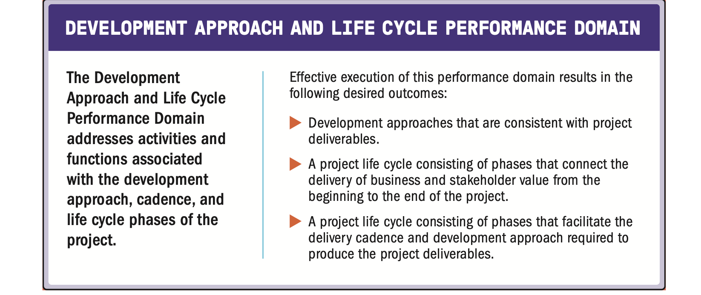

| English | Vietnamese |
|---------|------------|
| A project performance domain is a group of related activities that are critical for the effective delivery of project outcomes. | Một lĩnh vực hiệu suất dự án là một nhóm các hoạt động có liên quan, đóng vai trò then chốt cho việc đạt được kết quả dự án hiệu quả. |
| Project performance domains are interactive, interrelated, and interdependent areas of focus that work in unison to achieve desired project outcomes. | Các lĩnh vực hiệu suất dự án là những khu vực tập trung có tính tương tác, liên kết và phụ thuộc lẫn nhau, cùng hoạt động thống nhất để đạt được kết quả mong muốn của dự án. |
| There are eight project performance domains: | Có tám lĩnh vực hiệu suất dự án: |
| ▶ Stakeholders, | ▶ Các bên liên quan, |
| ▶ Team, | ▶ Nhóm dự án, |
| ▶ Development Approach and Life Cycle, | ▶ Phương pháp phát triển và vòng đời, |
| ▶ Planning, | ▶ Lập kế hoạch, |
| ▶ Project Work, | ▶ Công việc dự án, |
| ▶ Delivery, | ▶ Bàn giao, |
| ▶ Measurement, and | ▶ Đo lường, và |
| ▶ Uncertainty. | ▶ Sự không chắc chắn. |
| Together the performance domains form a unified whole. | Các lĩnh vực hiệu suất kết hợp với nhau tạo thành một tổng thể thống nhất. |
| In this way, the performance domains operate as an integrated system, with each performance domain being interdependent of the other performance domains to enable successful delivery of the project and its intended outcomes. | Theo cách này, các lĩnh vực hiệu suất hoạt động như một hệ thống tích hợp, trong đó mỗi lĩnh vực phụ thuộc lẫn nhau để đảm bảo dự án được triển khai thành công và đạt được kết quả mong muốn. |
| Performance domains run concurrently throughout the project, regardless of how value is delivered (frequently, periodically, or at the end of the project). | Các lĩnh vực hiệu suất diễn ra song song trong suốt dự án, bất kể giá trị được bàn giao theo cách nào (thường xuyên, định kỳ hoặc vào cuối dự án). |
| For example, project leads spend time focused on stakeholders, the project team, the project life cycle, the project work, and so forth, from the outset of the project to its closure. | Ví dụ, các trưởng dự án dành thời gian tập trung vào các bên liên quan, nhóm dự án, vòng đời dự án, công việc dự án, v.v., từ khi bắt đầu cho đến khi kết thúc dự án. |
| These areas of focus are not addressed as siloed efforts because they overlap and interconnect. | Những lĩnh vực tập trung này không được xử lý như các hoạt động riêng lẻ vì chúng chồng lấn và liên kết với nhau. |
| The ways in which the performance domains relate are different for each project, but they are present in every project. | Cách mà các lĩnh vực hiệu suất liên kết với nhau sẽ khác nhau ở mỗi dự án, nhưng chúng luôn tồn tại trong mọi dự án. |
| The specific activities undertaken within each of the performance domains are determined by the context of the organization, the project, deliverables, the project team, stakeholders, and other factors. | Các hoạt động cụ thể trong từng lĩnh vực hiệu suất được quyết định bởi bối cảnh của tổ chức, dự án, sản phẩm bàn giao, nhóm dự án, các bên liên quan và các yếu tố khác. |
| The performance domains are presented in the following sections without specific weighting or order. | Các lĩnh vực hiệu suất được trình bày trong các phần tiếp theo mà không có thứ tự hoặc trọng số cụ thể. |

| English | Vietnamese |
|---------|------------|
| The following definitions are relevant to the Stakeholder Performance Domain: | Các định nghĩa sau đây có liên quan đến Lĩnh vực hiệu suất về các bên liên quan: |
| Stakeholder. An individual, group, or organization that may affect, be affected by, or perceive itself to be affected by a decision, activity, or outcome of a project, program, or portfolio. | Bên liên quan. Một cá nhân, nhóm hoặc tổ chức có thể ảnh hưởng, bị ảnh hưởng, hoặc cho rằng mình bị ảnh hưởng bởi một quyết định, hoạt động hoặc kết quả của dự án, chương trình hoặc danh mục đầu tư. |
| Stakeholder Analysis. A method of systematically gathering and analyzing quantitative and qualitative information to determine whose interests should be taken into account throughout the project. | Phân tích bên liên quan. Một phương pháp thu thập và phân tích có hệ thống thông tin định lượng và định tính để xác định những lợi ích của ai cần được xem xét trong suốt quá trình dự án. |
| English | Vietnamese |
|---------|------------|
| Projects are performed by people and for people. This performance domain entails working with stakeholders to maintain alignment and engaging with them to foster positive relationships and satisfaction. | Các dự án được thực hiện bởi con người và vì con người. Lĩnh vực hiệu suất này liên quan đến việc làm việc với các bên liên quan để duy trì sự phù hợp và tương tác với họ nhằm thúc đẩy các mối quan hệ tích cực và sự hài lòng. |
| Stakeholders include individuals, groups, and organizations (see Figure 2-2). A project can have a small group of stakeholders or potentially millions of stakeholders. | Các bên liên quan bao gồm cá nhân, nhóm và tổ chức (xem Hình 2-2). Một dự án có thể chỉ có một nhóm nhỏ các bên liên quan hoặc có thể lên tới hàng triệu bên liên quan. |
| There may be different stakeholders in different phases of the project, and the influence, power, or interests of stakeholders may change as the project unfolds. | Có thể có các bên liên quan khác nhau ở các giai đoạn khác nhau của dự án, và mức độ ảnh hưởng, quyền lực hoặc lợi ích của các bên liên quan có thể thay đổi khi dự án tiến triển. |

| English | Vietnamese |
|---------|------------|
| Effective stakeholder identification, analysis, and engagement includes stakeholders who are internal and external to the organization, those who are supportive of the project, and those who may not be supportive or are neutral. | Việc xác định, phân tích và tương tác hiệu quả với các bên liên quan bao gồm cả những người ở bên trong và bên ngoài tổ chức, những người ủng hộ dự án, cũng như những người có thể không ủng hộ hoặc giữ thái độ trung lập. |
| While having relevant technical project management skills is an important aspect of successful projects, having the interpersonal and leadership skills to work effectively with stakeholders is just as important, if not more so. | Mặc dù có các kỹ năng quản lý dự án kỹ thuật phù hợp là một yếu tố quan trọng của các dự án thành công, nhưng có kỹ năng giao tiếp và lãnh đạo để làm việc hiệu quả với các bên liên quan cũng quan trọng không kém, thậm chí còn quan trọng hơn. |
| **2.1.1 STAKEHOLDER ENGAGEMENT** | **2.1.1 TƯƠNG TÁC VỚI CÁC BÊN LIÊN QUAN** |
| Stakeholder engagement includes implementing strategies and actions to promote productive involvement of stakeholders. | Tương tác với các bên liên quan bao gồm việc triển khai các chiến lược và hành động nhằm thúc đẩy sự tham gia hiệu quả của các bên liên quan. |
| Stakeholder engagement activities start before or when the project starts and continue throughout the project. | Các hoạt động tương tác với các bên liên quan bắt đầu trước hoặc khi dự án bắt đầu và tiếp tục trong suốt quá trình thực hiện dự án. |

| English | Vietnamese |
|---------|------------|
| Defining and sharing a clear vision at the start of the project can enable good relationships and alignment throughout the project. | Việc xác định và chia sẻ một tầm nhìn rõ ràng ngay từ đầu dự án có thể giúp xây dựng mối quan hệ tốt và duy trì sự thống nhất trong suốt quá trình thực hiện dự án. |
| Establishing a clear vision that key stakeholders agree on can entail some challenging negotiations, especially with stakeholders who are not necessarily in favor of the project or its intended outcomes. | Việc xây dựng một tầm nhìn rõ ràng được các bên liên quan chủ chốt đồng thuận có thể đòi hỏi những cuộc đàm phán khó khăn, đặc biệt là với những bên không nhất thiết ủng hộ dự án hoặc các kết quả mong muốn của nó. |
| As shown in Figure 2-3, there are several steps to engage stakeholders effectively. | Như minh họa trong Hình 2-3, có một số bước để tương tác hiệu quả với các bên liên quan. |
| **2.1.1.1 Identify** | **2.1.1.1 Xác định** |
| High-level stakeholder identification may be carried out prior to forming the project team. | Việc xác định các bên liên quan ở mức cao có thể được thực hiện trước khi thành lập nhóm dự án. |
| Detailed stakeholder identification progressively elaborates the initial work and is a continuous activity throughout the project. | Việc xác định chi tiết các bên liên quan sẽ dần mở rộng từ công việc ban đầu và là một hoạt động liên tục trong suốt dự án. |
| Some stakeholders are easy to identify, such as the customer, sponsor, project team, end users, and so forth, but others can be difficult to identify when they are not directly connected to the project. | Một số bên liên quan dễ xác định, chẳng hạn như khách hàng, nhà tài trợ, nhóm dự án, người dùng cuối, v.v., nhưng một số khác có thể khó xác định khi họ không trực tiếp liên kết với dự án. |
| **2.1.1.2 Understand and Analyze** | **2.1.1.2 Hiểu và Phân tích** |
| Once stakeholders are identified, the project manager and the project team should seek to understand stakeholders’ feelings, emotions, beliefs, and values. | Sau khi xác định được các bên liên quan, người quản lý dự án và nhóm dự án nên tìm hiểu cảm xúc, tình cảm, niềm tin và giá trị của họ. |
| These elements can lead to additional threats or opportunities for the project outcomes. | Những yếu tố này có thể dẫn đến các mối đe dọa hoặc cơ hội bổ sung cho kết quả của dự án. |
| They can also change quickly, and as such, understanding and analyzing stakeholders is an ongoing action. | Chúng cũng có thể thay đổi nhanh chóng, vì vậy việc hiểu và phân tích các bên liên quan là một hoạt động diễn ra liên tục. |
| Related to understanding the project stakeholders is the need to analyze aspects of each stakeholder’s position on and perspective of the project. | Liên quan đến việc hiểu các bên liên quan của dự án là nhu cầu phân tích các khía cạnh về lập trường và quan điểm của từng bên đối với dự án. |
| Analyzing stakeholders considers several stakeholder aspects, such as: | Phân tích các bên liên quan cần xem xét một số khía cạnh, chẳng hạn như: |
| ▶ Power, | ▶ Quyền lực, |
| ▶ Impact, | ▶ Tác động, |
| ▶ Attitude, | ▶ Thái độ, |
| ▶ Beliefs, | ▶ Niềm tin, |
| ▶ Expectations, | ▶ Kỳ vọng, |
| ▶ Degree of influence, | ▶ Mức độ ảnh hưởng, |
| ▶ Proximity to the project, | ▶ Mức độ gần gũi với dự án, |
| ▶ Interest in the project, and | ▶ Sự quan tâm đến dự án, và |
| ▶ Other aspects surrounding stakeholder interaction with the project. | ▶ Các khía cạnh khác liên quan đến sự tương tác của bên liên quan với dự án. |
| English | Vietnamese |
|---------|------------|
| This information helps the project team consider interactions that may influence the motivations, actions, and behaviors of stakeholders. | Thông tin này giúp nhóm dự án xem xét các tương tác có thể ảnh hưởng đến động lực, hành động và hành vi của các bên liên quan. |
| In addition to individual analysis, the project team should consider how stakeholders interact with each other, as they often form alliances that help or hinder the project’s objectives. | Ngoài việc phân tích từng cá nhân, nhóm dự án nên xem xét cách các bên liên quan tương tác với nhau, vì họ thường hình thành các liên minh hỗ trợ hoặc cản trở mục tiêu của dự án. |
| For example, if the project team believes a key business manager is highly influential but has negative perceptions related to the project, they can explore how to detect the business manager’s perceptions and respond appropriately as the project unfolds. | Ví dụ, nếu nhóm dự án tin rằng một quản lý kinh doanh chủ chốt có ảnh hưởng lớn nhưng lại có quan điểm tiêu cực về dự án, họ có thể tìm cách phát hiện quan điểm của người này và phản ứng phù hợp khi dự án tiến triển. |
| In all cases, the analysis work should be held in confidence by the project team since the information could be misinterpreted outside the context for the analysis. | Trong mọi trường hợp, công việc phân tích cần được nhóm dự án bảo mật vì thông tin có thể bị hiểu sai khi đặt ngoài bối cảnh phân tích. |
| **2.1.1.3 Prioritize** | **2.1.1.3 Ưu tiên** |
| On many projects, there are too many stakeholders involved for the project team to engage directly or effectively with all of them. | Trong nhiều dự án, có quá nhiều bên liên quan tham gia khiến nhóm dự án không thể tương tác trực tiếp hoặc hiệu quả với tất cả. |
| Based on its analysis, the project team can complete an initial prioritization of stakeholders. | Dựa trên phân tích, nhóm dự án có thể thực hiện việc ưu tiên ban đầu đối với các bên liên quan. |
| It is common to focus on stakeholders with the most power and interest as one way to prioritize engagement. | Thông thường, việc tập trung vào các bên liên quan có quyền lực và mức độ quan tâm cao nhất là một cách để ưu tiên tương tác. |
| As events unfold throughout the project, the project team may need to reprioritize based on new stakeholders or evolving changes in the stakeholder landscape. | Khi các sự kiện diễn ra trong suốt dự án, nhóm dự án có thể cần ưu tiên lại dựa trên các bên liên quan mới hoặc những thay đổi đang diễn ra trong bối cảnh các bên liên quan. |
| **2.1.1.4 Engage** | **2.1.1.4 Tương tác** |
| Stakeholder engagement entails working collaboratively with stakeholders to introduce the project, elicit their requirements, manage expectations, resolve issues, negotiate, prioritize, problem solve, and make decisions. | Tương tác với các bên liên quan bao gồm làm việc hợp tác để giới thiệu dự án, thu thập yêu cầu của họ, quản lý kỳ vọng, giải quyết vấn đề, đàm phán, ưu tiên, xử lý vấn đề và đưa ra quyết định. |
| Engaging stakeholders requires the application of soft skills, such as active listening, interpersonal skills, and conflict management, as well as leadership skills such as establishing the vision and critical thinking. | Việc tương tác với các bên liên quan đòi hỏi kỹ năng mềm như lắng nghe tích cực, kỹ năng giao tiếp, quản lý xung đột, cũng như kỹ năng lãnh đạo như xây dựng tầm nhìn và tư duy phản biện. |
| Communication with stakeholders can take place via written or verbal means, and it can be formal or informal. | Việc giao tiếp với các bên liên quan có thể diễn ra thông qua hình thức viết hoặc nói, và có thể chính thức hoặc không chính thức. |
| Examples of each type of communication are shown in Table 2-1. | Ví dụ của từng loại hình giao tiếp được trình bày trong Bảng 2-1. |

| English | Vietnamese |
|---------|------------|
| Communication methods include push, pull, and interactive communication: | Các phương thức giao tiếp bao gồm giao tiếp đẩy, kéo và tương tác: |
| ▶ Push. Communication sent to stakeholders such as memos, emails, status reports, voice mail, and so forth. | ▶ Đẩy (Push): Giao tiếp được gửi đến các bên liên quan như bản ghi nhớ, email, báo cáo trạng thái, thư thoại, v.v. |
| Push communication is used for one-way communications with individual stakeholders or groups of stakeholders. | Giao tiếp đẩy được sử dụng cho hình thức giao tiếp một chiều với từng cá nhân hoặc nhóm các bên liên quan. |
| Push communication inhibits the ability to immediately gauge reaction and assess understanding; therefore, it should be used deliberately. | Giao tiếp đẩy hạn chế khả năng đánh giá ngay lập tức phản ứng và mức độ hiểu của người nhận; do đó, cần sử dụng một cách có chủ đích. |
| ▶ Pull. Information sought by the stakeholder, such as a project team member going to an intranet to find communication policies or templates, running internet searches, and using online repositories. | ▶ Kéo (Pull): Thông tin được tìm kiếm bởi các bên liên quan, chẳng hạn như thành viên nhóm dự án truy cập vào mạng nội bộ để tìm chính sách hoặc mẫu giao tiếp, tìm kiếm trên internet, hoặc sử dụng kho lưu trữ trực tuyến. |
| Pulling information is used for indirect sensing of stakeholder concerns. | Việc kéo thông tin được dùng để gián tiếp nắm bắt mối quan tâm của các bên liên quan. |
| Engagement goes deeper than pushing or pulling communication. Engagement is interactive. | Sự tương tác sâu hơn so với giao tiếp đẩy hoặc kéo. Tương tác là hình thức giao tiếp hai chiều. |
| It includes an exchange of information with one or more stakeholders such as conversations, phone calls, meetings, brainstorming, product demos, and the like. | Nó bao gồm việc trao đổi thông tin với một hoặc nhiều bên liên quan như trò chuyện, gọi điện, họp, động não, trình diễn sản phẩm, v.v. |
| With all forms of communication, quick feedback loops provide useful information to: | Với mọi hình thức giao tiếp, các vòng phản hồi nhanh cung cấp thông tin hữu ích để: |
| ▶ Confirm the degree to which the stakeholder(s) heard the message. | ▶ Xác nhận mức độ mà các bên liên quan đã nghe và hiểu thông điệp. |
| ▶ Determine if stakeholders agree with the message. | ▶ Xác định liệu các bên liên quan có đồng ý với thông điệp hay không. |
| ▶ Identify nuanced or other unintended messages the recipient detected. | ▶ Xác định các thông điệp tinh tế hoặc ngoài ý muốn mà người nhận cảm nhận được. |
| ▶ Gain other helpful insights. | ▶ Thu thập thêm những hiểu biết hữu ích khác. |
| English | Vietnamese |
|---------|------------|
| **2.1.1.5 Monitor** | **2.1.1.5 Giám sát** |
| Throughout the project, stakeholders will change as new stakeholders are identified and others cease to be stakeholders. | Trong suốt dự án, các bên liên quan sẽ thay đổi khi có các bên liên quan mới được xác định và những bên khác không còn là bên liên quan nữa. |
| As the project progresses, the attitude or power of some stakeholders may change. | Khi dự án tiến triển, thái độ hoặc quyền lực của một số bên liên quan có thể thay đổi. |
| In addition to identifying and analyzing new stakeholders, there is an opportunity to assess whether the current engagement strategy is effective or if it needs to be adjusted. | Bên cạnh việc xác định và phân tích các bên liên quan mới, đây cũng là cơ hội để đánh giá xem chiến lược tương tác hiện tại có hiệu quả hay không hoặc cần điều chỉnh. |
| Therefore, the amount and effectiveness of stakeholder engagement is monitored throughout the project. | Do đó, mức độ và hiệu quả của sự tham gia của các bên liên quan được giám sát trong suốt dự án. |
| The degree of stakeholder satisfaction can often be determined by having a conversation with stakeholders to gauge their satisfaction with the project deliverables and the overall management of the project. | Mức độ hài lòng của các bên liên quan thường có thể được xác định bằng cách trò chuyện với họ để đánh giá sự hài lòng đối với các sản phẩm bàn giao và việc quản lý tổng thể của dự án. |
| Project and iteration reviews, product reviews, stage gates, and other methods are ways to obtain periodic feedback. | Việc rà soát dự án và các vòng lặp, rà soát sản phẩm, các cổng giai đoạn, và các phương pháp khác là những cách để thu thập phản hồi định kỳ. |
| For large groups of stakeholders, a survey can be used to assess the degree of satisfaction. | Đối với các nhóm bên liên quan lớn, khảo sát có thể được sử dụng để đánh giá mức độ hài lòng. |
| Where necessary, the stakeholder engagement approach can be updated to achieve higher stakeholder satisfaction. | Khi cần thiết, phương pháp tương tác với các bên liên quan có thể được cập nhật để đạt được mức độ hài lòng cao hơn. |
| **2.1.2 Interactions with Other Performance Domains** | **2.1.2 Tương tác với các miền hiệu suất khác** |
| Stakeholders permeate all aspects of the project. | Các bên liên quan thâm nhập vào mọi khía cạnh của dự án. |
| They define and prioritize the requirements and scope for the project team. | Họ xác định và ưu tiên các yêu cầu và phạm vi cho nhóm dự án. |
| They participate in and shape the planning. | Họ tham gia và định hình việc lập kế hoạch. |
| They determine acceptance and quality criteria for the project deliverables and outcomes. | Họ xác định tiêu chí chấp nhận và chất lượng cho các sản phẩm bàn giao và kết quả của dự án. |
| Much of the project work is around engaging and communicating with stakeholders. | Phần lớn công việc của dự án xoay quanh việc tương tác và giao tiếp với các bên liên quan. |
| Throughout the project or at its closure, they use the project deliverables and influence the realization of project outcomes. | Trong suốt dự án hoặc khi kết thúc, họ sử dụng các sản phẩm bàn giao và ảnh hưởng đến việc hiện thực hóa kết quả dự án. |
| Some stakeholders can assist in lowering the amount of uncertainty present on a project while others may cause an increase in uncertainty. | Một số bên liên quan có thể giúp giảm mức độ không chắc chắn trong dự án, trong khi những bên khác có thể làm tăng sự không chắc chắn đó. |
| Stakeholders such as customers, senior management, project management office leads, or program managers will focus on measures of performance for the project and its deliverables. | Các bên liên quan như khách hàng, ban lãnh đạo cấp cao, trưởng văn phòng quản lý dự án hoặc các nhà quản lý chương trình sẽ tập trung vào các thước đo hiệu suất của dự án và các sản phẩm bàn giao. |
| These interactions are samples of how the Stakeholder Performance Domain integrates and interweaves with other performance domains, though they are not inclusive of all the ways stakeholder concerns interact throughout the performance domains. | Những tương tác này là ví dụ về cách Miền Hiệu Suất Bên Liên Quan tích hợp và đan xen với các miền hiệu suất khác, mặc dù chúng không bao gồm tất cả các cách mà mối quan tâm của bên liên quan tương tác trong suốt các miền hiệu suất. |
| English | Vietnamese |
|---------|------------|
| 2.1.3 CHECKING RESULTS | 2.1.3 KIỂM TRA KẾT QUẢ |
| Table 2-2 identifies the outcomes on the left and ways of checking them on the right. | Bảng 2-2 xác định các kết quả ở bên trái và các cách kiểm tra chúng ở bên phải. |

| English | Vietnamese |
|---------|------------|
| This performance domain entails establishing the culture and environment that enables a collection of diverse individuals to evolve into a high-performing project team. | Miền hiệu suất này bao gồm việc thiết lập văn hóa và môi trường cho phép một tập hợp các cá nhân đa dạng phát triển thành một nhóm dự án có hiệu suất cao. |
| This includes recognizing the activities needed to foster project team development and encouraging leadership behaviors from all project team members. | Điều này bao gồm việc nhận biết các hoạt động cần thiết để thúc đẩy sự phát triển của nhóm dự án và khuyến khích hành vi lãnh đạo từ tất cả các thành viên trong nhóm dự án. |
| English | Vietnamese |
|---------|------------|
| The following definitions are relevant to the Team Performance Domain: | Các định nghĩa sau đây liên quan đến Miền hiệu suất của nhóm: |
| Project Manager. The person assigned by the performing organization to lead the project team that is responsible for achieving the project objectives. | Quản lý dự án. Người được tổ chức thực hiện chỉ định để dẫn dắt nhóm dự án chịu trách nhiệm đạt được các mục tiêu của dự án. |
| Project Management Team. The members of the project team who are directly involved in project management activities. | Nhóm quản lý dự án. Các thành viên của nhóm dự án tham gia trực tiếp vào các hoạt động quản lý dự án. |
| Project Team. A set of individuals performing the work of the project to achieve its objectives. | Nhóm dự án. Một tập hợp các cá nhân thực hiện công việc của dự án để đạt được các mục tiêu của nó. |
| English | Vietnamese |
|---------|------------|
| **2.2.1 PROJECT TEAM MANAGEMENT AND LEADERSHIP** | **2.2.1 QUẢN LÝ VÀ LÃNH ĐẠO NHÓM DỰ ÁN** |
| Project management entails applying knowledge, skills, tools, and techniques for management activities as well as leadership activities. | Quản lý dự án bao gồm việc áp dụng kiến thức, kỹ năng, công cụ và kỹ thuật cho các hoạt động quản lý cũng như các hoạt động lãnh đạo. |
| Management activities focus on the means of meeting project objectives, such as having effective processes, planning, coordinating, measuring, and monitoring work, among others. | Các hoạt động quản lý tập trung vào cách thức đạt được mục tiêu của dự án, chẳng hạn như có các quy trình hiệu quả, lập kế hoạch, điều phối, đo lường và giám sát công việc, cùng những hoạt động khác. |
| Leadership activities focus on people. Leadership includes influencing, motivating, listening, enabling, and other activities having to do with the project team. | Các hoạt động lãnh đạo tập trung vào con người. Lãnh đạo bao gồm việc gây ảnh hưởng, tạo động lực, lắng nghe, hỗ trợ và các hoạt động khác liên quan đến nhóm dự án. |
| Both are important in delivering the intended outcomes. | Cả hai đều quan trọng trong việc mang lại các kết quả dự kiến. |
| **2.2.1.1 Centralized Management and Leadership** | **2.2.1.1 Quản lý và Lãnh đạo Tập trung** |
| While leadership activities should be practiced by all project team members, management activities may be centralized or distributed. | Mặc dù các hoạt động lãnh đạo nên được tất cả các thành viên nhóm dự án thực hiện, nhưng các hoạt động quản lý có thể được tập trung hoặc phân tán. |
| In an environment where management activities are centralized, accountability (being answerable for an outcome) is usually assigned to one individual, such as the project manager or similar role. | Trong môi trường mà các hoạt động quản lý được tập trung, trách nhiệm (chịu trách nhiệm cho một kết quả) thường được giao cho một cá nhân, chẳng hạn như quản lý dự án hoặc vai trò tương tự. |
| In these situations, a project charter or other authorizing document can provide approval for the project manager to form a project team to achieve the project outcomes. | Trong những tình huống này, điều lệ dự án hoặc tài liệu ủy quyền khác có thể cung cấp sự phê duyệt cho quản lý dự án để thành lập nhóm dự án nhằm đạt được kết quả dự án. |
| **2.2.1.2 Distributed Management and Leadership** | **2.2.1.2 Quản lý và Lãnh đạo Phân tán** |
| Sometimes project management activities are shared among a project management team, and project team members are responsible for completing the work. | Đôi khi các hoạt động quản lý dự án được chia sẻ trong một nhóm quản lý dự án, và các thành viên nhóm dự án chịu trách nhiệm hoàn thành công việc. |
| There are also situations where a project team may self-organize to complete a project. | Cũng có những tình huống mà nhóm dự án có thể tự tổ chức để hoàn thành một dự án. |
| Rather than having a designated project manager, someone within the project team may serve as facilitator to enable communication, collaboration, and engagement. | Thay vì có một quản lý dự án được chỉ định, một người trong nhóm dự án có thể đóng vai trò điều phối viên để thúc đẩy giao tiếp, hợp tác và gắn kết. |
| This role may shift among project team members. | Vai trò này có thể được luân chuyển giữa các thành viên nhóm dự án. |
| Servant leadership is a style of leadership that focuses on understanding and addressing the needs and development of project team members in order to enable the highest possible project team performance. | Lãnh đạo phục vụ là một phong cách lãnh đạo tập trung vào việc thấu hiểu và đáp ứng nhu cầu cũng như sự phát triển của các thành viên nhóm dự án nhằm đạt được hiệu suất nhóm dự án cao nhất có thể. |
| Servant leaders place emphasis on developing project team members to their highest potential by focusing on addressing questions, such as: | Các nhà lãnh đạo phục vụ đặt trọng tâm vào việc phát triển các thành viên nhóm dự án đến tiềm năng cao nhất của họ bằng cách tập trung vào việc trả lời các câu hỏi như: |
| ▶ Are project team members growing as individuals? | ▶ Các thành viên nhóm dự án có đang phát triển với tư cách cá nhân không? |
| ▶ Are project team members becoming healthier, wiser, freer, and more autonomous? | ▶ Các thành viên nhóm dự án có trở nên khỏe mạnh hơn, khôn ngoan hơn, tự do hơn và tự chủ hơn không? |
| ▶ Are project team members more likely to become servant leaders? | ▶ Các thành viên nhóm dự án có khả năng trở thành các nhà lãnh đạo phục vụ hơn không? |
| English | Vietnamese |
|---------|------------|
| Servant leaders allow project teams to self-organize when possible and increase levels of autonomy by passing appropriate decision-making opportunities to project team members. | Các nhà lãnh đạo phục vụ cho phép các nhóm dự án tự tổ chức khi có thể và tăng mức độ tự chủ bằng cách trao cơ hội ra quyết định phù hợp cho các thành viên nhóm dự án. |
| Servant leadership behaviors include: | Các hành vi lãnh đạo phục vụ bao gồm: |
| ▶ Obstacle removal. Since it is the project team who generates the majority of business value, a critical role for the servant leader is to maximize delivery by removing impediments to their progress. This includes solving problems and removing obstacles that may be hampering the project team’s work. By solving or easing these impediments, the project team can deliver value to the business faster. | ▶ Loại bỏ chướng ngại. Vì nhóm dự án tạo ra phần lớn giá trị kinh doanh, một vai trò quan trọng của nhà lãnh đạo phục vụ là tối đa hóa khả năng giao hàng bằng cách loại bỏ những trở ngại đối với tiến độ của họ. Điều này bao gồm việc giải quyết vấn đề và loại bỏ các chướng ngại có thể cản trở công việc của nhóm dự án. Bằng cách giải quyết hoặc giảm bớt những trở ngại này, nhóm dự án có thể mang lại giá trị cho doanh nghiệp nhanh hơn. |
| ▶ Diversion shield. Servant leaders protect the project team from internal and external diversions that redirect the project team from the current objectives. Time fragmentation reduces productivity, so shielding the project team from noncritical, external demands helps the project team stay focused. | ▶ Lá chắn phân tán. Các nhà lãnh đạo phục vụ bảo vệ nhóm dự án khỏi những sự phân tán nội bộ và bên ngoài có thể khiến nhóm dự án lệch khỏi các mục tiêu hiện tại. Việc phân mảnh thời gian làm giảm năng suất, vì vậy việc bảo vệ nhóm dự án khỏi những yêu cầu không quan trọng từ bên ngoài giúp nhóm tập trung hơn. |
| ▶ Encouragement and development opportunities. The servant leader also provides tools and encouragement to keep the project team satisfied and productive. Learning what motivates project team members as individuals and finding ways to reward them for good work helps keep project team members satisfied. | ▶ Khuyến khích và cơ hội phát triển. Nhà lãnh đạo phục vụ cũng cung cấp công cụ và sự khích lệ để giữ cho nhóm dự án hài lòng và năng suất. Việc tìm hiểu điều gì thúc đẩy các thành viên nhóm dự án với tư cách cá nhân và tìm cách khen thưởng họ khi làm việc tốt giúp duy trì sự hài lòng của các thành viên. |
| **2.2.1.3 Common Aspects of Team Development** | **2.2.1.3 Các khía cạnh chung của phát triển nhóm** |
| Regardless of how the management activities are structured, there are common aspects of project team development that are relevant for most project teams. These include: | Bất kể các hoạt động quản lý được tổ chức như thế nào, vẫn có những khía cạnh chung của việc phát triển nhóm dự án phù hợp với hầu hết các nhóm. Bao gồm: |
| ▶ Vision and objectives. It is essential that everyone is aware of the project vision and objectives. The vision and objectives are communicated throughout the project. This includes referencing the intended outcomes when the project team is engaged in making decisions and solving problems. | ▶ Tầm nhìn và mục tiêu. Điều cần thiết là mọi người đều phải nhận thức được tầm nhìn và mục tiêu của dự án. Tầm nhìn và mục tiêu được truyền đạt xuyên suốt dự án, bao gồm việc tham chiếu các kết quả mong muốn khi nhóm dự án tham gia vào việc ra quyết định và giải quyết vấn đề. |
| ▶ Roles and responsibilities. It is important to make sure project team members understand and fulfill their roles and responsibilities. This can include identifying gaps in knowledge and skills as well as strategies to address those gaps through training, mentoring, or coaching. | ▶ Vai trò và trách nhiệm. Điều quan trọng là phải đảm bảo các thành viên nhóm dự án hiểu và thực hiện đúng vai trò và trách nhiệm của mình. Điều này có thể bao gồm việc xác định khoảng trống về kiến thức và kỹ năng, cũng như các chiến lược để giải quyết khoảng trống đó thông qua đào tạo, cố vấn hoặc huấn luyện. |
| English | Vietnamese |
|---------|------------|
| ▶ Project team operations. Facilitating project team communication, problem solving, and the process of coming to consensus may include working with the project team to develop a project team charter and a set of operating guidelines or project team norms. | ▶ Hoạt động của nhóm dự án. Việc hỗ trợ giao tiếp, giải quyết vấn đề và quá trình đi đến đồng thuận của nhóm dự án có thể bao gồm làm việc với nhóm để xây dựng điều lệ nhóm dự án và một bộ hướng dẫn vận hành hoặc các chuẩn mực nhóm dự án. |
| ▶ Guidance. Guidance can be directed to the overall project team to keep everyone headed in the right direction. Individual project team members may also provide guidance on a particular task or deliverable. | ▶ Hướng dẫn. Hướng dẫn có thể được đưa ra cho toàn bộ nhóm dự án để giữ mọi người đi đúng hướng. Các thành viên riêng lẻ của nhóm cũng có thể đưa ra hướng dẫn cho một nhiệm vụ hoặc sản phẩm bàn giao cụ thể. |
| ▶ Growth. Identifying areas where the project team is performing well and pointing out areas where the project team can improve helps the project team to grow. Working collaboratively, the project team can identify goals for its improvement and take steps to meet those goals. This also applies to each individual on the project team. Individuals may want to grow their skills and experience in certain areas, and the project manager can assist with that. | ▶ Phát triển. Việc xác định các lĩnh vực mà nhóm dự án đang hoạt động tốt và chỉ ra các lĩnh vực cần cải thiện giúp nhóm phát triển. Khi làm việc hợp tác, nhóm có thể xác định các mục tiêu cải thiện và thực hiện các bước để đạt được mục tiêu đó. Điều này cũng áp dụng cho từng cá nhân trong nhóm. Mỗi người có thể muốn nâng cao kỹ năng và kinh nghiệm của mình trong một số lĩnh vực nhất định, và quản lý dự án có thể hỗ trợ việc đó. |
| There are several models that describe the stages of project team growth included in Section 4. | Có một số mô hình mô tả các giai đoạn phát triển của nhóm dự án được trình bày trong Mục 4. |
| English | Vietnamese |
|---------|------------|
| When project teams form across different organizations based on a contract, strategic partnership, or other business relationship, specific roles that perform various functions may be more formalized and less flexible depending on the contract or other terms. | Khi các nhóm dự án được hình thành giữa các tổ chức khác nhau dựa trên hợp đồng, quan hệ đối tác chiến lược hoặc mối quan hệ kinh doanh khác, các vai trò cụ thể thực hiện các chức năng khác nhau có thể được chính thức hóa hơn và kém linh hoạt hơn tùy thuộc vào hợp đồng hoặc các điều khoản khác. |
| Such arrangements often require more up-front work to establish a “one team” mindset, ensure project team members understand how everyone contributes to the project, and establish other enablers that integrate skills, capabilities, and processes. | Những sắp xếp như vậy thường đòi hỏi nhiều công việc chuẩn bị hơn để xây dựng tư duy “một nhóm”, đảm bảo các thành viên nhóm dự án hiểu rõ cách mọi người đóng góp cho dự án, và thiết lập các yếu tố hỗ trợ khác nhằm tích hợp kỹ năng, năng lực và quy trình. |
| English | Vietnamese |
|---------|------------|
| **2.2.2 PROJECT TEAM CULTURE** | **2.2.2 VĂN HÓA NHÓM DỰ ÁN** |
| Each project team develops its own team culture. | Mỗi nhóm dự án phát triển văn hóa nhóm riêng của mình. |
| The project team’s culture may be established deliberately by developing project team norms, or informally through the behaviors and actions of its project team members. | Văn hóa của nhóm dự án có thể được xây dựng một cách có chủ đích bằng cách phát triển các chuẩn mực của nhóm, hoặc hình thành một cách tự nhiên thông qua hành vi và hành động của các thành viên nhóm. |
| The project team culture operates within the organization’s culture but reflects the project team’s individual ways of working and interacting. | Văn hóa nhóm dự án hoạt động trong khuôn khổ văn hóa của tổ chức nhưng phản ánh cách làm việc và tương tác riêng của nhóm dự án. |
| English | Vietnamese |
|---------|------------|
| Human beings have a set of biases, some of them unconscious and some of them conscious. | Con người có một tập hợp các định kiến, một số là vô thức và một số là có ý thức. |
| For example, one person may feel that unless a schedule is displayed using a software-generated Gantt chart, that it is not a true or valid schedule. | Ví dụ, một người có thể cho rằng trừ khi lịch trình được hiển thị bằng biểu đồ Gantt tạo ra từ phần mềm thì đó mới là một lịch trình đúng hoặc hợp lệ. |
| Another person may have a contrasting bias that detailed planning any further out than 30 days is a waste of time. | Một người khác có thể có định kiến trái ngược rằng việc lập kế hoạch chi tiết vượt quá 30 ngày là lãng phí thời gian. |
| Being open and transparent about biases up front establishes a culture of openness and trust that can enable consensus and collaboration. | Việc cởi mở và minh bạch về các định kiến ngay từ đầu giúp thiết lập một văn hóa cởi mở và tin tưởng, tạo điều kiện cho sự đồng thuận và hợp tác. |
| English | Vietnamese |
|---------|------------|
| The project manager is key in establishing and maintaining a safe, respectful, nonjudgmental environment that allows the project team to communicate openly. | Quản lý dự án đóng vai trò then chốt trong việc thiết lập và duy trì một môi trường an toàn, tôn trọng, không phán xét, cho phép nhóm dự án giao tiếp một cách cởi mở. |
| One way to accomplish this is by modeling desired behaviors, such as: | Một cách để đạt được điều này là làm gương cho các hành vi mong muốn, chẳng hạn như: |
| ▶ Transparency. Being transparent in how one thinks, makes choices, and processes information helps others identify and share their own processes. This can extend to being transparent about biases as well. | ▶ Minh bạch. Việc minh bạch trong cách suy nghĩ, đưa ra lựa chọn và xử lý thông tin giúp người khác nhận ra và chia sẻ quy trình của riêng họ. Điều này cũng có thể mở rộng đến việc minh bạch về các định kiến. |
| ▶ Integrity. Integrity is comprised of ethical behavior and honesty. Individuals demonstrate honesty by surfacing risks, communicating their assumptions and basis of estimates, delivering bad news early, ensuring status reports provide an accurate depiction of the project’s status, and in many other ways. Ethical behavior can include surfacing potential defects or negative effects in product design, disclosing potential conflicts of interest, ensuring fairness, and making decisions based on environmental, stakeholder, and financial impacts. | ▶ Chính trực. Chính trực bao gồm hành vi đạo đức và sự trung thực. Cá nhân thể hiện sự trung thực bằng cách nêu rõ các rủi ro, truyền đạt các giả định và cơ sở ước tính của mình, thông báo tin xấu sớm, đảm bảo báo cáo tình trạng phản ánh chính xác tình trạng dự án, và nhiều cách khác. Hành vi đạo đức có thể bao gồm việc nêu ra các khiếm khuyết hoặc tác động tiêu cực tiềm ẩn trong thiết kế sản phẩm, tiết lộ xung đột lợi ích tiềm tàng, đảm bảo tính công bằng, và đưa ra quyết định dựa trên các tác động về môi trường, các bên liên quan và tài chính. |
| English | Vietnamese |
|---------|------------|
| ▶ Respect. Demonstrating respect for each person, how the person thinks, the person’s skills, and the perspective and expertise the person brings to the project team sets the stage for all project team members to adopt this behavior. | ▶ Tôn trọng. Thể hiện sự tôn trọng đối với mỗi cá nhân, cách họ suy nghĩ, kỹ năng của họ, cũng như góc nhìn và chuyên môn mà họ mang đến cho nhóm dự án sẽ tạo tiền đề để tất cả các thành viên khác trong nhóm áp dụng hành vi này. |
| ▶ Positive discourse. Throughout the project, diverse opinions, different ways of approaching situations, and misunderstandings will occur. These are a normal part of conducting projects. They present an opportunity to have a dialogue rather than a debate. A dialogue entails working with others to resolve divergent opinions. The goal is to arrive at a resolution that all parties can embrace. A debate, on the other hand, is a win-lose scenario where people are more interested in winning personally than they are in being open to alternative solutions to a problem. | ▶ Trao đổi tích cực. Trong suốt dự án, sẽ có những ý kiến đa dạng, những cách tiếp cận khác nhau và những hiểu lầm. Đây là một phần bình thường của việc thực hiện dự án. Chúng tạo cơ hội để đối thoại thay vì tranh luận. Đối thoại là làm việc cùng nhau để giải quyết những ý kiến khác biệt, với mục tiêu đạt được giải pháp mà tất cả các bên đều có thể chấp nhận. Ngược lại, tranh luận là tình huống thắng-thua, nơi mọi người quan tâm nhiều hơn đến việc thắng cá nhân hơn là cởi mở với các giải pháp thay thế. |
| ▶ Support. Projects can be challenging from the perspectives of technical challenges, environmental influences, and interpersonal interactions. Supporting project team members through problem solving and removing impediments builds a supportive culture and leads to a trusting and collaborative environment. Support can also be demonstrated by providing encouragement, showing empathy, and engaging in active listening. | ▶ Hỗ trợ. Các dự án có thể gặp khó khăn về mặt kỹ thuật, ảnh hưởng môi trường, và tương tác giữa con người. Hỗ trợ các thành viên nhóm dự án thông qua giải quyết vấn đề và loại bỏ trở ngại sẽ xây dựng một văn hóa hỗ trợ và dẫn đến môi trường tin cậy, hợp tác. Sự hỗ trợ cũng có thể được thể hiện bằng cách khích lệ, thể hiện sự đồng cảm và lắng nghe tích cực. |
| ▶ Courage. Recommending a new approach to a problem or a way of working can be intimidating. Likewise, it can be challenging to disagree with a subject matter expert or someone with greater authority. However, demonstrating the courage that it takes to make a suggestion, disagree, or try something new enables a culture of experimentation and communicates to others that it is safe to be courageous and try new approaches. | ▶ Dũng cảm. Đề xuất một cách tiếp cận mới cho một vấn đề hoặc một phương pháp làm việc có thể gây e ngại. Tương tự, việc không đồng ý với chuyên gia hoặc người có thẩm quyền cao hơn có thể là một thách thức. Tuy nhiên, thể hiện sự dũng cảm để đưa ra đề xuất, bày tỏ ý kiến trái chiều hoặc thử điều gì đó mới sẽ thúc đẩy văn hóa thử nghiệm và cho người khác thấy rằng việc dũng cảm thử cách tiếp cận mới là an toàn. |
| ▶ Celebrating success. Focusing on project goals, challenges, and issues often sidelines the fact that individual project team members and the project team as a whole are steadily progressing toward those goals. Because work takes priority, project team members may defer recognizing demonstrations of innovation, adaptation, service to others, and learning. However, recognizing such contributions in real time can keep the project team and individuals motivated. | ▶ Ăn mừng thành công. Việc tập trung vào mục tiêu, thách thức và vấn đề của dự án thường làm lu mờ thực tế rằng các thành viên cá nhân và cả nhóm đang tiến bộ đều đặn hướng tới những mục tiêu đó. Do công việc được ưu tiên, các thành viên nhóm có thể trì hoãn việc ghi nhận các biểu hiện sáng tạo, thích ứng, phục vụ người khác và học hỏi. Tuy nhiên, việc ghi nhận những đóng góp này ngay lập tức có thể giúp duy trì động lực cho cả nhóm và từng cá nhân. |
| English | Vietnamese |
|---------|------------|
| 2.2.3 HIGH-PERFORMING PROJECT TEAMS | 2.2.3 NHÓM DỰ ÁN HOẠT ĐỘNG HIỆU QUẢ CAO |
| One goal of effective leadership is to create a high-performing project team. There are a number of factors that contribute to high-performing project teams. The list below is not comprehensive, but it identifies some of the factors associated with high-performing project teams. | Một mục tiêu của lãnh đạo hiệu quả là tạo ra một nhóm dự án hoạt động hiệu quả cao. Có nhiều yếu tố góp phần vào việc hình thành các nhóm như vậy. Danh sách dưới đây không bao gồm tất cả, nhưng nêu bật một số yếu tố liên quan đến nhóm dự án hiệu quả cao. |
| ▶ Open communication. An environment that fosters open and safe communication allows for productive meetings, problem solving, brainstorming, and so forth. It is also the cornerstone for other factors, such as shared understanding, trust, and collaboration. | ▶ Giao tiếp cởi mở. Môi trường thúc đẩy giao tiếp cởi mở và an toàn cho phép tổ chức các cuộc họp hiệu quả, giải quyết vấn đề, động não, v.v. Đây cũng là nền tảng cho các yếu tố khác như hiểu biết chung, sự tin tưởng và hợp tác. |
| ▶ Shared understanding. The purpose for the project and the benefits it will provide are held in common. | ▶ Hiểu biết chung. Mục tiêu của dự án và những lợi ích mà nó mang lại được mọi người cùng nắm rõ. |
| ▶ Shared ownership. The more ownership of the outcomes that project team members feel, the better they are likely to perform. | ▶ Cùng chia sẻ trách nhiệm. Các thành viên nhóm dự án càng cảm thấy mình có trách nhiệm với kết quả, họ càng có xu hướng làm việc hiệu quả hơn. |
| ▶ Trust. A project team in which its members trust each other is willing to go the extra distance to deliver success. People are less likely to do the extra work it may take to succeed if they do not trust their project team members, project manager, or the organization. | ▶ Tin tưởng. Một nhóm dự án mà các thành viên tin tưởng lẫn nhau sẽ sẵn sàng nỗ lực hơn để đạt được thành công. Ngược lại, nếu không có sự tin tưởng vào đồng đội, quản lý dự án hoặc tổ chức, mọi người sẽ ít sẵn lòng làm thêm để đạt kết quả. |
| ▶ Collaboration. Project teams that collaborate and work with each other rather than work in silos or compete tend to generate more diverse ideas and end up with better outcomes. | ▶ Hợp tác. Các nhóm dự án hợp tác và làm việc cùng nhau thay vì làm việc riêng lẻ hoặc cạnh tranh thường tạo ra nhiều ý tưởng đa dạng hơn và đạt được kết quả tốt hơn. |
| ▶ Adaptability. Project teams that are able to adapt the way they work to the environment and the situation are more effective. | ▶ Khả năng thích ứng. Các nhóm dự án có thể điều chỉnh cách làm việc để phù hợp với môi trường và tình huống sẽ hiệu quả hơn. |
| ▶ Resilience. When issues or failures occur, high-performing project teams recover quickly. | ▶ Khả năng phục hồi. Khi gặp sự cố hoặc thất bại, các nhóm dự án hiệu quả cao sẽ nhanh chóng phục hồi. |
| ▶ Empowerment. Project team members who feel empowered to make decisions about the way they work perform better than those who are micromanaged. | ▶ Trao quyền. Các thành viên nhóm dự án được trao quyền quyết định cách thức làm việc thường có hiệu suất tốt hơn so với những người bị quản lý quá sát sao. |
| ▶ Recognition. Project teams who are recognized for the work they put in and the performance they achieve are more likely to continue to perform well. Even the simple act of showing appreciation reinforces positive team behavior. | ▶ Ghi nhận. Các nhóm dự án được ghi nhận vì công sức và thành tích đạt được sẽ có xu hướng tiếp tục duy trì hiệu suất tốt. Ngay cả hành động đơn giản như bày tỏ sự cảm kích cũng củng cố hành vi tích cực của nhóm. |
| English | Vietnamese |
|---------|------------|
| 2.2.4 LEADERSHIP SKILLS | 2.2.4 KỸ NĂNG LÃNH ĐẠO |
| Leadership skills are useful for all project team members whether the project team is operating in an environment with a centralized authority or a shared leadership environment. The following sections describe some of the traits and activities associated with leadership. | Kỹ năng lãnh đạo hữu ích cho tất cả các thành viên nhóm dự án, cho dù nhóm dự án hoạt động trong môi trường có quyền hạn tập trung hay môi trường lãnh đạo chia sẻ. Các mục dưới đây mô tả một số đặc điểm và hoạt động liên quan đến lãnh đạo. |
| 2.2.4.1 Establishing and Maintaining Vision | 2.2.4.1 Thiết lập và duy trì tầm nhìn |
| Every project has a purpose. Understanding that purpose is critical for people to commit their time and energy in the right direction toward achieving the project purpose. The project vision summarizes the project’s purpose clearly and succinctly. It describes a realistic, attractive view of the future project outcomes. | Mỗi dự án đều có mục đích. Hiểu rõ mục đích đó là điều quan trọng để mọi người cam kết thời gian và năng lượng của họ đi theo hướng đúng để đạt được mục tiêu dự án. Tầm nhìn dự án tóm tắt mục đích của dự án một cách rõ ràng và ngắn gọn. Nó mô tả một cái nhìn thực tế và hấp dẫn về kết quả dự án trong tương lai. |
| In addition to briefly describing the desired future state, the vision is a powerful motivational tool. It is a way to create passion and meaning for a project’s envisioned goal. A common vision helps keep people pulling in the same direction. When immersed in the details of everyday work, a clear understanding of the end goal can help guide local decisions toward the desired project outcome. | Bên cạnh việc mô tả ngắn gọn trạng thái mong muốn trong tương lai, tầm nhìn là một công cụ tạo động lực mạnh mẽ. Nó là cách tạo đam mê và ý nghĩa cho mục tiêu dự kiến của dự án. Một tầm nhìn chung giúp mọi người kéo về cùng một hướng. Khi dấn sâu vào các chi tiết công việc hàng ngày, hiểu rõ mục tiêu cuối cùng có thể giúp hướng các quyết định địa phương về kết quả dự án mong muốn. |
| A vision developed collaboratively between project team members and key stakeholders should answer these questions: | Một tầm nhìn được phát triển một cách hợp tác giữa các thành viên nhóm dự án và các bên liên quan chính nên trả lời các câu hỏi sau: |
| ▶ What is the project purpose? | ▶ Mục đích của dự án là gì? |
| ▶ What defines successful project work? | ▶ Điều gì định nghĩa công việc dự án thành công? |
| ▶ How will the future be better when the project outcomes are delivered? | ▶ Tương lai sẽ tốt hơn như thế nào khi các kết quả dự án được hoàn thành? |
| ▶ How will the project team know that it is drifting from the vision? | ▶ Nhóm dự án sẽ biết như thế nào rằng họ đang lệch khỏi tầm nhìn? |
| A good vision is clear, concise, and actionable. It does the following: | Một tầm nhìn tốt phải rõ ràng, ngắn gọn và khả thi. Nó thực hiện các điều sau: |
| ▶ Summarizes the project with a powerful phrase or short description | ▶ Tóm tắt dự án bằng một cụm từ mạnh mẽ hoặc mô tả ngắn gọn |
| ▶ Describes the best achievable outcome | ▶ Mô tả kết quả khả thi tốt nhất |
| ▶ Creates a common, cohesive picture in project team members’ minds | ▶ Tạo ra một hình ảnh chung, gắn kết trong tâm trí các thành viên nhóm dự án |
| ▶ Inspires passion for the outcome | ▶ Khơi dậy đam mê đối với kết quả |
| English | Vietnamese |
|---------|------------|
| 2.2.4.2 Critical Thinking | 2.2.4.2 Tư duy phản biện |
| Throughout the various project performance domains, there is a need to recognize bias, identify the root cause of problems, and consider challenging issues, such as ambiguity, complexity, and so forth. Critical thinking helps to accomplish these activities. | Trong các lĩnh vực hiệu suất dự án khác nhau, cần nhận biết định kiến, xác định nguyên nhân gốc rễ của vấn đề, và xem xét các vấn đề thách thức, chẳng hạn như tính mơ hồ, phức tạp, v.v. Tư duy phản biện giúp thực hiện những hoạt động này. |
| Critical thinking includes disciplined, rational, logical, evidence-based thinking. It requires an open mind and the ability to analyze objectively. Critical thinking, especially when applied to discovery, can include conceptual imagination, insight, and intuition. It can also include reflective thinking and metacognition (thinking about thinking and being aware of one’s awareness). | Tư duy phản biện bao gồm tư duy có kỷ luật, hợp lý, logic và dựa trên bằng chứng. Nó đòi hỏi một tâm trí cởi mở và khả năng phân tích khách quan. Tư duy phản biện, đặc biệt khi áp dụng vào khám phá, có thể bao gồm tưởng tượng khái niệm, sự thấu hiểu và trực giác. Nó cũng có thể bao gồm tư duy phản chiếu và siêu nhận thức (tư duy về tư duy và nhận thức về sự nhận thức của bản thân). |
| Project team members apply critical thinking to: | Các thành viên nhóm dự án áp dụng tư duy phản biện để: |
| ▶ Research and gather unbiased, well-balanced information | ▶ Nghiên cứu và thu thập thông tin công bằng, cân bằng |
| ▶ Recognize, analyze, and resolve problems | ▶ Nhận biết, phân tích và giải quyết vấn đề |
| ▶ Identify bias, unstated assumptions, and values | ▶ Xác định định kiến, các giả định chưa nêu và các giá trị |
| ▶ Discern the use of language and the influence on oneself and others | ▶ Phân tích cách sử dụng ngôn ngữ và ảnh hưởng của nó đối với bản thân và người khác |
| ▶ Analyze data and evidence to evaluate arguments and perspectives | ▶ Phân tích dữ liệu và bằng chứng để đánh giá các lập luận và quan điểm |
| ▶ Observe events to identify patterns and relationships | ▶ Quan sát sự kiện để nhận diện các mẫu và mối quan hệ |
| ▶ Apply inductive, deductive, and abductive reasoning appropriately | ▶ Áp dụng hợp lý suy luận quy nạp, suy luận diễn dịch và suy luận gián tiếp |
| ▶ Identify and articulate false premises, false analogy, emotional appeals, and other faulty logic | ▶ Xác định và diễn đạt các giả thuyết sai, phép loại suy sai, sự thuyết phục cảm xúc và các logic sai khác |
| 2.2.4.3 Motivation | 2.2.4.3 Động lực |
| Motivating project team members has two aspects: the first is understanding what motivates project team members to perform, and the second is working with project team members in such a way that they remain committed to the project and its outcomes. | Tạo động lực cho các thành viên nhóm dự án có hai khía cạnh: thứ nhất là hiểu điều gì thúc đẩy các thành viên nhóm thực hiện công việc, và thứ hai là làm việc với các thành viên nhóm sao cho họ vẫn cam kết với dự án và kết quả của nó. |
| Motivation to perform can be intrinsic or extrinsic. Intrinsic motivation comes from inside the individual or is associated with the work. It is associated with finding pleasure in the work itself rather than focusing on rewards. Extrinsic motivation is performing work because of an external reward such as a bonus. Much of the work done on projects is aligned with intrinsic motivation. | Động lực thực hiện có thể là nội tại hoặc ngoại tại. Động lực nội tại đến từ bên trong cá nhân hoặc liên quan đến công việc. Nó liên quan đến việc tìm thấy niềm vui trong công việc thay vì tập trung vào phần thưởng. Động lực ngoại tại là thực hiện công việc vì phần thưởng bên ngoài như tiền thưởng. Phần lớn công việc trong dự án phù hợp với động lực nội tại. |
| English | Vietnamese |
|---------|------------|
| Examples of intrinsic motivation factors include: | Ví dụ về các yếu tố động lực nội tại bao gồm: |
| ▶ Achievement | ▶ Thành tựu |
| ▶ Challenge | ▶ Thách thức |
| ▶ Belief in the work | ▶ Niềm tin vào công việc |
| ▶ Making a difference | ▶ Tạo sự khác biệt |
| ▶ Self-direction and autonomy | ▶ Tự định hướng và tự chủ |
| ▶ Responsibility | ▶ Trách nhiệm |
| ▶ Personal growth | ▶ Phát triển cá nhân |
| ▶ Relatedness | ▶ Mối quan hệ |
| ▶ Being part of a project team | ▶ Là một phần của nhóm dự án |
| People are not motivated by just one thing; however, most people have a dominant motivator. | Con người không chỉ được thúc đẩy bởi một yếu tố duy nhất; tuy nhiên, hầu hết mọi người có một động lực chủ đạo. |
| To effectively motivate project team members, it is helpful to know each member’s dominant motivator. | Để tạo động lực hiệu quả cho các thành viên nhóm dự án, việc hiểu động lực chủ đạo của từng thành viên là hữu ích. |
| For example, a project team member who is motivated by challenge will respond well to stretch goals and problems to solve. | Ví dụ, một thành viên nhóm dự án được thúc đẩy bởi thách thức sẽ phản ứng tốt với các mục tiêu cao và các vấn đề cần giải quyết. |
| A project team member who is motivated by relatedness will respond to being part of a dynamic working group. | Một thành viên nhóm dự án được thúc đẩy bởi mối quan hệ sẽ phản ứng tốt khi là một phần của nhóm làm việc năng động. |
| Project team members who thrive on autonomy will perform better if they can establish their own ways of working and even their own work hours and cadence. | Các thành viên nhóm dự án phát triển nhờ tự chủ sẽ làm việc hiệu quả hơn nếu họ có thể thiết lập cách làm việc riêng và thậm chí cả giờ giấc và nhịp độ làm việc của mình. |
| Therefore, tailoring motivation methods based on individual preferences helps to elicit the best individual and project team performance. | Do đó, điều chỉnh phương pháp tạo động lực dựa trên sở thích cá nhân giúp đạt được hiệu suất tốt nhất cho từng cá nhân và nhóm dự án. |
| 2.2.4.4 Interpersonal Skills | 2.2.4.4 Kỹ năng giao tiếp cá nhân |
| Interpersonal skills that are used frequently in projects include emotional intelligence, decision making, and conflict resolution among others. | Các kỹ năng giao tiếp cá nhân thường được sử dụng trong dự án bao gồm trí tuệ cảm xúc, ra quyết định và giải quyết xung đột, cùng các kỹ năng khác. |
| ▶ Emotional intelligence. Emotional intelligence is the ability to recognize our own emotions and those of others. This information is used to guide thinking and behavior. Recognition of personal feelings, empathy for the feelings of others, and the ability to act appropriately are the cornerstones for effective communication, collaboration, and leadership. | ▶ Trí tuệ cảm xúc. Trí tuệ cảm xúc là khả năng nhận biết cảm xúc của chính mình và của người khác. Thông tin này được sử dụng để hướng dẫn tư duy và hành vi. Nhận thức về cảm xúc cá nhân, đồng cảm với cảm xúc của người khác và khả năng hành động phù hợp là nền tảng cho giao tiếp hiệu quả, hợp tác và lãnh đạo. |
| English | Vietnamese |
|---------|------------|
| Since projects are undertaken by people and for people, emotional intelligence—the ability to understand one’s self and effectively sustain working relationships with others—is critical in project team environments. | Vì dự án được thực hiện bởi con người và vì con người, trí tuệ cảm xúc—khả năng hiểu bản thân và duy trì hiệu quả các mối quan hệ làm việc với người khác—là rất quan trọng trong môi trường nhóm dự án. |
| There are multiple models for defining and explaining emotional intelligence. They converge on four key areas: | Có nhiều mô hình để định nghĩa và giải thích trí tuệ cảm xúc. Chúng hội tụ vào bốn lĩnh vực chính: |
| ▹ Self-awareness. Self-awareness is the ability to conduct a realistic self-assessment. It includes understanding our own emotions, goals, motivations, strengths, and weaknesses. | ▹ Nhận thức về bản thân. Nhận thức về bản thân là khả năng thực hiện đánh giá thực tế về chính mình. Nó bao gồm việc hiểu cảm xúc, mục tiêu, động lực, điểm mạnh và điểm yếu của bản thân. |
| ▹ Self-management. Self-management, also known as self-regulation, is the ability to control and redirect disruptive feelings and impulses. It is the ability to think before acting, suspending snap judgments and impulsive decisions. | ▹ Quản lý bản thân. Quản lý bản thân, còn được gọi là tự điều chỉnh, là khả năng kiểm soát và định hướng lại những cảm xúc và xung lực gây rối. Nó là khả năng suy nghĩ trước khi hành động, tạm hoãn những đánh giá vội vàng và quyết định bốc đồng. |
| ▹ Social awareness. Social awareness is about empathy and understanding and considering other people’s feelings. This includes the ability to read nonverbal cues and body language. | ▹ Nhận thức xã hội. Nhận thức xã hội liên quan đến sự đồng cảm, hiểu và cân nhắc cảm xúc của người khác. Điều này bao gồm khả năng đọc các tín hiệu phi ngôn ngữ và ngôn ngữ cơ thể. |
| ▹ Social skill. Social skill is the culmination of the other dimensions of emotional intelligence. It is concerned with managing groups of people, such as project teams, building social networks, finding common ground with various stakeholders, and building rapport. | ▹ Kỹ năng xã hội. Kỹ năng xã hội là sự kết hợp của các khía cạnh khác của trí tuệ cảm xúc. Nó liên quan đến việc quản lý nhóm người, chẳng hạn như các nhóm dự án, xây dựng mạng lưới xã hội, tìm điểm chung với các bên liên quan khác nhau, và xây dựng mối quan hệ thân thiết. |
| Self-awareness and self-management are required to remain calm and productive during difficult project circumstances. | Nhận thức về bản thân và quản lý bản thân là cần thiết để giữ bình tĩnh và làm việc hiệu quả trong các tình huống dự án khó khăn. |
| Social awareness and social skills allow for better bonds with project team members and project stakeholders. Emotional intelligence is a basis of all forms of leadership. | Nhận thức xã hội và kỹ năng xã hội giúp tạo mối quan hệ tốt hơn với các thành viên nhóm dự án và các bên liên quan. Trí tuệ cảm xúc là nền tảng của tất cả các hình thức lãnh đạo. |
| Figure 2-5 shows the key points for each of the four aspects of emotional intelligence and how they relate. The aspects having to do with oneself are on the top, and the social aspects are on the bottom. Awareness is on the left side, and management and skill are on the right side. | Hình 2-5 minh họa các điểm chính cho mỗi bốn khía cạnh của trí tuệ cảm xúc và cách chúng liên quan. Các khía cạnh liên quan đến bản thân nằm ở phía trên, còn các khía cạnh xã hội nằm ở phía dưới. Nhận thức nằm ở bên trái, quản lý và kỹ năng nằm ở bên phải. |

| English | Vietnamese |
|---------|------------|
| Some models for emotional intelligence include a fifth area for motivation. Motivation in this context is about understanding what drives and inspires people. | Một số mô hình về trí tuệ cảm xúc bao gồm một lĩnh vực thứ năm về động lực. Trong bối cảnh này, động lực là việc hiểu điều gì thúc đẩy và truyền cảm hứng cho con người. |
| ▶ Decision making. Project managers and project teams make many decisions daily. Some decisions may be fairly inconsequential to the project outcome, such as where to go for a team lunch, and others will be very impactful, such as what development approach to use, which tool to use, or what vendor to select. | ▶ Ra quyết định. Quản lý dự án và các nhóm dự án đưa ra nhiều quyết định hàng ngày. Một số quyết định có thể không quá quan trọng đối với kết quả dự án, chẳng hạn như đi đâu cho bữa trưa nhóm, và những quyết định khác sẽ có tác động lớn, chẳng hạn như sử dụng phương pháp phát triển nào, công cụ nào, hoặc chọn nhà cung cấp nào. |
| English | Vietnamese |
|---------|------------|
| Decisions can be made unilaterally. This has the advantage of being fast but is prone to error when compared to engaging the wisdom of a diverse set of people. Unilateral decision making can also demotivate people who are impacted by the decision since they may feel their views and concerns were not considered. | Quyết định có thể được đưa ra đơn phương. Điều này có lợi là nhanh chóng nhưng dễ mắc lỗi so với việc khai thác trí tuệ của một nhóm người đa dạng. Việc ra quyết định đơn phương cũng có thể làm mất động lực của những người bị ảnh hưởng bởi quyết định vì họ có thể cảm thấy ý kiến và quan ngại của mình không được xem xét. |
| Group-based decision making has the benefit of tapping into the broad knowledge base of a group. Engaging people in the decision-making process also increases buy-in to the outcome, even if the option selected may not have been everyone’s first choice. Generally, inclusion increases commitment to the decision. The downside of group decision making is the time required and interruption to teamwork that can occur when taking people away from their work to be consulted in a decision. | Ra quyết định dựa trên nhóm có lợi ích là khai thác kiến thức rộng của cả nhóm. Việc tham gia mọi người vào quá trình ra quyết định cũng tăng sự ủng hộ đối với kết quả, ngay cả khi phương án được chọn không phải là lựa chọn đầu tiên của tất cả mọi người. Nói chung, sự tham gia tăng cam kết đối với quyết định. Mặt hạn chế của ra quyết định nhóm là tốn thời gian và gây gián đoạn công việc nhóm khi phải đưa mọi người ra khỏi công việc của họ để tham khảo ý kiến. |
| Project team decision making often follows a diverge/converge pattern. This means stakeholders are first engaged to generate a broad set of solution alternatives or approaches. This is often done individually to avoid the effect of senior or charismatic stakeholders unduly influencing other stakeholders. Then, after a broad spectrum of decision alternatives have been generated, the project team converges on a preferred solution. | Việc ra quyết định của nhóm dự án thường theo mô hình phân tán/tập trung (diverge/converge). Điều này có nghĩa là các bên liên quan được tham gia trước để tạo ra một tập hợp rộng các phương án hoặc cách tiếp cận. Việc này thường được thực hiện cá nhân để tránh tác động của các bên liên quan cấp cao hoặc có sức ảnh hưởng quá mức đối với các bên khác. Sau đó, sau khi đã tạo ra một phổ rộng các phương án, nhóm dự án tập trung vào một giải pháp ưu tiên. |
| The goal is to make decisions quickly while engaging the diverse knowledge of a group in an inclusive and respectful manner. Some decisions may be made in a different direction than some people prefer, but everyone has an opportunity to explain their position. In the end, the deciding authority, whether an individual or a group, makes a decision based on the presented analysis and with consideration for stakeholder expectations. | Mục tiêu là đưa ra quyết định nhanh chóng trong khi khai thác kiến thức đa dạng của nhóm một cách bao quát và tôn trọng. Một số quyết định có thể đi theo hướng khác với mong muốn của một số người, nhưng tất cả đều có cơ hội trình bày quan điểm của mình. Cuối cùng, cơ quan ra quyết định, dù là cá nhân hay nhóm, sẽ đưa ra quyết định dựa trên phân tích được trình bày và cân nhắc kỳ vọng của các bên liên quan. |
| Careful selection of which decisions should go for group discussion and voting limits the interruptions and task switching experienced by the project team. Many approaches such as Roman voting, wideband Delphi estimating, and fist of five voting use the diverge/converge pattern. They aim to engage individual input while voting at the same moment, which minimizes groupthink. | Việc lựa chọn cẩn thận quyết định nào nên đưa ra thảo luận và bỏ phiếu nhóm giúp hạn chế gián đoạn và thay đổi nhiệm vụ mà nhóm dự án phải trải qua. Nhiều phương pháp như bỏ phiếu kiểu Roman, ước lượng Wideband Delphi, và bỏ phiếu Fist of Five sử dụng mô hình phân tán/tập trung. Chúng nhằm khai thác ý kiến cá nhân trong khi bỏ phiếu cùng lúc, giảm thiểu hiện tượng tư duy nhóm (groupthink). |
| For those decisions that are beyond the authority of the project team to decide, the project team can investigate alternatives, consider impacts of each alternative, and escalate the decision to someone with the proper authority. This process aligns with the philosophy of “don’t bring me problems, bring me solutions,” while remaining aligned with organizational governance regarding decision-making authority. | Đối với những quyết định vượt quá thẩm quyền của nhóm dự án, nhóm có thể khảo sát các phương án, xem xét tác động của từng phương án và chuyển quyết định lên người có thẩm quyền phù hợp. Quy trình này phù hợp với triết lý “đừng mang đến cho tôi vấn đề, hãy mang đến giải pháp,” đồng thời vẫn tuân thủ quản trị tổ chức về thẩm quyền ra quyết định. |
| English | Vietnamese |
|---------|------------|
| ▶ Conflict management. Conflict happens on all projects. Projects operate in dynamic environments and face many mutually exclusive constraints including budget, scope, schedule, and quality, which can lead to conflicts. It is not uncommon to want to avoid conflict, but not all conflict is negative. How conflict is handled can either lead to more conflict or to better decision making and stronger solutions. | ▶ Quản lý xung đột. Xung đột xảy ra trong tất cả các dự án. Các dự án hoạt động trong môi trường động và phải đối mặt với nhiều ràng buộc loại trừ lẫn nhau, bao gồm ngân sách, phạm vi, lịch trình và chất lượng, điều này có thể dẫn đến xung đột. Việc muốn tránh xung đột là điều không hiếm, nhưng không phải tất cả xung đột đều tiêu cực. Cách xử lý xung đột có thể dẫn đến nhiều xung đột hơn hoặc đưa ra quyết định tốt hơn và giải pháp mạnh hơn. |
| Addressing conflict before it escalates beyond useful debate leads to better outcomes. | Xử lý xung đột trước khi nó leo thang vượt quá phạm vi tranh luận hữu ích sẽ dẫn đến kết quả tốt hơn. |
| The following approaches can help: | Các phương pháp sau có thể giúp: |
| ▹ Keep communications open and respectful. Because conflict can cause anxiety, it is important to keep a safe environment to explore the source of the conflict. Without a safe environment, people will stop communicating. Make sure words, tone of voice, and body language remain nonthreatening. | ▹ Giữ giao tiếp cởi mở và tôn trọng. Vì xung đột có thể gây lo lắng, nên giữ một môi trường an toàn để khám phá nguồn gốc của xung đột. Nếu không có môi trường an toàn, mọi người sẽ ngừng giao tiếp. Hãy đảm bảo lời nói, giọng điệu và ngôn ngữ cơ thể không mang tính đe dọa. |
| ▹ Focus on the issues, not the people. Conflict is based on people perceiving situations differently. It should not be personal. The focus is on resolving the situation, not casting blame. | ▹ Tập trung vào vấn đề, không phải con người. Xung đột xuất phát từ việc mọi người nhận thức tình huống khác nhau. Nó không nên mang tính cá nhân. Mục tiêu là giải quyết tình huống, không phải đổ lỗi. |
| ▹ Focus on the present and future, not the past. Stay focused on the current situation, not past situations. If something similar happened previously, bringing up the past will not resolve the current situation. In fact, it can serve to intensify the current situation even more. | ▹ Tập trung vào hiện tại và tương lai, không phải quá khứ. Hãy tập trung vào tình huống hiện tại, không phải tình huống đã qua. Nếu điều gì đó tương tự đã xảy ra trước đây, nhắc lại quá khứ sẽ không giải quyết được tình huống hiện tại. Thực tế, nó có thể làm tình huống hiện tại trở nên căng thẳng hơn. |
| ▹ Search for alternatives together. Damage incurred from conflict can be repaired by looking for resolutions and alternatives together. It can also create more constructive relationships. This moves the conflict into more of a problem-solving space where people can work together to generate creative alternatives. | ▹ Tìm kiếm các phương án thay thế cùng nhau. Thiệt hại từ xung đột có thể được khắc phục bằng cách tìm kiếm giải pháp và các phương án thay thế cùng nhau. Nó cũng có thể tạo ra các mối quan hệ xây dựng hơn. Điều này chuyển xung đột vào không gian giải quyết vấn đề, nơi mọi người có thể hợp tác để tạo ra các phương án sáng tạo. |
| There are several models for addressing and resolving conflict. Some of them are discussed in Section 4. | Có nhiều mô hình để xử lý và giải quyết xung đột. Một số trong đó được thảo luận trong Mục 4. |
| English | Vietnamese |
|---------|------------|
| 2.2.5 TAILORING LEADERSHIP STYLES | 2.2.5 TÙY CHỈNH PHONG CÁCH LÃNH ĐẠO |
| As with all aspects of projects, leadership styles are also tailored to meet the needs of the project, the environment, and the stakeholders. Some of the variables that influence tailoring of leadership styles include: | Giống như tất cả các khía cạnh của dự án, phong cách lãnh đạo cũng được tùy chỉnh để đáp ứng nhu cầu của dự án, môi trường và các bên liên quan. Một số biến số ảnh hưởng đến việc tùy chỉnh phong cách lãnh đạo bao gồm: |
| ▶ Experience with the type of project. Organizations and project teams with experience on a specific type of project may be more self-managing and require less leadership. When a project is new to an organization, the tendency is to provide more oversight and to use a more directive leadership style. | ▶ Kinh nghiệm với loại dự án. Các tổ chức và nhóm dự án có kinh nghiệm với một loại dự án cụ thể có thể tự quản lý tốt hơn và ít cần sự lãnh đạo hơn. Khi một dự án mới đối với tổ chức, xu hướng là cung cấp nhiều giám sát hơn và sử dụng phong cách lãnh đạo mang tính chỉ đạo nhiều hơn. |
| ▶ Maturity of the project team members. Project team members who are mature in the technical field may need less oversight and direction than project team members who are new to the organization, the team, or the technical specialty. | ▶ Mức độ trưởng thành của các thành viên nhóm dự án. Các thành viên nhóm dự án có kinh nghiệm và trưởng thành trong lĩnh vực kỹ thuật có thể cần ít giám sát và hướng dẫn hơn so với các thành viên mới của tổ chức, nhóm hoặc chuyên môn kỹ thuật. |
| ▶ Organizational governance structures. Projects operate within a larger organizational system. There may be the expectation that the organizational leadership style of top management is recognized and reflected in the team’s leadership. The organizational structure influences the degree to which authority and accountability are centralized or distributed. | ▶ Cấu trúc quản trị tổ chức. Các dự án hoạt động trong một hệ thống tổ chức lớn hơn. Có thể có kỳ vọng rằng phong cách lãnh đạo của cấp quản lý cao được công nhận và phản ánh trong lãnh đạo của nhóm. Cấu trúc tổ chức ảnh hưởng đến mức độ tập trung hay phân tán quyền hạn và trách nhiệm. |
| ▶ Distributed project teams. A global project workforce is more common today than in the past. In spite of the best efforts to connect people virtually, it can be challenging to create the same level of collaboration and relatedness that is achieved when working face to face. To minimize the pitfalls of distributed project teams, technology can be used to increase and improve communication. Examples include: | ▶ Nhóm dự án phân tán. Lực lượng dự án toàn cầu ngày nay phổ biến hơn trước đây. Mặc dù đã cố gắng kết nối mọi người qua môi trường ảo, nhưng việc tạo ra mức độ hợp tác và sự gắn kết tương tự như khi làm việc trực tiếp vẫn là thách thức. Để giảm thiểu các khó khăn của nhóm dự án phân tán, công nghệ có thể được sử dụng để tăng cường và cải thiện giao tiếp. Ví dụ bao gồm: |
| ▹ Ensure there are collaboration sites for working together. | ▹ Đảm bảo có các trang cộng tác để làm việc cùng nhau. |
| ▹ Have a project team site to keep all relevant project and project team information available. | ▹ Có một trang nhóm dự án để giữ tất cả thông tin dự án và nhóm dự án liên quan sẵn có. |
| ▹ Use audio and video capabilities for meetings. | ▹ Sử dụng khả năng âm thanh và video cho các cuộc họp. |
| ▹ Use technology to maintain ongoing contact, such as messaging and texting. | ▹ Sử dụng công nghệ để duy trì liên lạc liên tục, chẳng hạn như nhắn tin và tin nhắn văn bản. |
| ▹ Build in time to get to know remote project team members. | ▹ Dành thời gian để làm quen với các thành viên nhóm dự án từ xa. |
| ▹ Have at least one face-to-face meeting to establish relationships. | ▹ Tổ chức ít nhất một cuộc họp trực tiếp để xây dựng quan hệ. |
| English | Vietnamese |
|---------|------------|
| 2.2.6 INTERACTIONS WITH OTHER PERFORMANCE DOMAINS | 2.2.6 TƯƠNG TÁC VỚI CÁC LĨNH VỰC HIỆU SUẤT KHÁC |
| The Team Performance Domain emphasizes the skills used by project managers and project team members throughout the project. These skills are woven into all other aspects of the project. | Lĩnh vực Hiệu suất Nhóm nhấn mạnh các kỹ năng được sử dụng bởi các quản lý dự án và các thành viên nhóm dự án trong suốt quá trình dự án. Những kỹ năng này được lồng ghép vào tất cả các khía cạnh khác của dự án. |
| Project team members are called on to demonstrate leadership qualities and skills throughout the project. Communicating the project vision and benefits to stakeholders while planning and throughout the life cycle is one example. Another example is employing critical thinking, problem solving, and decision making while engaging in project work. Accountability for outcomes is demonstrated throughout the Planning and Measurement Performance Domains. | Các thành viên nhóm dự án được yêu cầu thể hiện các phẩm chất và kỹ năng lãnh đạo trong suốt dự án. Ví dụ, truyền đạt tầm nhìn và lợi ích của dự án đến các bên liên quan trong khi lập kế hoạch và suốt vòng đời dự án. Một ví dụ khác là sử dụng tư duy phản biện, giải quyết vấn đề và ra quyết định trong khi tham gia công việc dự án. Trách nhiệm đối với kết quả được thể hiện trong suốt các lĩnh vực Hiệu suất Lập kế hoạch và Đo lường. |
| 2.2.7 CHECKING RESULTS | 2.2.7 KIỂM TRA KẾT QUẢ |
| Table 2-3 identifies the outcomes from effective application of the Team Performance Domain on the left and ways of checking them on the right. | Bảng 2-3 xác định các kết quả từ việc áp dụng hiệu quả Lĩnh vực Hiệu suất Nhóm ở bên trái và cách kiểm tra chúng ở bên phải. |

| English | Vietnamese |
|---------|------------|
| 2.3 DEVELOPMENT APPROACH AND LIFE CYCLE PERFORMANCE DOMAIN | 2.3 LĨNH VỰC HIỆU SUẤT PHƯƠNG PHÁP PHÁT TRIỂN VÀ VÒNG ĐỜI DỰ ÁN |

| English | Vietnamese |
|---------|------------|
| This performance domain entails establishing the development approach, delivery cadence, and project life cycle needed to optimize project outcomes. | Lĩnh vực hiệu suất này bao gồm việc xác định phương pháp phát triển, nhịp độ giao hàng và vòng đời dự án cần thiết để tối ưu hóa kết quả dự án. |

| English | Vietnamese |
|---------|------------|
| The following definitions are relevant to the Development Approach and Life Cycle Performance Domain: | Các định nghĩa sau đây liên quan đến Lĩnh vực Hiệu suất Phương pháp Phát triển và Vòng đời Dự án: |
| Deliverable. Any unique and verifiable product, result, or capability to perform a service that is required to be produced to complete a process, phase, or project. | Sản phẩm giao nhận. Bất kỳ sản phẩm, kết quả hoặc khả năng thực hiện dịch vụ nào độc đáo và có thể xác minh được, cần được tạo ra để hoàn thành một quy trình, giai đoạn hoặc dự án. |
| Development Approach. A method used to create and evolve the product, service, or result during the project life cycle, such as a predictive, iterative, incremental, adaptive, or hybrid method. | Phương pháp phát triển. Một phương pháp được sử dụng để tạo ra và phát triển sản phẩm, dịch vụ hoặc kết quả trong vòng đời dự án, chẳng hạn như phương pháp dự đoán, lặp, gia tăng, thích ứng hoặc kết hợp. |
| Cadence. A rhythm of activities conducted throughout the project. | Nhịp độ. Một nhịp điệu các hoạt động được thực hiện trong suốt dự án. |
| Project Phase. A collection of logically related project activities that culminates in the completion of one or more deliverables. | Giai đoạn dự án. Một tập hợp các hoạt động dự án liên quan về mặt logic, kết thúc bằng việc hoàn thành một hoặc nhiều sản phẩm giao nhận. |
| Project Life Cycle. The series of phases that a project passes through from its start to its completion. | Vòng đời dự án. Chuỗi các giai đoạn mà một dự án trải qua từ khi bắt đầu đến khi hoàn thành. |
| English | Vietnamese |
|---------|------------|
| 2.3.1 DEVELOPMENT, CADENCE, AND LIFE CYCLE RELATIONSHIP | 2.3.1 MỐI QUAN HỆ GIỮA PHÁT TRIỂN, NHỊP ĐỘ VÀ VÒNG ĐỜI DỰ ÁN |
| The type of project deliverable(s) determines how it can be developed. The type of deliverable(s) and the development approach influence the number and cadence for project deliveries. The deliverable approach and the desired delivery cadence determine the project life cycle and its phases. | Loại sản phẩm giao nhận của dự án quyết định cách nó có thể được phát triển. Loại sản phẩm giao nhận và phương pháp phát triển ảnh hưởng đến số lượng và nhịp độ các lần giao hàng của dự án. Phương pháp sản phẩm giao nhận và nhịp độ giao hàng mong muốn quyết định vòng đời dự án và các giai đoạn của nó. |
| 2.3.2 DELIVERY CADENCE | 2.3.2 NHỊP ĐỘ GIAO HÀNG |
| Delivery cadence refers to the timing and frequency of project deliverables. Projects can have a single delivery, multiple deliveries, or periodic deliveries. | Nhịp độ giao hàng đề cập đến thời gian và tần suất của các sản phẩm giao nhận dự án. Dự án có thể có một lần giao hàng, nhiều lần giao hàng hoặc giao hàng định kỳ. |
| English | Vietnamese |
|---------|------------|
| ▶ Single delivery. Projects that have a single delivery deliver at the end of the project. For example, a process reengineering project may not have any deliveries until near the end of the project when the new process is rolled out. | ▶ Giao hàng một lần. Các dự án có một lần giao hàng sẽ giao vào cuối dự án. Ví dụ, một dự án tái cơ cấu quy trình có thể không có bất kỳ giao hàng nào cho đến gần cuối dự án khi quy trình mới được triển khai. |
| ▶ Multiple deliveries. Some projects have multiple deliveries. A project may have multiple components that are delivered at different times throughout the project. A project to develop a new drug may have multiple deliveries, such as preclinical submissions, Phase 1 trial results, Phase 2 trial results, Phase 3 trial results, registration, and then launch. In this example, the deliveries are sequential. Some projects have deliveries that are developed separately rather than sequentially, such as a project to update building security. Deliveries may include physical barriers to entry, new badges, new key code pads, and so forth. Each of these is a separate delivery, but they do not need to come in a specific order. All of the deliveries are concluded before the project is considered to be completed. | ▶ Giao hàng nhiều lần. Một số dự án có nhiều lần giao hàng. Một dự án có thể có nhiều thành phần được giao vào các thời điểm khác nhau trong suốt dự án. Một dự án phát triển thuốc mới có thể có nhiều lần giao hàng, chẳng hạn như nộp hồ sơ tiền lâm sàng, kết quả thử nghiệm Giai đoạn 1, kết quả thử nghiệm Giai đoạn 2, kết quả thử nghiệm Giai đoạn 3, đăng ký và sau đó là ra mắt. Trong ví dụ này, các lần giao hàng là theo thứ tự. Một số dự án có các lần giao hàng được phát triển riêng biệt thay vì theo thứ tự, chẳng hạn như dự án nâng cấp an ninh tòa nhà. Các lần giao hàng có thể bao gồm rào cản vật lý, thẻ mới, bàn phím mã khóa mới, v.v. Mỗi lần giao hàng này là riêng biệt, nhưng không cần theo thứ tự cụ thể. Tất cả các lần giao hàng kết thúc trước khi dự án được coi là hoàn thành. |
| ▶ Periodic deliveries. Periodic deliveries are like multiple deliveries, but they are on a fixed delivery schedule, such as monthly or bimonthly. A new software application may have internal deliveries every two weeks, and then periodically release the deliveries into the market. | ▶ Giao hàng định kỳ. Giao hàng định kỳ giống như giao hàng nhiều lần, nhưng theo lịch giao hàng cố định, chẳng hạn hàng tháng hoặc hai tháng một lần. Một ứng dụng phần mềm mới có thể có các lần giao hàng nội bộ mỗi hai tuần, sau đó định kỳ phát hành các lần giao hàng ra thị trường. |
| English | Vietnamese |
|---------|------------|
| Another delivery option is called continuous delivery. Continuous delivery is the practice of delivering feature increments immediately to customers, often through the use of small batches of work and automation technology. Continuous delivery can be used for digital products. | Một tùy chọn giao hàng khác được gọi là giao hàng liên tục. Giao hàng liên tục là thực hành giao các tính năng mới ngay lập tức cho khách hàng, thường thông qua việc sử dụng các lô công việc nhỏ và công nghệ tự động hóa. Giao hàng liên tục có thể được áp dụng cho các sản phẩm kỹ thuật số. |
| From the product management perspective, the emphasis is on delivering benefits and value throughout the product life cycle. Similar to a project, there are aspects that are development oriented. However, similar to a program, there can be many development cycles as well as maintenance activities. | Từ quan điểm quản lý sản phẩm, trọng tâm là cung cấp lợi ích và giá trị trong suốt vòng đời sản phẩm. Tương tự như một dự án, có những khía cạnh tập trung vào phát triển. Tuy nhiên, giống như một chương trình, có thể có nhiều chu kỳ phát triển cũng như các hoạt động bảo trì. |
| This type of undertaking works better with project teams that are stable and remain intact. Because the project teams are focused on one product, they can apply learning about the product, the stakeholders, and the market. This allows the team to respond to market trends and stay focused on value delivery. | Loại công việc này hoạt động hiệu quả hơn với các nhóm dự án ổn định và giữ nguyên vẹn. Bởi vì các nhóm dự án tập trung vào một sản phẩm, họ có thể áp dụng kiến thức về sản phẩm, các bên liên quan và thị trường. Điều này cho phép nhóm phản ứng với xu hướng thị trường và giữ sự tập trung vào việc cung cấp giá trị. |
| This practice is included in several approaches such as DevOps, #noprojects and Continuous Digital, for example. | Thực hành này được bao gồm trong một số phương pháp như DevOps, #noprojects và Continuous Digital, ví dụ. |
| English | Vietnamese |
|---------|------------|
| 2.3.3 DEVELOPMENT APPROACHES | 2.3.3 CÁC PHƯƠNG PHÁP PHÁT TRIỂN |
| A development approach is the means used to create and evolve the product, service, or result during the project life cycle. There are different development approaches, and different industries may use different terms to refer to development approaches. | Phương pháp phát triển là phương tiện được sử dụng để tạo ra và phát triển sản phẩm, dịch vụ hoặc kết quả trong suốt vòng đời dự án. Có nhiều phương pháp phát triển khác nhau, và các ngành công nghiệp khác nhau có thể sử dụng các thuật ngữ khác nhau để chỉ phương pháp phát triển. |
| Three commonly used approaches are predictive, hybrid, and adaptive. As shown in Figure 2-7, these approaches are often viewed as a spectrum, from the predictive approach on one end of the spectrum, to the adaptive on the other end. | Ba phương pháp phổ biến là dự đoán (predictive), lai (hybrid), và thích nghi (adaptive). Như minh họa trong Hình 2-7, các phương pháp này thường được xem như một phổ, từ phương pháp dự đoán ở một đầu phổ đến phương pháp thích nghi ở đầu kia. |

| English | Vietnamese |
|---------|------------|
| ▶ Predictive approach. A predictive approach is useful when the project and product requirements can be defined, collected, and analyzed at the start of the project. This may also be referred to as a waterfall approach. | ▶ Phương pháp dự đoán. Phương pháp dự đoán hữu ích khi các yêu cầu của dự án và sản phẩm có thể được xác định, thu thập và phân tích ngay từ đầu dự án. Phương pháp này cũng có thể được gọi là phương pháp thác nước (waterfall). |
| This approach may also be used when there is a significant investment involved and a high level of risk that may require frequent reviews, change control mechanisms, and replanning between development phases. | Phương pháp này cũng có thể được sử dụng khi có một khoản đầu tư đáng kể và mức độ rủi ro cao, điều này có thể yêu cầu xem xét thường xuyên, cơ chế kiểm soát thay đổi và lập kế hoạch lại giữa các giai đoạn phát triển. |
| The scope, schedule, cost, resource needs, and risks can be well defined in the early phases of the project life cycle, and they are relatively stable. | Phạm vi, tiến độ, chi phí, nhu cầu về nguồn lực và rủi ro có thể được xác định rõ ràng trong các giai đoạn đầu của vòng đời dự án và chúng tương đối ổn định. |
| This development approach allows the project team to reduce the level of uncertainty early in the project and do much of the planning up front. | Phương pháp phát triển này cho phép nhóm dự án giảm mức độ không chắc chắn ngay từ đầu dự án và thực hiện phần lớn kế hoạch từ trước. |
| Predictive approaches may use proof-of-concept developments to explore options, but the majority of the project work follows the plans that were developed near the start of the project. | Các phương pháp dự đoán có thể sử dụng các phát triển minh chứng khái niệm (proof-of-concept) để khám phá các tùy chọn, nhưng phần lớn công việc dự án theo kế hoạch đã được phát triển gần đầu dự án. |
| Many times, projects that use this approach have templates from previous, similar projects. | Nhiều khi, các dự án sử dụng phương pháp này có các mẫu (templates) từ các dự án trước đó tương tự. |
| English | Vietnamese |
|---------|------------|
| A project to develop a new community center might use a predictive approach for the construction of the grounds and facilities. | Một dự án phát triển trung tâm cộng đồng mới có thể sử dụng phương pháp dự đoán cho việc xây dựng khuôn viên và cơ sở vật chất. |
| The scope, schedule, cost, and resources would be determined up front, and changes would likely be minimal. | Phạm vi, tiến độ, chi phí và nguồn lực sẽ được xác định từ trước, và các thay đổi có khả năng sẽ rất ít. |
| The construction process would follow the plans and blueprints. | Quá trình xây dựng sẽ theo các kế hoạch và bản vẽ thiết kế. |
| English | Vietnamese |
|---------|------------|
| ▶ Hybrid approach. A hybrid development approach is a combination of adaptive and predictive approaches. This means that some elements from a predictive approach are used and some from an adaptive approach are used. | ▶ Phương pháp lai. Phương pháp phát triển lai là sự kết hợp giữa phương pháp thích nghi (adaptive) và phương pháp dự đoán (predictive). Điều này có nghĩa là một số yếu tố từ phương pháp dự đoán được sử dụng và một số từ phương pháp thích nghi cũng được áp dụng. |
| This development approach is useful when there is uncertainty or risk around the requirements. Hybrid is also useful when deliverables can be modularized, or when there are deliverables that can be developed by different project teams. | Phương pháp phát triển này hữu ích khi có sự không chắc chắn hoặc rủi ro liên quan đến các yêu cầu. Phương pháp lai cũng hữu ích khi các kết quả bàn giao có thể được mô-đun hóa hoặc khi có các kết quả bàn giao có thể được phát triển bởi các nhóm dự án khác nhau. |
| A hybrid approach is more adaptive than a predictive approach, but less so than a purely adaptive approach. | Phương pháp lai thích nghi hơn phương pháp dự đoán, nhưng ít thích nghi hơn so với phương pháp hoàn toàn thích nghi. |
| Hybrid approaches often use an iterative or incremental development approach. An iterative approach is useful for clarifying requirements and investigating various options. | Các phương pháp lai thường sử dụng phương pháp phát triển lặp lại (iterative) hoặc gia tăng (incremental). Phương pháp lặp lại hữu ích để làm rõ các yêu cầu và nghiên cứu các tùy chọn khác nhau. |
| An iterative approach may produce sufficient capability to be considered acceptable prior to the final iteration. | Phương pháp lặp lại có thể tạo ra khả năng đủ để được coi là chấp nhận được trước lần lặp cuối cùng. |
| An incremental approach is used to produce a deliverable throughout a series of iterations. Each iteration adds functionality within a predetermined time frame (a timebox). The deliverable contains the capability to be considered as completed only after the final iteration. | Phương pháp gia tăng được sử dụng để tạo ra kết quả bàn giao qua một loạt các lần lặp. Mỗi lần lặp bổ sung các chức năng trong một khoảng thời gian xác định trước (timebox). Kết quả bàn giao chỉ được coi là hoàn thành sau lần lặp cuối cùng. |
| The differences and interactions between iterative and incremental development are shown in Figure 2-8. | Sự khác biệt và tương tác giữa phát triển lặp lại và gia tăng được minh họa trong Hình 2-8. |
| An example of a hybrid approach could be using an adaptive approach to develop a product that has significant uncertainty associated with the requirements. However, the deployment of the product can be done using a predictive approach. | Một ví dụ về phương pháp lai có thể là sử dụng phương pháp thích nghi để phát triển một sản phẩm có sự không chắc chắn lớn liên quan đến các yêu cầu. Tuy nhiên, việc triển khai sản phẩm có thể được thực hiện bằng phương pháp dự đoán. |
| Another example is a project with two main deliverables where one deliverable is developed using an adaptive approach and the other using a predictive approach. | Một ví dụ khác là một dự án có hai kết quả bàn giao chính, trong đó một kết quả được phát triển theo phương pháp thích nghi và kết quả còn lại theo phương pháp dự đoán. |

