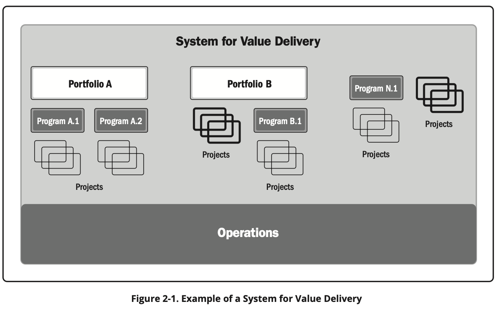

# A System for Value Delivery
| English | Vietnamese |
|---------|------------|
| The information in this section provides a context for value delivery, governance, project functions, the project environment, and product management. | Thông tin trong phần này cung cấp bối cảnh cho việc cung cấp giá trị, quản trị, các chức năng dự án, môi trường dự án và quản lý sản phẩm. |
| ▶ Section 2.1 Creating Value. This section describes how projects operate within a system to produce value for organizations and their stakeholders. | ▶ Mục 2.1 Tạo ra giá trị. Phần này mô tả cách các dự án hoạt động trong một hệ thống để tạo ra giá trị cho các tổ chức và các bên liên quan của họ. |
| ▶ Section 2.2 Organizational Governance Systems. This section describes how governance supports a system for value delivery. | ▶ Mục 2.2 Hệ thống quản trị tổ chức. Phần này mô tả cách quản trị hỗ trợ một hệ thống cung cấp giá trị. |
| ▶ Section 2.3 Functions Associated with Projects. This section identifies the functions that support projects. | ▶ Mục 2.3 Các chức năng liên quan đến dự án. Phần này xác định các chức năng hỗ trợ dự án. |
| ▶ Section 2.4 The Project Environment. This section identifies internal and external factors that influence projects and the delivery of value. | ▶ Mục 2.4 Môi trường dự án. Phần này xác định các yếu tố bên trong và bên ngoài ảnh hưởng đến dự án và việc cung cấp giá trị. |
| ▶ Section 2.5 Product Management Considerations. This section identifies the ways portfolios, programs, projects, and products relate. | ▶ Mục 2.5 Các yếu tố cần xem xét trong quản lý sản phẩm. Phần này xác định cách danh mục, chương trình, dự án và sản phẩm có liên quan với nhau. |
| 2.1 CREATING VALUE | 2.1 TẠO RA GIÁ TRỊ |
| Projects exist within a larger system, such as a governmental agency, organization, or contractual arrangement. For the sake of brevity, this standard uses the term organization when referring to government agencies, enterprises, contractual arrangements, joint ventures, and other arrangements. | Các dự án tồn tại trong một hệ thống lớn hơn, chẳng hạn như cơ quan chính phủ, tổ chức hoặc thỏa thuận hợp đồng. Để ngắn gọn, tiêu chuẩn này sử dụng thuật ngữ “tổ chức” khi đề cập đến cơ quan chính phủ, doanh nghiệp, thỏa thuận hợp đồng, liên doanh và các thỏa thuận khác. |
| Organizations create value for stakeholders. Examples of ways that projects produce value include, but are not limited to: | Các tổ chức tạo ra giá trị cho các bên liên quan. Ví dụ về các cách mà dự án tạo ra giá trị bao gồm, nhưng không giới hạn ở: |
| Creating a new product, service, or result that meets the needs of customers or end users; | Tạo ra một sản phẩm, dịch vụ hoặc kết quả mới đáp ứng nhu cầu của khách hàng hoặc người sử dụng cuối; |
| Creating positive social or environmental contributions; | Tạo ra các đóng góp tích cực về mặt xã hội hoặc môi trường; |
| Improving efficiency, productivity, effectiveness, or responsiveness; | Cải thiện hiệu quả, năng suất, hiệu lực hoặc khả năng phản hồi; |
| Enabling the changes needed to facilitate organizational transition to its desired future state; and | Tạo điều kiện cho các thay đổi cần thiết nhằm hỗ trợ tổ chức chuyển đổi đến trạng thái mong muốn trong tương lai; và |
| Sustaining benefits enabled by previous programs, projects, or business operations. | Duy trì các lợi ích đã được tạo ra từ các chương trình, dự án hoặc hoạt động kinh doanh trước đó. |
| 2.1.1 VALUE DELIVERY COMPONENTS | 2.1.1 CÁC THÀNH PHẦN CUNG CẤP GIÁ TRỊ |
| There are various components, such as portfolios, programs, projects, products, and operations, that can be used individually and collectively to create value. | Có nhiều thành phần khác nhau, chẳng hạn như danh mục, chương trình, dự án, sản phẩm và hoạt động, có thể được sử dụng riêng lẻ hoặc kết hợp để tạo ra giá trị. |
| Working together, these components comprise a system for delivering value that is aligned with the organization’s strategy. | Khi hoạt động cùng nhau, các thành phần này tạo thành một hệ thống cung cấp giá trị phù hợp với chiến lược của tổ chức. |
| Figure 2-1 shows an example of a system to deliver value that has two portfolios comprised of programs and projects. | Hình 2-1 minh họa một ví dụ về hệ thống cung cấp giá trị với hai danh mục, mỗi danh mục bao gồm các chương trình và dự án. |
| It also shows a stand-alone program with projects and stand-alone projects not associated with portfolios or programs. | Nó cũng hiển thị một chương trình độc lập với các dự án và các dự án độc lập không liên kết với danh mục hoặc chương trình nào. |
| Any of the projects or programs could include products. | Bất kỳ dự án hoặc chương trình nào cũng có thể bao gồm sản phẩm. |
| Operations can directly support and influence portfolios, programs, and projects, as well as other business functions, such as payroll, supply chain management, and so forth. | Các hoạt động có thể trực tiếp hỗ trợ và ảnh hưởng đến danh mục, chương trình và dự án, cũng như các chức năng kinh doanh khác, chẳng hạn như bảng lương, quản lý chuỗi cung ứng, v.v. |
| Portfolios, programs, and projects influence each other as well as operations. | Danh mục, chương trình và dự án ảnh hưởng lẫn nhau cũng như đến các hoạt động. |

