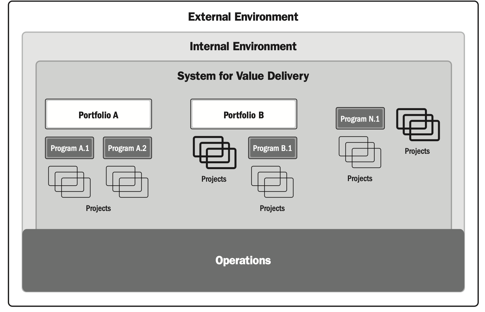

# A System for Value Delivery
| English | Vietnamese |
|---------|------------|
| The information in this section provides a context for value delivery, governance, project functions, the project environment, and product management. | Thông tin trong phần này cung cấp bối cảnh cho việc cung cấp giá trị, quản trị, các chức năng dự án, môi trường dự án và quản lý sản phẩm. |
| ▶ Section 2.1 Creating Value. This section describes how projects operate within a system to produce value for organizations and their stakeholders. | ▶ Mục 2.1 Tạo ra giá trị. Phần này mô tả cách các dự án hoạt động trong một hệ thống để tạo ra giá trị cho các tổ chức và các bên liên quan của họ. |
| ▶ Section 2.2 Organizational Governance Systems. This section describes how governance supports a system for value delivery. | ▶ Mục 2.2 Hệ thống quản trị tổ chức. Phần này mô tả cách quản trị hỗ trợ một hệ thống cung cấp giá trị. |
| ▶ Section 2.3 Functions Associated with Projects. This section identifies the functions that support projects. | ▶ Mục 2.3 Các chức năng liên quan đến dự án. Phần này xác định các chức năng hỗ trợ dự án. |
| ▶ Section 2.4 The Project Environment. This section identifies internal and external factors that influence projects and the delivery of value. | ▶ Mục 2.4 Môi trường dự án. Phần này xác định các yếu tố bên trong và bên ngoài ảnh hưởng đến dự án và việc cung cấp giá trị. |
| ▶ Section 2.5 Product Management Considerations. This section identifies the ways portfolios, programs, projects, and products relate. | ▶ Mục 2.5 Các yếu tố cần xem xét trong quản lý sản phẩm. Phần này xác định cách danh mục, chương trình, dự án và sản phẩm có liên quan với nhau. |
| 2.1 CREATING VALUE | 2.1 TẠO RA GIÁ TRỊ |
| Projects exist within a larger system, such as a governmental agency, organization, or contractual arrangement. For the sake of brevity, this standard uses the term organization when referring to government agencies, enterprises, contractual arrangements, joint ventures, and other arrangements. | Các dự án tồn tại trong một hệ thống lớn hơn, chẳng hạn như cơ quan chính phủ, tổ chức hoặc thỏa thuận hợp đồng. Để ngắn gọn, tiêu chuẩn này sử dụng thuật ngữ “tổ chức” khi đề cập đến cơ quan chính phủ, doanh nghiệp, thỏa thuận hợp đồng, liên doanh và các thỏa thuận khác. |
| Organizations create value for stakeholders. Examples of ways that projects produce value include, but are not limited to: | Các tổ chức tạo ra giá trị cho các bên liên quan. Ví dụ về các cách mà dự án tạo ra giá trị bao gồm, nhưng không giới hạn ở: |
| Creating a new product, service, or result that meets the needs of customers or end users; | Tạo ra một sản phẩm, dịch vụ hoặc kết quả mới đáp ứng nhu cầu của khách hàng hoặc người sử dụng cuối; |
| Creating positive social or environmental contributions; | Tạo ra các đóng góp tích cực về mặt xã hội hoặc môi trường; |
| Improving efficiency, productivity, effectiveness, or responsiveness; | Cải thiện hiệu quả, năng suất, hiệu lực hoặc khả năng phản hồi; |
| Enabling the changes needed to facilitate organizational transition to its desired future state; and | Tạo điều kiện cho các thay đổi cần thiết nhằm hỗ trợ tổ chức chuyển đổi đến trạng thái mong muốn trong tương lai; và |
| Sustaining benefits enabled by previous programs, projects, or business operations. | Duy trì các lợi ích đã được tạo ra từ các chương trình, dự án hoặc hoạt động kinh doanh trước đó. |
| 2.1.1 VALUE DELIVERY COMPONENTS | 2.1.1 CÁC THÀNH PHẦN CUNG CẤP GIÁ TRỊ |
| There are various components, such as portfolios, programs, projects, products, and operations, that can be used individually and collectively to create value. | Có nhiều thành phần khác nhau, chẳng hạn như danh mục, chương trình, dự án, sản phẩm và hoạt động, có thể được sử dụng riêng lẻ hoặc kết hợp để tạo ra giá trị. |
| Working together, these components comprise a system for delivering value that is aligned with the organization’s strategy. | Khi hoạt động cùng nhau, các thành phần này tạo thành một hệ thống cung cấp giá trị phù hợp với chiến lược của tổ chức. |
| Figure 2-1 shows an example of a system to deliver value that has two portfolios comprised of programs and projects. | Hình 2-1 minh họa một ví dụ về hệ thống cung cấp giá trị với hai danh mục, mỗi danh mục bao gồm các chương trình và dự án. |
| It also shows a stand-alone program with projects and stand-alone projects not associated with portfolios or programs. | Nó cũng hiển thị một chương trình độc lập với các dự án và các dự án độc lập không liên kết với danh mục hoặc chương trình nào. |
| Any of the projects or programs could include products. | Bất kỳ dự án hoặc chương trình nào cũng có thể bao gồm sản phẩm. |
| Operations can directly support and influence portfolios, programs, and projects, as well as other business functions, such as payroll, supply chain management, and so forth. | Các hoạt động có thể trực tiếp hỗ trợ và ảnh hưởng đến danh mục, chương trình và dự án, cũng như các chức năng kinh doanh khác, chẳng hạn như bảng lương, quản lý chuỗi cung ứng, v.v. |
| Portfolios, programs, and projects influence each other as well as operations. | Danh mục, chương trình và dự án ảnh hưởng lẫn nhau cũng như đến các hoạt động. |

| English | Vietnamese |
|---------|------------|
| As shown in Figure 2-2, a system for value delivery is part of an organization’s internal environment that is subject to policies, procedures, methodologies, frameworks, governance structures, and so forth. | Như được thể hiện trong Hình 2-2, một hệ thống cung cấp giá trị là một phần của môi trường nội bộ của tổ chức, chịu sự quản lý bởi các chính sách, quy trình, phương pháp, khung làm việc, cơ cấu quản trị, v.v. |
| That internal environment exists within the larger external environment, which includes the economy, the competitive environment, legislative constraints, etc. | Môi trường nội bộ đó tồn tại bên trong một môi trường bên ngoài rộng lớn hơn, bao gồm nền kinh tế, môi trường cạnh tranh, các ràng buộc pháp lý, v.v. |
| Section 2.4 provides more detail on internal and external environments. | Mục 2.4 cung cấp chi tiết hơn về môi trường nội bộ và môi trường bên ngoài. |

| English | Vietnamese |
|---------|------------|
| The components in a value delivery system create deliverables used to produce outcomes. | Các thành phần trong hệ thống cung cấp giá trị tạo ra các sản phẩm bàn giao được sử dụng để tạo ra các kết quả. |
| An outcome is the end result or consequence of a process or a project. | Kết quả là kết quả cuối cùng hoặc hệ quả của một quy trình hoặc một dự án. |
| Focusing on outcomes, choices, and decisions emphasizes the long-range performance of the project. | Tập trung vào kết quả, các lựa chọn và quyết định sẽ nhấn mạnh đến hiệu suất dài hạn của dự án. |
| The outcomes create benefits, which are gains realized by the organization. | Các kết quả tạo ra lợi ích, đó là những giá trị đạt được bởi tổ chức. |
| Benefits, in turn, create value, which is something of worth, importance, or usefulness. | Lợi ích, đến lượt nó, tạo ra giá trị — thứ có giá trị, tầm quan trọng hoặc tính hữu ích. |

| English | Vietnamese |
|---------|------------|
| 2.1.2 INFORMATION FLOW | 2.1.2 DÒNG THÔNG TIN |
| A value delivery system works most effectively when information and feedback are shared consistently among all components, keeping the system aligned with strategy and attuned to the environment. | Một hệ thống cung cấp giá trị hoạt động hiệu quả nhất khi thông tin và phản hồi được chia sẻ liên tục giữa tất cả các thành phần, giữ cho hệ thống phù hợp với chiến lược và nhạy bén với môi trường. |
| Figure 2-3 shows a model of the flow of information where black arrows represent information from senior leadership to portfolios, portfolios to programs and projects, and then to operations. | Hình 2-3 minh họa một mô hình dòng thông tin, trong đó các mũi tên màu đen đại diện cho thông tin từ lãnh đạo cấp cao đến các danh mục, từ danh mục đến chương trình và dự án, sau đó đến các hoạt động. |
| Senior leadership shares strategic information with portfolios. | Lãnh đạo cấp cao chia sẻ thông tin chiến lược với các danh mục. |
| Portfolios share the desired outcomes, benefits, and value with programs and projects. | Các danh mục chia sẻ các kết quả mong muốn, lợi ích và giá trị với các chương trình và dự án. |
| Deliverables from programs and projects are passed on to operations along with information on support and maintenance for the deliverables. | Các sản phẩm bàn giao từ chương trình và dự án được chuyển đến các hoạt động cùng với thông tin về hỗ trợ và bảo trì cho các sản phẩm bàn giao đó. |
| The light gray arrows in Figure 2-3 represent the reverse flow of information. | Các mũi tên màu xám nhạt trong Hình 2-3 đại diện cho dòng thông tin ngược. |
| Information from operations to programs and projects suggests adjustments, fixes, and updates to deliverables. | Thông tin từ các hoạt động đến chương trình và dự án gợi ý các điều chỉnh, sửa chữa và cập nhật cho các sản phẩm bàn giao. |
| Programs and projects provide performance information and progress on achieving the desired outcomes, benefits, and value to portfolios. | Chương trình và dự án cung cấp thông tin về hiệu suất và tiến độ đạt được các kết quả mong muốn, lợi ích và giá trị cho các danh mục. |
| Portfolios provide evaluations on portfolio performance with senior leadership. | Các danh mục cung cấp đánh giá về hiệu suất danh mục cho lãnh đạo cấp cao. |
| Additionally, operations provide information on how well the organization’s strategy is advancing. | Ngoài ra, các hoạt động cung cấp thông tin về mức độ tiến triển của chiến lược tổ chức. |

| English | Vietnamese |
|---------|------------|
| 2.2 ORGANIZATIONAL GOVERNANCE SYSTEMS | 2.2 HỆ THỐNG QUẢN TRỊ TỔ CHỨC |
| The governance system works alongside the value delivery system to enable smooth workflows, manage issues, and support decision making. | Hệ thống quản trị hoạt động cùng với hệ thống cung cấp giá trị để đảm bảo luồng công việc suôn sẻ, quản lý các vấn đề và hỗ trợ ra quyết định. |
| Governance systems provide a framework with functions and processes that guide activities. | Hệ thống quản trị cung cấp một khung với các chức năng và quy trình hướng dẫn các hoạt động. |
| A governance framework can include elements of oversight, control, value assessment, integration among components, and decision-making capabilities. | Một khung quản trị có thể bao gồm các yếu tố giám sát, kiểm soát, đánh giá giá trị, tích hợp giữa các thành phần và khả năng ra quyết định. |
| Governance systems provide an integrated structure for evaluating changes, issues, and risks associated with the environment and any component in the value delivery system. | Hệ thống quản trị cung cấp một cấu trúc tích hợp để đánh giá các thay đổi, vấn đề và rủi ro liên quan đến môi trường và bất kỳ thành phần nào trong hệ thống cung cấp giá trị. |
| This includes portfolio objectives, program benefits, and deliverables produced by projects. | Điều này bao gồm các mục tiêu của danh mục, lợi ích của chương trình và các sản phẩm bàn giao do dự án tạo ra. |
| Projects can operate within a program or portfolio or as a stand-alone activity. | Các dự án có thể hoạt động trong một chương trình hoặc danh mục hoặc như một hoạt động độc lập. |
| In some organizations, a project management office might support programs and projects within a portfolio. | Ở một số tổ chức, văn phòng quản lý dự án có thể hỗ trợ các chương trình và dự án trong danh mục. |
| Project governance includes defining the authority to approve changes and make other business decisions related to the project. | Quản trị dự án bao gồm việc xác định quyền hạn để phê duyệt các thay đổi và đưa ra các quyết định kinh doanh khác liên quan đến dự án. |
| Project governance is aligned with program and/or organizational governance. | Quản trị dự án được căn chỉnh với quản trị chương trình và/hoặc quản trị tổ chức. |
| 2.3 FUNCTIONS ASSOCIATED WITH PROJECTS | 2.3 CÁC CHỨC NĂNG LIÊN QUAN ĐẾN DỰ ÁN |
| People drive project delivery. | Con người là yếu tố thúc đẩy việc thực hiện dự án. |
| They do so by fulfilling functions necessary for the project to run effectively and efficiently. | Họ thực hiện điều đó bằng cách thực hiện các chức năng cần thiết để dự án vận hành hiệu quả và tối ưu. |
| Functions related to the project can be fulfilled by one person, by a group of people, or combined into defined roles. | Các chức năng liên quan đến dự án có thể do một người đảm nhiệm, do một nhóm người đảm nhiệm hoặc kết hợp thành các vai trò đã được định nghĩa. |
| Coordinating a collective work effort is extremely important to the success of any project. | Phối hợp một nỗ lực làm việc tập thể là vô cùng quan trọng đối với sự thành công của bất kỳ dự án nào. |
| There are different types of coordination suitable for different contexts. | Có nhiều loại hình phối hợp khác nhau phù hợp với các bối cảnh khác nhau. |
| Some projects benefit from decentralized coordination in which project team members self-organize and self-manage. | Một số dự án hưởng lợi từ sự phối hợp phi tập trung, trong đó các thành viên nhóm dự án tự tổ chức và tự quản lý. |
| Other projects benefit from centralized coordination with the leadership and guidance of a designated project manager or similar role. | Một số dự án khác hưởng lợi từ sự phối hợp tập trung với sự lãnh đạo và hướng dẫn của một quản lý dự án được chỉ định hoặc vai trò tương tự. |
| Some projects with centralized coordination can also benefit from including self-organized project teams for portions of the work. | Một số dự án với phối hợp tập trung cũng có thể hưởng lợi khi bao gồm các nhóm dự án tự tổ chức cho một phần công việc. |
| Regardless of how coordination takes place, supportive leadership models and meaningful, continuous engagements between project teams and other stakeholders underpin successful outcomes. | Bất kể sự phối hợp diễn ra như thế nào, các mô hình lãnh đạo hỗ trợ và sự tương tác liên tục, có ý nghĩa giữa các nhóm dự án và các bên liên quan khác là nền tảng cho các kết quả thành công. |
| English | Vietnamese |
|---------|------------|
| Regardless of how projects are coordinated, the collective effort of the project team delivers the outcomes, benefits, and value. | Bất kể dự án được phối hợp như thế nào, nỗ lực tập thể của nhóm dự án sẽ mang lại kết quả, lợi ích và giá trị. |
| The project team may be supported by additional functions depending on the deliverables, industry, organization, and other variables. | Nhóm dự án có thể được hỗ trợ bởi các chức năng bổ sung tùy thuộc vào sản phẩm bàn giao, ngành, tổ chức và các biến số khác. |
| Sections 2.3.1 through 2.3.8 provide examples of functions that are often found on projects, though these are not a comprehensive list. | Các mục 2.3.1 đến 2.3.8 cung cấp ví dụ về các chức năng thường xuất hiện trong dự án, mặc dù đây không phải là danh sách đầy đủ. |
| In addition to these functions, other functions may be necessary to enable project deliverables that produce the desired outcomes. | Bên cạnh các chức năng này, các chức năng khác có thể cần thiết để hỗ trợ các sản phẩm bàn giao dự án tạo ra kết quả mong muốn. |
| The needs of the project, organization, and environment influence which functions are used on a project and how those functions are carried out. | Nhu cầu của dự án, tổ chức và môi trường ảnh hưởng đến việc lựa chọn các chức năng sử dụng trong dự án và cách thực hiện các chức năng đó. |
| 2.3.1 PROVIDE OVERSIGHT AND COORDINATION | 2.3.1 CUNG CẤP GIÁM SÁT VÀ PHỐI HỢP |
| People in this function help the project team achieve the project objectives, typically by orchestrating the work of the project. | Những người thực hiện chức năng này giúp nhóm dự án đạt được các mục tiêu dự án, thường bằng cách điều phối công việc của dự án. |
| The specifics of how this function is carried out within the project team can vary among organizations, but can include leading the planning, monitoring, and controlling activities. | Cách thực hiện chức năng này trong nhóm dự án có thể khác nhau giữa các tổ chức, nhưng có thể bao gồm việc dẫn dắt các hoạt động lập kế hoạch, giám sát và kiểm soát. |
| In some organizations, this function may involve some evaluation and analysis activities as part of pre-project activities. | Ở một số tổ chức, chức năng này có thể bao gồm một số hoạt động đánh giá và phân tích như một phần của các hoạt động trước dự án. |
| This function includes monitoring and working to improve the health, safety, and overall well-being of project team members. | Chức năng này bao gồm giám sát và cải thiện sức khỏe, an toàn và phúc lợi tổng thể của các thành viên nhóm dự án. |
| Coordination includes consulting with executive and business unit leaders on ideas for advancing objectives, improving project performance, or meeting customer needs. | Phối hợp bao gồm tư vấn với lãnh đạo cấp cao và lãnh đạo các đơn vị kinh doanh về các ý tưởng để thúc đẩy mục tiêu, cải thiện hiệu suất dự án hoặc đáp ứng nhu cầu khách hàng. |
| It can also include assisting in business analysis, tendering and contract negotiations, and business case development. | Nó cũng có thể bao gồm hỗ trợ phân tích kinh doanh, đấu thầu và đàm phán hợp đồng, cũng như phát triển hồ sơ dự án. |
| Oversight can be involved in follow-on activities related to benefits realization and sustainment after the project deliverables are finalized but before formal closure of the project. | Giám sát có thể tham gia vào các hoạt động tiếp theo liên quan đến việc thực hiện và duy trì lợi ích sau khi các sản phẩm bàn giao dự án đã hoàn tất nhưng trước khi dự án được đóng chính thức. |
| This function can support portfolios and programs within which the project is initiated. | Chức năng này có thể hỗ trợ các danh mục và chương trình mà trong đó dự án được khởi xướng. |
| Ultimately, the function is tailored to fit the organization. | Cuối cùng, chức năng này được điều chỉnh phù hợp với tổ chức. |
| 2.3.2 PRESENT OBJECTIVES AND FEEDBACK | 2.3.2 TRÌNH BÀY MỤC TIÊU VÀ PHẢN HỒI |
| People in this function contribute perspectives, insights, and clear direction from customers and end users. | Những người thực hiện chức năng này đóng góp quan điểm, thông tin chi tiết và hướng dẫn rõ ràng từ khách hàng và người sử dụng cuối. |
| The customer and end user are not always synonymous. | Khách hàng và người sử dụng cuối không phải lúc nào cũng đồng nghĩa với nhau. |
| For the purpose of this standard, the customer is defined as the individual or group who has requested or is funding the project. | Theo tiêu chuẩn này, khách hàng được định nghĩa là cá nhân hoặc nhóm đã yêu cầu hoặc đang tài trợ cho dự án. |
| The end user is the individual or group who will experience the direct use of the project deliverable. | Người sử dụng cuối là cá nhân hoặc nhóm sẽ trực tiếp sử dụng sản phẩm bàn giao của dự án. |
| English | Vietnamese |
|---------|------------|
| Projects need clear direction from customers and end users regarding project requirements, outcomes, and expectations. | Các dự án cần hướng dẫn rõ ràng từ khách hàng và người sử dụng cuối về yêu cầu, kết quả và kỳ vọng của dự án. |
| In adaptive and hybrid project environments, the need for ongoing feedback is greater because the project teams are exploring and developing product elements within specific increments. | Trong các môi trường dự án thích ứng và lai, nhu cầu phản hồi liên tục lớn hơn vì các nhóm dự án đang khám phá và phát triển các yếu tố sản phẩm theo từng giai đoạn cụ thể. |
| In some project environments, the customer or end user engages with the project team for periodic review and feedback. | Trong một số môi trường dự án, khách hàng hoặc người sử dụng cuối tương tác với nhóm dự án để đánh giá và phản hồi định kỳ. |
| In some projects, a representative of the customer or client participates on the project team. | Trong một số dự án, một đại diện của khách hàng hoặc bên thuê tham gia vào nhóm dự án. |
| The customer and end user input and feedback needs are determined by the nature of the project and the guidance or direction required. | Nhu cầu về thông tin và phản hồi từ khách hàng và người sử dụng cuối được xác định bởi bản chất của dự án và hướng dẫn hoặc chỉ đạo cần thiết. |
| 2.3.3 FACILITATE AND SUPPORT | 2.3.3 HỖ TRỢ VÀ TẠO ĐIỀU KIỆN |
| The function of facilitation and support may be closely related to providing oversight and coordination, depending on the nature of the project. | Chức năng hỗ trợ và tạo điều kiện có thể liên quan chặt chẽ đến việc cung cấp giám sát và phối hợp, tùy thuộc vào bản chất của dự án. |
| The work involves encouraging project team member participation, collaboration, and a shared sense of responsibility for the work output. | Công việc này liên quan đến việc khuyến khích sự tham gia của các thành viên nhóm dự án, hợp tác và cảm giác trách nhiệm chung đối với kết quả công việc. |
| Facilitation helps the project team create consensus around solutions, resolve conflicts, and make decisions. | Hỗ trợ giúp nhóm dự án đạt được sự đồng thuận về các giải pháp, giải quyết xung đột và ra quyết định. |
| Facilitation is also required to coordinate meetings and contribute in an unbiased way to the advancement of project objectives. | Hỗ trợ cũng cần thiết để điều phối các cuộc họp và đóng góp một cách công bằng vào việc thúc đẩy các mục tiêu dự án. |
| Supporting people through change and helping address obstacles that can prevent success is also required. | Hỗ trợ con người vượt qua thay đổi và giúp giải quyết các trở ngại có thể ngăn cản thành công cũng là điều cần thiết. |
| This can include evaluating performance and providing individuals and project teams with feedback to help them learn, adapt, and improve. | Điều này có thể bao gồm việc đánh giá hiệu suất và cung cấp phản hồi cho các cá nhân và nhóm dự án để giúp họ học hỏi, thích ứng và cải thiện. |
| 2.3.4 PERFORM WORK AND CONTRIBUTE INSIGHTS | 2.3.4 THỰC HIỆN CÔNG VIỆC VÀ ĐÓNG GÓP NHẬN THỨC |
| This group of people provides the knowledge, skills, and experience necessary to produce the products and realize the outcomes of the project. | Nhóm người này cung cấp kiến thức, kỹ năng và kinh nghiệm cần thiết để tạo ra sản phẩm và hiện thực hóa kết quả của dự án. |
| Work can be full time or part time for the duration of the project or for a limited period, and the work can be colocated or virtual, depending on the environmental factors. | Công việc có thể toàn thời gian hoặc bán thời gian trong suốt dự án hoặc một khoảng thời gian giới hạn, và công việc có thể được thực hiện tại cùng địa điểm hoặc từ xa, tùy thuộc vào các yếu tố môi trường. |
| Some work can be highly specialized, while other work can be done by project team members who have broad skill sets. | Một số công việc có thể yêu cầu chuyên môn cao, trong khi các công việc khác có thể được thực hiện bởi các thành viên nhóm dự án có bộ kỹ năng đa dạng. |
| Gaining insights from cross-functional project team members representing different parts of the organization can provide a mix of internal perspectives, establish alliances with key business units, and encourage project team members to act as change agents within their functional areas. | Thu thập nhận thức từ các thành viên nhóm dự án đa chức năng đại diện cho các bộ phận khác nhau của tổ chức có thể cung cấp một hỗn hợp các quan điểm nội bộ, thiết lập liên minh với các đơn vị kinh doanh chính và khuyến khích các thành viên nhóm dự án hành động như những tác nhân thay đổi trong các lĩnh vực chức năng của họ. |
| This work can extend into support functions (during or after the project) as the project deliverables are implemented or transitioned into operations. | Công việc này có thể mở rộng sang các chức năng hỗ trợ (trong hoặc sau dự án) khi các sản phẩm bàn giao dự án được triển khai hoặc chuyển giao vào hoạt động. |
| English | Vietnamese |
|---------|------------|
| 2.3.5 APPLY EXPERTISE | 2.3.5 ÁP DỤNG CHUYÊN MÔN |
| People in this function provide the knowledge, vision, and expertise in a specific subject for a project. | Những người thực hiện chức năng này cung cấp kiến thức, tầm nhìn và chuyên môn trong một lĩnh vực cụ thể cho dự án. |
| They offer advice and support throughout the organization, and contribute to the project team’s learning process and work accuracy. | Họ đưa ra lời khuyên và hỗ trợ trong toàn tổ chức, đồng thời đóng góp vào quá trình học tập và độ chính xác công việc của nhóm dự án. |
| These people can be external to the organization or can be internal project team members. | Những người này có thể là bên ngoài tổ chức hoặc là thành viên nhóm dự án nội bộ. |
| They can be required for the whole project or during a specific time frame. | Họ có thể cần thiết cho toàn bộ dự án hoặc trong một khoảng thời gian cụ thể. |
| 2.3.6 PROVIDE BUSINESS DIRECTION AND INSIGHT | 2.3.6 CUNG CẤP HƯỚNG DẪN KINH DOANH VÀ NHẬN THỨC |
| People in this function guide and clarify the direction of the project or product outcome. | Những người thực hiện chức năng này hướng dẫn và làm rõ định hướng của dự án hoặc kết quả sản phẩm. |
| This function involves prioritizing the requirements or backlog items based on business value, dependencies, and technical or operational risk. | Chức năng này bao gồm việc ưu tiên các yêu cầu hoặc mục tồn đọng dựa trên giá trị kinh doanh, sự phụ thuộc và rủi ro kỹ thuật hoặc vận hành. |
| People in this function provide feedback to project teams and set direction for the next increment or element to be developed or delivered. | Những người thực hiện chức năng này cung cấp phản hồi cho nhóm dự án và đặt hướng đi cho phần hoặc yếu tố tiếp theo cần được phát triển hoặc bàn giao. |
| The function involves interacting with other stakeholders, customers, and their project teams to define the product direction. | Chức năng này bao gồm tương tác với các bên liên quan khác, khách hàng và nhóm dự án của họ để xác định định hướng sản phẩm. |
| The goal is to maximize the value of the project deliverable. | Mục tiêu là tối đa hóa giá trị của sản phẩm bàn giao dự án. |
| In adaptive and hybrid environments, direction and insight can be provided using a specific cadence. | Trong các môi trường thích ứng và lai, định hướng và nhận thức có thể được cung cấp theo một nhịp độ cụ thể. |
| In predictive environments, there can be designated checkpoints for presentation of and feedback on project progress. | Trong các môi trường dự đoán, có thể có các điểm kiểm tra được chỉ định để trình bày và phản hồi về tiến độ dự án. |
| In some instances, business direction can interact with funding and resourcing functions. | Trong một số trường hợp, hướng dẫn kinh doanh có thể tương tác với các chức năng tài trợ và phân bổ nguồn lực. |
| 2.3.7 PROVIDE RESOURCES AND DIRECTION | 2.3.7 CUNG CẤP NGUỒN LỰC VÀ HƯỚNG DẪN |
| People in this function promote the project and communicate the organization’s vision, goals, and expectations to the project team and broader stakeholder community. | Những người thực hiện chức năng này quảng bá dự án và truyền đạt tầm nhìn, mục tiêu và kỳ vọng của tổ chức tới nhóm dự án và cộng đồng các bên liên quan rộng hơn. |
| They advocate for the project and the project team by helping to secure the decisions, resources, and authority that allow project activities to progress. | Họ ủng hộ dự án và nhóm dự án bằng cách giúp đảm bảo các quyết định, nguồn lực và quyền hạn cho phép các hoạt động dự án tiến triển. |
| People in this function serve as liaisons between senior management and the project team, play a supporting role in keeping projects aligned to business objectives, remove obstacles, and address issues outside the bounds of the project team’s decision authority. | Những người thực hiện chức năng này đóng vai trò liên lạc giữa quản lý cấp cao và nhóm dự án, hỗ trợ giữ dự án phù hợp với các mục tiêu kinh doanh, loại bỏ trở ngại và giải quyết các vấn đề vượt ngoài quyền quyết định của nhóm dự án. |
| People in this function provide an escalation path for problems, issues, or risks that project teams cannot resolve or manage on their own, such as a shortage of funding or other resources, or deadlines that cannot be met. | Những người thực hiện chức năng này cung cấp một con đường leo thang cho các vấn đề, rủi ro mà nhóm dự án không thể tự giải quyết hoặc quản lý, chẳng hạn như thiếu hụt tài trợ hoặc các nguồn lực khác, hoặc các hạn chót không thể đáp ứng. |
| English | Vietnamese |
|---------|------------|
| This function can facilitate innovation by identifying opportunities that arise within the project and communicating these to senior management. | Chức năng này có thể thúc đẩy đổi mới bằng cách xác định các cơ hội phát sinh trong dự án và truyền đạt chúng tới quản lý cấp cao. |
| People in this function may monitor project outcomes after project closure to ensure the intended business benefits are realized. | Những người thực hiện chức năng này có thể giám sát kết quả dự án sau khi dự án kết thúc để đảm bảo các lợi ích kinh doanh dự kiến được thực hiện. |
| 2.3.8 MAINTAIN GOVERNANCE | 2.3.8 DUY TRÌ QUẢN TRỊ |
| People who fill a governance function approve and support recommendations made by the project team and monitor project progress in achieving the desired outcomes. | Những người thực hiện chức năng quản trị phê duyệt và hỗ trợ các khuyến nghị do nhóm dự án đưa ra và giám sát tiến độ dự án trong việc đạt được các kết quả mong muốn. |
| They maintain linkages between project teams and strategic or business objectives that can change over the course of the project. | Họ duy trì liên kết giữa nhóm dự án và các mục tiêu chiến lược hoặc kinh doanh có thể thay đổi trong suốt quá trình dự án. |
| 2.4 THE PROJECT ENVIRONMENT | 2.4 MÔI TRƯỜNG DỰ ÁN |
| Projects exist and operate within internal and external environments that have varying degrees of influence on value delivery. | Các dự án tồn tại và hoạt động trong môi trường nội bộ và bên ngoài, có mức độ ảnh hưởng khác nhau đến việc cung cấp giá trị. |
| Internal and external environments can influence planning and other project activities. | Môi trường nội bộ và bên ngoài có thể ảnh hưởng đến lập kế hoạch và các hoạt động khác của dự án. |
| These influences can yield a favorable, unfavorable, or neutral impact on project characteristics, stakeholders, or project teams. | Những ảnh hưởng này có thể mang lại tác động thuận lợi, bất lợi hoặc trung lập đối với đặc điểm dự án, các bên liên quan hoặc nhóm dự án. |
| 2.4.1 INTERNAL ENVIRONMENT | 2.4.1 MÔI TRƯỜNG NỘI BỘ |
| Factors internal to the organization can arise from the organization itself, a portfolio, a program, another project, or a combination of these. | Các yếu tố nội bộ của tổ chức có thể phát sinh từ chính tổ chức, một danh mục, một chương trình, một dự án khác hoặc sự kết hợp của các yếu tố này. |
| They include artifacts, practices, or internal knowledge. | Chúng bao gồm các sản phẩm, thực hành hoặc kiến thức nội bộ. |
| Knowledge includes lessons learned as well as completed artifacts from previous projects. | Kiến thức bao gồm các bài học kinh nghiệm cũng như các sản phẩm đã hoàn thành từ các dự án trước. |
| Examples include but are not limited to: | Ví dụ bao gồm nhưng không giới hạn ở: |
| English | Vietnamese |
|---------|------------|
| ▶ Process assets. Process assets may include tools, methodologies, approaches, templates, frameworks, patterns, or PMO resources. | ▶ Tài sản quy trình. Tài sản quy trình có thể bao gồm công cụ, phương pháp, cách tiếp cận, mẫu biểu, khung, mô hình, hoặc tài nguyên của PMO. |
| ▶ Governance documentation. This documentation includes policies and processes. | ▶ Tài liệu quản trị. Tài liệu này bao gồm các chính sách và quy trình. |
| ▶ Data assets. Data assets may include databases, document libraries, metrics, data, and artifacts from previous projects. | ▶ Tài sản dữ liệu. Tài sản dữ liệu có thể bao gồm cơ sở dữ liệu, thư viện tài liệu, số liệu, dữ liệu và các sản phẩm từ các dự án trước. |
| ▶ Knowledge assets. Knowledge assets may include tacit knowledge among project team members, subject matter experts, and other employees. | ▶ Tài sản kiến thức. Tài sản kiến thức có thể bao gồm kiến thức ngầm giữa các thành viên nhóm dự án, chuyên gia về chủ đề và các nhân viên khác. |
| ▶ Security and safety. Security and safety measures may include procedures and practices for facility access, data protection, levels of confidentiality, and proprietary secrets. | ▶ An ninh và an toàn. Các biện pháp an ninh và an toàn có thể bao gồm các thủ tục và thực hành về quyền truy cập cơ sở, bảo vệ dữ liệu, mức độ bảo mật và bí mật sở hữu. |
| ▶ Organizational culture, structure, and governance. These aspects of an organization include the vision, mission, values, beliefs, cultural norms, leadership style, hierarchy and authority relationships, organizational style, ethics, and code of conduct. | ▶ Văn hóa, cấu trúc và quản trị tổ chức. Các khía cạnh này của tổ chức bao gồm tầm nhìn, sứ mệnh, giá trị, niềm tin, chuẩn mực văn hóa, phong cách lãnh đạo, hệ thống cấp bậc và mối quan hệ quyền hạn, phong cách tổ chức, đạo đức và quy tắc ứng xử. |
| ▶ Geographic distribution of facilities and resources. These resources include work locations, virtual project teams, and shared systems. | ▶ Phân bố địa lý của cơ sở và nguồn lực. Các nguồn lực này bao gồm địa điểm làm việc, nhóm dự án ảo và các hệ thống chia sẻ. |
| ▶ Infrastructure. Infrastructure consists of existing facilities, equipment, organizational and telecommunications channels, information technology hardware, availability, and capacity. | ▶ Cơ sở hạ tầng. Cơ sở hạ tầng bao gồm các cơ sở hiện có, thiết bị, kênh tổ chức và viễn thông, phần cứng công nghệ thông tin, khả năng sẵn có và năng lực. |
| ▶ Information technology software. Examples include scheduling software, configuration management systems, web interfaces to online automated systems, collaboration tools, and work authorization systems. | ▶ Phần mềm công nghệ thông tin. Ví dụ bao gồm phần mềm lập lịch, hệ thống quản lý cấu hình, giao diện web với các hệ thống tự động trực tuyến, công cụ hợp tác và hệ thống cấp phép công việc. |
| ▶ Resource availability. Examples include contracting and purchasing constraints, approved providers and subcontractors, and collaboration agreements. Availability related to both people and materials includes contracting and purchasing constraints, approved providers and subcontractors, and time lines. | ▶ Khả năng sẵn có của nguồn lực. Ví dụ bao gồm các hạn chế về hợp đồng và mua sắm, nhà cung cấp và nhà thầu phụ được phê duyệt, và thỏa thuận hợp tác. Khả năng sẵn có liên quan đến cả con người và vật liệu bao gồm các hạn chế về hợp đồng và mua sắm, nhà cung cấp và nhà thầu phụ được phê duyệt, và tiến độ thời gian. |
| ▶ Employee capability. Examples include general and specialized expertise, skills, competencies, techniques, and knowledge. | ▶ Năng lực nhân viên. Ví dụ bao gồm chuyên môn chung và chuyên môn đặc thù, kỹ năng, năng lực, kỹ thuật và kiến thức. |
| English | Vietnamese |
|---------|------------|
| 2.4.2 EXTERNAL ENVIRONMENT | 2.4.2 MÔI TRƯỜNG BÊN NGOÀI |
| Factors external to the organization can enhance, constrain, or have a neutral influence on project outcomes. | Các yếu tố bên ngoài tổ chức có thể tăng cường, hạn chế hoặc có ảnh hưởng trung lập đến kết quả dự án. |
| Examples include but are not limited to: | Ví dụ bao gồm nhưng không giới hạn ở: |
| ▶ Marketplace conditions. Marketplace conditions include competitors, market share, brand recognition, technology trends, and trademarks. | ▶ Điều kiện thị trường. Điều kiện thị trường bao gồm đối thủ cạnh tranh, thị phần, nhận diện thương hiệu, xu hướng công nghệ và nhãn hiệu thương mại. |
| ▶ Social and cultural influences and issues. These factors include political climate, regional customs and traditions, public holidays and events, codes of conduct, ethics, and perceptions. | ▶ Ảnh hưởng và vấn đề xã hội và văn hóa. Các yếu tố này bao gồm tình hình chính trị, phong tục và truyền thống vùng miền, ngày lễ và sự kiện công cộng, quy tắc ứng xử, đạo đức và nhận thức. |
| ▶ Regulatory environment. The regulatory environment may include national and regional laws and regulations related to security, data protection, business conduct, employment, licensing, and procurement. | ▶ Môi trường pháp lý. Môi trường pháp lý có thể bao gồm luật và quy định quốc gia và vùng liên quan đến an ninh, bảo vệ dữ liệu, hành vi kinh doanh, việc làm, cấp phép và mua sắm. |
| ▶ Commercial databases. Databases include standardized cost estimating data and industry risk study information. | ▶ Cơ sở dữ liệu thương mại. Các cơ sở dữ liệu bao gồm dữ liệu ước tính chi phí chuẩn hóa và thông tin nghiên cứu rủi ro ngành. |
| ▶ Academic research. This research can include industry studies, publications, and benchmarking results. | ▶ Nghiên cứu học thuật. Nghiên cứu này có thể bao gồm các nghiên cứu ngành, ấn phẩm và kết quả so sánh chuẩn. |
| ▶ Industry standards. These standards are related to products, production, environment, quality, and workmanship. | ▶ Tiêu chuẩn ngành. Các tiêu chuẩn này liên quan đến sản phẩm, sản xuất, môi trường, chất lượng và tay nghề. |
| ▶ Financial considerations. These considerations include currency exchange rates, interest rates, inflation, taxes, and tariffs. | ▶ Cân nhắc tài chính. Các cân nhắc này bao gồm tỷ giá hối đoái, lãi suất, lạm phát, thuế và thuế quan. |
| ▶ Physical environment. The physical environment pertains to working conditions and weather. | ▶ Môi trường vật lý. Môi trường vật lý liên quan đến điều kiện làm việc và thời tiết. |
| 2.5 PRODUCT MANAGEMENT CONSIDERATIONS | 2.5 CÁC CÂN NHẮC VỀ QUẢN LÝ SẢN PHẨM |
| The disciplines of portfolio, program, project, and product management are becoming more interlinked. | Các lĩnh vực quản lý danh mục, chương trình, dự án và sản phẩm đang trở nên gắn kết hơn. |
| While portfolio, program, and product management are beyond the scope of this standard, understanding each discipline and the relationships between them provides a useful context for projects whose deliverables are products. | Mặc dù quản lý danh mục, chương trình và sản phẩm nằm ngoài phạm vi tiêu chuẩn này, việc hiểu từng lĩnh vực và mối quan hệ giữa chúng cung cấp bối cảnh hữu ích cho các dự án mà sản phẩm bàn giao là các sản phẩm. |
| English | Vietnamese |
|---------|------------|
| A product is an artifact that is produced, is quantifiable, and can be either an end item itself or a component item. | Sản phẩm là một sản phẩm vật lý hoặc phi vật lý được tạo ra, có thể đo lường được và có thể là sản phẩm cuối cùng hoặc là một thành phần. |
| Product management involves the integration of people, data, processes, and business systems to create, maintain, and develop a product or service throughout its life cycle. | Quản lý sản phẩm bao gồm việc tích hợp con người, dữ liệu, quy trình và hệ thống kinh doanh để tạo ra, duy trì và phát triển một sản phẩm hoặc dịch vụ trong suốt vòng đời của nó. |
| The product life cycle is a series of phases that represents the evolution of a product, from introduction through growth, maturity, and to retirement. | Vòng đời sản phẩm là một chuỗi các giai đoạn thể hiện sự tiến hóa của sản phẩm, từ giới thiệu, phát triển, trưởng thành đến khi ngừng sử dụng. |
| Product management may initiate programs or projects at any point in the product life cycle to create or enhance specific components, functions, or capabilities (see Figure 2-4). | Quản lý sản phẩm có thể khởi xướng các chương trình hoặc dự án vào bất kỳ điểm nào trong vòng đời sản phẩm để tạo ra hoặc cải thiện các thành phần, chức năng hoặc năng lực cụ thể (xem Hình 2-4). |
| The initial product may begin as a deliverable of a program or project. | Sản phẩm ban đầu có thể bắt đầu như một sản phẩm bàn giao của một chương trình hoặc dự án. |
| Throughout its life cycle, a new program or project may add or improve specific components, attributes, or capabilities that create additional value for customers and the sponsoring organization. | Trong suốt vòng đời của nó, một chương trình hoặc dự án mới có thể thêm vào hoặc cải thiện các thành phần, thuộc tính hoặc năng lực cụ thể để tạo ra giá trị bổ sung cho khách hàng và tổ chức tài trợ. |
| In some instances, a program can encompass the full life cycle of a product or service to manage the benefits and create value for the organization more directly. | Trong một số trường hợp, một chương trình có thể bao quát toàn bộ vòng đời của một sản phẩm hoặc dịch vụ để quản lý các lợi ích và tạo ra giá trị trực tiếp hơn cho tổ chức. |

| English | Vietnamese |
|---------|------------|
| Product management can exist in different forms, including but not limited to: | Quản lý sản phẩm có thể tồn tại dưới nhiều hình thức khác nhau, bao gồm nhưng không giới hạn ở: |
| ▶ Program management within a product life cycle. This approach incorporates related projects, subsidiary programs, and program activities. For very large or long-running products, one or more product life cycle phases may be sufficiently complex to merit a set of programs and projects working together. | ▶ Quản lý chương trình trong vòng đời sản phẩm. Cách tiếp cận này bao gồm các dự án liên quan, các chương trình phụ và các hoạt động chương trình. Đối với các sản phẩm rất lớn hoặc kéo dài, một hoặc nhiều giai đoạn của vòng đời sản phẩm có thể đủ phức tạp để cần một tập hợp các chương trình và dự án hoạt động cùng nhau. |
| ▶ Project management within a product life cycle. This approach oversees development and maturing of product capabilities as an ongoing business activity. Portfolio governance charters individual projects as needed to perform enhancements and improvements or to produce other unique outcomes. | ▶ Quản lý dự án trong vòng đời sản phẩm. Cách tiếp cận này giám sát việc phát triển và hoàn thiện năng lực sản phẩm như một hoạt động kinh doanh liên tục. Quản trị danh mục cấp phép các dự án riêng lẻ khi cần để thực hiện nâng cấp, cải tiến hoặc tạo ra các kết quả độc đáo khác. |
| ▶ Product management within a program. This approach applies the full product life cycle within the purview and boundaries of a given program. A series of subsidiary programs or projects will be chartered to achieve specific benefits for a product. Those benefits can be enhanced by applying product management competencies like competitive analysis, customer acquisition, and customer advocacy. | ▶ Quản lý sản phẩm trong một chương trình. Cách tiếp cận này áp dụng toàn bộ vòng đời sản phẩm trong phạm vi và ranh giới của một chương trình nhất định. Một loạt các chương trình phụ hoặc dự án sẽ được cấp phép để đạt được các lợi ích cụ thể cho một sản phẩm. Những lợi ích đó có thể được nâng cao bằng cách áp dụng các năng lực quản lý sản phẩm như phân tích cạnh tranh, thu hút khách hàng và bảo vệ quyền lợi khách hàng. |
| While product management is a separate discipline with its own body of knowledge, it represents a key integration point within the program management and project management disciplines. | Mặc dù quản lý sản phẩm là một lĩnh vực riêng với kho kiến thức của riêng nó, nhưng nó đại diện cho một điểm tích hợp quan trọng trong các lĩnh vực quản lý chương trình và quản lý dự án. |
| Programs and projects with deliverables that include products use a tailored and integrated approach that incorporates all of the relevant bodies of knowledge and their related practices, methods, and artifacts. | Các chương trình và dự án có sản phẩm bàn giao bao gồm sử dụng một cách tiếp cận tùy chỉnh và tích hợp, kết hợp tất cả các kho kiến thức liên quan cùng các thực hành, phương pháp và sản phẩm liên quan. |
