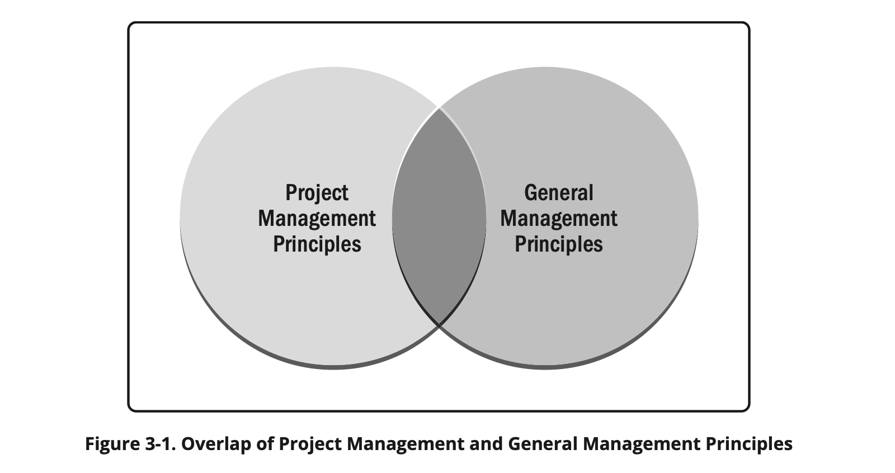
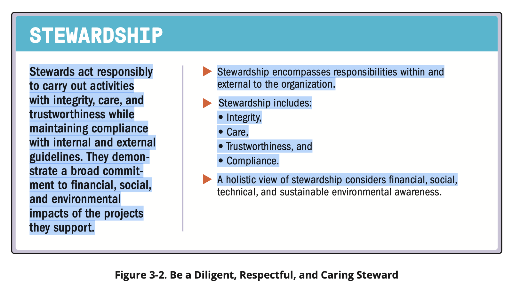

# Project Management Principles

| English | Vietnamese |
|---------|------------|
| Principles for a profession serve as foundational guidelines for strategy, decision making, and problem solving. | Nguyên tắc của một nghề nghiệp đóng vai trò là hướng dẫn cơ bản cho chiến lược, ra quyết định và giải quyết vấn đề. |
| Professional standards and methodologies are often based on principles. | Các tiêu chuẩn và phương pháp nghề nghiệp thường dựa trên nguyên tắc. |
| In some professions, principles serve as laws or rules, and are therefore prescriptive in nature. | Trong một số nghề nghiệp, nguyên tắc đóng vai trò như luật hoặc quy tắc, do đó mang tính quy định. |
| The principles of project management are not prescriptive in nature. | Nguyên tắc quản lý dự án không mang tính quy định. |
| They are intended to guide the behavior of people involved in projects. | Chúng nhằm hướng dẫn hành vi của những người tham gia dự án. |
| They are broadly based so there are many ways individuals and organizations can maintain alignment with the principles. | Chúng được xây dựng trên cơ sở rộng rãi, vì vậy có nhiều cách để cá nhân và tổ chức duy trì sự phù hợp với các nguyên tắc. |
| Principles can, but do not necessarily, reflect morals. | Nguyên tắc có thể, nhưng không nhất thiết, phản ánh đạo đức. |
| A code of ethics is related to morals. | Bộ quy tắc đạo đức liên quan đến đạo đức. |
| A code of ethics for a profession can be adopted by an individual or profession to establish expectations for moral conduct. | Bộ quy tắc đạo đức của một nghề nghiệp có thể được cá nhân hoặc nghề nghiệp áp dụng để thiết lập kỳ vọng về hành vi đạo đức. |
| The PMI Code of Ethics and Professional Conduct [2] is based on four values that were identified as most important to the project management community: | Bộ Quy tắc Đạo đức và Hành vi Chuyên nghiệp của PMI [2] dựa trên bốn giá trị được xác định là quan trọng nhất đối với cộng đồng quản lý dự án: |
| ▶ Responsibility, | ▶ Trách nhiệm, |
| ▶ Respect, | ▶ Tôn trọng, |
| ▶ Fairness, and | ▶ Công bằng, và |
| ▶ Honesty. | ▶ Trung thực. |
| The 12 principles of project management are aligned with the values identified in the PMI Code of Ethics and Professional Conduct. | 12 nguyên tắc quản lý dự án phù hợp với các giá trị được xác định trong Bộ Quy tắc Đạo đức và Hành vi Chuyên nghiệp của PMI. |
| They do not follow the same format, and they are not duplicative, rather the principles and the Code of Ethics are complementary. | Chúng không theo cùng một định dạng, và không bị trùng lặp; thay vào đó, các nguyên tắc và Bộ Quy tắc Đạo đức bổ sung cho nhau. |
| The principles of project management were identified and developed by engaging a global community of project practitioners. | Nguyên tắc quản lý dự án được xác định và phát triển thông qua sự tham gia của cộng đồng các chuyên gia quản lý dự án toàn cầu. |
| The practitioners represent different industries, cultural backgrounds, and organizations in different roles and with experience in various types of projects. | Các chuyên gia này đại diện cho các ngành công nghiệp, nền văn hóa và tổ chức khác nhau trong các vai trò khác nhau và có kinh nghiệm trong nhiều loại dự án. |
| Multiple rounds of feedback resulted in 12 principles that provide guidance for effective project management. | Nhiều vòng phản hồi đã dẫn đến 12 nguyên tắc cung cấp hướng dẫn cho quản lý dự án hiệu quả. |
| English | Vietnamese |
|---------|------------|
| Because the principles of project management provide guidance, the degree of application and the way in which they are applied are influenced by the context of the organization, project, deliverables, project team, stakeholders, and other factors. | Vì các nguyên tắc quản lý dự án cung cấp hướng dẫn, mức độ áp dụng và cách thức áp dụng chúng bị ảnh hưởng bởi bối cảnh của tổ chức, dự án, sản phẩm bàn giao, nhóm dự án, các bên liên quan và các yếu tố khác. |
| The principles are internally consistent, meaning that no principle contradicts any other principle. | Các nguyên tắc có tính nhất quán nội bộ, nghĩa là không có nguyên tắc nào mâu thuẫn với nguyên tắc khác. |
| However, in practice there may be times when the principles can overlap. | Tuy nhiên, trong thực tế, có thể có những lúc các nguyên tắc chồng chéo nhau. |
| For example, guidance for navigating complexity can present information that is useful in recognizing, evaluating, and responding to system interactions or optimizing risk responses. | Ví dụ, hướng dẫn để điều hướng sự phức tạp có thể cung cấp thông tin hữu ích trong việc nhận diện, đánh giá và phản ứng với các tương tác hệ thống hoặc tối ưu hóa phản ứng rủi ro. |
| Principles of project management can also have areas of overlap with general management principles. | Nguyên tắc quản lý dự án cũng có thể có các lĩnh vực chồng chéo với nguyên tắc quản lý chung. |
| For example, both projects and business in general focus on delivering value. | Ví dụ, cả dự án và kinh doanh nói chung đều tập trung vào việc tạo ra giá trị. |
| The methods may be somewhat different in projects as opposed to operations, but the underlying principle associated with focusing on value can apply to both. | Các phương pháp có thể khác nhau đôi chút trong dự án so với hoạt động, nhưng nguyên tắc cơ bản liên quan đến tập trung vào giá trị có thể áp dụng cho cả hai. |
| Figure 3-1 demonstrates this overlap. | Hình 3-1 minh họa sự chồng chéo này. |

| English | Vietnamese |
|---------|------------|
| The principle labels are listed here without any specific weighting or order. | Các nhãn nguyên tắc được liệt kê ở đây mà không có trọng số hay thứ tự cụ thể. |
| The principle statements are presented and described in Sections 3.1 through 3.12. | Các phát biểu về nguyên tắc được trình bày và mô tả trong các Mục 3.1 đến 3.12. |
| Each section begins with a figure that provides the principle label across the top with the principle and key points under the label. | Mỗi mục bắt đầu với một hình minh họa cung cấp nhãn nguyên tắc ở phía trên cùng với nguyên tắc và các điểm chính bên dưới nhãn. |
| Following the figure, each principle is elaborated in the text. | Sau hình minh họa, mỗi nguyên tắc được giải thích chi tiết trong văn bản. |
| The principle labels are: | Các nhãn nguyên tắc bao gồm: |
| ▶ Be a diligent, respectful, and caring steward (see Section 3.1). | ▶ Trở thành người quản lý siêng năng, tôn trọng và quan tâm (xem Mục 3.1). |
| ▶ Create a collaborative project team environment (see Section 3.2). | ▶ Tạo môi trường nhóm dự án hợp tác (xem Mục 3.2). |
| ▶ Effectively engage with stakeholders (see Section 3.3). | ▶ Tương tác hiệu quả với các bên liên quan (xem Mục 3.3). |
| ▶ Focus on value (see Section 3.4). | ▶ Tập trung vào giá trị (xem Mục 3.4). |
| ▶ Recognize, evaluate, and respond to system interactions (see Section 3.5). | ▶ Nhận diện, đánh giá và phản ứng với các tương tác hệ thống (xem Mục 3.5). |
| ▶ Demonstrate leadership behaviors (see Section 3.6). | ▶ Thể hiện hành vi lãnh đạo (xem Mục 3.6). |
| ▶ Tailor based on context (see Section 3.7). | ▶ Tùy chỉnh dựa trên bối cảnh (xem Mục 3.7). |
| ▶ Build quality into processes and deliverables (see Section 3.8). | ▶ Xây dựng chất lượng vào các quy trình và sản phẩm bàn giao (xem Mục 3.8). |
| ▶ Navigate complexity (see Section 3.9). | ▶ Điều hướng sự phức tạp (xem Mục 3.9). |
| ▶ Optimize risk responses (see Section 3.10). | ▶ Tối ưu hóa phản ứng rủi ro (xem Mục 3.10). |
| ▶ Embrace adaptability and resiliency (see Section 3.11). | ▶ Chấp nhận khả năng thích ứng và tính phục hồi (xem Mục 3.11). |
| ▶ Enable change to achieve the envisioned future state (see Section 3.12). | ▶ Thúc đẩy thay đổi để đạt được trạng thái tương lai mong đợi (xem Mục 3.12). |

| English | Vietnamese |
|---------|------------|
| Stewardship has slightly different meanings and applications in different contexts. | Quản lý trách nhiệm (stewardship) có những ý nghĩa và cách áp dụng hơi khác nhau trong các bối cảnh khác nhau. |
| One aspect of stewardship involves being entrusted with the care of something. | Một khía cạnh của stewardship liên quan đến việc được giao trách nhiệm chăm sóc một điều gì đó. |
| Another aspect focuses on the responsible planning, use, and management of resources. | Một khía cạnh khác tập trung vào việc lập kế hoạch, sử dụng và quản lý tài nguyên một cách có trách nhiệm. |
| Yet another aspect means upholding values and ethics. | Một khía cạnh khác nữa là duy trì các giá trị và đạo đức. |
| Stewardship encompasses responsibilities both within and external to the organization. | Stewardship bao gồm các trách nhiệm cả bên trong và bên ngoài tổ chức. |
| Within the organization, stewardship includes: | Bên trong tổ chức, stewardship bao gồm: |
| ▶ Operating in alignment with the organization, its objectives, strategy, vision, mission, and sustainment of its long-term value; | ▶ Hoạt động phù hợp với tổ chức, mục tiêu, chiến lược, tầm nhìn, sứ mệnh và duy trì giá trị dài hạn của tổ chức; |
| ▶ Commitment to and respectful engagement of project team members, including their compensation, access to opportunity, and fair treatment; | ▶ Cam kết và tham gia tôn trọng các thành viên nhóm dự án, bao gồm thù lao, cơ hội tiếp cận và đối xử công bằng; |
| ▶ Diligent oversight of organizational finances, materials, and other resources used within a project; and | ▶ Giám sát cẩn thận tài chính, vật liệu và các tài nguyên khác của tổ chức được sử dụng trong dự án; và |
| ▶ Understanding the appropriate use of authority, accountability, and responsibility, particularly in leadership positions. | ▶ Hiểu việc sử dụng thích hợp quyền hạn, trách nhiệm giải trình và trách nhiệm, đặc biệt trong các vị trí lãnh đạo. |
| Stewardship outside the organization includes responsibilities in areas such as: | Stewardship bên ngoài tổ chức bao gồm các trách nhiệm trong các lĩnh vực như: |
| ▶ Environmental sustainability and the organization’s use of materials and natural resources; | ▶ Bền vững môi trường và việc sử dụng vật liệu, tài nguyên thiên nhiên của tổ chức; |
| ▶ Organization’s relationship with external stakeholders such as its partners and channels; | ▶ Mối quan hệ của tổ chức với các bên liên quan bên ngoài như đối tác và kênh phân phối; |
| ▶ Impact of the organization or project on the market, social community, and regions in which it operates; and | ▶ Tác động của tổ chức hoặc dự án đối với thị trường, cộng đồng xã hội và các khu vực mà tổ chức hoạt động; và |
| ▶ Advancing the state of practice in professional industries. | ▶ Thúc đẩy sự phát triển của các thực tiễn trong ngành nghề chuyên môn. |
| Stewardship reflects understanding and acceptance of trust as well as actions and decisions that engender and sustain that trust. | Stewardship phản ánh sự hiểu biết và chấp nhận niềm tin cũng như các hành động và quyết định tạo ra và duy trì niềm tin đó. |
| Stewards also adhere to both implicit and explicit duties. These can include the following: | Người quản lý trách nhiệm cũng tuân thủ cả nghĩa vụ ngầm và rõ ràng. Các nghĩa vụ này có thể bao gồm các điều sau: |
| English | Vietnamese |
|---------|------------|
| ▶ Integrity. Stewards behave honestly and ethically in all engagements and communications. | ▶ Liêm chính. Người quản lý trách nhiệm cư xử trung thực và đạo đức trong tất cả các tương tác và giao tiếp. |
| Stewards hold themselves to the highest standards and reflect the values, principles, and behaviors expected of those in their organization. | Người quản lý trách nhiệm giữ mình theo các tiêu chuẩn cao nhất và phản ánh các giá trị, nguyên tắc và hành vi được mong đợi ở những người trong tổ chức của họ. |
| Stewards serve as role models, building trust by living and demonstrating personal and organizational values in their engagements, work activities, and decisions. | Người quản lý trách nhiệm làm gương, xây dựng niềm tin bằng cách sống và thể hiện các giá trị cá nhân và tổ chức trong các tương tác, hoạt động công việc và quyết định của họ. |
| In the project management context, this duty often requires stewards to challenge team members, peers, and other stakeholders to consider their words and actions; and to be empathetic, self-reflective, and open to feedback. | Trong bối cảnh quản lý dự án, nhiệm vụ này thường yêu cầu người quản lý trách nhiệm thách thức các thành viên nhóm, đồng nghiệp và các bên liên quan khác xem xét lời nói và hành động của họ; đồng thời phải đồng cảm, tự phản ánh và sẵn sàng tiếp nhận phản hồi. |
| ▶ Care. Stewards are fiduciaries of the organizational matters in their charge, and they diligently oversee them. | ▶ Chăm sóc. Người quản lý trách nhiệm là người được ủy thác đối với các vấn đề của tổ chức trong phạm vi quản lý của họ và họ giám sát cẩn thận những vấn đề đó. |
| Higher-performing projects feature professionals who diligently oversee those matters, beyond the confines of strictly defined responsibilities. | Các dự án có hiệu suất cao có những chuyên gia giám sát cẩn thận những vấn đề đó, vượt ra ngoài phạm vi các trách nhiệm được định nghĩa nghiêm ngặt. |
| Stewards pay close attention and exercise the same level of care over those matters as they would for their personal matters. | Người quản lý trách nhiệm chú ý kỹ lưỡng và áp dụng mức độ quan tâm tương tự đối với các vấn đề đó như họ làm với các vấn đề cá nhân của mình. |
| Care relates to the internal business affairs of the organization. | Chăm sóc liên quan đến các công việc nội bộ của tổ chức. |
| Care for the environment, sustainable use of natural resources, and concern for the conditions of people across the planet should be reflected in the organizational policies and principles. | Chăm sóc môi trường, sử dụng bền vững tài nguyên thiên nhiên và quan tâm đến điều kiện của con người trên toàn cầu nên được phản ánh trong các chính sách và nguyên tắc của tổ chức. |
| Projects bring about changes that may have unanticipated or unwanted consequences. | Các dự án mang lại những thay đổi có thể có các hậu quả không lường trước hoặc không mong muốn. |
| Project practitioners should identify, analyze, and manage the potential downsides of project outcomes so that stakeholders are aware and informed. | Những người thực hành dự án nên xác định, phân tích và quản lý những rủi ro tiềm tàng của kết quả dự án để các bên liên quan được nhận thức và thông tin đầy đủ. |
| Care includes creating a transparent working environment, open communication channels, and opportunities for stakeholders to raise concerns without penalty or fear of retribution. | Chăm sóc bao gồm tạo ra môi trường làm việc minh bạch, kênh giao tiếp mở và cơ hội cho các bên liên quan nêu lên mối quan tâm mà không bị trừng phạt hay lo sợ trả thù. |
| English | Vietnamese |
|---------|------------|
| ▶ Trustworthiness. Stewards represent themselves, their roles, their project team, and their authority accurately, both inside and outside of the organization. | ▶ Đáng tin cậy. Người quản lý trách nhiệm thể hiện chính mình, vai trò, nhóm dự án và quyền hạn của họ một cách chính xác, cả bên trong và bên ngoài tổ chức. |
| This behavior allows people to understand the degree to which an individual can commit resources, make decisions, or approve something. | Hành vi này giúp mọi người hiểu mức độ mà một cá nhân có thể cam kết tài nguyên, ra quyết định hoặc phê duyệt một việc gì đó. |
| Trustworthiness also entails individuals proactively identifying conflicts between their personal interests and those of their organization or clients. | Tính đáng tin cậy còn bao gồm việc cá nhân chủ động nhận diện xung đột giữa lợi ích cá nhân của họ và lợi ích của tổ chức hoặc khách hàng. |
| Such conflicts can undermine trust and confidence, result in unethical or illegal behaviors, create confusion, or contribute to suboptimal outcomes. | Những xung đột như vậy có thể làm suy giảm niềm tin, dẫn đến hành vi phi đạo đức hoặc bất hợp pháp, tạo ra sự nhầm lẫn hoặc góp phần tạo ra kết quả không tối ưu. |
| Stewards protect projects from such breaches of trust. | Người quản lý trách nhiệm bảo vệ dự án khỏi những vi phạm niềm tin như vậy. |
| ▶ Compliance. Stewards comply with laws, rules, regulations, and requirements that are properly authorized within or outside of their organization. | ▶ Tuân thủ. Người quản lý trách nhiệm tuân thủ luật pháp, quy tắc, quy định và các yêu cầu được cấp phép đúng đắn bên trong hoặc bên ngoài tổ chức của họ. |
| However, high-performing projects seek ways to integrate compliance more fully into the project culture, creating more alignment with diverse and potentially conflicting guidelines. | Tuy nhiên, các dự án có hiệu suất cao tìm cách tích hợp việc tuân thủ một cách toàn diện hơn vào văn hóa dự án, tạo sự phù hợp tốt hơn với các hướng dẫn đa dạng và có khả năng xung đột. |
| Stewards strive for compliance with guidelines intended to protect them, their organization, their stakeholders, and the public at large. | Người quản lý trách nhiệm nỗ lực tuân thủ các hướng dẫn nhằm bảo vệ họ, tổ chức, các bên liên quan và công chúng nói chung. |
| In instances where stewards face conflicting guidelines or questions regarding whether or not actions or plans align with established guidelines, stewards seek appropriate counsel and direction. | Trong các trường hợp người quản lý trách nhiệm gặp phải hướng dẫn xung đột hoặc nghi vấn về việc hành động hay kế hoạch có phù hợp với các hướng dẫn đã được thiết lập hay không, họ tìm kiếm tư vấn và chỉ dẫn phù hợp. |
| Stewardship requires leadership with transparency and trustworthiness. | Stewardship đòi hỏi lãnh đạo với tính minh bạch và đáng tin cậy. |
| Projects affect the lives of the people who deliver them as well as those who are affected by the project deliverables and outcomes. | Các dự án ảnh hưởng đến cuộc sống của những người thực hiện dự án cũng như những người chịu tác động từ sản phẩm và kết quả của dự án. |
| Projects can have effects, such as easing traffic congestion, producing new medications, or creating opportunities for people to interact. | Các dự án có thể tạo ra các tác động, chẳng hạn như giảm ùn tắc giao thông, sản xuất thuốc mới hoặc tạo cơ hội cho mọi người tương tác. |
| Those effects can produce negative impacts and consequences, such as reduced green space, side effects from medications, or disclosure of personal information. | Những tác động đó có thể tạo ra các ảnh hưởng tiêu cực và hậu quả, chẳng hạn như giảm diện tích xanh, tác dụng phụ từ thuốc, hoặc tiết lộ thông tin cá nhân. |
| Project teams and their organizational leaders carefully consider such factors and impacts so they can make responsible decisions by balancing organizational and project objectives with the larger needs and expectations of global stakeholders. | Các nhóm dự án và lãnh đạo tổ chức cân nhắc kỹ lưỡng các yếu tố và tác động này để có thể đưa ra quyết định có trách nhiệm bằng cách cân bằng mục tiêu tổ chức và dự án với nhu cầu và kỳ vọng lớn hơn của các bên liên quan toàn cầu. |
| Increasingly, organizations are taking a holistic view to business that considers financial, technical, social, and environmental performance simultaneously instead of sequentially. | Ngày càng nhiều tổ chức áp dụng quan điểm tổng thể về kinh doanh, xem xét hiệu quả tài chính, kỹ thuật, xã hội và môi trường cùng lúc thay vì theo thứ tự tuần tự. |
| Since the world is interconnected now more than ever and has finite resources and a shared environment, stewardship decisions have ramifications beyond the project. | Vì thế giới hiện nay kết nối hơn bao giờ hết và có tài nguyên hữu hạn cùng môi trường chung, các quyết định stewardship có tác động vượt ra ngoài phạm vi dự án. |
