# Project Management Principles

| English | Vietnamese |
|---------|------------|
| Principles for a profession serve as foundational guidelines for strategy, decision making, and problem solving. | Nguyên tắc của một nghề nghiệp đóng vai trò là hướng dẫn cơ bản cho chiến lược, ra quyết định và giải quyết vấn đề. |
| Professional standards and methodologies are often based on principles. | Các tiêu chuẩn và phương pháp nghề nghiệp thường dựa trên nguyên tắc. |
| In some professions, principles serve as laws or rules, and are therefore prescriptive in nature. | Trong một số nghề nghiệp, nguyên tắc đóng vai trò như luật hoặc quy tắc, do đó mang tính quy định. |
| The principles of project management are not prescriptive in nature. | Nguyên tắc quản lý dự án không mang tính quy định. |
| They are intended to guide the behavior of people involved in projects. | Chúng nhằm hướng dẫn hành vi của những người tham gia dự án. |
| They are broadly based so there are many ways individuals and organizations can maintain alignment with the principles. | Chúng được xây dựng trên cơ sở rộng rãi, vì vậy có nhiều cách để cá nhân và tổ chức duy trì sự phù hợp với các nguyên tắc. |
| Principles can, but do not necessarily, reflect morals. | Nguyên tắc có thể, nhưng không nhất thiết, phản ánh đạo đức. |
| A code of ethics is related to morals. | Bộ quy tắc đạo đức liên quan đến đạo đức. |
| A code of ethics for a profession can be adopted by an individual or profession to establish expectations for moral conduct. | Bộ quy tắc đạo đức của một nghề nghiệp có thể được cá nhân hoặc nghề nghiệp áp dụng để thiết lập kỳ vọng về hành vi đạo đức. |
| The PMI Code of Ethics and Professional Conduct [2] is based on four values that were identified as most important to the project management community: | Bộ Quy tắc Đạo đức và Hành vi Chuyên nghiệp của PMI [2] dựa trên bốn giá trị được xác định là quan trọng nhất đối với cộng đồng quản lý dự án: |
| ▶ Responsibility, | ▶ Trách nhiệm, |
| ▶ Respect, | ▶ Tôn trọng, |
| ▶ Fairness, and | ▶ Công bằng, và |
| ▶ Honesty. | ▶ Trung thực. |
| The 12 principles of project management are aligned with the values identified in the PMI Code of Ethics and Professional Conduct. | 12 nguyên tắc quản lý dự án phù hợp với các giá trị được xác định trong Bộ Quy tắc Đạo đức và Hành vi Chuyên nghiệp của PMI. |
| They do not follow the same format, and they are not duplicative, rather the principles and the Code of Ethics are complementary. | Chúng không theo cùng một định dạng, và không bị trùng lặp; thay vào đó, các nguyên tắc và Bộ Quy tắc Đạo đức bổ sung cho nhau. |
| The principles of project management were identified and developed by engaging a global community of project practitioners. | Nguyên tắc quản lý dự án được xác định và phát triển thông qua sự tham gia của cộng đồng các chuyên gia quản lý dự án toàn cầu. |
| The practitioners represent different industries, cultural backgrounds, and organizations in different roles and with experience in various types of projects. | Các chuyên gia này đại diện cho các ngành công nghiệp, nền văn hóa và tổ chức khác nhau trong các vai trò khác nhau và có kinh nghiệm trong nhiều loại dự án. |
| Multiple rounds of feedback resulted in 12 principles that provide guidance for effective project management. | Nhiều vòng phản hồi đã dẫn đến 12 nguyên tắc cung cấp hướng dẫn cho quản lý dự án hiệu quả. |
| English | Vietnamese |
|---------|------------|
| Because the principles of project management provide guidance, the degree of application and the way in which they are applied are influenced by the context of the organization, project, deliverables, project team, stakeholders, and other factors. | Vì các nguyên tắc quản lý dự án cung cấp hướng dẫn, mức độ áp dụng và cách thức áp dụng chúng bị ảnh hưởng bởi bối cảnh của tổ chức, dự án, sản phẩm bàn giao, nhóm dự án, các bên liên quan và các yếu tố khác. |
| The principles are internally consistent, meaning that no principle contradicts any other principle. | Các nguyên tắc có tính nhất quán nội bộ, nghĩa là không có nguyên tắc nào mâu thuẫn với nguyên tắc khác. |
| However, in practice there may be times when the principles can overlap. | Tuy nhiên, trong thực tế, có thể có những lúc các nguyên tắc chồng chéo nhau. |
| For example, guidance for navigating complexity can present information that is useful in recognizing, evaluating, and responding to system interactions or optimizing risk responses. | Ví dụ, hướng dẫn để điều hướng sự phức tạp có thể cung cấp thông tin hữu ích trong việc nhận diện, đánh giá và phản ứng với các tương tác hệ thống hoặc tối ưu hóa phản ứng rủi ro. |
| Principles of project management can also have areas of overlap with general management principles. | Nguyên tắc quản lý dự án cũng có thể có các lĩnh vực chồng chéo với nguyên tắc quản lý chung. |
| For example, both projects and business in general focus on delivering value. | Ví dụ, cả dự án và kinh doanh nói chung đều tập trung vào việc tạo ra giá trị. |
| The methods may be somewhat different in projects as opposed to operations, but the underlying principle associated with focusing on value can apply to both. | Các phương pháp có thể khác nhau đôi chút trong dự án so với hoạt động, nhưng nguyên tắc cơ bản liên quan đến tập trung vào giá trị có thể áp dụng cho cả hai. |
| Figure 3-1 demonstrates this overlap. | Hình 3-1 minh họa sự chồng chéo này. |

| English | Vietnamese |
|---------|------------|
| The principle labels are listed here without any specific weighting or order. | Các nhãn nguyên tắc được liệt kê ở đây mà không có trọng số hay thứ tự cụ thể. |
| The principle statements are presented and described in Sections 3.1 through 3.12. | Các phát biểu về nguyên tắc được trình bày và mô tả trong các Mục 3.1 đến 3.12. |
| Each section begins with a figure that provides the principle label across the top with the principle and key points under the label. | Mỗi mục bắt đầu với một hình minh họa cung cấp nhãn nguyên tắc ở phía trên cùng với nguyên tắc và các điểm chính bên dưới nhãn. |
| Following the figure, each principle is elaborated in the text. | Sau hình minh họa, mỗi nguyên tắc được giải thích chi tiết trong văn bản. |
| The principle labels are: | Các nhãn nguyên tắc bao gồm: |
| ▶ Be a diligent, respectful, and caring steward (see Section 3.1). | ▶ Trở thành người quản lý siêng năng, tôn trọng và quan tâm (xem Mục 3.1). |
| ▶ Create a collaborative project team environment (see Section 3.2). | ▶ Tạo môi trường nhóm dự án hợp tác (xem Mục 3.2). |
| ▶ Effectively engage with stakeholders (see Section 3.3). | ▶ Tương tác hiệu quả với các bên liên quan (xem Mục 3.3). |
| ▶ Focus on value (see Section 3.4). | ▶ Tập trung vào giá trị (xem Mục 3.4). |
| ▶ Recognize, evaluate, and respond to system interactions (see Section 3.5). | ▶ Nhận diện, đánh giá và phản ứng với các tương tác hệ thống (xem Mục 3.5). |
| ▶ Demonstrate leadership behaviors (see Section 3.6). | ▶ Thể hiện hành vi lãnh đạo (xem Mục 3.6). |
| ▶ Tailor based on context (see Section 3.7). | ▶ Tùy chỉnh dựa trên bối cảnh (xem Mục 3.7). |
| ▶ Build quality into processes and deliverables (see Section 3.8). | ▶ Xây dựng chất lượng vào các quy trình và sản phẩm bàn giao (xem Mục 3.8). |
| ▶ Navigate complexity (see Section 3.9). | ▶ Điều hướng sự phức tạp (xem Mục 3.9). |
| ▶ Optimize risk responses (see Section 3.10). | ▶ Tối ưu hóa phản ứng rủi ro (xem Mục 3.10). |
| ▶ Embrace adaptability and resiliency (see Section 3.11). | ▶ Chấp nhận khả năng thích ứng và tính phục hồi (xem Mục 3.11). |
| ▶ Enable change to achieve the envisioned future state (see Section 3.12). | ▶ Thúc đẩy thay đổi để đạt được trạng thái tương lai mong đợi (xem Mục 3.12). |

| English | Vietnamese |
|---------|------------|
| Stewardship has slightly different meanings and applications in different contexts. | Quản lý trách nhiệm (stewardship) có những ý nghĩa và cách áp dụng hơi khác nhau trong các bối cảnh khác nhau. |
| One aspect of stewardship involves being entrusted with the care of something. | Một khía cạnh của stewardship liên quan đến việc được giao trách nhiệm chăm sóc một điều gì đó. |
| Another aspect focuses on the responsible planning, use, and management of resources. | Một khía cạnh khác tập trung vào việc lập kế hoạch, sử dụng và quản lý tài nguyên một cách có trách nhiệm. |
| Yet another aspect means upholding values and ethics. | Một khía cạnh khác nữa là duy trì các giá trị và đạo đức. |
| Stewardship encompasses responsibilities both within and external to the organization. | Stewardship bao gồm các trách nhiệm cả bên trong và bên ngoài tổ chức. |
| Within the organization, stewardship includes: | Bên trong tổ chức, stewardship bao gồm: |
| ▶ Operating in alignment with the organization, its objectives, strategy, vision, mission, and sustainment of its long-term value; | ▶ Hoạt động phù hợp với tổ chức, mục tiêu, chiến lược, tầm nhìn, sứ mệnh và duy trì giá trị dài hạn của tổ chức; |
| ▶ Commitment to and respectful engagement of project team members, including their compensation, access to opportunity, and fair treatment; | ▶ Cam kết và tham gia tôn trọng các thành viên nhóm dự án, bao gồm thù lao, cơ hội tiếp cận và đối xử công bằng; |
| ▶ Diligent oversight of organizational finances, materials, and other resources used within a project; and | ▶ Giám sát cẩn thận tài chính, vật liệu và các tài nguyên khác của tổ chức được sử dụng trong dự án; và |
| ▶ Understanding the appropriate use of authority, accountability, and responsibility, particularly in leadership positions. | ▶ Hiểu việc sử dụng thích hợp quyền hạn, trách nhiệm giải trình và trách nhiệm, đặc biệt trong các vị trí lãnh đạo. |
| Stewardship outside the organization includes responsibilities in areas such as: | Stewardship bên ngoài tổ chức bao gồm các trách nhiệm trong các lĩnh vực như: |
| ▶ Environmental sustainability and the organization’s use of materials and natural resources; | ▶ Bền vững môi trường và việc sử dụng vật liệu, tài nguyên thiên nhiên của tổ chức; |
| ▶ Organization’s relationship with external stakeholders such as its partners and channels; | ▶ Mối quan hệ của tổ chức với các bên liên quan bên ngoài như đối tác và kênh phân phối; |
| ▶ Impact of the organization or project on the market, social community, and regions in which it operates; and | ▶ Tác động của tổ chức hoặc dự án đối với thị trường, cộng đồng xã hội và các khu vực mà tổ chức hoạt động; và |
| ▶ Advancing the state of practice in professional industries. | ▶ Thúc đẩy sự phát triển của các thực tiễn trong ngành nghề chuyên môn. |
| Stewardship reflects understanding and acceptance of trust as well as actions and decisions that engender and sustain that trust. | Stewardship phản ánh sự hiểu biết và chấp nhận niềm tin cũng như các hành động và quyết định tạo ra và duy trì niềm tin đó. |
| Stewards also adhere to both implicit and explicit duties. These can include the following: | Người quản lý trách nhiệm cũng tuân thủ cả nghĩa vụ ngầm và rõ ràng. Các nghĩa vụ này có thể bao gồm các điều sau: |
| English | Vietnamese |
|---------|------------|
| ▶ Integrity. Stewards behave honestly and ethically in all engagements and communications. | ▶ Liêm chính. Người quản lý trách nhiệm cư xử trung thực và đạo đức trong tất cả các tương tác và giao tiếp. |
| Stewards hold themselves to the highest standards and reflect the values, principles, and behaviors expected of those in their organization. | Người quản lý trách nhiệm giữ mình theo các tiêu chuẩn cao nhất và phản ánh các giá trị, nguyên tắc và hành vi được mong đợi ở những người trong tổ chức của họ. |
| Stewards serve as role models, building trust by living and demonstrating personal and organizational values in their engagements, work activities, and decisions. | Người quản lý trách nhiệm làm gương, xây dựng niềm tin bằng cách sống và thể hiện các giá trị cá nhân và tổ chức trong các tương tác, hoạt động công việc và quyết định của họ. |
| In the project management context, this duty often requires stewards to challenge team members, peers, and other stakeholders to consider their words and actions; and to be empathetic, self-reflective, and open to feedback. | Trong bối cảnh quản lý dự án, nhiệm vụ này thường yêu cầu người quản lý trách nhiệm thách thức các thành viên nhóm, đồng nghiệp và các bên liên quan khác xem xét lời nói và hành động của họ; đồng thời phải đồng cảm, tự phản ánh và sẵn sàng tiếp nhận phản hồi. |
| ▶ Care. Stewards are fiduciaries of the organizational matters in their charge, and they diligently oversee them. | ▶ Chăm sóc. Người quản lý trách nhiệm là người được ủy thác đối với các vấn đề của tổ chức trong phạm vi quản lý của họ và họ giám sát cẩn thận những vấn đề đó. |
| Higher-performing projects feature professionals who diligently oversee those matters, beyond the confines of strictly defined responsibilities. | Các dự án có hiệu suất cao có những chuyên gia giám sát cẩn thận những vấn đề đó, vượt ra ngoài phạm vi các trách nhiệm được định nghĩa nghiêm ngặt. |
| Stewards pay close attention and exercise the same level of care over those matters as they would for their personal matters. | Người quản lý trách nhiệm chú ý kỹ lưỡng và áp dụng mức độ quan tâm tương tự đối với các vấn đề đó như họ làm với các vấn đề cá nhân của mình. |
| Care relates to the internal business affairs of the organization. | Chăm sóc liên quan đến các công việc nội bộ của tổ chức. |
| Care for the environment, sustainable use of natural resources, and concern for the conditions of people across the planet should be reflected in the organizational policies and principles. | Chăm sóc môi trường, sử dụng bền vững tài nguyên thiên nhiên và quan tâm đến điều kiện của con người trên toàn cầu nên được phản ánh trong các chính sách và nguyên tắc của tổ chức. |
| Projects bring about changes that may have unanticipated or unwanted consequences. | Các dự án mang lại những thay đổi có thể có các hậu quả không lường trước hoặc không mong muốn. |
| Project practitioners should identify, analyze, and manage the potential downsides of project outcomes so that stakeholders are aware and informed. | Những người thực hành dự án nên xác định, phân tích và quản lý những rủi ro tiềm tàng của kết quả dự án để các bên liên quan được nhận thức và thông tin đầy đủ. |
| Care includes creating a transparent working environment, open communication channels, and opportunities for stakeholders to raise concerns without penalty or fear of retribution. | Chăm sóc bao gồm tạo ra môi trường làm việc minh bạch, kênh giao tiếp mở và cơ hội cho các bên liên quan nêu lên mối quan tâm mà không bị trừng phạt hay lo sợ trả thù. |
| English | Vietnamese |
|---------|------------|
| ▶ Trustworthiness. Stewards represent themselves, their roles, their project team, and their authority accurately, both inside and outside of the organization. | ▶ Đáng tin cậy. Người quản lý trách nhiệm thể hiện chính mình, vai trò, nhóm dự án và quyền hạn của họ một cách chính xác, cả bên trong và bên ngoài tổ chức. |
| This behavior allows people to understand the degree to which an individual can commit resources, make decisions, or approve something. | Hành vi này giúp mọi người hiểu mức độ mà một cá nhân có thể cam kết tài nguyên, ra quyết định hoặc phê duyệt một việc gì đó. |
| Trustworthiness also entails individuals proactively identifying conflicts between their personal interests and those of their organization or clients. | Tính đáng tin cậy còn bao gồm việc cá nhân chủ động nhận diện xung đột giữa lợi ích cá nhân của họ và lợi ích của tổ chức hoặc khách hàng. |
| Such conflicts can undermine trust and confidence, result in unethical or illegal behaviors, create confusion, or contribute to suboptimal outcomes. | Những xung đột như vậy có thể làm suy giảm niềm tin, dẫn đến hành vi phi đạo đức hoặc bất hợp pháp, tạo ra sự nhầm lẫn hoặc góp phần tạo ra kết quả không tối ưu. |
| Stewards protect projects from such breaches of trust. | Người quản lý trách nhiệm bảo vệ dự án khỏi những vi phạm niềm tin như vậy. |
| ▶ Compliance. Stewards comply with laws, rules, regulations, and requirements that are properly authorized within or outside of their organization. | ▶ Tuân thủ. Người quản lý trách nhiệm tuân thủ luật pháp, quy tắc, quy định và các yêu cầu được cấp phép đúng đắn bên trong hoặc bên ngoài tổ chức của họ. |
| However, high-performing projects seek ways to integrate compliance more fully into the project culture, creating more alignment with diverse and potentially conflicting guidelines. | Tuy nhiên, các dự án có hiệu suất cao tìm cách tích hợp việc tuân thủ một cách toàn diện hơn vào văn hóa dự án, tạo sự phù hợp tốt hơn với các hướng dẫn đa dạng và có khả năng xung đột. |
| Stewards strive for compliance with guidelines intended to protect them, their organization, their stakeholders, and the public at large. | Người quản lý trách nhiệm nỗ lực tuân thủ các hướng dẫn nhằm bảo vệ họ, tổ chức, các bên liên quan và công chúng nói chung. |
| In instances where stewards face conflicting guidelines or questions regarding whether or not actions or plans align with established guidelines, stewards seek appropriate counsel and direction. | Trong các trường hợp người quản lý trách nhiệm gặp phải hướng dẫn xung đột hoặc nghi vấn về việc hành động hay kế hoạch có phù hợp với các hướng dẫn đã được thiết lập hay không, họ tìm kiếm tư vấn và chỉ dẫn phù hợp. |
| Stewardship requires leadership with transparency and trustworthiness. | Stewardship đòi hỏi lãnh đạo với tính minh bạch và đáng tin cậy. |
| Projects affect the lives of the people who deliver them as well as those who are affected by the project deliverables and outcomes. | Các dự án ảnh hưởng đến cuộc sống của những người thực hiện dự án cũng như những người chịu tác động từ sản phẩm và kết quả của dự án. |
| Projects can have effects, such as easing traffic congestion, producing new medications, or creating opportunities for people to interact. | Các dự án có thể tạo ra các tác động, chẳng hạn như giảm ùn tắc giao thông, sản xuất thuốc mới hoặc tạo cơ hội cho mọi người tương tác. |
| Those effects can produce negative impacts and consequences, such as reduced green space, side effects from medications, or disclosure of personal information. | Những tác động đó có thể tạo ra các ảnh hưởng tiêu cực và hậu quả, chẳng hạn như giảm diện tích xanh, tác dụng phụ từ thuốc, hoặc tiết lộ thông tin cá nhân. |
| Project teams and their organizational leaders carefully consider such factors and impacts so they can make responsible decisions by balancing organizational and project objectives with the larger needs and expectations of global stakeholders. | Các nhóm dự án và lãnh đạo tổ chức cân nhắc kỹ lưỡng các yếu tố và tác động này để có thể đưa ra quyết định có trách nhiệm bằng cách cân bằng mục tiêu tổ chức và dự án với nhu cầu và kỳ vọng lớn hơn của các bên liên quan toàn cầu. |
| Increasingly, organizations are taking a holistic view to business that considers financial, technical, social, and environmental performance simultaneously instead of sequentially. | Ngày càng nhiều tổ chức áp dụng quan điểm tổng thể về kinh doanh, xem xét hiệu quả tài chính, kỹ thuật, xã hội và môi trường cùng lúc thay vì theo thứ tự tuần tự. |
| Since the world is interconnected now more than ever and has finite resources and a shared environment, stewardship decisions have ramifications beyond the project. | Vì thế giới hiện nay kết nối hơn bao giờ hết và có tài nguyên hữu hạn cùng môi trường chung, các quyết định stewardship có tác động vượt ra ngoài phạm vi dự án. |

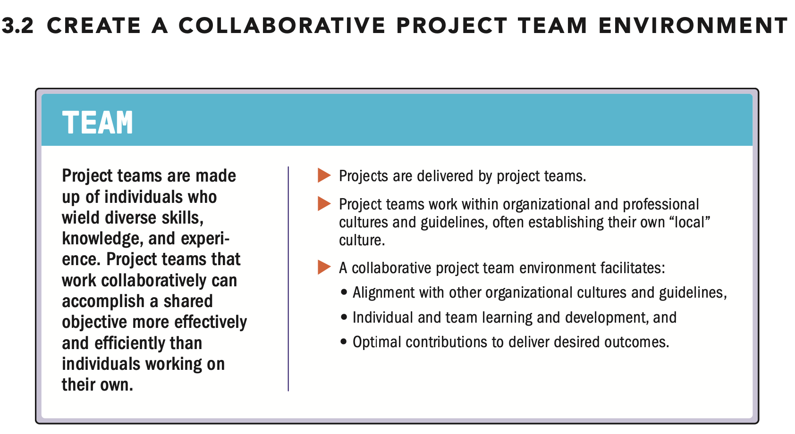

| English | Vietnamese |
|---------|------------|
| Creating a collaborative project team environment involves multiple contributing factors, such as team agreements, structures, and processes. | Tạo môi trường nhóm dự án hợp tác liên quan đến nhiều yếu tố đóng góp, chẳng hạn như thỏa thuận nhóm, cấu trúc và quy trình. |
| These factors support a culture that enables individuals to work together and provide synergistic effects from interactions. | Những yếu tố này hỗ trợ một văn hóa cho phép các cá nhân làm việc cùng nhau và tạo ra hiệu ứng hiệp lực từ các tương tác. |

| English | Vietnamese |
|---------|------------|
| ▶ Team agreements. Team agreements represent a set of behavioral parameters and working norms established by the project team and upheld through individual and project team commitment. | ▶ Thỏa thuận nhóm. Thỏa thuận nhóm đại diện cho một tập hợp các tham số hành vi và chuẩn mực làm việc được thiết lập bởi nhóm dự án và được duy trì thông qua cam kết của từng cá nhân và nhóm dự án. |
| The team agreement should be created at the beginning of a project and will evolve over time as the project team continues to work together and identify norms and behaviors that are necessary in order to continue to work together successfully. | Thỏa thuận nhóm nên được tạo vào đầu dự án và sẽ phát triển theo thời gian khi nhóm dự án tiếp tục làm việc cùng nhau và xác định các chuẩn mực và hành vi cần thiết để tiếp tục hợp tác thành công. |
| ▶ Organizational structures. Project teams use, tailor, and implement structures that help coordinate the individual effort associated with project work. | ▶ Cấu trúc tổ chức. Nhóm dự án sử dụng, điều chỉnh và triển khai các cấu trúc giúp điều phối nỗ lực cá nhân liên quan đến công việc dự án. |
| Organizational structures are any arrangement of or relation between the elements of project work and organizational processes. | Cấu trúc tổ chức là bất kỳ sự sắp xếp hoặc mối quan hệ nào giữa các yếu tố công việc dự án và quy trình tổ chức. |
| These structures can be based on roles, functions, or authority. They can be defined as being external to the project, tailored to fit the project context, or newly designed to meet a unique project need. | Các cấu trúc này có thể dựa trên vai trò, chức năng hoặc quyền hạn. Chúng có thể được xác định là bên ngoài dự án, được điều chỉnh phù hợp với bối cảnh dự án, hoặc được thiết kế mới để đáp ứng nhu cầu dự án đặc thù. |
| An authority figure may formally impose a structure, or project team members may contribute to its design in alignment with organizational structures. | Một người có thẩm quyền có thể chính thức áp đặt một cấu trúc, hoặc các thành viên nhóm dự án có thể đóng góp vào thiết kế của nó phù hợp với cấu trúc tổ chức. |
| Examples of organizational structures that can improve collaboration include, but are not limited to: | Các ví dụ về cấu trúc tổ chức có thể cải thiện sự hợp tác bao gồm, nhưng không giới hạn ở: |
| ▹ Definitions of roles and responsibilities, | ▹ Định nghĩa vai trò và trách nhiệm, |
| ▹ Allocation of employees and vendors into project teams, | ▹ Phân bổ nhân viên và nhà cung cấp vào các nhóm dự án, |
| ▹ Formal committees tasked with a specific objective, and | ▹ Các ủy ban chính thức đảm nhiệm một mục tiêu cụ thể, và |
| ▹ Standing meetings that regularly review a given topic. | ▹ Các cuộc họp thường xuyên đánh giá một chủ đề nhất định. |
| ▶ Processes. Project teams define processes that enable completion of tasks and work assignments. | ▶ Quy trình. Nhóm dự án xác định các quy trình giúp hoàn thành các nhiệm vụ và công việc được giao. |
| For example, project teams may agree to a decomposition process using a work breakdown structure (WBS), backlog, or task board. | Ví dụ, các nhóm dự án có thể đồng ý với quy trình phân rã sử dụng cấu trúc phân rã công việc (WBS), backlog, hoặc bảng nhiệm vụ. |
| Project teams are influenced by the culture of the organizations involved in the project, the nature of the project, and the environment in which they operate. | Nhóm dự án chịu ảnh hưởng bởi văn hóa của các tổ chức tham gia dự án, bản chất của dự án và môi trường mà họ hoạt động. |
| Within these influences, project teams establish their own team cultures. Project teams can tailor their structure to best accomplish the project objective. | Trong các ảnh hưởng này, nhóm dự án thiết lập văn hóa nhóm riêng của họ. Nhóm dự án có thể điều chỉnh cấu trúc của mình để đạt được mục tiêu dự án tốt nhất. |
| By fostering inclusive and collaborative environments, knowledge and expertise are more freely exchanged, which in turn enable better project outcomes. | Bằng cách tạo ra môi trường bao gồm và hợp tác, kiến thức và chuyên môn được trao đổi tự do hơn, từ đó tạo điều kiện cho kết quả dự án tốt hơn. |
| English | Vietnamese |
|---------|------------|
| Clarity on roles and responsibilities can improve team cultures. | Sự rõ ràng về vai trò và trách nhiệm có thể cải thiện văn hóa nhóm. |
| Within project teams, specific tasks may be delegated to individuals or selected by project team members themselves. | Trong các nhóm dự án, các nhiệm vụ cụ thể có thể được giao cho cá nhân hoặc do các thành viên nhóm dự án tự chọn. |
| This includes the authority, accountability, and responsibility related to tasks: | Điều này bao gồm quyền hạn, trách nhiệm giải trình và trách nhiệm liên quan đến các nhiệm vụ: |
| ▶ Authority. The condition of having the right, within a given context, to make relevant decisions, establish or improve procedures, apply project resources, expend funds, or give approvals. Authority is conferred from one entity to another, whether done explicitly or implicitly. | ▶ Quyền hạn. Trạng thái có quyền, trong một bối cảnh nhất định, để đưa ra các quyết định liên quan, thiết lập hoặc cải tiến quy trình, sử dụng nguồn lực dự án, chi tiêu ngân sách hoặc phê duyệt. Quyền hạn được chuyển từ một thực thể sang thực thể khác, dù thực hiện rõ ràng hay ngầm định. |
| ▶ Accountability. The condition of being answerable for an outcome. Accountability is not shared. | ▶ Trách nhiệm giải trình. Trạng thái phải chịu trách nhiệm về một kết quả. Trách nhiệm giải trình không được chia sẻ. |
| ▶ Responsibility. The condition of being obligated to do or fulfill something. Responsibility can be shared. | ▶ Trách nhiệm. Trạng thái bị bắt buộc phải thực hiện hoặc hoàn thành một việc gì đó. Trách nhiệm có thể được chia sẻ. |
| Regardless of who is accountable or responsible for specific project work, a collaborative project team takes collective ownership of the project outcomes. | Bất kể ai chịu trách nhiệm giải trình hay chịu trách nhiệm về công việc dự án cụ thể, một nhóm dự án hợp tác đều chịu trách nhiệm tập thể về kết quả dự án. |
| A diverse project team can enrich the project environment by bringing together different perspectives. | Một nhóm dự án đa dạng có thể làm phong phú môi trường dự án bằng cách kết hợp các quan điểm khác nhau. |
| The project team can be comprised of internal organizational staff, contracted contributors, volunteers, or external third parties. | Nhóm dự án có thể bao gồm nhân viên nội bộ tổ chức, cộng tác viên theo hợp đồng, tình nguyện viên hoặc bên thứ ba bên ngoài. |
| Additionally, some project team members join the project on a short-term basis to work on a specific deliverable while other members are assigned to the project on a longer-term basis. | Ngoài ra, một số thành viên nhóm dự án tham gia dự án trong thời gian ngắn để thực hiện một sản phẩm cụ thể trong khi các thành viên khác được phân công tham gia dự án lâu dài. |
| Integrating these individuals with a project team can challenge everyone involved. | Việc tích hợp những cá nhân này vào nhóm dự án có thể tạo thách thức cho tất cả những người tham gia. |
| A team culture of respect allows for differences and finds ways to leverage them productively, encouraging effective conflict management. | Văn hóa nhóm dự án tôn trọng sự khác biệt và tìm cách tận dụng chúng một cách hiệu quả, khuyến khích quản lý xung đột hiệu quả. |
| Another aspect of a collaborative project team environment is the incorporation of practice standards, ethical codes, and other guidelines that are part of the professional work within the project team and the organization. | Một khía cạnh khác của môi trường nhóm dự án hợp tác là việc tích hợp các tiêu chuẩn thực hành, quy tắc đạo đức và các hướng dẫn khác là một phần của công việc chuyên nghiệp trong nhóm dự án và tổ chức. |
| Project teams consider how these guides can support their efforts to avoid possible conflict among the disciplines and the established guidelines they use. | Nhóm dự án xem xét cách các hướng dẫn này có thể hỗ trợ nỗ lực của họ để tránh xung đột có thể xảy ra giữa các lĩnh vực chuyên môn và các hướng dẫn đã thiết lập mà họ sử dụng. |
| A collaborative project team environment fosters the free exchange of information and individual knowledge. | Môi trường nhóm dự án hợp tác thúc đẩy sự trao đổi tự do thông tin và kiến thức cá nhân. |
| This, in turn, increases shared learning and individual development while delivering outcomes. | Điều này, đến lượt nó, tăng cường việc học tập chia sẻ và phát triển cá nhân trong khi đạt được kết quả. |
| A collaborative project team environment enables everyone to contribute their best efforts to deliver the desired outcomes for an organization. | Môi trường nhóm dự án hợp tác cho phép mọi người đóng góp nỗ lực tốt nhất của mình để đạt được kết quả mong muốn cho tổ chức. |
| The organization, in turn, will benefit from deliverables and outcomes that respect and enhance its fundamental values, principles, and culture. | Ngược lại, tổ chức sẽ được hưởng lợi từ các sản phẩm và kết quả dự án tôn trọng và nâng cao các giá trị, nguyên tắc và văn hóa cơ bản của mình. |

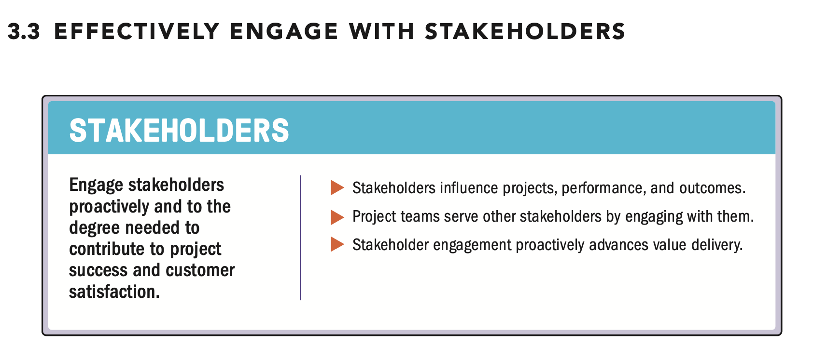

| English | Vietnamese |
|---------|------------|
| Stakeholders can be individuals, groups, or organizations that may affect, be affected by, or perceive themselves to be affected by a decision, activity, or outcome of a portfolio, program, or project. | Các bên liên quan có thể là cá nhân, nhóm hoặc tổ chức có thể ảnh hưởng đến, bị ảnh hưởng bởi, hoặc nhận thức rằng họ bị ảnh hưởng bởi một quyết định, hoạt động hoặc kết quả của một danh mục, chương trình hoặc dự án. |
| Stakeholders also directly or indirectly influence a project, its performance, or outcome in either a positive or negative way. | Các bên liên quan cũng có thể trực tiếp hoặc gián tiếp tác động đến dự án, hiệu suất hoặc kết quả của dự án theo cách tích cực hoặc tiêu cực. |
| English | Vietnamese |
|---------|------------|
| Stakeholders can affect many aspects of a project, including but not limited to: | Các bên liên quan có thể ảnh hưởng đến nhiều khía cạnh của dự án, bao gồm nhưng không giới hạn ở: |
| ▶ Scope/requirements, by revealing the need to add, adjust, or remove elements of the scope and/or project requirements; | ▶ Phạm vi/yêu cầu, bằng cách tiết lộ nhu cầu thêm, điều chỉnh hoặc loại bỏ các yếu tố của phạm vi và/hoặc yêu cầu dự án; |
| ▶ Schedule, by offering ideas to accelerate delivery or by slowing down or stop delivery of key project activities; | ▶ Lịch trình, bằng cách đề xuất ý tưởng để tăng tốc giao hàng hoặc làm chậm/ ngừng các hoạt động dự án quan trọng; |
| ▶ Cost, by helping to reduce or eliminate planned expenditures or by adding steps, requirements, or restrictions that increase cost or require additional resources; | ▶ Chi phí, bằng cách giúp giảm hoặc loại bỏ các khoản chi dự kiến hoặc bằng cách thêm các bước, yêu cầu hoặc hạn chế làm tăng chi phí hoặc cần thêm nguồn lực; |
| ▶ Project team, by restricting or enabling access to people with the skills, knowledge, and experience needed to deliver the intended outcomes, and promote a learning culture; | ▶ Nhóm dự án, bằng cách hạn chế hoặc tạo điều kiện tiếp cận những người có kỹ năng, kiến thức và kinh nghiệm cần thiết để đạt được kết quả dự kiến và thúc đẩy văn hóa học tập; |
| ▶ Plans, by providing information for plans or by advocating for changes to agreed activities and work; | ▶ Kế hoạch, bằng cách cung cấp thông tin cho kế hoạch hoặc đề xuất thay đổi các hoạt động và công việc đã thỏa thuận; |
| ▶ Outcomes, by enabling or blocking work required for the desired outcomes; | ▶ Kết quả, bằng cách cho phép hoặc chặn các công việc cần thiết để đạt được kết quả mong muốn; |
| ▶ Culture, by establishing or influencing—or even defining—the level and character of engagement of the project team and broader organization; | ▶ Văn hóa, bằng cách thiết lập hoặc ảnh hưởng—hoặc thậm chí định nghĩa—mức độ và tính chất tham gia của nhóm dự án và tổ chức rộng hơn; |
| ▶ Benefits realization, by generating and identifying long-term goals so that the project delivers the intended identified value; | ▶ Hiện thực hóa lợi ích, bằng cách tạo ra và xác định các mục tiêu dài hạn để dự án mang lại giá trị đã xác định; |
| ▶ Risk, by defining the risk thresholds of the project, as well as participating in subsequent risk management activities; | ▶ Rủi ro, bằng cách xác định ngưỡng rủi ro của dự án cũng như tham gia các hoạt động quản lý rủi ro tiếp theo; |
| ▶ Quality, by identifying and requiring quality requirements; and | ▶ Chất lượng, bằng cách xác định và yêu cầu các yêu cầu chất lượng; và |
| ▶ Success, by defining success factors and participating in the evaluation of success. | ▶ Thành công, bằng cách xác định các yếu tố thành công và tham gia đánh giá thành công. |
| Stakeholders may come and go throughout the life cycle of the project. | Các bên liên quan có thể tham gia hoặc rời khỏi dự án trong suốt vòng đời của dự án. |
| Additionally, the degree of a stakeholder’s interest, influence, or impact may change over time. | Ngoài ra, mức độ quan tâm, ảnh hưởng hoặc tác động của một bên liên quan có thể thay đổi theo thời gian. |
| Stakeholders, especially those with a high degree of influence and who have an unfavorable or neutral view about a project, need to be effectively engaged so that their interests, concerns, and rights are understood. | Các bên liên quan, đặc biệt là những người có ảnh hưởng cao và có quan điểm không thuận lợi hoặc trung lập về dự án, cần được tham gia hiệu quả để đảm bảo rằng lợi ích, mối quan tâm và quyền lợi của họ được hiểu rõ. |
| The project team can then address these concerns through effective engagement and support leading to the probability of a successful project outcome. | Nhóm dự án sau đó có thể giải quyết các mối quan tâm này thông qua việc tham gia và hỗ trợ hiệu quả, dẫn đến khả năng đạt được kết quả dự án thành công. |
| English | Vietnamese |
|---------|------------|
| Identifying, analyzing, and proactively engaging with stakeholders from the start to the end of the project helps to enable success. | Xác định, phân tích và chủ động tham gia với các bên liên quan từ đầu đến cuối dự án giúp tăng khả năng thành công. |
| Project teams are a group of stakeholders. This group of stakeholders engages other stakeholders to understand, consider, communicate, and respond to their interests, needs, and opinions. | Các nhóm dự án là một nhóm các bên liên quan. Nhóm này tham gia với các bên liên quan khác để hiểu, xem xét, truyền đạt và phản hồi lợi ích, nhu cầu và quan điểm của họ. |
| Effective and efficient engagement and communication include determining how, when, how often, and under what circumstances stakeholders want to be—and should be—engaged. | Việc tham gia và truyền đạt hiệu quả và hiệu suất bao gồm xác định cách thức, thời điểm, tần suất và trong hoàn cảnh nào mà các bên liên quan muốn—và nên—tham gia. |
| Communication is a key part of engagement; however, engagement delves deeper to include awareness of the ideas of others, assimilation of other perspectives, and collective shaping of a shared solution. | Truyền đạt là một phần quan trọng của việc tham gia; tuy nhiên, tham gia đi sâu hơn để bao gồm nhận thức về ý tưởng của người khác, tiếp thu các quan điểm khác và hình thành tập thể một giải pháp chung. |
| Engagement includes building and maintaining solid relationships through frequent, two-way communication. | Tham gia bao gồm xây dựng và duy trì các mối quan hệ vững chắc thông qua giao tiếp hai chiều thường xuyên. |
| It encourages collaboration through interactive meetings, face-to-face meetings, informal dialogue, and knowledge-sharing activities. | Nó khuyến khích hợp tác thông qua các cuộc họp tương tác, gặp mặt trực tiếp, đối thoại không chính thức và các hoạt động chia sẻ kiến thức. |
| Stakeholder engagement relies heavily on interpersonal skills, including taking initiative, integrity, honesty, collaboration, respect, empathy, and confidence. | Việc tham gia các bên liên quan phụ thuộc nhiều vào kỹ năng giữa các cá nhân, bao gồm chủ động, liêm chính, trung thực, hợp tác, tôn trọng, đồng cảm và tự tin. |
| These skills and attitudes can help everyone adapt to the work and to each other, increasing the likelihood of success. | Những kỹ năng và thái độ này có thể giúp mọi người thích nghi với công việc và với nhau, tăng khả năng thành công. |
| Engagement helps project teams detect, collect, and evaluate information, data, and opinions. | Việc tham gia giúp các nhóm dự án phát hiện, thu thập và đánh giá thông tin, dữ liệu và quan điểm. |
| This creates shared understanding and alignment, which enables project outcomes. | Điều này tạo ra sự hiểu biết và đồng thuận chung, giúp đạt được kết quả dự án. |
| Additionally, these activities help the project team to tailor the project to identify, adjust, and respond to changing circumstances. | Ngoài ra, các hoạt động này giúp nhóm dự án điều chỉnh dự án để xác định, điều chỉnh và phản ứng với các hoàn cảnh thay đổi. |
| Project teams actively engage other stakeholders throughout the project to minimize potential negative impacts and maximize positive impacts. | Các nhóm dự án chủ động tham gia với các bên liên quan khác trong suốt dự án để giảm thiểu tác động tiêu cực tiềm ẩn và tối đa hóa tác động tích cực. |
| Stakeholder engagements also enable opportunities for stronger project performance and outcomes in addition to increasing stakeholder satisfaction. | Việc tham gia các bên liên quan cũng tạo cơ hội nâng cao hiệu quả và kết quả dự án, bên cạnh việc tăng sự hài lòng của các bên liên quan. |
| Finally, engaging other stakeholders helps the project team to find solutions that may be more acceptable to a broader range of stakeholders. | Cuối cùng, việc tham gia các bên liên quan khác giúp nhóm dự án tìm ra các giải pháp có thể được chấp nhận rộng rãi hơn bởi nhiều bên liên quan. |
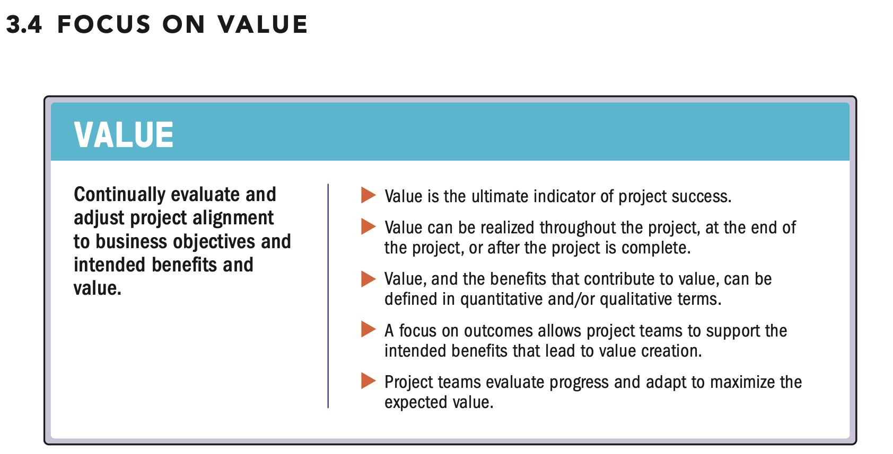
| English | Vietnamese |
|---------|------------|
| Value, including outcomes from the perspective of the customer or end user, is the ultimate success indicator and driver of projects. | Giá trị, bao gồm kết quả từ góc nhìn của khách hàng hoặc người sử dụng cuối, là chỉ số thành công tối thượng và động lực của các dự án. |
| Value focuses on the outcome of the deliverables. | Giá trị tập trung vào kết quả của các sản phẩm giao. |
| The value of a project may be expressed as a financial contribution to the sponsoring or receiving organization. | Giá trị của một dự án có thể được biểu thị dưới dạng đóng góp tài chính cho tổ chức tài trợ hoặc nhận dự án. |
| Value may be a measure of public good achieved, for example, social benefit or the customer’s perceived benefit from the project result. | Giá trị có thể là một thước đo lợi ích công cộng đạt được, ví dụ, lợi ích xã hội hoặc lợi ích mà khách hàng cảm nhận từ kết quả dự án. |
| When the project is a component of a program, the project’s contribution to program outcomes can represent value. | Khi dự án là một thành phần của chương trình, đóng góp của dự án vào kết quả chương trình có thể đại diện cho giá trị. |
| Many projects, though not all, are initiated based on a business case. | Nhiều dự án, mặc dù không phải tất cả, được khởi xướng dựa trên một trường hợp kinh doanh (business case). |
| Projects may be initiated due to any identified need to deliver or modify a process, product, or service, such as contracts, statements of work, or other documents. | Dự án có thể được khởi xướng do bất kỳ nhu cầu nào được xác định để thực hiện hoặc điều chỉnh một quy trình, sản phẩm hoặc dịch vụ, chẳng hạn như hợp đồng, bản mô tả công việc (SOW) hoặc các tài liệu khác. |
| In all cases, the project intent is to provide the desired outcome that addresses the need with a valued solution. | Trong mọi trường hợp, mục đích của dự án là cung cấp kết quả mong muốn giải quyết nhu cầu với một giải pháp có giá trị. |
| A business case can contain information about strategic alignment, assessment of risk exposure, economic feasibility study, return on investments, expected key performance measures, evaluations, and alternative approaches. | Một trường hợp kinh doanh có thể bao gồm thông tin về sự liên kết chiến lược, đánh giá mức độ rủi ro, nghiên cứu khả thi về kinh tế, lợi tức đầu tư, các chỉ số hiệu suất chính dự kiến, đánh giá và các phương pháp tiếp cận thay thế. |
| The business case may state the intended value contribution of the project outcome in qualitative or quantitative terms, or both. | Trường hợp kinh doanh có thể nêu rõ đóng góp giá trị dự kiến của kết quả dự án bằng các thuật ngữ định tính, định lượng hoặc cả hai. |
| A business case contains at least these supporting and interrelated elements: | Một trường hợp kinh doanh chứa ít nhất các yếu tố hỗ trợ và có liên quan lẫn nhau sau: |
| English | Vietnamese |
|---------|------------|
| Business need. Business provides the rationale for the project, explaining why the project is undertaken. It originates with the preliminary business requirements, which are reflected in the project charter or other authorizing document. It provides details about the business goals and objectives. The business need may be intended for the performing organization, a client organization, a partnership of organizations, or public welfare. A clear statement of the business need helps the project team understand the business drivers for the future state and allows the project team to identify opportunities or problems to increase the potential value from the project outcome. | Nhu cầu kinh doanh. Kinh doanh cung cấp lý do cho dự án, giải thích lý do tại sao dự án được thực hiện. Nó bắt nguồn từ các yêu cầu kinh doanh sơ bộ, được phản ánh trong bản điều lệ dự án hoặc tài liệu ủy quyền khác. Nó cung cấp chi tiết về các mục tiêu và mục đích kinh doanh. Nhu cầu kinh doanh có thể hướng đến tổ chức thực hiện, tổ chức khách hàng, một liên minh các tổ chức hoặc lợi ích công cộng. Một tuyên bố rõ ràng về nhu cầu kinh doanh giúp nhóm dự án hiểu các yếu tố thúc đẩy kinh doanh cho trạng thái tương lai và cho phép nhóm dự án xác định cơ hội hoặc vấn đề để tăng giá trị tiềm năng từ kết quả dự án. |
| Project justification. Project justification is connected to business need. It explains why the business need is worth the investment and why it should be addressed at this time. The project justification is accompanied by a cost-benefit analysis and assumptions. | Sự biện minh dự án. Sự biện minh dự án liên quan đến nhu cầu kinh doanh. Nó giải thích lý do tại sao nhu cầu kinh doanh xứng đáng được đầu tư và tại sao cần giải quyết vào thời điểm này. Sự biện minh dự án đi kèm với phân tích chi phí-lợi ích và các giả định. |
| Business strategy. Business strategy is the reason for the project and all needs are related to the strategy to achieve the value. | Chiến lược kinh doanh. Chiến lược kinh doanh là lý do cho dự án và tất cả các nhu cầu đều liên quan đến chiến lược để đạt được giá trị. |
| Together, the business need, project justification, and business strategy, in addition to benefits and possible agreements, provide the project team with information that allows them to make informed decisions to meet or exceed the intended business value. | Cùng nhau, nhu cầu kinh doanh, sự biện minh dự án và chiến lược kinh doanh, cùng với lợi ích và các thỏa thuận có thể có, cung cấp cho nhóm dự án thông tin cho phép họ đưa ra các quyết định thông minh để đạt hoặc vượt giá trị kinh doanh dự kiến. |
| Desired outcomes should be clearly described, iteratively assessed, and updated throughout the project. During its life cycle, a project may undergo change and the project team then adapts in response. The project team continuously evaluates project progress and direction against the desired outputs, baselines, and business case to confirm that the project remains aligned to the need and will deliver its intended outcomes. Alternatively, the business case is updated to capture an opportunity or minimize a problem identified by the project team and other stakeholders. If the project or its stakeholders are no longer aligned with the business need or if the project seems unlikely to provide the intended value, the organization may choose to terminate the effort. | Kết quả mong muốn nên được mô tả rõ ràng, đánh giá lặp đi lặp lại và cập nhật trong suốt dự án. Trong vòng đời của nó, dự án có thể trải qua thay đổi và nhóm dự án sẽ thích ứng theo. Nhóm dự án liên tục đánh giá tiến độ và hướng đi của dự án so với kết quả mong muốn, cơ sở tham chiếu và trường hợp kinh doanh để xác nhận rằng dự án vẫn phù hợp với nhu cầu và sẽ cung cấp các kết quả dự kiến. Ngoài ra, trường hợp kinh doanh có thể được cập nhật để nắm bắt cơ hội hoặc giảm thiểu vấn đề do nhóm dự án và các bên liên quan khác xác định. Nếu dự án hoặc các bên liên quan không còn phù hợp với nhu cầu kinh doanh hoặc nếu dự án dường như không cung cấp giá trị dự kiến, tổ chức có thể chọn chấm dứt nỗ lực. |
| Value is the worth, importance, or usefulness of something. Value is subjective, in the sense that the same concept can have different values for different people and organizations. This occurs because what is considered a benefit depends on organizational strategies, ranging from short-term financial gains, long-term gains, and even nonfinancial elements. Because all projects have a range of stakeholders, different values generated for each group of stakeholders have to be considered and balanced with the whole, while placing a priority on the customer perspective. | Giá trị là giá trị, tầm quan trọng hoặc tính hữu ích của một thứ gì đó. Giá trị mang tính chủ quan, theo nghĩa cùng một khái niệm có thể có các giá trị khác nhau đối với những người và tổ chức khác nhau. Điều này xảy ra vì những gì được coi là lợi ích phụ thuộc vào chiến lược của tổ chức, từ lợi ích tài chính ngắn hạn, lợi ích dài hạn, thậm chí cả các yếu tố phi tài chính. Vì tất cả các dự án đều có nhiều bên liên quan, các giá trị khác nhau tạo ra cho từng nhóm bên liên quan phải được cân nhắc và cân bằng với tổng thể, đồng thời ưu tiên quan điểm của khách hàng. |
| English | Vietnamese |
|---------|------------|
| Within the context of some projects, there may be different forms of value engineering that maximize value to the customer, to the performing organization, or other stakeholders. An example of this includes delivering the required functionality and level of quality with an acceptable risk exposure, while using as few resources as possible, and by avoiding waste. Sometimes, especially in adaptive projects that do not have a fixed, up-front scope, the project team can optimize value by working with the customer to determine which features are worth investment and which may not be valuable enough to be added to the output. | Trong bối cảnh một số dự án, có thể tồn tại các hình thức kỹ thuật giá trị khác nhau để tối đa hóa giá trị cho khách hàng, tổ chức thực hiện, hoặc các bên liên quan khác. Ví dụ bao gồm việc cung cấp các chức năng cần thiết và mức chất lượng phù hợp với mức rủi ro chấp nhận được, đồng thời sử dụng ít tài nguyên nhất có thể và tránh lãng phí. Đôi khi, đặc biệt là trong các dự án thích ứng không có phạm vi cố định ngay từ đầu, nhóm dự án có thể tối ưu hóa giá trị bằng cách làm việc với khách hàng để xác định các tính năng đáng để đầu tư và những tính năng nào có thể không đủ giá trị để thêm vào kết quả. |
| To support value realization from projects, project teams shift focus from deliverables to the intended outcomes. Doing so allows project teams to deliver on the vision or purpose of the project, rather than simply creating a specific deliverable. While the deliverable may support the intended project outcome, it may not fully achieve the vision or purpose of the project. | Để hỗ trợ việc hiện thực hóa giá trị từ các dự án, nhóm dự án chuyển trọng tâm từ kết quả giao hàng sang các kết quả dự kiến. Việc này cho phép nhóm dự án thực hiện tầm nhìn hoặc mục đích của dự án, thay vì chỉ đơn thuần tạo ra một kết quả cụ thể. Mặc dù kết quả giao hàng có thể hỗ trợ kết quả dự án dự kiến, nhưng nó có thể không hoàn toàn đạt được tầm nhìn hoặc mục đích của dự án. |
| For example, customers may want a specific software solution because they think that the solution resolves the business need for higher productivity. The software is the output of the project, but the software itself does not enable the productivity outcome that is intended. In this case, adding a new deliverable of training and coaching on the use of the software can enable a better productivity outcome. If the project’s output fails to enable higher productivity, stakeholders may feel that the project has failed. Thus, project teams and other stakeholders understand both the deliverable and the intended outcome from the deliverable. | Ví dụ, khách hàng có thể muốn một giải pháp phần mềm cụ thể vì họ nghĩ rằng giải pháp này giải quyết nhu cầu kinh doanh về tăng năng suất. Phần mềm là kết quả đầu ra của dự án, nhưng chính phần mềm không đảm bảo kết quả năng suất như dự định. Trong trường hợp này, thêm một kết quả mới về đào tạo và hướng dẫn sử dụng phần mềm có thể tạo ra kết quả năng suất tốt hơn. Nếu kết quả đầu ra của dự án không giúp tăng năng suất, các bên liên quan có thể cảm thấy dự án thất bại. Do đó, nhóm dự án và các bên liên quan khác cần hiểu cả kết quả giao hàng và kết quả dự kiến từ kết quả đó. |
| The value contribution of project work could be a short- or long-term measure. Because value contribution may be mixed with contributions from operational activities, it may be difficult to isolate. When the project is a component of a program, evaluation of value at the program level may also be necessary to properly direct the project. A reliable evaluation of value should consider the whole context and the entire life cycle of the project’s output. | Giá trị đóng góp từ công việc dự án có thể là đo lường ngắn hạn hoặc dài hạn. Vì giá trị đóng góp có thể bị trộn lẫn với đóng góp từ các hoạt động vận hành, nên có thể khó để tách biệt. Khi dự án là một phần của chương trình, việc đánh giá giá trị ở cấp chương trình cũng có thể cần thiết để định hướng dự án đúng cách. Một đánh giá giá trị đáng tin cậy nên xem xét toàn bộ bối cảnh và toàn bộ vòng đời của kết quả đầu ra của dự án. |
| While value is realized over time, effective processes can enable early benefit realization. With efficient and effective implementation, project teams may demonstrate or achieve such outcomes as prioritized delivery, better customer service, or an improved work environment. By working with organizational leaders who are responsible for putting project deliverables into use, project leaders can make sure that the deliverables are positioned to realize the planned outcomes. | Mặc dù giá trị được hiện thực hóa theo thời gian, các quy trình hiệu quả có thể cho phép hiện thực hóa lợi ích sớm. Với việc triển khai hiệu quả và hiệu suất, nhóm dự án có thể chứng minh hoặc đạt được các kết quả như giao hàng ưu tiên, cải thiện dịch vụ khách hàng, hoặc cải thiện môi trường làm việc. Bằng cách làm việc với các lãnh đạo tổ chức chịu trách nhiệm đưa các kết quả dự án vào sử dụng, các nhà lãnh đạo dự án có thể đảm bảo rằng các kết quả được định vị để đạt được các kết quả dự kiến. |

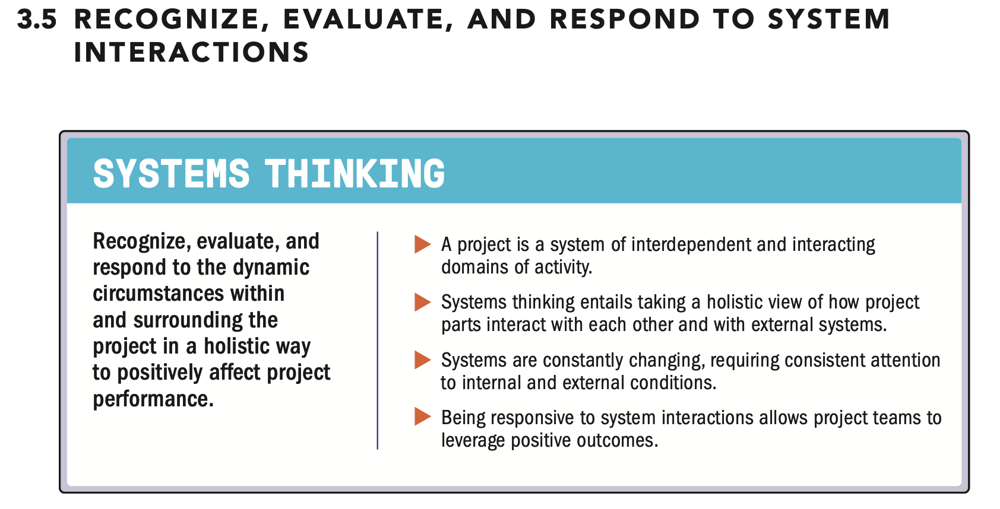

| English | Vietnamese |
|---------|------------|
| A system is a set of interacting and interdependent components that function as a unified whole. Taking a holistic view, a project is a multifaceted entity that exists in dynamic circumstances, exhibiting the characteristics of a system. Project teams should acknowledge this holistic view of a project, seeing the project as a system with its own working parts. | Hệ thống là một tập hợp các thành phần tương tác và phụ thuộc lẫn nhau, hoạt động như một tổng thể thống nhất. Nhìn từ góc độ toàn diện, một dự án là một thực thể đa diện tồn tại trong các hoàn cảnh động, thể hiện các đặc tính của một hệ thống. Nhóm dự án nên công nhận cái nhìn toàn diện này về dự án, xem dự án như một hệ thống với các bộ phận hoạt động riêng của nó. |
| A project works within other larger systems, and a project deliverable may become part of a larger system to realize benefits. For example, projects may be part of a program which, in turn, may also be part of a portfolio. These interconnected structures are known as a system of systems. Project teams balance inside/out and outside/in perspectives to support alignment across the system of systems. | Một dự án hoạt động trong các hệ thống lớn hơn, và kết quả đầu ra của dự án có thể trở thành một phần của hệ thống lớn hơn để hiện thực hóa lợi ích. Ví dụ, các dự án có thể là một phần của chương trình, chương trình đó lại có thể là một phần của danh mục dự án. Các cấu trúc liên kết này được gọi là hệ thống của các hệ thống. Nhóm dự án cân bằng các quan điểm từ bên trong ra ngoài và từ bên ngoài vào để hỗ trợ sự phù hợp trên toàn bộ hệ thống của các hệ thống. |
| The project may also have subsystems that are required to integrate effectively to deliver the intended outcome. For example, when individual project teams develop separate components of a deliverable, all components should integrate effectively. This requires project teams to interact and align subsystem work on a regular basis. | Dự án cũng có thể có các hệ thống con cần phải tích hợp hiệu quả để đạt được kết quả dự kiến. Ví dụ, khi các nhóm dự án riêng lẻ phát triển các thành phần riêng biệt của một kết quả đầu ra, tất cả các thành phần đó phải tích hợp hiệu quả. Điều này yêu cầu các nhóm dự án tương tác và điều phối công việc của các hệ thống con một cách thường xuyên. |
| English | Vietnamese |
|---------|------------|
| Systems thinking also considers timing elements of systems, such as what the project delivers or enables over time. For example, if project deliverables are released incrementally, each increment expands the cumulative outcomes or capabilities of previous versions. Project teams should think beyond the end of the project to the operational state of the project’s deliverable, so that intended outcomes are realized. | Tư duy hệ thống cũng xem xét các yếu tố thời gian của hệ thống, chẳng hạn như những gì dự án cung cấp hoặc tạo điều kiện theo thời gian. Ví dụ, nếu các kết quả dự án được phát hành từng phần, mỗi phần bổ sung sẽ mở rộng các kết quả tích lũy hoặc khả năng của các phiên bản trước đó. Nhóm dự án nên suy nghĩ vượt ra ngoài giai đoạn kết thúc dự án để hướng đến trạng thái vận hành của kết quả đầu ra, nhằm đảm bảo các kết quả dự kiến được thực hiện. |
| As projects unfold, internal and external conditions are continuously changing. A single change can create several impacts. For example, on a large construction project, a change in requirements can cause contractual changes with the primary contractor, subcontractors, suppliers, or others. In turn, those changes can create an impact on project cost, schedule, scope, and performance. Subsequently, these changes could invoke a change control protocol for obtaining approvals from entities in external systems, such as the service providers, regulators, financiers, and government authorities. | Khi dự án triển khai, các điều kiện bên trong và bên ngoài liên tục thay đổi. Một thay đổi đơn lẻ có thể tạo ra nhiều tác động. Ví dụ, trong một dự án xây dựng lớn, thay đổi yêu cầu có thể dẫn đến thay đổi hợp đồng với nhà thầu chính, nhà thầu phụ, nhà cung cấp hoặc những bên khác. Những thay đổi đó tiếp tục có thể ảnh hưởng đến chi phí, tiến độ, phạm vi và hiệu suất dự án. Sau đó, những thay đổi này có thể kích hoạt một quy trình kiểm soát thay đổi để nhận được sự phê duyệt từ các thực thể trong hệ thống bên ngoài, chẳng hạn như nhà cung cấp dịch vụ, cơ quan quản lý, nhà tài trợ và cơ quan chính phủ. |
| While it is possible to predict some of the changes in advance, many of the changes that can impact the project during its life cycle emerge in real time. With systems thinking, including constant attention to internal and external conditions, the project team can navigate a wide spectrum of changes and impacts to keep the project in agreement with the relevant stakeholders. | Mặc dù có thể dự đoán một số thay đổi trước, nhiều thay đổi có thể ảnh hưởng đến dự án trong suốt vòng đời xuất hiện theo thời gian thực. Với tư duy hệ thống, bao gồm sự chú ý liên tục đến các điều kiện bên trong và bên ngoài, nhóm dự án có thể điều hướng một phổ rộng các thay đổi và tác động để giữ dự án phù hợp với các bên liên quan liên quan. |
| Systems thinking also applies to how the project team views itself and its interactions within the project system. The project system often brings together a diverse project team engaged in working for a common objective. This diversity brings value to project teams, but they need to consider how to leverage those differences effectively, so that the project team works cohesively. | Tư duy hệ thống cũng áp dụng cho cách nhóm dự án nhìn nhận bản thân và các tương tác của nó trong hệ thống dự án. Hệ thống dự án thường tập hợp một nhóm dự án đa dạng, tham gia vào công việc vì một mục tiêu chung. Sự đa dạng này mang lại giá trị cho các nhóm dự án, nhưng họ cần cân nhắc cách tận dụng hiệu quả những khác biệt đó để nhóm dự án làm việc một cách gắn kết. |
| For example, if a government agency contracts with a private company for development of a new technology, the development team may consist of project team members from both organizations. Those project team members may have assumptions, ways of working, and mental models related to how they function within their home organization. In this new project system, which combines the cultures of a private company and a government agency, the project team members can establish a synthesized team culture that creates a common vision, language, and toolset. This can help project team members to engage and contribute effectively and help to increase the probability that the project system works. | Ví dụ, nếu một cơ quan chính phủ ký hợp đồng với một công ty tư nhân để phát triển công nghệ mới, nhóm phát triển có thể bao gồm các thành viên dự án từ cả hai tổ chức. Những thành viên dự án này có thể có các giả định, cách làm việc và mô hình tư duy liên quan đến cách họ hoạt động trong tổ chức gốc của mình. Trong hệ thống dự án mới này, kết hợp văn hóa của công ty tư nhân và cơ quan chính phủ, các thành viên dự án có thể thiết lập một văn hóa nhóm tổng hợp tạo ra tầm nhìn, ngôn ngữ và bộ công cụ chung. Điều này có thể giúp các thành viên dự án tham gia và đóng góp hiệu quả, đồng thời tăng khả năng hệ thống dự án vận hành thành công. |
| Because of the interactivity among systems, project teams should operate with awareness of, and vigilance toward, changing system dynamics. The following skills support a systems view of the project: | Do tính tương tác giữa các hệ thống, nhóm dự án nên hoạt động với nhận thức và sự cảnh giác đối với các động lực thay đổi của hệ thống. Các kỹ năng sau đây hỗ trợ một cái nhìn hệ thống về dự án: |
| English | Vietnamese |
|---------|------------|
| ▶ Empathy with the business areas; | ▶ Đồng cảm với các lĩnh vực kinh doanh; |
| ▶ Critical thinking with a big picture focus; | ▶ Tư duy phản biện với tầm nhìn tổng thể; |
| ▶ Challenging of assumptions and mental models; | ▶ Thách thức các giả định và mô hình tư duy; |
| ▶ Seeking external review and advice; | ▶ Tìm kiếm đánh giá và lời khuyên từ bên ngoài; |
| ▶ Use of integrated methods, artifacts, and practices so there is a common understanding of project work, deliverables, and outcomes; | ▶ Sử dụng các phương pháp, hiện vật và thực hành tích hợp để có sự hiểu biết chung về công việc dự án, kết quả đầu ra và kết quả; |
| ▶ Use of modeling and scenarios to envision how system dynamics may interact and react; and | ▶ Sử dụng mô hình hóa và các kịch bản để hình dung cách các động lực hệ thống có thể tương tác và phản ứng; và |
| ▶ Proactive management of the integration to help achieve business outcomes. | ▶ Quản lý chủ động việc tích hợp để giúp đạt được kết quả kinh doanh. |
| Recognizing, evaluating, and responding to system interactions can lead to the following positive outcomes: | Việc nhận biết, đánh giá và phản ứng với các tương tác hệ thống có thể dẫn đến các kết quả tích cực sau: |
| ▶ Early consideration of uncertainty and risk within the project, exploration of alternatives, and consideration of unintended consequences; | ▶ Xem xét sớm sự không chắc chắn và rủi ro trong dự án, khám phá các phương án thay thế và xem xét các hậu quả không mong muốn; |
| ▶ Ability to adjust assumptions and plans throughout the project life cycle; | ▶ Khả năng điều chỉnh các giả định và kế hoạch trong suốt vòng đời dự án; |
| ▶ Provision of ongoing information and insights that inform planning and delivery; | ▶ Cung cấp thông tin và những hiểu biết liên tục để hỗ trợ lập kế hoạch và triển khai; |
| ▶ Clear communication of plans, progress, and projections to relevant stakeholders; | ▶ Truyền đạt rõ ràng kế hoạch, tiến độ và dự báo đến các bên liên quan phù hợp; |
| ▶ Alignment of project goals and objectives to the customer organization’s goals, objectives, and vision; | ▶ Sự phù hợp giữa mục tiêu và mục đích dự án với mục tiêu, mục đích và tầm nhìn của tổ chức khách hàng; |
| ▶ Ability to adjust to the changing needs of the end user, sponsor, or customer of the project deliverables; | ▶ Khả năng điều chỉnh theo nhu cầu thay đổi của người dùng cuối, nhà tài trợ hoặc khách hàng của các kết quả dự án; |
| ▶ Ability to see synergies and savings between aligned projects or initiatives; | ▶ Khả năng nhận thấy sự cộng hưởng và tiết kiệm giữa các dự án hoặc sáng kiến được căn chỉnh; |
| ▶ Ability to exploit opportunities not otherwise captured or see threats posed to or by other projects or initiatives; | ▶ Khả năng khai thác các cơ hội chưa được nắm bắt hoặc nhận thấy các mối đe dọa từ hoặc đối với các dự án hoặc sáng kiến khác; |
| ▶ Clarity regarding the best project performance measurement and their influence on the behavior of the people involved in the project; | ▶ Sự rõ ràng về các thước đo hiệu suất dự án tốt nhất và ảnh hưởng của chúng đối với hành vi của những người tham gia dự án; |
| ▶ Decisions that benefit the organization as a whole; and | ▶ Các quyết định mang lại lợi ích cho tổ chức nói chung; và |
| ▶ More comprehensive and informed identification of risks. | ▶ Nhận diện rủi ro toàn diện và thông tin đầy đủ hơn. |

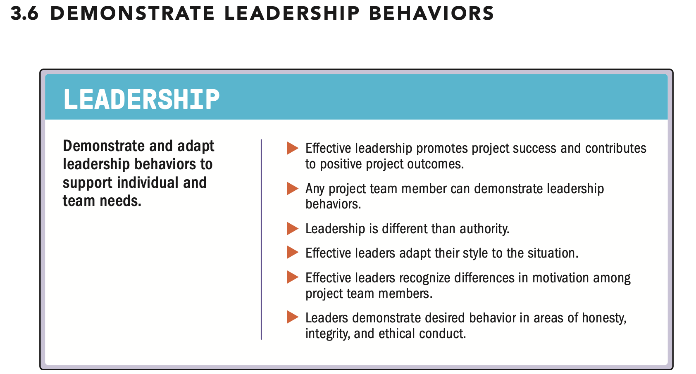

| English | Vietnamese |
|---------|------------|
| ▶ Projects create a unique need for effective leadership. | ▶ Các dự án tạo ra nhu cầu đặc biệt về khả năng lãnh đạo hiệu quả. |
| ▶ Unlike general business operations, where roles and responsibilities are often established and consistent, projects often involve multiple organizations, departments, functions, or vendors that do not interact on a regular basis. | ▶ Khác với hoạt động kinh doanh thông thường, nơi các vai trò và trách nhiệm thường đã được xác định và nhất quán, các dự án thường liên quan đến nhiều tổ chức, phòng ban, chức năng hoặc nhà cung cấp không tương tác thường xuyên. |
| ▶ Moreover, projects may carry higher stakes and expectations than regular operational functions. | ▶ Hơn nữa, các dự án có thể mang lại rủi ro và kỳ vọng cao hơn so với các chức năng vận hành thông thường. |
| ▶ As a result, a broader array of managers, executives, senior contributors, and other stakeholders attempt to influence a project. | ▶ Do đó, một nhóm rộng hơn các nhà quản lý, lãnh đạo, cộng tác viên cao cấp và các bên liên quan khác cố gắng ảnh hưởng đến dự án. |
| ▶ This often creates higher degrees of confusion and conflict. | ▶ Điều này thường tạo ra mức độ nhầm lẫn và xung đột cao hơn. |
| ▶ Consequently, higher-performing projects demonstrate effective leadership behaviors more frequently, and from more people than most projects. | ▶ Do đó, các dự án đạt hiệu suất cao thường thể hiện các hành vi lãnh đạo hiệu quả thường xuyên hơn, và từ nhiều người hơn so với hầu hết các dự án khác. |
| ▶ A project environment that prioritizes vision, creativity, motivation, enthusiasm, encouragement, and empathy can support better outcomes. | ▶ Một môi trường dự án ưu tiên tầm nhìn, sự sáng tạo, động lực, nhiệt huyết, khích lệ và sự đồng cảm có thể hỗ trợ kết quả tốt hơn. |
| ▶ These traits are often associated with leadership. | ▶ Những đặc điểm này thường được liên kết với khả năng lãnh đạo. |
| ▶ Leadership comprises the attitude, talent, character, and behaviors to influence individuals within and outside the project team toward the desired outcomes. | ▶ Lãnh đạo bao gồm thái độ, năng lực, phẩm chất và hành vi để ảnh hưởng đến các cá nhân trong và ngoài nhóm dự án nhằm đạt được kết quả mong muốn. |
| English | Vietnamese |
|---------|------------|
| ▶ Leadership is not exclusive to any specific role. High-performing projects may feature multiple people exhibiting effective leadership skills, for example, the project manager, sponsors, stakeholders, senior management, or even project team members. | ▶ Lãnh đạo không dành riêng cho bất kỳ vai trò cụ thể nào. Các dự án đạt hiệu suất cao có thể có nhiều người thể hiện kỹ năng lãnh đạo hiệu quả, ví dụ như quản lý dự án, nhà tài trợ, các bên liên quan, quản lý cấp cao, hoặc thậm chí các thành viên trong nhóm dự án. |
| ▶ Anyone working on a project can demonstrate effective leadership traits, styles, and skills to help the project team perform and deliver the required results. | ▶ Bất kỳ ai làm việc trong dự án đều có thể thể hiện các đặc điểm, phong cách và kỹ năng lãnh đạo hiệu quả để giúp nhóm dự án thực hiện và đạt được kết quả yêu cầu. |
| ▶ It is important to note that more conflict and confusion can emerge when too many participants attempt to exert project influence in multiple, misaligned directions. | ▶ Cần lưu ý rằng nhiều xung đột và nhầm lẫn có thể xảy ra khi quá nhiều người tham gia cố gắng tác động đến dự án theo nhiều hướng không đồng nhất. |
| ▶ However, higher-performing projects show a paradoxical combination of more influencers, each contributing more leadership skills in a complementary fashion. | ▶ Tuy nhiên, các dự án đạt hiệu suất cao lại thể hiện một sự kết hợp nghịch lý với nhiều người ảnh hưởng hơn, mỗi người đóng góp thêm các kỹ năng lãnh đạo theo cách bổ sung lẫn nhau. |
| ▶ For example: if a sponsor articulates clear priorities, then a technical lead opens the discussion for delivery options, where individual contributors assert pros and cons until the project manager brings the conversation to a consensus strategy. | ▶ Ví dụ: nếu một nhà tài trợ trình bày rõ các ưu tiên, thì trưởng nhóm kỹ thuật mở ra cuộc thảo luận về các lựa chọn triển khai, nơi các thành viên cá nhân nêu ưu và nhược điểm cho đến khi quản lý dự án đưa cuộc thảo luận đến một chiến lược đồng thuận. |
| ▶ Successful leadership enables someone to influence, motivate, direct, and coach people under any condition. It also incorporates characteristics derived from an organization’s culture and practices. | ▶ Lãnh đạo thành công cho phép một người tác động, thúc đẩy, hướng dẫn và huấn luyện mọi người trong bất kỳ điều kiện nào. Nó cũng kết hợp các đặc điểm xuất phát từ văn hóa và thực tiễn của tổ chức. |
| ▶ Leadership should not be confused with authority, which is the position of control given to individuals within an organization to foster overall effective and efficient function. | ▶ Lãnh đạo không nên bị nhầm lẫn với quyền hạn, vốn là vị trí kiểm soát được giao cho cá nhân trong tổ chức nhằm thúc đẩy hoạt động hiệu quả và năng suất tổng thể. |
| ▶ Authority is the right to exercise power. Authority is usually delegated to a person by formal means such as a charter document or designated title. | ▶ Quyền hạn là quyền sử dụng quyền lực. Quyền hạn thường được ủy quyền cho một người bằng các phương thức chính thức như văn bản ủy quyền hoặc chức danh được chỉ định. |
| ▶ This person may then have a role or position description that indicates their authority. Authority denotes accountability for certain activities, actions of individuals, or decision making in certain circumstances. | ▶ Người này sau đó có thể có mô tả vai trò hoặc vị trí thể hiện quyền hạn của họ. Quyền hạn biểu thị trách nhiệm đối với một số hoạt động, hành động của cá nhân hoặc việc ra quyết định trong một số hoàn cảnh. |
| ▶ While individuals may use their authority to influence, motivate, direct others, or act when others do not perform or act as directed or requested, this is not the same as leadership. | ▶ Trong khi cá nhân có thể sử dụng quyền hạn của mình để tác động, thúc đẩy, hướng dẫn người khác, hoặc hành động khi người khác không thực hiện theo hướng dẫn hoặc yêu cầu, điều này không giống với lãnh đạo. |
| ▶ For example, organizational executives may grant someone the authority to form a project team to deliver an outcome. However, authority alone is insufficient. | ▶ Ví dụ, các lãnh đạo tổ chức có thể trao quyền cho một người để thành lập nhóm dự án nhằm đạt được kết quả. Tuy nhiên, chỉ có quyền hạn là chưa đủ. |
| ▶ It takes leadership to motivate a group toward a common goal, influence them to align their individual interests in favor of collective effort, and achieve success as a project team rather than as individuals. | ▶ Cần có khả năng lãnh đạo để thúc đẩy một nhóm hướng tới mục tiêu chung, ảnh hưởng họ để điều chỉnh lợi ích cá nhân phù hợp với nỗ lực chung, và đạt thành công như một nhóm dự án thay vì cá nhân riêng lẻ. |
| ▶ Effective leadership draws from or combines elements of various styles of leadership. | ▶ Lãnh đạo hiệu quả lấy hoặc kết hợp các yếu tố từ nhiều phong cách lãnh đạo khác nhau. |
| ▶ Documented leadership styles range from autocratic, democratic, laissez-faire, directive, participative, assertive, supportive, and autocratic to consensus. | ▶ Các phong cách lãnh đạo được ghi nhận bao gồm từ độc đoán, dân chủ, để mặc, chỉ đạo, tham gia, quyết đoán, hỗ trợ và đồng thuận. |
| ▶ Of all these, no single leadership style has proven to be the universally best or recommended approach. | ▶ Trong tất cả các phong cách này, không có phong cách lãnh đạo nào được chứng minh là tốt nhất hay được khuyến nghị cho mọi tình huống. |
| ▶ Instead, effective leadership is shown when it best fits a given situation. | ▶ Thay vào đó, lãnh đạo hiệu quả được thể hiện khi nó phù hợp nhất với tình huống cụ thể. |
| ▶ For example: | ▶ Ví dụ: |
| ▶ In moments of chaos, directive action creates more clarity and momentum than collaborative problem solving. | ▶ Trong những khoảnh khắc hỗn loạn, hành động chỉ đạo tạo ra sự rõ ràng và động lực hơn so với giải quyết vấn đề theo cách hợp tác. |
| ▶ For environments with highly competent and engaged staff, empowered delegation elicits more productivity than centralized coordination. | ▶ Đối với môi trường có nhân viên năng lực cao và tích cực tham gia, ủy quyền trao quyền mang lại năng suất cao hơn so với phối hợp tập trung. |
| English | Vietnamese |
|---------|------------|
| ▶ When senior managers suffer conflict over priorities, neutral facilitation helps more than detailed recommendations. | ▶ Khi các quản lý cấp cao gặp xung đột về ưu tiên, sự hỗ trợ trung lập giúp nhiều hơn so với các khuyến nghị chi tiết. |
| ▶ Effective leadership skill is grown. It can be learned and developed so that it becomes a professional asset to the individual, as well as a benefit to the project and its stakeholders. | ▶ Kỹ năng lãnh đạo hiệu quả có thể phát triển. Nó có thể được học và rèn luyện để trở thành tài sản chuyên môn của cá nhân, cũng như mang lại lợi ích cho dự án và các bên liên quan. |
| ▶ High-performing projects show a pervasive pattern of continuous improvement down to the personal level. | ▶ Các dự án đạt hiệu suất cao thể hiện một mô hình cải tiến liên tục lan tỏa đến mức cá nhân. |
| ▶ A project team member deepens leadership acumen by adding or practicing a combination of various skills or techniques, including but not limited to: | ▶ Một thành viên nhóm dự án nâng cao sự tinh thông về lãnh đạo bằng cách thêm vào hoặc thực hành kết hợp nhiều kỹ năng hoặc kỹ thuật khác nhau, bao gồm nhưng không giới hạn ở: |
| ▶ Focusing a project team around agreed goals, | ▶ Tập trung nhóm dự án quanh các mục tiêu đã thỏa thuận, |
| ▶ Articulating a motivating vision for the project outcomes, | ▶ Trình bày tầm nhìn truyền cảm hứng về kết quả dự án, |
| ▶ Seeking resources and support for the project, | ▶ Tìm kiếm nguồn lực và sự hỗ trợ cho dự án, |
| ▶ Generating consensus on the best way forward, | ▶ Tạo sự đồng thuận về hướng đi tốt nhất, |
| ▶ Overcoming obstacles to project progress, | ▶ Vượt qua các trở ngại đối với tiến độ dự án, |
| ▶ Negotiating and resolving conflict within the project team and between the project team and other stakeholders, | ▶ Đàm phán và giải quyết xung đột trong nhóm dự án và giữa nhóm dự án với các bên liên quan khác, |
| ▶ Adapting communication style and messaging so that they are relevant to the audience, | ▶ Điều chỉnh phong cách giao tiếp và thông điệp sao cho phù hợp với đối tượng, |
| ▶ Coaching and mentoring fellow project team members, | ▶ Huấn luyện và hướng dẫn các thành viên khác trong nhóm dự án, |
| ▶ Appreciating and rewarding positive behaviors and contributions, | ▶ Đánh giá cao và khen thưởng các hành vi và đóng góp tích cực, |
| ▶ Providing opportunities for skill growth and development, | ▶ Cung cấp cơ hội phát triển kỹ năng, |
| ▶ Facilitating collaborative decision making, | ▶ Thúc đẩy việc ra quyết định hợp tác, |
| ▶ Employing effective conversations and active listening, | ▶ Thực hiện các cuộc trò chuyện hiệu quả và lắng nghe tích cực, |
| ▶ Empowering project team members and delegating responsibilities to them, | ▶ Trao quyền cho các thành viên nhóm dự án và ủy thác trách nhiệm cho họ, |
| ▶ Building a cohesive project team that takes responsibility, | ▶ Xây dựng một nhóm dự án gắn kết và chịu trách nhiệm, |
| ▶ Showing empathy for project team and stakeholder perspectives, | ▶ Thể hiện sự đồng cảm với quan điểm của nhóm dự án và các bên liên quan, |
| ▶ Having self-awareness of one’s own bias and behaviors, | ▶ Nhận thức về thành kiến và hành vi của chính mình, |
| ▶ Managing and adapting to change during the project life cycle, | ▶ Quản lý và thích ứng với thay đổi trong suốt vòng đời dự án, |
| ▶ Facilitating a fail-fast/learn quickly mindset by acknowledging mistakes, and | ▶ Thúc đẩy tư duy thất bại nhanh/học nhanh bằng cách thừa nhận sai sót, và |
| ▶ Role modeling of desired behaviors. | ▶ Làm gương về các hành vi mong muốn. |
| English | Vietnamese |
|---------|------------|
| ▶ Personal character matters in a leader. A person may have strong ability in leadership skills but then have their influence undermined by the perception of being self-serving or untrustworthy. | ▶ Nhân cách cá nhân rất quan trọng đối với một nhà lãnh đạo. Một người có thể có khả năng mạnh về kỹ năng lãnh đạo nhưng lại bị giảm ảnh hưởng vì bị nhìn nhận là ích kỷ hoặc không đáng tin cậy. |
| ▶ Effective leaders seek to be a role model in areas of honesty, integrity, and ethical conduct. | ▶ Các nhà lãnh đạo hiệu quả tìm cách trở thành hình mẫu trong các lĩnh vực trung thực, liêm chính và hành vi đạo đức. |
| ▶ Effective leaders focus on being transparent, behave unselfishly, and are able to ask for help. | ▶ Các nhà lãnh đạo hiệu quả tập trung vào minh bạch, hành xử không ích kỷ và biết cách yêu cầu giúp đỡ. |
| ▶ Effective leaders understand that project team members scrutinize and emulate the values, ethics, and behaviors that leaders exhibit. | ▶ Các nhà lãnh đạo hiệu quả hiểu rằng các thành viên nhóm dự án quan sát và bắt chước các giá trị, đạo đức và hành vi mà lãnh đạo thể hiện. |
| ▶ Therefore, leaders have an additional responsibility to demonstrate expected behaviors through their actions. | ▶ Do đó, lãnh đạo có trách nhiệm bổ sung là thể hiện các hành vi mong đợi thông qua hành động của mình. |
| ▶ Projects work best when leaders understand what motivates people. | ▶ Các dự án hoạt động tốt nhất khi lãnh đạo hiểu điều gì thúc đẩy con người. |
| ▶ Project teams can thrive when project team members use appropriate leadership traits, skills, and characteristics that match the specific needs and expectations of stakeholders. | ▶ Nhóm dự án có thể phát triển mạnh khi các thành viên nhóm sử dụng các đặc điểm, kỹ năng và phẩm chất lãnh đạo phù hợp với nhu cầu và kỳ vọng cụ thể của các bên liên quan. |
| ▶ Knowing how to best communicate with or motivate people, or take action when required, can help improve project team performance and manage obstacles to project success. | ▶ Biết cách giao tiếp hoặc thúc đẩy mọi người tốt nhất, hoặc hành động khi cần, có thể giúp cải thiện hiệu suất nhóm dự án và quản lý các trở ngại để dự án thành công. |
| ▶ When practiced by more than one person on a project, leadership can foster shared responsibility toward the project goal, which in turn can foster a healthy and vibrant environment. | ▶ Khi được thực hành bởi nhiều người trong một dự án, lãnh đạo có thể thúc đẩy trách nhiệm chung đối với mục tiêu dự án, từ đó tạo ra một môi trường lành mạnh và sôi động. |
| ▶ Motivators include such forces as finances, recognition, autonomy, compelling purpose, growth opportunity, and personal contribution. | ▶ Các yếu tố thúc đẩy bao gồm tài chính, sự công nhận, quyền tự chủ, mục đích thuyết phục, cơ hội phát triển và đóng góp cá nhân. |
| ▶ Effective leadership promotes project success and contributes to positive project outcomes. | ▶ Lãnh đạo hiệu quả thúc đẩy thành công dự án và đóng góp vào các kết quả tích cực của dự án. |
| ▶ Project teams, individual project team members, and other stakeholders are engaged throughout a well-led project. | ▶ Các nhóm dự án, các thành viên cá nhân và các bên liên quan khác đều tham gia xuyên suốt dự án được lãnh đạo tốt. |
| ▶ Each project team member can focus on delivering results using a common vision and working toward shared outcomes. | ▶ Mỗi thành viên nhóm dự án có thể tập trung vào việc đạt kết quả dựa trên tầm nhìn chung và hướng tới các kết quả chia sẻ. |
| ▶ Effective leadership is essential in helping project teams maintain an ethical and adaptable environment. | ▶ Lãnh đạo hiệu quả là yếu tố cần thiết để giúp các nhóm dự án duy trì môi trường đạo đức và có khả năng thích ứng. |
| ▶ Additionally, business obligations can be fulfilled based on delegated responsibility and authority. | ▶ Ngoài ra, các nghĩa vụ kinh doanh có thể được thực hiện dựa trên trách nhiệm và quyền hạn được ủy quyền. |
| ▶ Shared leadership does not undermine or diminish the role or authority of a leader designated by the organization, nor does it diminish the need for that leader to apply the right leadership style and skills at the right time. | ▶ Lãnh đạo chia sẻ không làm suy yếu hoặc giảm vai trò hay quyền hạn của lãnh đạo được tổ chức chỉ định, cũng như không giảm nhu cầu lãnh đạo đó áp dụng phong cách và kỹ năng lãnh đạo phù hợp vào thời điểm thích hợp. |
| ▶ By blending styles, continuing skill growth, and leveraging motivators, any project team member or stakeholder can motivate, influence, coach, and grow the project team, regardless of role or position. | ▶ Bằng cách kết hợp các phong cách, tiếp tục phát triển kỹ năng và tận dụng các yếu tố thúc đẩy, bất kỳ thành viên nhóm dự án hoặc bên liên quan nào cũng có thể thúc đẩy, ảnh hưởng, huấn luyện và phát triển nhóm dự án, bất kể vai trò hoặc vị trí. |

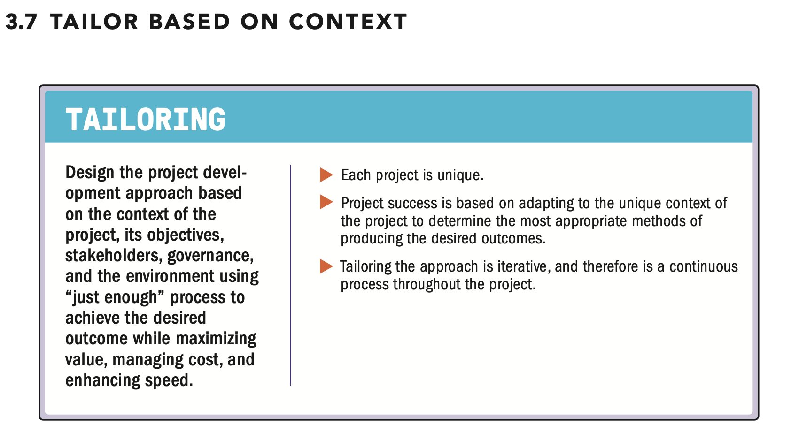

| English | Vietnamese |
|---------|------------|
| ▶ Adapting to the unique objectives, stakeholders, and complexity of the environment contributes to project success. | ▶ Thích ứng với các mục tiêu riêng biệt, các bên liên quan và sự phức tạp của môi trường đóng góp vào thành công của dự án. |
| ▶ Tailoring is the deliberate adaptation of approach, governance, and processes to make them more suitable for the given environment and the work at hand. | ▶ Tailoring là việc chủ động điều chỉnh phương pháp, quản trị và quy trình để chúng phù hợp hơn với môi trường cụ thể và công việc hiện tại. |
| ▶ Project teams tailor the appropriate framework that will enable the flexibility to consistently produce positive outcomes within the context of the life cycle of the project. | ▶ Các nhóm dự án điều chỉnh khuôn khổ phù hợp để tạo khả năng linh hoạt nhằm liên tục tạo ra kết quả tích cực trong bối cảnh vòng đời của dự án. |
| ▶ The business environment, team size, degree of uncertainty, and complexity of the project all factor into how project systems are tailored. | ▶ Môi trường kinh doanh, quy mô nhóm, mức độ không chắc chắn và độ phức tạp của dự án đều ảnh hưởng đến cách các hệ thống dự án được điều chỉnh. |
| ▶ Project systems can be tailored with a holistic perspective, including the consideration of interrelated complexities. | ▶ Các hệ thống dự án có thể được điều chỉnh với một quan điểm toàn diện, bao gồm cả việc xem xét các sự phức tạp có liên quan lẫn nhau. |
| ▶ Tailoring aims to maximize value, manage constraints, and improve performance by using “just enough” processes, methods, templates, and artifacts to achieve the desired outcome from the project. | ▶ Tailoring nhằm tối đa hóa giá trị, quản lý các ràng buộc và cải thiện hiệu suất bằng cách sử dụng các quy trình, phương pháp, mẫu và sản phẩm “vừa đủ” để đạt được kết quả mong muốn từ dự án. |
| English | Vietnamese |
|---------|------------|
| ▶ Together with the PMO and considering governance, project teams discuss and decide on the delivery approach and resources required for producing outcomes on a project-by-project basis. | ▶ Cùng với PMO và xem xét quản trị, các nhóm dự án thảo luận và quyết định phương pháp triển khai và các nguồn lực cần thiết để tạo ra kết quả trên cơ sở từng dự án. |
| ▶ This includes the selection of the processes to use, development approach, methods, and artifacts needed to deliver the project outcomes. | ▶ Điều này bao gồm việc lựa chọn các quy trình sẽ sử dụng, phương pháp phát triển, các phương pháp và sản phẩm cần thiết để đạt được kết quả dự án. |
| ▶ Tailoring decisions can be an implicit action of accepting an established methodology. | ▶ Quyết định Tailoring có thể là một hành động ngầm hiểu khi chấp nhận một phương pháp đã được thiết lập. |
| ▶ Conversely, tailoring can be an explicit action of selecting and mixing specific elements to suit the unique characteristics of the project and the project environment. | ▶ Ngược lại, Tailoring có thể là một hành động rõ ràng khi lựa chọn và kết hợp các yếu tố cụ thể để phù hợp với đặc điểm riêng của dự án và môi trường dự án. |
| ▶ Tailoring is necessary to some degree in every project, because each project exists in a particular context. | ▶ Tailoring cần thiết ở mức độ nhất định trong mỗi dự án, vì mỗi dự án tồn tại trong một bối cảnh cụ thể. |
| ▶ Projects are often unique, even when the deliverable of the project does not seem unique. | ▶ Các dự án thường mang tính độc nhất, ngay cả khi sản phẩm của dự án dường như không độc nhất. |
| ▶ This is because project contexts differ in that the organization, its customers, its channels, and its environment are dynamic elements. | ▶ Điều này là do bối cảnh dự án khác nhau, trong đó tổ chức, khách hàng, kênh và môi trường là các yếu tố động. |
| ▶ Those changes and ongoing learning may cause project teams to use or develop different methods or approaches in pursuit of success. | ▶ Những thay đổi và học hỏi liên tục có thể khiến các nhóm dự án sử dụng hoặc phát triển các phương pháp hoặc cách tiếp cận khác nhau để đạt được thành công. |
| ▶ The project team should examine the unique set of conditions for each project, so that they can determine the most appropriate methods of producing the desired outcomes. | ▶ Nhóm dự án nên xem xét bộ điều kiện độc đáo của từng dự án để có thể xác định các phương pháp phù hợp nhất để đạt được kết quả mong muốn. |
| ▶ An existing methodology or common way of working can inform the way in which a project is tailored. | ▶ Một phương pháp hiện có hoặc cách làm chung có thể hướng dẫn cách Tailoring dự án. |
| ▶ A methodology is a system of practices, techniques, procedures, and rules used by those who work in a discipline. | ▶ Phương pháp là một hệ thống các thực tiễn, kỹ thuật, quy trình và quy tắc được sử dụng bởi những người làm việc trong một lĩnh vực. |
| ▶ Project teams may be required to assume the methodology of the parent organization. | ▶ Các nhóm dự án có thể được yêu cầu áp dụng phương pháp của tổ chức mẹ. |
| ▶ That is, the project team adopts a system of processes, governance, methods, and templates that provide guidance on how to run the project. | ▶ Nghĩa là, nhóm dự án áp dụng một hệ thống các quy trình, quản trị, phương pháp và mẫu cung cấp hướng dẫn về cách triển khai dự án. |
| ▶ While this provides a degree of consistency to projects within an organization, the methodology itself may still need tailoring to suit each project. | ▶ Mặc dù điều này mang lại sự nhất quán cho các dự án trong tổ chức, nhưng bản thân phương pháp vẫn có thể cần được Tailoring để phù hợp với từng dự án. |
| ▶ Organizational policies and procedures prescribe authorized boundaries within which the project team can tailor. | ▶ Các chính sách và quy trình tổ chức quy định các ranh giới được phép mà trong đó nhóm dự án có thể Tailoring. |
| ▶ Project teams can also factor in the time and cost of project management processes. | ▶ Các nhóm dự án cũng có thể tính đến thời gian và chi phí của các quy trình quản lý dự án. |
| ▶ Processes that are not tailored may add little value to the project or its outcomes while increasing cost and lengthening schedule. | ▶ Các quy trình không được Tailoring có thể mang lại ít giá trị cho dự án hoặc kết quả của nó trong khi làm tăng chi phí và kéo dài tiến độ. |
| ▶ Tailoring the approach along with appropriate processes, methods, and artifacts can help project teams make decisions about process-related costs and the related value contribution to project outcomes. | ▶ Tailoring phương pháp cùng với các quy trình, phương pháp và sản phẩm phù hợp có thể giúp nhóm dự án đưa ra quyết định về chi phí liên quan đến quy trình và đóng góp giá trị liên quan đến kết quả dự án. |
| ▶ In addition to deciding on how to tailor an approach, project teams communicate the tailoring decisions to stakeholders associated with that approach. | ▶ Ngoài việc quyết định cách Tailoring phương pháp, các nhóm dự án còn truyền đạt các quyết định Tailoring tới các bên liên quan liên quan đến phương pháp đó. |
| ▶ Each member of the project team is aware of the chosen methods and processes that relate to those stakeholders and their role. | ▶ Mỗi thành viên nhóm dự án đều nắm rõ các phương pháp và quy trình đã chọn liên quan đến các bên liên quan đó và vai trò của họ. |
| English | Vietnamese |
|---------|------------|
| ▶ Tailoring the project approach to suit the unique characteristics of the project and its environment can contribute to a higher level of project performance and an increased probability of success. | ▶ Tailoring phương pháp dự án để phù hợp với các đặc điểm riêng của dự án và môi trường của nó có thể đóng góp vào mức hiệu suất dự án cao hơn và tăng khả năng thành công. |
| ▶ A tailored project approach can produce direct and indirect benefits to organizations, such as: | ▶ Một phương pháp dự án được Tailoring có thể mang lại lợi ích trực tiếp và gián tiếp cho tổ chức, chẳng hạn như: |
| ▶ Deeper commitment from project team members because they took part in defining the approach, | ▶ Cam kết sâu sắc hơn từ các thành viên nhóm dự án vì họ tham gia vào việc xác định phương pháp, |
| ▶ Reduction in waste in terms of actions or resources, | ▶ Giảm lãng phí về hành động hoặc nguồn lực, |
| ▶ Customer-oriented focus, as the needs of the customer and other stakeholders are an important influencing factor in the tailoring of the project, and | ▶ Tập trung vào khách hàng, vì nhu cầu của khách hàng và các bên liên quan khác là yếu tố quan trọng ảnh hưởng đến việc Tailoring dự án, và |
| ▶ More efficient use of project resources, as project teams are conscious of the weight of project processes. | ▶ Sử dụng nguồn lực dự án hiệu quả hơn, vì các nhóm dự án nhận thức được tầm quan trọng của các quy trình dự án. |
| ▶ Tailoring projects can lead to the following positive outcomes: | ▶ Tailoring dự án có thể dẫn đến các kết quả tích cực sau: |
| ▶ Increased innovation, efficiency, and productivity; | ▶ Tăng cường đổi mới, hiệu quả và năng suất; |
| ▶ Lessons learned, so that improvements from a specific delivery approach can be shared and applied to the next round of work or future projects; | ▶ Bài học rút ra, để các cải tiến từ một phương pháp triển khai cụ thể có thể được chia sẻ và áp dụng cho vòng công việc tiếp theo hoặc các dự án tương lai; |
| ▶ Further improvement of an organization’s methodology, with new practices, methods, and artifacts; | ▶ Cải thiện thêm phương pháp của tổ chức, với các thực hành, phương pháp và sản phẩm mới; |
| ▶ Discovery of improved outcomes, processes, or methods through experimentation; | ▶ Khám phá các kết quả, quy trình hoặc phương pháp cải tiến thông qua thử nghiệm; |
| ▶ Effective integration within multidisciplinary project teams of methods and practices used to deliver project results; and | ▶ Tích hợp hiệu quả trong các nhóm dự án đa ngành của các phương pháp và thực hành được sử dụng để đạt kết quả dự án; và |
| ▶ Increased adaptability for the organization in the long term. | ▶ Tăng khả năng thích ứng của tổ chức về lâu dài. |
| ▶ Tailoring an approach is iterative in nature, and therefore is a constant process itself during the project life cycle. | ▶ Tailoring một phương pháp có tính lặp đi lặp lại, do đó là một quá trình liên tục trong suốt vòng đời dự án. |
| ▶ Project teams collect feedback from all stakeholders on how the methods and tailored processes are working for them as the project progresses to evaluate their effectiveness and add value to the organization. | ▶ Các nhóm dự án thu thập phản hồi từ tất cả các bên liên quan về cách các phương pháp và quy trình Tailoring đang hoạt động đối với họ khi dự án tiến triển, nhằm đánh giá hiệu quả và gia tăng giá trị cho tổ chức. |
| ▶ PMI Seventh Edition July 2021 | ▶ PMI Ấn bản Thứ Bảy, Tháng 7 năm 2021 |

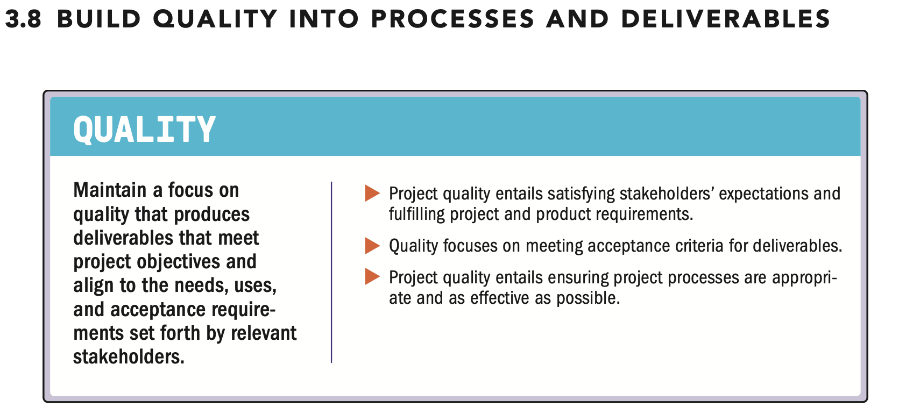

| English | Vietnamese |
|---------|------------|
| ▶ Quality is the degree to which a set of inherent characteristics of a product, service, or result fulfills the requirements. | ▶ Chất lượng là mức độ mà một tập hợp các đặc tính vốn có của sản phẩm, dịch vụ hoặc kết quả đáp ứng các yêu cầu. |
| ▶ Quality includes the ability to satisfy the customer’s stated or implied needs. | ▶ Chất lượng bao gồm khả năng thỏa mãn các nhu cầu đã nêu hoặc ngầm định của khách hàng. |
| ▶ The product, service, or result of a project (referred to here as deliverables) is measured for the quality of both the conformance to acceptance criteria and fitness for use. | ▶ Sản phẩm, dịch vụ hoặc kết quả của một dự án (gọi là deliverables) được đo lường về chất lượng cả về việc tuân thủ các tiêu chí chấp nhận và khả năng sử dụng. |

| English | Vietnamese |
|---------|------------|
| ▶ Quality may have several different dimensions, including but not limited to the following: | ▶ Chất lượng có thể có nhiều khía cạnh khác nhau, bao gồm nhưng không giới hạn ở các khía cạnh sau: |
| ▶ Performance. Does the deliverable function as the project team and other stakeholders intended? | ▶ Hiệu suất. Liệu deliverable có hoạt động như nhóm dự án và các bên liên quan mong đợi không? |
| ▶ Conformity. Is the deliverable fit for use, and does it meet the specifications? | ▶ Tuân thủ. Liệu deliverable có phù hợp để sử dụng và có đáp ứng các thông số kỹ thuật không? |
| ▶ Reliability. Does the deliverable produce consistent metrics each time it is performed or produced? | ▶ Độ tin cậy. Liệu deliverable có tạo ra các chỉ số nhất quán mỗi lần được thực hiện hoặc sản xuất không? |
| ▶ Resilience. Is the deliverable able to cope with unforeseen failures and quickly recover? | ▶ Khả năng phục hồi. Liệu deliverable có thể đối phó với các lỗi không lường trước và phục hồi nhanh chóng không? |
| ▶ Satisfaction. Does the deliverable elicit positive feedback from end users? This includes usability and user experience. | ▶ Sự hài lòng. Liệu deliverable có nhận được phản hồi tích cực từ người dùng cuối không? Điều này bao gồm khả năng sử dụng và trải nghiệm người dùng. |
| ▶ Uniformity. Does the deliverable show parity with other deliverables produced in the same manner? | ▶ Tính đồng nhất. Liệu deliverable có tương đồng với các deliverable khác được sản xuất theo cùng cách không? |
| ▶ Efficiency. Does the deliverable produce the greatest output with the least amount of inputs and effort? | ▶ Hiệu quả. Liệu deliverable có tạo ra đầu ra lớn nhất với lượng đầu vào và nỗ lực ít nhất không? |
| ▶ Sustainability. Does the deliverable produce a positive impact on economic, social, and environmental parameters? | ▶ Tính bền vững. Liệu deliverable có tạo ra tác động tích cực đối với các yếu tố kinh tế, xã hội và môi trường không? |
| ▶ Project teams measure quality using metrics and acceptance criteria based on requirements. | ▶ Các nhóm dự án đo lường chất lượng bằng các chỉ số và tiêu chí chấp nhận dựa trên các yêu cầu. |
| ▶ A requirement is a condition or capability that is necessary to be present in a product, service, or result to satisfy a need. | ▶ Yêu cầu là điều kiện hoặc khả năng cần có trong một sản phẩm, dịch vụ hoặc kết quả để đáp ứng một nhu cầu. |
| ▶ Requirements, either explicit or implicit, may come from stakeholders, a contract, organizational policies, standards, or regulatory bodies, or a combination of these. | ▶ Yêu cầu, dù là rõ ràng hay ngầm định, có thể đến từ các bên liên quan, hợp đồng, chính sách tổ chức, tiêu chuẩn hoặc cơ quan quản lý, hoặc kết hợp các yếu tố này. |
| ▶ Quality is closely linked to the product acceptance criteria, as described in the statement of work or other design documents. | ▶ Chất lượng liên kết chặt chẽ với các tiêu chí chấp nhận sản phẩm, như được mô tả trong bản mô tả công việc hoặc các tài liệu thiết kế khác. |
| ▶ These criteria should be updated as experimentation and prioritization occur and validated as part of the acceptance process. | ▶ Các tiêu chí này nên được cập nhật khi tiến hành thử nghiệm và ưu tiên, và được xác nhận như một phần của quá trình chấp nhận. |
| ▶ Quality is also relevant to the project approaches and activities used to produce the project’s deliverables. | ▶ Chất lượng cũng liên quan đến các phương pháp và hoạt động dự án được sử dụng để tạo ra deliverable của dự án. |
| ▶ While project teams evaluate the quality of a deliverable through inspection and testing, project activities and processes are assessed through reviews and audits. | ▶ Trong khi các nhóm dự án đánh giá chất lượng của deliverable thông qua kiểm tra và thử nghiệm, các hoạt động và quy trình dự án được đánh giá thông qua xem xét và kiểm toán. |
| ▶ In both instances, quality activities may focus on detection and prevention of errors and defects. | ▶ Trong cả hai trường hợp, các hoạt động về chất lượng có thể tập trung vào việc phát hiện và ngăn ngừa lỗi và khiếm khuyết. |
| English | Vietnamese |
|---------|------------|
| ▶ The objective of quality activities is to help ensure that what is delivered meets the objectives of the customer and other relevant stakeholders in the most straightforward path. | ▶ Mục tiêu của các hoạt động chất lượng là giúp đảm bảo rằng những gì được giao đáp ứng các mục tiêu của khách hàng và các bên liên quan có liên quan theo cách trực tiếp nhất. |
| ▶ The intention is to minimize the waste of resources and maximize the probability of attaining the desired outcome. | ▶ Mục đích là giảm thiểu lãng phí tài nguyên và tối đa hóa khả năng đạt được kết quả mong muốn. |
| ▶ This results in: | ▶ Điều này dẫn đến: |
| ▶ Moving the deliverables to the point of delivery quickly, and | ▶ Đưa deliverable đến điểm giao hàng một cách nhanh chóng, và |
| ▶ Preventing defects in the deliverables or identifying them early to avoid or reduce the need for rework and scrap. | ▶ Ngăn ngừa khiếm khuyết trong deliverable hoặc phát hiện chúng sớm để tránh hoặc giảm nhu cầu làm lại và phế phẩm. |
| ▶ The objective of quality activities is the same whether dealing with an up-front, well-defined set of requirements or a set of requirements that are progressively elaborated and incrementally delivered. | ▶ Mục tiêu của các hoạt động chất lượng là như nhau, dù xử lý một tập hợp yêu cầu được xác định rõ ràng từ đầu hay một tập hợp yêu cầu được phát triển dần dần và giao theo từng phần. |
| ▶ Quality management processes and practices help produce deliverables and outcomes that meet project objectives and align to the expectations, uses, and acceptance criteria expressed by the organization and relevant stakeholders. | ▶ Các quy trình và thực hành quản lý chất lượng giúp tạo ra deliverable và kết quả đáp ứng mục tiêu dự án và phù hợp với kỳ vọng, cách sử dụng và tiêu chí chấp nhận do tổ chức và các bên liên quan thể hiện. |
| ▶ Close attention to quality in project processes and deliverables creates positive outcomes, including: | ▶ Chú ý chặt chẽ đến chất lượng trong các quy trình và deliverable dự án tạo ra các kết quả tích cực, bao gồm: |
| ▶ Project deliverables that are fit for purpose, as defined by acceptance criteria, | ▶ Deliverable dự án phù hợp với mục đích, như được định nghĩa bởi tiêu chí chấp nhận, |
| ▶ Project deliverables that meet stakeholder expectations and business objectives, | ▶ Deliverable dự án đáp ứng kỳ vọng của các bên liên quan và mục tiêu kinh doanh, |
| ▶ Project deliverables with minimal or no defects, | ▶ Deliverable dự án với ít hoặc không có khiếm khuyết, |
| ▶ Timely or expedited delivery, | ▶ Giao hàng kịp thời hoặc được đẩy nhanh, |
| ▶ Enhanced cost control, | ▶ Cải thiện kiểm soát chi phí, |
| ▶ Increased quality of product delivery, | ▶ Tăng cường chất lượng giao hàng sản phẩm, |
| ▶ Reduced rework and scrap, | ▶ Giảm làm lại và phế phẩm, |
| ▶ Reduced customer complaints, | ▶ Giảm khiếu nại của khách hàng, |
| ▶ Good supply chain integration, | ▶ Tích hợp chuỗi cung ứng tốt, |
| ▶ Improved productivity, | ▶ Cải thiện năng suất, |
| ▶ Increased project team morale and satisfaction, | ▶ Tăng tinh thần và sự hài lòng của nhóm dự án, |
| ▶ Robust service delivery, | ▶ Giao dịch vụ mạnh mẽ, |
| ▶ Improved decision making, and | ▶ Cải thiện việc ra quyết định, và |
| ▶ Continually improved processes. | ▶ Liên tục cải tiến các quy trình. |

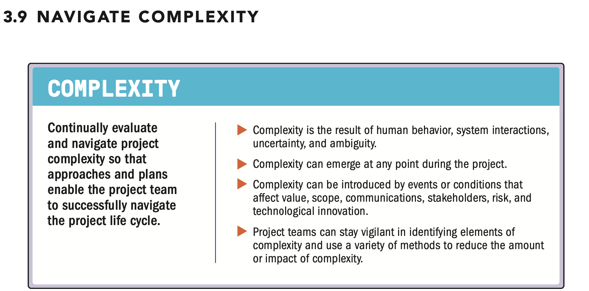

| English | Vietnamese |
|---------|------------|
| ▶ A project is a system of elements that interact with each other. | ▶ Dự án là một hệ thống các yếu tố tương tác với nhau. |
| ▶ Complexity is a characteristic of a project or its environment that is difficult to manage due to human behavior, system behavior, and ambiguity. | ▶ Độ phức tạp là đặc điểm của một dự án hoặc môi trường của nó, khó quản lý do hành vi con người, hành vi hệ thống và sự mơ hồ. |
| ▶ The nature and number of the interactions determine the degree of complexity in a project. | ▶ Bản chất và số lượng các tương tác quyết định mức độ phức tạp trong một dự án. |
| ▶ Complexity emerges from project elements, interactions between project elements, and interactions with other systems and the project environment. | ▶ Độ phức tạp xuất hiện từ các yếu tố dự án, các tương tác giữa các yếu tố dự án và các tương tác với các hệ thống khác và môi trường dự án. |
| ▶ Though complexity cannot be controlled, project teams can modify their activities to address impacts that occur as a result of complexity. | ▶ Mặc dù độ phức tạp không thể kiểm soát, các nhóm dự án có thể điều chỉnh các hoạt động của họ để ứng phó với các tác động phát sinh do độ phức tạp. |
| ▶ Project teams often cannot foresee complexity emerging because it is the result of many interactions such as risks, dependencies, events, or relationships. | ▶ Các nhóm dự án thường không thể dự đoán được độ phức tạp phát sinh vì nó là kết quả của nhiều tương tác như rủi ro, sự phụ thuộc, sự kiện hoặc mối quan hệ. |
| ▶ Alternatively, a few causes may converge to produce a single complex effect, which makes isolating a specific cause of complexity difficult. | ▶ Ngoài ra, một vài nguyên nhân có thể hội tụ để tạo ra một hiệu ứng phức tạp duy nhất, điều này làm cho việc xác định nguyên nhân cụ thể của độ phức tạp trở nên khó khăn. |
| ▶ Project complexity occurs as the result of individual elements within the project and project system as a whole. | ▶ Độ phức tạp dự án xuất hiện như kết quả của các yếu tố riêng lẻ trong dự án và hệ thống dự án nói chung. |
| ▶ For example, complexity within a project may be amplified with a greater number or diversity of stakeholders, such as regulatory agencies, international financial institutions, multiple vendors, numerous specialty subcontractors, or local communities. | ▶ Ví dụ, độ phức tạp trong một dự án có thể tăng lên với số lượng hoặc sự đa dạng lớn hơn của các bên liên quan, chẳng hạn như cơ quan quản lý, tổ chức tài chính quốc tế, nhiều nhà cung cấp, nhiều nhà thầu phụ chuyên môn hoặc cộng đồng địa phương. |
| ▶ These stakeholders can have a significant impact on the complexity of a project, both individually and collectively. | ▶ Những bên liên quan này có thể ảnh hưởng đáng kể đến độ phức tạp của dự án, cả về cá nhân và tập thể. |

| English | Vietnamese |
|---------|------------|
| ▶ Some of the more common sources of complexity are: | ▶ Một số nguồn gốc phổ biến của độ phức tạp bao gồm: |
| ▶ Human behavior. Human behavior is the interplay of conduct, demeanors, attitudes, and experience of people. | ▶ Hành vi con người. Hành vi con người là sự tương tác của hành vi, thái độ, tư duy và kinh nghiệm của con người. |
| ▶ Human behavior can also contribute to complexity by introducing elements of subjectivity such as personal agendas that conflict with the project’s goals and objectives. | ▶ Hành vi con người cũng có thể góp phần tạo ra độ phức tạp bằng cách đưa vào các yếu tố mang tính chủ quan như mục tiêu cá nhân xung đột với các mục tiêu và mục đích của dự án. |
| ▶ Stakeholders located in remote locations may have different time zones, speak different languages, and have different cultural norms. | ▶ Các bên liên quan ở các địa điểm xa có thể có múi giờ khác nhau, nói các ngôn ngữ khác nhau và có chuẩn mực văn hóa khác nhau. |
| ▶ System behavior. System behavior is the result of dynamic interdependencies within and among project elements. | ▶ Hành vi hệ thống. Hành vi hệ thống là kết quả của các sự phụ thuộc động trong và giữa các yếu tố dự án. |
| ▶ For example, the integration of different technology systems may cause threats that could impact project outcomes and success. | ▶ Ví dụ, việc tích hợp các hệ thống công nghệ khác nhau có thể gây ra các mối đe dọa ảnh hưởng đến kết quả và thành công của dự án. |
| ▶ The interactions among components of the project system may lead to interconnected risk, create emerging or unforeseeable issues, and produce unclear and disproportional cause-and-effect relationships. | ▶ Các tương tác giữa các thành phần của hệ thống dự án có thể dẫn đến rủi ro liên kết, tạo ra các vấn đề mới hoặc không thể dự đoán, và tạo ra các mối quan hệ nguyên nhân-kết quả không rõ ràng và không tỷ lệ. |
| ▶ Uncertainty and ambiguity. Ambiguity is a state of being unclear, of not knowing what to expect or how to comprehend a situation. | ▶ Sự không chắc chắn và mơ hồ. Mơ hồ là trạng thái không rõ ràng, không biết điều gì sẽ xảy ra hoặc cách hiểu một tình huống. |
| ▶ Ambiguity can arise from having many options or a lack of clarity on the optimal choice. | ▶ Mơ hồ có thể phát sinh từ việc có nhiều lựa chọn hoặc thiếu rõ ràng về lựa chọn tối ưu. |
| ▶ Unclear or misleading events, emerging issues, or subjective situations can also lead to ambiguity. | ▶ Các sự kiện không rõ ràng hoặc gây hiểu nhầm, các vấn đề mới phát sinh, hoặc các tình huống mang tính chủ quan cũng có thể dẫn đến mơ hồ. |
| ▶ Uncertainty is the lack of understanding and awareness of issues, events, paths to follow, or solutions to pursue. | ▶ Không chắc chắn là thiếu hiểu biết và nhận thức về các vấn đề, sự kiện, con đường cần theo, hoặc giải pháp cần thực hiện. |
| ▶ Uncertainty deals with the probabilities of alternative actions, reactions, and outcomes. | ▶ Không chắc chắn liên quan đến xác suất của các hành động, phản ứng và kết quả thay thế. |
| ▶ Uncertainty includes unknown unknowns and black swans, which are emerging factors that are completely outside of existing knowledge or experience. | ▶ Không chắc chắn bao gồm những điều chưa biết và “thiên nga đen”, là các yếu tố mới phát sinh hoàn toàn nằm ngoài kiến thức hoặc kinh nghiệm hiện có. |
| ▶ Within a complex environment, uncertainty and ambiguity can combine to blur causal relationships to the point where probabilities and impacts are ill defined. | ▶ Trong môi trường phức tạp, không chắc chắn và mơ hồ có thể kết hợp làm mờ các mối quan hệ nhân quả đến mức xác suất và tác động không được xác định rõ ràng. |
| ▶ It becomes difficult to reduce uncertainty and ambiguity to the point where relationships can be well defined and therefore addressed effectively. | ▶ Sẽ trở nên khó khăn để giảm thiểu không chắc chắn và mơ hồ đến mức các mối quan hệ có thể được xác định rõ ràng và do đó được xử lý hiệu quả. |
| ▶ Technological innovation. Technological innovation can cause disruption to products, services, ways of working, processes, tools, techniques, procedures, and more. | ▶ Đổi mới công nghệ. Đổi mới công nghệ có thể gây gián đoạn đối với sản phẩm, dịch vụ, cách làm việc, quy trình, công cụ, kỹ thuật, thủ tục, và nhiều thứ khác. |
| ▶ The introduction of desktop computing and social media are examples of technological innovations that have fundamentally changed the way project work is performed. | ▶ Việc ra đời của máy tính để bàn và mạng xã hội là những ví dụ về đổi mới công nghệ đã thay đổi căn bản cách thức thực hiện công việc dự án. |
| ▶ New technology, along with the uncertainty of how that technology will be used, contributes to complexity. | ▶ Công nghệ mới, cùng với sự không chắc chắn về cách sử dụng công nghệ đó, góp phần tạo ra độ phức tạp. |
| ▶ Innovation has the potential to help move projects toward a solution, or to disrupt the project when associated uncertainties are not defined, leading to increased complexity. | ▶ Đổi mới có tiềm năng giúp dự án tiến tới giải pháp, hoặc gây gián đoạn dự án khi các yếu tố không chắc chắn liên quan chưa được xác định, dẫn đến tăng độ phức tạp. |

| English | Vietnamese |
|---------|------------|
| ▶ Complexity may emerge and impact the project in any area and at any point in the project life cycle. | ▶ Độ phức tạp có thể xuất hiện và ảnh hưởng đến dự án ở bất kỳ lĩnh vực nào và vào bất kỳ thời điểm nào trong vòng đời dự án. |
| ▶ Project teams can identify elements of complexity throughout the project by continually looking at the project component as well as the project as a whole for signs of complexity. | ▶ Các nhóm dự án có thể xác định các yếu tố phức tạp trong suốt dự án bằng cách liên tục xem xét các thành phần của dự án cũng như dự án toàn diện để tìm dấu hiệu của độ phức tạp. |
| ▶ Knowledge of systems thinking, complex adaptive systems, experience from past project work, experimentation, and continuous learning related to system interaction leads to the project team’s increased ability to navigate complexity when it emerges. | ▶ Kiến thức về tư duy hệ thống, các hệ thống thích nghi phức tạp, kinh nghiệm từ các dự án trước, thử nghiệm và học hỏi liên tục liên quan đến tương tác hệ thống giúp tăng khả năng của nhóm dự án trong việc điều hướng độ phức tạp khi nó xuất hiện. |
| ▶ Being vigilant for indications of complexity allows project teams to adapt their approaches and plans to navigate potential disruption to effective project delivery. | ▶ Cảnh giác với các dấu hiệu của độ phức tạp cho phép các nhóm dự án điều chỉnh phương pháp và kế hoạch của họ để điều hướng các gián đoạn tiềm ẩn nhằm đảm bảo việc thực hiện dự án hiệu quả. |

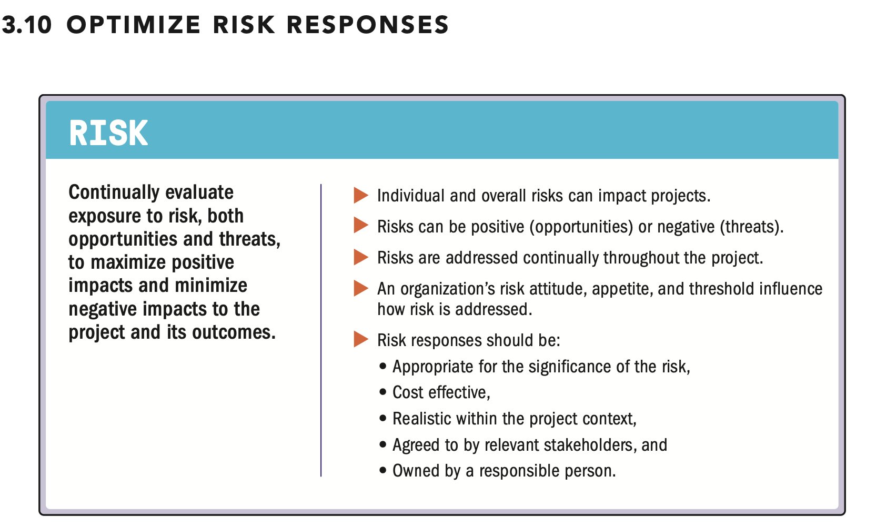

| English | Vietnamese |
|---------|------------|
| ▶ A risk is an uncertain event or condition that, if it occurs, can have a positive or negative effect on one or more objectives. | ▶ Rủi ro là một sự kiện hoặc điều kiện không chắc chắn mà nếu xảy ra, có thể ảnh hưởng tích cực hoặc tiêu cực đến một hoặc nhiều mục tiêu. |
| ▶ Identified risks may or may not materialize in a project. | ▶ Các rủi ro đã được xác định có thể xảy ra hoặc không xảy ra trong dự án. |
| ▶ Project teams endeavor to identify and evaluate known and emergent risks, both internal and external to the project, throughout the life cycle. | ▶ Các nhóm dự án nỗ lực xác định và đánh giá các rủi ro đã biết và mới phát sinh, cả bên trong và bên ngoài dự án, trong suốt vòng đời dự án. |
| ▶ Project teams seek to maximize positive risks (opportunities) and decrease exposure to negative risks (threats). | ▶ Các nhóm dự án tìm cách tối đa hóa các rủi ro tích cực (cơ hội) và giảm thiểu tác động của các rủi ro tiêu cực (mối đe dọa). |
| ▶ Threats may result in issues such as delay, cost overrun, technical failure, performance shortfall, or loss of reputation. | ▶ Các mối đe dọa có thể dẫn đến các vấn đề như chậm tiến độ, vượt chi phí, thất bại kỹ thuật, hiệu suất kém, hoặc mất uy tín. |
| ▶ Opportunities can lead to benefits such as reduced time and cost, improved performance, increased market share, or enhanced reputation. | ▶ Cơ hội có thể mang lại các lợi ích như giảm thời gian và chi phí, cải thiện hiệu suất, tăng thị phần hoặc nâng cao uy tín. |

| English | Vietnamese |
|---------|------------|
| ▶ Project teams also monitor the overall project risk. | ▶ Các nhóm dự án cũng giám sát rủi ro tổng thể của dự án. |
| ▶ Overall project risk is the effect of uncertainty on the project as a whole. | ▶ Rủi ro tổng thể của dự án là ảnh hưởng của sự không chắc chắn đối với toàn bộ dự án. |
| ▶ Overall risk arises from all sources of uncertainty, including individual risks, and represents the exposure of the stakeholders to the implications of variations in project outcome, both positive and negative. | ▶ Rủi ro tổng thể phát sinh từ tất cả các nguồn không chắc chắn, bao gồm các rủi ro riêng lẻ, và phản ánh mức độ tiếp xúc của các bên liên quan với những tác động của biến động kết quả dự án, cả tích cực và tiêu cực. |
| ▶ Management of overall project risk aims to keep project risk exposure within an acceptable range. | ▶ Quản lý rủi ro tổng thể của dự án nhằm giữ mức độ tiếp xúc rủi ro dự án trong phạm vi chấp nhận được. |
| ▶ Management strategies include reducing drivers of threats, promoting drivers of opportunities, and maximizing the probability of achieving overall project objectives. | ▶ Các chiến lược quản lý bao gồm giảm các yếu tố gây ra mối đe dọa, thúc đẩy các yếu tố tạo cơ hội, và tối đa hóa xác suất đạt được các mục tiêu tổng thể của dự án. |
| ▶ Project team members engage with relevant stakeholders to understand their risk appetite and risk thresholds. | ▶ Các thành viên nhóm dự án làm việc với các bên liên quan có liên quan để hiểu về khẩu vị rủi ro và ngưỡng rủi ro của họ. |
| ▶ Risk appetite describes the degree of uncertainty an organization or individual is willing to accept in anticipation of a reward. | ▶ Khẩu vị rủi ro mô tả mức độ không chắc chắn mà một tổ chức hoặc cá nhân sẵn sàng chấp nhận với kỳ vọng về phần thưởng. |
| ▶ Risk threshold is the measure of acceptable variation around an objective that reflects the risk appetite of the organization and stakeholders. | ▶ Ngưỡng rủi ro là thước đo sự biến đổi chấp nhận được xung quanh một mục tiêu, phản ánh khẩu vị rủi ro của tổ chức và các bên liên quan. |
| ▶ The risk threshold reflects the risk appetite. Therefore, a risk threshold of ±5% around a cost objective reflects a lower risk appetite than a risk threshold of ±10%. | ▶ Ngưỡng rủi ro phản ánh khẩu vị rủi ro. Do đó, ngưỡng rủi ro ±5% xung quanh mục tiêu chi phí phản ánh khẩu vị rủi ro thấp hơn so với ngưỡng rủi ro ±10%. |
| ▶ The risk appetite and risk threshold inform how the project team navigates risk in a project. | ▶ Khẩu vị rủi ro và ngưỡng rủi ro giúp nhóm dự án định hướng cách quản lý rủi ro trong dự án. |
| ▶ Effective and appropriate risk responses can reduce individual and overall project threats and increase individual and overall opportunities. | ▶ Các biện pháp ứng phó rủi ro hiệu quả và phù hợp có thể giảm các mối đe dọa riêng lẻ và tổng thể của dự án, đồng thời tăng các cơ hội riêng lẻ và tổng thể. |
| ▶ Project teams should consistently identify potential risk responses with the following characteristics in mind: | ▶ Các nhóm dự án nên liên tục xác định các biện pháp ứng phó rủi ro tiềm năng với các đặc điểm sau: |
| ▶ Appropriate and timely to the significance of the risk, | ▶ Phù hợp và kịp thời với mức độ quan trọng của rủi ro, |
| ▶ Cost effective, | ▶ Hiệu quả về chi phí, |
| ▶ Realistic within the project context, | ▶ Thực tế trong bối cảnh dự án, |
| ▶ Agreed to by relevant stakeholders, and | ▶ Được các bên liên quan có liên quan đồng ý, và |
| ▶ Owned by a responsible person. | ▶ Được một người có trách nhiệm quản lý. |
| ▶ Risks can exist within the enterprise, portfolio, program, project, and product. | ▶ Rủi ro có thể tồn tại trong doanh nghiệp, danh mục đầu tư, chương trình, dự án và sản phẩm. |
| ▶ The project may be a component of a program in which the risk can potentially enhance or diminish benefits realization and, therefore, value. | ▶ Dự án có thể là một thành phần của một chương trình mà trong đó rủi ro có thể làm tăng hoặc giảm việc thực hiện lợi ích và do đó ảnh hưởng đến giá trị. |
| ▶ The project may be a component of a portfolio of related or unrelated work in which the risk can potentially enhance or diminish overall value of the portfolio and realization of business objectives. | ▶ Dự án có thể là một thành phần của danh mục các công việc liên quan hoặc không liên quan mà trong đó rủi ro có thể làm tăng hoặc giảm giá trị tổng thể của danh mục và việc thực hiện các mục tiêu kinh doanh. |
| ▶ Organizations and project teams that employ consistent risk evaluation, planning, and proactive risk implementation often find the effort to be less costly than reacting to issues when the risk materializes. | ▶ Các tổ chức và nhóm dự án áp dụng đánh giá rủi ro, lập kế hoạch và thực hiện rủi ro chủ động một cách nhất quán thường thấy nỗ lực này ít tốn kém hơn so với việc phản ứng với các vấn đề khi rủi ro xảy ra. |
| ▶ More information on risk management may be found in The Standard for Risk Management in Portfolios, Programs, and Projects [3]. | ▶ Thông tin chi tiết hơn về quản lý rủi ro có thể được tìm thấy trong Tiêu chuẩn quản lý rủi ro trong Danh mục đầu tư, Chương trình và Dự án [3]. |

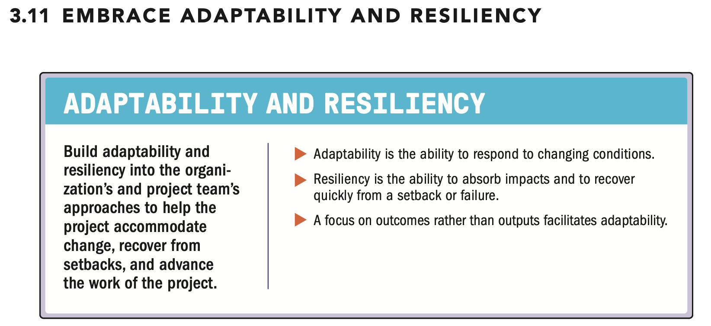

| English | Vietnamese |
|---------|------------|
| ▶ Most projects encounter challenges or obstacles at some stage. | ▶ Hầu hết các dự án đều gặp phải thách thức hoặc trở ngại ở một giai đoạn nào đó. |
| ▶ The combined attributes of adaptability and resiliency in the project team’s approach to a project help the project accommodate impacts and thrive. | ▶ Sự kết hợp của các đặc tính linh hoạt và khả năng phục hồi trong cách tiếp cận dự án của nhóm dự án giúp dự án thích ứng với các tác động và phát triển. |
| ▶ Adaptability refers to the ability to respond to changing conditions. | ▶ Linh hoạt đề cập đến khả năng phản ứng với các điều kiện thay đổi. |
| ▶ Resiliency consists of two complementary traits: the ability to absorb impacts and the ability to recover quickly from a setback or failure. | ▶ Khả năng phục hồi bao gồm hai đặc tính bổ sung: khả năng hấp thụ các tác động và khả năng hồi phục nhanh chóng sau một trở ngại hoặc thất bại. |
| ▶ Both adaptability and resiliency are helpful characteristics for anyone working on projects. | ▶ Cả linh hoạt và khả năng phục hồi đều là những đặc tính hữu ích cho bất kỳ ai làm việc trong các dự án. |
| English | Vietnamese |
|---------|------------|
| ▶ A project rarely performs exactly as initially planned. | ▶ Một dự án hiếm khi thực hiện chính xác theo kế hoạch ban đầu. |
| ▶ Projects are influenced by internal and external factors—new requirements, issues, stakeholder influences, among other factors—which exist in a system of interactions. | ▶ Các dự án chịu ảnh hưởng bởi các yếu tố nội bộ và bên ngoài — các yêu cầu mới, các vấn đề, sự tác động của các bên liên quan, cùng các yếu tố khác — tồn tại trong một hệ thống các tương tác. |
| ▶ Some elements within a project may fail or fall short of expectations, requiring the project team to regroup, rethink, and replan. | ▶ Một số yếu tố trong dự án có thể thất bại hoặc không đạt kỳ vọng, đòi hỏi nhóm dự án phải tái tổ chức, suy nghĩ lại và lập kế hoạch mới. |
| ▶ On an infrastructure project, for example, a court decision during project execution could change the designs and plans. | ▶ Ví dụ, trong một dự án hạ tầng, một quyết định của tòa án trong quá trình thực hiện dự án có thể thay đổi thiết kế và kế hoạch. |
| ▶ In a technology project, a computerized model of the technology might show that the components work together properly, but the real-world application fails. | ▶ Trong một dự án công nghệ, mô hình máy tính của công nghệ có thể cho thấy các thành phần hoạt động đúng, nhưng ứng dụng thực tế thất bại. |
| ▶ In both cases, the project team will need to address the situation in order to move the project forward. | ▶ Trong cả hai trường hợp, nhóm dự án sẽ cần giải quyết tình huống để đưa dự án tiến lên. |
| ▶ The view that projects should hold firm to plans and commitments made during the early stages, even after new or unforeseen factors emerge, is not beneficial to stakeholders, including customers and end users, as this limits the potential for generating value. | ▶ Quan điểm rằng dự án nên giữ nguyên kế hoạch và cam kết được đưa ra trong giai đoạn đầu, ngay cả khi các yếu tố mới hoặc không lường trước xuất hiện, không có lợi cho các bên liên quan, bao gồm khách hàng và người dùng cuối, vì điều này giới hạn khả năng tạo giá trị. |
| ▶ However, adapting should be done with a holistic view, such as a proper change control process, to avoid problems such as scope creep. | ▶ Tuy nhiên, việc thích ứng nên được thực hiện với cái nhìn toàn diện, chẳng hạn như quy trình kiểm soát thay đổi hợp lý, để tránh các vấn đề như mở rộng phạm vi dự án (scope creep). |
| ▶ In a project environment, capabilities that support adaptability and resilience include: | ▶ Trong môi trường dự án, các năng lực hỗ trợ linh hoạt và khả năng phục hồi bao gồm: |
| ▶ Short feedback loops to adapt quickly; | ▶ Vòng phản hồi ngắn để thích ứng nhanh; |
| ▶ Continuous learning and improvement; | ▶ Học hỏi và cải thiện liên tục; |
| ▶ Project teams with broad skill sets, coupled with individuals having extensive knowledge in each required skill area; | ▶ Nhóm dự án với bộ kỹ năng rộng, kết hợp với những cá nhân có kiến thức sâu rộng trong từng lĩnh vực kỹ năng cần thiết; |
| ▶ Regular inspection and adaptation of project work to identify improvement opportunities; | ▶ Kiểm tra và điều chỉnh công việc dự án thường xuyên để xác định cơ hội cải tiến; |
| ▶ Diverse project teams to capture a broad range of experiences; | ▶ Nhóm dự án đa dạng để thu thập một phạm vi kinh nghiệm rộng; |
| ▶ Open and transparent planning that engages internal and external stakeholders; | ▶ Lập kế hoạch mở và minh bạch, thu hút các bên liên quan nội bộ và bên ngoài; |
| ▶ Small-scale prototypes and experiments to test ideas and try new approaches; | ▶ Mẫu thử nghiệm quy mô nhỏ và thử nghiệm để kiểm tra ý tưởng và thử các phương pháp tiếp cận mới; |
| ▶ Ability to leverage new ways of thinking and working; | ▶ Khả năng tận dụng các cách tư duy và làm việc mới; |
| ▶ Process design that balances velocity of work and stability of requirements; | ▶ Thiết kế quy trình cân bằng tốc độ công việc và sự ổn định của các yêu cầu; |
| ▶ Open organizational conversations; | ▶ Các cuộc trò chuyện cởi mở trong tổ chức; |
| ▶ Diverse project teams with broad skill sets, cultures, and experience, coupled with subject matter experts in each required skill area; | ▶ Nhóm dự án đa dạng với bộ kỹ năng rộng, văn hóa và kinh nghiệm phong phú, kết hợp với các chuyên gia trong từng lĩnh vực kỹ năng cần thiết; |
| ▶ Understanding from past learning of the same or similar endeavors; | ▶ Hiểu biết từ các bài học trước đây của các nỗ lực tương tự hoặc cùng loại; |
| English | Vietnamese |
|---------|------------|
| ▶ Ability and willingness to anticipate multiple potential scenarios and prepare for multiple eventualities; | ▶ Khả năng và sẵn sàng dự đoán nhiều kịch bản tiềm năng và chuẩn bị cho nhiều tình huống có thể xảy ra; |
| ▶ Deferring decision making to the last responsible moment; | ▶ Hoãn quyết định đến thời điểm cuối cùng có trách nhiệm; |
| ▶ Management support; and | ▶ Sự hỗ trợ của quản lý; và |
| ▶ Open-ended design that balances speed and stability. | ▶ Thiết kế mở cân bằng giữa tốc độ và sự ổn định. |
| ▶ Envisioning outcomes rather than deliverables can enable solutions, harnessing a better result than the one originally planned. | ▶ Hình dung kết quả thay vì chỉ tập trung vào sản phẩm giao có thể giúp tạo ra giải pháp, mang lại kết quả tốt hơn so với kế hoạch ban đầu. |
| ▶ For example, a project team may find an alternative solution that would provide stronger outcomes than the original defined deliverable. | ▶ Ví dụ, một nhóm dự án có thể tìm ra giải pháp thay thế mang lại kết quả mạnh mẽ hơn so với sản phẩm giao ban đầu. |
| ▶ While exploration of alternatives is usually the purview of the business case, technologies and other capabilities are evolving so rapidly that a solution could emerge at any time between completion of the business case and project closure. | ▶ Mặc dù việc khám phá các phương án thay thế thường thuộc phạm vi của hồ sơ dự án (business case), công nghệ và các năng lực khác đang phát triển nhanh chóng đến mức một giải pháp có thể xuất hiện bất cứ lúc nào giữa việc hoàn thành hồ sơ dự án và kết thúc dự án. |
| ▶ Opportunities for adaptation may emerge during a project, at which time the project team should make a case to the project sponsor, product owner, or customer for capturing the opportunity. | ▶ Cơ hội để thích ứng có thể xuất hiện trong quá trình dự án, và khi đó nhóm dự án nên trình bày lý do với nhà tài trợ dự án, chủ sản phẩm hoặc khách hàng để tận dụng cơ hội. |
| ▶ Depending on the type of contract, the customer’s approval may be needed for some of the changes that result from the adaptation. | ▶ Tùy thuộc vào loại hợp đồng, sự chấp thuận của khách hàng có thể cần thiết cho một số thay đổi phát sinh từ việc thích ứng. |
| ▶ The project team should be prepared to adapt its plans and activities to take advantage of the opportunity, with the support of the project sponsor, product owner, or customer. | ▶ Nhóm dự án nên sẵn sàng điều chỉnh kế hoạch và hoạt động để tận dụng cơ hội, với sự hỗ trợ của nhà tài trợ dự án, chủ sản phẩm hoặc khách hàng. |
| ▶ Unexpected changes and circumstances in a project system can also present opportunities. | ▶ Những thay đổi và tình huống bất ngờ trong hệ thống dự án cũng có thể mang lại cơ hội. |
| ▶ To optimize value delivery, project teams should use problem solving as well as a holistic-thinking approach to changes and unplanned events. | ▶ Để tối ưu hóa việc tạo giá trị, các nhóm dự án nên sử dụng khả năng giải quyết vấn đề cũng như phương pháp tư duy toàn diện đối với các thay đổi và sự kiện không kế hoạch. |
| ▶ When an unplanned event occurs, project teams should look for potential positive outcomes that might be gained. | ▶ Khi một sự kiện không kế hoạch xảy ra, các nhóm dự án nên tìm kiếm các kết quả tích cực tiềm năng có thể đạt được. |
| ▶ For example, incorporating a change that occurs late in a project time line could add competitive advantage by being the first product in the market to offer the feature. | ▶ Ví dụ, việc đưa vào một thay đổi xảy ra muộn trong tiến trình dự án có thể tạo lợi thế cạnh tranh bằng cách trở thành sản phẩm đầu tiên trên thị trường cung cấp tính năng đó. |
| ▶ Building adaptability and resiliency in a project keeps project teams focused on the desired outcome when internal and external factors change, and it helps them recover from setbacks. | ▶ Xây dựng khả năng thích ứng và phục hồi trong dự án giúp các nhóm dự án tập trung vào kết quả mong muốn khi các yếu tố nội bộ và bên ngoài thay đổi, đồng thời giúp họ hồi phục sau các trở ngại. |
| ▶ These characteristics also help project teams learn and improve so that they can quickly recover from failures or setbacks and continue making progress toward delivering value. | ▶ Những đặc tính này cũng giúp các nhóm dự án học hỏi và cải thiện để có thể nhanh chóng phục hồi sau thất bại hoặc trở ngại và tiếp tục tiến triển hướng tới việc tạo ra giá trị. |

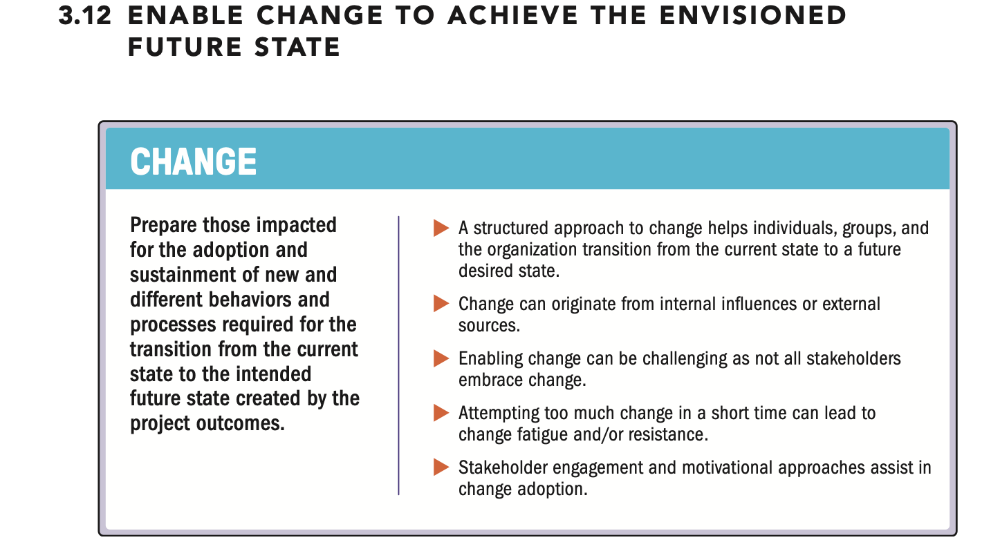

| English | Vietnamese |
|---------|------------|
| ▶ Remaining relevant in today’s business environment is a fundamental challenge for all organizations. | ▶ Duy trì sự phù hợp trong môi trường kinh doanh ngày nay là một thách thức cơ bản đối với tất cả các tổ chức. |
| ▶ Relevance entails being responsive to stakeholder needs and desires. | ▶ Sự phù hợp đòi hỏi phải phản ứng nhanh với nhu cầu và mong muốn của các bên liên quan. |
| ▶ This requires continually evaluating offerings for the benefit of stakeholders, rapidly responding to changes, and acting as agents for change. | ▶ Điều này yêu cầu đánh giá liên tục các sản phẩm/dịch vụ nhằm mang lại lợi ích cho các bên liên quan, phản ứng nhanh với các thay đổi, và đóng vai trò như những tác nhân thúc đẩy thay đổi. |
| ▶ Project managers are uniquely poised to keep an organization prepared for changes. | ▶ Các nhà quản lý dự án có vị trí đặc biệt để giữ cho tổ chức luôn sẵn sàng đối mặt với thay đổi. |
| ▶ Projects, by their very definition, create something new: they are agents of change. | ▶ Bản chất của dự án là tạo ra điều gì đó mới: chúng là những tác nhân thúc đẩy thay đổi. |
| ▶ Change management, or enablement, is a comprehensive, cyclic, and structured approach for transitioning individuals, groups, and organizations from a current state to a future state in which they realize desired benefits. | ▶ Quản lý thay đổi, hay hỗ trợ thay đổi, là một phương pháp toàn diện, tuần hoàn và có cấu trúc để chuyển đổi các cá nhân, nhóm và tổ chức từ trạng thái hiện tại sang trạng thái tương lai, nơi họ đạt được các lợi ích mong muốn. |
| ▶ It is different from project change control, which is a process whereby modifications to documents, deliverables, or baselines associated with the project are identified and documented, and then are approved or rejected. | ▶ Nó khác với kiểm soát thay đổi dự án, đó là một quy trình mà theo đó các sửa đổi đối với tài liệu, sản phẩm giao, hoặc các đường cơ sở liên quan đến dự án được xác định, ghi lại và sau đó được chấp thuận hoặc từ chối. |
| English | Vietnamese |
|---------|------------|
| ▶ Change in an organization can originate from internal sources, such as the need for a new capability or in response to a performance gap. | ▶ Thay đổi trong một tổ chức có thể xuất phát từ các nguồn nội bộ, chẳng hạn như nhu cầu về một năng lực mới hoặc để phản ứng với khoảng cách hiệu suất. |
| ▶ Change can also originate from external sources such as technological advances, demographic changes, or socioeconomic pressures. | ▶ Thay đổi cũng có thể xuất phát từ các nguồn bên ngoài như tiến bộ công nghệ, thay đổi nhân khẩu học hoặc áp lực kinh tế - xã hội. |
| ▶ Any type of change involves some level of adaptability or assimilation by the group experiencing the change as well as the industries with which the group interacts. | ▶ Mọi loại thay đổi đều liên quan đến một mức độ khả năng thích ứng hoặc hòa nhập của nhóm trải nghiệm thay đổi cũng như các ngành công nghiệp mà nhóm tương tác. |
| ▶ Change may be implemented by and have consequences for stakeholders. | ▶ Thay đổi có thể được thực hiện bởi các bên liên quan và ảnh hưởng đến họ. |
| ▶ Enabling stakeholder change is part of facilitating the project to provide the required deliverable as well as the intended outcome. | ▶ Thúc đẩy sự thay đổi của các bên liên quan là một phần của việc hỗ trợ dự án để cung cấp sản phẩm giao yêu cầu cũng như kết quả dự kiến. |
| ▶ Enabling change in an organization can be challenging. | ▶ Thúc đẩy thay đổi trong tổ chức có thể là một thách thức. |
| ▶ Some people may seem inherently resistant to change or risk averse, and environments may display a conservative culture, among other reasons. | ▶ Một số người có thể vốn kháng cự thay đổi hoặc ngại rủi ro, và môi trường làm việc có thể thể hiện văn hóa bảo thủ, cùng các lý do khác. |
| ▶ Effective change management uses a motivational strategy rather than a forceful one. | ▶ Quản lý thay đổi hiệu quả sử dụng chiến lược động viên thay vì cưỡng ép. |
| ▶ Engagement and two-way communication create an environment in which adoption and assimilation of change can occur or identify some valid concerns from the resistant users that may need to be addressed. | ▶ Sự tham gia và giao tiếp hai chiều tạo ra môi trường mà trong đó việc chấp nhận và hòa nhập thay đổi có thể xảy ra hoặc xác định một số mối quan ngại hợp lý từ những người chống lại thay đổi mà cần được giải quyết. |
| ▶ Project team members and project managers can work with relevant stakeholders to address resistance, fatigue, and change absorption to increase the probability that change will be adopted or assimilated successfully by customers or recipients of project deliverables. | ▶ Các thành viên nhóm dự án và quản lý dự án có thể làm việc với các bên liên quan phù hợp để giải quyết sự kháng cự, mệt mỏi và khả năng hấp thụ thay đổi nhằm tăng khả năng thay đổi sẽ được khách hàng hoặc người nhận sản phẩm dự án chấp nhận hoặc hòa nhập thành công. |
| ▶ This includes communicating the vision and goals associated with the change early in the project to achieve buy-in for the change. | ▶ Điều này bao gồm việc truyền đạt tầm nhìn và mục tiêu liên quan đến thay đổi ngay từ đầu dự án để đạt được sự đồng thuận cho thay đổi. |
| ▶ The benefits of the change and the impact on work processes should be communicated to all levels of the organization throughout the project. | ▶ Lợi ích của thay đổi và tác động đến quy trình làm việc nên được truyền đạt đến tất cả các cấp của tổ chức trong suốt dự án. |
| ▶ It is also important to adapt the speed of change to the change appetite, cost, and ability of the stakeholders and the environment to assimilate change. | ▶ Cũng quan trọng để điều chỉnh tốc độ thay đổi phù hợp với mức độ sẵn sàng thay đổi, chi phí và khả năng của các bên liên quan cũng như môi trường để hòa nhập thay đổi. |
| ▶ Attempting to create too many changes in too short a time can lead to resistance because of change saturation. | ▶ Cố gắng tạo quá nhiều thay đổi trong một thời gian quá ngắn có thể dẫn đến kháng cự do bão hòa thay đổi. |
| ▶ Even when stakeholders unanimously agree that change will produce more value or enhance outcomes, they often still have difficulty working through the actions that will deliver enhanced benefits. | ▶ Ngay cả khi các bên liên quan đồng thuận rằng thay đổi sẽ tạo ra nhiều giá trị hơn hoặc cải thiện kết quả, họ vẫn thường gặp khó khăn trong việc thực hiện các hành động để mang lại lợi ích cải thiện. |
| ▶ To foster benefits realization, the project may also include activities to reinforce the change after its implementation in order to avoid people returning to the initial state. | ▶ Để thúc đẩy việc hiện thực hóa lợi ích, dự án cũng có thể bao gồm các hoạt động để củng cố thay đổi sau khi triển khai nhằm tránh việc mọi người quay về trạng thái ban đầu. |
| ▶ Recognizing and addressing the needs of stakeholders to embrace change throughout the project life cycle helps to integrate the resulting change in the project work, making a successful outcome more likely. | ▶ Nhận biết và đáp ứng nhu cầu của các bên liên quan để chấp nhận thay đổi trong suốt vòng đời dự án giúp tích hợp thay đổi vào công việc dự án, làm tăng khả năng đạt được kết quả thành công. |
| ▶ More information on organizational change management may be found in Managing Change in Organizations: A Practice Guide [4]. | ▶ Thông tin thêm về quản lý thay đổi tổ chức có thể được tìm thấy trong Managing Change in Organizations: A Practice Guide [4]. |

| English | Vietnamese |
|---------|------------|
| [1] Project Management Institute. 2016. PMI Lexicon of Project Management Terms. Available from http://www.pmi.org/lexiconterms | [1] Viện Quản lý Dự án (PMI). 2016. Từ điển thuật ngữ quản lý dự án của PMI. Có tại: http://www.pmi.org/lexiconterms |
| [2] Project Management Institute. 2006. PMI Code of Ethics and Professional Conduct. Available from http://www.pmi.org/codeofethics | [2] Viện Quản lý Dự án (PMI). 2006. Bộ Quy tắc Đạo đức và Ứng xử nghề nghiệp của PMI. Có tại: http://www.pmi.org/codeofethics |
| [3] Project Management Institute. 2019. The Standard for Risk Management in Portfolios, Programs, and Projects. Newtown Square, PA: Author. | [3] Viện Quản lý Dự án (PMI). 2019. Tiêu chuẩn Quản lý Rủi ro trong Danh mục, Chương trình và Dự án. Newtown Square, PA: Tác giả. |
| [4] Project Management Institute. 2013. Managing Change in Organizations: A Practice Guide. Newtown Square, PA: Author. | [4] Viện Quản lý Dự án (PMI). 2013. Quản lý Thay đổi trong Tổ chức: Hướng dẫn Thực hành. Newtown Square, PA: Tác giả. |

